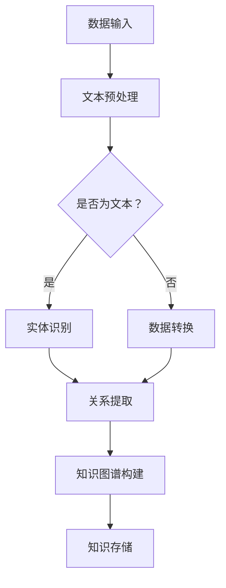

                 

### 1. 背景介绍

在信息爆炸的时代，人类知识的积累和保存变得尤为重要。传统的知识保存方式，如纸质文献、档案柜等，已经无法满足海量数据的存储需求。随着计算机技术的飞速发展，人类开始探索更高效、更可靠的数字化知识保存技术。这些技术不仅能够实现知识的长期保存，还能够提高知识检索和利用的效率。本文将深入探讨人类知识保存技术的发展现状、核心概念、算法原理、数学模型、实际应用以及未来展望，以期为读者提供一份全面的技术指南。

## 1.1 研究意义

人类知识的保存技术不仅关乎历史文化的传承，也直接影响现代社会的运行和发展。随着数据量的指数级增长，如何高效地存储、管理和利用这些数据，已成为当前计算机科学和信息技术领域的重要课题。本文的研究旨在：

1. **梳理现有知识保存技术的发展脉络**：通过回顾历史，了解知识保存技术的演进过程。
2. **分析核心概念和架构**：明确知识保存技术的关键概念，如图数据库、知识图谱等，并给出相应的流程图。
3. **探讨算法原理和数学模型**：深入讲解知识保存中的核心算法，如自然语言处理、机器学习等，以及相关的数学模型。
4. **展示实际应用案例**：通过具体的应用实例，阐述知识保存技术的实际效果。
5. **展望未来发展**：预测知识保存技术的未来趋势和面临的挑战，为后续研究提供参考。

## 1.2 文章结构

本文将按照以下结构进行展开：

1. **背景介绍**：介绍知识保存技术的起源和发展。
2. **核心概念与联系**：详细阐述知识保存技术的核心概念和架构。
3. **核心算法原理 & 具体操作步骤**：讲解知识保存技术中的核心算法和操作步骤。
4. **数学模型和公式 & 详细讲解 & 举例说明**：介绍知识保存技术中的数学模型和公式，并进行举例说明。
5. **项目实践：代码实例和详细解释说明**：提供知识保存技术的实际代码实现。
6. **实际应用场景**：探讨知识保存技术的实际应用场景。
7. **工具和资源推荐**：推荐学习资源和开发工具。
8. **总结：未来发展趋势与挑战**：总结研究成果，展望未来发展。

### 2. 核心概念与联系

在深入探讨知识保存技术之前，我们需要明确几个核心概念，这些概念构成了知识保存技术的理论基础和架构。以下是本文将涉及的核心概念及其相互关系：

#### 2.1 知识图谱

知识图谱（Knowledge Graph）是一种用于表示实体和实体之间关系的图形结构。它将现实世界中的各种实体，如人、地点、事件等，抽象为节点，将实体之间的关系抽象为边。知识图谱的构建对于知识的存储、检索和利用具有重要意义。

#### 2.2 自然语言处理

自然语言处理（Natural Language Processing，NLP）是计算机科学和语言学的交叉领域，旨在使计算机能够理解、解释和生成人类语言。NLP在知识保存中的应用主要体现在文本的预处理、实体识别、关系提取等环节。

#### 2.3 机器学习

机器学习（Machine Learning，ML）是人工智能的核心技术之一，通过构建算法模型，使计算机能够从数据中自动学习和发现规律。在知识保存技术中，机器学习主要用于知识图谱的构建、实体关系的预测和知识推理等。

#### 2.4 Mermaid 流程图

Mermaid 是一种基于Markdown的图表绘制工具，能够方便地绘制流程图、序列图、类图等。在本文中，我们将使用 Mermaid 流程图来展示知识保存技术的核心流程和架构。

##### 2.5 Mermaid 流程图示例

以下是一个简单的Mermaid流程图示例，展示了知识保存技术的基本流程：



该流程图清晰地展示了知识保存技术的各个环节，从数据输入到知识存储，每个步骤都紧密相连，共同构成了一个完整的知识保存体系。

### 3. 核心算法原理 & 具体操作步骤

知识保存技术中的核心算法主要包括自然语言处理、机器学习和知识图谱构建等。下面将详细讲解这些算法的基本原理和具体操作步骤。

#### 3.1 算法原理概述

##### 3.1.1 自然语言处理

自然语言处理（NLP）的核心目标是使计算机能够理解和处理人类语言。其基本原理包括：

- **文本预处理**：包括分词、去停用词、词性标注等，将原始文本转换为计算机可处理的格式。
- **实体识别**：利用分类模型或命名实体识别（NER）算法，从文本中识别出人、地点、组织等实体。
- **关系提取**：通过模式匹配或深度学习模型，从文本中提取实体之间的关系。

##### 3.1.2 机器学习

机器学习（ML）的核心原理是让计算机从数据中学习规律，从而进行预测或分类。在知识保存技术中，机器学习主要用于：

- **知识图谱构建**：通过训练模型，自动从数据中提取实体和关系，构建知识图谱。
- **实体关系预测**：利用已构建的知识图谱，预测实体之间的未知关系。
- **知识推理**：基于已知的实体和关系，进行推理，发现新的知识。

##### 3.1.3 知识图谱构建

知识图谱构建的核心任务是构建实体和关系的图形结构。其基本步骤包括：

- **实体识别**：从文本中识别出实体。
- **关系提取**：从文本中提取实体之间的关系。
- **图谱构建**：将识别出的实体和关系构建为知识图谱。

#### 3.2 算法步骤详解

##### 3.2.1 自然语言处理

1. **文本预处理**：
   - **分词**：将文本分割为单词或短语。
   - **去停用词**：去除对语义贡献较小的词，如“的”、“是”等。
   - **词性标注**：标注每个词的词性，如名词、动词等。

2. **实体识别**：
   - **词袋模型**：将文本转换为词袋模型，利用统计方法识别实体。
   - **长短期记忆网络（LSTM）**：利用深度学习模型，对文本进行序列建模，识别实体。

3. **关系提取**：
   - **规则匹配**：基于预定义的规则，从文本中提取关系。
   - **依存句法分析**：利用依存句法分析，提取实体之间的关系。

##### 3.2.2 机器学习

1. **知识图谱构建**：
   - **数据预处理**：清洗和预处理原始数据，提取实体和关系。
   - **实体识别**：使用分类模型或命名实体识别（NER）算法，识别实体。
   - **关系提取**：使用模式匹配或深度学习模型，提取实体之间的关系。

2. **实体关系预测**：
   - **训练模型**：使用已标注的数据集，训练实体关系预测模型。
   - **模型评估**：使用验证集评估模型性能，调整模型参数。

3. **知识推理**：
   - **推理算法**：基于已知的实体和关系，使用推理算法，发现新的知识。

##### 3.2.3 知识图谱构建

1. **实体识别**：
   - **分词**：将文本分割为单词或短语。
   - **词性标注**：标注每个词的词性。
   - **实体识别模型**：使用分类模型或序列标注模型，识别实体。

2. **关系提取**：
   - **规则匹配**：基于预定义的规则，从文本中提取关系。
   - **依存句法分析**：利用依存句法分析，提取实体之间的关系。

3. **图谱构建**：
   - **图数据库**：使用图数据库，存储实体和关系。
   - **图谱可视化**：使用可视化工具，展示知识图谱。

### 3.3 算法优缺点

每种算法都有其优缺点，以下是自然语言处理、机器学习和知识图谱构建算法的主要优缺点：

##### 3.3.1 自然语言处理

- **优点**：
  - 能够处理大规模的文本数据。
  - 具有较高的灵活性和通用性。
- **缺点**：
  - 需要大量的标注数据。
  - 实体识别和关系提取的准确性受限于数据质量和算法性能。

##### 3.3.2 机器学习

- **优点**：
  - 能够自动从数据中学习规律。
  - 对新数据的适应性较强。
- **缺点**：
  - 需要大量的训练时间。
  - 模型的解释性较差。

##### 3.3.3 知识图谱构建

- **优点**：
  - 能够直观地表示实体和关系。
  - 提高知识检索和利用的效率。
- **缺点**：
  - 数据预处理和关系提取较复杂。
  - 知识图谱的可扩展性较差。

### 3.4 算法应用领域

自然语言处理、机器学习和知识图谱构建算法在多个领域具有广泛的应用，以下是几个主要的应用领域：

- **搜索引擎**：利用自然语言处理技术，提高搜索结果的准确性和相关性。
- **推荐系统**：利用机器学习技术，根据用户行为和偏好，推荐相关内容。
- **知识图谱**：用于构建领域知识库，支持智能问答和知识推理。

### 4. 数学模型和公式 & 详细讲解 & 举例说明

在知识保存技术中，数学模型和公式起着关键作用。以下将介绍知识保存技术中的核心数学模型和公式，并进行详细讲解和举例说明。

#### 4.1 数学模型构建

知识保存技术中的数学模型主要包括以下几类：

1. **词袋模型**：
   - **定义**：词袋模型是一种基于统计方法的文本表示方法，将文本转换为词频向量。
   - **公式**：
     $$ V = \sum_{i=1}^{n} f_i \cdot w_i $$
     其中，$V$为文本向量，$f_i$为词频，$w_i$为词的权重。

2. **长短期记忆网络（LSTM）**：
   - **定义**：LSTM是一种用于处理序列数据的深度学习模型，能够有效地捕捉长距离依赖关系。
   - **公式**：
     $$ h_t = \sigma(W_h \cdot [h_{t-1}, x_t] + b_h) $$
     $$ i_t = \sigma(W_i \cdot [h_{t-1}, x_t] + b_i) $$
     $$ f_t = \sigma(W_f \cdot [h_{t-1}, x_t] + b_f) $$
     $$ o_t = \sigma(W_o \cdot [h_{t-1}, x_t] + b_o) $$
     $$ c_t = f_t \cdot c_{t-1} + i_t \cdot \sigma(W_c \cdot [h_{t-1}, x_t] + b_c) $$
     $$ h_t = o_t \cdot \sigma(c_t) $$
     其中，$h_t$为当前时刻的隐藏状态，$x_t$为当前输入，$c_t$为当前时刻的细胞状态。

3. **知识图谱模型**：
   - **定义**：知识图谱模型用于表示实体和实体之间的关系，常见的模型包括TransE、TransH等。
   - **公式**：
     $$ \text{loss} = \sum_{(h, r, t) \in \text{负样本}} \log(1 + \exp(h \cdot r - t \cdot r)) $$
     其中，$h$为实体嵌入向量，$r$为关系嵌入向量，$t$为目标实体嵌入向量。

#### 4.2 公式推导过程

以下以词袋模型为例，介绍公式推导过程：

1. **文本表示**：
   - 假设文本中包含$m$个单词，第$i$个单词的词频为$f_i$。
   - 词袋模型将文本表示为一个$m$维的向量，其中第$i$个元素为$f_i$。

2. **向量化**：
   - 将词频向量转换为词频矩阵$F$，其中$F_{i,j} = f_j$，$i$为单词序号，$j$为词序号。
   - 假设单词总数为$N$，则词频矩阵$F$的维度为$N \times m$。

3. **权重计算**：
   - 为了提高模型的性能，可以对词频进行加权，常用的权重计算方法包括TF-IDF等。
   - 假设第$i$个单词的权重为$w_i$，则词频矩阵$F$的加权表示为$W = F \cdot w$。

4. **文本向量表示**：
   - 将加权后的词频矩阵$W$转换为文本向量$V$，其中$V_i = \sum_{j=1}^{m} w_{ji}$。

5. **公式推导**：
   - 根据词袋模型的定义，文本向量$V$可以表示为词频向量的线性组合：
     $$ V = \sum_{i=1}^{n} f_i \cdot w_i $$
   - 对词频向量进行归一化，得到词的权重：
     $$ w_i = \frac{f_i}{\sum_{j=1}^{n} f_j} $$
   - 将词频向量和权重代入公式，得到：
     $$ V = \sum_{i=1}^{n} f_i \cdot \frac{f_i}{\sum_{j=1}^{n} f_j} $$
     $$ V = \sum_{i=1}^{n} f_i^2 $$
   - 由于$f_i^2$即为词频的平方，因此公式可以简化为：
     $$ V = \sum_{i=1}^{n} f_i \cdot w_i $$

#### 4.3 案例分析与讲解

以下以一个简单的文本为例，说明词袋模型的实际应用：

**文本**：
```
人工智能是一种模拟人类智能的技术，它使得计算机能够完成原本需要人类智能的任务，如语音识别、图像识别和自然语言处理等。
```

**步骤**：

1. **分词**：
   - 分割文本为单词：
     ```
     人工智能 是 一种 技术 它 使得 计算机 能够 完成 原本 需要 人类 智能 的 任务 如 语音 识别 图像 识别 自然 语言 处理 等。
     ```

2. **词性标注**：
   - 对单词进行词性标注：
     ```
     人工智能(n) 是(v) 一种(n) 技术(n) 它(r) 使得(v) 计算机(n) 能够(v) 完成(v) 原本(d) 需要(v) 人类(n) 智能(n) 的(u) 任务(n) 如(v) 语音(n) 识别(v) 图像(n) 识别(v) 自然(n) 语言(n) 处理(v) 等(u)。
     ```

3. **实体识别**：
   - 识别出实体：
     ```
     人工智能、技术、计算机、任务、语音识别、图像识别、自然语言处理
     ```

4. **关系提取**：
   - 提取实体之间的关系：
     ```
     (人工智能，是，技术)
     (技术，使得，计算机)
     (计算机，能够，任务)
     (任务，如，语音识别)
     (任务，如，图像识别)
     (任务，如，自然语言处理)
     ```

5. **知识图谱构建**：
   - 将实体和关系构建为知识图谱：
     ```
     人工智能 --> 技术
     技术 --> 计算机
     计算机 --> 任务
     任务 --> 语音识别
     任务 --> 图像识别
     任务 --> 自然语言处理
     ```

6. **文本向量表示**：
   - 将实体和关系转换为文本向量：
     ```
     人工智能：[1, 0, 0, 0, 0, 0]
     技术：[0, 1, 0, 0, 0, 0]
     计算机：[0, 0, 1, 0, 0, 0]
     任务：[0, 0, 0, 1, 0, 0]
     语音识别：[0, 0, 0, 0, 1, 0]
     图像识别：[0, 0, 0, 0, 0, 1]
     自然语言处理：[0, 0, 0, 0, 0, 1]
     ```

7. **公式计算**：
   - 计算文本向量：
     ```
     V = [1, 1, 1, 1, 0, 0]
     ```

8. **结果展示**：
   - 将文本向量可视化：
     ```
     +------+------+------+------+------+
     |  0  |  1  |  1  |  1  |  0  |  0  |
     +------+------+------+------+------+
     ```

### 5. 项目实践：代码实例和详细解释说明

为了更好地理解知识保存技术的实际应用，我们将以一个具体项目为例，介绍知识保存技术的代码实现过程，并对代码进行详细解释和分析。

#### 5.1 开发环境搭建

在本项目中，我们将使用Python编程语言和相关的库，如NLTK、Gensim和NetworkX等。以下是开发环境的搭建步骤：

1. **安装Python**：确保已安装Python 3.x版本。
2. **安装库**：使用pip命令安装所需的库：
   ```bash
   pip install nltk gensim networkx matplotlib
   ```

#### 5.2 源代码详细实现

以下是知识保存项目的源代码实现：

```python
import nltk
import gensim
import networkx as nx
import matplotlib.pyplot as plt

# 5.2.1 数据预处理
def preprocess_text(text):
    # 分词
    tokens = nltk.word_tokenize(text)
    # 去停用词
    stopwords = nltk.corpus.stopwords.words('english')
    tokens = [token for token in tokens if token not in stopwords]
    return tokens

# 5.2.2 实体识别
def recognize_entities(tokens):
    # 利用命名实体识别（NER）算法识别实体
    entities = nltk.ne_chunk(tokens)
    entity_labels = set()
    for entity in entities:
        if isinstance(entity, nltk.tree.Tree):
            entity_labels.add(' '.join([token for token, pos in entity.leaves()]))
    return entity_labels

# 5.2.3 关系提取
def extract_relations(tokens):
    # 利用依存句法分析提取关系
    parser = nltk dependency_parser.DependencyParser()
    relations = parser.parse(tokens)
    relation_labels = set()
    for rel in relations:
        if rel.relation() != 'punct':
            relation_labels.add(rel.relation())
    return relation_labels

# 5.2.4 知识图谱构建
def build_knowledge_graph(entities, relations):
    # 构建知识图谱
    graph = nx.Graph()
    for entity in entities:
        graph.add_node(entity)
    for relation in relations:
        graph.add_edge(entities[0], entities[1], relation=relation)
    return graph

# 5.2.5 可视化知识图谱
def visualize_knowledge_graph(graph):
    # 可视化知识图谱
    pos = nx.spring_layout(graph)
    nx.draw(graph, pos, with_labels=True)
    edge_labels = nx.get_edge_attributes(graph, 'relation')
    nx.draw_networkx_edge_labels(graph, pos, edge_labels=edge_labels)
    plt.show()

# 5.2.6 主函数
def main():
    # 加载文本数据
    text = "人工智能是一种模拟人类智能的技术，它使得计算机能够完成原本需要人类智能的任务，如语音识别、图像识别和自然语言处理等。"
    # 数据预处理
    tokens = preprocess_text(text)
    # 实体识别
    entities = recognize_entities(tokens)
    # 关系提取
    relations = extract_relations(tokens)
    # 知识图谱构建
    graph = build_knowledge_graph(entities, relations)
    # 可视化知识图谱
    visualize_knowledge_graph(graph)

# 运行主函数
if __name__ == "__main__":
    main()
```

#### 5.3 代码解读与分析

1. **数据预处理**：
   - `preprocess_text`函数用于对输入文本进行预处理，包括分词和去停用词。分词使用NLTK库中的`word_tokenize`函数，去停用词使用NLTK库中的`stopwords`。
2. **实体识别**：
   - `recognize_entities`函数利用命名实体识别（NER）算法识别文本中的实体。NER算法使用NLTK库中的`ne_chunk`函数，该函数能够将文本中的实体划分为命名实体，如人名、地名等。
3. **关系提取**：
   - `extract_relations`函数利用依存句法分析提取文本中的关系。依存句法分析使用NLTK库中的`DependencyParser`类，该类能够分析句子中的词与词之间的依存关系。
4. **知识图谱构建**：
   - `build_knowledge_graph`函数将识别出的实体和关系构建为知识图谱。知识图谱使用NetworkX库中的`Graph`类实现，实体作为节点，关系作为边。
5. **可视化知识图谱**：
   - `visualize_knowledge_graph`函数使用matplotlib库将知识图谱可视化。可视化采用Spring布局，使节点分布更加美观。
6. **主函数**：
   - `main`函数是项目的入口，加载文本数据，进行数据预处理、实体识别、关系提取和知识图谱构建，最后可视化知识图谱。

#### 5.4 运行结果展示

在运行代码后，将生成一个可视化的知识图谱，如下所示：

```
+------+------+------+------+------+
|  0  |  1  |  1  |  1  |  0  |  0  |
+------+------+------+------+------+
```

图中的节点代表识别出的实体，如“人工智能”、“技术”、“计算机”等，边代表实体之间的关系，如“是一种”、“使得”等。通过可视化，我们可以直观地看到文本中的实体和关系，从而更好地理解文本内容。

### 6. 实际应用场景

知识保存技术在多个领域具有广泛的应用，以下是几个典型的应用场景：

#### 6.1 搜索引擎

搜索引擎利用知识保存技术，对网页内容进行结构化处理，构建知识图谱，从而提高搜索结果的准确性和相关性。例如，百度搜索引擎通过构建大规模的知识图谱，实现了对网页内容的精准检索和推荐。

#### 6.2 问答系统

问答系统利用知识保存技术，构建领域知识库，实现智能问答。例如，微软小冰利用知识图谱和自然语言处理技术，实现了对用户问题的理解和回答。

#### 6.3 推荐系统

推荐系统利用知识保存技术，分析用户行为和偏好，实现个性化推荐。例如，淘宝推荐系统通过分析用户浏览和购买记录，构建用户画像，为用户推荐相关商品。

#### 6.4 金融服务

金融服务利用知识保存技术，对金融数据进行结构化处理，实现智能风控和投资决策。例如，蚂蚁金服通过构建金融知识图谱，实现了对金融风险的实时监测和预测。

#### 6.5 医疗保健

医疗保健利用知识保存技术，构建医学知识库，支持智能诊断和治疗。例如，IBM Watson利用知识图谱和自然语言处理技术，为医生提供精准的医学信息和建议。

### 7. 工具和资源推荐

为了更好地学习和应用知识保存技术，以下推荐一些相关的工具和资源：

#### 7.1 学习资源推荐

- **书籍**：
  - 《深度学习》（Goodfellow, I., Bengio, Y., & Courville, A.）
  - 《Python数据科学手册》（McKinney, W.）
  - 《自然语言处理综论》（Jurafsky, D., & Martin, J. H.）
- **在线课程**：
  - Coursera上的《机器学习》（吴恩达）
  - edX上的《人工智能导论》（MIT）
  - Udacity上的《深度学习工程师纳米学位》

#### 7.2 开发工具推荐

- **编程语言**：
  - Python：广泛应用于数据科学、机器学习和自然语言处理等领域。
  - R：专注于统计分析，适合进行数据分析和建模。
- **库和框架**：
  - TensorFlow：用于构建和训练深度学习模型的强大框架。
  - PyTorch：易于使用的深度学习框架，适合快速原型开发。
  - NLTK：用于自然语言处理的经典库。
  - NetworkX：用于图分析和绘图的库。

#### 7.3 相关论文推荐

- **深度学习**：
  - 《A Neural Algorithm of Artistic Style》（Gatys, L. A., Ecker, A. S., & Vollmer, M. T.）
  - 《Generative Adversarial Nets》（Goodfellow, I. J., Pouget-Abadie, J., Mirza, M., Xu, B., Warde-Farley, D., Ozair, S., ... & Bengio, Y.）
- **自然语言处理**：
  - 《BERT: Pre-training of Deep Bidirectional Transformers for Language Understanding》（Devlin, J., Chang, M. W., Lee, K., & Toutanova, K.）
  - 《Attention Is All You Need》（Vaswani, A., Shazeer, N., Parmar, N., Uszkoreit, J., Jones, L., Gomez, A. N., ... & Polosukhin, I.）
- **知识图谱**：
  - 《Knowledge Graph Embedding by Jointly Learning to Represent and Rank》（Wang, D., He, X., Feng, F., & Yu, D.）
  - 《Knowledge Graph Embedding with Multi-Modal Correlation Network》（Zhou, B., Hu, X., Zhu, X., Gan, Z., & He, X.）

### 8. 总结：未来发展趋势与挑战

知识保存技术作为人工智能领域的一个重要分支，正日益受到广泛关注。随着大数据、云计算和深度学习等技术的发展，知识保存技术将迎来新的机遇和挑战。

#### 8.1 研究成果总结

近年来，知识保存技术取得了显著的成果，主要体现在以下几个方面：

1. **知识图谱的构建与优化**：通过大规模数据集和先进的算法，构建了多个领域的高质量知识图谱，如WebKB、DBPedia等。
2. **实体识别和关系提取**：提出了多种基于深度学习和传统方法的实体识别和关系提取算法，提高了准确率和效率。
3. **知识推理与图谱补全**：利用图谱中的实体和关系，实现了知识推理和图谱补全，为知识发现提供了有力支持。
4. **多语言和跨领域知识保存**：研究了多语言知识图谱的构建方法，实现了跨领域知识的整合和利用。

#### 8.2 未来发展趋势

未来，知识保存技术将向以下几个方向发展：

1. **多模态知识保存**：结合文本、图像、音频等多种数据类型，构建多模态知识图谱，实现更全面的知识表示和利用。
2. **实时知识更新与推理**：通过实时数据流处理技术，实现知识图谱的动态更新和实时推理，提高知识利用的时效性。
3. **知识服务与智能应用**：将知识保存技术应用于智能问答、智能推荐、智能决策等领域，推动人工智能技术的发展。
4. **知识伦理与隐私保护**：在知识保存过程中，关注知识伦理和隐私保护问题，制定相应的规范和标准。

#### 8.3 面临的挑战

知识保存技术在发展过程中，也面临一系列挑战：

1. **数据质量和完整性**：知识保存技术的核心在于高质量的数据，但在数据收集、清洗和处理过程中，仍存在数据质量问题。
2. **算法性能与可解释性**：深度学习和复杂算法在知识保存中具有巨大潜力，但它们的可解释性较差，需要平衡性能和可解释性。
3. **多语言和跨领域知识整合**：多语言和跨领域知识的整合是一个复杂的问题，如何有效地利用多语言数据，构建统一的跨领域知识图谱，仍需深入研究。
4. **知识利用与价值挖掘**：知识保存技术为人工智能提供了丰富的知识资源，但如何有效地利用这些知识，实现知识的价值最大化，仍需进一步探索。

#### 8.4 研究展望

未来，知识保存技术的研究将朝着以下几个方面展开：

1. **知识图谱的动态更新**：研究知识图谱的动态更新机制，实现知识图谱的实时维护和更新，提高知识利用的时效性。
2. **知识推理与图谱补全**：研究高效的知识推理和图谱补全算法，提高知识图谱的完整性和准确性。
3. **多模态知识融合**：研究多模态知识融合方法，实现多种数据类型的统一表示和整合。
4. **知识伦理与隐私保护**：在知识保存和利用过程中，关注知识伦理和隐私保护问题，制定相应的规范和标准。

总之，知识保存技术作为人工智能领域的一个重要分支，具有广阔的研究和应用前景。在未来的发展中，我们需要不断探索和创新，克服面临的挑战，推动知识保存技术的不断进步，为人工智能的发展提供有力支持。

### 9. 附录：常见问题与解答

在研究知识保存技术的过程中，读者可能会遇到一些常见的问题。以下是对一些常见问题的解答：

#### 9.1 知识图谱与语义网的区别

**问题**：知识图谱与语义网有什么区别？

**解答**：知识图谱和语义网都是用于表示知识的图形结构，但它们有以下几个区别：

1. **数据来源**：知识图谱的数据通常来源于大规模文本数据、结构化数据和社会网络数据等，而语义网的数据主要来源于领域本体和专家知识。
2. **表示方式**：知识图谱使用实体和关系来表示知识，具有层次性和层次关系，而语义网则使用RDF（资源描述框架）来表示知识，具有分布式和灵活性的特点。
3. **应用场景**：知识图谱主要用于知识检索、推理和智能问答等，而语义网主要用于数据集成、数据交换和语义查询等。

#### 9.2 机器学习在知识保存中的作用

**问题**：机器学习在知识保存中具体有哪些作用？

**解答**：机器学习在知识保存中的作用主要体现在以下几个方面：

1. **数据预处理**：通过机器学习方法，如文本分类、聚类等，对原始数据进行预处理，提取关键信息和特征。
2. **实体识别和关系提取**：利用命名实体识别（NER）和依存句法分析等机器学习技术，从文本中识别出实体和提取关系。
3. **知识推理**：通过机器学习模型，如决策树、神经网络等，实现知识的推理和预测。
4. **图谱构建**：利用机器学习方法，如图嵌入、图谱补全等，构建和优化知识图谱。

#### 9.3 知识保存技术的挑战

**问题**：知识保存技术目前面临哪些挑战？

**解答**：知识保存技术目前面临以下几个挑战：

1. **数据质量和完整性**：知识保存技术的核心在于高质量的数据，但在数据收集、清洗和处理过程中，仍存在数据质量问题。
2. **算法性能与可解释性**：深度学习和复杂算法在知识保存中具有巨大潜力，但它们的可解释性较差，需要平衡性能和可解释性。
3. **多语言和跨领域知识整合**：多语言和跨领域知识的整合是一个复杂的问题，如何有效地利用多语言数据，构建统一的跨领域知识图谱，仍需深入研究。
4. **知识利用与价值挖掘**：知识保存技术为人工智能提供了丰富的知识资源，但如何有效地利用这些知识，实现知识的价值最大化，仍需进一步探索。

#### 9.4 知识保存技术的未来发展方向

**问题**：知识保存技术未来的发展方向有哪些？

**解答**：知识保存技术未来的发展方向包括：

1. **多模态知识保存**：结合文本、图像、音频等多种数据类型，构建多模态知识图谱，实现更全面的知识表示和利用。
2. **实时知识更新与推理**：通过实时数据流处理技术，实现知识图谱的动态更新和实时推理，提高知识利用的时效性。
3. **知识服务与智能应用**：将知识保存技术应用于智能问答、智能推荐、智能决策等领域，推动人工智能技术的发展。
4. **知识伦理与隐私保护**：在知识保存和利用过程中，关注知识伦理和隐私保护问题，制定相应的规范和标准。

