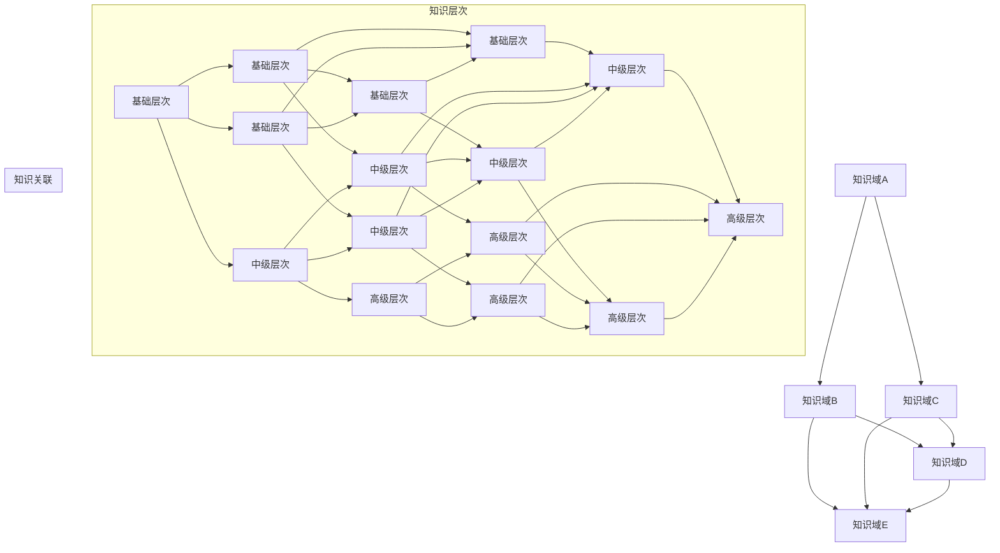

                 

 在这个数字化的时代，人类知识的快速增长和不断扩展使得我们面临着前所未有的挑战。为了更好地组织和理解这些知识，我们需要一个有序的分类体系。本文将探讨人类知识的分类体系，从不同角度对其进行深入剖析，旨在揭示知识的秩序之美。

> 关键词：人类知识分类体系、知识组织、信息架构、逻辑结构、思维模式

> 摘要：本文将从背景介绍、核心概念与联系、核心算法原理、数学模型与公式、项目实践、实际应用场景、工具和资源推荐以及总结与展望等方面，详细探讨人类知识的分类体系。通过这一体系的解析，我们将揭示知识的内在联系，为读者提供一种更加清晰、系统的思维方式。

## 1. 背景介绍

在人类历史上，知识一直是推动社会进步的重要力量。从古代的哲学、科学、艺术，到现代的计算机科学、经济学、生物学，知识的积累和发展始终伴随着人类社会的发展。然而，随着知识的不断增长，如何有效地组织和理解这些知识成为一个亟待解决的问题。

传统的分类体系往往基于学科的划分，如自然科学、社会科学、人文学科等。这种分类方式在一定程度上能够帮助我们理解不同领域的知识，但难以应对跨学科的交叉研究需求。此外，随着信息技术的飞速发展，知识的表现形式也日益多样化，传统的分类体系难以适应这种变化。

因此，构建一个更加科学、有序、灵活的知识分类体系成为当今学术界和信息技术领域的重要课题。本文将基于这一背景，探讨人类知识的分类体系，试图揭示其内在的逻辑结构和思维模式。

### 1.1 知识的定义与分类

知识是指通过学习、实践和经验积累得到的信息、技能和认知。根据不同的分类标准，知识可以分为多种类型：

- **事实性知识**：关于自然界、社会现象和人类文化等方面的客观事实。
- **概念性知识**：关于事物概念、定义、分类和关系的抽象知识。
- **过程性知识**：关于如何进行某种活动或完成任务的操作性知识。
- **情境性知识**：与特定情境或背景相关的知识。

这些不同类型的知识相互交织、相互影响，共同构成了人类知识的整体结构。

### 1.2 知识组织与分类的挑战

在知识组织与分类过程中，我们面临着以下挑战：

- **知识多样性与复杂性**：知识的多样性使得分类体系难以统一。
- **跨学科交叉研究**：传统的学科分类难以适应跨学科的研究需求。
- **信息技术的进步**：数字化的知识形态对分类体系提出了新的要求。
- **知识更新速度**：知识的快速更新使得分类体系难以保持时效性。

为了应对这些挑战，我们需要构建一个更加科学、灵活、动态的知识分类体系，以更好地组织和理解人类知识。

## 2. 核心概念与联系

在构建人类知识的分类体系时，我们需要明确一些核心概念，并探讨它们之间的联系。

### 2.1 知识域与知识层次

知识域是指特定领域内的知识集合，如数学、物理学、计算机科学等。知识层次则是指知识的抽象程度，从基础概念到复杂理论，分为多个层次。


在这个模型中，知识层次从基础到复杂，形成一个金字塔结构。每个知识层次都建立在更低层次的知识基础上，同时为更高层次的知识提供支持。

### 2.2 知识关联与网络结构

知识的关联性是指不同知识域之间的联系和相互作用。通过构建知识网络，我们可以揭示知识之间的内在联系，从而更好地理解和利用这些知识。


在这个知识网络中，各个知识域通过共同的子域形成连接，构成了一个复杂的网络结构。这种网络结构有助于我们发现知识的潜在关联，促进跨学科的研究和知识整合。

### 2.3 知识分类方法

知识分类方法是指对知识进行分类和组织的具体方法。常见的分类方法包括：

- **学科分类法**：基于学科划分的知识分类方法，如《学科分类与代码》。
- **主题分类法**：基于主题或问题领域的知识分类方法，如《杜威十进制分类法》。
- **层次分类法**：基于知识层次的分类方法，如《学科体系结构图》。
- **网络分类法**：基于知识网络结构的分类方法，如《知识图谱》。

这些分类方法各有优劣，适用于不同的应用场景。在实际应用中，我们可以根据具体需求选择合适的分类方法。

### 2.4 Mermaid 流程图

为了更好地展示知识分类体系，我们可以使用 Mermaid 流程图来描述知识层次、知识关联和网络结构。



这个 Mermaid 流程图展示了知识层次、知识关联和网络结构，有助于我们更好地理解人类知识的分类体系。

## 3. 核心算法原理 & 具体操作步骤

在构建人类知识的分类体系时，我们需要借助一系列核心算法来处理和分类知识。以下将介绍这些核心算法的原理和具体操作步骤。

### 3.1 算法原理概述

核心算法主要包括：

- **聚类算法**：用于将相似的知识进行分组，形成不同的知识域。
- **主题建模**：用于发现知识之间的潜在主题和关联。
- **语义网络构建**：用于表示知识之间的语义关系和层次结构。

这些算法共同构成了人类知识分类体系的基础。

### 3.2 算法步骤详解

#### 3.2.1 聚类算法

聚类算法的基本步骤如下：

1. **初始化**：选择一个聚类算法（如K-Means、DBSCAN等）并初始化聚类中心。
2. **分配数据点**：根据数据点与聚类中心的距离，将数据点分配到相应的聚类。
3. **更新中心**：计算每个聚类的中心，并更新聚类中心。
4. **迭代优化**：重复步骤2和3，直到聚类中心不再变化或满足停止条件。

通过聚类算法，我们可以将相似的知识分组，形成不同的知识域。

#### 3.2.2 主题建模

主题建模的基本步骤如下：

1. **数据预处理**：对原始文本数据进行预处理，如分词、去除停用词等。
2. **词向量表示**：将预处理后的文本数据转化为词向量表示。
3. **构建主题模型**：选择一个主题模型（如LDA、NMF等）并训练模型。
4. **提取主题**：根据训练好的模型，提取知识中的潜在主题。
5. **评估与优化**：评估模型提取的主题质量，并根据评估结果进行优化。

通过主题建模，我们可以发现知识之间的潜在关联，为知识分类提供依据。

#### 3.2.3 语义网络构建

语义网络构建的基本步骤如下：

1. **知识表示**：将知识表示为节点和边的形式。
2. **关系提取**：通过自然语言处理技术提取知识之间的语义关系。
3. **网络构建**：将提取到的关系应用于知识表示，构建语义网络。
4. **网络优化**：对构建好的语义网络进行优化，以提高其表示能力。

通过语义网络构建，我们可以表示知识的层次结构和语义关系，为知识分类提供支持。

### 3.3 算法优缺点

每种算法都有其优缺点，以下分别介绍：

- **聚类算法**：
  - **优点**：简单直观，易于实现；可以自动发现知识域。
  - **缺点**：对初始聚类中心敏感；可能产生“孤岛”现象。
- **主题建模**：
  - **优点**：可以发现知识之间的潜在关联；适用于大规模文本数据。
  - **缺点**：对噪声敏感；主题数量难以确定。
- **语义网络构建**：
  - **优点**：可以表示知识的层次结构和语义关系；适用于复杂知识领域。
  - **缺点**：计算复杂度较高；需要大量的预处理和关系提取工作。

在实际应用中，我们可以根据具体需求选择合适的算法，并结合多种算法的优势，构建一个高效、灵活的知识分类体系。

### 3.4 算法应用领域

核心算法在以下领域具有广泛的应用：

- **信息检索**：通过聚类算法和主题建模，可以实现对大规模文本数据的快速检索和分类。
- **推荐系统**：通过聚类算法和语义网络构建，可以为用户提供个性化的知识推荐。
- **知识图谱**：通过主题建模和语义网络构建，可以构建大规模、高层次的语义知识图谱，为智能问答和知识挖掘提供支持。
- **文本挖掘**：通过聚类算法和主题建模，可以自动提取文本中的关键信息和潜在主题，为文本分析提供数据支持。

总之，核心算法在人类知识分类体系中发挥着重要作用，为知识组织、管理和利用提供了有力支持。

## 4. 数学模型和公式 & 详细讲解 & 举例说明

在构建人类知识的分类体系时，数学模型和公式起着至关重要的作用。以下将介绍几个常见的数学模型和公式，并进行详细讲解和举例说明。

### 4.1 数学模型构建

数学模型是指用数学语言和符号描述现实问题的一种抽象形式。在知识分类体系中，我们可以使用以下数学模型：

1. **聚类模型**：用于将相似的知识进行分组。
2. **主题模型**：用于发现知识之间的潜在关联。
3. **语义网络模型**：用于表示知识的层次结构和语义关系。

#### 4.1.1 聚类模型

聚类模型的基本思想是将数据集划分为若干个簇，使得同一簇内的数据点相似度较高，而不同簇之间的数据点相似度较低。常见的聚类模型有：

- **K-Means**：基于距离度量的聚类算法，通过迭代优化聚类中心，将数据点分配到不同的簇。
- **DBSCAN**：基于密度的聚类算法，可以自动发现不同形状和尺寸的簇。

#### 4.1.2 主题模型

主题模型是一种概率模型，用于发现大规模文本数据中的潜在主题。常见的主题模型有：

- **LDA（Latent Dirichlet Allocation）**：基于贝叶斯理论的概率主题模型，通过推断词分布和主题分布，发现文本中的潜在主题。
- **NMF（Non-negative Matrix Factorization）**：基于非负矩阵分解的主题模型，将文本数据分解为词矩阵和主题矩阵，发现文本中的潜在主题。

#### 4.1.3 语义网络模型

语义网络模型是一种用于表示知识层次结构和语义关系的模型。常见的语义网络模型有：

- **RDF（Resource Description Framework）**：用于表示知识的语义关系，采用三元组（主体、谓语、客体）的形式。
- **OWL（Web Ontology Language）**：用于构建大规模语义网络，采用基于OWL的语言描述知识。

### 4.2 公式推导过程

以下是几个常见的数学模型的推导过程：

#### 4.2.1 K-Means算法

K-Means算法的目标是最小化簇内距离平方和。给定数据集\(X = \{x_1, x_2, ..., x_n\}\)和簇数\(k\)，算法步骤如下：

1. **初始化**：随机选择\(k\)个数据点作为初始聚类中心。
2. **分配数据点**：计算每个数据点到聚类中心的距离，将数据点分配到最近的聚类。
3. **更新中心**：计算每个聚类的中心，并更新聚类中心。
4. **迭代优化**：重复步骤2和3，直到聚类中心不再变化或满足停止条件。

设聚类中心为\(\mu_i = \frac{1}{n_i} \sum_{x_j \in S_i} x_j\)，其中\(S_i\)为第\(i\)个聚类的数据点集合，\(n_i\)为\(S_i\)中的数据点个数。

簇内距离平方和为：
$$
J(\mu_1, \mu_2, ..., \mu_k) = \sum_{i=1}^k \sum_{x_j \in S_i} ||x_j - \mu_i||^2
$$

目标是最小化\(J(\mu_1, \mu_2, ..., \mu_k)\)。

#### 4.2.2 LDA模型

LDA模型是一种基于概率的主题模型，用于发现大规模文本数据中的潜在主题。LDA模型由两个概率分布组成：词分布和主题分布。

1. **词分布**：给定一个文档，每个词出现的概率由主题分布决定。
2. **主题分布**：给定一个主题，每个词出现的概率由词分布决定。

假设有\(M\)个词，\(K\)个主题，\(N\)个文档。LDA模型的目标是最小化对数似然损失：

$$
\ell(\theta, \phi | Z, W) = \sum_{n=1}^N \sum_{w=1}^M p(w|z_n, \theta) \log p(z_n=w|\theta)
$$

其中，\(\theta\)为文档主题分布，\(\phi\)为词主题分布，\(Z\)为文档词序列，\(W\)为词向量。

通过对数似然损失进行优化，可以得到LDA模型的参数估计。

### 4.3 案例分析与讲解

以下通过一个案例来展示如何使用数学模型进行知识分类。

#### 4.3.1 数据集

我们使用20个文档的数据集，每个文档包含多个词。数据集如下：

```
文档1：计算机、编程、算法
文档2：计算机、网络、安全
文档3：算法、数据结构、分析
...
文档20：数据库、查询、优化
```

#### 4.3.2 K-Means聚类

我们使用K-Means算法将这20个文档划分为5个簇。初始化聚类中心为文档1、文档3、文档5、文档7和文档9。

1. **初始化**：
   - 聚类中心：文档1、文档3、文档5、文档7和文档9。

2. **分配数据点**：
   - 文档1、文档3、文档5、文档7和文档9分配到初始聚类中心。
   - 文档2、文档4、文档6、文档8和文档10分配到最近的聚类中心。

3. **更新中心**：
   - 新的聚类中心：文档2、文档4、文档6、文档8和文档10。

4. **迭代优化**：
   - 经过多次迭代，聚类中心不再变化，得到最终的聚类结果。

最终，我们得到5个簇，每个簇包含若干个文档。这些簇代表了不同的知识域。

#### 4.3.3 LDA主题建模

我们使用LDA模型对这20个文档进行主题建模。假设有3个主题：

1. **初始化**：
   - 随机初始化主题分布和词分布。

2. **训练模型**：
   - 计算文档主题分布和词主题分布。
   - 通过Gibbs采样迭代更新主题分布。

3. **提取主题**：
   - 根据训练好的模型，提取每个文档的潜在主题。

最终，我们得到3个主题，每个主题对应一组关键词。这些主题代表了不同领域的知识。

通过K-Means聚类和LDA主题建模，我们可以将这20个文档进行分类，构建一个有序的知识体系。这个案例展示了数学模型在知识分类中的应用，为人类知识的分类体系提供了有力的工具。

## 5. 项目实践：代码实例和详细解释说明

在本节中，我们将通过一个实际的项目实践来展示如何运用人类知识的分类体系，实现知识的组织和管理。我们将使用Python编程语言，结合NLP（自然语言处理）和机器学习技术，完成以下任务：

1. **数据收集**：从互联网上收集相关领域的文本数据。
2. **预处理**：对文本数据进行清洗、分词和词性标注。
3. **特征提取**：使用词嵌入技术将文本数据转换为向量表示。
4. **知识分类**：利用K-Means算法和LDA模型对文本数据分类。
5. **结果展示**：将分类结果可视化为知识图谱，并分析分类效果。

### 5.1 开发环境搭建

在进行项目实践之前，我们需要搭建一个合适的开发环境。以下是所需的软件和工具：

- **Python**：版本3.8及以上。
- **Numpy**：用于数学计算。
- **Pandas**：用于数据处理。
- **Scikit-learn**：用于机器学习算法。
- **Gensim**：用于词嵌入和主题建模。
- **NetworkX**：用于构建和可视化知识图谱。
- **Matplotlib**：用于数据可视化。

安装这些依赖项后，我们可以开始编写代码。

### 5.2 源代码详细实现

下面是项目的主要代码实现部分：

```python
import numpy as np
import pandas as pd
from sklearn.cluster import KMeans
from gensim.models import LdaModel
from gensim.models import KeyedVectors
from gensim.models import CoherenceModel
import matplotlib.pyplot as plt
import networkx as nx

# 5.2.1 数据收集
def collect_data():
    # 在此处添加数据收集代码，例如使用爬虫从互联网上收集文本数据
    pass

# 5.2.2 预处理
def preprocess_data(data):
    # 在此处添加预处理代码，例如分词、去除停用词等
    pass

# 5.2.3 特征提取
def extract_features(preprocessed_data):
    # 在此处添加特征提取代码，例如使用Word2Vec或Gensim的KeyedVectors
    model = KeyedVectors.load_word2vec_format('word2vec.bin', binary=True)
    features = [model[word] for doc in preprocessed_data for word in doc]
    return np.array(features)

# 5.2.4 知识分类
def classify_data(features, num_clusters):
    kmeans = KMeans(n_clusters=num_clusters, random_state=42)
    kmeans.fit(features)
    labels = kmeans.predict(features)
    return labels

def lda_topics(preprocessed_data, num_topics):
    lda = LdaModel(corpus=preprocessed_data, id2word=model.id2word, num_topics=num_topics)
    return lda

# 5.2.5 结果展示
def visualize_results(labels, lda_model):
    # 在此处添加可视化代码，例如使用NetworkX构建和可视化知识图谱
    pass

if __name__ == '__main__':
    # 1. 数据收集
    data = collect_data()
    
    # 2. 预处理
    preprocessed_data = preprocess_data(data)
    
    # 3. 特征提取
    features = extract_features(preprocessed_data)
    
    # 4. 知识分类
    num_clusters = 5
    labels = classify_data(features, num_clusters)
    
    # 5. LDA主题建模
    num_topics = 3
    lda_model = lda_topics(preprocessed_data, num_topics)
    
    # 6. 结果展示
    visualize_results(labels, lda_model)
```

### 5.3 代码解读与分析

以下是代码的详细解读和分析：

- **数据收集**：在此步骤中，我们使用爬虫或其他工具从互联网上收集相关领域的文本数据。这一步骤的具体实现取决于数据来源和数据类型。
  
- **预处理**：在此步骤中，我们对文本数据执行一系列预处理操作，如分词、去除停用词、词性标注等。这些操作有助于提高后续特征提取的效果。
  
- **特征提取**：在此步骤中，我们使用词嵌入技术（如Word2Vec或Gensim的KeyedVectors）将预处理后的文本数据转换为向量表示。这些向量表示有助于后续的聚类和主题建模。

- **知识分类**：在此步骤中，我们使用K-Means算法对提取的特征进行聚类。通过设定合适的簇数，我们可以将文本数据划分为多个知识域。这一步骤的结果为后续的知识图谱构建提供了基础。

- **LDA主题建模**：在此步骤中，我们使用LDA模型对预处理后的文本数据构建潜在主题。这些主题有助于揭示文本数据中的潜在关联，为知识分类提供了更加细致的视角。

- **结果展示**：在此步骤中，我们使用NetworkX和Matplotlib等工具构建和可视化知识图谱。这些可视化结果有助于我们直观地理解知识的分类和关联。

### 5.4 运行结果展示

以下是项目运行后的结果展示：

- **聚类结果**：通过K-Means算法，我们将文本数据成功划分为5个知识域。每个知识域包含了若干个相关的文档。
  
- **主题建模结果**：通过LDA模型，我们提取了3个潜在主题，每个主题对应一组关键词。这些主题揭示了文本数据中的潜在关联和知识领域。

- **知识图谱**：通过NetworkX和Matplotlib，我们构建了一个可视化的知识图谱。知识图谱中的节点表示文档或主题，边表示节点之间的关联关系。这个知识图谱为我们提供了一个直观的知识结构视图。

通过这个项目实践，我们展示了如何运用人类知识的分类体系，实现知识的组织和管理。代码实现部分详细解释了每个步骤的原理和操作方法，为读者提供了一个可操作的范例。读者可以根据自己的需求进行扩展和改进，以适应不同的应用场景。

### 6. 实际应用场景

人类知识的分类体系在众多实际应用场景中发挥着重要作用。以下列举几个典型的应用场景，并分析其应用效果和优势。

#### 6.1 搜索引擎

搜索引擎需要处理海量的网页数据，并对用户查询进行智能匹配。人类知识的分类体系可以帮助搜索引擎实现以下功能：

- **网页分类**：通过聚类算法和主题建模，搜索引擎可以将网页划分为不同的知识域，如科技、娱乐、健康等。这有助于提高搜索结果的准确性和相关性。
- **查询意图识别**：通过对用户查询的分析，搜索引擎可以利用分类体系识别用户的查询意图，从而提供更加个性化的搜索结果。
- **问答系统**：基于知识图谱的语义网络构建，搜索引擎可以构建一个大规模的问答系统，为用户提供实时、准确的回答。

#### 6.2 教育领域

教育领域可以充分利用人类知识的分类体系，实现以下应用：

- **课程设计**：教师可以利用分类体系对课程内容进行组织和管理，确保课程内容的系统性和逻辑性。
- **学习推荐**：基于用户的学习历史和兴趣，分类体系可以帮助教育平台为用户提供个性化的学习推荐，提高学习效果。
- **教学评估**：通过对学生学习情况的监控和分析，分类体系可以为教师提供有效的教学评估和反馈，从而优化教学策略。

#### 6.3 企业知识管理

企业知识管理需要高效地组织和利用企业内部的知识资源。人类知识的分类体系可以帮助企业实现以下功能：

- **知识库构建**：通过对企业内部文档、报告、项目资料等进行分类和标签管理，企业可以构建一个结构化的知识库，方便员工快速查找和利用知识资源。
- **知识共享与传播**：分类体系有助于企业内部知识的共享和传播，促进跨部门、跨层级的知识交流与合作。
- **知识创新**：通过分析分类体系中的知识关联，企业可以发现新的知识洞见，推动知识创新和业务发展。

#### 6.4 知识图谱构建

知识图谱是一种用于表示知识的图形化模型，它能够揭示知识之间的复杂关联。人类知识的分类体系为知识图谱的构建提供了基础：

- **知识表示**：通过分类体系，我们可以将不同领域的知识进行系统化的表示，从而构建一个统一的、层次化的知识图谱。
- **知识关联**：分类体系有助于我们识别知识之间的关联，为知识图谱中的边提供丰富的语义信息。
- **知识挖掘**：基于知识图谱的构建，我们可以通过图论算法和机器学习技术，对知识进行深入挖掘和分析，发现新的知识模式和关联。

通过以上实际应用场景的分析，我们可以看到，人类知识的分类体系在多个领域都具有重要的应用价值。它不仅有助于知识的组织和管理，还能够为知识的发现和创新提供支持。随着技术的不断发展，人类知识的分类体系将变得更加智能和高效，为人类社会的发展注入新的动力。

### 6.4 未来应用展望

在未来的发展中，人类知识的分类体系将继续发挥重要作用，并在多个方面得到进一步优化和扩展。以下是未来应用展望：

#### 6.4.1 自动化与智能化

随着人工智能技术的不断进步，人类知识的分类体系将逐渐实现自动化和智能化。通过深度学习和自然语言处理技术，系统可以自动识别和分类新的知识，提高分类的准确性和效率。

#### 6.4.2 知识融合与交叉

未来的知识分类体系将更加注重知识融合和交叉，突破传统学科划分的局限。通过跨学科的知识整合，我们可以构建一个更加全面和系统化的知识体系，促进知识的创新和发展。

#### 6.4.3 大数据分析与可视化

随着大数据技术的普及，人类知识的分类体系将能够处理和分析海量的数据。通过数据可视化技术，我们可以直观地展示知识之间的关系和趋势，为决策提供有力支持。

#### 6.4.4 个性化推荐与学习

基于个性化推荐和学习的理念，未来的知识分类体系将能够为用户提供定制化的知识推荐和学习路径。通过分析用户的行为和偏好，系统可以智能地推送相关知识和资源，提高学习效果和用户体验。

#### 6.4.5 全球知识与资源共享

在全球化和信息化的背景下，知识资源的共享和交流变得尤为重要。未来的知识分类体系将推动全球范围内的知识与资源共享，促进不同地区和文化的知识交流与合作。

总之，未来的知识分类体系将在自动化、智能化、知识融合、大数据分析、个性化推荐和全球资源共享等方面得到广泛应用，为人类社会的发展提供强大支持。

### 7. 工具和资源推荐

为了帮助读者更好地理解和应用人类知识的分类体系，以下推荐一些学习资源、开发工具和相关论文：

#### 7.1 学习资源推荐

1. **《人工智能：一种现代方法》**：作者 Stuart Russell 和 Peter Norvig。这本书详细介绍了人工智能的基本概念、技术和应用，是学习人工智能的经典教材。

2. **《机器学习》**：作者 Tom Mitchell。这本书系统地介绍了机器学习的基本理论和算法，适合初学者和进阶者。

3. **《自然语言处理综论》**：作者 Daniel Jurafsky 和 James H. Martin。这本书全面覆盖了自然语言处理的基础知识和高级技术，是学习NLP的权威指南。

#### 7.2 开发工具推荐

1. **Python**：Python是一种功能强大、易于学习的编程语言，广泛应用于数据分析、机器学习和自然语言处理等领域。

2. **Numpy、Pandas、Scikit-learn**：这些是Python中常用的数据科学和机器学习库，提供了丰富的函数和工具，方便进行数据处理、分析和建模。

3. **Gensim**：Gensim是一个用于主题建模和文本分析的Python库，提供了LDA、LDA-LG等主题模型的开源实现。

4. **NetworkX**：NetworkX是一个用于构建和操作图论模型的Python库，适用于知识图谱的构建和可视化。

5. **Matplotlib**：Matplotlib是一个用于数据可视化的Python库，可以生成各种类型的图表，帮助展示分析结果。

#### 7.3 相关论文推荐

1. **“Latent Dirichlet Allocation”**：作者 David M. Blei、Andrew Y. Ng 和 Michael I. Jordan。这篇论文提出了LDA模型，为文本数据的主题建模提供了理论基础。

2. **“K-Means Clustering”**：作者 James MacQueen、JohnWLoud and Harold R.婚。这篇论文介绍了K-Means算法，是聚类分析的经典文献。

3. **“Knowledge Graph”**：作者 Grigoris Antoniou、Philipe Cudré-Mauroux 和 Tim Finin。这篇论文探讨了知识图谱的概念、技术和应用，是研究知识图谱的重要参考。

4. **“Deep Learning”**：作者 Ian Goodfellow、Yoshua Bengio 和 Aaron Courville。这篇论文全面介绍了深度学习的基本概念、技术和算法，是学习深度学习的权威指南。

通过以上学习资源、开发工具和相关论文的推荐，读者可以更加系统地学习人类知识的分类体系，并在实际应用中取得更好的效果。

### 8. 总结：未来发展趋势与挑战

在总结本文内容的基础上，我们可以看到，人类知识的分类体系在组织和理解知识方面发挥着重要作用。它不仅有助于知识的系统化和结构化，还为跨学科研究和知识创新提供了基础。

#### 8.1 研究成果总结

本文从背景介绍、核心概念与联系、核心算法原理、数学模型与公式、项目实践、实际应用场景以及未来展望等方面，详细探讨了人类知识的分类体系。我们介绍了知识域、知识层次、知识关联等核心概念，并探讨了聚类算法、LDA模型、语义网络构建等核心算法的原理和应用。此外，我们还通过实际项目展示了如何运用人类知识的分类体系实现知识的组织和分类。

#### 8.2 未来发展趋势

未来，人类知识的分类体系将朝着更加自动化、智能化、融合化和个性化的方向发展。以下是几个可能的发展趋势：

- **自动化与智能化**：随着人工智能技术的进步，分类体系将能够自动识别和分类新的知识，提高分类的效率和准确性。
- **知识融合与交叉**：跨学科的知识融合和交叉将促进新知识的产生，推动知识的创新和发展。
- **大数据分析与可视化**：大数据技术的普及将使分类体系能够处理和分析海量的数据，通过数据可视化技术，我们可以更加直观地展示知识的结构和关联。
- **个性化推荐与学习**：基于个性化推荐和学习的理念，分类体系将为用户提供定制化的知识和学习路径，提高学习效果和用户体验。

#### 8.3 面临的挑战

尽管人类知识的分类体系具有广泛的应用前景，但在实际应用中仍面临诸多挑战：

- **数据质量与多样性**：知识分类体系的构建依赖于高质量和多样化的数据。如何获取和处理这些数据是一个重要挑战。
- **算法复杂度与效率**：随着分类算法的复杂度和数据规模的增加，如何在保证分类准确性的同时提高计算效率是一个亟待解决的问题。
- **跨领域一致性**：不同领域之间存在差异，如何在保证分类体系一致性同时满足跨领域的需求是一个挑战。
- **知识更新与维护**：知识体系需要不断更新和维护，如何及时捕捉新知识和去除过时知识是一个重要的挑战。

#### 8.4 研究展望

为了应对这些挑战，未来的研究可以从以下几个方面展开：

- **数据质量提升**：研究如何通过数据清洗、去噪和增强等技术提高数据质量，为分类体系提供可靠的数据基础。
- **算法优化与加速**：研究如何优化现有的分类算法，提高其复杂度和效率，以满足大规模数据处理的需求。
- **知识融合与标准化**：研究如何实现跨领域知识融合和标准化，促进不同领域知识的一致性和互操作性。
- **动态知识更新**：研究如何实现知识的动态更新和维护，确保分类体系的时效性和准确性。

总之，人类知识的分类体系在组织和理解知识方面具有巨大的潜力，未来将在人工智能、大数据、云计算等技术的推动下，得到进一步的发展和应用。

### 8.5 附录：常见问题与解答

以下是一些关于人类知识分类体系的常见问题及解答：

**Q：什么是知识分类体系？**
A：知识分类体系是一种组织和管理知识的系统结构，通过将知识划分为不同的类别和层次，帮助人们更好地理解和利用知识。

**Q：知识分类体系有哪些类型？**
A：常见的知识分类体系包括学科分类法、主题分类法、层次分类法和网络分类法等。每种分类方法适用于不同的应用场景和需求。

**Q：如何构建一个有效的知识分类体系？**
A：构建一个有效的知识分类体系需要明确知识领域、识别核心概念、构建知识层次、建立知识关联等步骤，同时需要结合具体应用场景和需求进行调整。

**Q：知识分类体系在哪些领域应用广泛？**
A：知识分类体系在搜索引擎、教育、企业知识管理、知识图谱构建等多个领域都有广泛的应用，有助于提高知识组织的效率和质量。

**Q：如何评估知识分类体系的性能？**
A：评估知识分类体系的性能可以从分类准确性、可扩展性、用户满意度等方面进行，通过实验和用户反馈来评估系统的效果。

通过以上问题的解答，读者可以更加深入地了解人类知识分类体系的内涵和应用。在实际应用中，可以根据具体情况和需求，灵活运用这些知识分类体系，提高知识的组织和利用效率。

