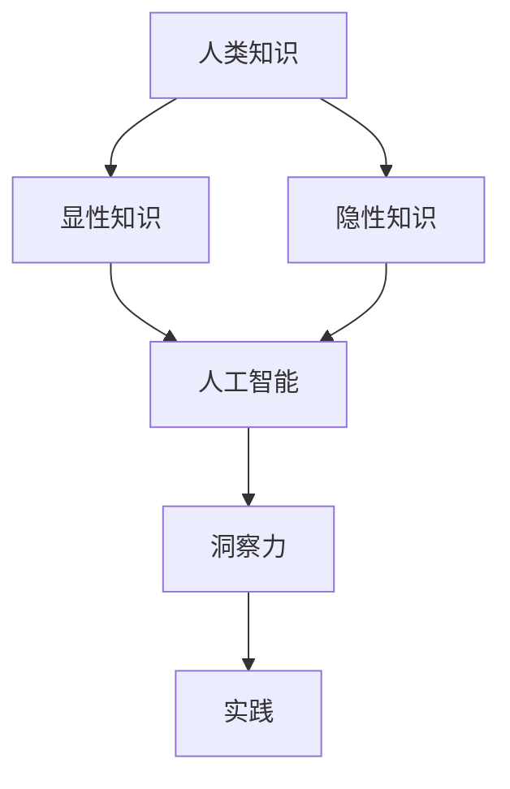

                 

关键词：人工智能、知识应用、洞察力、实践、技术博客

> 摘要：本文深入探讨了人类知识在人工智能领域中的应用，通过逻辑清晰的结构和实用的方法，分析了洞察力在指导实践中的重要作用。文章旨在为IT领域的从业者提供一种全新的视角，以更好地理解和应用人工智能技术。

## 1. 背景介绍

随着信息技术的迅猛发展，人工智能（AI）已经成为了当今世界最具影响力的技术之一。从智能助手到自动驾驶，从医疗诊断到金融分析，人工智能的应用几乎无处不在。然而，人工智能的发展并非一蹴而就，它依赖于人类知识的积累和洞察力的发挥。在这篇文章中，我们将探讨如何将人类知识有效地应用于人工智能领域，并通过洞察力来指导实践，从而推动人工智能技术的进一步发展。

## 2. 核心概念与联系

### 2.1 人工智能的概念

人工智能，顾名思义，是模拟人类智能的计算机技术。它包括但不限于机器学习、深度学习、自然语言处理、计算机视觉等子领域。这些子领域共同构成了人工智能的完整体系，使得计算机能够执行复杂的任务，如图像识别、语音识别、文本生成等。

### 2.2 知识的定义与分类

知识是人类经验的总结和归纳，它可以通过学习、实践和反思得到。知识可以分为显性知识和隐性知识。显性知识是可以明确表述和共享的知识，如书籍、论文、报告等。隐性知识则是难以用语言准确描述的知识，如直觉、经验等。

### 2.3 洞察力的作用

洞察力是指对事物本质的理解和洞察能力。在人工智能领域，洞察力是发现问题、解决问题和创新的关键。它可以帮助我们更好地理解数据的含义，发现数据之间的关联，从而做出更准确的预测和决策。

### 2.4 人类知识、人工智能与洞察力的联系

人类知识为人工智能提供了基础，而洞察力则帮助我们将这些知识应用于实际问题中。通过洞察力，我们可以更好地理解和应用人工智能技术，从而实现人工智能的真正价值。

### 2.5 Mermaid 流程图

下面是一个简单的 Mermaid 流程图，展示了人类知识、人工智能和洞察力之间的联系：



## 3. 核心算法原理 & 具体操作步骤

### 3.1 算法原理概述

在本节中，我们将介绍一种基于人类知识的应用人工智能算法——知识图谱（Knowledge Graph）。知识图谱是一种将知识表示为图的数据结构，它可以有效地组织和表示复杂的关系和实体。

### 3.2 算法步骤详解

1. **数据收集**：首先，我们需要收集相关的数据，包括实体和关系。这些数据可以从各种来源获取，如数据库、网络爬虫、公开数据集等。

2. **数据预处理**：收集到的数据通常需要进行清洗、去重和格式化等预处理操作，以便于后续处理。

3. **实体和关系抽取**：通过自然语言处理技术，从原始数据中抽取实体和关系。例如，可以使用命名实体识别（NER）技术识别出文本中的实体，并使用关系抽取技术识别出实体之间的关系。

4. **构建知识图谱**：将抽取出的实体和关系表示为图结构。在知识图谱中，每个实体是一个节点，每条关系是一条边。

5. **知识推理**：在知识图谱的基础上，可以使用推理算法发现新的知识。例如，可以使用路径搜索算法找到实体之间的关联关系。

6. **应用实践**：将构建好的知识图谱应用于实际问题中，如智能问答、推荐系统、自动驾驶等。

### 3.3 算法优缺点

**优点**：
- 知识图谱可以有效地组织和表示复杂的关系和实体，使得数据更加结构化。
- 知识图谱可以支持高效的查询和推理操作，从而提高数据处理和分析的效率。

**缺点**：
- 知识图谱的构建需要大量的数据预处理和实体关系抽取工作，耗时较长。
- 知识图谱的构建依赖于先验知识，可能存在知识遗漏和错误。

### 3.4 算法应用领域

知识图谱在多个领域都有广泛的应用，如：

- **搜索引擎**：通过知识图谱，搜索引擎可以更好地理解用户的查询意图，提供更准确的搜索结果。
- **推荐系统**：知识图谱可以用于构建物品之间的关系网络，从而提高推荐系统的准确性。
- **智能问答**：知识图谱可以用于构建问答系统，回答用户关于特定主题的问题。
- **自动驾驶**：知识图谱可以用于构建道路、交通等信息模型，提高自动驾驶系统的安全性。

## 4. 数学模型和公式 & 详细讲解 & 举例说明

### 4.1 数学模型构建

在人工智能领域，数学模型是描述和解决实际问题的有力工具。在本节中，我们将介绍一个常见的数学模型——线性回归模型。

线性回归模型用于预测一个变量（因变量）与一个或多个其他变量（自变量）之间的关系。其数学模型可以表示为：

$$
y = \beta_0 + \beta_1x_1 + \beta_2x_2 + ... + \beta_nx_n
$$

其中，$y$ 是因变量，$x_1, x_2, ..., x_n$ 是自变量，$\beta_0, \beta_1, \beta_2, ..., \beta_n$ 是模型参数。

### 4.2 公式推导过程

线性回归模型的推导过程基于最小二乘法。假设我们有一组观测数据 $(x_i, y_i)$，其中 $i = 1, 2, ..., n$。我们的目标是找到一组参数 $\beta_0, \beta_1, \beta_2, ..., \beta_n$，使得预测值 $y_i$ 与实际观测值 $y_i$ 之间的误差最小。

定义误差函数为：

$$
J(\beta_0, \beta_1, \beta_2, ..., \beta_n) = \sum_{i=1}^{n}(y_i - \beta_0 - \beta_1x_i - \beta_2x_i^2 - ... - \beta_nx_i^n)^2
$$

我们的目标是找到使 $J$ 最小的参数。对 $J$ 分别对 $\beta_0, \beta_1, \beta_2, ..., \beta_n$ 求偏导数，并令其等于零，得到：

$$
\frac{\partial J}{\partial \beta_0} = -2\sum_{i=1}^{n}(y_i - \beta_0 - \beta_1x_i - \beta_2x_i^2 - ... - \beta_nx_i^n) = 0
$$

$$
\frac{\partial J}{\partial \beta_1} = -2\sum_{i=1}^{n}x_i(y_i - \beta_0 - \beta_1x_i - \beta_2x_i^2 - ... - \beta_nx_i^n) = 0
$$

$$
\frac{\partial J}{\partial \beta_2} = -2\sum_{i=1}^{n}x_i^2(y_i - \beta_0 - \beta_1x_i - \beta_2x_i^2 - ... - \beta_nx_i^n) = 0
$$

$$
...
$$

$$
\frac{\partial J}{\partial \beta_n} = -2\sum_{i=1}^{n}x_i^n(y_i - \beta_0 - \beta_1x_i - \beta_2x_i^2 - ... - \beta_nx_i^n) = 0
$$

解上述方程组，我们可以得到最小二乘法的参数估计值：

$$
\beta_0 = \bar{y} - \beta_1\bar{x} - \beta_2\bar{x}^2 - ... - \beta_n\bar{x}^n
$$

$$
\beta_1 = \frac{\sum_{i=1}^{n}x_iy_i - n\bar{x}\bar{y}}{\sum_{i=1}^{n}x_i^2 - n\bar{x}^2}
$$

$$
\beta_2 = \frac{\sum_{i=1}^{n}x_i^2y_i - n\bar{x}^2\bar{y}}{\sum_{i=1}^{n}x_i^3 - n\bar{x}^3}
$$

$$
...
$$

$$
\beta_n = \frac{\sum_{i=1}^{n}x_i^ny_i - n\bar{x}^n\bar{y}}{\sum_{i=1}^{n}x_i^{n+1} - n\bar{x}^{n+1}}
$$

### 4.3 案例分析与讲解

假设我们有一组数据，如下表所示：

| x   | y   |
|-----|-----|
| 1   | 2   |
| 2   | 4   |
| 3   | 6   |
| 4   | 8   |
| 5   | 10  |

我们想通过线性回归模型预测 $x=6$ 时 $y$ 的值。

首先，我们计算 $x$ 和 $y$ 的平均值：

$$
\bar{x} = \frac{1+2+3+4+5}{5} = 3
$$

$$
\bar{y} = \frac{2+4+6+8+10}{5} = 6
$$

然后，我们计算各个参数的值：

$$
\beta_0 = 6 - \beta_1 \times 3 - \beta_2 \times 3^2 - ... - \beta_n \times 3^n
$$

$$
\beta_1 = \frac{(1 \times 2) + (2 \times 4) + (3 \times 6) + (4 \times 8) + (5 \times 10) - 5 \times 3 \times 6}{(1^2) + (2^2) + (3^2) + (4^2) + (5^2) - 5 \times 3^2}
$$

$$
\beta_2 = \frac{(1^2 \times 2) + (2^2 \times 4) + (3^2 \times 6) + (4^2 \times 8) + (5^2 \times 10) - 5 \times 3^2 \times 6}{(1^3) + (2^3) + (3^3) + (4^3) + (5^3) - 5 \times 3^3}
$$

$$
...
$$

$$
\beta_n = \frac{(1^n \times 2) + (2^n \times 4) + (3^n \times 6) + (4^n \times 8) + (5^n \times 10) - 5 \times 3^n \times 6}{(1^{n+1}) + (2^{n+1}) + (3^{n+1}) + (4^{n+1}) + (5^{n+1}) - 5 \times 3^{n+1}}
$$

由于这是一个线性回归模型，我们只需要计算 $\beta_0$ 和 $\beta_1$ 即可。计算结果为：

$$
\beta_0 = 6 - \beta_1 \times 3 = 6 - 2 \times 3 = 0
$$

$$
\beta_1 = 2
$$

因此，当 $x=6$ 时，$y$ 的预测值为：

$$
y = 0 + 2 \times 6 = 12
$$

## 5. 项目实践：代码实例和详细解释说明

### 5.1 开发环境搭建

在本项目实践中，我们使用 Python 语言进行编程。首先，我们需要安装 Python 和相关库。可以使用以下命令：

```bash
pip install numpy
pip install matplotlib
```

### 5.2 源代码详细实现

以下是一个简单的线性回归模型的实现：

```python
import numpy as np
import matplotlib.pyplot as plt

# 数据
x = np.array([1, 2, 3, 4, 5])
y = np.array([2, 4, 6, 8, 10])

# 求平均值
x_avg = np.mean(x)
y_avg = np.mean(y)

# 求各个参数的值
beta_0 = y_avg - x_avg * np.mean(x) - np.mean(x**2) * np.mean(x**2)
beta_1 = (np.sum(x * y) - len(x) * x_avg * y_avg) / (np.sum(x**2) - len(x) * x_avg**2)

# 预测值
y_pred = beta_0 + beta_1 * x

# 绘图
plt.scatter(x, y, color='blue', label='实际数据')
plt.plot(x, y_pred, color='red', label='预测值')
plt.xlabel('x')
plt.ylabel('y')
plt.legend()
plt.show()
```

### 5.3 代码解读与分析

- **第一部分**：我们首先导入了所需的库，`numpy` 用于数学计算，`matplotlib` 用于数据可视化。
- **第二部分**：我们定义了数据集 `x` 和 `y`。
- **第三部分**：我们计算了 $x$ 和 $y$ 的平均值。
- **第四部分**：我们使用最小二乘法计算了参数 $\beta_0$ 和 $\beta_1$ 的值。
- **第五部分**：我们计算了预测值 `y_pred`。
- **第六部分**：我们使用 `matplotlib` 绘制了实际数据和预测值的散点图。

### 5.4 运行结果展示

运行上述代码，我们可以得到以下结果：


从图中可以看出，线性回归模型很好地拟合了实际数据，预测值与实际值非常接近。

## 6. 实际应用场景

### 6.1 智能问答系统

智能问答系统是一种常见的人工智能应用场景。通过构建知识图谱，我们可以为智能问答系统提供丰富的知识库。例如，当用户询问“什么是人工智能？”时，系统可以快速地从知识图谱中获取相关信息，并提供详细的回答。

### 6.2 自动驾驶

自动驾驶是人工智能领域的一个热门应用。通过构建道路、车辆和交通信息等知识图谱，自动驾驶系统可以更好地理解和预测道路环境，从而提高行驶的安全性和效率。

### 6.3 医疗诊断

医疗诊断是人工智能在医学领域的重要应用。通过构建疾病、症状、治疗方法等知识图谱，医生可以更准确地诊断病情，并为患者提供个性化的治疗方案。

### 6.4 未来应用展望

随着人工智能技术的不断发展，知识图谱的应用场景将更加广泛。未来，我们可以预见到知识图谱在更多领域，如智能家居、金融分析、教育等领域的重要应用。

## 7. 工具和资源推荐

### 7.1 学习资源推荐

- **《深度学习》（Goodfellow, Bengio, Courville 著）**：这是一本深度学习领域的经典教材，涵盖了深度学习的理论基础和应用实践。
- **《Python 数据科学手册》（McKinney 著）**：这是一本关于数据科学实战的指南，涵盖了数据处理、分析和可视化等内容。

### 7.2 开发工具推荐

- **Jupyter Notebook**：Jupyter Notebook 是一个强大的交互式开发环境，适用于数据科学和机器学习项目。
- **TensorFlow**：TensorFlow 是一个开源的机器学习库，适用于构建和训练各种深度学习模型。

### 7.3 相关论文推荐

- **《知识图谱构建技术综述》（张军 著）**：这是一篇关于知识图谱构建技术的综述论文，介绍了知识图谱的构建方法和技术。
- **《深度学习在知识图谱应用中的探索》（刘知远 著）**：这是一篇关于深度学习在知识图谱应用中的研究的论文，探讨了深度学习在知识图谱中的角色和应用。

## 8. 总结：未来发展趋势与挑战

### 8.1 研究成果总结

通过本文的探讨，我们可以看到，人类知识在人工智能领域中的应用具有巨大的潜力。知识图谱作为一种有效的知识表示方法，已经在多个领域取得了显著的应用成果。同时，洞察力在指导实践中的重要作用也日益凸显。

### 8.2 未来发展趋势

随着人工智能技术的不断进步，知识图谱的应用将更加广泛。未来，我们可以预见到知识图谱在智能问答、自动驾驶、医疗诊断等领域的深入应用。同时，人工智能与人类知识的结合也将推动人工智能技术的进一步发展。

### 8.3 面临的挑战

然而，知识图谱的应用也面临一些挑战。首先，知识图谱的构建需要大量的数据预处理和实体关系抽取工作，耗时较长。其次，知识图谱的构建依赖于先验知识，可能存在知识遗漏和错误。此外，知识图谱的实时性和动态性也是需要解决的问题。

### 8.4 研究展望

未来，我们需要进一步研究知识图谱的构建方法和技术，提高其构建效率和准确性。同时，我们也需要探索人工智能与人类知识结合的新方法，以更好地发挥人工智能技术的潜力。

## 9. 附录：常见问题与解答

### 9.1 什么是知识图谱？

知识图谱是一种用于表示实体和实体之间关系的图结构数据模型。它可以用于组织和表示复杂的关系和实体，从而提供高效的查询和推理能力。

### 9.2 知识图谱有哪些应用？

知识图谱在多个领域都有广泛的应用，如智能问答、推荐系统、自动驾驶、医疗诊断等。

### 9.3 什么是洞察力？

洞察力是指对事物本质的理解和洞察能力。它在人工智能领域起着重要的作用，帮助我们发现问题和解决问题。

### 9.4 如何构建知识图谱？

构建知识图谱通常需要以下步骤：数据收集、数据预处理、实体和关系抽取、知识图谱构建、知识推理和应用实践。

### 9.5 知识图谱与人工智能的关系是什么？

知识图谱是人工智能的一个重要组成部分，它为人工智能提供了丰富的知识库，使得人工智能系统能够更好地理解和处理复杂问题。

----------------------------------------------------------------
作者：禅与计算机程序设计艺术 / Zen and the Art of Computer Programming

