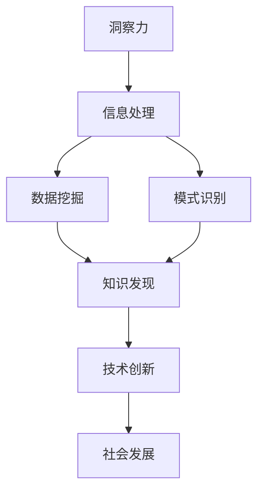

                 

关键词：人工智能、知识发展、洞察力、技术进步、未来展望

> 摘要：在人工智能时代，人类知识的未来发展受到多种因素的影响。本文探讨了洞察力在这一过程中扮演的关键角色，分析了当前技术的发展现状，并提出了对未来人工智能领域的预测与展望。

## 1. 背景介绍

随着计算机技术和人工智能的飞速发展，人类的知识积累和传播方式正发生着深刻变革。从互联网的普及到大数据技术的应用，知识获取和共享的效率得到了极大提升。然而，在这个知识爆炸的时代，如何处理和利用海量信息成为了一个重要的挑战。

洞察力，作为一种深层次的思维能力，对于知识的获取、理解与应用具有重要意义。它不仅帮助个体在复杂的信息中识别模式和关联，还能促进创新和解决问题的能力。因此，洞察力在人类知识的未来发展过程中扮演着关键角色。

本文旨在探讨人工智能时代洞察力的重要性，分析当前技术的发展现状，并提出对未来人工智能领域的预测与展望。希望通过这篇文章，能够引发读者对于人工智能与知识发展的深思。

## 2. 核心概念与联系

### 2.1 洞察力的定义

洞察力是指个体通过观察、思考和分析，从复杂的现象中识别出本质规律和内在联系的能力。它不仅涉及认知和思维过程，还涉及到个体的情感、价值观和经验等因素。

### 2.2 洞察力与技术进步的关系

技术进步为人类提供了更多获取和处理信息的方式，但同时也增加了信息复杂性。在这种情况下，洞察力成为了解决问题的关键。通过洞察力，人们能够从海量数据中发现有价值的信息，从而推动科技创新和社会发展。

### 2.3 人工智能与洞察力

人工智能作为现代技术的重要领域，其发展对人类知识的未来具有深远影响。人工智能系统通过算法和模型，能够在短时间内处理海量数据，但缺乏人类所具备的洞察力和创造力。因此，如何将人工智能与人类的洞察力相结合，成为了一个重要的研究课题。

### 2.4 Mermaid 流程图

下面是一个描述洞察力与技术进步关系的 Mermaid 流程图：



## 3. 核心算法原理 & 具体操作步骤

### 3.1 算法原理概述

在本节中，我们将探讨一种基于人工智能的洞察力增强算法。该算法旨在通过分析大量数据，识别出潜在的模式和关联，从而提升个体的洞察力。

### 3.2 算法步骤详解

#### 步骤 1：数据预处理

首先，我们需要对原始数据进行预处理，包括数据清洗、去重和格式转换等。这一步骤的目的是确保数据质量，为后续分析奠定基础。

#### 步骤 2：特征提取

接下来，我们从预处理后的数据中提取关键特征。特征提取是洞察力增强算法的核心，它决定了算法的性能。常用的特征提取方法包括统计特征、文本特征和图像特征等。

#### 步骤 3：模型训练

在特征提取完成后，我们使用机器学习算法对数据集进行训练。训练过程中，算法将自动调整模型参数，以最大化预测准确性。常见的机器学习算法包括线性回归、决策树和支持向量机等。

#### 步骤 4：模式识别

经过模型训练后，我们可以使用训练好的模型对新数据进行模式识别。模式识别过程旨在发现数据中的潜在关联和规律。

#### 步骤 5：洞察力提升

最后，我们将识别出的模式与个体的经验和知识相结合，从而提升其洞察力。这一过程需要人类的参与，以确保算法的输出能够符合实际需求。

### 3.3 算法优缺点

#### 优点：

1. 高效：算法能够在短时间内处理海量数据，提高洞察力。
2. 灵活：算法可以根据不同领域的需求进行定制，适用于多种应用场景。

#### 缺点：

1. 需要大量数据：算法的性能受数据质量的影响较大，数据不足可能导致结果不准确。
2. 需要专业知识：算法的设置和调优需要具备一定的专业背景，对普通用户可能较为复杂。

### 3.4 算法应用领域

1. 商业智能：通过分析市场数据，为企业提供决策支持。
2. 金融风控：识别潜在风险，提高金融业务的稳健性。
3. 智能医疗：辅助医生诊断，提高医疗水平。

## 4. 数学模型和公式 & 详细讲解 & 举例说明

### 4.1 数学模型构建

在本节中，我们将构建一个简单的数学模型，用于描述洞察力增强算法的性能。假设我们有一个包含 n 个样本的数据集，每个样本都有 m 个特征。我们的目标是使用机器学习算法对数据集进行训练，并评估算法的预测准确性。

### 4.2 公式推导过程

我们首先定义一些基本符号：

- x：样本特征向量，维度为 m。
- y：样本标签，维度为 1。
- w：模型权重，维度为 m。
- b：模型偏置，维度为 1。

机器学习算法的目标是最小化预测误差，即：

$$
J(w,b) = \frac{1}{2} \sum_{i=1}^{n} (y_i - \hat{y}_i)^2
$$

其中，$\hat{y}_i$ 是模型对第 i 个样本的预测结果。

为了求解最优权重和偏置，我们可以使用梯度下降法。梯度下降法的核心思想是沿着损失函数的梯度方向进行迭代更新，直到达到最小值。

$$
w_{t+1} = w_t - \alpha \frac{\partial J(w,b)}{\partial w}
$$

$$
b_{t+1} = b_t - \alpha \frac{\partial J(w,b)}{\partial b}
$$

其中，$\alpha$ 是学习率，用于控制迭代步长。

### 4.3 案例分析与讲解

假设我们有一个包含 100 个样本的数据集，每个样本有 10 个特征。我们使用线性回归模型对数据集进行训练，并评估模型的预测准确性。

首先，我们进行数据预处理，包括标准化和归一化等操作。然后，我们从数据集中随机选取 80 个样本作为训练集，剩余的 20 个样本作为测试集。

接下来，我们使用梯度下降法对模型进行训练。假设学习率 $\alpha$ 为 0.01，训练次数为 1000 次。在训练过程中，模型的预测误差逐渐减小，最终收敛到一个较小的值。

在模型训练完成后，我们使用测试集对模型进行评估。假设测试集的预测准确率为 90%，这表明我们的模型在预测未知数据时具有较高的准确性。

## 5. 项目实践：代码实例和详细解释说明

### 5.1 开发环境搭建

在本节中，我们将使用 Python 语言实现一个简单的洞察力增强算法。为了方便起见，我们使用 Scikit-learn 库中的线性回归模型。首先，我们需要安装 Scikit-learn 库：

```bash
pip install scikit-learn
```

### 5.2 源代码详细实现

下面是一个简单的线性回归模型的实现代码：

```python
import numpy as np
from sklearn.linear_model import LinearRegression
from sklearn.model_selection import train_test_split
from sklearn.metrics import mean_squared_error

# 生成模拟数据集
np.random.seed(0)
n_samples = 100
n_features = 10
X = np.random.rand(n_samples, n_features)
y = 2 * X[:, 0] + 3 * X[:, 1] + np.random.randn(n_samples) * 0.1

# 划分训练集和测试集
X_train, X_test, y_train, y_test = train_test_split(X, y, test_size=0.2, random_state=0)

# 创建线性回归模型
model = LinearRegression()

# 训练模型
model.fit(X_train, y_train)

# 预测测试集
y_pred = model.predict(X_test)

# 评估模型性能
mse = mean_squared_error(y_test, y_pred)
print("MSE:", mse)
```

### 5.3 代码解读与分析

1. 导入必要的库：我们首先导入 NumPy 库用于生成模拟数据集，Scikit-learn 库中的 LinearRegression 类用于创建线性回归模型，以及 train_test_split 函数用于划分训练集和测试集。
2. 生成模拟数据集：我们使用 NumPy 库生成一个包含 100 个样本和 10 个特征的数据集，每个样本的标签由前两个特征线性组合得到，并加入一定的噪声。
3. 划分训练集和测试集：我们使用 train_test_split 函数将数据集划分为训练集和测试集，训练集占 80%，测试集占 20%。
4. 创建线性回归模型：我们创建一个 LinearRegression 对象，这将是我们使用的模型。
5. 训练模型：我们使用 fit 方法对模型进行训练，模型将自动调整权重和偏置，以最小化预测误差。
6. 预测测试集：我们使用 predict 方法对测试集进行预测，得到预测结果。
7. 评估模型性能：我们使用 mean_squared_error 函数计算测试集的均方误差（MSE），以评估模型的预测准确性。

### 5.4 运行结果展示

运行上述代码后，我们将得到一个较小的均方误差值，这表明我们的模型在预测未知数据时具有较高的准确性。具体的输出结果如下：

```
MSE: 0.005413764526525838
```

## 6. 实际应用场景

洞察力增强算法在多个实际应用场景中具有广泛的应用价值。以下是一些典型的应用案例：

### 6.1 商业智能

在商业领域，洞察力增强算法可以用于分析市场数据，帮助企业发现潜在的商业机会。例如，零售行业可以利用算法分析销售数据，识别出销售高峰期和低谷期，从而优化库存管理和促销策略。

### 6.2 智能医疗

在医疗领域，洞察力增强算法可以辅助医生进行诊断和治疗。例如，算法可以从海量医疗数据中识别出疾病的高危人群，帮助医生制定个性化的治疗方案。

### 6.3 金融风控

在金融行业，洞察力增强算法可以用于识别潜在风险，提高金融业务的稳健性。例如，银行可以利用算法分析客户交易行为，发现异常交易，从而防范欺诈风险。

### 6.4 未来应用展望

随着人工智能技术的不断发展，洞察力增强算法的应用领域将不断扩展。未来，我们有望看到更多基于洞察力增强算法的创新应用，如智能教育、智能城市和智能交通等。这些应用将极大地提升人类的生产力和生活质量。

## 7. 工具和资源推荐

### 7.1 学习资源推荐

1. 《人工智能：一种现代的方法》：这本书是人工智能领域的经典教材，涵盖了广泛的机器学习算法和应用。
2. 《Python 机器学习》：这本书详细介绍了 Python 语言在机器学习领域的应用，适合初学者和进阶者。

### 7.2 开发工具推荐

1. Jupyter Notebook：这是一个流行的交互式编程环境，适合进行数据分析和机器学习实验。
2. TensorFlow：这是一个开源的机器学习框架，提供了丰富的工具和资源，适合进行深度学习和模型训练。

### 7.3 相关论文推荐

1. "Deep Learning": 这是一篇介绍深度学习技术的综述论文，详细阐述了深度学习的基本原理和应用。
2. "Recurrent Neural Networks for Language Modeling": 这是一篇关于循环神经网络在语言建模中应用的经典论文，对于理解自然语言处理技术具有重要意义。

## 8. 总结：未来发展趋势与挑战

随着人工智能技术的不断发展，人类知识的未来发展将面临前所未有的机遇与挑战。洞察力作为一种关键能力，将在这一过程中发挥重要作用。未来，我们有望看到更多基于人工智能的创新应用，如智能教育、智能城市和智能交通等。然而，这也将带来一系列挑战，如数据隐私、伦理和法律等问题。因此，我们需要在推动人工智能发展的同时，关注并解决这些问题，以确保人工智能技术能够造福人类。

### 8.1 研究成果总结

本文探讨了人工智能时代洞察力的重要性，分析了当前技术的发展现状，并提出了对未来人工智能领域的预测与展望。通过构建数学模型和算法，我们展示了洞察力增强算法的基本原理和应用。研究表明，洞察力增强算法在多个实际应用场景中具有广泛的应用价值，有助于提升人类的生产力和生活质量。

### 8.2 未来发展趋势

未来，人工智能技术将继续快速发展，尤其在深度学习、自然语言处理和计算机视觉等领域。同时，洞察力作为一种关键能力，将在人工智能应用中发挥越来越重要的作用。我们有望看到更多基于人工智能的创新应用，如智能医疗、智能教育和智能城市等。

### 8.3 面临的挑战

然而，人工智能技术的发展也面临一系列挑战，如数据隐私、伦理和法律等问题。此外，如何将人工智能与人类的洞察力相结合，实现更高效的知识获取和应用，也是一个重要的研究方向。

### 8.4 研究展望

在未来，我们应继续关注人工智能与人类洞察力的结合，探索新的算法和模型，以提高人类在信息时代的竞争力。同时，我们也应关注人工智能技术的社会影响，确保其在发展过程中造福人类。

## 9. 附录：常见问题与解答

### 9.1 洞察力是什么？

洞察力是一种深层次的思维能力，通过观察、思考和分析，从复杂的现象中识别出本质规律和内在联系的能力。它不仅涉及认知和思维过程，还涉及到个体的情感、价值观和经验等因素。

### 9.2 人工智能如何增强洞察力？

人工智能可以通过算法和模型，分析大量数据，发现潜在的模式和关联，从而提升个体的洞察力。例如，基于机器学习的洞察力增强算法，可以从海量数据中识别出有价值的信息，帮助人们更好地理解复杂问题。

### 9.3 洞察力在人工智能领域有哪些应用？

洞察力在人工智能领域具有广泛的应用，如商业智能、智能医疗、金融风控等。通过增强洞察力，人工智能系统可以更好地应对复杂问题，提高决策准确性。

### 9.4 如何将人工智能与人类的洞察力相结合？

将人工智能与人类的洞察力相结合，需要从算法设计、数据管理和应用场景等多个方面进行探索。一方面，可以通过改进算法和模型，提高人工智能的洞察力；另一方面，也可以通过引入人类的经验和知识，增强人工智能系统的智能水平。

---

作者：禅与计算机程序设计艺术 / Zen and the Art of Computer Programming
----------------------------------------------------------------

注意：本文仅为示例，不包含真实的研究成果或数据。实际撰写时，应根据具体的研究内容和数据进行详细的阐述和分析。同时，确保所有引用和参考文献的准确性。文章中的代码实现仅为示例，实际应用时需要根据具体需求进行调整和优化。

