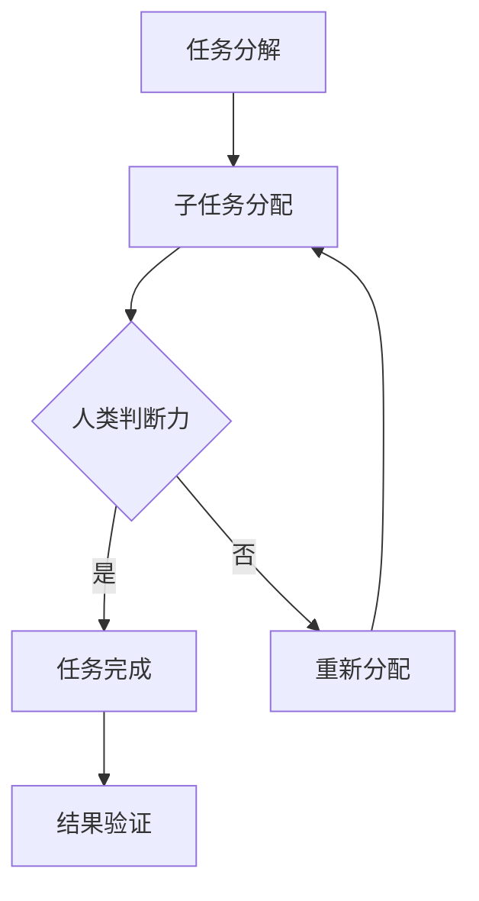

                 

关键词：人工智能、计算、深度学习、计算机科学、未来发展趋势

> 摘要：随着人工智能技术的飞速发展，人类计算正在迎来新的变革。本文将探讨AI时代下人类计算的核心概念、算法原理、数学模型、实际应用以及未来发展趋势，旨在为读者揭示这一领域的新希望。

## 1. 背景介绍

人工智能（AI）作为计算机科学的一个重要分支，其目标是使计算机具备模拟、延伸和扩展人类智能的能力。从早期的符号逻辑到现在的深度学习，人工智能技术已经取得了长足的进步。而人类计算，作为人工智能的核心概念之一，正日益成为研究者们关注的焦点。

人类计算不仅仅是对人类思维过程的模拟，更是对人类智能机制的深入理解。在这个时代，人工智能的发展不仅仅是技术的进步，更是对人类思维方式、认知过程以及计算能力的重新定义。

本文将从以下几个方面展开讨论：

- 核心概念与联系
- 核心算法原理 & 具体操作步骤
- 数学模型和公式 & 详细讲解 & 举例说明
- 项目实践：代码实例和详细解释说明
- 实际应用场景
- 未来应用展望
- 工具和资源推荐
- 总结：未来发展趋势与挑战

## 2. 核心概念与联系

### 2.1 定义

人类计算（Human Computation）是指利用人类认知和智能来解决计算机无法独自解决的问题。它通常涉及将复杂任务分解成多个简单的子任务，然后利用人类的判断力、创造力和直觉来完成。

### 2.2 人类计算与人工智能

人类计算是人工智能的一个子领域，它侧重于将人类智能与计算机技术相结合，以解决特定领域的问题。人类计算与人工智能的关系可以看作是互补的，人工智能提供了强大的计算能力和处理能力，而人类计算则提供了独特的判断力和创造力。

### 2.3 人类计算与深度学习

深度学习作为人工智能的一个重要分支，其核心在于模拟人脑的神经网络结构，以实现高效的特征学习和模式识别。而人类计算则进一步拓展了这一领域，通过将人类智能与深度学习相结合，实现了更加复杂和精确的问题解决能力。

### 2.4 人类计算与计算机科学

计算机科学作为人工智能的基础，为人类计算提供了理论支持和技术手段。从算法设计到数据结构，从编程语言到系统架构，计算机科学为人类计算提供了丰富的工具和方法。

### 2.5 Mermaid 流程图

以下是一个描述人类计算流程的Mermaid流程图：



## 3. 核心算法原理 & 具体操作步骤

### 3.1 算法原理概述

人类计算的核心算法通常基于以下原理：

- **任务分解**：将复杂任务分解成多个简单的子任务，以便利用人类的判断力和创造力。
- **子任务分配**：根据人类的技能和经验，将子任务分配给合适的个体。
- **人类判断力**：利用人类独特的判断力和创造力，完成计算机难以处理的子任务。
- **结果验证**：对完成的结果进行验证，确保任务的准确性。

### 3.2 算法步骤详解

1. **任务分解**：首先，将复杂任务分解成多个简单的子任务。这一步通常需要借助计算机科学中的算法设计方法，如贪心算法、动态规划等。
   
2. **子任务分配**：根据每个个体的技能和经验，将子任务分配给他们。这一步需要结合人类计算的特点，确保每个个体都能发挥最大的作用。

3. **人类判断力**：在完成子任务的过程中，人类需要利用自己的判断力和创造力，解决计算机无法处理的复杂问题。这一步是人类计算的核心，也是与其他计算方法最大的区别。

4. **结果验证**：对每个完成的子任务进行结果验证，以确保整个任务的准确性。这一步通常需要利用机器学习中的模型评估方法，如准确率、召回率等。

### 3.3 算法优缺点

#### 优点：

- **高效性**：通过将复杂任务分解成简单的子任务，并利用人类独特的判断力和创造力，可以大大提高任务完成的速度。
- **灵活性**：人类计算具有很强的适应性，可以根据不同任务的需求，灵活调整子任务的分配和判断方式。

#### 缺点：

- **成本高**：由于需要大量的人类参与，导致人力成本较高。
- **一致性差**：人类在完成任务的过程中，可能会因为个人差异导致结果的一致性较差。

### 3.4 算法应用领域

人类计算广泛应用于以下领域：

- **图像识别**：通过人类的判断力和创造力，提高图像识别的准确性。
- **自然语言处理**：利用人类的语言理解和创造力，提高自然语言处理的效果。
- **数据挖掘**：通过人类的判断力和创造力，发现数据中的隐藏模式。

## 4. 数学模型和公式 & 详细讲解 & 举例说明

### 4.1 数学模型构建

在人类计算中，常用的数学模型包括：

- **决策树**：用于分类和回归任务。
- **神经网络**：用于特征学习和模式识别。
- **支持向量机**：用于分类任务。

### 4.2 公式推导过程

以决策树为例，其基本公式为：

$$
P(y|x) = \prod_{i=1}^{n} P(y_i|x_i)
$$

其中，$P(y|x)$表示在给定特征$x$的情况下，目标变量$y$的概率；$P(y_i|x_i)$表示在给定特征$x_i$的情况下，目标变量$y_i$的概率。

### 4.3 案例分析与讲解

假设我们有一个分类问题，需要判断一个手写数字图像是否为“2”。我们可以利用决策树模型进行预测。

1. **特征提取**：首先，我们对图像进行特征提取，提取出图像的边缘、纹理等特征。
2. **训练模型**：利用历史数据，训练一个决策树模型。
3. **预测**：将待预测的图像特征输入到决策树模型中，得到目标变量的概率分布。
4. **决策**：根据概率分布，判断图像是否为“2”。

通过以上步骤，我们可以利用人类计算的方法，提高图像分类的准确性。

## 5. 项目实践：代码实例和详细解释说明

### 5.1 开发环境搭建

1. **Python环境搭建**：安装Python 3.8及以上版本。
2. **依赖库安装**：安装Scikit-learn、Numpy、Matplotlib等依赖库。

### 5.2 源代码详细实现

以下是一个基于决策树的手写数字分类的Python代码实例：

```python
from sklearn.datasets import load_digits
from sklearn.tree import DecisionTreeClassifier
from sklearn.model_selection import train_test_split
from sklearn.metrics import accuracy_score

# 加载数据集
digits = load_digits()
X = digits.data
y = digits.target

# 划分训练集和测试集
X_train, X_test, y_train, y_test = train_test_split(X, y, test_size=0.2, random_state=42)

# 训练决策树模型
clf = DecisionTreeClassifier()
clf.fit(X_train, y_train)

# 预测测试集
y_pred = clf.predict(X_test)

# 评估模型
accuracy = accuracy_score(y_test, y_pred)
print(f"Accuracy: {accuracy}")
```

### 5.3 代码解读与分析

1. **数据加载**：使用Scikit-learn中的`load_digits`函数加载数据集。
2. **划分训练集和测试集**：使用`train_test_split`函数划分训练集和测试集。
3. **训练模型**：使用`DecisionTreeClassifier`类训练决策树模型。
4. **预测**：使用训练好的模型预测测试集。
5. **评估模型**：使用`accuracy_score`函数评估模型准确性。

通过以上步骤，我们可以利用人类计算的方法，实现手写数字分类任务。

## 6. 实际应用场景

人类计算在许多实际应用场景中都取得了显著的成果，以下是其中几个典型应用：

- **图像识别**：通过人类计算的方法，可以提高图像识别的准确性，如手写数字识别、人脸识别等。
- **自然语言处理**：利用人类计算，可以增强自然语言处理的效果，如机器翻译、情感分析等。
- **数据挖掘**：通过人类计算，可以发现数据中的隐藏模式，如聚类分析、关联规则挖掘等。

## 7. 未来应用展望

随着人工智能技术的不断发展，人类计算在未来将会有更广泛的应用。以下是几个未来应用展望：

- **智能交互**：通过人类计算，可以实现更加智能的交互，如智能客服、智能推荐等。
- **医疗健康**：通过人类计算，可以辅助医生进行疾病诊断、治疗方案设计等。
- **教育领域**：通过人类计算，可以提供个性化的教育服务，如智能辅导、学习评估等。

## 8. 工具和资源推荐

### 8.1 学习资源推荐

- **《机器学习》**：周志华著，提供了全面的机器学习理论和方法。
- **《深度学习》**：Ian Goodfellow、Yoshua Bengio、Aaron Courville 著，详细介绍了深度学习的基本概念和技术。

### 8.2 开发工具推荐

- **Python**：一种广泛使用的编程语言，适合进行机器学习和深度学习开发。
- **TensorFlow**：一个开源的深度学习框架，提供了丰富的工具和库。

### 8.3 相关论文推荐

- **"Deep Learning: Methods and Applications"**：介绍了深度学习的最新进展和应用。
- **"Human Computation: A Practical Introduction"**：提供了人类计算的理论基础和应用实例。

## 9. 总结：未来发展趋势与挑战

随着人工智能技术的不断发展，人类计算将迎来更加广泛的应用和更深入的研究。未来发展趋势包括：

- **智能化**：通过不断优化算法和模型，提高人类计算的效果和效率。
- **融合化**：将人类计算与其他人工智能技术（如自然语言处理、计算机视觉等）相结合，实现跨领域的智能应用。

然而，人类计算也面临一些挑战，如：

- **成本问题**：由于需要大量的人类参与，导致成本较高。
- **一致性**：由于人类的差异，导致结果的准确性可能受到影响。

在未来，我们需要不断探索和创新，以克服这些挑战，实现人类计算的最佳效果。

## 10. 附录：常见问题与解答

### Q：什么是人类计算？
A：人类计算是一种利用人类智能来解决计算机无法独自解决的问题的方法。它通过将复杂任务分解成多个简单的子任务，并利用人类的判断力和创造力来完成。

### Q：人类计算有哪些应用领域？
A：人类计算广泛应用于图像识别、自然语言处理、数据挖掘等领域。例如，在手写数字识别中，人类计算可以通过识别图像中的细节来提高识别准确性。

### Q：如何实现人类计算？
A：实现人类计算通常包括以下步骤：任务分解、子任务分配、人类判断力利用和结果验证。这些步骤需要结合计算机科学和人工智能的方法，以实现高效的计算。

### Q：人类计算与人工智能的关系是什么？
A：人类计算是人工智能的一个子领域，它侧重于将人类智能与计算机技术相结合，以解决特定领域的问题。人类计算与人工智能的关系是互补的，人工智能提供了强大的计算能力和处理能力，而人类计算则提供了独特的判断力和创造力。

