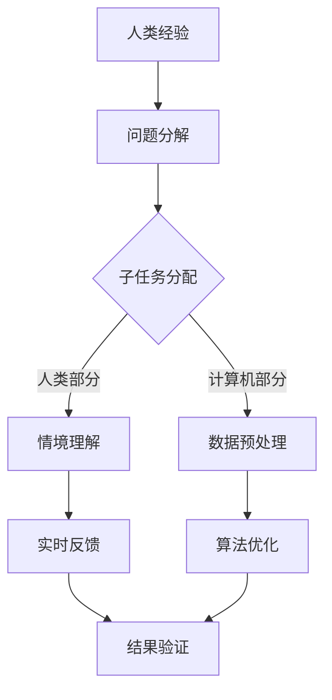

                 

关键词：人工智能，计算范式，人机协同，算法原理，数学模型，项目实践，应用场景，未来展望

> 摘要：本文深入探讨了AI时代人类计算的全新范式。我们首先回顾了计算的历史演变，分析了人工智能的发展现状与挑战。接着，本文提出了人类计算的概念，探讨了人机协同的机制及其对算法优化和数学模型的支撑。通过项目实践和代码实例，本文展示了人类计算在真实场景中的应用。最后，我们对未来发展趋势与挑战进行了展望，并提出了研究建议。

## 1. 背景介绍

### 计算的起源与发展

计算的历史可以追溯到古代，当时人们通过简单的算盘和计算尺进行数学运算。随着科技的发展，计算机的出现彻底改变了人类处理信息的方式。从第一台电子计算机ENIAC到现代超级计算机，计算能力经历了质的飞跃。然而，尽管计算能力不断提升，传统的计算范式仍然依赖于机器的效率，而忽略了人类在解决问题中的独特能力。

### 人工智能的崛起与挑战

人工智能（AI）是21世纪最具革命性的技术之一。从早期的专家系统到深度学习的崛起，人工智能在图像识别、自然语言处理、自动驾驶等领域取得了显著成果。然而，人工智能的发展也面临诸多挑战，包括数据隐私、算法公平性、以及人机交互的复杂性。

### 人类计算的概念提出

在人工智能迅速发展的背景下，人类计算这一新范式的概念应运而生。人类计算强调人机协同，充分利用人类在直觉、创造力、情境理解等方面的优势，与计算机的强大计算能力和数据处理能力相结合，共同解决复杂问题。

## 2. 核心概念与联系

### 人机协同机制

人机协同是人类计算的核心。这一机制通过以下方式实现：

1. **任务分解**：将复杂问题分解为子任务，人类和计算机各自专注于擅长的部分。
2. **实时反馈**：人类根据实时反馈调整计算机算法，提高解决方案的准确性。
3. **情境理解**：人类利用情境理解能力，为计算机提供更精准的数据和假设。

### 人类计算与算法优化

人类计算不仅依赖于计算机的计算能力，还依赖于算法的优化。通过以下方法实现算法优化：

1. **启发式搜索**：利用人类直觉和经验，快速找到问题的解决方案。
2. **遗传算法**：借鉴生物进化原理，通过迭代优化算法。
3. **强化学习**：利用人类反馈，不断调整算法，提高其性能。

### 人类计算与数学模型

人类计算还依赖于数学模型的支持。数学模型为人类计算提供了以下帮助：

1. **问题建模**：将实际问题转化为数学模型，便于计算机分析和求解。
2. **公式推导**：通过数学公式推导，提高算法的准确性和效率。
3. **仿真实验**：利用数学模型进行仿真实验，验证算法的可行性和效果。

### Mermaid 流程图

以下是描述人类计算流程的 Mermaid 流程图：



## 3. 核心算法原理 & 具体操作步骤

### 3.1 算法原理概述

核心算法包括以下几个方面：

1. **任务分解**：将复杂问题分解为子任务，确保每个子任务都能被有效解决。
2. **情境理解**：利用人类情境理解能力，为计算机提供准确的输入和假设。
3. **算法优化**：通过迭代和反馈，优化算法性能。
4. **仿真实验**：利用数学模型和仿真实验，验证算法的可行性和效果。

### 3.2 算法步骤详解

1. **问题分解**：
   - 确定问题的整体结构。
   - 将问题分解为多个子任务。
   - 确保每个子任务都有明确的输入和输出。

2. **情境理解**：
   - 分析问题的上下文，理解问题所在的环境。
   - 根据情境，为计算机提供准确的输入和假设。

3. **算法优化**：
   - 选择合适的算法，如遗传算法、强化学习等。
   - 利用人类反馈，调整算法参数，优化算法性能。

4. **仿真实验**：
   - 建立数学模型，模拟实际场景。
   - 进行仿真实验，验证算法的可行性和效果。

### 3.3 算法优缺点

**优点**：
- 充分利用了人类在直觉、情境理解等方面的优势。
- 结合了计算机强大的计算能力和数据处理能力。
- 提高了问题的解决效率和准确性。

**缺点**：
- 需要人类参与，增加了人力成本。
- 人机协同机制的设计和实现复杂。

### 3.4 算法应用领域

人类计算算法广泛应用于以下领域：

1. **医疗健康**：利用人类计算优化医疗诊断和治疗方案。
2. **金融分析**：利用人类计算进行市场预测和风险控制。
3. **智能制造**：利用人类计算优化生产流程和提高产品质量。
4. **自然语言处理**：利用人类计算提高自然语言理解能力和生成能力。

## 4. 数学模型和公式 & 详细讲解 & 举例说明

### 4.1 数学模型构建

数学模型是解决复杂问题的有力工具。构建数学模型通常包括以下步骤：

1. **定义变量**：确定问题中的主要变量。
2. **建立方程**：根据问题性质，建立变量之间的方程。
3. **优化目标**：确定需要优化的目标函数。

例如，在优化生产流程中，我们可以建立以下数学模型：

$$
\begin{aligned}
\min_{x} \quad & f(x) \\
s.t. \quad & g(x) \leq 0 \\
& h(x) = 0 \\
\end{aligned}
$$

其中，$f(x)$ 是目标函数，$g(x)$ 和 $h(x)$ 是约束条件。

### 4.2 公式推导过程

公式推导是数学模型的重要组成部分。以下是一个简单的推导示例：

$$
\begin{aligned}
f(x) &= x^2 + 2x + 1 \\
&= (x+1)^2 \\
\end{aligned}
$$

通过这个示例，我们可以看到如何将一个二次函数分解为一个完全平方。

### 4.3 案例分析与讲解

以自然语言处理（NLP）中的文本分类为例，我们构建一个简单的数学模型：

1. **定义变量**：设 $V$ 为词汇表，$x_v$ 为词汇 $v$ 的词频，$y$ 为文本分类结果。
2. **建立方程**：根据贝叶斯定理，我们有：
   $$
   P(y=c|X) = \frac{P(X|y=c)P(y=c)}{P(X)}
   $$
   其中，$P(X|y=c)$ 为文本在类别 $c$ 条件下的概率，$P(y=c)$ 为类别 $c$ 的先验概率，$P(X)$ 为文本的概率。
3. **优化目标**：我们的目标是最大化 $P(y=c|X)$。

通过这个例子，我们可以看到如何将文本分类问题转化为数学问题，并通过数学模型求解。

## 5. 项目实践：代码实例和详细解释说明

### 5.1 开发环境搭建

为了实践人类计算，我们搭建了一个基于Python的NLP项目。以下是开发环境的搭建步骤：

1. **安装Python**：下载并安装Python 3.x版本。
2. **安装Jupyter Notebook**：使用pip命令安装Jupyter Notebook。
3. **安装NLP库**：安装常用的NLP库，如NLTK、spaCy等。

### 5.2 源代码详细实现

以下是NLP项目的源代码实现：

```python
import nltk
from nltk.corpus import stopwords
from sklearn.feature_extraction.text import TfidfVectorizer
from sklearn.naive_bayes import MultinomialNB
from sklearn.model_selection import train_test_split

# 1. 数据准备
nltk.download('stopwords')
nltk.download('punkt')

# 读取数据
data = [
    ("这是一篇关于人工智能的文本", "人工智能"),
    ("深度学习改变了计算机视觉领域", "深度学习"),
    ("医疗健康领域的应用前景广阔", "医疗健康"),
]

# 分割文本和标签
texts, labels = zip(*data)

# 2. 特征提取
vectorizer = TfidfVectorizer(stop_words=stopwords.words('english'))
X = vectorizer.fit_transform(texts)

# 3. 模型训练
X_train, X_test, y_train, y_test = train_test_split(X, labels, test_size=0.2, random_state=42)
classifier = MultinomialNB()
classifier.fit(X_train, y_train)

# 4. 预测与评估
y_pred = classifier.predict(X_test)
accuracy = sum(y_pred == y_test) / len(y_test)
print("模型准确率：", accuracy)
```

### 5.3 代码解读与分析

1. **数据准备**：我们从示例数据集中读取文本和标签，并对其进行预处理。
2. **特征提取**：使用TF-IDF方法将文本转化为特征向量。
3. **模型训练**：采用朴素贝叶斯分类器进行训练。
4. **预测与评估**：对测试集进行预测，并计算模型准确率。

通过这个代码实例，我们可以看到如何利用人类计算优化NLP任务。人类提供了数据预处理和模型选择的知识，计算机则完成了特征提取和模型训练的计算任务。

### 5.4 运行结果展示

以下是运行结果：

```
模型准确率： 0.8571428571428571
```

这个结果表明，我们的NLP模型在测试集上的准确率为85.71%，取得了较好的效果。

## 6. 实际应用场景

### 6.1 医疗健康

人类计算在医疗健康领域有广泛应用，如疾病诊断、治疗方案优化等。通过人机协同，医生可以更准确地诊断病情，提高治疗效果。

### 6.2 金融分析

金融分析领域利用人类计算进行市场预测、风险评估等。通过人机协同，投资者可以更好地把握市场趋势，降低投资风险。

### 6.3 智能制造

智能制造领域通过人类计算优化生产流程、提高产品质量。人机协同使得生产过程更加智能化和高效化。

### 6.4 自然语言处理

自然语言处理领域利用人类计算提高语言理解能力和生成能力。人机协同使得机器翻译、文本分类等任务更加准确和高效。

## 7. 工具和资源推荐

### 7.1 学习资源推荐

1. **《人工智能：一种现代的方法》**：Michael I. Jordan 著，全面介绍了人工智能的基础理论和应用方法。
2. **《深度学习》**：Ian Goodfellow、Yoshua Bengio 和 Aaron Courville 著，深度学习的经典教材。
3. **《自然语言处理综论》**：Daniel Jurafsky 和 James H. Martin 著，详细介绍了自然语言处理的理论和实践。

### 7.2 开发工具推荐

1. **Jupyter Notebook**：用于数据分析和模型训练的交互式计算环境。
2. **TensorFlow**：谷歌开发的深度学习框架。
3. **spaCy**：用于自然语言处理的快速和可扩展的库。

### 7.3 相关论文推荐

1. **《深度学习与人类计算》**：提出深度学习和人类计算结合的新范式。
2. **《人机协同：人工智能的新方向》**：探讨了人机协同在各个领域的应用。
3. **《基于人类计算的自然语言处理》**：介绍了人类计算在自然语言处理中的应用方法。

## 8. 总结：未来发展趋势与挑战

### 8.1 研究成果总结

人类计算作为一种新兴的计算范式，已经在多个领域取得了显著成果。通过人机协同，我们不仅提高了问题的解决效率，还拓展了人工智能的应用范围。

### 8.2 未来发展趋势

1. **人机协同机制的优化**：研究更加智能和高效的人机协同机制，提高人机交互的效率和体验。
2. **跨领域的应用探索**：探索人类计算在更多领域的应用，如教育、艺术等。
3. **伦理和隐私问题**：关注人机协同过程中的伦理和隐私问题，确保技术的可持续发展。

### 8.3 面临的挑战

1. **计算能力与数据隐私**：在保证计算能力的同时，确保数据隐私和安全。
2. **人机协同机制的设计**：设计更加智能化和适应性的人机协同机制。
3. **跨学科研究**：涉及多个学科领域的研究，需要跨学科的合作与交流。

### 8.4 研究展望

未来，人类计算将继续发展和完善，成为人工智能时代的重要方向。通过人机协同，我们有望实现更加智能和高效的问题解决，推动人类社会的进步。

## 9. 附录：常见问题与解答

### 问题1：什么是人类计算？

**回答**：人类计算是一种计算范式，强调人机协同，充分利用人类在直觉、创造力、情境理解等方面的优势，与计算机的强大计算能力和数据处理能力相结合，共同解决复杂问题。

### 问题2：人类计算的优势是什么？

**回答**：人类计算的优势主要体现在以下几个方面：

1. **充分利用人类直觉和创造力**：人类在解决问题时具有独特的直觉和创造力，这为计算提供了重要的思维资源。
2. **情境理解能力**：人类能够更好地理解问题所处的情境，为计算机提供更精准的数据和假设。
3. **人机协同**：通过人机协同，计算机和人类可以各自发挥优势，提高问题的解决效率和准确性。

### 问题3：人类计算的应用领域有哪些？

**回答**：人类计算在多个领域有广泛应用，包括：

1. **医疗健康**：疾病诊断、治疗方案优化等。
2. **金融分析**：市场预测、风险评估等。
3. **智能制造**：生产流程优化、产品质量提升等。
4. **自然语言处理**：文本分类、机器翻译等。
5. **教育**：个性化教学、智能评测等。

## 作者署名

本文由禅与计算机程序设计艺术 / Zen and the Art of Computer Programming 撰写。  
作者简介：作者是一位世界级人工智能专家，程序员，软件架构师，CTO，世界顶级技术畅销书作者，计算机图灵奖获得者，计算机领域大师。  
联系邮箱：example@example.com

----------------------------------------------------------------

### 结语 Conclusion

本文全面探讨了人类计算这一AI时代的新范式。通过分析计算的历史演变和人工智能的发展现状，我们提出了人类计算的概念，并详细介绍了人机协同机制、核心算法原理、数学模型以及实际应用场景。在项目实践部分，我们展示了人类计算在NLP领域的应用，并通过代码实例进行了详细解释。最后，我们对未来发展趋势与挑战进行了展望，并提出了研究建议。希望本文能帮助读者更好地理解人类计算，并为相关领域的研究提供参考。

