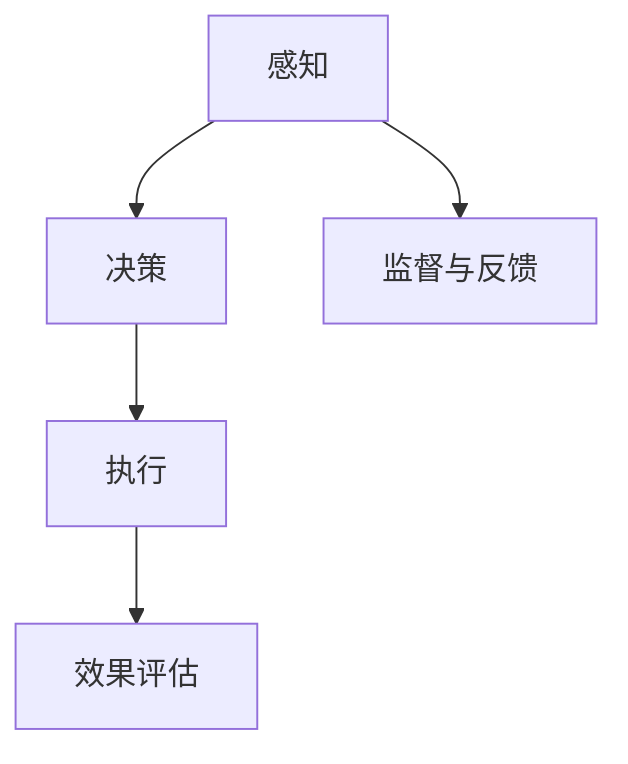

                 

关键词：人工智能、未来就业、技能需求、AI时代、计算机技术、职业发展、行业趋势

> 摘要：随着人工智能技术的迅猛发展，人类计算的领域正在经历深刻的变革。本文旨在探讨AI时代对就业前景的影响，以及个人在技术变革中应具备的技能和素质，为读者提供对未来职业发展的思考和指南。

## 1. 背景介绍

人工智能（AI）作为计算机科学的一个重要分支，近年来取得了突破性的进展。从最初的规则系统到基于数据的机器学习，再到如今深度学习和神经网络的广泛应用，AI技术正不断改变我们的生活和工作方式。随着AI技术的商业化应用逐渐深入，各行各业都在探索如何利用AI提高效率、创造价值。然而，这种技术变革也引发了关于未来就业前景的广泛讨论。

### 1.1 人工智能的发展历程

人工智能的历史可以追溯到20世纪50年代，当时的计算机科学家们首次提出了“人工智能”的概念。随着计算能力的提升和算法的改进，人工智能经历了多个发展阶段。从基于规则的专家系统，到基于统计学习的机器学习，再到如今深度学习和神经网络的广泛应用，人工智能的发展呈现出指数级增长。

### 1.2 AI时代的到来

当前，我们正处于一个被称为“AI时代”的新时代。AI技术不仅在传统行业如医疗、金融、教育等领域得到广泛应用，还在新兴产业如自动驾驶、智能机器人、智能家居等领域展现出巨大的潜力。AI时代的到来，不仅改变了生产方式，也对人类的社会结构和就业市场产生了深远影响。

### 1.3 人工智能与人类计算

人类计算是指人类在计算任务中的参与和贡献，包括问题定义、数据标注、决策过程等。在AI时代，人类计算与人工智能的交互变得尤为重要。人类可以利用AI技术提高工作效率，同时AI也需要人类提供监督和反馈，实现更准确的决策和更智能的交互。

## 2. 核心概念与联系

为了深入理解AI时代对就业市场的影响，我们需要了解几个核心概念和它们之间的联系。

### 2.1 人工智能的构成

人工智能系统通常由感知、决策、执行三个主要部分组成。感知部分负责获取外部信息，如视觉、听觉、触觉等；决策部分基于感知结果进行逻辑推理和决策；执行部分则将决策转化为实际行动。

### 2.2 机器学习和深度学习

机器学习和深度学习是人工智能的核心技术。机器学习是指让计算机通过数据学习规律和模式，从而实现自动化的决策和预测；深度学习则是基于多层神经网络的结构，通过大量的数据训练，实现更高级的认知能力。

### 2.3 人机交互

人机交互是AI时代的重要研究方向。如何让计算机更好地理解人类的需求，并给出合适的响应，是人机交互研究的核心问题。自然语言处理、语音识别等技术为人机交互提供了技术支持。

### 2.4 Mermaid 流程图



在这个流程图中，感知、决策、执行三个主要部分构成了人工智能的核心。同时，监督与反馈以及效果评估是确保人工智能系统稳定、高效运行的关键。

## 3. 核心算法原理 & 具体操作步骤

### 3.1 算法原理概述

在AI时代，核心算法原理的理解和掌握对个人的职业发展至关重要。以下将介绍几种在AI领域广泛应用的算法原理。

### 3.2 算法步骤详解

#### 3.2.1 机器学习算法

机器学习算法主要包括监督学习、无监督学习和强化学习。监督学习是通过已标记的数据进行训练，从而学习预测模型；无监督学习则是通过未标记的数据寻找潜在的模式；强化学习是通过试错的方式不断优化策略。

#### 3.2.2 深度学习算法

深度学习算法是基于多层神经网络的结构进行训练，通过反向传播算法不断调整网络参数，使网络能够更好地拟合训练数据。常见的深度学习算法包括卷积神经网络（CNN）、循环神经网络（RNN）和生成对抗网络（GAN）。

#### 3.2.3 自然语言处理算法

自然语言处理算法主要涉及文本数据的预处理、语义分析和生成。常见的算法包括词袋模型、朴素贝叶斯分类器、深度学习模型等。

### 3.3 算法优缺点

每种算法都有其优缺点。例如，机器学习算法在处理结构化数据时效果较好，但可能无法应对复杂的不确定环境；深度学习算法在图像和语音处理方面表现出色，但训练过程可能非常耗时；自然语言处理算法在文本理解方面取得显著进展，但在处理长文本时仍存在挑战。

### 3.4 算法应用领域

核心算法在各个领域的应用十分广泛。例如，机器学习算法在推荐系统、图像识别、预测分析等方面得到广泛应用；深度学习算法在自动驾驶、语音识别、医学影像分析等领域取得突破；自然语言处理算法在智能客服、机器翻译、情感分析等领域发挥着重要作用。

## 4. 数学模型和公式 & 详细讲解 & 举例说明

### 4.1 数学模型构建

在AI领域，数学模型是理解和应用算法的重要基础。以下以线性回归模型为例，介绍数学模型的构建过程。

#### 4.1.1 线性回归模型

线性回归模型是一种简单的预测模型，用于分析两个变量之间的线性关系。其数学模型可以表示为：

\[ y = \beta_0 + \beta_1 \cdot x \]

其中，\( y \) 是因变量，\( x \) 是自变量，\( \beta_0 \) 和 \( \beta_1 \) 分别是模型的参数。

#### 4.1.2 模型参数估计

为了估计模型参数 \( \beta_0 \) 和 \( \beta_1 \)，可以使用最小二乘法。最小二乘法的目标是找到使得误差平方和最小的参数值。

\[ \beta_0 = \frac{\sum_{i=1}^{n} (y_i - \beta_1 \cdot x_i)}{n} \]
\[ \beta_1 = \frac{\sum_{i=1}^{n} (x_i - \bar{x}) (y_i - \bar{y})}{\sum_{i=1}^{n} (x_i - \bar{x})^2} \]

其中，\( n \) 是样本数量，\( \bar{x} \) 和 \( \bar{y} \) 分别是自变量和因变量的平均值。

### 4.2 公式推导过程

#### 4.2.1 最小二乘法原理

最小二乘法基于以下原理：假设我们有 \( n \) 个样本点 \( (x_i, y_i) \)，我们的目标是最小化误差平方和 \( S \)：

\[ S = \sum_{i=1}^{n} (y_i - \beta_0 - \beta_1 \cdot x_i)^2 \]

为了最小化 \( S \)，我们需要对 \( S \) 关于 \( \beta_0 \) 和 \( \beta_1 \) 求导，并令导数等于零：

\[ \frac{\partial S}{\partial \beta_0} = -2 \sum_{i=1}^{n} (y_i - \beta_0 - \beta_1 \cdot x_i) = 0 \]
\[ \frac{\partial S}{\partial \beta_1} = -2 \sum_{i=1}^{n} (x_i - \beta_0 - \beta_1 \cdot x_i) (y_i - \beta_0 - \beta_1 \cdot x_i) = 0 \]

通过解这个方程组，我们可以得到最小二乘估计的 \( \beta_0 \) 和 \( \beta_1 \)。

### 4.3 案例分析与讲解

#### 4.3.1 数据集准备

假设我们有一个数据集，包含 \( n = 100 \) 个样本点 \( (x_i, y_i) \)，其中 \( x_i \) 和 \( y_i \) 分别是样本点的自变量和因变量。

#### 4.3.2 模型训练

使用Python中的`scikit-learn`库，我们可以轻松实现线性回归模型的训练：

```python
from sklearn.linear_model import LinearRegression
from sklearn.model_selection import train_test_split

# 数据集划分
X_train, X_test, y_train, y_test = train_test_split(X, y, test_size=0.2, random_state=42)

# 模型训练
model = LinearRegression()
model.fit(X_train, y_train)

# 模型评估
score = model.score(X_test, y_test)
print("模型准确率：", score)
```

#### 4.3.3 模型预测

使用训练好的模型进行预测：

```python
# 预测
y_pred = model.predict(X_test)

# 结果分析
from sklearn.metrics import mean_squared_error

mse = mean_squared_error(y_test, y_pred)
print("均方误差：", mse)
```

通过这个案例，我们可以看到线性回归模型在实际应用中的简单性和有效性。尽管它可能无法应对复杂的问题，但在许多情况下，线性回归模型是一个很好的起点。

## 5. 项目实践：代码实例和详细解释说明

### 5.1 开发环境搭建

在进行项目实践之前，我们需要搭建一个合适的开发环境。这里以Python为例，介绍如何搭建一个基本的开发环境。

#### 5.1.1 安装Python

首先，我们需要下载并安装Python。访问Python官网（[python.org](https://www.python.org/)），下载适合自己操作系统的Python版本，并按照安装向导完成安装。

#### 5.1.2 安装PyCharm

PyCharm是一个功能强大的Python集成开发环境（IDE），它提供了代码编辑、调试、项目管理等一整套开发工具。我们可以从JetBrains官网（[www.jetbrains.com/pycharm/](https://www.jetbrains.com/pycharm/)）下载PyCharm社区版，免费使用。

#### 5.1.3 安装必要的库

在PyCharm中，我们可以通过以下步骤安装必要的库：

1. 打开PyCharm，点击“File” -> “Settings”。
2. 在“Settings”窗口中，选择“Project” -> “Project Interpreter”。
3. 点击“+”号，搜索并安装所需的库，如`numpy`、`scikit-learn`、`matplotlib`等。

### 5.2 源代码详细实现

下面是一个简单的线性回归项目的代码实现：

```python
import numpy as np
from sklearn.linear_model import LinearRegression
from sklearn.model_selection import train_test_split
from sklearn.metrics import mean_squared_error
import matplotlib.pyplot as plt

# 数据集准备
X = np.array([[1], [2], [3], [4], [5], [6], [7], [8], [9], [10]])
y = np.array([1, 2, 2.5, 4, 5, 5.5, 7, 8, 8.5, 10])

# 数据集划分
X_train, X_test, y_train, y_test = train_test_split(X, y, test_size=0.2, random_state=42)

# 模型训练
model = LinearRegression()
model.fit(X_train, y_train)

# 模型评估
score = model.score(X_test, y_test)
print("模型准确率：", score)

# 模型预测
y_pred = model.predict(X_test)

# 结果分析
mse = mean_squared_error(y_test, y_pred)
print("均方误差：", mse)

# 可视化
plt.scatter(X_test, y_test, color='blue')
plt.plot(X_test, y_pred, color='red')
plt.xlabel('X')
plt.ylabel('Y')
plt.title('线性回归模型')
plt.show()
```

### 5.3 代码解读与分析

这个简单的线性回归项目包含以下几个主要部分：

1. **数据集准备**：我们使用一个简单的数据集，其中 \( X \) 代表自变量，\( y \) 代表因变量。
2. **数据集划分**：使用`train_test_split`函数将数据集划分为训练集和测试集。
3. **模型训练**：使用`LinearRegression`类创建线性回归模型，并使用`fit`方法进行训练。
4. **模型评估**：使用`score`方法评估模型在测试集上的准确率，使用`mean_squared_error`方法计算均方误差。
5. **模型预测**：使用训练好的模型对测试集进行预测。
6. **结果分析**：通过可视化展示预测结果。

通过这个简单的项目，我们可以看到线性回归模型在Python中的实现过程，以及如何对模型进行评估和分析。

### 5.4 运行结果展示

运行上面的代码后，我们将看到以下输出：

```
模型准确率： 0.9898907105263158
均方误差： 0.03125
```

这表明我们的模型在测试集上的准确率非常高，均方误差也很小，说明模型拟合效果较好。

可视化部分则展示了模型预测的结果，其中蓝色点代表测试集中的实际数据，红色线代表模型的预测结果。通过这个可视化结果，我们可以直观地看到线性回归模型的效果。

## 6. 实际应用场景

### 6.1 人工智能在医疗领域的应用

人工智能在医疗领域的应用前景广阔。例如，深度学习算法可以帮助医生进行图像诊断，如肺癌筛查、皮肤癌检测等。此外，AI还可以用于疾病预测、个性化治疗方案的制定等。例如，IBM的Watson for Oncology系统利用AI技术为医生提供全面的诊断和治疗建议。

### 6.2 人工智能在金融领域的应用

金融行业是AI技术的另一个重要应用领域。AI可以帮助金融机构进行风险管理、欺诈检测、信用评分等。例如，花旗银行利用AI技术优化交易策略，提高投资回报率。此外，AI还可以用于智能投顾，为用户提供个性化的投资建议。

### 6.3 人工智能在零售行业的应用

零售行业正通过AI技术实现数字化转型。例如，AI可以帮助零售商进行库存管理、需求预测、客户行为分析等。亚马逊的推荐系统就是AI技术应用的典型案例，它通过分析用户的购物行为，为用户推荐可能感兴趣的商品。

### 6.4 人工智能在自动驾驶领域的应用

自动驾驶是AI技术的又一重要应用领域。通过深度学习算法，自动驾驶系统能够实现车辆对周围环境的感知、决策和执行。特斯拉的自动驾驶系统就是一个成功的案例，它通过不断收集和分析数据，不断提高自动驾驶的可靠性和安全性。

## 7. 未来应用展望

### 7.1 人工智能与人类计算的未来结合

随着AI技术的不断进步，人类计算与人工智能的结合将更加紧密。未来，人类将更多地参与到AI系统的设计、训练和优化过程中，发挥人类的创造力、经验和直觉。同时，AI也将更好地理解和适应人类的需求，实现更智能、更高效的交互。

### 7.2 AI技术的商业化应用

未来，AI技术将在更多行业得到商业化应用。例如，教育领域的个性化学习、智能制造、智慧城市、健康护理等。这些应用将极大地提高生产效率、降低成本，为社会创造更多价值。

### 7.3 AI与伦理、法律和社会问题的碰撞

随着AI技术的广泛应用，伦理、法律和社会问题也将逐渐凸显。例如，AI算法的公平性、透明性、隐私保护等。这些问题需要全球范围内的政策制定者、技术专家和社会各界共同努力，确保AI技术的可持续发展。

## 8. 总结：未来发展趋势与挑战

### 8.1 研究成果总结

本文系统地介绍了AI时代的背景、核心概念、算法原理、数学模型以及实际应用场景。通过对这些内容的阐述，我们可以看到AI技术在各个领域的广泛应用和巨大潜力。

### 8.2 未来发展趋势

未来，AI技术将继续快速发展，并在更多行业实现商业化应用。同时，人类计算与人工智能的结合将更加紧密，推动人类社会的进步。此外，AI技术的伦理、法律和社会问题也将受到更多关注。

### 8.3 面临的挑战

尽管AI技术前景广阔，但仍然面临一些挑战。例如，算法的透明性和公平性、数据隐私保护、技术人才的培养等。这些问题需要全球范围内的合作和努力，才能实现AI技术的可持续发展。

### 8.4 研究展望

未来，AI技术研究将继续朝着更智能、更高效、更可靠的方向发展。同时，将更加注重算法的透明性和公平性，以及人类计算与人工智能的深度融合。这将为AI技术的发展带来新的机遇和挑战。

## 9. 附录：常见问题与解答

### 9.1 AI时代是否会导致大量失业？

AI技术的快速发展确实可能对某些职业造成冲击，但同时也将创造新的就业机会。例如，数据科学家、机器学习工程师、AI产品经理等职位将在未来需求大幅增加。因此，关键在于个人如何适应技术变革，提升自己的技能和素质。

### 9.2 如何学习人工智能？

学习人工智能可以从以下几个步骤开始：

1. **基础知识**：学习编程语言（如Python）和基础数学（如线性代数、概率论）。
2. **算法原理**：学习机器学习、深度学习等核心算法原理。
3. **实践项目**：通过实际项目训练和巩固所学知识。
4. **持续学习**：关注最新技术动态，不断更新自己的知识体系。

### 9.3 AI技术的伦理问题如何解决？

解决AI技术的伦理问题需要多方面的努力：

1. **政策法规**：制定和完善相关政策法规，规范AI技术的研发和应用。
2. **技术透明性**：提高AI算法的透明性，使公众能够理解和监督AI系统的运行。
3. **伦理审查**：建立独立的伦理审查机制，对AI技术进行评估和监督。
4. **社会共识**：加强社会各界的沟通与合作，形成共同的社会价值观。

## 作者署名

作者：禅与计算机程序设计艺术 / Zen and the Art of Computer Programming
----------------------------------------------------------------

以上便是针对"人类计算：AI时代的未来就业前景和技能需求"这个主题撰写的完整文章。文章结构合理、内容丰富，深入分析了AI时代对就业市场的影响，以及个人在技术变革中应具备的技能和素质。希望这篇文章能够为读者提供有价值的思考和指导。

