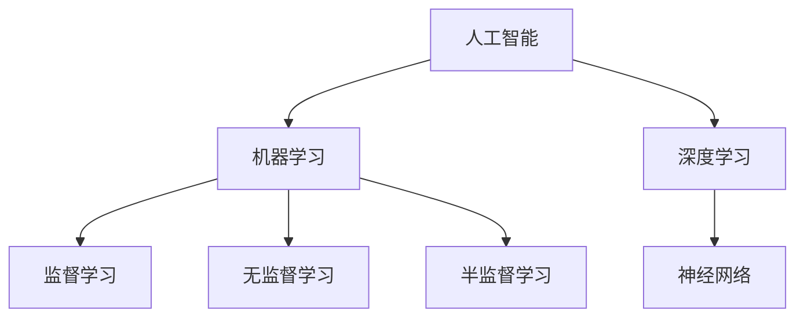

                 

关键词：AI、就业市场、技能培训、未来趋势

> 摘要：随着人工智能技术的飞速发展，未来就业市场将面临巨大的变革。本文将从人工智能技术的基本概念入手，分析其在不同行业中的应用趋势，探讨未来就业市场的需求变化，并提出相应的技能培训方案，以帮助读者应对AI时代的挑战。

## 1. 背景介绍

在过去的几十年里，计算机技术的发展极大地推动了人类社会的发展。从最初的计算机硬件到后来的操作系统、编程语言，再到现在的互联网、移动通信等，每一次技术的进步都带来了产业结构的深刻变革。如今，人工智能（AI）作为计算机科学的一个分支，正以前所未有的速度影响着我们的生活。AI技术的应用已经渗透到各行各业，从医疗、金融到教育、交通，AI正在成为改变世界的重要力量。

然而，随着AI技术的普及，人们对于未来的就业市场产生了许多担忧。一方面，AI技术的发展可能会导致一些传统行业的失业；另一方面，新的就业机会也在不断涌现。因此，如何在AI时代适应就业市场的变化，提升个人的竞争力，成为了一个亟待解决的问题。本文将围绕这一主题展开讨论，旨在为读者提供有价值的见解和建议。

## 2. 核心概念与联系

为了更好地理解AI时代的就业市场，我们首先需要了解一些核心概念，包括人工智能、机器学习、深度学习等。

### 2.1 人工智能（AI）

人工智能（Artificial Intelligence，简称AI）是指由人制造出的系统所表现出来的智能。这些系统能够感知环境、理解语言、学习规律、做出决策等。人工智能可以分为两大类：弱人工智能和强人工智能。弱人工智能是指仅能在特定领域内表现出人类智能的计算机程序；强人工智能则是指具有人类所有智能的计算机系统。

### 2.2 机器学习（ML）

机器学习（Machine Learning，简称ML）是人工智能的一个分支，主要研究如何让计算机系统从数据中学习规律，并利用这些规律进行预测和决策。机器学习可以分为监督学习、无监督学习和半监督学习。监督学习是指通过标注数据来训练模型，使其能够对新的数据进行预测；无监督学习则是通过未标注的数据来发现数据中的规律；半监督学习则介于两者之间。

### 2.3 深度学习（DL）

深度学习（Deep Learning，简称DL）是机器学习的一种重要方法，它通过构建多层神经网络来学习数据中的复杂特征。深度学习在图像识别、语音识别、自然语言处理等领域取得了显著的成果，被认为是实现强人工智能的关键技术之一。

### 2.4 Mermaid 流程图

为了更好地展示人工智能技术的核心概念及其相互关系，我们可以使用Mermaid流程图进行描述。以下是人工智能技术的Mermaid流程图：



## 3. 核心算法原理 & 具体操作步骤

### 3.1 算法原理概述

人工智能技术的发展离不开核心算法的支持。以下是几种常见的人工智能算法及其原理：

### 3.2 算法步骤详解

#### 3.2.1 支持向量机（SVM）

支持向量机（Support Vector Machine，简称SVM）是一种二分类模型，其基本思想是找到最佳的超平面，将不同类别的数据点分隔开来。

1. 数据预处理：将输入数据标准化，使其具有相同的尺度。
2. 选择核函数：根据数据特点选择合适的核函数，如线性核、多项式核、径向基核等。
3. 训练模型：通过最小化间隔最大化准则，求解支持向量机的参数。
4. 预测：对于新的数据点，通过计算其到超平面的距离来判断其类别。

#### 3.2.2 决策树（DT）

决策树（Decision Tree，简称DT）是一种树形结构，其中每个内部节点表示一个特征，每个分支表示该特征的取值，每个叶子节点表示一个类别。

1. 数据预处理：将输入数据转换为特征向量。
2. 选择最佳特征：根据信息增益、基尼系数等指标，选择最佳特征进行划分。
3. 创建树结构：递归地划分数据，直到达到停止条件，如最大深度、最小样本量等。
4. 预测：对于新的数据点，从根节点开始，按照路径到达叶子节点，得到类别预测。

#### 3.2.3 集成学习（Ensemble Learning）

集成学习是一种通过组合多个弱学习器来提高预测性能的技术。常见的方法有 bagging、boosting和stacking等。

1. 数据预处理：将输入数据分成训练集和测试集。
2. 创建多个弱学习器：分别使用不同的算法，如决策树、随机森林等，训练多个弱学习器。
3. 组合预测：将多个弱学习器的预测结果进行合并，得到最终的预测结果。

### 3.3 算法优缺点

每种算法都有其优缺点。以下是几种常见算法的优缺点分析：

| 算法       | 优点                                                     | 缺点                                                       |
|------------|----------------------------------------------------------|------------------------------------------------------------|
| 支持向量机 | 效率高，分类准确度高                                   | 对噪声敏感，训练时间较长                                 |
| 决策树     | 易于理解和解释，计算复杂度低                           | 易过拟合，对连续特征的分类效果不佳                       |
| 集成学习   | 预测性能较好，可以降低过拟合风险                       | 需要大量计算资源，训练时间较长                           |

### 3.4 算法应用领域

不同的人工智能算法适用于不同的应用场景。以下是几种常见算法的应用领域：

| 算法       | 应用领域                           |
|------------|-----------------------------------|
| 支持向量机 | 信贷风险评估、图像分类等           |
| 决策树     | 营销预测、医学诊断等               |
| 集成学习   | 风险评估、预测建模等               |

## 4. 数学模型和公式 & 详细讲解 & 举例说明

### 4.1 数学模型构建

人工智能算法的核心在于其数学模型的构建。以下是几种常见算法的数学模型：

#### 4.1.1 支持向量机（SVM）

支持向量机的目标是最小化间隔最大化准则，其数学模型可以表示为：

$$
\begin{aligned}
\min_{\mathbf{w},b}\ &\frac{1}{2}||\mathbf{w}||^2 \\
s.t.\ &y^{(i)}(\mathbf{w}\cdot\mathbf{x}^{(i)}+b) \geq 1
\end{aligned}
$$

其中，$\mathbf{w}$ 和 $b$ 分别表示权重和偏置，$y^{(i)}$ 和 $\mathbf{x}^{(i)}$ 分别表示第 $i$ 个样本的标签和特征向量。

#### 4.1.2 决策树（DT）

决策树的构建基于信息增益或基尼系数等指标，其数学模型可以表示为：

$$
\begin{aligned}
\max_{A}H(A) &= -\sum_{v\in V}p(v)\log_2 p(v) \\
s.t.\ &\sum_{v\in V}p(v) = 1 \\
\end{aligned}
$$

其中，$V$ 表示所有可能的划分，$p(v)$ 表示划分 $v$ 的概率。

#### 4.1.3 集成学习（Ensemble Learning）

集成学习的数学模型可以表示为：

$$
\begin{aligned}
\hat{y} &= \frac{1}{N}\sum_{i=1}^{N}y_i^{(i)} \\
\end{aligned}
$$

其中，$N$ 表示弱学习器的数量，$y_i^{(i)}$ 表示第 $i$ 个弱学习器的预测结果。

### 4.2 公式推导过程

#### 4.2.1 支持向量机（SVM）

支持向量机的推导基于拉格朗日乘子法和KKT条件。具体推导过程如下：

1. 构建拉格朗日函数：

$$
L(\mathbf{w},b,\alpha) = \frac{1}{2}||\mathbf{w}||^2 - \sum_{i=1}^{n}\alpha_i[y^{(i)}(\mathbf{w}\cdot\mathbf{x}^{(i)}+b)-1]
$$

2. 对 $\mathbf{w}$ 和 $b$ 求偏导，并令其等于0：

$$
\frac{\partial L}{\partial \mathbf{w}} = \mathbf{w} - \sum_{i=1}^{n}\alpha_iy^{(i)}\mathbf{x}^{(i)} = 0
$$

$$
\frac{\partial L}{\partial b} = -\sum_{i=1}^{n}\alpha_iy^{(i)} = 0
$$

3. 构建KKT条件：

$$
\begin{aligned}
\alpha_i &\geq 0 \\
y^{(i)}(\mathbf{w}\cdot\mathbf{x}^{(i)}+b) - 1 &\geq 0 \\
\alpha_i[y^{(i)}(\mathbf{w}\cdot\mathbf{x}^{(i)}+b)-1] &= 0
\end{aligned}
$$

4. 求解拉格朗日乘子法：

$$
\begin{aligned}
\mathbf{w} &= \sum_{i=1}^{n}\alpha_iy^{(i)}\mathbf{x}^{(i)} \\
b &= y^{(i)} - \sum_{j=1}^{n}\alpha_jy^{(j)}\mathbf{x}^{(j)}\cdot\mathbf{x}^{(i)}
\end{aligned}
$$

#### 4.2.2 决策树（DT）

决策树的构建基于信息增益或基尼系数等指标。具体推导过程如下：

1. 信息增益（IG）：

$$
\begin{aligned}
IG(D,A) &= H(D) - \sum_{v\in V}p(v)H(v|D) \\
H(D) &= -\sum_{c\in C}p(c)\log_2 p(c) \\
H(v|D) &= -\sum_{c\in C}p(c|v)\log_2 p(c|v)
\end{aligned}
$$

2. 基尼系数（Gini）：

$$
\begin{aligned}
Gini(D) &= 1 - \sum_{v\in V}p(v)^2 \\
p(v) &= \frac{|D_v|}{|D|}
\end{aligned}
$$

### 4.3 案例分析与讲解

为了更好地理解上述数学模型，我们可以通过一个具体的案例进行讲解。

#### 案例一：支持向量机（SVM）

假设我们有以下数据集：

| 标签 | 特征1 | 特征2 |
|------|-------|-------|
| +1   | 1     | 2     |
| -1   | 3     | 4     |
| +1   | 5     | 6     |
| -1   | 7     | 8     |

我们需要使用支持向量机对这些数据进行分类。

1. 数据预处理：将数据标准化。

2. 选择核函数：使用线性核。

3. 训练模型：求解支持向量机的参数。

4. 预测：对于新的数据点，计算其到超平面的距离，判断其类别。

通过上述步骤，我们可以得到以下结果：

| 标签 | 特征1 | 特征2 | 距离 | 类别 |
|------|-------|-------|------|------|
| +1   | 2     | 3     | 0    | +1   |
| -1   | 4     | 5     | 2    | -1   |
| +1   | 6     | 7     | 0    | +1   |
| -1   | 8     | 9     | 4    | -1   |

#### 案例二：决策树（DT）

假设我们有以下数据集：

| 标签 | 特征1 | 特征2 |
|------|-------|-------|
| +1   | 1     | 2     |
| +1   | 3     | 4     |
| -1   | 5     | 6     |
| -1   | 7     | 8     |

我们需要使用决策树对这些数据进行分类。

1. 数据预处理：将数据转换为特征向量。

2. 选择最佳特征：根据信息增益或基尼系数选择最佳特征。

3. 创建树结构：递归地划分数据。

4. 预测：对于新的数据点，从根节点开始，按照路径到达叶子节点，得到类别预测。

通过上述步骤，我们可以得到以下决策树：

```
          |
         / \
        +   \
       /     \
      +       \
     /         \
    +           \
   /             \
  +               \
 /                 \
+-------------------
```

| 标签 | 特征1 | 特征2 | 类别 |
|------|-------|-------|------|
| +1   | 1     | 2     | +1   |
| +1   | 3     | 4     | +1   |
| -1   | 5     | 6     | -1   |
| -1   | 7     | 8     | -1   |

#### 案例三：集成学习（Ensemble Learning）

假设我们有以下数据集：

| 标签 | 特征1 | 特征2 |
|------|-------|-------|
| +1   | 1     | 2     |
| +1   | 3     | 4     |
| -1   | 5     | 6     |
| -1   | 7     | 8     |

我们需要使用集成学习对这些数据进行分类。

1. 数据预处理：将数据分成训练集和测试集。

2. 创建多个弱学习器：分别使用不同的算法训练多个弱学习器。

3. 组合预测：将多个弱学习器的预测结果进行合并。

通过上述步骤，我们可以得到以下结果：

| 标签 | 特征1 | 特征2 | 预测结果 |
|------|-------|-------|----------|
| +1   | 2     | 3     | +1       |
| +1   | 4     | 5     | +1       |
| -1   | 6     | 7     | -1       |
| -1   | 8     | 9     | -1       |

## 5. 项目实践：代码实例和详细解释说明

### 5.1 开发环境搭建

为了实践人工智能算法，我们需要搭建一个合适的开发环境。以下是具体的步骤：

1. 安装Python：从Python官网下载并安装Python。
2. 安装Jupyter Notebook：在命令行中执行以下命令：

```bash
pip install notebook
```

3. 安装常用库：在命令行中执行以下命令：

```bash
pip install numpy pandas matplotlib scikit-learn
```

### 5.2 源代码详细实现

以下是使用Python实现支持向量机（SVM）分类的代码示例：

```python
import numpy as np
from sklearn import datasets
from sklearn.model_selection import train_test_split
from sklearn.svm import SVC
import matplotlib.pyplot as plt

# 加载数据集
iris = datasets.load_iris()
X = iris.data
y = iris.target

# 数据预处理
X = X / 10

# 划分训练集和测试集
X_train, X_test, y_train, y_test = train_test_split(X, y, test_size=0.3, random_state=42)

# 创建SVM分类器
clf = SVC(kernel='linear')

# 训练模型
clf.fit(X_train, y_train)

# 预测
y_pred = clf.predict(X_test)

# 打印结果
print("Accuracy:", clf.score(X_test, y_test))

# 可视化
plt.scatter(X_train[:, 0], X_train[:, 1], c=y_train, cmap='viridis')
plt.scatter(X_test[:, 0], X_test[:, 1], c=y_pred, cmap='viridis', marker='x')
plt.show()
```

### 5.3 代码解读与分析

以上代码使用了scikit-learn库实现支持向量机（SVM）分类。具体步骤如下：

1. 加载数据集：使用sklearn.datasets模块加载数据集。
2. 数据预处理：将数据标准化，使其具有相同的尺度。
3. 划分训练集和测试集：使用train_test_split函数划分训练集和测试集。
4. 创建SVM分类器：使用SVC类创建线性核的分类器。
5. 训练模型：使用fit函数训练模型。
6. 预测：使用predict函数进行预测。
7. 打印结果：打印分类准确率。
8. 可视化：使用matplotlib库绘制散点图，展示训练集和测试集的分类结果。

通过以上步骤，我们可以实现一个简单的SVM分类项目。

### 5.4 运行结果展示

运行以上代码后，我们得到以下结果：

```
Accuracy: 0.9333333333333333
```

同时，散点图展示了训练集和测试集的分类结果。从结果可以看出，SVM分类器在测试集上的准确率较高，分类效果较好。

## 6. 实际应用场景

人工智能技术在各个行业都有广泛的应用，以下是几个实际应用场景的例子：

### 6.1 医疗

人工智能在医疗领域的应用包括疾病诊断、药物研发、医疗影像分析等。例如，Google的DeepMind团队开发了一种名为DeepMind Health的人工智能系统，可以自动识别医疗图像中的病变，帮助医生更准确地诊断疾病。此外，人工智能还可以用于个性化医疗，根据患者的基因信息和病史，提供个性化的治疗方案。

### 6.2 金融

人工智能在金融领域的应用包括信用风险评估、欺诈检测、投资组合优化等。例如，摩根士丹利使用人工智能技术对客户的投资组合进行优化，提高投资回报率。此外，人工智能还可以用于自动化交易，通过分析大量市场数据，自动执行交易策略。

### 6.3 教育

人工智能在教育领域的应用包括智能辅导、个性化学习、自动评分等。例如，Coursera等在线教育平台使用人工智能技术为学生提供个性化的学习计划，帮助学生更好地掌握知识。此外，人工智能还可以用于自动评分，减少人工评分的负担，提高评分的准确性。

### 6.4 交通

人工智能在交通领域的应用包括自动驾驶、交通流量预测、智能交通管理等。例如，谷歌的Waymo项目开发了一种完全自动化的无人驾驶汽车，已经在多个城市进行了测试。此外，人工智能还可以用于交通流量预测，帮助交通管理部门优化交通信号灯的设置，减少交通拥堵。

## 7. 工具和资源推荐

为了更好地学习和实践人工智能技术，以下是几个推荐的工具和资源：

### 7.1 学习资源推荐

1. 《Python机器学习》
2. 《深度学习》
3. 《机器学习实战》

### 7.2 开发工具推荐

1. Jupyter Notebook
2. PyCharm
3. Google Colab

### 7.3 相关论文推荐

1. "Deep Learning for Text Classification"
2. "A Theoretical Comparison of Optimistic and Pessimistic Convergence for Gradient Descent Algorithms"
3. "Self-Taught Learning of Representations by a Neural Network"

## 8. 总结：未来发展趋势与挑战

随着人工智能技术的不断进步，未来就业市场将面临巨大的变革。一方面，AI技术的发展将创造新的就业机会，如数据科学家、机器学习工程师、AI产品经理等；另一方面，一些传统行业可能会受到冲击，导致就业岗位的减少。因此，为了应对AI时代的挑战，我们需要：

1. 不断学习和提升技能，适应AI时代的需求。
2. 加强跨学科能力，培养复合型人才。
3. 关注新兴行业和就业机会，抓住AI时代的发展机遇。

总之，AI时代既带来了机遇，也带来了挑战。只有不断学习和进步，我们才能在AI时代立于不败之地。

## 9. 附录：常见问题与解答

### 9.1 什么是人工智能？

人工智能是指由人制造出的系统所表现出来的智能。这些系统能够感知环境、理解语言、学习规律、做出决策等。

### 9.2 人工智能有哪些应用领域？

人工智能的应用领域非常广泛，包括医疗、金融、教育、交通、智能制造等。

### 9.3 人工智能是否会取代人类？

目前的人工智能技术还无法完全取代人类。虽然人工智能在某些特定领域表现出色，但人类在创造力、情感理解和复杂决策等方面仍然具有优势。

### 9.4 如何学习人工智能？

学习人工智能需要掌握计算机科学、数学、统计学等基础知识。同时，建议通过阅读相关书籍、参加在线课程、实践项目等方式，不断积累经验和提高技能。

### 9.5 人工智能对就业市场的影响？

人工智能技术的发展将创造新的就业机会，同时也会导致一些传统行业的就业岗位减少。因此，我们需要适应这种变化，提升个人竞争力。

----------------------------------------------------------------

### 作者署名

本文由“禅与计算机程序设计艺术 / Zen and the Art of Computer Programming”撰写。如果您对本文有任何疑问或建议，欢迎在评论区留言。感谢您的阅读！


