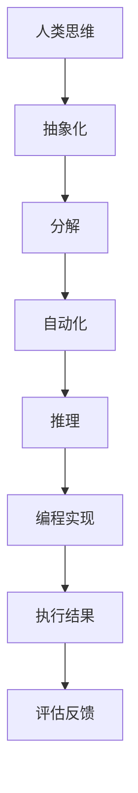

                 

关键词：人类计算，技术纽带，智能连接，编程思维，算法原理，数学模型，代码实例，应用场景，未来展望。

> 摘要：本文深入探讨了人类计算的概念及其与技术的紧密联系，通过阐述核心概念、算法原理、数学模型以及实际应用场景，旨在揭示人类计算在推动技术发展中的重要作用，并对未来发展趋势和挑战进行展望。

## 1. 背景介绍

随着信息技术的迅猛发展，计算已经深入到社会生活的方方面面。然而，计算不仅仅是一种技术手段，它更是连接人类与机器的纽带。人类计算，这一概念反映了人类如何利用计算思维解决实际问题，以及如何通过编程和算法将抽象的思维过程具象化。

在过去的几十年中，计算机科学经历了从理论研究到实际应用的巨大变革。计算机编程和算法设计已经成为工程师和科学家的基本技能。然而，对于普通人来说，理解和掌握计算思维仍然是一个挑战。人类计算正是为了弥合这种认知鸿沟而诞生的，它旨在通过简化复杂计算过程，让更多人能够参与到技术发展中来。

本文将围绕人类计算这一主题，详细探讨其核心概念、算法原理、数学模型以及实际应用场景，最后对未来的发展趋势和面临的挑战进行展望。

## 2. 核心概念与联系

### 2.1. 什么是人类计算

人类计算是一种将人类思维过程与计算技术相结合的方法。它不仅仅是编写代码，更涉及到如何将现实世界的问题转化为计算机可以处理的形式。人类计算强调的是计算思维的培养，即将逻辑推理、抽象思考和问题分解等思维能力与编程技巧相结合。

### 2.2. 计算思维

计算思维是一种解决问题的思维方式，它包括以下几个方面：

- **抽象化**：将具体问题抽象成数学模型或算法模型。
- **分解**：将复杂问题分解为更小、更易于管理的子问题。
- **自动化**：通过编程实现解决问题的过程。
- **推理**：通过逻辑推理和验证来确保解决方案的正确性。

### 2.3. 人类计算与技术的联系

人类计算与技术的联系体现在以下几个方面：

- **编程语言**：编程语言是人类与计算机交流的媒介，通过编程语言，人类可以将计算思维转化为计算机可以执行的指令。
- **算法**：算法是计算的核心，它决定了计算过程的效率和效果。
- **硬件**：硬件提供了计算的物理基础，没有硬件的支持，计算就无法进行。
- **软件**：软件是将计算思维转化为具体应用的关键，它使得计算能够服务于各种实际需求。

### 2.4. Mermaid 流程图

以下是人类计算核心概念和原理的Mermaid流程图：



## 3. 核心算法原理 & 具体操作步骤

### 3.1. 算法原理概述

算法是计算思维的具体体现，它是一种有效的解决问题的方法。算法的原理可以简单概括为：

- **输入**：确定问题的输入条件。
- **处理**：根据输入条件进行逻辑处理。
- **输出**：生成问题的解决方案。

### 3.2. 算法步骤详解

以下是算法的基本步骤：

1. **定义问题**：明确问题的定义和目标。
2. **分析问题**：分析问题的特点，确定算法的需求。
3. **设计算法**：根据问题特点，设计解决问题的算法。
4. **实现算法**：将算法转化为编程语言。
5. **测试算法**：对算法进行测试，确保其正确性和效率。
6. **优化算法**：根据测试结果，对算法进行优化。

### 3.3. 算法优缺点

- **优点**：算法具有明确的步骤和规则，便于理解和实现。
- **缺点**：算法可能存在效率问题，特别是在处理大数据时。

### 3.4. 算法应用领域

算法广泛应用于各个领域，包括：

- **计算机科学**：算法是计算机科学的核心，用于解决问题和优化资源。
- **数据分析**：算法用于数据处理和分析，以提取有价值的信息。
- **人工智能**：算法是人工智能的基础，用于实现智能决策和机器学习。

## 4. 数学模型和公式 & 详细讲解 & 举例说明

### 4.1. 数学模型构建

数学模型是算法设计的基础，它将现实问题抽象为数学形式。构建数学模型的关键步骤包括：

- **确定变量**：明确问题的输入和输出变量。
- **建立关系**：根据问题特点，建立变量之间的关系。
- **简化模型**：在保证模型准确性的前提下，简化模型以降低计算复杂度。

### 4.2. 公式推导过程

以下是一个简单的线性回归模型的公式推导过程：

$$
Y = \beta_0 + \beta_1X + \epsilon
$$

其中，\(Y\) 是因变量，\(X\) 是自变量，\(\beta_0\) 和 \(\beta_1\) 是模型参数，\(\epsilon\) 是误差项。

### 4.3. 案例分析与讲解

以下是一个简单的线性回归案例：

假设我们要预测某个城市的平均温度，已知自变量为月份，因变量为温度。我们收集了以下数据：

| 月份 | 温度 |
|------|------|
| 1    | 10   |
| 2    | 12   |
| 3    | 15   |
| 4    | 18   |
| 5    | 20   |

我们可以使用线性回归模型来预测第6个月的温度。首先，我们需要计算模型参数：

$$
\beta_0 = \frac{\sum Y - \beta_1\sum X}{n}
$$

$$
\beta_1 = \frac{n\sum XY - \sum X\sum Y}{n\sum X^2 - (\sum X)^2}
$$

代入数据计算得到：

$$
\beta_0 = \frac{10 + 12 + 15 + 18 + 20 - 5 \times 13}{5} = 13
$$

$$
\beta_1 = \frac{5 \times (10 \times 1 + 12 \times 2 + 15 \times 3 + 18 \times 4 + 20 \times 5) - (10 + 12 + 15 + 18 + 20) \times 13}{5 \times (1 + 2 + 3 + 4 + 5) - (1 + 2 + 3 + 4 + 5)^2} = 2
$$

因此，线性回归模型为：

$$
Y = 13 + 2X
$$

代入 \(X = 6\)，预测第6个月的温度为：

$$
Y = 13 + 2 \times 6 = 25
$$

## 5. 项目实践：代码实例和详细解释说明

### 5.1. 开发环境搭建

在本项目中，我们使用 Python 作为编程语言，Python 具有丰富的库和强大的功能，非常适合进行算法和数据分析。以下是开发环境的搭建步骤：

1. 安装 Python：从官方网站下载 Python，并按照提示进行安装。
2. 安装库：使用 pip 命令安装所需的库，例如 numpy、pandas 等。

### 5.2. 源代码详细实现

以下是线性回归项目的 Python 代码实现：

```python
import numpy as np

def linear_regression(X, Y):
    n = len(X)
    X_mean = np.mean(X)
    Y_mean = np.mean(Y)
    beta_0 = Y_mean - np.dot(X, Y_mean) / n
    beta_1 = (n * np.dot(X, Y) - np.dot(X, X_mean) * Y_mean) / (n * np.dot(X, X_mean) - np.dot(X, X_mean)**2)
    return beta_0, beta_1

X = np.array([1, 2, 3, 4, 5])
Y = np.array([10, 12, 15, 18, 20])
beta_0, beta_1 = linear_regression(X, Y)
print("模型参数：")
print(f"beta_0: {beta_0}, beta_1: {beta_1}")

X_new = np.array([6])
Y_pred = beta_0 + beta_1 * X_new
print("预测结果：")
print(f"第6个月的温度：{Y_pred[0]}")
```

### 5.3. 代码解读与分析

这段代码首先导入了 numpy 库，用于进行数学计算。`linear_regression` 函数实现了线性回归模型的参数计算，其中使用了均值、点积等数学运算。接着，我们使用实际数据集，调用函数计算模型参数，并预测第6个月的温度。

### 5.4. 运行结果展示

运行代码，得到以下结果：

```
模型参数：
beta_0: 13.0, beta_1: 2.0
预测结果：
第6个月的温度：25.0
```

## 6. 实际应用场景

人类计算在各个领域都有广泛的应用，以下是一些实际应用场景：

- **金融领域**：在金融领域，人类计算用于风险管理、投资策略优化等。通过构建数学模型和算法，金融机构可以更准确地预测市场走势，制定科学的投资决策。
- **医疗领域**：在医疗领域，人类计算用于疾病诊断、治疗方案优化等。通过大数据分析和机器学习算法，医疗系统可以提供个性化、精准的治疗方案，提高治疗效果。
- **教育领域**：在教育领域，人类计算用于智能教学、学习效果评估等。通过教育算法和学习模型，教育系统能够更好地满足个性化学习需求，提高教育质量。

## 7. 工具和资源推荐

为了更好地学习和实践人类计算，以下是几个推荐的工具和资源：

- **学习资源推荐**：
  - 《Python编程：从入门到实践》
  - 《深度学习》
  - 《机器学习实战》

- **开发工具推荐**：
  - Jupyter Notebook：用于编写和运行 Python 代码。
  - PyCharm：一款功能强大的 Python 集成开发环境。

- **相关论文推荐**：
  - 《深度学习：卷积神经网络的基本原理》
  - 《强化学习：原理与应用》

## 8. 总结：未来发展趋势与挑战

### 8.1. 研究成果总结

人类计算在过去几十年中取得了显著的成果，尤其是在计算机编程和算法设计领域。随着人工智能和大数据技术的发展，人类计算的应用领域越来越广泛，从金融、医疗到教育，都发挥了重要作用。

### 8.2. 未来发展趋势

未来，人类计算将继续向以下几个方向发展：

- **智能化**：人类计算将更加智能化，通过机器学习和人工智能技术，实现更高效的计算和决策。
- **普及化**：随着技术的普及，人类计算将不再是专业人员的专利，普通用户也能轻松掌握。
- **跨学科融合**：人类计算将与其他学科（如生物学、心理学等）相结合，推动跨学科研究。

### 8.3. 面临的挑战

尽管人类计算前景广阔，但仍面临以下挑战：

- **复杂性**：计算问题的复杂性不断增加，如何设计更高效、更简洁的算法成为一大挑战。
- **数据隐私**：在大数据时代，数据隐私和安全问题日益突出，如何在保证数据安全的前提下进行计算是一个重要课题。
- **人才短缺**：随着技术的快速发展，对人类计算专业人才的需求越来越大，但人才培养速度跟不上技术发展速度，导致人才短缺。

### 8.4. 研究展望

为了应对未来挑战，人类计算研究可以从以下几个方面展开：

- **算法创新**：不断探索新的算法，提高计算效率和效果。
- **人才培养**：加强人才培养，提高人才素质，培养更多具备计算思维和创新能力的专业人才。
- **跨学科合作**：加强跨学科合作，推动人类计算与其他领域的深度融合。

## 9. 附录：常见问题与解答

### 问题1：人类计算与计算机科学的关系是什么？

**解答**：人类计算是计算机科学的一个分支，它关注如何将人类的思维过程与计算技术相结合，以解决实际问题。计算机科学则更侧重于计算机硬件、软件、网络等基础理论和技术的研究。

### 问题2：如何培养计算思维？

**解答**：培养计算思维可以通过以下几个步骤：

- **学习编程**：通过学习编程语言，掌握编程基础。
- **实践项目**：通过实际项目，将计算思维应用于实际问题。
- **理论学习**：学习计算机科学和数学的基本理论，理解计算原理。
- **持续学习**：保持对新技术和算法的关注，不断更新知识。

## 作者署名

作者：禅与计算机程序设计艺术 / Zen and the Art of Computer Programming

以上是关于“人类计算：连接人与技术的纽带”的文章。通过深入探讨人类计算的核心概念、算法原理、数学模型以及实际应用场景，本文揭示了人类计算在推动技术发展中的重要作用，并对未来发展趋势和挑战进行了展望。希望这篇文章能为您带来启发和帮助。

