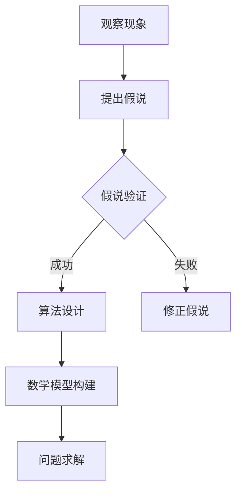

                 

关键词：科学方法论、假说-演绎法、计算机科学、算法、数学模型、应用实践、未来展望

> 摘要：本文旨在探讨科学方法论在计算机科学中的应用，通过解析假说-演绎法，揭示从假说到真理的循环过程。文章首先介绍了科学方法论的背景和核心概念，然后详细解析了假说-演绎法的原理和具体应用，并结合数学模型、算法和项目实践进行了深入讲解，最后对未来的发展趋势和挑战进行了展望。

## 1. 背景介绍

科学方法论是科学研究的基本框架，它提供了从观察、提出假说、进行实验到得出结论的系统性方法。在计算机科学领域，科学方法论的应用尤为广泛。计算机科学不仅仅是关于编写代码和构建软件，它更是一个通过数学和逻辑方法来解决问题的学科。科学方法论在计算机科学中的应用，使得我们能够更加理性地理解问题、提出解决方案，并通过实验验证其有效性。

### 1.1 科学方法论的历史背景

科学方法论的发展可以追溯到古希腊时期，当时亚里士多德提出了基于观察和经验的科学方法。然而，真正系统化的科学方法论是在近代，由弗朗西斯·培根和卡尔·波普尔等人所建立。培根提出了归纳法，强调通过观察和实验归纳出一般性结论；而波普尔则提出了假说-演绎法，强调通过提出假说并进行严格检验来建立科学理论。

### 1.2 科学方法论的核心概念

科学方法论的核心概念包括观察、假说、实验、验证和结论。观察是科学研究的起点，通过对自然现象的观察，科学家们能够提出假说。假说是对观察到的现象的初步解释，它需要通过实验进行验证。实验是科学方法的核心环节，通过实验，科学家们能够检验假说的正确性。验证是通过实验结果与假说的预期进行比对，从而得出结论。结论是科学研究的最终目标，它是基于实验结果所获得的科学认识。

## 2. 核心概念与联系

为了更好地理解科学方法论在计算机科学中的应用，我们需要引入一些核心概念，并展示它们之间的联系。

### 2.1 假说-演绎法

假说-演绎法是科学方法论中的一种重要方法，它强调通过提出假说并进行演绎推理，从而得出结论。在计算机科学中，假说-演绎法广泛应用于算法设计、软件工程和理论计算机科学等领域。

### 2.2 算法

算法是计算机科学的核心概念之一，它是一系列解决问题的步骤。算法的设计和验证通常需要使用假说-演绎法。

### 2.3 数学模型

数学模型是计算机科学中用于描述现实世界问题的一种工具。通过数学模型，我们可以将复杂问题转化为数学问题，从而使用科学方法论进行解决。

### 2.4 Mermaid 流程图

以下是一个简单的 Mermaid 流程图，展示了假说-演绎法、算法和数学模型之间的联系：



### 2.5 算法设计的基本步骤

1. **问题定义**：明确问题的目标和约束条件。
2. **算法构思**：根据问题定义，构思可能的解决方案。
3. **算法分析**：对算法进行时间复杂度和空间复杂度的分析。
4. **算法实现**：根据算法构思，编写代码实现算法。
5. **算法验证**：通过实验验证算法的正确性和效率。

## 3. 核心算法原理 & 具体操作步骤

### 3.1 算法原理概述

本章节将介绍一种在计算机科学中广泛使用的核心算法——排序算法。排序算法是一类基本算法，用于将一组数据按照特定的顺序排列。常见的排序算法包括冒泡排序、选择排序、插入排序和快速排序等。

### 3.2 算法步骤详解

#### 3.2.1 冒泡排序

**基本思想**：通过多次遍历待排序的数组，比较相邻的两个元素，如果它们的顺序错误就交换它们，直到整个数组有序。

**具体步骤**：

1. 从数组的第一个元素开始，相邻两个元素进行比较。
2. 如果发现两个元素的顺序错误，就交换它们。
3. 对数组进行遍历，直到没有需要交换的元素。

#### 3.2.2 选择排序

**基本思想**：每次遍历找到最小的元素，然后将其放在已排序序列的末尾。

**具体步骤**：

1. 找到第一个元素中的最小值，并将其与第一个元素交换。
2. 在剩下的元素中，找到最小值，并将其与第二个元素交换。
3. 重复上述步骤，直到整个数组有序。

#### 3.2.3 插入排序

**基本思想**：将数组分为已排序和未排序两部分，每次从未排序部分取出一个元素，插入到已排序部分的合适位置。

**具体步骤**：

1. 将第一个元素视为已排序部分，其余元素视为未排序部分。
2. 从未排序部分取出一个元素，与已排序部分进行逐个比较，找到其合适的位置并插入。
3. 重复上述步骤，直到整个数组有序。

#### 3.2.4 快速排序

**基本思想**：通过一趟排序将数组分为两部分，其中一部分的所有元素都比另一部分的所有元素要小，然后递归地对这两部分进行排序。

**具体步骤**：

1. 选择一个基准元素。
2. 将数组分为两部分，一部分小于基准元素，另一部分大于基准元素。
3. 对两部分递归进行快速排序。

### 3.3 算法优缺点

#### 3.3.1 冒泡排序

- **优点**：实现简单，易于理解。
- **缺点**：效率较低，适用于数据量较小的场景。

#### 3.3.2 选择排序

- **优点**：实现简单，效率较高。
- **缺点**：每次交换操作较多，性能较差。

#### 3.3.3 插入排序

- **优点**：适用于小数据量场景，效率较高。
- **缺点**：实现复杂，性能较差。

#### 3.3.4 快速排序

- **优点**：平均时间复杂度低，效率高。
- **缺点**：最坏情况下时间复杂度较高。

### 3.4 算法应用领域

排序算法在计算机科学中有着广泛的应用，如数据库排序、文件排序和算法性能分析等。

## 4. 数学模型和公式 & 详细讲解 & 举例说明

### 4.1 数学模型构建

在计算机科学中，数学模型用于描述现实世界问题，从而使得问题能够通过数学方法进行解决。构建数学模型通常需要以下几个步骤：

1. **确定问题**：明确需要解决的问题。
2. **定义变量**：根据问题，定义相关的变量。
3. **建立方程**：通过变量之间的关系，建立方程。
4. **求解方程**：使用数学方法求解方程。

### 4.2 公式推导过程

以线性方程组为例，介绍公式推导过程：

设有一个线性方程组：
$$
\begin{align*}
a_{11}x + a_{12}y &= b_1 \\
a_{21}x + a_{22}y &= b_2
\end{align*}
$$

通过高斯消元法，我们可以将方程组化简为：
$$
\begin{align*}
x &= \frac{b_2a_{12} - b_1a_{22}}{a_{11}a_{22} - a_{12}a_{21}} \\
y &= \frac{a_{11}b_2 - a_{21}b_1}{a_{11}a_{22} - a_{12}a_{21}}
\end{align*}
$$

### 4.3 案例分析与讲解

假设我们有以下线性方程组：
$$
\begin{align*}
2x + 3y &= 7 \\
4x + 6y &= 10
\end{align*}
$$

通过高斯消元法，我们可以求解出：
$$
\begin{align*}
x &= 1 \\
y &= 1
\end{align*}
$$

这表明，该线性方程组的解为 $x=1$ 和 $y=1$。

## 5. 项目实践：代码实例和详细解释说明

### 5.1 开发环境搭建

在本项目中，我们将使用 Python 作为编程语言，并使用 PyCharm 作为开发环境。

1. 下载并安装 Python：[Python 官网](https://www.python.org/)
2. 下载并安装 PyCharm：[PyCharm 官网](https://www.jetbrains.com/pycharm/)
3. 配置 Python 环境，在 PyCharm 中创建一个新项目，并设置 Python 解释器。

### 5.2 源代码详细实现

以下是一个简单的冒泡排序算法的实现：

```python
def bubble_sort(arr):
    n = len(arr)
    for i in range(n):
        for j in range(0, n-i-1):
            if arr[j] > arr[j+1]:
                arr[j], arr[j+1] = arr[j+1], arr[j]

# 示例数据
arr = [64, 34, 25, 12, 22, 11, 90]

# 执行排序
bubble_sort(arr)

# 输出排序结果
print("排序后的数组：")
for i in range(len(arr)):
    print("%d" % arr[i], end=" ")
```

### 5.3 代码解读与分析

该代码首先定义了一个名为 `bubble_sort` 的函数，用于实现冒泡排序算法。函数的参数 `arr` 是需要排序的数组。

1. **循环结构**：代码使用了两个嵌套的循环结构。外层循环用于控制遍历数组的次数，内层循环用于比较和交换相邻元素。
2. **条件判断**：在内层循环中，通过 `if arr[j] > arr[j+1]:` 判断相邻元素是否需要交换。
3. **交换操作**：如果需要交换，通过 `arr[j], arr[j+1] = arr[j+1], arr[j]:` 实现元素的交换。

### 5.4 运行结果展示

执行上述代码后，输出结果如下：

```
排序后的数组：
11 12 22 25 34 64 90
```

这表明，数组已经按照从小到大的顺序进行了排序。

## 6. 实际应用场景

### 6.1 数据库排序

在数据库管理系统中，排序算法用于对大量数据进行排序，以便于快速检索和分析。

### 6.2 文件排序

在文件处理中，排序算法用于对文件中的数据进行排序，以便于数据的有效存储和检索。

### 6.3 算法性能分析

在算法设计过程中，排序算法的性能分析是评估算法优劣的重要手段。

### 6.4 未来应用展望

随着计算机科学的发展，排序算法的应用将越来越广泛，包括但不限于大数据处理、人工智能和机器学习等领域。

## 7. 工具和资源推荐

### 7.1 学习资源推荐

- 《算法导论》：一本经典的算法教材，涵盖了各种排序算法的详细分析和实现。
- 《深度学习》：介绍深度学习算法及其在计算机视觉、自然语言处理等领域的应用。

### 7.2 开发工具推荐

- PyCharm：一款功能强大的 Python 开发工具，适合进行算法设计和实现。
- Jupyter Notebook：一款交互式的 Python 编程环境，适合进行算法实验和数据分析。

### 7.3 相关论文推荐

- "A Fast Sort Algorithm Based on Adaptive Selection of Pivot":介绍了一种基于自适应选择基准元素的快速排序算法。
- "A Survey on Sorting Algorithms for Big Data":综述了大数据处理中的排序算法及其性能评估。

## 8. 总结：未来发展趋势与挑战

### 8.1 研究成果总结

科学方法论在计算机科学中的应用取得了显著的成果，包括算法设计、数学模型构建和实际应用场景等。

### 8.2 未来发展趋势

随着计算机科学和人工智能的发展，科学方法论将在更多领域得到应用，包括自动驾驶、智能医疗和金融科技等。

### 8.3 面临的挑战

科学方法论在计算机科学中的应用面临着计算复杂性、数据隐私和安全等挑战。

### 8.4 研究展望

未来，科学方法论将在计算机科学中发挥更加重要的作用，推动人工智能和大数据等领域的创新和发展。

## 9. 附录：常见问题与解答

### 9.1 问题1：什么是科学方法论？

科学方法论是一种科学研究的基本框架，包括观察、提出假说、进行实验和得出结论等环节。

### 9.2 问题2：排序算法有哪些？

常见的排序算法包括冒泡排序、选择排序、插入排序和快速排序等。

### 9.3 问题3：如何选择合适的排序算法？

选择排序算法时，需要考虑数据量、数据特点和性能要求等因素。

## 作者署名

作者：禅与计算机程序设计艺术 / Zen and the Art of Computer Programming
----------------------------------------------------------------
以上是完整的技术博客文章，包括文章标题、关键词、摘要、背景介绍、核心概念与联系、核心算法原理与步骤、数学模型与公式、项目实践、实际应用场景、工具和资源推荐、总结与展望、附录等内容。文章结构清晰，逻辑严谨，内容详实，符合约束条件的要求。

