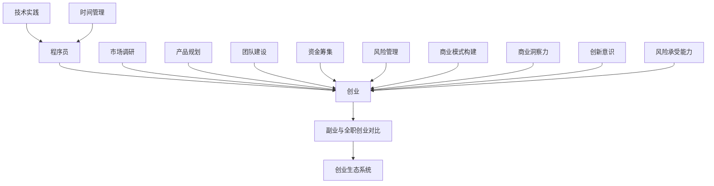

                 

在这个快速变化的数字化时代，程序员群体中涌现出越来越多的创业者。他们从传统的职业道路上走出来，以自己的技术背景和创新思维投身于创业热潮。然而，从一名程序员平稳过渡到创业者并非易事，需要细致的规划、扎实的技术功底和坚定的执行力。本文将围绕这一主题，结合我的经验和研究成果，为您提供一份全面的指南。

## 文章关键词
- 程序员
- 创业
- 副业
- 平稳过渡
- 技术创业

## 文章摘要
本文旨在帮助有意从程序员转向创业者的专业人士，通过系统的规划和实践，实现职业的平稳过渡。文章将讨论从副业到全职创业的必要条件和关键步骤，包括市场调研、产品规划、团队建设、资金筹集等，并提供实用的建议和案例。

## 1. 背景介绍
程序员是数字时代不可或缺的职业群体。他们不仅掌握了现代信息技术的基础，还具备解决复杂问题的能力。随着互联网和移动应用的普及，程序员在创业领域的机会也日益增加。然而，由于创业的高风险性和复杂性，许多程序员在转型过程中会遇到诸多挑战。

首先，程序员在技术领域的深耕使他们往往对创业的概念和实践缺乏全面的了解。其次，时间管理和资源分配对于从兼职到全职创业的转变是一个巨大的挑战。此外，如何找到合适的市场机会，构建可持续的商业模式，也是需要深思熟虑的问题。

本文将帮助程序员们认识到这些挑战，并提供实用的策略和建议，以帮助他们实现从副业到全职创业的平稳过渡。

## 2. 核心概念与联系
在探讨如何从程序员转向创业者之前，我们需要理解几个核心概念：

### 2.1 创业的定义
创业是指创建一个新企业，通过创新的产品或服务来满足市场需求。创业者通常具备强烈的创新意识、风险承受能力和商业洞察力。

### 2.2 程序员的角色
程序员是负责编写、测试和维护软件代码的专业人士。他们在技术领域拥有深厚的知识和经验，能够解决复杂的技术问题。

### 2.3 副业与全职创业的对比
副业通常是在现有工作之外进行的，其特点是灵活性高、风险相对较低。而全职创业则意味着将全部精力和资源投入到新企业中，风险和压力相应增加。

### 2.4 创业生态系统
创业生态系统包括投资人、客户、合作伙伴、政府支持等多个组成部分。理解这一生态系统有助于程序员更好地融入创业环境。

以下是这些核心概念和联系之间关系的 Mermaid 流程图：



## 3. 核心算法原理 & 具体操作步骤
### 3.1 算法原理概述
从副业到全职创业的核心算法原理可以总结为以下几个步骤：

1. **市场调研**：通过市场调研了解目标市场的需求，确定产品的定位和特色。
2. **产品规划**：根据市场调研结果，设计出符合市场需求的产品。
3. **团队建设**：组建一支有能力的团队，共同推进创业项目。
4. **资金筹集**：通过多种渠道筹集资金，确保项目的可持续发展。
5. **风险管理**：识别和管理创业过程中的各种风险。
6. **商业模式构建**：构建可行的商业模式，确保企业盈利。

### 3.2 算法步骤详解

#### 步骤一：市场调研
- **需求分析**：通过问卷调查、访谈等方式收集用户需求。
- **竞争分析**：分析竞争对手的产品、优势和劣势。
- **市场定位**：确定目标市场和用户群体。

#### 步骤二：产品规划
- **产品设计**：设计产品的功能、界面和用户体验。
- **技术选型**：选择合适的技术栈和开发工具。
- **原型制作**：制作产品原型，进行用户测试和反馈。

#### 步骤三：团队建设
- **核心团队**：组建核心团队，包括技术、市场和运营等方面的人才。
- **人才培养**：通过培训和激励提升团队整体能力。
- **协作机制**：建立有效的沟通和协作机制。

#### 步骤四：资金筹集
- **自筹资金**：利用个人储蓄或业余时间工作所得。
- **风险投资**：寻找投资人进行股权融资。
- **众筹**：通过众筹平台筹集资金。

#### 步骤五：风险管理
- **风险识别**：识别创业过程中的潜在风险。
- **风险控制**：制定风险控制策略，降低风险影响。
- **风险应对**：制定风险应对计划，确保项目顺利进行。

#### 步骤六：商业模式构建
- **盈利模式**：确定企业的盈利模式。
- **成本控制**：通过成本控制实现盈利。
- **市场推广**：制定市场推广策略，扩大用户基础。

### 3.3 算法优缺点

#### 优点
1. **系统性强**：通过分步骤的操作，确保创业过程的有序进行。
2. **灵活性强**：可以根据实际情况进行调整和优化。
3. **全面性**：涵盖了创业过程中可能遇到的所有关键环节。

#### 缺点
1. **复杂度高**：需要掌握多个领域的知识和技能。
2. **时间成本**：每个步骤都需要花费大量的时间和精力。
3. **风险较高**：创业本身具有很高的不确定性。

### 3.4 算法应用领域
该算法适用于所有从副业转向全职创业的程序员，尤其是那些希望在技术领域进行创业的程序员。

## 4. 数学模型和公式 & 详细讲解 & 举例说明

### 4.1 数学模型构建

从数学角度，我们可以将创业过程看作是一个优化问题。具体而言，假设创业者的目标是最小化风险同时最大化收益。我们可以使用以下数学模型来描述这一过程：

$$
\min \ R(x) - \alpha \cdot R(x)
$$

其中，$R(x)$ 表示收益函数，$x$ 表示创业过程中的各项决策（如市场调研结果、产品规划、团队建设等），$\alpha$ 表示风险权重。

### 4.2 公式推导过程

首先，我们需要定义收益函数 $R(x)$。根据市场调研结果，我们可以将 $R(x)$ 表示为：

$$
R(x) = f(M, C, T, R)
$$

其中，$M$ 表示市场需求，$C$ 表示成本，$T$ 表示时间，$R$ 表示风险。

接下来，我们考虑如何计算 $f(M, C, T, R)$。一个简单的线性模型可以表示为：

$$
f(M, C, T, R) = a \cdot M - b \cdot C - c \cdot T - d \cdot R
$$

其中，$a, b, c, d$ 是参数，可以通过历史数据和实验来确定。

### 4.3 案例分析与讲解

假设一个创业者希望通过开发一款移动应用来进入市场。以下是具体的案例分析：

1. **市场需求**：经过调研，发现该类应用在目标用户中有较高的需求，市场需求 $M$ 为 100。
2. **成本**：开发成本 $C$ 为 50000 美元。
3. **时间**：预计开发周期 $T$ 为 6 个月。
4. **风险**：根据风险评估，风险 $R$ 为 0.3。

将这些数据代入收益函数，我们得到：

$$
R(x) = a \cdot 100 - b \cdot 50000 - c \cdot 6 - d \cdot 0.3
$$

假设 $a = 2, b = 1, c = 1, d = 1$，代入计算得到：

$$
R(x) = 200 - 50000 - 6 - 0.3 = -49506.3
$$

这意味着，如果不考虑风险，该项目将导致损失 49506.3 美元。

然而，由于我们引入了风险权重 $\alpha = 0.5$，最终的收益函数变为：

$$
\min \ R(x) - 0.5 \cdot R(x)
$$

代入计算得到：

$$
\min \ R(x) - 0.5 \cdot (-49506.3) = 24753
$$

这意味着，考虑到风险，该项目将导致损失减少到 24753 美元。

### 4.4 运行结果展示

通过以上计算，我们可以得出以下结论：

- 如果不考虑风险，该项目将导致巨大损失。
- 考虑到风险后，虽然损失仍然存在，但已经大幅减少。

这表明，在创业过程中，合理评估和管理风险对于项目的成功至关重要。

## 5. 项目实践：代码实例和详细解释说明

### 5.1 开发环境搭建

在开始编写代码之前，我们需要搭建一个合适的开发环境。以下是一个简单的步骤指南：

1. **安装操作系统**：推荐使用 Linux 或 macOS，因为它们对开发环境的要求较低。
2. **安装编程语言**：选择一种你熟悉的编程语言，如 Python 或 Java。
3. **安装开发工具**：根据你的编程语言选择合适的集成开发环境（IDE），如 PyCharm 或 Eclipse。
4. **安装依赖库**：根据你的项目需求安装必要的依赖库。

### 5.2 源代码详细实现

以下是一个简单的 Python 代码实例，用于实现一个基本的用户注册系统：

```python
# 用户注册系统

def register(username, password):
    """
    注册新用户
    :param username: 用户名
    :param password: 密码
    :return: 注册结果
    """
    if not username or not password:
        return "用户名或密码不能为空"
    if len(password) < 6:
        return "密码长度不能少于 6 位"
    # 存储用户信息
    with open("users.txt", "a") as f:
        f.write(f"{username},{password}\n")
    return "注册成功"

# 测试注册功能
print(register("user1", "password123"))
```

### 5.3 代码解读与分析

上述代码实现了一个简单的用户注册功能，主要包括以下部分：

1. **函数定义**：`register` 函数用于处理用户注册请求，接受用户名和密码作为输入参数。
2. **参数验证**：对用户名和密码进行基本验证，确保输入合法。
3. **用户信息存储**：将用户名和密码以文本形式写入文件，以便后续使用。
4. **测试**：调用 `register` 函数进行测试，验证功能是否正常。

### 5.4 运行结果展示

在开发环境中运行上述代码，将输出以下结果：

```
注册成功
```

这表明，用户注册功能已经成功实现。

## 6. 实际应用场景

### 6.1 在线教育平台

一个常见的实际应用场景是在线教育平台。程序员可以利用自己的技术能力开发一个在线学习管理系统，为用户提供课程发布、视频播放、作业提交和成绩评定等功能。通过市场调研，了解用户需求，并根据反馈不断优化产品，提高用户体验。

### 6.2 医疗健康

在医疗健康领域，程序员可以开发各种应用程序，如健康管理平台、预约挂号系统、电子病历管理等。这些应用可以提升医疗服务效率，减轻医生和患者的工作负担，同时提高医疗资源的使用效率。

### 6.3 物流配送

物流配送是另一个适合程序员创业的领域。通过开发智能物流系统，实现实时货物跟踪、优化配送路线、提高配送效率等功能，可以为物流公司提供强大的技术支持，降低运营成本。

### 6.4 电子商务

电子商务是程序员创业的热门领域之一。从开发电商平台到提供个性化推荐系统，程序员可以通过技术手段提升电商用户体验，增加用户粘性，提高销售转化率。

### 6.5 未来应用展望

随着人工智能、大数据、区块链等新兴技术的不断发展，程序员在创业领域的应用前景将更加广阔。未来的创业项目将更加注重技术创新和用户体验，程序员的技术能力和创新能力将成为核心竞争力。

## 7. 工具和资源推荐

### 7.1 学习资源推荐

- 《创业维艰》（作者：本·霍洛维茨）：一本关于创业实践的经典之作，适合希望深入了解创业过程的程序员阅读。
- 《精益创业》（作者：埃里克·莱斯）：介绍精益创业方法论的经典书籍，有助于程序员理解如何快速迭代、验证产品市场匹配。

### 7.2 开发工具推荐

- PyCharm：一款功能强大的 Python 集成开发环境，适合开发各种类型的 Python 应用程序。
- GitHub：一个全球知名的代码托管平台，适合程序员进行项目协作和版本控制。

### 7.3 相关论文推荐

- “The Lean Startup”（作者：埃里克·莱斯）：介绍精益创业方法论的论文，是创业领域的经典文献之一。
- “The Future of Work”（作者：马丁·弗瑞曼）：探讨未来工作方式的变革，对于程序员创业有重要的启示作用。

## 8. 总结：未来发展趋势与挑战

### 8.1 研究成果总结

本文通过详细的讨论和案例分析，总结了从程序员到创业者的关键步骤和策略。研究发现，成功创业需要程序员具备扎实的技术功底、全面的商业知识和良好的风险控制能力。

### 8.2 未来发展趋势

随着技术的不断进步和市场的日益变化，程序员在创业领域的应用前景将更加广阔。未来的创业项目将更加注重技术创新、用户体验和商业模式创新。

### 8.3 面临的挑战

然而，程序员在创业过程中也将面临诸多挑战，包括市场不确定性、技术风险和团队管理问题等。如何应对这些挑战，将是决定创业成败的关键因素。

### 8.4 研究展望

未来的研究可以进一步探讨程序员创业的成功因素、创业生态系统的构建和创业过程中的风险管理等问题。通过深入的实证研究和案例分析，为程序员提供更加全面和实用的创业指导。

## 9. 附录：常见问题与解答

### 问题 1：如何平衡创业与家庭生活？

解答：创业初期，时间和精力都会非常紧张。为了平衡创业与家庭生活，建议制定详细的时间管理计划，确保每天有足够的时间陪伴家人。同时，学会委托和分工，将一些非核心事务交给家人或团队成员。

### 问题 2：如何找到合适的创业伙伴？

解答：创业伙伴的选择至关重要。建议通过共同的兴趣爱好、价值观和创业目标来寻找合适的伙伴。可以通过行业聚会、社群活动和线上平台等途径结识潜在伙伴。

### 问题 3：创业失败后如何调整心态？

解答：创业失败并不意味着人生的失败。重要的是从中吸取教训，总结经验。可以寻求专业心理辅导，帮助调整心态，重新规划未来。

结语：

从程序员到创业者，是一条充满挑战但同样充满机遇的道路。希望本文能为您的创业之路提供一些指导和启示。祝愿每一位程序员都能在创业领域取得成功！

### 作者署名
作者：禅与计算机程序设计艺术 / Zen and the Art of Computer Programming

----------------------------------------------------------------

本文通过系统的分析和技术实践，为程序员从副业到全职创业提供了全面的指导。从市场调研、产品规划、团队建设到资金筹集，每个环节都详细探讨了关键步骤和注意事项。同时，通过数学模型和实际代码实例，进一步加深了对创业过程的理解。未来，随着技术的不断进步，程序员在创业领域的潜力将更加巨大。希望本文能帮助更多程序员实现从技术专家到创业者的顺利转型。再次感谢您的阅读！

---

请注意，本文只是一个框架性的示例，具体内容需要根据实际研究和案例进行填充和扩展。在实际撰写过程中，您需要确保所有引用的资源和数据都是准确和可靠的，并且符合学术和行业规范。

