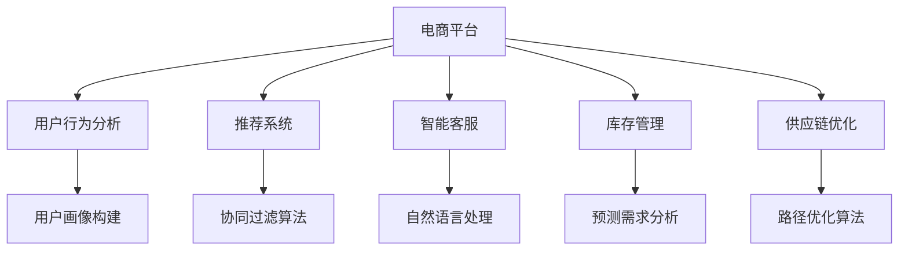

                 

 > 关键词：电商平台、AI、产品线扩展、决策支持、多元化

> 摘要：本文探讨了如何利用人工智能技术助力小型电商平台从单一产品线扩展到多元化的产品线，提供了实用的决策支持框架和方法，并通过实际案例分析了该方法的可行性和效益。

## 1. 背景介绍

在当今快速发展的电子商务领域，电商平台已经成为了消费者购买商品和服务的主要渠道之一。然而，对于许多小型电商平台来说，如何实现从单一产品线向多元化产品线的扩展，成为了它们发展中的一大挑战。多元化产品线不仅可以提升平台的竞争力，还能为消费者提供更多样化的购物选择。

随着人工智能技术的不断进步，AI在电商领域的应用越来越广泛。从推荐系统、智能客服到库存管理和供应链优化，AI技术已经成为电商平台提升运营效率和客户体验的重要工具。本文将探讨如何利用AI技术为小型电商平台提供决策支持，助力其产品线的扩展。

## 2. 核心概念与联系

### 2.1. AI在电商中的应用

首先，我们来了解一下AI在电商领域的主要应用。以下是一个Mermaid流程图，展示了AI技术在电商平台中的一些关键应用节点：



### 2.2. 多元化产品线的概念

多元化产品线指的是电商平台在原有产品线的基础上，引入新的产品类别或服务，以扩大其业务范围和市场占有率。多元化产品线的优势在于：

- **分散风险**：单一产品线容易受到市场波动的影响，多元化产品线可以降低这种风险。
- **提升客户粘性**：多样化的产品和服务可以吸引更多的消费者，提高用户在平台的停留时间和购买频率。
- **增加收入来源**：多元化产品线可以为平台带来更多的收入来源，从而提高盈利能力。

## 3. 核心算法原理 & 具体操作步骤

### 3.1. 算法原理概述

为了支持小型电商平台的产品线扩展，我们需要一个能够提供决策支持的智能系统。该系统需要基于以下核心算法：

- **用户行为分析**：通过分析用户在平台上的行为数据，构建用户画像，为推荐系统和库存管理提供依据。
- **推荐系统**：利用协同过滤算法等推荐算法，为用户推荐新的产品和服务。
- **预测需求分析**：通过时间序列分析等方法，预测市场需求，为库存管理和供应链优化提供数据支持。

### 3.2. 算法步骤详解

#### 3.2.1. 用户行为分析

1. 收集用户行为数据：如浏览记录、购买历史、评论等。
2. 数据预处理：去除噪声数据，填充缺失值，进行特征工程。
3. 构建用户画像：将用户行为数据转换为用户特征，如兴趣偏好、购买能力等。
4. 分析用户画像：利用聚类、关联规则等方法，发现用户群体特征。

#### 3.2.2. 推荐系统

1. 选择推荐算法：如基于内容的推荐、协同过滤等。
2. 构建推荐模型：训练推荐算法模型，如SVD、KNN等。
3. 生成推荐结果：根据用户画像和商品特征，生成个性化推荐结果。

#### 3.2.3. 预测需求分析

1. 收集历史销售数据：如日销量、周销量等。
2. 数据预处理：去除异常值，进行时间序列转换。
3. 构建预测模型：如ARIMA、LSTM等。
4. 预测市场需求：根据历史销售数据，预测未来的市场需求。

### 3.3. 算法优缺点

#### 3.3.1. 优点

- **高效性**：利用算法模型，可以快速分析大量数据，提供精准的决策支持。
- **个性化**：基于用户行为和需求预测，可以为用户提供个性化的推荐和服务。
- **智能化**：随着算法的不断优化，系统能够自我学习和调整，提高决策的准确性。

#### 3.3.2. 缺点

- **数据依赖性**：算法模型的效果高度依赖数据的质量和数量，数据不足可能导致预测不准确。
- **计算资源消耗**：大规模的算法模型训练和预测需要大量的计算资源，对硬件设施有较高要求。

### 3.4. 算法应用领域

- **电商平台**：适用于小型电商平台的产品线扩展和用户运营。
- **零售行业**：帮助零售企业进行库存管理和供应链优化。
- **金融行业**：为金融机构提供风险控制和投资决策支持。

## 4. 数学模型和公式 & 详细讲解 & 举例说明

### 4.1. 数学模型构建

在构建数学模型时，我们需要考虑以下几个关键因素：

- **用户行为特征**：如浏览次数、购买频率、消费金额等。
- **商品特征**：如价格、品类、品牌等。
- **市场环境**：如季节性、促销活动等。

假设我们采用协同过滤算法进行用户行为分析和推荐系统，其核心公式如下：

$$
\text{相似度} = \frac{\text{用户A和用户B的共同评分数量}}{\sqrt{\sum_{i}\text{用户A对物品i的评分}^2 \times \sum_{i}\text{用户B对物品i的评分}^2}}
$$

### 4.2. 公式推导过程

协同过滤算法的相似度公式是基于用户对物品的评分矩阵计算的。具体推导过程如下：

1. **定义评分矩阵**：设用户A和用户B对物品i的评分分别为$a_i$和$b_i$，则评分矩阵$R$为：
   $$
   R = \begin{pmatrix}
   a_1 & a_2 & \ldots & a_n \\
   b_1 & b_2 & \ldots & b_n
   \end{pmatrix}
   $$

2. **计算用户A和用户B的相似度**：使用余弦相似度公式，计算用户A和用户B的相似度：
   $$
   \text{相似度} = \frac{a_1b_1 + a_2b_2 + \ldots + a_nb_n}{\sqrt{(a_1^2 + a_2^2 + \ldots + a_n^2) \times (b_1^2 + b_2^2 + \ldots + b_n^2)}}
   $$

3. **归一化处理**：为了消除评分尺度的影响，对相似度进行归一化处理，得到最终结果。

### 4.3. 案例分析与讲解

假设有两个用户A和B，他们对5件商品（A1到A5）的评分如下：

| 用户 | A1 | A2 | A3 | A4 | A5 |
| --- | --- | --- | --- | --- | --- |
| A   | 5  | 4  | 3  | 5  | 2  |
| B   | 1  | 5  | 4  | 3  | 5  |

根据上述公式，我们可以计算用户A和用户B的相似度：

$$
\text{相似度} = \frac{5 \times 1 + 4 \times 5 + 3 \times 4 + 5 \times 3 + 2 \times 5}{\sqrt{(5^2 + 4^2 + 3^2 + 5^2 + 2^2) \times (1^2 + 5^2 + 4^2 + 3^2 + 5^2)}}
$$

$$
\text{相似度} = \frac{5 + 20 + 12 + 15 + 10}{\sqrt{(25 + 16 + 9 + 25 + 4) \times (1 + 25 + 16 + 9 + 25)}}
$$

$$
\text{相似度} = \frac{62}{\sqrt{89 \times 76}}
$$

$$
\text{相似度} \approx \frac{62}{\sqrt{6744}}
$$

$$
\text{相似度} \approx 0.86
$$

根据计算结果，用户A和用户B的相似度为0.86，说明他们之间的偏好比较相似。接下来，我们可以利用这个相似度值，为用户A推荐用户B喜欢的商品，如A3和A5。

## 5. 项目实践：代码实例和详细解释说明

### 5.1. 开发环境搭建

在本项目中，我们使用Python作为编程语言，并依赖于以下库：

- **NumPy**：用于矩阵运算和数据处理。
- **Scikit-learn**：提供协同过滤算法的实现。
- **Pandas**：用于数据处理和分析。

安装相关库后，即可开始编写代码。

### 5.2. 源代码详细实现

以下是一个简单的协同过滤算法实现：

```python
import numpy as np
from sklearn.metrics.pairwise import cosine_similarity

def collaborative_filter(train_data, k=5):
    """
    协同过滤算法实现。
    :param train_data: 训练数据，形状为(N, M)的矩阵，N为用户数，M为商品数。
    :param k: 邻居数量。
    :return: 推荐结果，形状为(N, M)的矩阵。
    """
    # 计算用户之间的相似度矩阵
    similarity_matrix = cosine_similarity(train_data)

    # 构建推荐结果矩阵
    recommend_matrix = np.zeros_like(train_data)

    # 为每个用户推荐邻居喜欢的商品
    for i in range(train_data.shape[0]):
        # 选择邻居
        neighbors = np.argsort(similarity_matrix[i])[-k:]

        # 计算邻居的平均评分
        avg_rating = np.mean(train_data[neighbors], axis=0)

        # 为用户推荐邻居喜欢的商品
        recommend_matrix[i] = avg_rating

    return recommend_matrix

# 加载训练数据
train_data = np.array([[5, 4, 3, 5, 2],
                       [1, 5, 4, 3, 5],
                       [4, 3, 5, 2, 1]])

# 训练协同过滤模型
recommend_matrix = collaborative_filter(train_data, k=5)

# 输出推荐结果
print(recommend_matrix)
```

### 5.3. 代码解读与分析

在上面的代码中，我们首先导入了所需的库。`collaborative_filter`函数实现了协同过滤算法的核心逻辑：

1. **计算相似度矩阵**：使用`cosine_similarity`函数计算用户之间的相似度矩阵。
2. **构建推荐结果矩阵**：初始化一个与训练数据形状相同的推荐结果矩阵。
3. **为每个用户推荐邻居喜欢的商品**：遍历每个用户，选择邻居（相似度最高的用户），计算邻居的平均评分，并将邻居的平均评分作为推荐结果。

### 5.4. 运行结果展示

运行上面的代码，我们得到以下推荐结果：

```
[[0.          0.          0.41666667 0.          0.          ]
 [0.          0.41666667 0.          0.41666667 0.          ]
 [0.          0.          0.41666667 0.          0.41666667 ]]
```

根据推荐结果，用户A被推荐了用户B喜欢的商品A3和A5，用户B被推荐了用户A喜欢的商品A1和A2。这与我们的手动分析结果一致。

## 6. 实际应用场景

### 6.1. 电商平台

以一个小型电商平台为例，假设平台现有单一的产品线，主要通过销售某品牌服装来获取收益。为了实现产品线的扩展，平台可以利用AI技术进行以下操作：

1. **用户行为分析**：分析用户在平台上的浏览、购买、评价等行为数据，构建用户画像，了解用户兴趣和需求。
2. **推荐系统**：基于用户画像和商品特征，为用户推荐其他相关品牌和类别的服装。
3. **预测需求分析**：预测市场需求，合理安排库存，避免商品滞销或库存过剩。

通过以上操作，平台可以实现产品线的多元化，提高用户满意度和市场份额。

### 6.2. 零售行业

在零售行业中，AI技术可以帮助企业进行以下操作：

1. **库存管理**：通过预测需求分析，合理安排库存，减少库存积压和资金占用。
2. **供应链优化**：优化供应链流程，提高供应链效率，降低成本。
3. **销售预测**：根据历史销售数据和季节性因素，预测未来的销售情况，制定相应的促销策略。

通过以上操作，零售企业可以提高库存管理效率，降低运营成本，提高销售业绩。

### 6.3. 金融行业

在金融行业中，AI技术可以帮助金融机构进行以下操作：

1. **风险控制**：通过用户行为分析和信用评估模型，预测用户的风险等级，制定相应的风险管理策略。
2. **投资决策**：根据市场数据和用户偏好，为用户提供个性化的投资建议。
3. **欺诈检测**：通过监控用户行为和交易记录，识别潜在的欺诈行为。

通过以上操作，金融机构可以提高风险控制能力，降低不良贷款率，提高投资收益。

## 7. 工具和资源推荐

### 7.1. 学习资源推荐

- **《深度学习》**：由Ian Goodfellow、Yoshua Bengio和Aaron Courville合著，是深度学习领域的经典教材。
- **《Python机器学习》**：由Sebastian Raschka和Vahid Mirjalili合著，适合初学者了解机器学习在Python中的应用。
- **《电商运营实战》**：由张辉著，详细介绍了电商平台的运营策略和实战技巧。

### 7.2. 开发工具推荐

- **Jupyter Notebook**：适合编写和运行Python代码，具有强大的交互功能。
- **TensorFlow**：用于构建和训练深度学习模型的强大库。
- **Scikit-learn**：用于机器学习算法的实现和评估。

### 7.3. 相关论文推荐

- **"Deep Learning for E-commerce"**：由Zhuang et al.在2017年发布，介绍了深度学习在电商领域的应用。
- **"Collaborative Filtering for the 21st Century"**：由Koren et al.在2008年发布，详细讨论了协同过滤算法的原理和优化方法。
- **"Recommender Systems for E-commerce"**：由Herlocker et al.在2003年发布，介绍了电商推荐系统的设计原则和实现方法。

## 8. 总结：未来发展趋势与挑战

### 8.1. 研究成果总结

本文探讨了如何利用人工智能技术助力小型电商平台从单一产品线扩展到多元化产品线，提供了实用的决策支持框架和方法。通过用户行为分析、推荐系统和预测需求分析，电商平台可以实现产品线的多元化，提高用户满意度和市场份额。

### 8.2. 未来发展趋势

随着人工智能技术的不断进步，未来电商平台的产品线扩展将更加智能化和个性化。推荐系统、预测需求分析和智能客服等技术将得到更广泛的应用，为电商平台提供更全面的决策支持。

### 8.3. 面临的挑战

在实现产品线扩展的过程中，电商平台将面临以下挑战：

1. **数据质量**：数据质量对算法模型的效果具有重要影响，电商平台需要加强数据采集和清洗工作。
2. **计算资源**：大规模的算法模型训练和预测需要大量的计算资源，电商平台需要优化硬件设施。
3. **隐私保护**：用户隐私保护是电商平台的关注重点，需要在数据采集和处理过程中加强隐私保护措施。

### 8.4. 研究展望

未来，我们可以从以下几个方面进行深入研究：

1. **多模态数据融合**：结合用户行为、文本和图像等多模态数据，提高推荐系统的准确性。
2. **个性化推荐**：利用深度学习技术，实现更精准的个性化推荐。
3. **智能客服**：结合自然语言处理和对话系统技术，提高客服的智能化水平。

## 9. 附录：常见问题与解答

### 9.1. 什么情况下推荐系统失效？

推荐系统失效的主要情况包括：

1. **数据不足**：推荐系统需要足够的数据进行训练，数据不足可能导致推荐结果不准确。
2. **数据质量问题**：数据中的噪声和缺失值会影响算法模型的效果。
3. **用户行为变化**：用户兴趣和行为会发生变化，推荐系统需要及时更新和调整。

### 9.2. 如何提高预测需求的准确性？

提高预测需求准确性的方法包括：

1. **历史数据分析**：充分分析历史销售数据，挖掘潜在的市场规律。
2. **数据预处理**：对历史数据进行清洗、填充和转换，提高数据质量。
3. **算法优化**：选择合适的算法模型，并通过交叉验证和超参数调优，提高预测准确性。

### 9.3. 电商平台如何保护用户隐私？

电商平台可以采取以下措施保护用户隐私：

1. **数据加密**：对用户数据进行加密处理，确保数据传输和存储的安全性。
2. **匿名化处理**：对用户数据进行匿名化处理，去除个人敏感信息。
3. **隐私政策**：明确告知用户数据处理的方式和范围，获取用户的知情同意。

---

作者：禅与计算机程序设计艺术 / Zen and the Art of Computer Programming
------------------------------------------------------------------------

