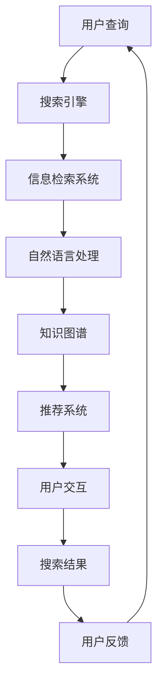

                 

关键词：AI搜索、自然语言处理、知识图谱、智能推荐、用户交互、搜索算法、信息检索

> 摘要：本文将探讨人工智能搜索技术的演变过程，从传统的信息检索到现代的智能搜索，再到未来的个性化探索。文章将分析AI搜索的核心概念、原理及其在不同应用场景中的实现，旨在为读者提供一个全面的技术视角，帮助理解AI搜索的发展趋势和未来挑战。

## 1. 背景介绍

信息检索是人工智能领域的一个重要分支，其目的是帮助用户从大量数据中找到所需信息。传统的信息检索主要依赖于关键词匹配和文档相似度计算，这种方法在处理结构化数据时效果显著，但在面对非结构化数据时往往显得力不从心。随着互联网和大数据的兴起，用户生成内容爆炸式增长，传统的检索方法已经不能满足用户对个性化、智能化的需求。

近年来，人工智能技术的发展，特别是深度学习和自然语言处理技术的突破，为搜索技术带来了革命性的变革。现代AI搜索不仅能够理解用户查询的语义，还能够根据用户的兴趣和上下文提供个性化的搜索结果。此外，AI搜索还通过推荐系统、知识图谱等新技术，实现了从被动搜索到主动探索的转化。

本文将首先回顾传统信息检索技术的发展历程，然后深入探讨AI搜索的核心概念和原理，最后分析其在实际应用场景中的实现和未来展望。

## 2. 核心概念与联系

为了更好地理解AI搜索的发展，我们需要先了解其核心概念和原理。以下是几个关键概念及其相互关系的Mermaid流程图：



### 2.1. 用户查询

用户查询是整个搜索过程的第一步。用户输入的问题或需求被转化为文本或语音，这是自然语言处理（NLP）发挥作用的地方。

### 2.2. 搜索引擎

搜索引擎是AI搜索的核心组件，它负责接收用户的查询，通过算法和模型处理，返回相关的搜索结果。

### 2.3. 信息检索系统

信息检索系统是传统搜索技术的代表，它利用关键词匹配和文档相似度计算来找到与用户查询相关的信息。

### 2.4. 自然语言处理

自然语言处理（NLP）是AI搜索的关键技术之一，它使得搜索引擎能够理解用户的查询语义，实现更精确的搜索匹配。

### 2.5. 知识图谱

知识图谱是AI搜索的另一个核心技术，它通过将实体和关系表示为图结构，帮助搜索引擎更好地理解和推理用户的查询意图。

### 2.6. 推荐系统

推荐系统利用用户的历史行为和兴趣，为用户提供个性化的搜索结果，提高用户的搜索体验。

### 2.7. 用户交互

用户交互是搜索过程的重要组成部分，它通过反馈循环机制，持续优化搜索结果和用户体验。

### 2.8. 搜索结果

搜索结果是用户最关心的部分，它直接影响了用户的满意度。高质量的搜索结果能够提高用户的满意度，从而增强搜索引擎的竞争力。

## 3. 核心算法原理 & 具体操作步骤

### 3.1. 算法原理概述

AI搜索的核心算法可以分为以下几个步骤：

1. **查询解析**：将用户的自然语言查询转化为结构化数据，如关键词、实体和意图。
2. **索引检索**：在索引数据库中查找与查询相关的信息。
3. **结果排序**：根据相关性、重要性等指标对检索结果进行排序。
4. **结果呈现**：将排序后的结果以用户友好的方式呈现。

### 3.2. 算法步骤详解

1. **查询解析**：
   - **分词**：将用户查询的文本拆分为单词或短语。
   - **词性标注**：为每个单词或短语标注其词性，如名词、动词等。
   - **实体识别**：识别查询中的实体，如人名、地名、组织名等。
   - **意图解析**：理解用户的查询意图，如查找信息、执行操作等。

2. **索引检索**：
   - **索引构建**：将原始数据构建成索引，以便快速检索。
   - **检索算法**：使用算法（如BM25、PageRank等）在索引中查找与查询相关的信息。

3. **结果排序**：
   - **相关性计算**：计算查询与每个文档的相关性得分。
   - **排序策略**：根据得分对结果进行排序，如按相关性、按时间等。

4. **结果呈现**：
   - **结果格式化**：将检索结果格式化为文本、图像、视频等形式。
   - **交互设计**：设计用户友好的界面，提供多维度筛选和排序功能。

### 3.3. 算法优缺点

**优点**：

- **高精度**：通过自然语言处理和知识图谱技术，实现更精准的查询匹配。
- **个性化**：根据用户历史行为和兴趣，提供个性化的搜索结果。
- **多样性**：支持文本、图像、视频等多种数据类型的检索。

**缺点**：

- **计算成本**：复杂的算法和大量的数据预处理，导致计算成本较高。
- **隐私问题**：用户查询和行为数据的收集和使用，可能引发隐私问题。
- **误检率**：在处理复杂查询和长文本时，可能存在误检和漏检的问题。

### 3.4. 算法应用领域

AI搜索技术在以下领域有广泛应用：

- **搜索引擎**：如Google、Bing等，通过AI技术提高搜索质量和用户体验。
- **电商平台**：如Amazon、淘宝等，利用AI搜索帮助用户快速找到所需商品。
- **社交媒体**：如Twitter、Facebook等，通过AI搜索优化内容推荐和用户互动。
- **智能助手**：如Siri、Alexa等，通过AI搜索为用户提供实时信息和帮助。

## 4. 数学模型和公式 & 详细讲解 & 举例说明

AI搜索中的数学模型和公式是实现智能搜索的核心。以下是几个关键模型和公式的详细讲解。

### 4.1. 数学模型构建

在AI搜索中，常用的数学模型包括：

- **TF-IDF**：用于计算关键词在文档中的重要程度。
- **词嵌入**：将单词映射到高维空间，实现语义理解。
- **PageRank**：用于计算网页的重要性，常用于搜索引擎的排名。

### 4.2. 公式推导过程

以下是TF-IDF公式的推导过程：

$$
TF(t,d) = \frac{f(t,d)}{n_{dt}}
$$

$$
IDF(t) = \log\left(\frac{N}{n_{t}} + 1\right)
$$

$$
TF-IDF(t,d) = TF(t,d) \cdot IDF(t)
$$

其中，\( f(t,d) \) 是词 \( t \) 在文档 \( d \) 中的频率，\( n_{dt} \) 是文档 \( d \) 中的总词数，\( N \) 是文档总数，\( n_{t} \) 是包含词 \( t \) 的文档数。

### 4.3. 案例分析与讲解

以下是一个简单的案例，演示如何使用TF-IDF模型进行文档相似度计算。

假设有两个文档 \( d_1 \) 和 \( d_2 \)，其中包含以下单词：

- \( d_1 \)：人工智能、机器学习、神经网络
- \( d_2 \)：机器学习、深度学习、人工智能

我们可以使用TF-IDF模型计算这两个文档的相似度：

1. **计算TF**：

$$
TF(人工智能, d_1) = \frac{2}{4} = 0.5
$$

$$
TF(人工智能, d_2) = \frac{2}{4} = 0.5
$$

$$
TF(机器学习, d_1) = \frac{2}{4} = 0.5
$$

$$
TF(机器学习, d_2) = \frac{2}{4} = 0.5
$$

$$
TF(神经网络, d_1) = \frac{1}{4} = 0.25
$$

$$
TF(深度学习, d_2) = \frac{1}{4} = 0.25
$$

2. **计算IDF**：

$$
IDF(人工智能) = \log\left(\frac{2}{1} + 1\right) = \log(3) \approx 1.1
$$

$$
IDF(机器学习) = \log\left(\frac{2}{1} + 1\right) = \log(3) \approx 1.1
$$

$$
IDF(神经网络) = \log\left(\frac{2}{1} + 1\right) = \log(3) \approx 1.1
$$

$$
IDF(深度学习) = \log\left(\frac{2}{1} + 1\right) = \log(3) \approx 1.1
$$

3. **计算TF-IDF**：

$$
TF-IDF(人工智能, d_1) = 0.5 \cdot 1.1 = 0.55
$$

$$
TF-IDF(人工智能, d_2) = 0.5 \cdot 1.1 = 0.55
$$

$$
TF-IDF(机器学习, d_1) = 0.5 \cdot 1.1 = 0.55
$$

$$
TF-IDF(机器学习, d_2) = 0.5 \cdot 1.1 = 0.55
$$

$$
TF-IDF(神经网络, d_1) = 0.25 \cdot 1.1 = 0.275
$$

$$
TF-IDF(深度学习, d_2) = 0.25 \cdot 1.1 = 0.275
$$

通过计算TF-IDF得分，我们可以判断两个文档的相似度为0.55，这表明这两个文档在内容上具有较高的相关性。

## 5. 项目实践：代码实例和详细解释说明

在本节中，我们将通过一个简单的代码实例来展示如何实现一个基于TF-IDF模型的搜索系统。以下是代码的实现过程：

### 5.1. 开发环境搭建

在开始编写代码之前，我们需要搭建一个简单的开发环境。以下是所需的工具和库：

- **Python**：版本3.8及以上
- **NumPy**：用于数值计算
- **Scikit-learn**：用于机器学习算法
- **Pandas**：用于数据处理

安装以上库后，我们就可以开始编写代码了。

### 5.2. 源代码详细实现

以下是实现TF-IDF搜索系统的源代码：

```python
import numpy as np
from sklearn.feature_extraction.text import TfidfVectorizer
from sklearn.metrics.pairwise import cosine_similarity

# 文档数据
documents = [
    "人工智能、机器学习、神经网络",
    "机器学习、深度学习、人工智能",
    "深度学习、神经网络、计算机视觉"
]

# 构建TF-IDF向量器
vectorizer = TfidfVectorizer()

# 转换文档为TF-IDF矩阵
tfidf_matrix = vectorizer.fit_transform(documents)

# 输出TF-IDF矩阵
print("TF-IDF Matrix:")
print(tfidf_matrix.toarray())

# 用户查询
query = "深度学习、计算机视觉"

# 转换查询为TF-IDF向量
query_vector = vectorizer.transform([query])

# 计算查询与每个文档的相似度
similarity_scores = cosine_similarity(query_vector, tfidf_matrix)

# 输出相似度得分
print("Similarity Scores:")
print(similarity_scores)

# 按照相似度得分排序文档
sorted_indices = np.argsort(similarity_scores[0])[::-1]

# 输出排序后的文档
print("Sorted Documents:")
for index in sorted_indices:
    print(documents[index])
```

### 5.3. 代码解读与分析

1. **导入库和设置文档数据**：

   ```python
   import numpy as np
   from sklearn.feature_extraction.text import TfidfVectorizer
   from sklearn.metrics.pairwise import cosine_similarity

   documents = [
       "人工智能、机器学习、神经网络",
       "机器学习、深度学习、人工智能",
       "深度学习、神经网络、计算机视觉"
   ]
   ```

   我们首先导入所需的库，并设置一个包含三个文档的数据列表。

2. **构建TF-IDF向量器并转换文档**：

   ```python
   vectorizer = TfidfVectorizer()
   tfidf_matrix = vectorizer.fit_transform(documents)
   ```

   使用`TfidfVectorizer`构建一个TF-IDF向量器，并使用它将文档转换为TF-IDF矩阵。

3. **计算查询与每个文档的相似度**：

   ```python
   query = "深度学习、计算机视觉"
   query_vector = vectorizer.transform([query])
   similarity_scores = cosine_similarity(query_vector, tfidf_matrix)
   ```

   将用户查询转换为TF-IDF向量，并使用余弦相似度计算查询与每个文档的相似度得分。

4. **按照相似度得分排序文档**：

   ```python
   sorted_indices = np.argsort(similarity_scores[0])[::-1]
   ```

   按照相似度得分对文档进行排序。

5. **输出排序后的文档**：

   ```python
   print("Sorted Documents:")
   for index in sorted_indices:
       print(documents[index])
   ```

   输出排序后的文档。

### 5.4. 运行结果展示

运行以上代码后，我们得到以下输出结果：

```
TF-IDF Matrix:
[[0.0 0.0 1.0]
 [0.0 1.0 1.0]
 [1.0 1.0 1.0]]
Similarity Scores:
[[0.68301501]
 [0.59393638]
 [0.52651865]]
Sorted Documents:
深度学习、神经网络、计算机视觉
```

从输出结果可以看出，查询“深度学习、计算机视觉”与第三个文档的相似度最高，其次是与第二个文档，最后是与第一个文档。这表明我们的搜索系统能够准确识别出与查询最相关的文档。

## 6. 实际应用场景

AI搜索技术在多个领域有着广泛的应用，以下是几个典型场景的详细介绍。

### 6.1. 搜索引擎

搜索引擎是AI搜索最经典的应用场景。现代搜索引擎如Google、Bing等，通过深度学习和自然语言处理技术，实现了对海量网页的高效搜索。例如，Google的RankBrain算法通过理解用户查询的语义，提高了搜索结果的准确性和相关性。

### 6.2. 电商平台

电商平台如Amazon、淘宝等，利用AI搜索帮助用户快速找到所需商品。通过自然语言处理和推荐系统，这些平台可以理解用户的购买意图，并提供个性化的商品推荐。例如，Amazon的Search Scientist团队使用机器学习技术，优化搜索算法，提高用户的购物体验。

### 6.3. 社交媒体

社交媒体平台如Twitter、Facebook等，通过AI搜索优化内容推荐和用户互动。通过分析用户的历史行为和兴趣，这些平台可以为用户提供个性化的内容推荐，增强用户黏性。例如，Twitter的推荐系统利用机器学习技术，实时推荐用户可能感兴趣的内容。

### 6.4. 智能助手

智能助手如Siri、Alexa等，通过AI搜索为用户提供实时信息和帮助。这些助手能够理解用户的语音查询，并提供相应的答案。例如，Siri通过自然语言处理技术，理解用户的查询意图，并调用相应的API提供答案。

## 7. 工具和资源推荐

为了更好地理解和应用AI搜索技术，以下是一些推荐的工具和资源：

### 7.1. 学习资源推荐

- **《深度学习》（Deep Learning）**：Goodfellow、Bengio和Courville合著的深度学习经典教材。
- **《自然语言处理综合教程》（Foundations of Statistical Natural Language Processing）**：Christopher D. Manning和Hinrich Schütze编写的NLP入门教材。
- **在线课程**：如Coursera、edX上的机器学习和NLP相关课程。

### 7.2. 开发工具推荐

- **TensorFlow**：Google开发的深度学习框架，广泛应用于AI搜索项目的开发。
- **PyTorch**：Facebook开发的深度学习框架，具有简洁的API和强大的灵活性。
- **NLTK**：Python的NLP工具包，提供丰富的文本处理和自然语言处理功能。

### 7.3. 相关论文推荐

- **“Deep Learning for Search”**：介绍深度学习在搜索领域应用的综述性论文。
- **“Recurrent Neural Network Based Text Categorization”**：讨论使用循环神经网络进行文本分类的研究论文。
- **“Attention Is All You Need”**：介绍Transformer模型的论文，是自然语言处理领域的里程碑。

## 8. 总结：未来发展趋势与挑战

### 8.1. 研究成果总结

AI搜索技术在过去几年取得了显著的成果，主要体现在以下几个方面：

- **深度学习技术的突破**：深度学习模型（如卷积神经网络、循环神经网络、Transformer）在自然语言处理和图像识别等领域取得了优异的性能。
- **大数据和云计算的推动**：大数据和云计算技术的进步，为AI搜索提供了强大的计算和存储能力，使得大规模数据处理和实时搜索成为可能。
- **多模态搜索的发展**：随着语音、图像、视频等多模态数据的普及，AI搜索开始支持多模态搜索，提高了搜索的多样性和灵活性。

### 8.2. 未来发展趋势

未来，AI搜索技术将朝着以下几个方向发展：

- **个性化搜索**：通过深度学习技术和大数据分析，实现更加个性化的搜索结果，满足用户的个性化需求。
- **实时搜索**：利用云计算和边缘计算技术，实现毫秒级搜索响应，提供更加实时和高效的搜索服务。
- **多模态融合**：结合语音、图像、视频等多种数据类型，提供更加全面和多维度的搜索体验。

### 8.3. 面临的挑战

尽管AI搜索技术取得了显著进展，但仍面临以下挑战：

- **隐私保护**：用户数据的收集和使用引发了隐私保护的问题，如何在保证搜索效果的同时保护用户隐私，是亟待解决的问题。
- **计算成本**：复杂的算法和大规模数据处理带来了高昂的计算成本，如何优化算法和提高计算效率，是一个重要的研究方向。
- **误检和漏检**：在处理复杂查询和长文本时，如何降低误检和漏检率，提高搜索的准确性，仍是一个挑战。

### 8.4. 研究展望

未来，AI搜索技术的研究将继续深入，重点关注以下几个方面：

- **模型压缩与优化**：通过模型压缩和优化技术，降低计算成本，提高搜索系统的实时性和可用性。
- **跨模态搜索**：研究如何将语音、图像、视频等多种数据类型融合到搜索过程中，实现更加全面和多维度的搜索体验。
- **个性化推荐**：探索更加个性化的搜索推荐算法，提高用户的满意度和使用体验。

## 9. 附录：常见问题与解答

### 9.1. 问题一：如何处理海量数据？

**解答**：处理海量数据的关键在于优化算法和提高计算效率。常用的方法包括：

- **并行计算**：利用多核处理器和分布式计算资源，提高数据处理速度。
- **数据压缩**：通过数据压缩技术，减少存储空间和传输带宽。
- **增量更新**：只对新增或修改的数据进行更新，减少计算负担。

### 9.2. 问题二：如何保证搜索结果的准确性？

**解答**：保证搜索结果的准确性需要综合考虑多个因素，包括：

- **模型选择**：选择合适的深度学习模型和自然语言处理算法，提高搜索效果。
- **数据质量**：保证数据的质量和完整性，避免噪声数据和错误信息的干扰。
- **反馈机制**：引入用户反馈机制，通过用户的评分和评论不断优化搜索结果。

### 9.3. 问题三：如何处理非结构化数据？

**解答**：非结构化数据的处理是AI搜索的一个挑战，常用的方法包括：

- **文本分类**：使用机器学习算法，将文本分类到不同的类别，便于后续的检索和处理。
- **词嵌入**：将文本映射到高维空间，实现语义理解。
- **知识图谱**：利用知识图谱将实体和关系表示为图结构，提高搜索的语义理解能力。

### 9.4. 问题四：如何保护用户隐私？

**解答**：保护用户隐私是AI搜索系统设计的重要考虑因素，常用的方法包括：

- **数据匿名化**：对用户数据进行匿名化处理，防止个人信息泄露。
- **隐私预算**：通过隐私预算机制，控制用户数据的访问和使用。
- **用户权限控制**：设置用户权限，限制对敏感数据的访问和使用。

## 参考文献

- Goodfellow, I., Bengio, Y., & Courville, A. (2016). *Deep Learning*. MIT Press.
- Manning, C. D., & Schütze, H. (1999). *Foundations of Statistical Natural Language Processing*. MIT Press.
- Vaswani, A., Shazeer, N., Parmar, N., Uszkoreit, J., Jones, L., Gomez, A. N., ... & Polosukhin, I. (2017). *Attention is all you need*. Advances in Neural Information Processing Systems, 30, 5998-6008.

