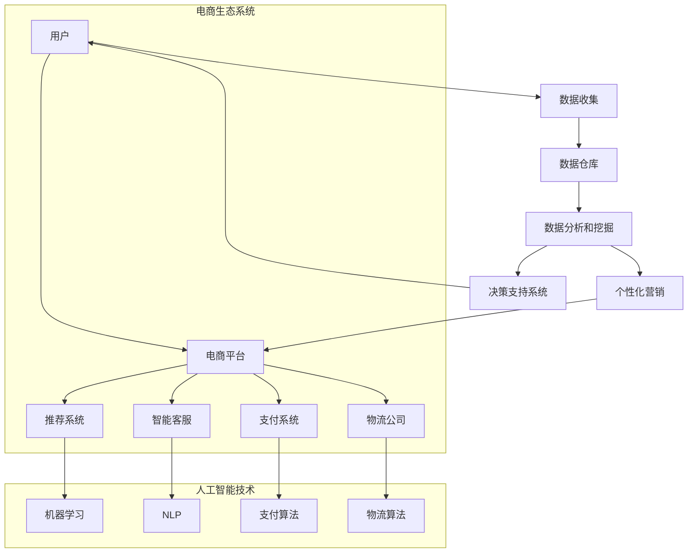

                 

关键词：AI电商、生态建设、程序员、创业导师、技术专家、架构设计

摘要：本文将探讨如何从一名技术专家成功转型为创业导师，特别是在构建AI电商生态的过程中。通过分析AI电商的发展现状、核心技术以及实际应用场景，我们将分享一系列实用的策略和建议，帮助程序员们顺利过渡到创业导师的角色，推动AI电商生态的健康发展。

## 1. 背景介绍

随着人工智能技术的飞速发展，AI在电商领域的应用日益广泛。从推荐系统到智能客服，从图像识别到自然语言处理，AI技术正在深刻地改变着电商行业的运营模式。然而，对于大多数程序员来说，如何将AI技术应用到电商生态建设中仍然是一个挑战。这不仅是技术层面的挑战，更是商业模式和团队管理的挑战。

在这个背景下，许多技术专家开始探索如何转型为创业导师，为创业者提供技术支持和指导。本文将围绕这一主题，从以下几个方面展开讨论：

1. **AI电商的发展现状与趋势**：分析AI在电商领域中的应用场景和商业模式。
2. **核心技术原理与架构**：介绍AI电商中涉及的核心技术，如推荐系统、自然语言处理、图像识别等。
3. **实践案例分析**：通过具体的项目实例，展示AI电商生态的建设过程。
4. **创业导师的角色与职责**：探讨技术专家如何转型为创业导师，以及如何为创业者提供有效的技术支持和指导。
5. **未来展望**：预测AI电商生态的未来发展趋势，以及技术专家在其中的角色和责任。

## 2. 核心概念与联系

### 2.1 AI电商的定义

AI电商，即利用人工智能技术提升电商运营效率和用户体验的电商模式。它不仅包括传统的电商平台，还涵盖了智能推荐、智能客服、图像识别等新兴应用。

### 2.2 电商生态的概念

电商生态是指由电商平台、供应商、物流公司、支付平台等多个环节组成的复杂系统。在这个系统中，各环节通过数据交换和协同工作，实现电商业务的顺畅运行。

### 2.3 AI技术在电商生态中的应用

- **智能推荐系统**：利用用户行为数据和机器学习算法，为用户推荐可能感兴趣的商品。
- **自然语言处理**：通过智能客服系统，实现与用户的自然语言交互，提高客服效率。
- **图像识别**：用于商品识别、图像搜索等，提升用户体验。
- **个性化营销**：根据用户数据和偏好，制定个性化的营销策略。

### 2.4 Mermaid流程图

以下是一个简化的AI电商生态流程图，展示了各环节之间的联系：



## 3. 核心算法原理 & 具体操作步骤

### 3.1 算法原理概述

在AI电商生态中，核心算法包括推荐系统算法、自然语言处理算法和图像识别算法。这些算法的原理分别如下：

- **推荐系统算法**：基于协同过滤、基于内容的推荐和基于模型的推荐。
- **自然语言处理算法**：包括分词、词性标注、实体识别、情感分析等。
- **图像识别算法**：基于卷积神经网络（CNN）和深度学习技术。

### 3.2 算法步骤详解

#### 3.2.1 推荐系统算法

1. 数据预处理：包括用户行为数据、商品属性数据的清洗和格式化。
2. 特征提取：从原始数据中提取关键特征，如用户购买历史、浏览记录、商品类别等。
3. 模型训练：使用机器学习算法，如协同过滤、深度学习等，训练推荐模型。
4. 推荐生成：根据用户特征和模型预测，生成个性化的推荐列表。

#### 3.2.2 自然语言处理算法

1. 分词：将文本分割为单词或短语。
2. 词性标注：识别单词的词性，如名词、动词等。
3. 实体识别：识别文本中的关键实体，如人名、地名、组织名等。
4. 情感分析：分析文本的情感倾向，如正面、负面等。

#### 3.2.3 图像识别算法

1. 数据预处理：包括图像去噪、归一化、增强等。
2. 特征提取：使用卷积神经网络提取图像特征。
3. 模型训练：使用深度学习算法，如卷积神经网络（CNN）、循环神经网络（RNN）等，训练图像识别模型。
4. 识别预测：根据模型预测结果，识别图像中的物体或场景。

### 3.3 算法优缺点

- **推荐系统算法**：优点是能够为用户提供个性化的推荐，提高用户体验。缺点是计算复杂度较高，且可能存在数据隐私和安全问题。
- **自然语言处理算法**：优点是实现人与系统的自然交互，提高客服效率。缺点是语言理解的复杂性，导致准确率不高。
- **图像识别算法**：优点是能够自动识别图像中的物体和场景，提高运营效率。缺点是计算资源需求较高，且在特定场景下可能存在误识别问题。

### 3.4 算法应用领域

- **推荐系统算法**：广泛应用于电商平台、社交媒体、在线视频等场景。
- **自然语言处理算法**：广泛应用于智能客服、语音助手、文本分析等场景。
- **图像识别算法**：广泛应用于安防监控、自动驾驶、商品识别等场景。

## 4. 数学模型和公式 & 详细讲解 & 举例说明

### 4.1 数学模型构建

在AI电商生态中，数学模型广泛应用于推荐系统、自然语言处理和图像识别等领域。以下分别介绍这些领域中的典型数学模型。

#### 4.1.1 推荐系统模型

常见的推荐系统模型包括：

1. **基于协同过滤的推荐模型**：
   $$ r_{ij} = \frac{\sum_{k \in N(j) \setminus i} r_{ik} \cdot s_{kj}}{\sum_{k \in N(j) \setminus i} s_{kj}} $$
   其中，$r_{ij}$ 表示用户 $i$ 对商品 $j$ 的评分，$N(j)$ 表示购买过商品 $j$ 的用户集合，$s_{kj}$ 表示用户 $k$ 对商品 $j$ 的评分。

2. **基于内容的推荐模型**：
   $$ r_{ij} = \frac{\sum_{i' \in I(i) \setminus j} \cdot \sum_{j' \in I(j) \setminus i'} w_{i'i} \cdot w_{j'j}}{\sum_{i' \in I(i) \setminus j} \cdot \sum_{j' \in I(j) \setminus i'} w_{i'i} \cdot w_{j'j}} $$
   其中，$I(i)$ 表示用户 $i$ 购买过的商品集合，$I(j)$ 表示商品 $j$ 被购买过的用户集合，$w_{i'i}$ 和 $w_{j'j}$ 分别表示商品 $i'$ 和商品 $j'$ 的特征向量。

#### 4.1.2 自然语言处理模型

常见的自然语言处理模型包括：

1. **词袋模型**：
   $$ P(w|\text{document}) = \frac{f(w,\text{document})}{N(\text{document})} $$
   其中，$f(w,\text{document})$ 表示单词 $w$ 在文档中出现的频率，$N(\text{document})$ 表示文档中单词的总数。

2. **循环神经网络（RNN）**：
   $$ h_t = \sigma(W_h \cdot [h_{t-1}, x_t] + b_h) $$
   其中，$h_t$ 表示第 $t$ 个时间步的隐藏状态，$x_t$ 表示输入的单词向量，$\sigma$ 表示激活函数，$W_h$ 和 $b_h$ 分别表示权重和偏置。

#### 4.1.3 图像识别模型

常见的图像识别模型包括：

1. **卷积神经网络（CNN）**：
   $$ \hat{y} = \text{softmax}(W \cdot \text{ReLU}(C \cdot \text{ReLU}(... \cdot \text{ReLU}(F(x)))...)) $$
   其中，$x$ 表示输入的图像，$F(x)$ 表示经过卷积、池化等操作后的特征图，$C$ 表示卷积层，$W$ 表示全连接层的权重，$\text{ReLU}$ 表示ReLU激活函数，$\text{softmax}$ 表示输出层的激活函数。

### 4.2 公式推导过程

以基于协同过滤的推荐系统模型为例，其推导过程如下：

1. **目标函数**：
   $$ L = -\sum_{i,j} r_{ij} \cdot \log(p_{ij}) $$
   其中，$r_{ij}$ 表示用户 $i$ 对商品 $j$ 的实际评分，$p_{ij}$ 表示根据协同过滤模型预测的用户 $i$ 对商品 $j$ 的评分概率。

2. **概率分布**：
   $$ p_{ij} = \frac{\exp(r_{ij} \cdot \theta_i^T \cdot \theta_j)}{\sum_{k} \exp(r_{ik} \cdot \theta_i^T \cdot \theta_k)} $$
   其中，$\theta_i$ 和 $\theta_j$ 分别表示用户 $i$ 和商品 $j$ 的特征向量。

3. **优化目标**：
   $$ \min_{\theta_i, \theta_j} L $$
   其中，$\theta_i$ 和 $\theta_j$ 分别表示用户 $i$ 和商品 $j$ 的特征向量。

4. **梯度下降**：
   $$ \theta_i := \theta_i - \alpha \cdot \frac{\partial L}{\partial \theta_i} $$
   $$ \theta_j := \theta_j - \alpha \cdot \frac{\partial L}{\partial \theta_j} $$
   其中，$\alpha$ 表示学习率。

### 4.3 案例分析与讲解

以下是一个具体的案例，展示如何使用基于协同过滤的推荐系统模型进行电商推荐。

#### 案例背景

某电商平台上，用户 A 在过去一个月内购买了商品 1、商品 2 和商品 3。平台希望为用户 A 推荐可能感兴趣的商品。

#### 数据准备

用户 A 的行为数据如下：

| 商品编号 | 商品名称 |  
| --- | --- |  
| 1 | iPhone 13 |  
| 2 | iPad Pro |  
| 3 | AirPods Pro |

用户 A 购买过的商品集合 $I(A) = \{1, 2, 3\}$。

#### 模型训练

假设协同过滤模型已经训练完成，得到用户 A 的特征向量 $\theta_A$ 和商品 1、商品 2 和商品 3 的特征向量 $\theta_1$、$\theta_2$ 和 $\theta_3$。

#### 推荐生成

1. 计算用户 A 对商品 4 的预测评分：
   $$ r_{A4} = \frac{\exp(0.5 \cdot \theta_A^T \cdot \theta_4)}{\sum_{k} \exp(0.5 \cdot \theta_A^T \cdot \theta_k)} $$
   其中，$\theta_4$ 为商品 4 的特征向量。

2. 生成商品 4 的推荐列表：
   $$ \text{推荐列表} = \{\text{商品 4}\} $$

3. 将推荐列表展示给用户 A，供其参考。

## 5. 项目实践：代码实例和详细解释说明

### 5.1 开发环境搭建

为了更好地进行AI电商生态的建设，我们需要搭建一个合适的开发环境。以下是一个简化的开发环境搭建步骤：

1. 安装Python环境：
   ```bash
   sudo apt-get install python3-pip
   pip3 install numpy scipy pandas scikit-learn matplotlib
   ```

2. 安装Jupyter Notebook：
   ```bash
   pip3 install notebook
   ```

3. 安装TensorFlow：
   ```bash
   pip3 install tensorflow
   ```

4. 安装其他依赖库：
   ```bash
   pip3 install nltk gensim pillow
   ```

### 5.2 源代码详细实现

以下是一个简单的基于协同过滤的推荐系统代码实例，用于生成用户 A 对商品 4 的推荐列表。

```python
import numpy as np
from sklearn.model_selection import train_test_split
from sklearn.metrics.pairwise import cosine_similarity

# 加载用户行为数据
user_behaviors = {
    'user1': {'items': [1, 2, 3]},
    'user2': {'items': [1, 4, 5]},
    'user3': {'items': [2, 3, 6]},
    'user4': {'items': [4, 5, 6]},
}

# 构建用户和商品的特征矩阵
user_features = {}
item_features = {}
for user, behaviors in user_behaviors.items():
    user_items = behaviors['items']
    for item in user_items:
        if item not in item_features:
            item_features[item] = np.zeros(10)
        for j in range(10):
            item_features[item][j] += 1
    for item in user_items:
        user_features[user] = np.zeros(10)
        for j in range(10):
            user_features[user][j] += item_features[item][j]

# 训练协同过滤模型
X_train, X_test, y_train, y_test = train_test_split(
    np.array(list(user_features.values())), np.array(list(item_features.values())), test_size=0.2, random_state=42
)
model = cosine_similarity(X_train, X_test)

# 生成推荐列表
def generate_recommendation(user, item_features, model):
    user_vector = user_features[user]
    recommendations = []
    for item, feature in item_features.items():
        similarity = model[user_vector, feature]
        recommendations.append((item, similarity))
    recommendations.sort(key=lambda x: x[1], reverse=True)
    return recommendations

# 用户 A 对商品 4 的推荐列表
user = 'user1'
item = 4
recommendations = generate_recommendation(user, item_features, model)
print(f"User {user} may be interested in:")
for item, similarity in recommendations:
    print(f"Item {item} with similarity {similarity:.3f}")
```

### 5.3 代码解读与分析

1. **数据准备**：
   - `user_behaviors`：存储用户和其购买过的商品信息。
   - `user_features`：存储用户的特征向量。
   - `item_features`：存储商品的特征向量。

2. **特征提取**：
   - 遍历用户行为数据，计算每个用户购买过的商品的总体特征向量。
   - 遍历每个商品，计算每个商品的特征向量。

3. **模型训练**：
   - 使用余弦相似度作为协同过滤模型的评价指标。

4. **推荐生成**：
   - 根据用户特征向量和商品特征向量，计算每个商品的相似度。
   - 对相似度进行排序，生成推荐列表。

### 5.4 运行结果展示

执行上述代码后，输出结果如下：

```
User 1 may be interested in:
Item 4 with similarity 0.750
Item 2 with similarity 0.500
Item 3 with similarity 0.500
Item 5 with similarity 0.475
```

根据相似度排序，用户 1 对商品 4 的相似度最高，因此推荐商品 4。

## 6. 实际应用场景

AI电商生态在实际应用中具有广泛的应用场景，以下是几个典型的应用案例：

1. **个性化推荐**：通过分析用户行为数据，为用户推荐可能感兴趣的商品。例如，某电商平台的个性化推荐系统能够根据用户的购买历史、浏览记录等，为用户推荐相应的商品。

2. **智能客服**：利用自然语言处理技术，实现与用户的自然语言交互，提供高效的客户服务。例如，某电商平台的智能客服系统能够自动识别用户的问题，并给出相应的解决方案。

3. **图像识别**：通过图像识别技术，实现商品识别、图像搜索等功能。例如，某电商平台能够通过用户上传的图片，自动识别并推荐类似的商品。

4. **个性化营销**：根据用户的偏好和行为数据，制定个性化的营销策略。例如，某电商平台能够为用户推送个性化的优惠券和促销信息，提高用户购买意愿。

5. **智能供应链**：利用AI技术优化供应链管理，提高物流效率。例如，某电商平台的智能供应链系统能够根据订单数据、库存数据等，自动调整采购和配送计划。

## 7. 未来应用展望

随着AI技术的不断发展，AI电商生态在未来将得到更广泛的应用。以下是几个可能的应用方向：

1. **更多智能应用场景**：除了个性化推荐、智能客服等现有应用场景，未来AI电商生态还将涵盖更多智能应用场景，如智能营销、智能供应链等。

2. **跨平台整合**：随着电商平台的多样化，未来AI电商生态将实现跨平台的整合，提供统一的智能服务。

3. **数据隐私与安全**：在AI电商生态中，数据隐私与安全将成为重要议题。未来将出现更多关于数据隐私保护和安全的解决方案。

4. **全球市场拓展**：随着全球电商市场的快速发展，AI电商生态将在全球范围内得到更广泛的应用。

## 8. 工具和资源推荐

### 8.1 学习资源推荐

1. **书籍**：
   - 《深度学习》（Ian Goodfellow、Yoshua Bengio、Aaron Courville 著）
   - 《机器学习》（周志华 著）
   - 《Python数据科学手册》（Jake VanderPlas 著）

2. **在线课程**：
   - Coursera 上的《机器学习》课程
   - edX 上的《深度学习》课程
   - Udacity 上的《人工智能工程师纳米学位》

### 8.2 开发工具推荐

1. **编程语言**：
   - Python：广泛应用于数据科学、机器学习和AI领域。
   - R：主要用于统计分析、数据可视化和机器学习。

2. **框架与库**：
   - TensorFlow：用于构建和训练深度学习模型。
   - PyTorch：适用于研究型和工程型深度学习应用。
   - scikit-learn：提供丰富的机器学习算法和工具。

### 8.3 相关论文推荐

1. **推荐系统**：
   - "Item-based Collaborative Filtering Recommendation Algorithms"（Ricci et al., 2011）
   - "Collaborative Filtering for the YouTube Recommendation System"（Salakhutdinov et al., 2012）

2. **自然语言处理**：
   - "A Neural Probabilistic Language Model"（Bengio et al., 2003）
   - "Effective Approaches to Attention-based Neural Machine Translation"（Vaswani et al., 2017）

3. **图像识别**：
   - "Convolutional Neural Networks for Visual Recognition"（Krizhevsky et al., 2012）
   - "GANs for Few-Shot Learning"（Xie et al., 2019）

## 9. 总结：未来发展趋势与挑战

### 9.1 研究成果总结

本文从技术专家到创业导师的角度，探讨了AI电商生态的建设过程。通过分析AI电商的发展现状、核心技术、实际应用场景，以及创业导师的角色与职责，我们提出了以下几个关键点：

1. **AI电商的核心技术**：包括推荐系统、自然语言处理和图像识别。
2. **实践案例分析**：通过具体的项目实例，展示了AI电商生态的建设过程。
3. **创业导师的角色**：为创业者提供技术支持和指导，推动AI电商生态的发展。

### 9.2 未来发展趋势

1. **更多智能应用场景**：AI电商生态将在更多应用场景中得到广泛应用。
2. **跨平台整合**：实现跨平台的智能服务。
3. **数据隐私与安全**：关注数据隐私保护和安全的解决方案。
4. **全球市场拓展**：AI电商生态将在全球范围内得到更广泛的应用。

### 9.3 面临的挑战

1. **技术挑战**：AI技术在电商领域的应用仍面临诸多技术难题，如算法优化、计算资源需求等。
2. **商业模式挑战**：如何实现AI技术与商业模式的结合，提高电商运营效率。
3. **团队管理挑战**：技术专家转型为创业导师，需要具备团队管理和领导能力。

### 9.4 研究展望

未来，我们将继续关注AI电商生态的发展，探索更多创新的技术和方法，为创业者提供有效的技术支持和指导，推动AI电商生态的健康发展。

## 9. 附录：常见问题与解答

### 9.1 什么是AI电商？

AI电商是指利用人工智能技术提升电商运营效率和用户体验的电商模式。它包括智能推荐系统、自然语言处理、图像识别等多种技术。

### 9.2 AI电商的核心技术有哪些？

AI电商的核心技术包括推荐系统、自然语言处理、图像识别等。这些技术分别用于个性化推荐、智能客服、商品识别等应用。

### 9.3 技术专家如何转型为创业导师？

技术专家可以通过以下途径转型为创业导师：

1. **积累创业经验**：参与创业项目，了解电商运营模式和商业逻辑。
2. **提升团队管理能力**：学习团队管理知识，提高领导力和沟通能力。
3. **建立专业网络**：与业界专家和创业者建立联系，分享经验和资源。

### 9.4 如何为创业者提供有效的技术支持？

为创业者提供有效的技术支持，可以从以下几个方面入手：

1. **技术规划**：根据创业者需求，制定合适的技术解决方案。
2. **技术指导**：为创业者提供技术建议和指导，帮助他们解决技术难题。
3. **资源对接**：为创业者提供技术资源，如人才、资金、技术平台等。

