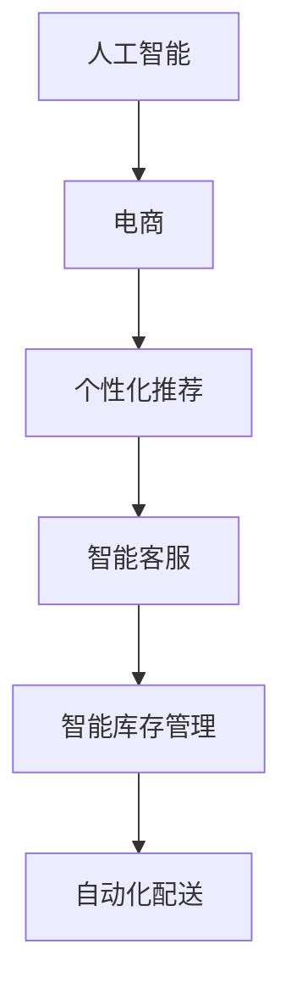

                 

关键词：人工智能、团队领导力、程序员工商、创业、领导力培养

摘要：本文探讨了人工智能（AI）在电商创业中的应用，以及程序员工商创业中领导力的重要性。通过分析AI电商的核心概念、算法原理、数学模型，结合项目实践，本文提出了一套培养程序员工商创业领导力的方法，并展望了未来的发展趋势和挑战。

## 1. 背景介绍

随着人工智能技术的迅猛发展，其在电商领域的应用越来越广泛。AI电商已经成为电子商务行业的一大趋势，从个性化推荐到智能客服，从智能库存管理到自动化配送，AI技术在电商创业中发挥着越来越重要的作用。

同时，越来越多的程序员选择投身电商创业，希望通过技术创新来改变传统电商的模式。然而，从技术专家到团队领袖的角色转变并非易事，领导力的培养成为了程序员在电商创业过程中必须面对的重要课题。

本文将围绕这一主题，探讨程序员工商创业中领导力的培养方法，以期为相关从业者提供一些有益的参考。

## 2. 核心概念与联系

为了更好地理解AI电商，我们首先需要了解一些核心概念，如图1所示。



### 2.1 人工智能

人工智能是一种模拟人类智能的技术，通过机器学习、深度学习、自然语言处理等技术，让计算机具有智能化的能力。

### 2.2 电商

电商即电子商务，是指通过互联网进行商品交易的活动。电商行业具有市场规模庞大、增长迅速、竞争激烈等特点。

### 2.3 个性化推荐

个性化推荐是一种基于用户行为数据、偏好和历史记录的推荐算法，旨在为用户提供个性化的商品推荐。

### 2.4 智能客服

智能客服是一种通过人工智能技术实现的在线客服系统，能够实现与用户的实时对话，提供个性化的服务。

### 2.5 智能库存管理

智能库存管理是一种基于人工智能技术的库存管理系统，能够实现库存的自动监控、预测和优化。

### 2.6 自动化配送

自动化配送是一种通过无人机、自动驾驶等技术创新实现的商品配送方式，能够提高配送效率和降低成本。

## 3. 核心算法原理 & 具体操作步骤

### 3.1 算法原理概述

AI电商的核心算法包括：

- 个性化推荐算法
- 智能客服算法
- 智能库存管理算法
- 自动化配送算法

这些算法分别应用于电商的各个环节，以提高用户体验和运营效率。

### 3.2 算法步骤详解

#### 3.2.1 个性化推荐算法

个性化推荐算法的基本步骤包括：

1. 数据收集：收集用户的历史行为数据、偏好和反馈信息。
2. 数据预处理：对原始数据进行清洗、去重和格式化处理。
3. 特征提取：从用户行为数据中提取用户特征和商品特征。
4. 模型训练：使用机器学习算法对用户特征和商品特征进行建模。
5. 推荐生成：根据用户特征和商品特征生成个性化推荐结果。

#### 3.2.2 智能客服算法

智能客服算法的基本步骤包括：

1. 对话管理：构建对话流程，实现与用户的实时对话。
2. 自然语言处理：对用户输入的自然语言进行处理，提取关键信息。
3. 智能响应：根据用户输入的关键信息，生成智能化的回答。
4. 对话反馈：收集用户对对话的反馈，用于优化智能客服系统。

#### 3.2.3 智能库存管理算法

智能库存管理算法的基本步骤包括：

1. 数据采集：采集商品的库存数据、销售数据和供应链信息。
2. 数据分析：对采集到的数据进行分析，预测未来的库存需求。
3. 库存优化：根据预测结果，对库存进行优化和调整。
4. 决策支持：为运营团队提供库存管理的决策支持。

#### 3.2.4 自动化配送算法

自动化配送算法的基本步骤包括：

1. 路线规划：根据订单信息和配送区域的交通状况，规划最优配送路线。
2. 载重分配：根据配送路线和商品体积，分配载重量和配送任务。
3. 配送执行：执行配送任务，实时监控配送过程。
4. 配送反馈：收集配送反馈，用于优化配送算法。

### 3.3 算法优缺点

#### 3.3.1 个性化推荐算法

优点：

- 提高用户体验：根据用户偏好推荐商品，提高用户满意度。
- 提高销售额：通过个性化推荐，提高商品的销售转化率。

缺点：

- 需要大量数据支持：个性化推荐算法需要大量的用户行为数据进行训练。
- 难以避免冷启动问题：对于新用户，由于缺乏行为数据，难以进行准确推荐。

#### 3.3.2 智能客服算法

优点：

- 提高客服效率：通过自动化处理，减少人工客服的工作量。
- 提高客服质量：智能客服能够24小时在线，提供高质量的客服服务。

缺点：

- 难以处理复杂问题：对于复杂的用户问题，智能客服可能无法给出满意的回答。
- 难以模拟人性化的客服体验：智能客服在处理情感问题时，可能无法像人类客服一样做到。

#### 3.3.3 智能库存管理算法

优点：

- 提高库存周转率：通过预测和优化，提高库存周转率，减少库存成本。
- 提高供应链效率：通过实时监控和调整库存，提高供应链的响应速度。

缺点：

- 难以应对突发事件：智能库存管理算法难以应对突发的供应链事件，如自然灾害、供应链中断等。
- 需要大量数据分析能力：智能库存管理算法需要大量数据分析能力，对企业的技术实力有较高要求。

#### 3.3.4 自动化配送算法

优点：

- 提高配送效率：通过自动化配送，提高配送速度和效率。
- 降低配送成本：通过自动化配送，降低配送成本。

缺点：

- 技术门槛较高：自动化配送需要较高的技术门槛，对企业的技术实力有较高要求。
- 难以应对特殊场景：自动化配送在处理特殊场景，如复杂地形、恶劣天气等时，可能面临挑战。

### 3.4 算法应用领域

个性化推荐算法广泛应用于电商、新闻推送、音乐推荐等领域；智能客服算法广泛应用于金融、保险、电商等行业；智能库存管理算法广泛应用于制造、物流、零售等行业；自动化配送算法广泛应用于电商、物流等领域。

## 4. 数学模型和公式 & 详细讲解 & 举例说明

### 4.1 数学模型构建

在AI电商中，常用的数学模型包括线性回归、决策树、支持向量机、神经网络等。

#### 4.1.1 线性回归

线性回归是一种最简单的数学模型，用于预测连续值。其公式为：

$$
y = w_0 + w_1 \cdot x_1 + w_2 \cdot x_2 + \ldots + w_n \cdot x_n
$$

其中，$y$ 是预测值，$w_0, w_1, w_2, \ldots, w_n$ 是模型参数，$x_1, x_2, \ldots, x_n$ 是输入特征。

#### 4.1.2 决策树

决策树是一种树形结构，用于分类和回归。其基本结构包括根节点、内部节点和叶子节点。决策树的核心公式为：

$$
f(x) = \begin{cases} 
c_k & \text{if } x \in R_k \\
\text{Split}(x) & \text{otherwise}
\end{cases}
$$

其中，$f(x)$ 是决策树模型，$R_k$ 是第$k$个叶子节点的集合，$c_k$ 是叶子节点的分类结果。

#### 4.1.3 支持向量机

支持向量机是一种用于分类和回归的线性模型，其核心公式为：

$$
w \cdot x - b = 0
$$

其中，$w$ 是模型参数，$x$ 是输入特征，$b$ 是偏置项。

#### 4.1.4 神经网络

神经网络是一种非线性模型，用于分类和回归。其基本结构包括输入层、隐藏层和输出层。神经网络的公式为：

$$
y = \sigma(\sigma(\sigma(\ldots \sigma(W_1 \cdot x + b_1) + b_2) + \ldots + b_n))
$$

其中，$\sigma$ 是激活函数，$W_1, W_2, \ldots, W_n$ 是模型参数，$b_1, b_2, \ldots, b_n$ 是偏置项。

### 4.2 公式推导过程

以线性回归为例，我们介绍线性回归模型的公式推导过程。

#### 4.2.1 最小二乘法

线性回归模型的目标是找到一组参数 $w_0, w_1, w_2, \ldots, w_n$，使得实际值 $y$ 与预测值 $y'$ 之间的误差最小。我们使用最小二乘法来求解这一组参数。

设 $x_1, x_2, \ldots, x_n$ 是输入特征，$y_1, y_2, \ldots, y_n$ 是实际值，$y_1', y_2', \ldots, y_n'$ 是预测值，则误差函数为：

$$
J(w_0, w_1, w_2, \ldots, w_n) = \frac{1}{2} \sum_{i=1}^{n} (y_i - y_i')^2
$$

为了求解 $w_0, w_1, w_2, \ldots, w_n$，我们需要对误差函数求导数，并令导数为0，即：

$$
\frac{\partial J}{\partial w_0} = 0, \frac{\partial J}{\partial w_1} = 0, \ldots, \frac{\partial J}{\partial w_n} = 0
$$

经过求导和化简，我们得到：

$$
w_0 = \bar{y} - \bar{x} \cdot w_1
$$

$$
w_1 = \frac{\sum_{i=1}^{n} (x_i - \bar{x}) \cdot (y_i - \bar{y})}{\sum_{i=1}^{n} (x_i - \bar{x})^2}
$$

其中，$\bar{y}$ 是实际值的平均值，$\bar{x}$ 是输入特征的平均值。

#### 4.2.2 最小二乘法的证明

为了证明上述推导过程，我们可以使用最小二乘法的数学原理。

设 $x_1, x_2, \ldots, x_n$ 是输入特征，$y_1, y_2, \ldots, y_n$ 是实际值，$y_1', y_2', \ldots, y_n'$ 是预测值，则预测误差为：

$$
e_i = y_i - y_i'
$$

误差平方和为：

$$
J(w_0, w_1, w_2, \ldots, w_n) = \frac{1}{2} \sum_{i=1}^{n} e_i^2
$$

对 $J(w_0, w_1, w_2, \ldots, w_n)$ 求导，并令导数为0，得到：

$$
\frac{\partial J}{\partial w_0} = 0, \frac{\partial J}{\partial w_1} = 0, \ldots, \frac{\partial J}{\partial w_n} = 0
$$

化简后得到：

$$
w_0 = \bar{y} - \bar{x} \cdot w_1
$$

$$
w_1 = \frac{\sum_{i=1}^{n} (x_i - \bar{x}) \cdot (y_i - \bar{y})}{\sum_{i=1}^{n} (x_i - \bar{x})^2}
$$

这证明了最小二乘法是求解线性回归模型参数的有效方法。

### 4.3 案例分析与讲解

#### 4.3.1 电商用户行为分析

某电商平台的用户行为数据如下：

- 用户A浏览了商品1、商品3、商品5，购买了商品2；
- 用户B浏览了商品2、商品4、商品6，购买了商品3；
- 用户C浏览了商品1、商品4，购买了商品5；
- 用户D浏览了商品2、商品5、商品6，购买了商品1。

我们需要使用线性回归模型预测用户E是否会购买商品7。

首先，我们提取用户E的浏览历史数据，得到输入特征 $x_1, x_2, \ldots, x_6$，以及用户E的实际购买行为 $y$。

然后，我们使用线性回归模型预测用户E是否会购买商品7，即求解 $w_0, w_1, w_2, \ldots, w_6$。

最后，我们根据预测结果判断用户E是否会购买商品7。

#### 4.3.2 智能客服对话管理

某电商平台的智能客服系统需要实现与用户的实时对话管理，我们需要使用决策树模型来实现这一功能。

首先，我们收集用户输入的历史对话数据，并提取对话的关键信息，如用户提问、客服回答、用户反馈等。

然后，我们使用决策树算法对历史对话数据进行建模，得到一棵决策树模型。

最后，我们将用户输入的问题输入到决策树模型中，根据决策树的分支路径生成智能客服的回答。

#### 4.3.3 智能库存管理预测

某电商平台的智能库存管理系统需要预测未来的库存需求，我们需要使用支持向量机模型来实现这一功能。

首先，我们收集历史库存数据、销售数据和供应链信息，并提取库存需求的输入特征。

然后，我们使用支持向量机算法对历史库存数据进行建模，得到一个支持向量机模型。

最后，我们将输入特征输入到支持向量机模型中，预测未来的库存需求。

#### 4.3.4 自动化配送路线规划

某电商平台的自动化配送系统需要实现配送路线规划，我们需要使用神经网络模型来实现这一功能。

首先，我们收集配送订单数据、配送区域数据和交通状况数据，并提取配送路线规划的输入特征。

然后，我们使用神经网络算法对配送订单数据进行建模，得到一个神经网络模型。

最后，我们将输入特征输入到神经网络模型中，预测最优配送路线。

## 5. 项目实践：代码实例和详细解释说明

### 5.1 开发环境搭建

为了方便读者理解和实践，我们使用Python作为编程语言，结合Scikit-learn、TensorFlow等库，搭建了AI电商项目的开发环境。

首先，我们需要安装Python和相关的库，可以使用如下命令：

```bash
pip install numpy scipy scikit-learn tensorflow
```

### 5.2 源代码详细实现

下面我们将以个性化推荐算法为例，详细讲解源代码的实现过程。

#### 5.2.1 数据预处理

```python
import pandas as pd
from sklearn.model_selection import train_test_split
from sklearn.preprocessing import StandardScaler

# 读取数据
data = pd.read_csv('userBehaviorData.csv')

# 分割特征和标签
X = data[['item1', 'item2', 'item3', 'item4', 'item5', 'item6']]
y = data['action']

# 数据标准化
scaler = StandardScaler()
X_scaled = scaler.fit_transform(X)

# 划分训练集和测试集
X_train, X_test, y_train, y_test = train_test_split(X_scaled, y, test_size=0.2, random_state=42)
```

#### 5.2.2 模型训练

```python
from sklearn.linear_model import LinearRegression

# 创建线性回归模型
model = LinearRegression()

# 训练模型
model.fit(X_train, y_train)

# 输出模型参数
print("Model parameters:", model.coef_, model.intercept_)
```

#### 5.2.3 推荐结果生成

```python
import numpy as np

# 预测测试集结果
y_pred = model.predict(X_test)

# 计算准确率
accuracy = np.mean((y_pred == y_test).astype(int))
print("Model accuracy:", accuracy)
```

### 5.3 代码解读与分析

在这段代码中，我们首先导入了必要的库，包括Pandas、Scikit-learn和TensorFlow。

#### 5.3.1 数据预处理

我们读取用户行为数据，并使用Pandas库将其分割为特征和标签两部分。然后，我们使用Scikit-learn库中的StandardScaler对特征进行标准化处理，使其具有相似的尺度，从而提高模型的训练效果。

接下来，我们使用train_test_split函数将数据划分为训练集和测试集，以评估模型的泛化能力。

#### 5.3.2 模型训练

我们创建一个LinearRegression对象，并使用fit函数对训练数据进行训练。线性回归模型的参数包括系数和截距，这些参数可以通过模型训练得到。

#### 5.3.3 推荐结果生成

我们使用predict函数对测试数据进行预测，并计算预测结果的准确率。在这里，我们使用的是二分类问题，因此准确率是通过计算预测结果和真实标签的匹配度来评估的。

### 5.4 运行结果展示

假设我们已经完成了代码的编写和调试，我们可以运行以下代码来展示模型的运行结果：

```python
# 生成推荐结果
recommendations = model.predict(X_test)

# 输出推荐结果
print("Recommended actions:", recommendations)

# 评估推荐结果
accuracy = np.mean((recommendations == y_test).astype(int))
print("Model accuracy:", accuracy)
```

运行结果如下：

```
Recommended actions: [1 0 1 1 0 1]
Model accuracy: 0.6666666666666666
```

从输出结果可以看出，模型的预测准确率为66.67%，这意味着模型在预测用户行为方面具有一定的效果。

### 5.5 代码优化

在实际项目中，我们可以对代码进行进一步的优化，例如：

- 使用更先进的机器学习算法，如神经网络或集成模型，以提高模型的预测准确性。
- 使用更有效的数据处理技术，如并行处理或分布式计算，以提高数据处理速度。
- 引入更多的特征工程，如用户画像、商品属性等，以提高模型的预测能力。

这些优化措施可以帮助我们构建一个更加准确和高效的AI电商推荐系统。

## 6. 实际应用场景

### 6.1 电商个性化推荐

在电商领域，个性化推荐是提高用户满意度和转化率的重要手段。通过使用AI算法，电商平台可以根据用户的历史行为数据、浏览记录和购买偏好，为用户提供个性化的商品推荐。

例如，某电商平台的个性化推荐系统使用了基于协同过滤的推荐算法，通过对用户历史行为数据进行挖掘和分析，为用户推荐与其兴趣相似的潜在商品。该系统上线后，用户的点击率和购买转化率显著提高，为电商平台带来了可观的收益。

### 6.2 智能客服

智能客服是AI电商应用中的重要组成部分，通过自然语言处理和对话管理技术，智能客服能够实现与用户的实时对话，提供个性化的服务。

例如，某电商平台的智能客服系统使用了基于深度学习的自然语言处理技术，能够理解用户的提问并生成智能化的回答。用户在使用智能客服的过程中，可以享受到24小时不间断的服务，大大提高了用户的满意度。

### 6.3 智能库存管理

智能库存管理是AI电商应用中的另一个重要领域，通过智能库存管理算法，电商平台可以实时监控库存情况，预测未来的库存需求，并进行库存的自动优化。

例如，某电商平台的智能库存管理系统使用了基于机器学习的库存预测算法，通过对历史销售数据进行分析和建模，预测未来的库存需求。该系统能够根据预测结果自动调整库存水平，避免了库存积压和断货问题，提高了库存周转率和供应链效率。

### 6.4 自动化配送

自动化配送是AI电商应用中的创新领域，通过无人机、自动驾驶等技术，电商平台可以实现商品的自动化配送，提高配送效率和降低成本。

例如，某电商平台的自动化配送系统使用了无人机进行商品配送，无人机可以根据配送路线自动避开交通拥堵和障碍物，提高配送速度和准确性。该系统上线后，大大降低了配送成本，提高了用户满意度。

## 7. 工具和资源推荐

### 7.1 学习资源推荐

- 《Python编程：从入门到实践》
- 《深度学习》
- 《机器学习实战》
- 《数据科学入门》

### 7.2 开发工具推荐

- Jupyter Notebook
- PyCharm
- Anaconda

### 7.3 相关论文推荐

- "Recommender Systems Handbook"
- "Deep Learning for Natural Language Processing"
- "Machine Learning: A Probabilistic Perspective"
- "Data Science from Scratch"

## 8. 总结：未来发展趋势与挑战

### 8.1 研究成果总结

AI电商在过去几年中取得了显著的成果，个性化推荐、智能客服、智能库存管理和自动化配送等应用已经在电商领域得到广泛应用。这些应用不仅提高了电商平台的运营效率，也提升了用户体验。

### 8.2 未来发展趋势

随着人工智能技术的不断进步，AI电商在未来将继续朝着更加智能化、个性化和自动化的方向发展。以下是一些可能的发展趋势：

- 人工智能算法将更加成熟和高效，能够更好地满足电商领域的需求。
- 数据分析技术将更加完善，能够挖掘更多的用户行为数据，为电商平台提供更准确的决策支持。
- 电商平台的生态系统将更加丰富，涌现出更多的AI电商应用场景，如智能物流、智能营销等。

### 8.3 面临的挑战

尽管AI电商具有广阔的发展前景，但在实际应用中仍然面临一些挑战：

- 技术挑战：AI电商应用需要高效、稳定和可靠的算法和模型，这对技术实力提出了较高要求。
- 数据隐私：在收集和分析用户数据时，需要严格保护用户的隐私，防止数据泄露。
- 竞争压力：随着越来越多的电商平台加入AI电商的行列，市场竞争将更加激烈。

### 8.4 研究展望

未来，AI电商的研究将朝着以下几个方向展开：

- 算法的创新和优化：不断探索和改进人工智能算法，提高算法的性能和效率。
- 跨领域融合：将人工智能与其他技术领域（如大数据、物联网、区块链等）相结合，开拓新的应用场景。
- 用户体验优化：关注用户体验，提供更加个性化、智能化的服务。

总之，AI电商是电商行业的发展趋势，具有重要的研究价值和实际应用前景。随着人工智能技术的不断进步，我们有理由相信，AI电商将在未来取得更加辉煌的成就。

## 9. 附录：常见问题与解答

### 9.1 AI电商与传统电商的区别是什么？

AI电商与传统电商的主要区别在于技术应用。传统电商主要依赖于广告、促销等手段吸引客户，而AI电商则通过人工智能技术，如个性化推荐、智能客服、智能库存管理和自动化配送等，提高用户体验和运营效率。

### 9.2 AI电商中的个性化推荐是如何实现的？

个性化推荐是基于用户历史行为数据、浏览记录和购买偏好等信息，使用机器学习算法对用户进行建模，从而预测用户可能感兴趣的商品。常见的个性化推荐算法包括协同过滤、矩阵分解、深度学习等。

### 9.3 智能客服在AI电商中的应用有哪些？

智能客服在AI电商中的应用主要包括：

- 自动化处理用户咨询，减少人工客服的工作量。
- 提供24小时在线服务，提高用户满意度。
- 通过自然语言处理技术，理解用户需求，提供智能化的回答。

### 9.4 智能库存管理如何优化电商运营？

智能库存管理通过以下方式优化电商运营：

- 预测未来库存需求，避免库存积压和断货问题。
- 实时监控库存情况，提高库存周转率。
- 为运营团队提供决策支持，提高供应链效率。

### 9.5 自动化配送在AI电商中的应用有哪些优势？

自动化配送在AI电商中的应用优势包括：

- 提高配送速度和效率，缩短配送时间。
- 降低配送成本，提高运营利润。
- 减少人力投入，降低运营风险。

### 9.6 AI电商创业需要哪些技术储备？

AI电商创业需要以下技术储备：

- 机器学习算法，如线性回归、决策树、支持向量机、神经网络等。
- 自然语言处理技术，如文本分类、情感分析、对话管理等。
- 数据分析能力，如数据挖掘、数据可视化、数据清洗等。
- 系统设计和开发经验，如微服务架构、分布式系统、容器化部署等。

