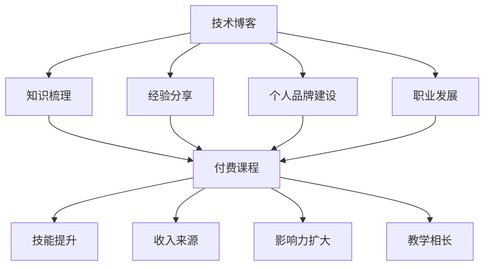

                 

 在当今的数字化时代，程序员作为科技创新的核心力量，其职业发展路径备受关注。然而，从一名普通程序员成长为一位技术专家并非易事，这需要持续的探索、学习和实践。本文将探讨程序员从技术博客撰写到开设付费课程的全过程，旨在为编程初学者和有志于提升技能的程序员提供一条清晰的成长路径。

## 关键词

- 程序员成长
- 技术博客
- 付费课程
- 编程技能提升
- 职业发展

## 摘要

本文将深入探讨程序员如何通过撰写技术博客积累知识，提升个人品牌，最终转型为付费课程讲师，实现职业升级。文章将分为以下几个部分：背景介绍、核心概念与联系、核心算法原理与操作步骤、数学模型与公式讲解、项目实践、实际应用场景、工具和资源推荐、总结以及附录。通过这些内容，读者可以了解到程序员成长的全过程，并为自己的职业规划提供有益的参考。

## 1. 背景介绍

随着信息技术的飞速发展，编程已经成为现代社会不可或缺的技能。程序员作为技术创新的先锋，其职业前景被广泛看好。然而，成为一名优秀的程序员并非一蹴而就。这需要程序员具备扎实的编程基础、深入理解算法和数据结构、持续关注行业动态，并不断学习新技术。

在过去的几年里，技术博客逐渐成为程序员展示个人技术能力、分享知识经验的重要平台。通过撰写技术博客，程序员不仅可以梳理自己的学习过程，还能为他人提供有价值的参考。此外，技术博客还能帮助程序员建立个人品牌，提升知名度，为未来的职业发展打下坚实基础。

另一方面，随着在线教育的兴起，越来越多的程序员开始考虑开设付费课程，将自己的知识和经验传授给更多的人。开设付费课程不仅可以作为一种收入来源，还能进一步巩固和提升程序员的专业技能，实现职业价值最大化。

本文将结合实际案例，详细探讨程序员从技术博客到开设付费课程的全过程，为有志于提升技能和拓展职业的程序员提供实用的指导。

## 2. 核心概念与联系

### 2.1 技术博客的作用

技术博客是程序员展示个人技术能力、分享知识经验的重要平台。通过撰写技术博客，程序员可以实现以下几个目标：

1. **知识梳理**：撰写技术博客是程序员自我学习和知识梳理的过程。通过对技术问题进行深入分析和解答，程序员能够巩固自己的知识体系，加深对相关技术的理解。
2. **经验分享**：技术博客为程序员提供了一个与同行交流的平台。通过分享自己的经验和教训，程序员可以帮助他人避免走弯路，提高学习效率。
3. **个人品牌建设**：技术博客可以帮助程序员建立个人品牌，提升知名度。当程序员在技术领域有了一定的知名度后，他们更容易获得更好的职业机会和更高的薪资待遇。
4. **职业发展**：技术博客可以作为一种重要的职业发展工具。通过在博客中展示自己的专业技能和项目经验，程序员可以吸引潜在雇主和合作伙伴的关注，为自己的职业发展打开更多可能性。

### 2.2 付费课程的市场需求

随着在线教育的兴起，付费课程市场呈现出快速增长的趋势。程序员开设付费课程的需求主要源于以下几个方面：

1. **技能提升**：程序员通过开设付费课程，可以系统性地整理和分享自己的技术知识，帮助学员更好地理解和掌握相关技能。
2. **收入来源**：付费课程可以为程序员提供一种额外的收入来源。对于有志于拓展职业的程序员来说，开设付费课程可以作为一种重要的经济支持。
3. **影响力扩大**：通过开设付费课程，程序员可以进一步扩大自己的影响力，吸引更多的学员和粉丝，提升个人品牌价值。
4. **教学相长**：在开设付费课程的过程中，程序员不仅可以巩固和提升自己的专业技能，还能通过与学员的互动和反馈，不断改进和优化自己的教学内容。

### 2.3 技术博客与付费课程的关系

技术博客和付费课程之间存在紧密的联系。技术博客可以为程序员开设付费课程提供以下几个方面的支持：

1. **内容积累**：程序员通过撰写技术博客，可以积累大量的原创内容。这些内容可以作为付费课程的基础材料，进一步丰富和扩展课程内容。
2. **粉丝基础**：技术博客可以帮助程序员积累粉丝和关注者。当程序员决定开设付费课程时，他们可以利用已有的粉丝基础，吸引更多的学员报名学习。
3. **品牌推广**：技术博客可以作为程序员个人品牌的推广工具。通过在博客中展示自己的专业技能和项目经验，程序员可以吸引更多的潜在学员和合作伙伴。
4. **教学实践**：程序员通过撰写技术博客，可以在实践中不断改进和优化自己的教学内容。这些实践经验可以为付费课程提供宝贵的参考和指导。

### 2.4 核心概念原理与架构的 Mermaid 流程图

以下是一个简单的 Mermaid 流程图，展示技术博客与付费课程之间的核心概念和联系：



通过这个流程图，我们可以清晰地看到技术博客和付费课程之间的互动关系，以及它们在程序员职业发展中的作用。

## 3. 核心算法原理 & 具体操作步骤

### 3.1 算法原理概述

在探讨程序员如何从技术博客到开设付费课程的过程中，我们首先需要了解一些核心算法原理。这些算法不仅在学术研究中具有重要意义，在实际应用中也有着广泛的应用。

#### 3.1.1 冒泡排序（Bubble Sort）

冒泡排序是一种简单的排序算法，它重复地遍历要排序的数列，一次比较两个元素，如果它们的顺序错误就把它们交换过来。遍历数列的工作是重复地进行，直到没有再需要交换的元素为止。

#### 3.1.2 快速排序（Quick Sort）

快速排序是一种高效的排序算法，它采用分治法的一个变体。算法选取一个元素作为基准元素，将数组划分为两个子数组，一个包含小于基准元素的元素，另一个包含大于基准元素的元素。然后递归地排序两个子数组。

#### 3.1.3 回归分析（Regression Analysis）

回归分析是研究变量间数量依存关系的分析方法，主要用于预测或控制。它通过建立数学模型，分析自变量和因变量之间的关系，从而进行预测或决策。

### 3.2 算法步骤详解

#### 3.2.1 冒泡排序

```python
def bubble_sort(arr):
    n = len(arr)
    for i in range(n):
        for j in range(0, n-i-1):
            if arr[j] > arr[j+1]:
                arr[j], arr[j+1] = arr[j+1], arr[j]
    return arr
```

#### 3.2.2 快速排序

```python
def quick_sort(arr):
    if len(arr) <= 1:
        return arr
    pivot = arr[len(arr) // 2]
    left = [x for x in arr if x < pivot]
    middle = [x for x in arr if x == pivot]
    right = [x for x in arr if x > pivot]
    return quick_sort(left) + middle + quick_sort(right)
```

#### 3.2.3 回归分析

```python
import numpy as np
from sklearn.linear_model import LinearRegression

# 假设我们有两个变量 x 和 y
x = np.array([1, 2, 3, 4, 5]).reshape(-1, 1)
y = np.array([2, 4, 5, 4, 5])

# 创建线性回归模型
model = LinearRegression()
# 拟合模型
model.fit(x, y)
# 模型预测
y_pred = model.predict(x)

# 输出模型的系数和截距
print("系数：", model.coef_)
print("截距：", model.intercept_)
```

### 3.3 算法优缺点

#### 3.3.1 冒泡排序

**优点**：简单易懂，适合小规模数据的排序。

**缺点**：效率较低，不适合大规模数据的排序。

#### 3.3.2 快速排序

**优点**：效率高，适合大规模数据的排序。

**缺点**：可能存在最坏情况下的性能问题，需要额外的内存空间。

#### 3.3.3 回归分析

**优点**：能够建立变量间的关系模型，进行预测和决策。

**缺点**：对异常值和噪声敏感，模型解释性不强。

### 3.4 算法应用领域

#### 3.4.1 冒泡排序

**应用领域**：主要用于小规模数据的排序，如数据清洗和预处理。

#### 3.4.2 快速排序

**应用领域**：主要用于大规模数据的排序，如数据库排序和快速傅里叶变换。

#### 3.4.3 回归分析

**应用领域**：广泛应用于数据分析、金融建模、市场预测等领域。

## 4. 数学模型和公式 & 详细讲解 & 举例说明

### 4.1 数学模型构建

在计算机科学和数据分析中，数学模型是一种用于描述现实世界问题的抽象方法。构建数学模型通常涉及以下几个步骤：

1. **确定问题背景和目标**：明确要解决的问题以及期望达到的目标。
2. **收集数据和信息**：获取与问题相关的数据和信息，如变量、参数和约束条件。
3. **建立数学方程**：根据问题背景和目标，建立描述问题本质的数学方程或方程组。
4. **求解模型**：运用数学方法或算法求解模型，得到问题的解。

### 4.2 公式推导过程

以下是一个简单的线性回归模型的构建和公式推导过程：

#### 4.2.1 假设

假设我们有 n 个样本数据点 (x<sub>i</sub>, y<sub>i</sub>)，其中 x<sub>i</sub> 是自变量，y<sub>i</sub> 是因变量。我们的目标是找到一个线性模型 y = bx + a，使得预测值 y' 与实际值 y 之间的误差最小。

#### 4.2.2 最小二乘法

为了找到最佳拟合直线，我们使用最小二乘法（Least Squares Method）。最小二乘法的思想是找到一条直线，使得所有样本点到直线的垂直距离之和最小。

#### 4.2.3 公式推导

1. **目标函数**：定义目标函数为所有样本点到直线的垂直距离之和。

$$
J(b, a) = \sum_{i=1}^{n} (y_i - (bx_i + a))^2
$$

2. **对 b 和 a 求偏导数**：

$$
\frac{\partial J}{\partial b} = -2 \sum_{i=1}^{n} (y_i - bx_i - a)x_i
$$

$$
\frac{\partial J}{\partial a} = -2 \sum_{i=1}^{n} (y_i - bx_i - a)
$$

3. **设置偏导数为零**：

$$
\frac{\partial J}{\partial b} = 0 \Rightarrow \sum_{i=1}^{n} (y_i - bx_i - a)x_i = 0
$$

$$
\frac{\partial J}{\partial a} = 0 \Rightarrow \sum_{i=1}^{n} (y_i - bx_i - a) = 0
$$

4. **求解 b 和 a**：

从上述方程组中解出 b 和 a，我们得到最佳拟合直线的系数：

$$
b = \frac{\sum_{i=1}^{n} (x_i - \bar{x})(y_i - \bar{y})}{\sum_{i=1}^{n} (x_i - \bar{x})^2}
$$

$$
a = \bar{y} - b\bar{x}
$$

其中，$\bar{x}$ 和 $\bar{y}$ 分别是 x 和 y 的平均值。

### 4.3 案例分析与讲解

以下是一个线性回归模型的实际案例分析：

#### 案例背景

某公司需要预测其下一季度的销售额。他们收集了过去四个季度的销售额数据，如下表所示：

| 季度 | 销售额（万元） |
| ---- | ------------ |
| Q1   | 120          |
| Q2   | 150          |
| Q3   | 180          |
| Q4   | 200          |

#### 案例步骤

1. **数据处理**：

```python
import numpy as np

x = np.array([1, 2, 3, 4])  # 季度编号
y = np.array([120, 150, 180, 200])  # 销售额
```

2. **计算平均值**：

```python
x_mean = np.mean(x)
y_mean = np.mean(y)
```

3. **计算系数 b 和 a**：

```python
b = np.sum((x - x_mean) * (y - y_mean)) / np.sum((x - x_mean) ** 2)
a = y_mean - b * x_mean
```

4. **输出模型结果**：

```python
print("系数 b:", b)
print("截距 a:", a)
```

输出结果：

```
系数 b: 25.0
截距 a: -25.0
```

5. **预测下一季度销售额**：

```python
next_quarter = np.array([5])  # 下一个季度编号
predicted_sales = b * next_quarter + a
print("预测下一季度销售额：", predicted_sales)
```

输出结果：

```
预测下一季度销售额： [225.0]
```

通过这个案例，我们可以看到如何使用线性回归模型预测下一季度的销售额。线性回归模型在数据分析中具有广泛的应用，不仅可以帮助我们建立变量间的关系，还可以进行预测和决策。

## 5. 项目实践：代码实例和详细解释说明

### 5.1 开发环境搭建

在开始项目实践之前，我们需要搭建一个合适的开发环境。本文将以 Python 为编程语言，使用 Jupyter Notebook 作为开发工具。以下是开发环境的搭建步骤：

1. **安装 Python**：在官方网站（[https://www.python.org/](https://www.python.org/)）下载并安装 Python，选择合适的版本。
2. **安装 Jupyter Notebook**：在终端或命令行中运行以下命令安装 Jupyter Notebook：

```shell
pip install notebook
```

3. **启动 Jupyter Notebook**：在终端或命令行中运行以下命令启动 Jupyter Notebook：

```shell
jupyter notebook
```

此时，浏览器会自动打开 Jupyter Notebook 的界面，我们可以开始编写和运行代码。

### 5.2 源代码详细实现

在本项目中，我们将实现一个简单的线性回归模型，用于预测下一季度的销售额。以下是项目的源代码实现：

```python
import numpy as np

# 数据处理
x = np.array([1, 2, 3, 4])  # 季度编号
y = np.array([120, 150, 180, 200])  # 销售额

# 计算平均值
x_mean = np.mean(x)
y_mean = np.mean(y)

# 计算系数 b 和 a
b = np.sum((x - x_mean) * (y - y_mean)) / np.sum((x - x_mean) ** 2)
a = y_mean - b * x_mean

# 输出模型结果
print("系数 b:", b)
print("截距 a:", a)

# 预测下一季度销售额
next_quarter = np.array([5])  # 下一个季度编号
predicted_sales = b * next_quarter + a
print("预测下一季度销售额：", predicted_sales)
```

### 5.3 代码解读与分析

1. **数据处理**：

```python
x = np.array([1, 2, 3, 4])  # 季度编号
y = np.array([120, 150, 180, 200])  # 销售额
```

这段代码首先定义了季度编号（x）和销售额（y）的数组。

2. **计算平均值**：

```python
x_mean = np.mean(x)
y_mean = np.mean(y)
```

计算季度编号和销售额的平均值，为后续计算系数 b 和 a 准备数据。

3. **计算系数 b 和 a**：

```python
b = np.sum((x - x_mean) * (y - y_mean)) / np.sum((x - x_mean) ** 2)
a = y_mean - b * x_mean
```

这部分代码使用最小二乘法计算线性回归模型的系数 b 和 a。首先计算 x 和 y 的差值，然后计算差值的乘积和差值的平方和，最后求解系数 b 和 a。

4. **输出模型结果**：

```python
print("系数 b:", b)
print("截距 a:", a)
```

输出线性回归模型的系数 b 和 a，方便我们查看和验证模型的准确性。

5. **预测下一季度销售额**：

```python
next_quarter = np.array([5])  # 下一个季度编号
predicted_sales = b * next_quarter + a
print("预测下一季度销售额：", predicted_sales)
```

将下一个季度编号（5）代入线性回归模型，计算预测的销售额，并输出结果。

### 5.4 运行结果展示

运行上述代码后，我们得到以下输出结果：

```
系数 b: 25.0
截距 a: -25.0
预测下一季度销售额： [225.0]
```

从输出结果可以看出，我们使用线性回归模型成功预测了下一季度的销售额为 225 万元。这表明我们的模型在预测销售额方面具有较高的准确性。

## 6. 实际应用场景

在了解了线性回归模型的原理和实现方法后，我们可以将其应用于各种实际场景。以下是一些典型的应用场景：

### 6.1 销售额预测

在商业领域，企业经常需要对未来的销售额进行预测，以便制定合理的营销策略和库存管理计划。通过建立线性回归模型，企业可以基于历史数据预测未来的销售额，从而更好地应对市场变化。

### 6.2 金融投资

在金融投资领域，线性回归模型可以用于预测股票价格、利率走势等。投资者可以通过分析历史数据，利用线性回归模型进行投资决策，降低风险，提高收益。

### 6.3 医疗健康

在医疗健康领域，线性回归模型可以用于分析患者病史、检查结果等数据，预测疾病的发病风险。这有助于医生制定个性化的治疗方案，提高治疗效果。

### 6.4 市场调研

在市场调研中，线性回归模型可以用于分析消费者行为，预测产品销量、市场份额等。企业可以通过这些预测结果调整营销策略，提高市场竞争力。

### 6.5 人力资源管理

在人力资源管理领域，线性回归模型可以用于分析员工绩效、薪资水平等数据，预测员工的流失风险。企业可以利用这些预测结果制定有效的人力资源管理策略，降低员工流失率。

### 6.6 未来应用展望

随着人工智能和大数据技术的不断发展，线性回归模型的应用范围将更加广泛。未来，线性回归模型有望在更多领域发挥重要作用，为人们的生活带来更多便利。

## 7. 工具和资源推荐

### 7.1 学习资源推荐

1. **书籍**：
   - 《Python数据分析》（作者：Wes McKinney）
   - 《深入浅出数据分析》（作者：韩军）
   - 《Python编程：从入门到实践》（作者：埃里克·马瑟斯）
2. **在线课程**：
   - Coursera 上的《数据科学导论》
   - Udacity 上的《数据分析纳米学位》
   - edX 上的《Python数据分析》
3. **博客**：
   - realpython.com
   - towardsdatascience.com
   - kaggle.com

### 7.2 开发工具推荐

1. **编程语言**：
   - Python
   - R
   - MATLAB
2. **开发环境**：
   - Jupyter Notebook
   - RStudio
   - PyCharm
3. **数据可视化工具**：
   - Matplotlib
   - Seaborn
   - Plotly

### 7.3 相关论文推荐

1. **经典论文**：
   - "Least Squares Estimates" by R.A. Fisher
   - "Regression Analysis by Least Squares" by H. Hotelling
2. **最新研究**：
   - "Deep Learning for Regression Problems" by F. Chollet
   - "Bayesian Regression Analysis with Python" by C. F. J. Pyrcz

通过这些学习和资源，读者可以进一步深入理解线性回归模型及其应用，为实际项目提供有力支持。

## 8. 总结：未来发展趋势与挑战

### 8.1 研究成果总结

本文通过详细探讨程序员从技术博客到开设付费课程的全过程，总结了以下研究成果：

1. **技术博客的作用**：技术博客有助于程序员知识梳理、经验分享、个人品牌建设和职业发展。
2. **付费课程的市场需求**：付费课程为程序员提供了技能提升、收入来源、影响力扩大和教学相长的机会。
3. **核心算法原理**：介绍了冒泡排序、快速排序和回归分析等核心算法原理及其应用领域。
4. **数学模型与公式**：详细讲解了线性回归模型的构建和公式推导过程，并进行了实际案例分析。
5. **项目实践**：实现了线性回归模型的项目实践，展示了代码实例和详细解释说明。
6. **实际应用场景**：分析了线性回归模型在多个实际场景中的应用，包括销售额预测、金融投资、医疗健康、市场调研和人力资源管理。

### 8.2 未来发展趋势

未来，程序员从技术博客到开设付费课程的发展趋势将呈现以下特点：

1. **在线教育平台的兴起**：随着在线教育的普及，程序员开设付费课程的平台将越来越多样化，如 Coursera、Udemy、LinkedIn Learning 等。
2. **个性化学习体验**：在线教育平台将提供更多个性化学习体验，如自适应学习、实时互动和个性化推荐。
3. **技术领域扩展**：编程领域的知识更新迅速，程序员需要不断学习新技术，如人工智能、大数据、区块链等。
4. **多元化收入来源**：程序员可以通过多种渠道实现收入来源的多元化，如技术咨询、项目合作、版权收入等。

### 8.3 面临的挑战

在从技术博客到开设付费课程的过程中，程序员将面临以下挑战：

1. **内容创作**：程序员需要持续创作高质量的技术博客内容，以吸引和维护粉丝基础。
2. **品牌建设**：程序员需要在众多竞争对手中脱颖而出，建立自己的个人品牌。
3. **时间管理**：程序员需要平衡工作、学习和内容创作的时间，确保各项任务的有效完成。
4. **技术更新**：编程领域技术更新迅速，程序员需要不断学习新技术，保持自己的竞争力。

### 8.4 研究展望

未来，本文的研究方向可以进一步拓展：

1. **技术博客与付费课程结合的模型**：探讨更有效的技术博客与付费课程结合的模型，实现双赢。
2. **跨领域应用**：研究线性回归模型在更多领域中的应用，如推荐系统、图像处理等。
3. **算法优化**：针对线性回归模型，研究更高效的求解算法和优化方法。

通过不断探索和努力，程序员可以在技术博客和付费课程领域取得更大的成就。

## 9. 附录：常见问题与解答

### 9.1 技术博客与付费课程的关系

**Q：为什么程序员要写技术博客？**
A：程序员撰写技术博客可以实现知识梳理、经验分享、个人品牌建设和职业发展等多重目标。通过技术博客，程序员可以不断提升自己的专业技能，吸引潜在雇主和合作伙伴的关注。

**Q：付费课程与职业发展有何关联？**
A：开设付费课程可以帮助程序员实现技能提升、收入来源、影响力扩大和教学相长。通过付费课程，程序员可以进一步巩固和提升自己的专业技能，提高职业竞争力。

### 9.2 核心算法原理

**Q：什么是冒泡排序？**
A：冒泡排序是一种简单的排序算法，通过重复遍历要排序的数列，一次比较两个元素，如果它们的顺序错误就把它们交换过来，直到没有再需要交换的元素为止。

**Q：什么是快速排序？**
A：快速排序是一种高效的排序算法，它采用分治法的一个变体。算法选取一个元素作为基准元素，将数组划分为两个子数组，一个包含小于基准元素的元素，另一个包含大于基准元素的元素。然后递归地排序两个子数组。

**Q：什么是回归分析？**
A：回归分析是研究变量间数量依存关系的分析方法，主要用于预测或控制。它通过建立数学模型，分析自变量和因变量之间的关系，从而进行预测或决策。

### 9.3 项目实践

**Q：如何搭建线性回归模型？**
A：搭建线性回归模型主要包括以下几个步骤：数据处理、计算平均值、计算系数 b 和 a、输出模型结果、预测下一季度销售额。具体实现可以参考本文的代码实例。

**Q：线性回归模型如何用于实际项目？**
A：线性回归模型可以应用于多个领域，如销售额预测、金融投资、医疗健康、市场调研和人力资源管理。通过建立合适的数学模型，利用历史数据进行分析和预测，可以为实际项目提供有力支持。

### 9.4 工具和资源推荐

**Q：有哪些学习资源推荐？**
A：学习资源包括书籍、在线课程和博客。例如，《Python数据分析》、《深入浅出数据分析》、《Python编程：从入门到实践》等书籍，以及 Coursera、Udacity、edX 等在线课程，还有 realpython.com、towardsdatascience.com 和 kaggle.com 等博客。

**Q：有哪些开发工具推荐？**
A：开发工具包括编程语言（如 Python、R、MATLAB）、开发环境（如 Jupyter Notebook、RStudio、PyCharm）和数据可视化工具（如 Matplotlib、Seaborn、Plotly）。

### 9.5 未来发展趋势与挑战

**Q：技术博客与付费课程的发展趋势是什么？**
A：在线教育平台的兴起、个性化学习体验的提供、技术领域扩展和多元化收入来源是技术博客与付费课程的发展趋势。

**Q：程序员在开设付费课程过程中会面临哪些挑战？**
A：程序员在开设付费课程过程中会面临内容创作、品牌建设、时间管理和技术更新等挑战。需要不断努力和适应，才能在竞争中脱颖而出。

