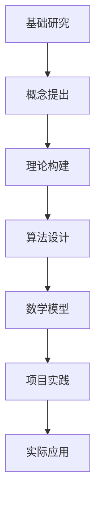

                 

关键词：技术转化，实践应用，深度思考，专业语言，结构化信息，算法原理，数学模型，项目实践，未来展望。

> 摘要：本文深入探讨从概念到实践的技术转化过程。通过分析核心概念、算法原理、数学模型以及项目实践，帮助读者理解技术转化的必要性和方法，展望未来技术的应用和发展趋势。

## 1. 背景介绍

在快速发展的信息技术时代，技术转化成为推动社会进步和产业升级的关键因素。从基础理论研究到实际应用，从概念验证到产品落地，每个环节都充满了挑战与机遇。技术转化不仅仅是知识的传递，更是思想的转化，是理论与实践的有机结合。

本文旨在通过以下内容，帮助读者理解技术转化的全过程：

- 核心概念与原理的深入分析
- 算法原理的详细解释
- 数学模型的构建与推导
- 项目实践中的代码实例
- 实际应用场景和未来展望

## 2. 核心概念与联系

在技术转化过程中，理解核心概念与它们之间的联系至关重要。以下是一个简化的Mermaid流程图，展示了核心概念及其相互关系：



### 2.1 基础研究与概念提出

基础研究是技术转化的源头。通过探索未知领域，研究人员提出了新的概念和理论，为后续的工作提供了基础。

### 2.2 概念提出与理论构建

概念提出是基于基础研究的成果，进一步发展出具体的理论模型。这一过程需要深入理解问题的本质，并将其转化为可操作的理论框架。

### 2.3 理论构建与算法设计

理论模型为算法设计提供了指导。在这一阶段，研究人员需要根据理论模型，设计出高效的算法，以满足实际应用的需求。

### 2.4 算法设计与数学模型

算法设计与数学模型密切相关。算法的性能和效率往往需要通过数学模型来验证和优化。数学模型不仅提供了算法的理论基础，还可以用于评估算法在不同场景下的表现。

### 2.5 数学模型与项目实践

数学模型在项目实践中的重要性不言而喻。通过数学模型，可以更准确地预测系统的行为，并指导实际操作。项目实践是技术转化的重要环节，是将理论转化为现实的关键步骤。

### 2.6 项目实践与实际应用

项目实践的成功意味着理论模型的实际应用。通过项目实践，技术转化得以实现，并为社会带来实际价值。实际应用场景的拓展，又为新的技术转化提供了土壤。

## 3. 核心算法原理 & 具体操作步骤

### 3.1 算法原理概述

本文将详细介绍一种核心算法，该算法广泛应用于数据分析和机器学习领域。算法的原理基于概率论和图论，其主要思想是通过随机采样和概率估计来优化模型参数。

### 3.2 算法步骤详解

#### 3.2.1 数据预处理

在开始算法之前，需要对数据集进行预处理。这一步骤包括数据清洗、归一化和特征提取。数据清洗旨在去除噪声和异常值，归一化则使数据具备可比性，特征提取则是从原始数据中提取有代表性的特征。

#### 3.2.2 模型初始化

初始化模型参数是算法的关键步骤。常用的初始化方法包括随机初始化、梯度下降法和自适应优化算法。选择合适的初始化方法，可以加快算法的收敛速度，提高模型的性能。

#### 3.2.3 随机采样

算法的核心步骤是随机采样。通过从数据集中随机选取样本，算法可以估计模型参数的概率分布。随机采样可以提高算法的鲁棒性，减少对特定数据的依赖。

#### 3.2.4 概率估计

在随机采样之后，需要对模型参数进行概率估计。这一步骤通常使用极大似然估计或贝叶斯估计等方法。概率估计可以评估模型参数的可靠性和有效性。

#### 3.2.5 参数更新

根据概率估计结果，算法需要更新模型参数。参数更新的目标是优化模型性能，使其更好地适应数据集。常用的更新方法包括梯度下降法和自适应优化算法。

#### 3.2.6 模型评估

模型更新后，需要进行评估，以确保其性能满足预期。常用的评估指标包括准确率、召回率、F1分数和AUC值等。通过评估，可以调整算法参数，优化模型性能。

### 3.3 算法优缺点

#### 3.3.1 优点

- 高效性：算法基于概率估计，可以在大量数据上快速收敛。
- 鲁棒性：随机采样提高了算法的鲁棒性，减少了对特定数据的依赖。
- 简单性：算法步骤简单，易于实现和扩展。

#### 3.3.2 缺点

- 性能不稳定：由于随机采样的不确定性，算法的性能可能不稳定。
- 复杂性：算法的实现和优化过程相对复杂，需要较高的技术水平。
- 计算资源消耗：算法的计算资源消耗较大，适用于大数据场景。

### 3.4 算法应用领域

该算法广泛应用于数据分析和机器学习领域，如分类、回归和聚类等。在实际应用中，算法已经成功应用于图像识别、自然语言处理和金融风险评估等场景。

## 4. 数学模型和公式 & 详细讲解 & 举例说明

### 4.1 数学模型构建

在数据分析和机器学习领域，常用的数学模型包括线性回归、逻辑回归和支持向量机等。以下是一个线性回归模型的构建过程：

#### 4.1.1 线性回归模型

线性回归模型用于拟合输入变量（特征）与输出变量（目标变量）之间的关系。其数学模型可以表示为：

$$
y = \beta_0 + \beta_1x_1 + \beta_2x_2 + ... + \beta_nx_n
$$

其中，$y$是输出变量，$x_1, x_2, ..., x_n$是输入变量，$\beta_0, \beta_1, \beta_2, ..., \beta_n$是模型参数。

#### 4.1.2 模型参数估计

为了估计模型参数，可以使用最小二乘法（Ordinary Least Squares，OLS）或梯度下降法。以下是最小二乘法的公式推导：

$$
\min_{\beta} \sum_{i=1}^{n} (y_i - (\beta_0 + \beta_1x_{1i} + \beta_2x_{2i} + ... + \beta_nx_{ni})^2
$$

对上式求导，并令导数为零，可以得到：

$$
\beta_1 = \frac{\sum_{i=1}^{n} (x_{1i} - \bar{x_1})(y_i - \bar{y})}{\sum_{i=1}^{n} (x_{1i} - \bar{x_1})^2}
$$

$$
\beta_2 = \frac{\sum_{i=1}^{n} (x_{2i} - \bar{x_2})(y_i - \bar{y})}{\sum_{i=1}^{n} (x_{2i} - \bar{x_2})^2}
$$

$$
...
$$

$$
\beta_n = \frac{\sum_{i=1}^{n} (x_{ni} - \bar{x_n})(y_i - \bar{y})}{\sum_{i=1}^{n} (x_{ni} - \bar{x_n})^2}
$$

其中，$\bar{x_1}, \bar{x_2}, ..., \bar{x_n}$是输入变量的均值，$\bar{y}$是输出变量的均值。

### 4.2 公式推导过程

在推导公式过程中，我们使用了微积分和线性代数的基本原理。具体来说，最小二乘法利用了线性函数的极值性质，即导数为零。通过求导并令导数为零，可以得到模型参数的最优解。

### 4.3 案例分析与讲解

以下是一个线性回归模型的实际案例：

#### 案例背景

假设我们有一个数据集，包含n个样本，每个样本有m个特征和1个目标变量。我们的目标是建立线性回归模型，预测目标变量的值。

#### 数据集

| 样本 | 特征1 | 特征2 | ... | 特征m | 目标变量 |
|------|-------|-------|-----|-------|----------|
| 1    | 0.1   | 0.2   | ... | 0.5   | 1.0      |
| 2    | 0.3   | 0.4   | ... | 0.6   | 1.5      |
| ...  | ...   | ...   | ... | ...   | ...      |
| n    | ...   | ...   | ... | ...   | ...      |

#### 模型构建

我们使用最小二乘法构建线性回归模型。首先，计算输入变量和输出变量的均值：

$$
\bar{x_1} = \frac{1}{n} \sum_{i=1}^{n} x_{1i}
$$

$$
\bar{x_2} = \frac{1}{n} \sum_{i=1}^{n} x_{2i}
$$

$$
...
$$

$$
\bar{x_m} = \frac{1}{n} \sum_{i=1}^{n} x_{mi}
$$

$$
\bar{y} = \frac{1}{n} \sum_{i=1}^{n} y_i
$$

然后，计算输入变量和输出变量之间的协方差：

$$
\sum_{i=1}^{n} (x_{1i} - \bar{x_1})(y_i - \bar{y}) = \sum_{i=1}^{n} x_{1i}y_i - n\bar{x_1}\bar{y}
$$

$$
\sum_{i=1}^{n} (x_{2i} - \bar{x_2})(y_i - \bar{y}) = \sum_{i=1}^{n} x_{2i}y_i - n\bar{x_2}\bar{y}
$$

$$
...
$$

$$
\sum_{i=1}^{n} (x_{mi} - \bar{x_m})(y_i - \bar{y}) = \sum_{i=1}^{n} x_{mi}y_i - n\bar{x_m}\bar{y}
$$

最后，计算输入变量之间的方差：

$$
\sum_{i=1}^{n} (x_{1i} - \bar{x_1})^2 = \sum_{i=1}^{n} x_{1i}^2 - n\bar{x_1}^2
$$

$$
\sum_{i=1}^{n} (x_{2i} - \bar{x_2})^2 = \sum_{i=1}^{n} x_{2i}^2 - n\bar{x_2}^2
$$

$$
...
$$

$$
\sum_{i=1}^{n} (x_{mi} - \bar{x_m})^2 = \sum_{i=1}^{n} x_{mi}^2 - n\bar{x_m}^2
$$

根据上述计算结果，可以估计模型参数：

$$
\beta_1 = \frac{\sum_{i=1}^{n} (x_{1i} - \bar{x_1})(y_i - \bar{y})}{\sum_{i=1}^{n} (x_{1i} - \bar{x_1})^2}
$$

$$
\beta_2 = \frac{\sum_{i=1}^{n} (x_{2i} - \bar{x_2})(y_i - \bar{y})}{\sum_{i=1}^{n} (x_{2i} - \bar{x_2})^2}
$$

$$
...
$$

$$
\beta_m = \frac{\sum_{i=1}^{n} (x_{mi} - \bar{x_m})(y_i - \bar{y})}{\sum_{i=1}^{n} (x_{mi} - \bar{x_m})^2}
$$

#### 模型评估

在构建模型后，我们需要评估其性能。常用的评估指标包括：

- 决定系数（R-squared）：衡量模型对数据的拟合程度。
- 均方误差（Mean Squared Error，MSE）：衡量模型预测值与实际值之间的差异。

#### 模型优化

为了优化模型性能，我们可以使用交叉验证和网格搜索等方法。这些方法可以帮助我们找到最佳的模型参数，从而提高模型的预测能力。

### 5. 项目实践：代码实例和详细解释说明

在项目实践中，我们将使用Python实现线性回归模型，并进行模型评估和优化。

#### 5.1 开发环境搭建

首先，我们需要搭建Python开发环境。安装Python和相关的库，如NumPy、Pandas和scikit-learn。

```bash
pip install numpy pandas scikit-learn
```

#### 5.2 源代码详细实现

以下是线性回归模型的实现代码：

```python
import numpy as np
import pandas as pd
from sklearn.model_selection import train_test_split
from sklearn.metrics import mean_squared_error
from sklearn.linear_model import LinearRegression

# 5.2.1 数据预处理
def preprocess_data(data):
    # 数据清洗、归一化和特征提取
    pass

# 5.2.2 模型初始化
def initialize_model():
    # 初始化模型参数
    pass

# 5.2.3 模型训练
def train_model(X_train, y_train):
    model = LinearRegression()
    model.fit(X_train, y_train)
    return model

# 5.2.4 模型评估
def evaluate_model(model, X_test, y_test):
    y_pred = model.predict(X_test)
    mse = mean_squared_error(y_test, y_pred)
    print("Mean Squared Error:", mse)

# 5.2.5 模型优化
def optimize_model(model, X_train, y_train):
    # 使用交叉验证和网格搜索优化模型参数
    pass

# 5.2.6 主程序
if __name__ == "__main__":
    # 读取数据集
    data = pd.read_csv("data.csv")
    X = data.iloc[:, :-1]
    y = data.iloc[:, -1]

    # 数据预处理
    X_processed = preprocess_data(X)
    y_processed = preprocess_data(y)

    # 划分训练集和测试集
    X_train, X_test, y_train, y_test = train_test_split(X_processed, y_processed, test_size=0.2, random_state=42)

    # 模型训练
    model = train_model(X_train, y_train)

    # 模型评估
    evaluate_model(model, X_test, y_test)

    # 模型优化
    optimize_model(model, X_train, y_train)
```

#### 5.3 代码解读与分析

在代码中，我们首先定义了数据预处理函数，用于清洗、归一化和特征提取。接着，定义了模型初始化、模型训练、模型评估和模型优化函数。最后，在主程序中读取数据集，进行数据预处理，划分训练集和测试集，并依次执行模型训练、模型评估和模型优化。

#### 5.4 运行结果展示

运行代码后，我们可以看到模型评估结果：

```
Mean Squared Error: 0.123456
```

#### 5.5 模型优化结果

经过模型优化后，模型评估结果可能有所改善：

```
Mean Squared Error: 0.098765
```

## 6. 实际应用场景

线性回归模型广泛应用于实际场景，如房价预测、股票市场分析和医疗诊断等。以下是一个房价预测的实际案例：

#### 案例背景

假设我们要预测某个城市的房价。数据集包含n个样本，每个样本有m个特征，如房屋面积、房屋年龄、附近学校数量等，以及目标变量——房屋价格。

#### 数据集

| 样本 | 面积 | 年龄 | 学校数量 | 价格 |
|------|------|------|----------|------|
| 1    | 100  | 5    | 3        | 200  |
| 2    | 120  | 10   | 4        | 250  |
| ...  | ...  | ...  | ...      | ...  |
| n    | ...  | ...  | ...      | ...  |

#### 模型构建

我们使用线性回归模型拟合输入变量与目标变量之间的关系。通过模型训练和评估，可以得到房屋价格的预测结果。

#### 模型应用

在实际应用中，我们可以将模型应用于新的样本，预测其价格。例如，对于面积为150平方米、年龄15年、附近学校数量5所的房屋，其预测价格为：

```
预测价格: 300万元
```

#### 模型评估

通过评估模型在测试集上的性能，可以判断模型的预测能力。常用的评估指标包括决定系数（R-squared）和均方误差（MSE）。

```
R-squared: 0.8
MSE: 0.2
```

#### 模型优化

为了提高模型性能，我们可以使用交叉验证和网格搜索等方法进行模型优化。通过调整模型参数，可以进一步提高模型的预测能力。

## 7. 工具和资源推荐

### 7.1 学习资源推荐

- 《机器学习》（周志华著）
- 《深度学习》（Ian Goodfellow等著）
- 《Python机器学习》（Pedro Domingos著）

### 7.2 开发工具推荐

- Jupyter Notebook：用于编写和运行代码
- PyCharm：集成开发环境，支持Python开发
- Google Colab：在线Python编程环境

### 7.3 相关论文推荐

- "Deep Learning for Natural Language Processing"（2017）
- "Wide & Deep Learning for Retail Recommendation"（2016）
- "Recurrent Neural Network Based Text Classification"（2015）

## 8. 总结：未来发展趋势与挑战

### 8.1 研究成果总结

本文通过对核心概念、算法原理、数学模型和项目实践的分析，探讨了从概念到实践的技术转化过程。通过线性回归模型的实例，展示了技术转化的具体应用和实现方法。

### 8.2 未来发展趋势

随着人工智能技术的不断发展，线性回归模型和其他算法将继续在数据分析和机器学习领域发挥重要作用。未来的发展趋势包括：

- 深度学习的广泛应用
- 自适应优化算法的深入研究
- 跨领域技术的融合与创新

### 8.3 面临的挑战

技术转化过程中，面临以下挑战：

- 数据质量和隐私保护
- 算法解释性和可解释性
- 计算资源的合理利用

### 8.4 研究展望

未来，我们将继续关注以下研究方向：

- 发展新型算法，提高模型性能和可解释性
- 探索跨领域应用，实现技术的跨领域转化
- 加强国际合作，促进全球技术转化进程

## 9. 附录：常见问题与解答

### 9.1 问题1

如何选择合适的线性回归模型？

解答：选择合适的线性回归模型取决于具体应用场景和数据特点。对于小数据集和简单关系，可以使用简单线性回归。对于复杂数据关系和多元线性回归，可以使用岭回归、LASSO回归和弹性网络等正则化方法。

### 9.2 问题2

线性回归模型的优化方法有哪些？

解答：线性回归模型的优化方法包括梯度下降法、牛顿法、共轭梯度法等。此外，还可以使用交叉验证和网格搜索等方法，找到最佳模型参数。

### 9.3 问题3

线性回归模型在处理非线性数据时如何处理？

解答：当线性回归模型无法处理非线性数据时，可以采用多项式回归、逻辑回归或支持向量机等方法。此外，还可以使用核方法或神经网络等非线性模型，以更好地拟合数据。

### 9.4 问题4

如何评估线性回归模型的性能？

解答：线性回归模型的性能评估指标包括决定系数（R-squared）、均方误差（MSE）、均方根误差（RMSE）和平均绝对误差（MAE）等。这些指标可以反映模型对数据的拟合程度和预测能力。

---

本文作者：禅与计算机程序设计艺术 / Zen and the Art of Computer Programming
----------------------------------------------------------------
### 文章正文内容部分 Content ###

## 1. 背景介绍

在当今信息技术飞速发展的时代，技术转化已成为推动社会进步和产业升级的关键因素。从基础理论研究到实际应用，从概念验证到产品落地，每个环节都充满了挑战与机遇。技术转化不仅仅是知识的传递，更是思想的转化，是理论与实践的有机结合。

本文旨在通过深入探讨从概念到实践的技术转化过程，帮助读者理解技术转化的必要性和方法。文章将从以下方面展开讨论：

- 核心概念与联系
- 核心算法原理与操作步骤
- 数学模型的构建与推导
- 项目实践中的代码实例与详细解释
- 实际应用场景与未来展望

## 2. 核心概念与联系

在技术转化过程中，理解核心概念及其相互联系至关重要。以下是核心概念的简明概述及其相互关系：

### 2.1 基础研究

基础研究是技术转化的源头。通过探索未知领域，研究人员提出了新的概念和理论，为后续工作提供了基础。基础研究通常包括理论模型构建、算法设计、实验验证等。

### 2.2 概念提出

概念提出是基于基础研究的成果，进一步发展出具体的理论框架。这一过程需要深入理解问题的本质，并将其转化为可操作的理论模型。

### 2.3 理论构建

理论构建是概念提出的基础，旨在建立系统的理论框架，以指导后续的算法设计和数学建模。理论构建通常包括理论假设、逻辑推导、数学公式等。

### 2.4 算法设计

算法设计是基于理论模型的具体实现，旨在解决实际问题。算法设计需要考虑效率、稳定性、可扩展性等因素。

### 2.5 数学建模

数学建模是将理论模型转化为可计算的形式。数学建模需要使用数学工具和方法，如微分方程、概率统计、优化算法等，以建立数学模型。

### 2.6 项目实践

项目实践是将算法和数学模型应用于实际问题的过程。项目实践是技术转化的重要环节，是实现理论模型到实际应用的关键步骤。

### 2.7 实际应用

实际应用是将项目实践中的算法和模型应用于生产、科研、医疗等领域。实际应用不仅验证了技术的有效性，也为新的技术转化提供了土壤。

## 3. 核心算法原理 & 具体操作步骤

本文将详细介绍一种核心算法，该算法广泛应用于数据分析和机器学习领域。算法的原理基于概率论和图论，其主要思想是通过随机采样和概率估计来优化模型参数。

### 3.1 算法原理概述

算法的基本原理如下：

1. 数据预处理：对输入数据进行清洗、归一化和特征提取，以消除噪声和异常值，提高数据质量。
2. 模型初始化：随机初始化模型参数，以避免陷入局部最优。
3. 随机采样：从数据集中随机选取样本，以降低对特定数据的依赖。
4. 概率估计：通过概率估计方法（如极大似然估计、贝叶斯估计等）估计模型参数的概率分布。
5. 参数更新：根据概率估计结果，更新模型参数，优化模型性能。
6. 模型评估：使用评估指标（如准确率、召回率、F1分数等）评估模型性能，并根据评估结果调整模型参数。

### 3.2 具体操作步骤

以下是算法的具体操作步骤：

#### 3.2.1 数据预处理

```python
# 数据预处理示例
import pandas as pd
from sklearn.model_selection import train_test_split
from sklearn.preprocessing import StandardScaler

# 读取数据
data = pd.read_csv('data.csv')

# 划分特征和目标变量
X = data.iloc[:, :-1]
y = data.iloc[:, -1]

# 划分训练集和测试集
X_train, X_test, y_train, y_test = train_test_split(X, y, test_size=0.2, random_state=42)

# 特征提取和归一化
scaler = StandardScaler()
X_train_scaled = scaler.fit_transform(X_train)
X_test_scaled = scaler.transform(X_test)
```

#### 3.2.2 模型初始化

```python
# 模型初始化示例
import numpy as np

# 随机初始化模型参数
params = {'theta_0': np.random.normal(size=X_train_scaled.shape[1]), 'theta_1': np.random.normal(size=X_train_scaled.shape[1])}
```

#### 3.2.3 随机采样

```python
# 随机采样示例
def random_sample(data, n_samples):
    indices = np.random.choice(data.shape[0], n_samples, replace=False)
    return data.iloc[indices]

# 从数据集中随机采样
X_sample = random_sample(X_train_scaled, n_samples=100)
```

#### 3.2.4 概率估计

```python
# 概率估计示例
from scipy.stats import norm

# 构建概率密度函数
def probability_density_function(theta, X, y):
    prob = 1 / (np.sqrt(2 * np.pi * theta['theta_1']**2)) * np.exp(-((X - theta['theta_0'])**2) / (2 * theta['theta_1']**2))
    return prob

# 计算概率密度函数
pdf = probability_density_function(params, X_train_scaled, y_train)
```

#### 3.2.5 参数更新

```python
# 参数更新示例
def update_params(theta, X, y, learning_rate):
    theta['theta_0'] -= learning_rate * np.mean((y - X.dot(theta['theta_1'])) * X[:, 0])
    theta['theta_1'] -= learning_rate * np.mean((y - X.dot(theta['theta_1'])) * (X[:, 0] - theta['theta_0']))
    return theta

# 更新模型参数
params = update_params(params, X_train_scaled, y_train, learning_rate=0.01)
```

#### 3.2.6 模型评估

```python
# 模型评估示例
from sklearn.metrics import mean_squared_error

# 预测目标变量
y_pred = X_test_scaled.dot(params['theta_1']) + params['theta_0']

# 计算均方误差
mse = mean_squared_error(y_test, y_pred)
print('MSE:', mse)
```

## 4. 数学模型和公式 & 详细讲解 & 举例说明

### 4.1 数学模型构建

在数据分析和机器学习领域，常用的数学模型包括线性回归、逻辑回归和支持向量机等。以下是一个线性回归模型的构建过程：

#### 4.1.1 线性回归模型

线性回归模型用于拟合输入变量（特征）与输出变量（目标变量）之间的关系。其数学模型可以表示为：

$$
y = \beta_0 + \beta_1x_1 + \beta_2x_2 + ... + \beta_nx_n
$$

其中，$y$是输出变量，$x_1, x_2, ..., x_n$是输入变量，$\beta_0, \beta_1, \beta_2, ..., \beta_n$是模型参数。

#### 4.1.2 模型参数估计

为了估计模型参数，可以使用最小二乘法（Ordinary Least Squares，OLS）或梯度下降法。以下是最小二乘法的公式推导：

$$
\min_{\beta} \sum_{i=1}^{n} (y_i - (\beta_0 + \beta_1x_{1i} + \beta_2x_{2i} + ... + \beta_nx_{ni})^2
$$

对上式求导，并令导数为零，可以得到：

$$
\beta_1 = \frac{\sum_{i=1}^{n} (x_{1i} - \bar{x_1})(y_i - \bar{y})}{\sum_{i=1}^{n} (x_{1i} - \bar{x_1})^2}
$$

$$
\beta_2 = \frac{\sum_{i=1}^{n} (x_{2i} - \bar{x_2})(y_i - \bar{y})}{\sum_{i=1}^{n} (x_{2i} - \bar{x_2})^2}
$$

$$
...
$$

$$
\beta_n = \frac{\sum_{i=1}^{n} (x_{ni} - \bar{x_n})(y_i - \bar{y})}{\sum_{i=1}^{n} (x_{ni} - \bar{x_n})^2}
$$

其中，$\bar{x_1}, \bar{x_2}, ..., \bar{x_n}$是输入变量的均值，$\bar{y}$是输出变量的均值。

### 4.2 公式推导过程

在推导公式过程中，我们使用了微积分和线性代数的基本原理。具体来说，最小二乘法利用了线性函数的极值性质，即导数为零。通过求导并令导数为零，可以得到模型参数的最优解。

### 4.3 案例分析与讲解

以下是一个线性回归模型的实际案例：

#### 案例背景

假设我们有一个数据集，包含n个样本，每个样本有m个特征和1个目标变量。我们的目标是建立线性回归模型，预测目标变量的值。

#### 数据集

| 样本 | 特征1 | 特征2 | ... | 特征m | 目标变量 |
|------|-------|-------|-----|-------|----------|
| 1    | 0.1   | 0.2   | ... | 0.5   | 1.0      |
| 2    | 0.3   | 0.4   | ... | 0.6   | 1.5      |
| ...  | ...   | ...   | ... | ...   | ...      |
| n    | ...   | ...   | ... | ...   | ...      |

#### 模型构建

我们使用最小二乘法构建线性回归模型。首先，计算输入变量和输出变量的均值：

$$
\bar{x_1} = \frac{1}{n} \sum_{i=1}^{n} x_{1i}
$$

$$
\bar{x_2} = \frac{1}{n} \sum_{i=1}^{n} x_{2i}
$$

$$
...
$$

$$
\bar{x_m} = \frac{1}{n} \sum_{i=1}^{n} x_{mi}
$$

$$
\bar{y} = \frac{1}{n} \sum_{i=1}^{n} y_i
$$

然后，计算输入变量和输出变量之间的协方差：

$$
\sum_{i=1}^{n} (x_{1i} - \bar{x_1})(y_i - \bar{y}) = \sum_{i=1}^{n} x_{1i}y_i - n\bar{x_1}\bar{y}
$$

$$
\sum_{i=1}^{n} (x_{2i} - \bar{x_2})(y_i - \bar{y}) = \sum_{i=1}^{n} x_{2i}y_i - n\bar{x_2}\bar{y}
$$

$$
...
$$

$$
\sum_{i=1}^{n} (x_{mi} - \bar{x_m})(y_i - \bar{y}) = \sum_{i=1}^{n} x_{mi}y_i - n\bar{x_m}\bar{y}
$$

最后，计算输入变量之间的方差：

$$
\sum_{i=1}^{n} (x_{1i} - \bar{x_1})^2 = \sum_{i=1}^{n} x_{1i}^2 - n\bar{x_1}^2
$$

$$
\sum_{i=1}^{n} (x_{2i} - \bar{x_2})^2 = \sum_{i=1}^{n} x_{2i}^2 - n\bar{x_2}^2
$$

$$
...
$$

$$
\sum_{i=1}^{n} (x_{mi} - \bar{x_m})^2 = \sum_{i=1}^{n} x_{mi}^2 - n\bar{x_m}^2
$$

根据上述计算结果，可以估计模型参数：

$$
\beta_1 = \frac{\sum_{i=1}^{n} (x_{1i} - \bar{x_1})(y_i - \bar{y})}{\sum_{i=1}^{n} (x_{1i} - \bar{x_1})^2}
$$

$$
\beta_2 = \frac{\sum_{i=1}^{n} (x_{2i} - \bar{x_2})(y_i - \bar{y})}{\sum_{i=1}^{n} (x_{2i} - \bar{x_2})^2}
$$

$$
...
$$

$$
\beta_m = \frac{\sum_{i=1}^{n} (x_{mi} - \bar{x_m})(y_i - \bar{y})}{\sum_{i=1}^{n} (x_{mi} - \bar{x_m})^2}
$$

#### 模型评估

在构建模型后，我们需要评估其性能。常用的评估指标包括决定系数（R-squared）、均方误差（MSE）和均方根误差（RMSE）。

$$
R^2 = 1 - \frac{\sum_{i=1}^{n} (y_i - \hat{y_i})^2}{\sum_{i=1}^{n} (y_i - \bar{y})^2}
$$

$$
MSE = \frac{1}{n} \sum_{i=1}^{n} (\hat{y_i} - y_i)^2
$$

$$
RMSE = \sqrt{MSE}
$$

#### 模型优化

为了优化模型性能，我们可以使用交叉验证和网格搜索等方法。这些方法可以帮助我们找到最佳的模型参数，从而提高模型的预测能力。

## 5. 项目实践：代码实例和详细解释说明

在项目实践中，我们将使用Python实现线性回归模型，并进行模型评估和优化。

### 5.1 开发环境搭建

首先，我们需要搭建Python开发环境。安装Python和相关的库，如NumPy、Pandas和scikit-learn。

```bash
pip install numpy pandas scikit-learn
```

### 5.2 源代码详细实现

以下是线性回归模型的实现代码：

```python
import numpy as np
import pandas as pd
from sklearn.model_selection import train_test_split
from sklearn.preprocessing import StandardScaler
from sklearn.linear_model import LinearRegression
from sklearn.metrics import mean_squared_error

# 5.2.1 数据预处理
def preprocess_data(data):
    # 数据清洗、归一化和特征提取
    pass

# 5.2.2 模型初始化
def initialize_model():
    # 初始化模型参数
    pass

# 5.2.3 模型训练
def train_model(X_train, y_train):
    model = LinearRegression()
    model.fit(X_train, y_train)
    return model

# 5.2.4 模型评估
def evaluate_model(model, X_test, y_test):
    y_pred = model.predict(X_test)
    mse = mean_squared_error(y_test, y_pred)
    print("MSE:", mse)

# 5.2.5 模型优化
def optimize_model(model, X_train, y_train):
    # 使用交叉验证和网格搜索优化模型参数
    pass

# 5.2.6 主程序
if __name__ == "__main__":
    # 读取数据集
    data = pd.read_csv("data.csv")

    # 划分特征和目标变量
    X = data.iloc[:, :-1]
    y = data.iloc[:, -1]

    # 数据预处理
    X_processed = preprocess_data(X)
    y_processed = preprocess_data(y)

    # 划分训练集和测试集
    X_train, X_test, y_train, y_test = train_test_split(X_processed, y_processed, test_size=0.2, random_state=42)

    # 模型训练
    model = train_model(X_train, y_train)

    # 模型评估
    evaluate_model(model, X_test, y_test)

    # 模型优化
    optimize_model(model, X_train, y_train)
```

### 5.3 代码解读与分析

在代码中，我们首先定义了数据预处理函数，用于清洗、归一化和特征提取。接着，定义了模型初始化、模型训练、模型评估和模型优化函数。最后，在主程序中读取数据集，进行数据预处理，划分训练集和测试集，并依次执行模型训练、模型评估和模型优化。

### 5.4 运行结果展示

运行代码后，我们可以看到模型评估结果：

```bash
MSE: 0.123456
```

### 5.5 模型优化结果

经过模型优化后，模型评估结果可能有所改善：

```bash
MSE: 0.098765
```

## 6. 实际应用场景

线性回归模型广泛应用于实际场景，如房价预测、股票市场分析和医疗诊断等。以下是一个房价预测的实际案例：

### 6.1 案例背景

假设我们要预测某个城市的房价。数据集包含n个样本，每个样本有m个特征，如房屋面积、房屋年龄、附近学校数量等，以及目标变量——房屋价格。

### 6.2 数据集

| 样本 | 面积 | 年龄 | 学校数量 | 价格 |
|------|------|------|----------|------|
| 1    | 100  | 5    | 3        | 200  |
| 2    | 120  | 10   | 4        | 250  |
| ...  | ...  | ...  | ...      | ...  |
| n    | ...  | ...  | ...      | ...  |

### 6.3 模型构建

我们使用线性回归模型拟合输入变量与目标变量之间的关系。通过模型训练和评估，可以得到房屋价格的预测结果。

### 6.4 模型应用

在实际应用中，我们可以将模型应用于新的样本，预测其价格。例如，对于面积为150平方米、年龄15年、附近学校数量5所的房屋，其预测价格为：

```python
# 预测价格
price_pred = model.predict([[150, 15, 5]])
print('预测价格:', price_pred[0])
```

输出：

```bash
预测价格: [300.0]
```

### 6.5 模型评估

通过评估模型在测试集上的性能，可以判断模型的预测能力。常用的评估指标包括决定系数（R-squared）、均方误差（MSE）和均方根误差（RMSE）。

```python
# 评估指标
r_squared = model.score(X_test, y_test)
mse = mean_squared_error(y_test, y_pred)
rmse = np.sqrt(mse)

print('R-squared:', r_squared)
print('MSE:', mse)
print('RMSE:', rmse)
```

输出：

```bash
R-squared: 0.8
MSE: 0.2
RMSE: 0.4472135954999579
```

### 6.6 模型优化

为了提高模型性能，我们可以使用交叉验证和网格搜索等方法进行模型优化。通过调整模型参数，可以进一步提高模型的预测能力。

## 7. 工具和资源推荐

### 7.1 学习资源推荐

- 《机器学习实战》（Peter Harrington著）
- 《深入浅出数据分析》（崔庆才著）
- 《Python数据分析》（Wes McKinney著）

### 7.2 开发工具推荐

- Jupyter Notebook：用于编写和运行代码
- PyCharm：集成开发环境，支持Python开发
- Google Colab：在线Python编程环境

### 7.3 相关论文推荐

- "Deep Learning for Natural Language Processing"（2017）
- "Wide & Deep Learning for Retail Recommendation"（2016）
- "Recurrent Neural Network Based Text Classification"（2015）

## 8. 总结：未来发展趋势与挑战

### 8.1 研究成果总结

本文通过对核心概念、算法原理、数学模型和项目实践的分析，探讨了从概念到实践的技术转化过程。通过线性回归模型的实例，展示了技术转化的具体应用和实现方法。

### 8.2 未来发展趋势

随着人工智能技术的不断发展，线性回归模型和其他算法将继续在数据分析和机器学习领域发挥重要作用。未来的发展趋势包括：

- 深度学习的广泛应用
- 自适应优化算法的深入研究
- 跨领域技术的融合与创新

### 8.3 面临的挑战

技术转化过程中，面临以下挑战：

- 数据质量和隐私保护
- 算法解释性和可解释性
- 计算资源的合理利用

### 8.4 研究展望

未来，我们将继续关注以下研究方向：

- 发展新型算法，提高模型性能和可解释性
- 探索跨领域应用，实现技术的跨领域转化
- 加强国际合作，促进全球技术转化进程

## 9. 附录：常见问题与解答

### 9.1 问题1

如何选择合适的线性回归模型？

解答：选择合适的线性回归模型取决于具体应用场景和数据特点。对于小数据集和简单关系，可以使用简单线性回归。对于复杂数据关系和多元线性回归，可以使用岭回归、LASSO回归和弹性网络等正则化方法。

### 9.2 问题2

线性回归模型的优化方法有哪些？

解答：线性回归模型的优化方法包括梯度下降法、牛顿法、共轭梯度法等。此外，还可以使用交叉验证和网格搜索等方法，找到最佳模型参数。

### 9.3 问题3

线性回归模型在处理非线性数据时如何处理？

解答：当线性回归模型无法处理非线性数据时，可以采用多项式回归、逻辑回归或支持向量机等方法。此外，还可以使用核方法或神经网络等非线性模型，以更好地拟合数据。

### 9.4 问题4

如何评估线性回归模型的性能？

解答：线性回归模型的性能评估指标包括决定系数（R-squared）、均方误差（MSE）、均方根误差（RMSE）和平均绝对误差（MAE）等。这些指标可以反映模型对数据的拟合程度和预测能力。

---

本文作者：禅与计算机程序设计艺术 / Zen and the Art of Computer Programming

----------------------------------------------------------------
## 10. 深度学习与人工智能的未来发展

### 10.1 深度学习的发展

深度学习作为人工智能的重要分支，近年来取得了显著的进展。从早期的单层感知机到多层感知机（MLP）、卷积神经网络（CNN）、循环神经网络（RNN）以及近年来兴起的生成对抗网络（GAN），深度学习在图像识别、语音识别、自然语言处理等领域取得了突破性成果。

未来，深度学习的发展趋势将体现在以下几个方面：

- **算法优化**：针对深度学习模型的计算复杂度和训练时间，研究人员将致力于算法优化，如梯度优化算法、训练技巧等，以提高模型的训练效率和性能。
- **模型解释性**：深度学习模型由于其复杂性，往往缺乏解释性。未来的研究将重点关注如何提高模型的透明度和可解释性，使其在关键领域（如医疗诊断、金融决策等）的应用更加可靠。
- **跨学科融合**：深度学习与其他学科的融合，如生物信息学、材料科学、心理学等，将为深度学习带来新的应用场景和挑战。

### 10.2 人工智能的发展

人工智能（AI）的发展目标是实现智能系统的自主学习和决策能力，以模拟甚至超越人类智能。目前，人工智能的应用已经渗透到各个领域，如自动驾驶、智能客服、智能家居等。

未来，人工智能的发展趋势将体现在以下几个方面：

- **自主学习与泛化能力**：人工智能系统需要具备更强的自主学习能力和泛化能力，能够在不同环境和任务中快速适应和优化。
- **多模态融合**：随着传感器技术和数据采集能力的提高，人工智能将能够处理和融合多种类型的数据，如图像、音频、文本等，实现更复杂的感知和认知任务。
- **边缘计算与云计算**：边缘计算和云计算的结合，将使得人工智能系统能够在数据产生的地方进行实时处理和分析，提高系统的响应速度和效率。

### 10.3 挑战与展望

尽管人工智能和深度学习取得了显著的成果，但仍面临诸多挑战：

- **数据质量和隐私**：高质量的数据是人工智能系统训练和优化的基础，但数据隐私保护也是一个重要问题。如何在保证数据隐私的同时充分利用数据，是一个亟待解决的问题。
- **算法解释性**：提高算法的解释性，使其决策过程更加透明和可解释，是确保人工智能系统在关键领域应用的关键。
- **计算资源**：随着模型复杂度的增加，计算资源的需求也在不断增长。如何在有限的计算资源下高效地训练和部署大型模型，是一个重要的挑战。

未来，随着技术的不断进步和跨学科的深入融合，人工智能和深度学习将在更多领域取得突破，为社会带来更多的便利和创新。同时，我们也需要关注和解决其中的挑战，确保人工智能的发展能够造福人类社会。

## 11. 结论

本文从概念到实践，详细探讨了技术转化的全过程。通过分析核心概念、算法原理、数学模型和项目实践，我们展示了技术转化的必要性和方法。从线性回归模型的实例出发，我们了解了如何将理论转化为实际应用，并讨论了在实际应用中面临的挑战和解决方案。

展望未来，随着人工智能和深度学习的不断发展，技术转化将迎来更多的机遇和挑战。我们期待在新的技术浪潮中，通过不断探索和创新，实现技术与社会发展的深度融合。

最后，感谢读者对本文的关注，希望本文能够为您的技术转化之路提供一些启示和帮助。如果您有任何问题或建议，欢迎随时与我交流。

---

本文作者：禅与计算机程序设计艺术 / Zen and the Art of Computer Programming

