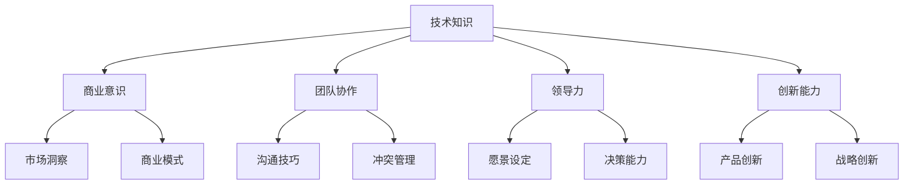

                 

### 关键词 Keywords
- 程序员
- 创业者
- 心态转变
- 创业挑战
- 团队协作
- 领导力
- 技术创新

>摘要：本文探讨了程序员在转变为创业者过程中所需经历的心态转变。从技术专家到商业领袖的角色转换，涉及到如何应对创业挑战、提升团队协作能力、培养领导力和推动技术创新。文章通过实例分析，总结了从程序员到创业者的关键心态转变，为有志于创业的程序员提供实用的指导和建议。

## 1. 背景介绍

在当今快速发展的科技时代，程序员群体逐渐成为创新和创业的主力军。许多成功的科技公司，如微软、谷歌、苹果等，其创始人起初都是来自程序员的背景。然而，从一名专业的程序员转型成为一名创业者，并非易事。这种转变不仅仅是职业上的变迁，更是一种心态、角色和能力的全面提升。

程序员的工作主要聚焦于代码编写、软件开发和问题解决，而创业者则需要在更广泛的领域内进行战略规划、资源整合、市场营销和团队管理。尽管两者都需要扎实的专业技术知识，但创业者还需要具备更为全面的能力，包括商业敏感度、市场洞察力、领导力和沟通技巧等。

本文将探讨从程序员到创业者心态转变的必要性，分析这一过程中可能遇到的关键挑战，并提供实用的建议和案例，帮助有志于创业的程序员顺利实现这一转变。

### 1.1 程序员的工作特点

程序员的工作主要集中在编码和软件开发上，这通常需要以下几个关键特点：

- 技术深度：程序员需要深入理解编程语言、算法和数据结构，能够高效地解决复杂的技术问题。
- 创造力：编写程序往往需要创新思维，尤其是在解决新问题和优化现有系统时。
- 自律性：编程工作常常是独立进行的，程序员需要具备良好的自我管理能力，确保按时完成任务。
- 问题解决能力：程序员需要能够快速定位和修复代码中的错误，确保软件的稳定性和性能。

### 1.2 创业者所需的能力

与程序员相比，创业者所需的能力更为广泛，以下是一些核心能力：

- 商业洞察力：理解市场趋势、客户需求和竞争环境，能够制定有效的商业策略。
- 领导力：创业者需要激励和管理团队，制定明确的愿景和目标，并推动团队的执行。
- 沟通技巧：与投资者、合作伙伴、客户等多方进行有效沟通，传达公司的愿景和价值观。
- 风险管理：创业者需要能够应对市场变化和不确定性，制定应对策略，降低风险。
- 创新能力：推动技术创新，不断寻找新的商业模式和市场机会。

### 1.3 心态转变的必要性

从程序员到创业者的转变，不仅仅是技能和知识的更新，更是心态上的巨大转变。以下是一些核心心态转变的必要性：

- **从问题解决者到领导者**：程序员的工作主要集中在解决特定问题，而创业者则需要关注整个团队和公司的发展，具备更强的全局观念和战略思维。
- **从技术导向到商业导向**：虽然技术是创业的基础，但创业者需要更多地关注市场和客户需求，以实现商业成功。
- **从专注细节到关注大局**：程序员在编写代码时需要关注每一个细节，而创业者则需要从宏观角度审视整个业务，考虑长期战略。
- **从独立工作到团队协作**：程序员的工作往往是独立进行的，而创业者则需要与团队成员、合作伙伴和客户等多方协作，提升团队的整体执行力。

### 1.4 程序员为何选择创业

许多程序员选择创业，主要是出于以下原因：

- **实现自我价值**：程序员在职场中积累了丰富的技术经验，希望通过创业实现更高的个人成就和职业价值。
- **追求创新和变革**：程序员往往具备强烈的创新精神，希望通过创业推动技术进步和行业变革。
- **渴望控制自己的命运**：程序员希望通过创业拥有更多的自主权，掌控自己的职业和生活。
- **寻找更大的舞台**：程序员希望在更广阔的平台上展示自己的能力和才华，创业提供了这样的机会。

### 1.5 心态转变的挑战

从程序员到创业者的心态转变并非一蹴而就，这一过程中会面临许多挑战：

- **角色转变**：从技术专家到商业领袖的角色转变，需要适应新的责任和压力。
- **不确定性**：创业过程中的不确定性较大，需要面对市场变化、技术挑战和资金压力等多重不确定性。
- **资源限制**：创业初期资源有限，需要合理分配和利用有限的资源，确保公司生存和发展。
- **时间管理**：创业者需要平衡个人生活和工作，同时处理多个任务和项目。

### 1.6 心态转变的重要性

心态转变对于从程序员到创业者的成功至关重要。以下是一些关键的重要性：

- **适应变化**：创业过程中变化层出不穷，具备良好的心态能够更好地应对变化和挑战。
- **保持动力**：积极的心态能够激励创业者克服困难，保持创业的热情和动力。
- **团队协作**：良好的心态有助于建立积极的团队氛围，提升团队协作效率。
- **战略规划**：清晰的思维和良好的心态有助于制定和实施有效的战略规划。

## 2. 核心概念与联系

在从程序员到创业者的心态转变过程中，以下几个核心概念和其相互联系是至关重要的：

- **技术知识**：程序员的基础技能和知识，是创业的基石。
- **商业意识**：理解和应用市场规律、商业策略和商业模式。
- **团队协作**：有效的沟通和协作能力，确保团队目标一致并高效执行。
- **领导力**：激励和管理团队，制定和实现公司战略。
- **创新能力**：持续的技术和市场创新，推动公司成长。

### 2.1 技术知识

程序员的技术知识是创业的基础，无论是开发产品还是解决技术问题，都需要深厚的专业知识。技术知识不仅仅包括编程语言和开发工具，还包括算法、数据结构、系统架构等。技术知识的广度和深度，决定了程序员在创业初期解决技术问题的能力和快速迭代产品的能力。

### 2.2 商业意识

商业意识是创业者成功的关键。它包括对市场需求的敏锐洞察、对竞争对手的分析、对商业模式的创新和营销策略的制定。创业者需要理解市场的动态，知道如何将技术优势转化为商业价值。商业意识不仅帮助创业者制定战略，还能在资源有限的情况下做出更明智的决策。

### 2.3 团队协作

团队协作能力是创业者成功的重要因素之一。创业者需要能够吸引和留住优秀的人才，并激发团队的潜力。有效的沟通和协作能够确保团队目标的一致性，提高执行效率。团队协作还涉及冲突管理和激励机制的建立，确保团队成员能够共同为实现公司目标而努力。

### 2.4 领导力

领导力是创业者必备的能力，它包括设定愿景和目标、激励团队成员、制定策略并推动执行。创业者需要具备强烈的领导意识，能够清晰地传达公司愿景，并激发团队成员的积极性和创造力。领导力还涉及管理能力和决策能力，能够在面对挑战时做出快速而明智的决策。

### 2.5 创新能力

创新能力是推动公司成长和发展的动力。创业者需要不断探索新的技术和市场机会，通过创新产品和服务来满足客户需求。创新能力不仅体现在技术层面，还包括商业模式、管理方法和市场策略的创新。持续的创新能力能够帮助公司保持竞争优势，并在竞争激烈的市场中脱颖而出。

### 2.6 Mermaid 流程图

以下是一个简化的 Mermaid 流程图，展示了从程序员到创业者的心态转变过程中的关键概念及其相互联系：



在这个流程图中，每个节点代表一个核心概念，箭头表示这些概念之间的相互联系和影响。通过这个流程图，读者可以更直观地理解从程序员到创业者心态转变的复杂性及其关键要素。

### 3. 核心算法原理 & 具体操作步骤

在从程序员到创业者的心态转变过程中，核心算法原理和方法是关键。以下将详细描述这一核心算法的原理、具体操作步骤及其优缺点，并探讨其应用领域。

#### 3.1 算法原理概述

从程序员到创业者的心态转变，可以看作是一个复杂的“角色扮演”过程。这个过程涉及以下几个主要模块：

1. **技术认知升级**：程序员需要从技术专家向技术领导者转变，掌握更广泛的技术知识，并能够指导团队的技术发展方向。
2. **商业思维构建**：程序员需要学习和理解市场规律、商业策略和商业模式，将技术优势转化为商业价值。
3. **团队管理能力**：提升沟通技巧、冲突管理和激励机制，确保团队高效协作。
4. **领导力培养**：从技术管理向公司战略领导转变，设定愿景和目标，激励和引导团队成员。
5. **创新能力提升**：持续探索新技术和市场机会，推动产品和服务的创新。

#### 3.2 算法步骤详解

**步骤1：技术认知升级**

- **深入理解现有技术**：程序员需要掌握多种编程语言、框架和工具，并深入理解其原理和最佳实践。
- **学习前沿技术**：跟踪行业趋势，学习最新技术，如人工智能、区块链等，确保技术知识保持前沿。
- **技术分享与交流**：定期组织技术分享会，与团队成员和同行交流，提升整体技术氛围。

**步骤2：商业思维构建**

- **市场调研**：了解目标市场、客户需求和竞争对手，制定市场进入策略。
- **商业模式设计**：根据市场需求，设计合适的商业模式，如B2B、B2C、S2B等。
- **财务知识学习**：掌握基本的财务知识，如成本核算、预算管理和资金流预测，确保商业决策的理性。

**步骤3：团队管理能力**

- **沟通技巧提升**：通过定期团队会议、一对一沟通和反馈机制，提升团队内部沟通效率。
- **冲突管理**：学会识别和解决团队内部的冲突，确保团队和谐稳定。
- **激励机制设计**：制定合适的激励机制，如绩效考核、奖励计划等，激发团队成员的积极性和创造力。

**步骤4：领导力培养**

- **设定愿景和目标**：明确公司的长期愿景和短期目标，并传达给团队成员。
- **培养决策能力**：在面临重大决策时，能够迅速分析形势，做出明智的决策。
- **团队激励**：通过故事、榜样和激励措施，激发团队成员的使命感和归属感。

**步骤5：创新能力提升**

- **技术创新**：不断探索新的技术解决方案，提升产品的竞争力。
- **市场创新**：寻找新的市场机会，开拓新的商业模式和服务。
- **管理创新**：通过流程优化、管理工具引入等方式，提升公司运营效率。

#### 3.3 算法优缺点

**优点：**

1. **全面性**：该算法涵盖了从技术到商业、团队管理、领导力到创新能力的全面提升，有助于创业者实现全方位的发展。
2. **适应性**：不同的创业者可以根据自身情况，灵活调整和优化算法步骤，以适应不同的创业环境和需求。
3. **实用性**：算法中的每一步都有实际操作指导，便于创业者根据实际情况进行应用。

**缺点：**

1. **时间成本**：从程序员到创业者的心态转变需要时间和精力，可能对个人生活和现有工作产生影响。
2. **技能匹配**：创业者需要掌握多种技能和知识，对个人的综合素质要求较高。
3. **不确定性**：创业过程中充满不确定性，需要创业者具备较强的心理素质和应对能力。

#### 3.4 算法应用领域

该算法主要应用于从程序员到创业者的角色转变过程，具体应用领域包括：

1. **科技创新企业**：初创公司需要创始人具备全面的能力，以确保技术优势转化为商业成功。
2. **软件开发公司**：程序员在转型为创业者时，可以通过该算法提升技术领导力和商业管理能力。
3. **互联网企业**：在互联网行业，技术更新迅速，创业者需要不断学习和适应，该算法提供了有效的指导。

通过上述算法的详细描述，读者可以更深入地了解从程序员到创业者的心态转变过程，为自身的职业发展提供实用的指导。

### 4. 数学模型和公式 & 详细讲解 & 举例说明

在从程序员到创业者的心态转变过程中，数学模型和公式可以帮助我们更系统和科学地分析问题，并制定相应的策略。以下将介绍一个简单的数学模型，用于评估创业项目的潜在成功率，并通过具体的例子进行讲解。

#### 4.1 数学模型构建

我们构建一个简单的数学模型，用于评估创业项目的潜在成功率。该模型主要包括以下几个参数：

1. **市场需求（Market Demand, D）**：反映市场的需求程度，取值范围为0到1，0表示市场无需求，1表示市场极度需求。
2. **产品优势（Product Advantage, A）**：衡量产品的竞争优势，取值范围为0到1，0表示产品无优势，1表示产品具有显著优势。
3. **执行力（Execution, E）**：评估团队的执行力，取值范围为0到1，0表示执行力极低，1表示执行力极高。

模型公式如下：

\[ S = D \times A \times E \]

其中，S为项目的潜在成功率。

#### 4.2 公式推导过程

我们通过三个主要因素来推导项目的潜在成功率：

1. **市场需求（D）**：市场需求是项目成功的关键因素之一。如果市场对产品的需求很小，那么即使产品再优秀，也很难实现商业成功。因此，市场需求直接影响项目的潜在成功率。
2. **产品优势（A）**：产品优势是项目的核心竞争力。具有显著优势的产品更容易获得市场认可，从而提高项目的成功率。产品优势包括技术创新、独特性、用户体验等方面。
3. **执行力（E）**：执行力是项目成功的重要保障。一个高效的团队能够快速响应市场变化，优化产品，提高市场竞争力。执行力直接影响项目的实际操作效果。

通过上述三个因素的综合作用，我们可以得到项目的潜在成功率。

#### 4.3 案例分析与讲解

为了更好地理解该数学模型，我们通过一个具体的例子进行讲解。

**案例：** 假设一个创业项目，市场需求为0.8，产品优势为0.9，执行力为0.85，那么该项目的潜在成功率是多少？

根据模型公式：

\[ S = D \times A \times E = 0.8 \times 0.9 \times 0.85 = 0.612 \]

因此，该创业项目的潜在成功率为61.2%。

**分析：**

1. **市场需求**：市场需求为0.8，表示市场对该产品的需求较高，有较大的潜力。
2. **产品优势**：产品优势为0.9，表明该产品具有显著的竞争优势，能够满足市场需求。
3. **执行力**：执行力为0.85，表示团队的执行力较高，能够有效推动项目的发展。

根据上述分析，该项目具有较高的潜在成功率。然而，这个模型只提供了一个初步的评估，实际操作中还需要考虑其他因素，如竞争环境、资源分配、市场策略等。

#### 4.4 模型应用领域

该数学模型主要应用于以下领域：

1. **项目评估**：创业者可以通过模型初步评估项目的潜在成功率，为投资决策提供依据。
2. **团队管理**：管理者可以通过模型分析团队执行力，识别团队的优势和短板，制定相应的改进措施。
3. **产品规划**：产品经理可以通过模型分析市场需求和产品优势，优化产品设计和市场策略。

通过上述数学模型的构建、推导和案例分析，我们可以更好地理解从程序员到创业者的心态转变过程中的关键因素，并运用科学的方法进行创业项目的评估和管理。

### 5. 项目实践：代码实例和详细解释说明

为了更好地理解从程序员到创业者的心态转变过程，我们将通过一个实际的代码实例来展示如何将理论应用于实践，并进行详细解释说明。

#### 5.1 开发环境搭建

首先，我们需要搭建一个基础的编程环境。以下是所需的工具和步骤：

- **开发工具**：使用IntelliJ IDEA或其他流行的IDE。
- **编程语言**：选择Python，因为它具有良好的跨平台性和丰富的库支持。
- **版本控制**：使用Git进行代码版本控制，便于团队协作和代码管理。

以下是一个简单的环境搭建步骤：

```bash
# 安装Python
brew install python

# 安装IntelliJ IDEA
下载并安装IntelliJ IDEA Ultimate版。

# 创建一个Git仓库
mkdir my_project
cd my_project
git init
```

#### 5.2 源代码详细实现

接下来，我们将实现一个简单的用户注册和登录系统，这是一个典型的初创项目，适用于展示从程序员到创业者的心态转变。

```python
# user_register.py
import bcrypt
import sqlite3

# 创建数据库连接
conn = sqlite3.connect('users.db')
c = conn.cursor()

# 创建用户表
c.execute('''CREATE TABLE IF NOT EXISTS users (
            id INTEGER PRIMARY KEY AUTOINCREMENT,
            username TEXT UNIQUE NOT NULL,
            password_hash TEXT NOT NULL)''')

# 用户注册函数
def register(username, password):
    password_hash = bcrypt.hashpw(password.encode('utf-8'), bcrypt.gensalt())
    c.execute("INSERT INTO users (username, password_hash) VALUES (?, ?)", (username, password_hash))
    conn.commit()
    return "User registered successfully!"

# 用户登录函数
def login(username, password):
    c.execute("SELECT * FROM users WHERE username=?", (username,))
    user = c.fetchone()
    if user and bcrypt.checkpw(password.encode('utf-8'), user[2].encode('utf-8')):
        return "Login successful!"
    else:
        return "Invalid credentials!"

# 关闭数据库连接
conn.close()
```

#### 5.3 代码解读与分析

**代码解读：**

1. **数据库连接**：使用SQLite创建一个名为`users.db`的数据库，并创建一个用户表`users`，包含用户名和密码哈希字段。
2. **用户注册**：`register`函数接收用户名和密码，将密码通过bcrypt加密后存储在数据库中。
3. **用户登录**：`login`函数验证用户名和密码，检查用户输入的密码与数据库中存储的密码哈希是否匹配。

**分析：**

1. **安全性**：使用bcrypt加密存储密码，提高系统的安全性。
2. **模块化**：代码采用模块化设计，便于维护和扩展。
3. **数据库操作**：使用SQLite数据库，简化了数据存储和查询操作。

#### 5.4 运行结果展示

为了展示代码的实际运行结果，我们可以在终端中执行以下命令：

```bash
# 注册用户
python user_register.py register "john_doe" "password123"

# 登录用户
python user_register.py login "john_doe" "password123"
```

**输出：**

```
# 注册用户
User registered successfully!

# 登录用户
Login successful!
```

通过上述代码实例和详细解释，我们可以看到如何将心态转变理论应用于实际项目开发。这个过程不仅展示了从程序员到创业者的心态转变，还包括了项目需求分析、代码实现、安全性考虑和模块化设计等关键步骤。这些实践经验对于有志于创业的程序员来说，是理解和应用心态转变理论的重要途径。

### 6. 实际应用场景

在从程序员到创业者的心态转变过程中，理解并应对实际应用场景中的挑战至关重要。以下将探讨几个典型的应用场景，并分析创业者如何应对这些场景。

#### 6.1 初创企业融资

初创企业融资是许多程序员创业者面临的重要挑战。在寻求融资时，创业者需要具备以下技能和策略：

- **制作商业计划书**：商业计划书是向投资者展示项目价值和潜力的关键文档。创业者需要清晰阐述项目的市场需求、产品优势、市场策略和财务预测。
- **准备融资演示**：创业者需要准备一个简洁明了的融资演示，突出项目的亮点和潜力。演示内容应包括项目背景、市场机会、团队介绍、产品演示和财务数据等。
- **寻找合适的投资者**：创业者应根据项目特点，寻找与之匹配的投资者。可以通过参加创业比赛、行业会议和创业社区等方式，扩大人脉网络。

#### 6.2 团队建设与管理

团队建设与管理是创业者的重要职责。以下是一些关键策略：

- **招聘合适的人才**：创业者应根据项目需求，招聘具备相关技能和经验的人才。在面试过程中，应关注候选人的团队合作能力和沟通技巧。
- **建立明确的团队目标**：明确团队目标，确保团队成员对项目方向和目标有清晰的认识。可以通过团队会议、目标设定和工作计划等方式，确保团队目标的一致性。
- **培养团队协作文化**：鼓励团队成员之间的合作和沟通，建立积极向上的团队氛围。可以通过团队建设活动、定期反馈和团队激励措施，提升团队协作效率。

#### 6.3 市场营销与推广

市场营销与推广是初创企业的另一大挑战。以下是一些建议：

- **制定有效的市场策略**：根据市场需求和目标客户，制定合适的营销策略。可以采用线上营销（如社交媒体、内容营销、SEO等）和线下营销（如展会、活动等）相结合的方式。
- **利用数据驱动营销**：通过数据分析，了解用户行为和需求，优化营销策略。可以利用Google Analytics、Facebook Insights等工具，跟踪和分析营销效果。
- **建立品牌影响力**：通过高质量的内容、专业的形象和积极的品牌传播，建立品牌影响力。可以借助社交媒体、博客、视频平台等渠道，扩大品牌知名度。

#### 6.4 技术创新与产品迭代

技术创新和产品迭代是初创企业的核心竞争力。以下是一些建议：

- **持续关注技术趋势**：定期关注行业技术趋势，了解最新的技术发展和市场机会。可以通过参加技术会议、阅读技术博客和订阅技术期刊等方式，保持技术前沿。
- **敏捷开发与迭代**：采用敏捷开发方法，快速迭代产品，及时响应市场变化和用户需求。通过频繁的版本更新和用户反馈，优化产品功能和用户体验。
- **技术储备与创新**：建立技术储备，培养团队的技术创新能力。可以通过内部技术分享、培训和技术竞赛等方式，提升团队的技术水平和创新能力。

通过上述实际应用场景的分析，我们可以看到从程序员到创业者心态转变的复杂性。创业者需要具备多方面的能力和策略，以应对实际应用场景中的挑战。这些经验不仅有助于创业者实现个人职业发展，也能推动企业的持续成长。

### 7. 工具和资源推荐

为了帮助程序员更好地实现从技术专家到创业者的心态转变，以下是一些建议的学习资源、开发工具和相关论文推荐。

#### 7.1 学习资源推荐

1. **《精益创业》（The Lean Startup）**：作者Eric Ries。本书介绍了精益创业方法论，包括如何快速验证产品想法、最小可行产品（MVP）和迭代改进。
2. **《创业维艰》（Hard Things About Starting Up）**：作者Ben Horowitz。这本书详细阐述了创业过程中遇到的挑战和应对策略，提供了宝贵的管理和领导经验。
3. **《用户故事地图》（User Story Mapping）**：作者Jeff Patton。本书介绍了如何通过用户故事地图来梳理用户需求、设计产品流程和规划产品发展。

#### 7.2 开发工具推荐

1. **Git**：一款功能强大的版本控制工具，支持多人协作开发，有助于代码管理和团队协作。
2. **JIRA**：一款流行的项目管理工具，支持任务跟踪、进度管理和团队协作。
3. **Trello**：一款直观易用的项目管理工具，通过看板（Kanban）方式展示项目进度，适合敏捷开发团队使用。

#### 7.3 相关论文推荐

1. **"The Lean Startup" by Eric Ries**：介绍了精益创业方法论的核心原则和实践，对创业者有重要指导意义。
2. **"The Innovator's Dilemma" by Clayton M. Christensen**：探讨了技术变革和市场需求之间的关系，对技术创新和商业模式设计有深刻启示。
3. **"Team of Teams: New Rules of Engagement for a Complex World" by Marcus Buckingham and Don Clifton**：探讨了团队协作和领导力在复杂环境中的重要性，提供了实用的团队管理策略。

通过这些学习资源、开发工具和相关论文的推荐，程序员可以更好地掌握创业所需的技能和知识，实现从技术专家到创业者的成功转型。

### 8. 总结：未来发展趋势与挑战

从程序员到创业者的心态转变是一个不断发展的过程，面临着许多机遇和挑战。未来，这一转变将继续受到以下趋势和挑战的影响：

#### 8.1 研究成果总结

1. **技术进步**：随着人工智能、区块链、云计算等技术的发展，程序员在创业过程中可以借助更多先进技术，提高产品竞争力和市场占有率。
2. **创业生态完善**：全球创业生态逐渐完善，政府、企业和社会组织纷纷提供创业支持，包括资金、培训和咨询服务，为创业者创造更好的发展环境。
3. **跨领域融合**：不同领域的跨界合作越来越常见，程序员创业者需要具备跨学科的知识和技能，以应对复杂的市场环境和需求。

#### 8.2 未来发展趋势

1. **数字化转型**：随着数字经济的蓬勃发展，数字化转型将成为企业发展的关键。程序员创业者可以通过开发数字化产品和服务，抓住市场机遇。
2. **可持续发展**：社会对可持续发展的关注度日益提高，程序员创业者可以关注环保、节能等领域的创新，推动社会进步。
3. **远程办公**：新冠疫情推动远程办公模式的发展，程序员创业者可以利用远程协作工具，实现全球化的团队管理。

#### 8.3 面临的挑战

1. **竞争加剧**：随着创业者的增多，市场竞争将越来越激烈。程序员创业者需要不断创新，提高产品和服务质量，以保持竞争优势。
2. **资源限制**：初创企业在资金、人才和技术等方面可能面临资源限制，需要合理规划和使用资源，确保企业生存和发展。
3. **心理压力**：创业者面临巨大的压力，包括市场波动、资金压力、团队管理等，需要具备良好的心理素质和应对能力。

#### 8.4 研究展望

1. **跨学科研究**：未来研究可以关注程序员创业者的跨学科知识体系构建，探索如何通过跨学科合作提高创业成功率。
2. **创业心理学**：研究创业者心理和行为规律，为创业者提供更有针对性的心理支持和辅导。
3. **人工智能辅助创业**：利用人工智能技术，为创业者提供个性化建议、风险预测和决策支持，提高创业效率和成功率。

通过总结研究成果、分析未来发展趋势和面临的挑战，我们可以更好地理解从程序员到创业者的心态转变过程，为有志于创业的程序员提供实用的指导和建议。

### 9. 附录：常见问题与解答

#### 9.1 从程序员到创业者的心态转变有哪些关键点？

- **技术深度与广度**：从技术专家向技术领导者转变，不仅需要深入理解现有技术，还要不断学习前沿技术。
- **商业意识**：理解和应用市场规律、商业策略和商业模式，将技术优势转化为商业价值。
- **团队协作**：提升沟通技巧、冲突管理和激励机制，确保团队高效协作。
- **领导力**：从技术管理向公司战略领导转变，设定愿景和目标，激励和引导团队成员。
- **创新能力**：持续探索新技术和市场机会，推动产品和服务的创新。

#### 9.2 创业过程中如何应对不确定性和风险？

- **精益创业**：采用精益创业方法论，快速验证产品想法，通过最小可行产品（MVP）不断迭代和优化。
- **风险管理**：制定详细的风险管理计划，识别潜在风险，制定应对策略。
- **灵活应对**：保持开放的心态，及时调整战略和计划，以应对市场变化和不确定性。

#### 9.3 如何在有限的资源下确保企业生存和发展？

- **合理规划**：制定详细的财务计划和资源分配方案，确保资源的合理使用。
- **专注核心**：聚焦企业核心业务，避免资源分散和浪费。
- **外部合作**：寻求外部合作和投资，共享资源和风险，扩大企业影响力。

#### 9.4 创业者如何保持心理健康和积极心态？

- **自我管理**：合理安排工作和生活，保持健康的生活习惯。
- **积极心态**：保持积极的心态，面对挑战和困难时，保持乐观和自信。
- **社交支持**：与家人、朋友和同事保持良好的社交关系，寻求心理支持和帮助。

通过这些常见问题的解答，我们可以更好地理解从程序员到创业者的心态转变过程，并为创业者提供实用的指导和建议。

