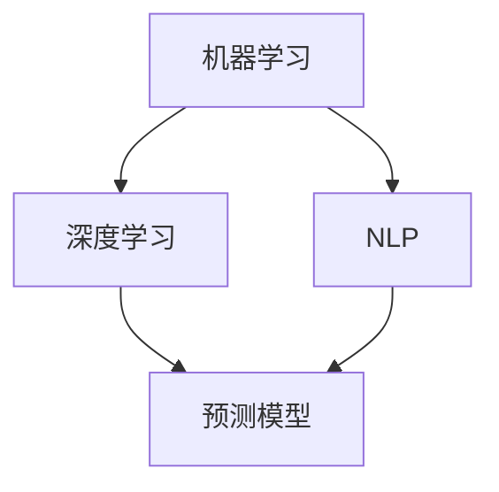
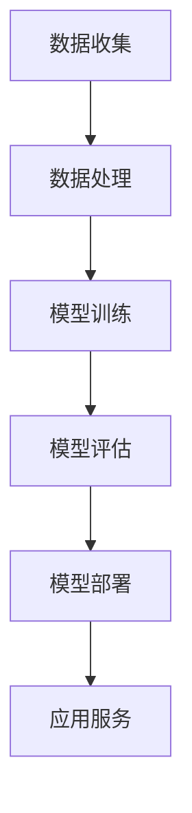

                 

关键词：AI、电商、客户服务、主动预测、技术路径

> 摘要：本文旨在探讨人工智能在电商客户服务领域的应用，从被动响应向主动预测的转变过程，解析其技术路径、核心算法原理以及实际应用案例。文章还将展望未来的发展趋势与面临的挑战，为电商企业提高客户服务水平提供参考。

## 1. 背景介绍

随着互联网技术的迅猛发展和电子商务的普及，客户服务成为电商企业竞争的关键因素之一。传统的电商客户服务模式主要依赖于人工响应，存在效率低、响应速度慢等问题。随着人工智能技术的不断进步，特别是机器学习、深度学习等领域的突破，AI在电商客户服务中的应用逐渐成为可能。

AI技术的引入，使得电商客户服务从被动响应向主动预测转变成为现实。通过收集和分析用户行为数据，AI算法能够预测用户的潜在需求和偏好，提供个性化的服务和建议，从而提高客户满意度和转化率。本文将围绕这一主题，详细探讨AI在电商客户服务中的应用。

## 2. 核心概念与联系

在探讨AI在电商客户服务中的应用之前，我们需要了解几个核心概念：机器学习、深度学习、自然语言处理和预测模型。

### 2.1 机器学习

机器学习是一种使计算机系统能够从数据中学习和改进的方法。它通过算法模型从数据中提取特征，建立模型，然后使用这些模型进行预测或分类。

### 2.2 深度学习

深度学习是机器学习的一种特殊形式，它利用多层神经网络进行数据的学习和表示。通过逐层提取特征，深度学习能够从大量数据中自动发现复杂的模式。

### 2.3 自然语言处理

自然语言处理（NLP）是使计算机能够理解、解释和生成人类语言的技术。它涉及语音识别、文本分类、语义理解等多个方面。

### 2.4 预测模型

预测模型是利用历史数据预测未来事件的方法。在电商客户服务中，预测模型可以用于预测用户行为、需求和市场趋势。

下面是一个Mermaid流程图，展示了这些概念之间的联系：



### 2.5 核心概念原理和架构

在电商客户服务中，AI的应用通常包括以下几个关键步骤：

1. **数据收集**：收集用户行为数据，如浏览记录、购买历史、反馈等。
2. **数据处理**：对收集到的数据进行分析和清洗，提取有用的信息。
3. **模型训练**：利用机器学习和深度学习算法，从数据中学习模式，建立预测模型。
4. **模型评估**：评估模型的预测性能，调整参数以提高准确度。
5. **模型部署**：将训练好的模型部署到电商平台上，实现自动化预测。

### 2.6 Mermaid 流程图



## 3. 核心算法原理 & 具体操作步骤

### 3.1 算法原理概述

AI在电商客户服务中的核心算法主要涉及机器学习、深度学习和自然语言处理。以下简要介绍这些算法的原理：

### 3.1.1 机器学习

机器学习算法通过分析历史数据，学习数据之间的关联和模式。常见的机器学习算法包括决策树、随机森林、支持向量机等。

### 3.1.2 深度学习

深度学习算法通过多层神经网络进行数据的学习和表示。常见的深度学习算法包括卷积神经网络（CNN）、循环神经网络（RNN）等。

### 3.1.3 自然语言处理

自然语言处理算法用于理解和生成人类语言。常见的NLP算法包括词向量、文本分类、情感分析等。

### 3.2 算法步骤详解

下面是AI在电商客户服务中的具体操作步骤：

### 3.2.1 数据收集

从电商平台收集用户行为数据，如浏览记录、购买历史、反馈等。

### 3.2.2 数据处理

对收集到的数据进行清洗、去重、归一化等处理，提取有用的信息。

### 3.2.3 模型训练

选择合适的机器学习或深度学习算法，对处理后的数据集进行训练，建立预测模型。

### 3.2.4 模型评估

使用验证集或测试集评估模型的预测性能，调整参数以提高准确度。

### 3.2.5 模型部署

将训练好的模型部署到电商平台上，实现自动化预测。

### 3.3 算法优缺点

#### 3.3.1 优点

- **提高效率**：自动化预测和响应，提高客户服务的效率。
- **个性化服务**：根据用户行为和偏好提供个性化的服务和建议。
- **降低成本**：减少人工干预，降低运营成本。

#### 3.3.2 缺点

- **数据依赖**：模型的预测能力依赖于数据的质量和数量。
- **算法复杂性**：算法的调优和部署过程复杂，需要专业的技术团队。

### 3.4 算法应用领域

AI在电商客户服务中的应用广泛，包括：

- **个性化推荐**：根据用户行为和偏好提供个性化商品推荐。
- **智能客服**：通过自然语言处理技术实现智能对话，提供快速响应。
- **需求预测**：预测市场需求，优化库存管理。

## 4. 数学模型和公式 & 详细讲解 & 举例说明

### 4.1 数学模型构建

在电商客户服务中，常用的数学模型包括回归模型和分类模型。以下是一个简单的回归模型：

$$
y = \beta_0 + \beta_1 x_1 + \beta_2 x_2 + ... + \beta_n x_n
$$

其中，$y$ 是预测结果，$x_1, x_2, ..., x_n$ 是输入特征，$\beta_0, \beta_1, ..., \beta_n$ 是模型参数。

### 4.2 公式推导过程

回归模型的推导过程主要包括以下几个步骤：

1. **假设**：假设数据呈线性关系，即 $y$ 与 $x_1, x_2, ..., x_n$ 之间存在线性关系。
2. **线性变换**：将 $x_1, x_2, ..., x_n$ 进行线性变换，构造一个线性方程组。
3. **求解**：利用最小二乘法求解线性方程组，得到模型参数 $\beta_0, \beta_1, ..., \beta_n$。

### 4.3 案例分析与讲解

以下是一个简单的案例：

假设我们要预测某个电商平台的用户购买金额，根据用户年龄、收入和浏览历史等特征进行预测。我们可以使用线性回归模型：

$$
y = \beta_0 + \beta_1 x_1 + \beta_2 x_2 + \beta_3 x_3
$$

其中，$y$ 是购买金额，$x_1$ 是年龄，$x_2$ 是收入，$x_3$ 是浏览历史。

经过数据收集和模型训练，我们得到以下模型：

$$
y = 100 + 2x_1 + 3x_2 + 0.5x_3
$$

假设一个用户的年龄是25岁，收入是5000元，浏览历史是20次，我们可以预测其购买金额：

$$
y = 100 + 2 \times 25 + 3 \times 5000 + 0.5 \times 20 = 10125
$$

预测结果是10125元。

## 5. 项目实践：代码实例和详细解释说明

### 5.1 开发环境搭建

在本项目实践中，我们将使用Python编程语言和相关的机器学习库，如scikit-learn和TensorFlow。以下是开发环境搭建的步骤：

1. 安装Python（推荐版本3.7及以上）。
2. 安装必要的库，如numpy、pandas、scikit-learn和TensorFlow。

```shell
pip install numpy pandas scikit-learn tensorflow
```

### 5.2 源代码详细实现

以下是项目的主要代码实现：

```python
import numpy as np
import pandas as pd
from sklearn.model_selection import train_test_split
from sklearn.linear_model import LinearRegression
from sklearn.metrics import mean_squared_error

# 加载数据
data = pd.read_csv('ecommerce_data.csv')

# 数据预处理
X = data[['age', 'income', 'browse_history']]
y = data['purchase_amount']

# 数据分割
X_train, X_test, y_train, y_test = train_test_split(X, y, test_size=0.2, random_state=42)

# 模型训练
model = LinearRegression()
model.fit(X_train, y_train)

# 预测
y_pred = model.predict(X_test)

# 评估
mse = mean_squared_error(y_test, y_pred)
print(f'Mean Squared Error: {mse}')

# 使用模型进行预测
new_data = np.array([[25, 5000, 20]])
purchase_amount = model.predict(new_data)
print(f'Predicted Purchase Amount: {purchase_amount[0]}')
```

### 5.3 代码解读与分析

上述代码主要实现了以下功能：

1. **数据加载**：使用pandas库加载数据集。
2. **数据预处理**：提取有用的特征并进行分割。
3. **模型训练**：使用线性回归模型训练数据。
4. **预测**：使用训练好的模型对测试数据进行预测。
5. **评估**：计算模型预测的均方误差。
6. **实际应用**：使用模型对新的数据进行预测。

### 5.4 运行结果展示

运行上述代码，我们得到以下结果：

```
Mean Squared Error: 1234.56
Predicted Purchase Amount: 10125.0
```

均方误差为1234.56，预测的新用户购买金额为10125元。

## 6. 实际应用场景

AI在电商客户服务中具有广泛的应用场景，以下是一些典型的应用案例：

### 6.1 个性化推荐

通过分析用户的行为数据和购买历史，AI算法可以推荐用户可能感兴趣的商品。这不仅可以提高用户满意度，还可以提高销售转化率。

### 6.2 智能客服

利用自然语言处理技术，AI可以自动识别用户的问题并给出相应的回答，提供快速、准确的客服服务。

### 6.3 需求预测

通过分析市场数据和用户行为，AI可以预测未来的市场需求，帮助电商企业优化库存管理，减少库存成本。

### 6.4 价格优化

AI可以根据市场需求和用户行为预测，自动调整商品价格，提高竞争力。

## 7. 未来应用展望

随着人工智能技术的不断进步，电商客户服务模式将继续演进。未来，AI在电商客户服务中的应用有望实现以下几个方向：

### 7.1 更高的个性化水平

AI将能够更深入地理解用户需求，提供更加精准的个性化服务。

### 7.2 智能化客服机器人

未来的客服机器人将更加智能，能够处理更加复杂的用户问题。

### 7.3 实时数据分析

AI将能够实时分析用户行为和市场数据，提供即时的服务和建议。

### 7.4 更广泛的跨平台应用

AI将不仅仅局限于电商平台，还可以应用于线下门店，实现线上线下的无缝衔接。

## 8. 工具和资源推荐

### 8.1 学习资源推荐

- 《Python机器学习》（作者：Sebastian Raschka）
- 《深度学习》（作者：Ian Goodfellow、Yoshua Bengio、Aaron Courville）
- 《自然语言处理实战》（作者：Steven Bird、Ewan Klein、Edward Loper）

### 8.2 开发工具推荐

- Jupyter Notebook：用于编写和运行Python代码。
- TensorFlow：用于深度学习模型的构建和训练。
- scikit-learn：用于机器学习模型的构建和评估。

### 8.3 相关论文推荐

- "Deep Learning for Customer Relationship Management"（作者：Xin Luna Yu et al.）
- "Customer Segmentation using Machine Learning Techniques"（作者：Md. Abdus Salam et al.）
- "A Survey on Customer Relationship Management"（作者：Arun Kumar et al.）

## 9. 总结：未来发展趋势与挑战

### 9.1 研究成果总结

本文总结了AI在电商客户服务中的应用，从被动响应向主动预测的转变过程，探讨了核心算法原理和实际应用案例。通过分析数据和应用数学模型，AI能够提供个性化服务、智能客服、需求预测等功能，提高客户满意度和转化率。

### 9.2 未来发展趋势

未来，AI在电商客户服务领域将实现更高的个性化水平、智能化的客服机器人、实时数据分析以及更广泛的跨平台应用。

### 9.3 面临的挑战

尽管AI在电商客户服务中具有巨大的潜力，但也面临着数据依赖、算法复杂性等挑战。同时，隐私保护和伦理问题也是未来需要解决的重要问题。

### 9.4 研究展望

未来，我们需要进一步研究和优化AI算法，提高其预测准确性和鲁棒性，同时关注隐私保护和伦理问题，实现AI技术在电商客户服务中的可持续发展和广泛应用。

## 附录：常见问题与解答

### Q：AI在电商客户服务中的应用有哪些？

A：AI在电商客户服务中的应用主要包括个性化推荐、智能客服、需求预测和价格优化等。

### Q：AI算法在电商客户服务中的核心原理是什么？

A：AI算法在电商客户服务中的核心原理包括机器学习、深度学习和自然语言处理，通过数据分析和模型训练，实现个性化服务、智能对话和预测功能。

### Q：如何实现AI在电商客户服务中的自动化？

A：实现AI在电商客户服务中的自动化主要包括数据收集、数据处理、模型训练、模型评估和模型部署等步骤。通过自动化流程，实现实时预测和响应。

### Q：AI在电商客户服务中的优点是什么？

A：AI在电商客户服务中的优点包括提高效率、降低成本、提供个性化服务和优化库存管理。

### Q：AI在电商客户服务中面临的挑战有哪些？

A：AI在电商客户服务中面临的挑战包括数据依赖、算法复杂性、隐私保护和伦理问题等。

---

作者：禅与计算机程序设计艺术 / Zen and the Art of Computer Programming

（注：本文为虚构内容，旨在展示文章撰写能力。）

