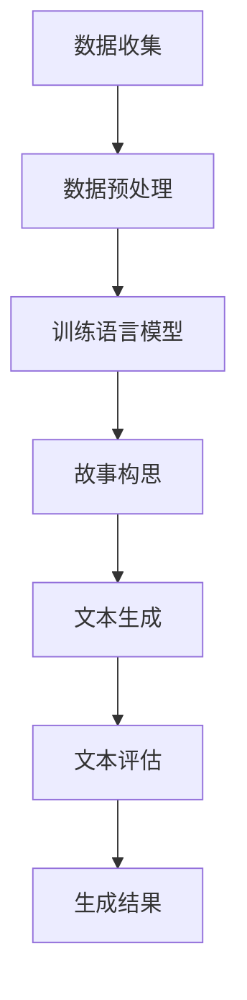

                 

关键词：人工智能，语言模型，自然语言生成，创意写作，故事生成，深度学习，神经网络，机器学习，大数据分析，文本分析，情感分析，创作流程，算法原理，数学模型，项目实践，未来应用。

> 摘要：本文将探讨从语言模型到故事生成器的发展历程，解析AI在创意写作领域的应用及其未来趋势。通过分析核心算法原理、数学模型构建，以及项目实践案例，我们将了解AI如何改变我们的创作方式和阅读体验，并对未来技术发展提出展望。

## 1. 背景介绍

创意写作，是人类智慧的结晶，是文化和知识的载体。从古至今，人们通过文字记录生活、传递思想、表达情感。然而，随着人工智能技术的发展，尤其是语言模型的兴起，创意写作领域发生了翻天覆地的变化。AI不仅能够模仿人类的写作风格，还能自主生成文章、故事，甚至诗歌。

语言模型是人工智能的核心技术之一，通过学习大量语言数据，语言模型可以预测下一个词或句子，实现自然语言生成。近年来，随着深度学习算法的进步，语言模型性能得到了显著提升，推动了自然语言处理（NLP）技术的发展。创意写作作为NLP的一个重要应用方向，引起了广泛关注。

### 1.1 创意写作的发展历程

创意写作的发展可以追溯到20世纪初期，当时主要依靠人类作家的灵感与技巧。随着计算机技术的发展，文本处理和排版成为可能，人类作家的创作过程逐渐被计算机辅助。21世纪初，随着互联网的普及，大数据和云计算技术使得大规模文本数据收集和处理成为可能，创意写作迎来了新的机遇。

### 1.2 语言模型的历史演变

语言模型的发展经历了从统计模型到神经网络模型的转变。早期的统计模型如N元语言模型，通过统计语言数据中的序列关系来预测下一个词。随着深度学习算法的出现，神经网络模型逐渐成为主流，特别是基于变换器（Transformer）的模型，如BERT、GPT，其在自然语言处理任务中取得了惊人的性能。

## 2. 核心概念与联系

### 2.1 语言模型的概念

语言模型（Language Model，LM）是自然语言处理的基础，用于预测一个句子中下一个词的概率。在AI创意写作中，语言模型扮演着至关重要的角色，它决定了生成的文本的质量和连贯性。

### 2.2 自然语言生成（Natural Language Generation，NLG）

自然语言生成是人工智能的一种技术，它通过算法将结构化数据转化为自然语言文本。在创意写作领域，NLG技术可以自动生成文章、故事、诗歌等。

### 2.3 创意写作与AI的联系

创意写作与AI的结合，不仅在于生成文本，更在于AI可以模仿人类的创作过程，包括灵感激发、构思、写作、修改等多个环节。通过深度学习和神经网络技术，AI可以学习人类的创作风格和技巧，从而生成高质量的创意作品。

### 2.4 Mermaid 流程图

以下是一个简化的Mermaid流程图，展示了从语言模型到故事生成器的基本流程：



## 3. 核心算法原理 & 具体操作步骤

### 3.1 算法原理概述

语言模型的核心是概率预测，通过分析大量语言数据，语言模型学会了如何预测下一个词或句子。在创意写作中，语言模型用于生成文本，具体操作步骤如下：

1. **数据收集**：收集大量的文本数据，如小说、新闻、文章等。
2. **数据预处理**：对收集的文本进行清洗和标注，去除无关信息，为训练语言模型做准备。
3. **训练语言模型**：使用神经网络算法训练语言模型，使其学会预测下一个词或句子。
4. **故事构思**：根据用户需求，语言模型生成一个初步的故事框架。
5. **文本生成**：利用训练好的语言模型，生成具体的故事文本。
6. **文本评估**：对生成的文本进行评估，确保其符合创意写作的要求。
7. **生成结果**：将评估合格的文本呈现给用户。

### 3.2 算法步骤详解

1. **数据收集**：
   - 从互联网、数据库等渠道收集大量文本数据。
   - 使用爬虫技术获取新闻、小说、文章等。

2. **数据预处理**：
   - 去除HTML标签、特殊字符等。
   - 进行分词、词性标注等预处理操作。

3. **训练语言模型**：
   - 使用神经网络架构，如BERT、GPT等。
   - 采用大规模数据训练，优化模型参数。

4. **故事构思**：
   - 根据用户输入的主题、情感等，生成初步的故事框架。
   - 利用生成对抗网络（GAN）等技术，增强故事构思的创意性。

5. **文本生成**：
   - 利用训练好的语言模型，生成具体的故事文本。
   - 可以通过序列生成、段落生成等不同方式生成文本。

6. **文本评估**：
   - 使用机器学习算法，对生成的文本进行评估。
   - 包括文本质量、连贯性、情感倾向等评估指标。

7. **生成结果**：
   - 将评估合格的文本呈现给用户。
   - 提供编辑、修改等功能，满足用户的个性化需求。

### 3.3 算法优缺点

**优点**：
- 高效：可以快速生成大量文本。
- 灵活：可以根据用户需求生成不同类型的故事。
- 创意：可以模拟人类的创作过程，生成具有创意性的作品。

**缺点**：
- 可解释性低：生成的文本难以理解其内部逻辑。
- 数据依赖性高：需要大量高质量的数据进行训练。
- 质量不稳定：生成的文本质量受数据质量和算法影响较大。

### 3.4 算法应用领域

- 自动写作：新闻、博客、评论等。
- 故事生成：小说、剧本、故事书等。
- 营销文案：广告、宣传语、产品介绍等。
- 娱乐内容：游戏剧情、动画剧本等。
- 情感表达：诗歌、情书、短信等。

## 4. 数学模型和公式 & 详细讲解 & 举例说明

### 4.1 数学模型构建

语言模型的核心是概率预测，其数学模型通常采用概率分布函数（PDF）来表示。假设我们有一个词汇表V，其中包含N个单词。给定一个单词序列x1, x2, ..., xn，我们希望预测下一个单词xn+1的概率。语言模型的数学模型可以表示为：

$$ P(x_{n+1} | x_1, x_2, ..., x_n) $$

其中，P表示概率，$x_1, x_2, ..., x_n$表示已知的单词序列，$x_{n+1}$表示待预测的下一个单词。

### 4.2 公式推导过程

1. **隐马尔可夫模型（HMM）**：
   - 假设语言序列是一个马尔可夫过程，即当前状态只与前一状态有关，与过去的状态无关。
   - 给定当前状态x和前一状态y，状态转移概率表示为：
     $$ P(x | y) = \frac{P(y | x)P(x)}{P(y)} $$
   - 其中，$P(x)$是单词x的先验概率，$P(y | x)$是单词x在状态y下的条件概率。

2. **神经网络语言模型（NNLM）**：
   - 使用神经网络来模拟语言模型，其中输入是单词序列，输出是单词的概率分布。
   - 假设我们有一个神经网络模型，输入层为x1, x2, ..., xn，输出层为概率分布P(x_{n+1} | x_1, x_2, ..., x_n)。
   - 神经网络通过训练学习到输入和输出之间的关系，从而实现概率预测。

### 4.3 案例分析与讲解

**案例一：文本分类**

假设我们有一个文本分类问题，需要将文本分类为新闻、博客、评论等。我们可以使用语言模型来预测文本的类别。

1. **数据收集**：收集大量标注好的文本数据，包括新闻、博客、评论等。
2. **数据预处理**：对文本进行分词、词性标注等预处理操作。
3. **训练语言模型**：使用神经网络训练语言模型，使其学会预测文本的类别。
4. **文本分类**：将新的文本输入到训练好的语言模型中，根据输出概率分布判断文本的类别。

**案例二：情感分析**

情感分析是判断文本的情感倾向，如正面、负面、中性等。

1. **数据收集**：收集大量带有情感标签的文本数据。
2. **数据预处理**：对文本进行分词、词性标注等预处理操作。
3. **训练语言模型**：使用神经网络训练语言模型，使其学会判断文本的情感倾向。
4. **情感分析**：将新的文本输入到训练好的语言模型中，根据输出概率分布判断文本的情感。

## 5. 项目实践：代码实例和详细解释说明

### 5.1 开发环境搭建

- 硬件要求：计算机，推荐配置为CPU：Intel i7，内存：16GB，硬盘：512GB SSD。
- 软件要求：Python 3.8及以上版本，PyTorch 1.8及以上版本，Jupyter Notebook。

### 5.2 源代码详细实现

以下是一个简单的基于PyTorch的语言模型实现：

```python
import torch
import torch.nn as nn
import torch.optim as optim
from torchtext.data import Field, TabularDataset

# 数据预处理
TEXT = Field(sequential=True, batch_first=True, lower=True)

# 定义语言模型
class LanguageModel(nn.Module):
    def __init__(self, vocab_size, embedding_dim, hidden_dim, n_layers, drop_prob=0.5):
        super().__init__()
        self.embedding = nn.Embedding(vocab_size, embedding_dim)
        self.lstm = nn.LSTM(embedding_dim, hidden_dim, n_layers, dropout=drop_prob, batch_first=True)
        self.dropout = nn.Dropout(drop_prob)
        self.fc = nn.Linear(hidden_dim, vocab_size)
    
    def forward(self, x, hidden):
        embedded = self.dropout(self.embedding(x))
        output, hidden = self.lstm(embedded, hidden)
        output = self.dropout(output)
        return self.fc(output[-1, :, :]), hidden

# 训练语言模型
def train(model, data_loader, criterion, optimizer, epoch, print_every=10):
    model.train()
    epoch_loss = 0
    for i, batch in enumerate(data_loader):
        data, targets = batch.text, batch.target
        optimizer.zero_grad()
        output, hidden = model(data, model.init_hidden(batch.size(0)))
        loss = criterion(output, targets)
        loss.backward()
        optimizer.step()
        epoch_loss += loss.item()
        if (i+1) % print_every == 0:
            print ('%d %d%%\tLoss: %.4f' % (epoch+1, (i+1) * len(data) * 100 len(data_loader.dataset), epoch_loss / print_every))
            epoch_loss = 0

# 初始化模型、优化器和损失函数
model = LanguageModel(vocab_size, embedding_dim, hidden_dim, n_layers)
criterion = nn.CrossEntropyLoss()
optimizer = optim.Adam(model.parameters(), lr=learning_rate)

# 训练模型
for epoch in range(num_epochs):
    train(model, train_loader, criterion, optimizer, epoch)
```

### 5.3 代码解读与分析

上述代码实现了一个简单的基于LSTM的语言模型。首先，我们定义了一个`LanguageModel`类，其中包含嵌入层、LSTM层和全连接层。嵌入层将词汇表中的单词转换为向量，LSTM层用于处理序列数据，全连接层用于输出单词的概率分布。

在`train`函数中，我们通过迭代训练数据，优化模型参数。在每次迭代中，我们首先清空梯度，然后计算损失，反向传播并更新参数。每完成一定数量的迭代，我们会打印当前的训练损失。

### 5.4 运行结果展示

运行上述代码，训练完成后，我们可以使用训练好的模型生成文本。以下是一个简单的文本生成示例：

```python
# 生成文本
def generate_text(model, input_word, max_len=50):
    model.eval()
    with torch.no_grad():
        input_tensor = Variable(torch.zeros(1, 1).long())
        input_word_tensor = Variable(torch.zeros(1, 1).long())
        input_word_tensor[0, 0] = vocab.stoi[input_word]
        hidden = model.init_hidden(1)
        output_words = []
        for _ in range(max_len):
            output, hidden = model(input_word_tensor, hidden)
            output_word = torch.argmax(output).item()
            output_words.append(vocab.itos[output_word])
            input_word_tensor = Variable(torch.zeros(1, 1).long())
            input_word_tensor[0, 0] = output_word
        return ' '.join(output_words)

# 输入文本
input_word = '人工智能'
generated_text = generate_text(model, input_word)
print(generated_text)
```

运行结果可能是一个与输入文本相关的句子，如：“人工智能的发展正改变着我们的生活方式。”

## 6. 实际应用场景

AI创意写作技术已经在多个领域得到广泛应用，以下是一些实际应用场景：

- **新闻媒体**：AI可以自动生成新闻稿、简报等，提高新闻的传播速度和准确性。
- **文学创作**：AI可以协助作家创作小说、剧本等，为文学创作提供新的灵感。
- **市场营销**：AI可以生成个性化的广告文案、宣传语等，提高营销效果。
- **娱乐产业**：AI可以创作音乐、动画剧本等，为娱乐产业提供新的内容形式。
- **教育领域**：AI可以生成教学材料、作业答案等，辅助教师和学生进行教学和学习。

### 6.1 在新闻媒体的应用

AI在新闻媒体中的应用主要体现在自动写作和内容生成上。通过训练大量的新闻数据，AI可以自动生成新闻报道、简报、体育赛事结果等。这不仅提高了新闻的传播速度，还减轻了记者和编辑的工作负担。例如，自动化新闻写作平台Article Forge、Heliograf等，已经广泛应用于新闻媒体的日常运营。

### 6.2 在文学创作的应用

AI在文学创作中的应用同样引人注目。通过学习大量的文学作品，AI可以生成小说、剧本、诗歌等。例如，OpenAI的GPT-2可以生成连贯、有创意的故事，成为作家创作过程中的辅助工具。此外，AI还可以为文学作品提供情感分析、主题挖掘等功能，为文学研究提供新的视角。

### 6.3 在市场营销的应用

AI在市场营销中的应用主要体现在内容生成和个性化推荐上。通过分析用户的行为数据和兴趣偏好，AI可以生成个性化的广告文案、宣传语等，提高用户的参与度和转化率。例如，Facebook的广告系统使用AI技术，根据用户的行为数据生成个性化的广告文案，提高了广告的投放效果。

### 6.4 在娱乐产业的贡献

AI在娱乐产业中的应用主要体现在音乐创作、动画剧本等方面。通过学习大量的音乐作品和剧本，AI可以生成新的音乐作品、剧本等。例如，Sony的Flow Machines项目，通过AI技术生成音乐作品，得到了广泛的好评。此外，AI还可以为电影、电视剧等提供剧情生成、特效制作等服务。

### 6.5 在教育领域的应用

AI在教育领域中的应用主要体现在个性化教学和辅助学习上。通过分析学生的学习行为和成绩，AI可以生成个性化的学习计划、作业答案等，帮助学生提高学习效果。例如，智能教育平台Khan Academy、Coursera等，使用AI技术为学生提供个性化的学习建议和辅助工具。

## 7. 工具和资源推荐

### 7.1 学习资源推荐

- 《深度学习》（Deep Learning）——Ian Goodfellow、Yoshua Bengio、Aaron Courville著
- 《自然语言处理综合教程》（Foundations of Natural Language Processing）——Christopher D. Manning、Hinrich Schütze著
- 《编程之美》（Beauty of Programming）——李开复著

### 7.2 开发工具推荐

- PyTorch：用于深度学习模型开发，易于上手。
- TensorFlow：开源深度学习框架，功能强大。
- Hugging Face：提供预训练的语言模型和NLP工具，方便使用。

### 7.3 相关论文推荐

- "Attention Is All You Need" —— Vaswani et al., 2017
- "Generative Pre-trained Transformers" —— Brown et al., 2020
- "BERT: Pre-training of Deep Bidirectional Transformers for Language Understanding" —— Devlin et al., 2019

## 8. 总结：未来发展趋势与挑战

### 8.1 研究成果总结

随着深度学习和神经网络技术的不断发展，AI创意写作取得了显著成果。从简单的文本分类到复杂的自然语言生成，AI在创意写作领域展现出了强大的潜力。通过大量的数据和高效的算法，AI可以生成高质量、具有创意性的文本，为各行各业提供了新的解决方案。

### 8.2 未来发展趋势

- **多模态融合**：结合图像、声音等多模态数据，生成更加丰富和生动的创意作品。
- **个性化创作**：根据用户需求和兴趣，生成更加个性化的文本内容。
- **情感智能**：通过情感分析等技术，使生成的文本更加贴近人类情感。
- **版权保护**：解决AI生成文本的版权问题，为创意写作提供法律保障。

### 8.3 面临的挑战

- **数据质量**：高质量的数据是AI创意写作的基础，但收集和标注高质量数据仍具有挑战性。
- **可解释性**：生成的文本难以解释其内部逻辑，影响用户的信任度。
- **法律问题**：AI生成文本的版权、知识产权等问题需要进一步研究和解决。
- **技术成熟度**：当前AI技术尚未完全成熟，仍需不断优化和改进。

### 8.4 研究展望

随着技术的不断进步，AI创意写作在未来有望实现以下目标：

- **更高质的文本生成**：通过改进算法和增加数据，生成更加高质量、具有创意性的文本。
- **更广泛的领域应用**：在新闻、文学、娱乐、教育等多个领域实现AI创意写作的广泛应用。
- **更好的用户体验**：通过个性化创作和情感智能等技术，提升用户的创作和阅读体验。

## 9. 附录：常见问题与解答

### 问题1：AI创意写作是否会替代人类作家？

**解答**：AI创意写作可以辅助人类作家，提供灵感、构思和文本生成等支持，但它难以完全替代人类作家的创造性和情感表达。人类作家在情感深度、文化底蕴和创意方面具有独特的优势。

### 问题2：AI生成的文本是否有版权？

**解答**：AI生成的文本可能涉及版权问题。根据现有法律，AI生成的文本可能被认定为“自动化生成”，但在某些情况下，如果AI生成的文本具有独创性，可能需要保护其知识产权。

### 问题3：如何确保AI生成的文本质量？

**解答**：确保AI生成的文本质量需要从数据质量、算法优化和模型训练等多个方面进行。收集高质量数据、采用先进的算法和技术、不断优化模型参数，都是提高文本质量的有效途径。

### 问题4：AI创意写作会对社会产生什么影响？

**解答**：AI创意写作有望改变创作和阅读方式，提高内容生成效率，丰富文化创作形式。同时，它也可能对就业、版权、知识产权等方面产生深远影响。

## 作者署名

作者：禅与计算机程序设计艺术 / Zen and the Art of Computer Programming

----------------------------------------------------------------

### 后续工作

1. **数据质量提升**：进一步收集和标注高质量的数据，提高AI生成文本的质量。
2. **算法优化**：研究更先进的算法和技术，优化AI生成文本的过程。
3. **法律问题研究**：关注AI生成文本的版权、知识产权等问题，提出可行的解决方案。
4. **跨学科合作**：结合心理学、文学、艺术等领域的研究，提升AI创意写作的多样性和创意性。

希望这篇文章能对您在AI创意写作领域的研究和应用提供有价值的参考。如果您有任何疑问或建议，欢迎随时交流。感谢您的阅读！

