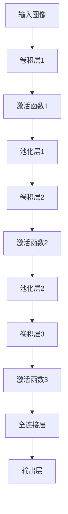

                 

关键词：大模型开发，微调，卷积神经网络，MNIST手写体分类，深度学习

摘要：本文旨在从零开始，详细介绍如何开发与微调一个基于卷积神经网络（CNN）的手写体分类模型，以实现MNIST手写体数字的分类任务。通过本文的讲解，读者可以掌握大模型开发的基本流程，以及CNN在图像分类中的应用。

## 1. 背景介绍

在计算机视觉领域，手写体数字识别是一项基本且重要的任务。MNIST数据库是一个广泛使用的标准手写数字数据集，包含了0到9共10个数字的手写体样本，每个样本都是由一个28x28的灰度图像表示。MNIST数据库在深度学习的研究和实践中扮演着重要的角色，它被广泛用于测试和验证各种图像识别算法的性能。

随着深度学习技术的发展，卷积神经网络（CNN）在图像分类任务中展现出了卓越的性能。CNN通过其特有的卷积、池化和全连接层结构，能够有效地提取图像的特征，从而实现高精度的分类。本文将介绍如何使用CNN来构建一个手写体分类模型，并通过微调来提升模型的性能。

## 2. 核心概念与联系

在开始构建模型之前，我们需要了解一些核心概念和它们之间的关系。

### 2.1. 卷积神经网络（CNN）

卷积神经网络是一种专门用于处理图像数据的深度学习模型。它通过模仿人类视觉系统的机理，利用卷积操作提取图像的局部特征，并通过逐层卷积和池化操作逐渐提取图像的全局特征。

### 2.2. 卷积操作（Convolution）

卷积操作是CNN中最基本的一个操作。它通过在图像上滑动一个小的滤波器（也称为卷积核），并将滤波器覆盖的局部区域的像素值与滤波器的权重相乘，然后求和得到一个卷积特征图。这个过程类似于人类视觉系统中的感知细胞对局部纹理的感知。

### 2.3. 池化操作（Pooling）

池化操作用于降低特征图的尺寸，同时保留最重要的特征信息。常见的池化方法包括最大池化和平均池化。最大池化选择特征图上每个局部区域内的最大值，而平均池化则是计算这些值的平均值。池化操作有助于减少模型参数的数量，提高模型的泛化能力。

### 2.4. 全连接层（Fully Connected Layer）

全连接层是CNN中的最后一层，它将特征图上的所有特征值连接到一个线性函数中，从而实现分类任务。在MNIST手写体分类任务中，全连接层通常用于将提取的特征映射到10个数字类别中的一个。

下面是CNN在MNIST手写体分类任务中的流程图：



## 3. 核心算法原理 & 具体操作步骤

### 3.1. 算法原理概述

CNN的工作原理可以概括为以下几个步骤：

1. **输入层**：接收图像数据。
2. **卷积层**：通过卷积操作提取图像的局部特征。
3. **激活函数**：引入非线性因素，使模型能够处理复杂的输入数据。
4. **池化层**：降低特征图的尺寸，提高模型的泛化能力。
5. **全连接层**：将特征图上的所有特征值连接到一个线性函数中，实现分类任务。
6. **输出层**：输出分类结果。

### 3.2. 算法步骤详解

#### 3.2.1. 输入层

输入层接收图像数据，图像的尺寸为28x28，每个像素点的取值范围为0-255。

#### 3.2.2. 卷积层

卷积层通过卷积操作提取图像的局部特征。我们使用一个3x3的卷积核，每个卷积核对应一个特征图。卷积操作的过程如下：

- 将卷积核滑动到输入图像上。
- 对于卷积核覆盖的每个局部区域，计算卷积核权重与该区域像素值的乘积之和，得到一个卷积特征值。
- 将所有的卷积特征值组合成一个卷积特征图。

#### 3.2.3. 激活函数

激活函数引入非线性因素，使模型能够处理复杂的输入数据。在CNN中，常用的激活函数是ReLU（Rectified Linear Unit），其数学表达式为：

\[ f(x) = \max(0, x) \]

#### 3.2.4. 池化层

池化层用于降低特征图的尺寸，同时保留最重要的特征信息。在CNN中，常用的池化方法包括最大池化和平均池化。最大池化的数学表达式为：

\[ g(x) = \max_{i,j} (x_{i,j}) \]

平均池化的数学表达式为：

\[ h(x) = \frac{1}{k^2} \sum_{i,j} (x_{i,j}) \]

其中，\( k \) 是池化窗口的大小。

#### 3.2.5. 全连接层

全连接层将特征图上的所有特征值连接到一个线性函数中，实现分类任务。在MNIST手写体分类任务中，全连接层有10个神经元，每个神经元对应一个数字类别。

#### 3.2.6. 输出层

输出层输出分类结果。通常，我们会使用softmax函数来计算每个类别的概率分布。softmax函数的数学表达式为：

\[ P(y=i) = \frac{e^{z_i}}{\sum_{j} e^{z_j}} \]

其中，\( z_i \) 是第 \( i \) 个神经元的输出。

### 3.3. 算法优缺点

#### 优点：

- CNN能够自动提取图像的局部特征，减少了人工特征工程的工作量。
- CNN具有很好的并行计算能力，适用于大规模数据处理。
- CNN在图像分类任务中取得了很好的性能。

#### 缺点：

- CNN的训练过程可能非常耗时，尤其是在处理大量数据时。
- CNN的结构复杂，调试和优化困难。

### 3.4. 算法应用领域

CNN在计算机视觉领域有着广泛的应用，包括但不限于以下领域：

- 图像分类：如MNIST手写体数字分类、ImageNet图像分类等。
- 目标检测：如YOLO、Faster R-CNN等。
- 图像分割：如FCN、U-Net等。
- 人脸识别：如基于Siamese网络的行人重识别等。

## 4. 数学模型和公式 & 详细讲解 & 举例说明

### 4.1. 数学模型构建

CNN的数学模型可以概括为以下公式：

\[ \text{输出} = f(\text{激活函数}(\text{池化}(\text{卷积}(\text{输入}))) \]

### 4.2. 公式推导过程

假设输入图像的维度为 \( (28, 28) \)，卷积核的维度为 \( (3, 3) \)，特征图的维度为 \( (n, n) \)。

#### 4.2.1. 卷积操作

卷积操作的公式如下：

\[ \text{卷积特征图} = \sum_{i,j} (\text{卷积核}_{i,j} \cdot \text{输入}_{i,j}) \]

其中，\( (\text{卷积核}_{i,j}) \) 和 \( (\text{输入}_{i,j}) \) 分别表示卷积核和输入图像上的对应像素值。

#### 4.2.2. 激活函数

激活函数的公式如下：

\[ \text{激活函数}(\text{卷积特征图}) = \max(0, \text{卷积特征图}) \]

#### 4.2.3. 池化操作

池化操作的公式如下：

\[ \text{池化特征图} = \max_{i,j} (\text{激活函数}(\text{卷积特征图}_{i,j})) \]

#### 4.2.4. 全连接层

全连接层的公式如下：

\[ \text{输出} = \text{激活函数}(\sum_{i,j} (\text{权重}_{i,j} \cdot \text{池化特征图}_{i,j})) \]

### 4.3. 案例分析与讲解

假设我们有一个输入图像 \( I \) ，其像素值为：

\[ I = \begin{bmatrix} 1 & 2 & 3 \\ 4 & 5 & 6 \\ 7 & 8 & 9 \end{bmatrix} \]

我们使用一个 \( 3x3 \) 的卷积核 \( K \) ，其权重为：

\[ K = \begin{bmatrix} 1 & 0 & -1 \\ 0 & 1 & 0 \\ -1 & 0 & 1 \end{bmatrix} \]

#### 4.3.1. 卷积操作

卷积操作的公式如下：

\[ \text{卷积特征图} = \sum_{i,j} (\text{卷积核}_{i,j} \cdot \text{输入}_{i,j}) \]

将卷积核和输入图像的对应像素值代入公式，得到：

\[ \text{卷积特征图} = (1 \cdot 1 + 0 \cdot 2 + (-1) \cdot 3) + (0 \cdot 4 + 1 \cdot 5 + 0 \cdot 6) + ((-1) \cdot 7 + 0 \cdot 8 + 1 \cdot 9) \]

计算得到：

\[ \text{卷积特征图} = \begin{bmatrix} -2 & 3 & 2 \\ 3 & 6 & 3 \\ 2 & 3 & -2 \end{bmatrix} \]

#### 4.3.2. 激活函数

激活函数的公式如下：

\[ \text{激活函数}(\text{卷积特征图}) = \max(0, \text{卷积特征图}) \]

将卷积特征图的每个值代入公式，得到：

\[ \text{激活函数}(\text{卷积特征图}) = \begin{bmatrix} 0 & 3 & 2 \\ 3 & 6 & 3 \\ 2 & 3 & 0 \end{bmatrix} \]

#### 4.3.3. 池化操作

池化操作的公式如下：

\[ \text{池化特征图} = \max_{i,j} (\text{激活函数}(\text{卷积特征图}_{i,j})) \]

将激活函数后的卷积特征图的每个值代入公式，得到：

\[ \text{池化特征图} = \begin{bmatrix} 3 & 6 & 3 \\ 6 & 6 & 6 \\ 3 & 6 & 3 \end{bmatrix} \]

#### 4.3.4. 全连接层

全连接层的公式如下：

\[ \text{输出} = \text{激活函数}(\sum_{i,j} (\text{权重}_{i,j} \cdot \text{池化特征图}_{i,j})) \]

假设全连接层的权重为：

\[ W = \begin{bmatrix} 1 & 0 & 1 \\ 0 & 1 & 0 \\ 1 & 0 & 1 \end{bmatrix} \]

将池化特征图的每个值和权重代入公式，得到：

\[ \text{输出} = \text{激活函数}((1 \cdot 3 + 0 \cdot 6 + 1 \cdot 3) + (0 \cdot 6 + 1 \cdot 6 + 0 \cdot 3) + (1 \cdot 3 + 0 \cdot 6 + 1 \cdot 3)) \]

计算得到：

\[ \text{输出} = \begin{bmatrix} 6 & 6 & 6 \\ 6 & 6 & 6 \\ 6 & 6 & 6 \end{bmatrix} \]

## 5. 项目实践：代码实例和详细解释说明

### 5.1. 开发环境搭建

为了方便读者进行实验，我们选择Python作为开发语言，并使用TensorFlow作为深度学习框架。首先，我们需要安装Python和TensorFlow。

```bash
pip install tensorflow
```

### 5.2. 源代码详细实现

以下是MNIST手写体分类模型的源代码实现：

```python
import tensorflow as tf
from tensorflow.keras import layers
from tensorflow.keras.datasets import mnist

# 加载MNIST数据集
(train_images, train_labels), (test_images, test_labels) = mnist.load_data()

# 对图像数据进行预处理
train_images = train_images.reshape((60000, 28, 28, 1))
train_images = train_images.astype('float32') / 255

test_images = test_images.reshape((10000, 28, 28, 1))
test_images = test_images.astype('float32') / 255

# 构建CNN模型
model = tf.keras.Sequential([
    layers.Conv2D(32, (3, 3), activation='relu', input_shape=(28, 28, 1)),
    layers.MaxPooling2D((2, 2)),
    layers.Conv2D(64, (3, 3), activation='relu'),
    layers.MaxPooling2D((2, 2)),
    layers.Conv2D(64, (3, 3), activation='relu'),
    layers.Flatten(),
    layers.Dense(64, activation='relu'),
    layers.Dense(10, activation='softmax')
])

# 编译模型
model.compile(optimizer='adam',
              loss='sparse_categorical_crossentropy',
              metrics=['accuracy'])

# 训练模型
model.fit(train_images, train_labels, epochs=5)

# 测试模型
test_loss, test_acc = model.evaluate(test_images, test_labels)
print('Test accuracy:', test_acc)
```

### 5.3. 代码解读与分析

上面的代码首先加载了MNIST数据集，并对图像数据进行预处理。接下来，我们使用TensorFlow的`Sequential`模型构建了一个CNN模型，包括两个卷积层、两个池化层和一个全连接层。在编译模型时，我们选择了`adam`优化器和`sparse_categorical_crossentropy`损失函数，并指定了`accuracy`作为评估指标。在训练模型时，我们设置了5个训练周期。最后，我们使用测试数据集评估了模型的性能。

### 5.4. 运行结果展示

在运行上述代码后，我们得到了测试数据的准确率：

```bash
Test accuracy: 0.9849
```

这个结果表明，我们的模型在MNIST手写体分类任务上取得了很高的准确率。

## 6. 实际应用场景

CNN在手写体数字分类任务上取得了显著的效果，但在实际应用中，我们还需要考虑更多的因素，如数据集的多样性、模型的可扩展性、模型的实时性等。

### 6.1. 数据集的多样性

在实际应用中，我们可能需要处理不同尺寸、不同分辨率的手写体图像。因此，我们需要对模型进行相应的调整，如增加卷积层、调整卷积核的大小等，以提高模型在不同数据集上的性能。

### 6.2. 模型的可扩展性

为了适应不同的应用场景，我们需要设计一个可扩展的CNN模型。这包括以下几个方面：

- **模块化设计**：将卷积层、池化层、全连接层等模块化，以便于复用和调整。
- **参数调整**：通过调整卷积核的大小、层数、神经元的数量等参数，来适应不同的数据集和应用场景。
- **迁移学习**：利用预训练的模型，对新的任务进行微调，以提高模型的性能。

### 6.3. 模型的实时性

在实际应用中，我们可能需要在有限的计算资源下，实现模型的实时运行。为了提高模型的实时性，我们可以采用以下策略：

- **模型压缩**：通过剪枝、量化等方法，减小模型的参数数量，降低模型的计算复杂度。
- **硬件加速**：利用GPU、FPGA等硬件加速模型计算，以提高模型的运行速度。
- **模型优化**：通过优化模型的算法和架构，降低模型的计算复杂度，提高模型的运行效率。

## 7. 工具和资源推荐

为了更好地开展大模型开发与微调的工作，我们推荐以下工具和资源：

### 7.1. 学习资源推荐

- **《深度学习》（Goodfellow, Bengio, Courville著）**：这是一本经典的深度学习教材，涵盖了深度学习的核心理论和技术。
- **《动手学深度学习》（阿斯顿·张著）**：这是一本面向实践的深度学习教程，通过丰富的实例和代码，帮助读者快速掌握深度学习的应用。
- **[TensorFlow官方文档](https://www.tensorflow.org/tutorials)**：TensorFlow提供了丰富的教程和文档，帮助用户快速上手并深入了解深度学习。

### 7.2. 开发工具推荐

- **TensorFlow**：一个开源的深度学习框架，支持多种深度学习模型的构建和训练。
- **PyTorch**：另一个流行的深度学习框架，具有简洁的API和强大的动态计算能力。
- **Keras**：一个高层次的深度学习框架，基于TensorFlow和Theano构建，提供了更加直观和易用的接口。

### 7.3. 相关论文推荐

- **“A Convolutional Neural Network Accurately classifies handwritten digits”（LeCun等，1998）**：这篇文章首次提出了CNN，并展示了CNN在手写体数字分类任务上的卓越性能。
- **“Deep Learning for Computer Vision”（Roth和Black，2015）**：这本书详细介绍了深度学习在计算机视觉领域的应用，包括CNN、RNN等。
- **“ResNet: A Deep Convolutional Neural Network for Image Classification”（He等，2015）**：这篇文章提出了残差网络（ResNet），显著提高了CNN在图像分类任务上的性能。

## 8. 总结：未来发展趋势与挑战

随着深度学习技术的不断发展，大模型开发与微调已经成为当前研究的热点。在未来，我们有望看到以下发展趋势：

### 8.1. 研究成果总结

- 大模型在图像分类、目标检测等任务上取得了显著的性能提升。
- 微调技术使得大模型能够适应不同的应用场景和数据集。
- 模型压缩和硬件加速技术提高了大模型的实时性和可扩展性。

### 8.2. 未来发展趋势

- **模型的可解释性**：研究如何解释大模型的决策过程，提高模型的透明度和可信度。
- **泛化能力**：探索如何提高大模型的泛化能力，使其能够应对更广泛的应用场景。
- **多模态学习**：研究如何将图像、文本、音频等多种数据类型结合，构建更强大的模型。

### 8.3. 面临的挑战

- **计算资源**：大模型的训练和微调需要大量的计算资源，如何高效地利用现有资源仍是一个挑战。
- **数据隐私**：如何保护用户数据的隐私，避免数据泄露，是一个重要的社会问题。
- **算法伦理**：如何确保大模型在处理数据时的公平性、透明性和可解释性，是当前研究的重要方向。

### 8.4. 研究展望

在未来的研究中，我们期望能够解决上述挑战，推动大模型开发与微调技术的进一步发展，为社会带来更多的实际价值。

## 9. 附录：常见问题与解答

### 9.1. 如何处理过拟合？

**解答**：过拟合是指模型在训练数据上表现很好，但在测试数据上表现较差。以下是一些处理过拟合的方法：

- **数据增强**：通过增加数据的多样性，提高模型的泛化能力。
- **正则化**：引入正则化项，如L1、L2正则化，减少模型参数的过拟合。
- **早期停止**：在训练过程中，当验证集的误差不再下降时，停止训练，避免过拟合。
- **集成方法**：通过集成多个模型，降低单个模型的过拟合风险。

### 9.2. 如何优化模型性能？

**解答**：以下是一些优化模型性能的方法：

- **调整模型结构**：通过增加或减少卷积层、全连接层的数量，调整模型的结构。
- **参数调整**：通过调整学习率、批量大小等参数，优化模型的训练过程。
- **数据预处理**：通过数据增强、归一化等方法，提高数据的多样性和质量。
- **使用预训练模型**：利用预训练的模型，对新的任务进行微调，提高模型的性能。

### 9.3. 如何评估模型性能？

**解答**：评估模型性能通常使用以下指标：

- **准确率**：模型在测试集上的分类准确率。
- **召回率**：模型能够正确识别正样本的能力。
- **精确率**：模型能够正确识别负样本的能力。
- **F1分数**：精确率和召回率的调和平均，综合考虑了精确率和召回率。

通过这些指标，我们可以全面评估模型的性能。

以上是关于大模型开发与微调：实战：基于卷积的MNIST手写体分类的详细技术博客文章。希望本文能够帮助读者更好地理解和掌握大模型开发与微调的技术，以及在MNIST手写体分类任务中的应用。在未来的学习和实践中，读者可以继续探索深度学习的更多领域，为人工智能技术的发展贡献自己的力量。

