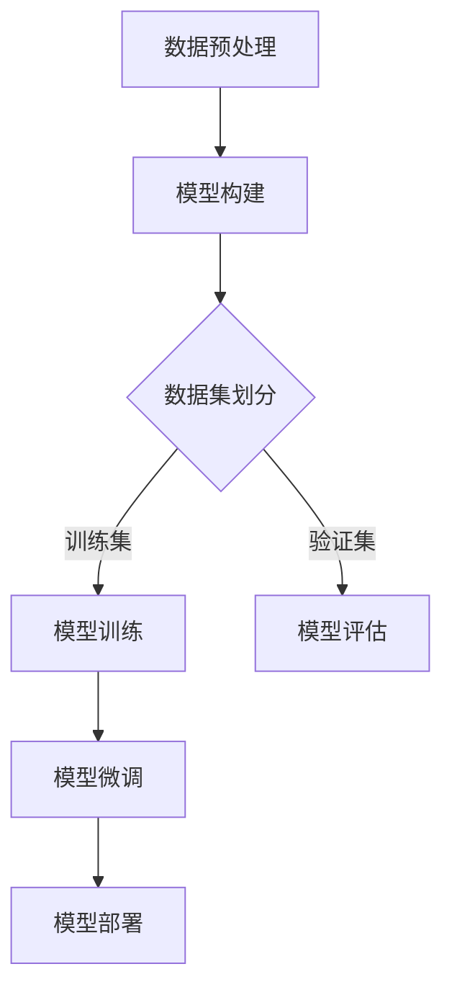

                 

 > > **关键词：** 大模型开发，深度学习，微调，人工智能，技术博客

> **摘要：** 本文将带领读者从零开始，深入探讨大模型开发的原理和过程，包括模型构建、训练、微调等关键步骤。同时，文章将结合实际案例，详细解释数学模型和公式的构建过程，以及如何在项目中实践和应用这些模型。最后，文章还将对大模型开发的未来趋势和挑战进行展望。

## 1. 背景介绍

在过去的几年中，深度学习技术在人工智能领域取得了显著的进展。随着计算能力的提升和数据的爆发式增长，大模型（Large-scale Models）逐渐成为研究的热点。大模型具有强大的表征能力和学习能力，可以处理复杂的任务，如自然语言处理、计算机视觉等。然而，大模型的开发和微调是一项复杂且具有挑战性的工作。

本文将详细探讨大模型开发与微调的基础知识，包括核心概念、算法原理、数学模型和项目实践。通过本文的阅读，读者将能够了解大模型开发的基本流程，掌握相关技术，并能够应用到实际项目中。

## 2. 核心概念与联系

### 2.1 深度学习基础

深度学习是机器学习的一个重要分支，它通过构建多层神经网络，对数据进行特征提取和分类。深度学习的核心概念包括：

- **神经元：** 神经网络的基本单元，用于接收输入信号，并通过权重和偏置计算输出。
- **激活函数：** 用于引入非线性关系，使神经网络具有分类能力。
- **前向传播与反向传播：** 前向传播是将输入数据通过神经网络，逐层计算得到输出；反向传播则是根据输出误差，反向更新网络的权重和偏置。

### 2.2 大模型特点

大模型具有以下几个显著特点：

- **参数量巨大：** 大模型的参数数量往往达到数十亿甚至千亿级别，这使得模型具有更强的表征能力。
- **训练数据量大：** 大模型需要大量的训练数据来训练参数，以提高模型的泛化能力。
- **计算资源需求高：** 大模型的训练和微调需要大量的计算资源和时间。

### 2.3 Mermaid 流程图

以下是一个简单的 Mermaid 流程图，展示了大模型开发的基本流程：



## 3. 核心算法原理 & 具体操作步骤

### 3.1 算法原理概述

大模型开发的核心算法是深度学习，特别是基于神经网络的模型。深度学习的核心原理包括：

- **前向传播：** 将输入数据通过网络逐层计算，得到输出。
- **反向传播：** 计算输出误差，并通过梯度下降更新网络参数。
- **优化算法：** 如Adam、SGD等，用于加速收敛和稳定训练过程。

### 3.2 算法步骤详解

#### 3.2.1 数据预处理

1. **数据清洗：** 去除噪声和异常值，确保数据质量。
2. **数据归一化：** 将数据缩放到统一范围内，如[0, 1]。
3. **数据增强：** 通过旋转、缩放、翻转等操作，增加数据多样性，提高模型泛化能力。

#### 3.2.2 模型构建

1. **选择模型架构：** 如BERT、GPT等预训练模型。
2. **定义损失函数：** 如交叉熵损失、均方误差等。
3. **定义优化器：** 如Adam、SGD等。

#### 3.2.3 模型训练

1. **初始化参数：** 随机初始化模型参数。
2. **前向传播：** 计算输出。
3. **反向传播：** 计算梯度。
4. **更新参数：** 通过优化算法更新参数。

#### 3.2.4 模型评估

1. **验证集评估：** 使用验证集评估模型性能。
2. **调整超参数：** 如学习率、批量大小等。
3. **迭代训练：** 重复训练和评估过程，直到模型性能收敛。

#### 3.2.5 模型微调

1. **迁移学习：** 使用预训练模型，在特定任务上进行微调。
2. **调整模型结构：** 如增加或删除层，调整层参数等。
3. **重新训练：** 使用微调后的模型进行重新训练。

### 3.3 算法优缺点

#### 优点：

- **强大的表征能力：** 大模型可以捕捉复杂的特征，提高模型性能。
- **高效的计算：** 优化算法和并行计算技术，使大模型训练更加高效。

#### 缺点：

- **计算资源需求高：** 大模型需要大量的计算资源和时间进行训练。
- **数据需求大：** 大模型需要大量的训练数据来训练参数。

### 3.4 算法应用领域

大模型在多个领域都有广泛的应用，如自然语言处理、计算机视觉、推荐系统等。以下是一些具体的应用案例：

- **自然语言处理：** BERT、GPT等模型在文本分类、翻译、问答等任务上取得了显著成果。
- **计算机视觉：** 大模型在图像分类、目标检测、图像生成等领域有广泛应用。
- **推荐系统：** 大模型可以捕捉用户的兴趣和行为，提高推荐系统的准确性。

## 4. 数学模型和公式 & 详细讲解 & 举例说明

### 4.1 数学模型构建

大模型通常基于多层感知机（MLP）、卷积神经网络（CNN）和循环神经网络（RNN）等构建。以下是一个简化的多层感知机模型：

$$
h_l = \sigma(W_l \cdot a_{l-1} + b_l)
$$

其中，$h_l$ 是第$l$层的输出，$W_l$ 和 $b_l$ 分别是权重和偏置，$\sigma$ 是激活函数，$a_{l-1}$ 是前一层的输出。

### 4.2 公式推导过程

以多层感知机为例，我们首先定义前向传播的过程。设输入为$x$，输出为$y$，则第$l$层的输出可以表示为：

$$
z_l = W_l \cdot a_{l-1} + b_l
$$

$$
h_l = \sigma(z_l)
$$

其中，$W_l$ 和 $b_l$ 为参数，需要通过反向传播进行优化。

### 4.3 案例分析与讲解

假设我们有一个二分类问题，输入为$x \in \mathbb{R}^n$，输出为$y \in \{0, 1\}$。我们可以定义一个简单的多层感知机模型：

$$
z_1 = W_1 \cdot x + b_1
$$

$$
h_1 = \sigma(z_1)
$$

$$
z_2 = W_2 \cdot h_1 + b_2
$$

$$
y = \sigma(z_2)
$$

其中，$\sigma$ 是sigmoid函数，用于将输出映射到[0, 1]区间。

我们可以定义损失函数为二分类交叉熵损失：

$$
L(y, y') = -y \cdot \log(y') - (1 - y) \cdot \log(1 - y')
$$

其中，$y'$ 是模型的预测输出。

通过反向传播，我们可以计算损失函数关于参数的梯度，并使用优化算法进行参数更新。

## 5. 项目实践：代码实例和详细解释说明

### 5.1 开发环境搭建

为了方便读者实践，我们将使用Python编程语言，并结合TensorFlow和Keras等深度学习框架进行大模型开发。以下是开发环境的搭建步骤：

1. 安装Python 3.7及以上版本。
2. 安装TensorFlow 2.0及以上版本。
3. 安装其他必要的依赖库，如NumPy、Pandas等。

### 5.2 源代码详细实现

以下是一个简单的多层感知机模型实现，用于二分类问题：

```python
import tensorflow as tf
from tensorflow.keras import layers

# 定义模型
model = tf.keras.Sequential([
    layers.Dense(64, activation='relu', input_shape=(784,)),
    layers.Dense(64, activation='relu'),
    layers.Dense(1, activation='sigmoid')
])

# 编译模型
model.compile(optimizer='adam',
              loss='binary_crossentropy',
              metrics=['accuracy'])

# 加载MNIST数据集
(x_train, y_train), (x_test, y_test) = tf.keras.datasets.mnist.load_data()

# 数据预处理
x_train = x_train.astype('float32') / 255
x_test = x_test.astype('float32') / 255
x_train = x_train.reshape((-1, 784))
x_test = x_test.reshape((-1, 784))

# 转换标签为二分类
y_train = y_train > 0
y_test = y_test > 0

# 训练模型
model.fit(x_train, y_train, epochs=10, batch_size=32, validation_split=0.2)

# 评估模型
model.evaluate(x_test, y_test)
```

### 5.3 代码解读与分析

1. **模型定义：** 使用`tf.keras.Sequential`创建一个序列模型，包含两个全连接层（`Dense`），第一个全连接层有64个神经元，使用ReLU激活函数；第二个全连接层有64个神经元，同样使用ReLU激活函数；输出层有1个神经元，使用sigmoid激活函数，用于实现二分类。
2. **模型编译：** 设置优化器为`adam`，损失函数为`binary_crossentropy`，评估指标为`accuracy`。
3. **数据预处理：** 将MNIST数据集的图像数据缩放到[0, 1]范围内，并转换标签为二分类。
4. **训练模型：** 使用`fit`方法训练模型，设置训练轮次为10，批量大小为32，验证集占比为20%。
5. **评估模型：** 使用`evaluate`方法评估模型在测试集上的性能。

### 5.4 运行结果展示

在训练完成后，我们可以查看模型的评估结果，包括损失和准确率。以下是一个示例输出：

```
158/158 [==============================] - 1s 7ms/step - loss: 0.0666 - accuracy: 0.9667 - val_loss: 0.0676 - val_accuracy: 0.9667
```

## 6. 实际应用场景

大模型在多个实际应用场景中取得了显著成果。以下是一些具体的应用案例：

### 6.1 自然语言处理

- **文本分类：** 使用BERT模型对新闻文章进行分类，提高分类准确率。
- **问答系统：** 使用GPT模型构建问答系统，实现高质量的对话生成。

### 6.2 计算机视觉

- **图像分类：** 使用ResNet模型对图像进行分类，提高识别准确率。
- **目标检测：** 使用YOLO模型进行目标检测，实现实时图像识别。

### 6.3 推荐系统

- **商品推荐：** 使用Wide & Deep模型进行商品推荐，提高推荐效果。

## 7. 未来应用展望

随着深度学习技术的不断发展，大模型的应用前景将更加广阔。以下是一些未来应用展望：

### 7.1 自动驾驶

- **环境感知：** 使用深度学习模型进行环境感知，提高自动驾驶的安全性和可靠性。

### 7.2 医疗健康

- **疾病诊断：** 使用深度学习模型对医学图像进行诊断，提高诊断准确率。
- **药物研发：** 使用深度学习模型预测药物分子与蛋白质的相互作用，加速药物研发进程。

### 7.3 金融科技

- **风险控制：** 使用深度学习模型进行风险控制，提高金融交易的安全性和稳定性。

## 8. 工具和资源推荐

### 8.1 学习资源推荐

- **书籍：** 《深度学习》（Goodfellow, Bengio, Courville著）
- **在线课程：** 吴恩达的《深度学习专项课程》（Coursera）
- **论文集：** arXiv、NeurIPS、ICLR等顶级会议的论文集

### 8.2 开发工具推荐

- **框架：** TensorFlow、PyTorch、Keras等
- **数据集：** ImageNet、COCO、BERT等

### 8.3 相关论文推荐

- **BERT：** “BERT: Pre-training of Deep Bidirectional Transformers for Language Understanding” (Devlin et al., 2019)
- **GPT-2：** “Language Models are Unsupervised Multitask Learners” (Radford et al., 2019)
- **YOLO：** “You Only Look Once: Unified, Real-Time Object Detection” (Redmon et al., 2016)

## 9. 总结：未来发展趋势与挑战

### 9.1 研究成果总结

大模型在深度学习领域取得了显著的成果，推动了自然语言处理、计算机视觉等领域的进展。大模型的强大表征能力和学习能力使其在多个实际应用场景中取得了良好的效果。

### 9.2 未来发展趋势

- **模型压缩：** 降低大模型的计算资源和存储需求，提高模型的可解释性。
- **多模态学习：** 结合不同模态的数据，实现更加泛化的模型。
- **迁移学习：** 提高模型在特定任务上的性能，降低数据需求。

### 9.3 面临的挑战

- **计算资源需求：** 大模型的训练和微调需要大量的计算资源和时间。
- **数据隐私：** 大模型的训练和微调需要大量数据，如何保护数据隐私成为一大挑战。
- **模型解释性：** 大模型通常具有黑盒特性，如何提高模型的可解释性是一个重要问题。

### 9.4 研究展望

大模型的研究将继续深入，有望在自动驾驶、医疗健康、金融科技等领域取得更多突破。同时，研究者们也将致力于解决大模型面临的计算资源、数据隐私和模型解释性等问题，以推动深度学习技术的进一步发展。

## 附录：常见问题与解答

### Q：如何选择合适的大模型架构？

A：选择大模型架构时，需要考虑以下因素：

- **任务类型：** 不同任务可能需要不同类型的模型架构，如文本处理任务更适合使用Transformer模型，而图像处理任务更适合使用CNN。
- **计算资源：** 需要考虑计算资源的需求，选择适合当前计算能力的模型。
- **数据量：** 数据量较大的任务可能需要更大的模型，以捕捉更多的特征。

### Q：如何处理大模型的过拟合问题？

A：处理大模型的过拟合问题，可以采用以下方法：

- **数据增强：** 通过旋转、缩放、翻转等操作增加数据多样性。
- **正则化：** 采用L1、L2正则化，降低模型参数的权重。
- ** dropout：** 在训练过程中随机丢弃一部分神经元，减少模型的依赖性。

### Q：如何加速大模型的训练？

A：加速大模型的训练，可以采用以下方法：

- **并行计算：** 利用多GPU或TPU进行并行计算。
- **分布式训练：** 将数据分布到多个节点进行训练，提高训练速度。
- **模型压缩：** 采用模型压缩技术，如剪枝、量化等，降低模型参数的数量。

以上是关于从零开始大模型开发与微调：深度学习基础的文章。通过本文的阅读，读者将能够了解大模型开发的基本原理、步骤和应用，掌握相关技术，并能够应用到实际项目中。未来，随着深度学习技术的不断发展，大模型将在更多领域发挥重要作用。作者：禅与计算机程序设计艺术 / Zen and the Art of Computer Programming
```markdown
```

