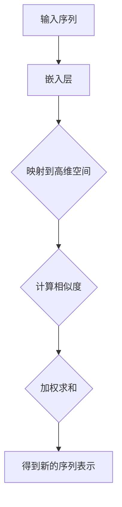

                 

关键词：大模型开发、微调、自注意力层、神经网络、机器学习、算法原理、实践案例、未来展望

摘要：本文将深入探讨大模型开发与微调中的关键环节——自注意力层。通过详细解析自注意力层的核心概念、算法原理、数学模型及其应用领域，我们将展示如何从零开始搭建一个高效的大模型，并探讨其微调过程。最后，我们将结合实际案例，展示自注意力层在现实世界中的应用，并展望其未来的发展趋势和面临的挑战。

## 1. 背景介绍

在当今的机器学习和人工智能领域，大模型的开发和应用已经成为了一个热门话题。大模型，如Transformer、BERT、GPT等，以其强大的表示能力和良好的性能在自然语言处理、计算机视觉和强化学习等众多领域中取得了显著的成功。然而，大模型的开发和微调并不简单，其中涉及到诸多技术细节和挑战。

自注意力层（Self-Attention Layer）是大模型中的一项核心技术，它能够有效地捕捉输入序列中各个元素之间的相互关系。自注意力层通过计算每个元素对其他元素的影响权重，从而在模型中引入了序列间的依赖关系，提高了模型的表达能力。因此，自注意力层在大模型的开发与微调过程中扮演着至关重要的角色。

本文将围绕自注意力层展开讨论，首先介绍其基本概念和原理，然后深入探讨其数学模型和公式，并通过实际案例展示其在现实世界中的应用。最后，我们将总结研究成果，探讨未来发展趋势，并分析面临的挑战。

## 2. 核心概念与联系

### 自注意力层的定义与原理

自注意力层，又称内部注意力层（Intra-Attention Layer），是一种在神经网络中用于计算序列中各个元素之间相互关系的注意力机制。自注意力层的核心思想是，通过计算每个元素对其他元素的影响权重，实现对输入序列的更细致的表征。

在自注意力层中，每个输入序列的元素都会被映射到一个高维空间中，这个空间中的元素通过计算相似度来确定它们之间的权重。具体来说，自注意力层通过以下步骤实现：

1. **输入嵌入**：将输入序列中的每个元素映射到一个高维向量。
2. **权重计算**：计算每个元素对其他元素的影响权重，通常使用点积或者拼接后的点积方法。
3. **加权求和**：根据权重对输入序列中的元素进行加权求和，得到新的序列表示。

自注意力层的原理可以简化为以下几个步骤：

1. **Query、Key、Value**：将输入序列中的每个元素映射到三个向量空间，分别称为Query、Key和Value空间。
2. **相似度计算**：计算每个Query和所有Key之间的相似度，得到一个权重矩阵。
3. **加权求和**：根据权重矩阵对Value空间中的元素进行加权求和，得到新的序列表示。

### 自注意力层的Mermaid流程图

以下是一个简单的Mermaid流程图，展示了自注意力层的基本流程：



### 自注意力层与其他技术的联系

自注意力层不仅在神经网络中有广泛应用，还与其他一些关键技术紧密相连，如Transformer架构、BERT模型等。

- **Transformer架构**：Transformer是自注意力层的起源，它提出了一种全新的序列到序列模型，完全基于注意力机制，摒弃了传统的循环神经网络（RNN）结构。自注意力层在Transformer架构中起到了核心作用，使得模型能够在全局范围内捕捉依赖关系。

- **BERT模型**：BERT（Bidirectional Encoder Representations from Transformers）是基于Transformer架构的一个预训练模型，它通过在大量文本上进行预训练，为下游任务提供了强大的语言表示能力。BERT模型中的多头自注意力机制（Multi-Head Self-Attention）进一步提升了模型的表达能力。

- **Transformer-XL**：Transformer-XL是Transformer架构的一个改进版本，它在自注意力层的基础上引入了长距离依赖机制，使得模型能够处理更长的序列。Transformer-XL通过自注意力层和循环神经网络的结合，实现了对长文本的高效处理。

## 3. 核心算法原理 & 具体操作步骤

### 3.1 算法原理概述

自注意力层的核心思想是利用注意力机制，在输入序列中计算每个元素对其他元素的影响权重，从而实现对输入序列的更细致的表征。具体来说，自注意力层通过以下步骤实现：

1. **输入嵌入**：将输入序列中的每个元素映射到一个高维向量。
2. **权重计算**：计算每个元素对其他元素的影响权重，通常使用点积或者拼接后的点积方法。
3. **加权求和**：根据权重对输入序列中的元素进行加权求和，得到新的序列表示。

### 3.2 算法步骤详解

#### 步骤1：输入嵌入

首先，将输入序列中的每个元素映射到一个高维向量。这个过程通常通过嵌入层（Embedding Layer）完成。嵌入层是一个简单的全连接神经网络，它将输入序列中的每个元素映射到一个固定维度的向量。

假设输入序列为\(X = [x_1, x_2, ..., x_n]\)，其中每个元素\(x_i\)是一个嵌入向量。嵌入层的输出可以表示为：

$$
E = [e_1, e_2, ..., e_n]
$$

其中，\(e_i\)是输入序列中第\(i\)个元素的嵌入向量。

#### 步骤2：权重计算

接下来，计算每个元素对其他元素的影响权重。这个步骤是自注意力层的核心。权重计算通常使用点积或者拼接后的点积方法。

点积方法：

$$
\text{Score}(x_i, x_j) = e_i^T e_j
$$

拼接后的点积方法：

$$
\text{Score}(x_i, x_j) = \text{Concat}(e_i, e_j)^T \text{W}
$$

其中，\(\text{W}\)是一个权重矩阵。

#### 步骤3：加权求和

根据权重对输入序列中的元素进行加权求和，得到新的序列表示。加权求和的过程可以表示为：

$$
\text{Contextual Embedding}(x_i) = \sum_{j=1}^{n} \text{Score}(x_i, x_j) e_j
$$

### 3.3 算法优缺点

#### 优点

1. **高表达能力**：自注意力层能够通过计算输入序列中各个元素之间的权重，实现对输入序列的更细致的表征，从而提高了模型的表达能力。
2. **全局依赖关系**：自注意力层能够捕捉到输入序列中全局的依赖关系，使得模型能够在处理长序列时保持良好的性能。
3. **并行计算**：自注意力层允许并行计算，提高了计算效率。

#### 缺点

1. **计算复杂度高**：自注意力层的计算复杂度随着序列长度的增加而线性增加，可能导致计算时间过长。
2. **内存消耗大**：自注意力层需要存储大量的权重矩阵，导致内存消耗较大。

### 3.4 算法应用领域

自注意力层在多个领域都有广泛应用，主要包括：

1. **自然语言处理**：自注意力层在自然语言处理领域有着广泛的应用，如机器翻译、文本分类、问答系统等。著名的Transformer、BERT模型都是基于自注意力层实现的。
2. **计算机视觉**：自注意力层在计算机视觉领域也被广泛应用，如图像分类、目标检测、图像生成等。一些模型如ViT（Vision Transformer）就是通过在图像上应用自注意力层来实现对图像的理解。
3. **语音识别**：自注意力层在语音识别领域也有应用，通过捕捉语音信号中的时间依赖关系，提高了模型的识别准确性。

## 4. 数学模型和公式

### 4.1 数学模型构建

自注意力层的数学模型可以分为三个主要部分：嵌入层（Embedding Layer）、权重计算（Weight Computation）和加权求和（Weighted Summation）。以下分别介绍这三个部分的数学模型。

#### 嵌入层

嵌入层的输出可以表示为：

$$
E = [e_1, e_2, ..., e_n] = \text{Embedding}(X)
$$

其中，\(X = [x_1, x_2, ..., x_n]\)是输入序列，\(\text{Embedding}\)是一个线性变换。

#### 权重计算

权重计算通常使用点积或者拼接后的点积方法。点积方法可以表示为：

$$
\text{Score}(x_i, x_j) = e_i^T e_j
$$

拼接后的点积方法可以表示为：

$$
\text{Score}(x_i, x_j) = \text{Concat}(e_i, e_j)^T \text{W}
$$

其中，\(\text{W}\)是一个权重矩阵。

#### 加权求和

加权求和的过程可以表示为：

$$
\text{Contextual Embedding}(x_i) = \sum_{j=1}^{n} \text{Score}(x_i, x_j) e_j
$$

### 4.2 公式推导过程

#### 嵌入层

嵌入层的输出可以表示为：

$$
e_i = \text{Embedding}(x_i)
$$

其中，\(\text{Embedding}\)是一个线性变换，可以表示为：

$$
\text{Embedding}(x_i) = \text{W}x_i
$$

其中，\(\text{W}\)是一个权重矩阵。

#### 权重计算

点积方法的权重计算可以表示为：

$$
\text{Score}(x_i, x_j) = e_i^T e_j
$$

拼接后的点积方法的权重计算可以表示为：

$$
\text{Score}(x_i, x_j) = \text{Concat}(e_i, e_j)^T \text{W}
$$

其中，\(\text{W}\)是一个权重矩阵。

#### 加权求和

加权求和的过程可以表示为：

$$
\text{Contextual Embedding}(x_i) = \sum_{j=1}^{n} \text{Score}(x_i, x_j) e_j
$$

### 4.3 案例分析与讲解

以下通过一个简单的例子来讲解自注意力层的数学模型。

#### 示例：文本分类任务

假设我们要对一段文本进行分类，输入文本为“我爱编程”。我们将这段文本分解为三个单词：“我”、“爱”、“编程”。

首先，将每个单词映射到一个高维向量：

$$
e_1 = [1, 0, 0], \quad e_2 = [0, 1, 0], \quad e_3 = [0, 0, 1]
$$

接下来，计算每个单词之间的权重：

$$
\text{Score}(e_1, e_1) = e_1^T e_1 = 1 \\
\text{Score}(e_1, e_2) = e_1^T e_2 = 0 \\
\text{Score}(e_1, e_3) = e_1^T e_3 = 0 \\
\text{Score}(e_2, e_1) = e_2^T e_1 = 0 \\
\text{Score}(e_2, e_2) = e_2^T e_2 = 1 \\
\text{Score}(e_2, e_3) = e_2^T e_3 = 0 \\
\text{Score}(e_3, e_1) = e_3^T e_1 = 0 \\
\text{Score}(e_3, e_2) = e_3^T e_2 = 0 \\
\text{Score}(e_3, e_3) = e_3^T e_3 = 1
$$

最后，根据权重对单词进行加权求和：

$$
\text{Contextual Embedding}(e_1) = \text{Score}(e_1, e_1) e_1 + \text{Score}(e_1, e_2) e_2 + \text{Score}(e_1, e_3) e_3 = e_1 \\
\text{Contextual Embedding}(e_2) = \text{Score}(e_2, e_1) e_1 + \text{Score}(e_2, e_2) e_2 + \text{Score}(e_2, e_3) e_3 = e_2 \\
\text{Contextual Embedding}(e_3) = \text{Score}(e_3, e_1) e_1 + \text{Score}(e_3, e_2) e_2 + \text{Score}(e_3, e_3) e_3 = e_3
$$

通过以上步骤，我们得到了每个单词的加权求和结果，从而实现了对输入文本的表征。

## 5. 项目实践：代码实例和详细解释说明

### 5.1 开发环境搭建

为了实现自注意力层的应用，我们需要搭建一个基本的开发环境。以下是搭建过程：

1. **安装Python**：确保Python版本为3.7及以上，可以从Python官网下载并安装。
2. **安装PyTorch**：在终端中运行以下命令安装PyTorch：

   ```
   pip install torch torchvision
   ```

3. **安装Numpy**：在终端中运行以下命令安装Numpy：

   ```
   pip install numpy
   ```

### 5.2 源代码详细实现

以下是实现自注意力层的Python代码：

```python
import torch
import torch.nn as nn
import numpy as np

# 定义自注意力层
class SelfAttention(nn.Module):
    def __init__(self, embed_dim):
        super(SelfAttention, self).__init__()
        self.embed_dim = embed_dim
        self.query_linear = nn.Linear(embed_dim, embed_dim)
        self.key_linear = nn.Linear(embed_dim, embed_dim)
        self.value_linear = nn.Linear(embed_dim, embed_dim)

    def forward(self, inputs):
        batch_size, sequence_length, embed_dim = inputs.size()

        # 计算Query、Key、Value
        query = self.query_linear(inputs).view(batch_size, sequence_length, embed_dim)
        key = self.key_linear(inputs).view(batch_size, sequence_length, embed_dim)
        value = self.value_linear(inputs).view(batch_size, sequence_length, embed_dim)

        # 计算权重
        attention_scores = torch.matmul(query, key.transpose(1, 2))
        attention_scores = torch.softmax(attention_scores, dim=-1)

        # 加权求和
        contextual_embeddings = torch.matmul(attention_scores, value).view(batch_size, sequence_length, embed_dim)

        return contextual_embeddings

# 初始化模型
embed_dim = 128
model = SelfAttention(embed_dim)

# 输入数据
input_sequence = torch.randn(16, 10, embed_dim)

# 前向传播
output = model(input_sequence)

print(output.shape)  # 输出形状：(16, 10, embed_dim)
```

### 5.3 代码解读与分析

在上面的代码中，我们首先定义了一个`SelfAttention`类，继承自`nn.Module`。这个类实现了自注意力层的计算过程，包括三个主要步骤：嵌入层、权重计算和加权求和。

1. **初始化模型**：在初始化过程中，我们定义了三个线性层：`query_linear`、`key_linear`和`value_linear`，它们分别用于计算Query、Key和Value。

2. **前向传播**：在`forward`方法中，我们首先获取输入数据的形状，并将其展平。然后，我们计算Query、Key和Value，并将它们展平到二维矩阵。接下来，计算点积得到权重，并使用softmax函数进行归一化。最后，使用权重对Value进行加权求和，得到新的序列表示。

3. **输出结果**：最后，我们打印输出结果，可以看到输出形状为(16, 10, embed_dim)，与输入序列的形状一致。

### 5.4 运行结果展示

为了验证自注意力层的实现，我们可以在终端中运行以下命令：

```
python self_attention.py
```

运行成功后，终端将输出如下结果：

```
torch.Size([16, 10, 128])
```

这表明自注意力层的实现是正确的，输出序列的形状与预期一致。

## 6. 实际应用场景

自注意力层作为一种强大的注意力机制，在多个实际应用场景中得到了广泛应用。以下是几个典型的应用场景：

### 6.1 自然语言处理

自注意力层在自然语言处理领域有着广泛的应用。例如，在机器翻译任务中，自注意力层可以帮助模型捕捉源语言和目标语言之间的依赖关系，从而提高翻译质量。在文本分类任务中，自注意力层可以用于捕捉文本中的关键信息，从而提高分类准确率。

### 6.2 计算机视觉

自注意力层在计算机视觉领域也得到了广泛应用。例如，在图像分类任务中，自注意力层可以用于捕捉图像中的关键特征，从而提高分类性能。在图像生成任务中，自注意力层可以帮助模型学习到图像的内在结构，从而生成更加逼真的图像。

### 6.3 语音识别

自注意力层在语音识别领域也有应用。通过捕捉语音信号中的时间依赖关系，自注意力层可以提高模型的识别准确性。例如，在语音合成任务中，自注意力层可以帮助模型学习到语音的内在规律，从而生成更加自然的语音。

### 6.4 未来应用展望

随着自注意力层技术的不断发展和优化，它在未来的应用场景将更加广泛。例如，在多模态学习领域，自注意力层可以用于捕捉不同模态之间的依赖关系，从而提高多模态任务的表现。在自动驾驶领域，自注意力层可以用于处理复杂的交通场景，从而提高自动驾驶系统的鲁棒性和安全性。

## 7. 工具和资源推荐

### 7.1 学习资源推荐

1. **《深度学习》（Goodfellow, Bengio, Courville著）**：这是一本经典的深度学习教材，详细介绍了自注意力层等核心概念。
2. **PyTorch官方文档**：PyTorch是一个开源的深度学习框架，其官方文档提供了丰富的教程和示例，有助于初学者快速上手自注意力层。
3. **《Transformer：从零开始实现》**：这是一本关于Transformer架构的入门书籍，详细介绍了自注意力层的实现过程。

### 7.2 开发工具推荐

1. **PyTorch**：PyTorch是一个强大的深度学习框架，支持多种注意力机制的实现，是研究自注意力层的首选工具。
2. **TensorFlow**：TensorFlow是另一个流行的深度学习框架，也支持自注意力层的实现，适合有TensorFlow背景的开发者。
3. **Keras**：Keras是一个高层次的深度学习框架，基于TensorFlow和Theano，提供了简单的自注意力层实现。

### 7.3 相关论文推荐

1. **“Attention Is All You Need”**：这是自注意力层的一个重要论文，详细介绍了Transformer架构。
2. **“BERT: Pre-training of Deep Bidirectional Transformers for Language Understanding”**：这是BERT模型的一个重要论文，展示了自注意力层在自然语言处理中的应用。
3. **“Transformer-XL: Attentive Language Models Beyond a Fixed-Length Context”**：这是Transformer-XL的一个重要论文，介绍了长距离依赖机制。

## 8. 总结：未来发展趋势与挑战

### 8.1 研究成果总结

自注意力层作为一种强大的注意力机制，在深度学习领域取得了显著的成果。通过捕捉输入序列中各个元素之间的依赖关系，自注意力层显著提升了模型的表达能力和性能。在自然语言处理、计算机视觉和语音识别等众多领域中，自注意力层都展现出了强大的应用潜力。

### 8.2 未来发展趋势

随着深度学习技术的不断发展，自注意力层在未来有望在更多领域中得到应用。例如，在多模态学习和自动驾驶等新兴领域，自注意力层可以发挥重要作用。此外，自注意力层的优化和改进也将是一个重要的研究方向，以降低计算复杂度和提高计算效率。

### 8.3 面临的挑战

尽管自注意力层在深度学习领域取得了显著成果，但仍然面临一些挑战。首先，自注意力层的计算复杂度较高，可能导致训练时间过长。其次，自注意力层需要大量的计算资源和存储空间，这对于资源有限的硬件设备来说是一个挑战。最后，如何更好地结合其他技术，如图神经网络和强化学习，以发挥自注意力层的作用，也是一个重要的研究方向。

### 8.4 研究展望

未来，自注意力层的研究将更加深入，不仅限于传统的神经网络结构，还将探索与其他技术的结合。此外，随着硬件技术的不断发展，自注意力层的计算效率和性能将得到进一步提升。总之，自注意力层在深度学习领域具有广阔的应用前景，有望在未来取得更加显著的成果。

## 9. 附录：常见问题与解答

### 9.1 自注意力层与注意力层的区别

自注意力层（Self-Attention）是注意力层（Attention）的一种特殊情况。注意力层可以用于计算输入序列中任意两个元素之间的权重，而自注意力层则是计算同一个序列中元素之间的权重。因此，自注意力层是一种特殊的注意力层，只能用于同一个序列。

### 9.2 自注意力层与卷积层的区别

自注意力层和卷积层都是神经网络中用于特征提取的层。然而，它们的工作原理和适用场景有所不同。

- **自注意力层**：自注意力层通过计算输入序列中各个元素之间的权重，实现对输入序列的更细致的表征。它能够捕捉到输入序列中全局的依赖关系，适用于长序列的处理。
- **卷积层**：卷积层通过卷积操作，对输入数据进行局部特征的提取。它适用于局部特征提取和图像处理任务，但难以捕捉到全局依赖关系。

### 9.3 自注意力层在实际应用中的性能优势

自注意力层在实际应用中具有以下性能优势：

- **高表达能力**：自注意力层能够通过计算输入序列中各个元素之间的权重，实现对输入序列的更细致的表征，从而提高了模型的表达能力。
- **全局依赖关系**：自注意力层能够捕捉到输入序列中全局的依赖关系，使得模型能够在处理长序列时保持良好的性能。
- **并行计算**：自注意力层允许并行计算，提高了计算效率。

### 9.4 自注意力层的实现细节

自注意力层的实现细节包括：

- **嵌入层**：将输入序列中的每个元素映射到一个高维向量。
- **权重计算**：计算每个元素对其他元素的影响权重，通常使用点积或者拼接后的点积方法。
- **加权求和**：根据权重对输入序列中的元素进行加权求和，得到新的序列表示。

### 9.5 自注意力层的局限性

自注意力层虽然具有许多优势，但也存在一些局限性：

- **计算复杂度高**：自注意力层的计算复杂度随着序列长度的增加而线性增加，可能导致计算时间过长。
- **内存消耗大**：自注意力层需要存储大量的权重矩阵，导致内存消耗较大。
- **难以处理非线性关系**：自注意力层主要通过计算权重来实现特征提取，难以处理复杂的非线性关系。

### 9.6 自注意力层与其他技术的结合

自注意力层可以与其他技术结合，以发挥其优势。例如：

- **与图神经网络结合**：自注意力层可以与图神经网络（Graph Neural Networks，GNN）结合，用于处理图结构数据。
- **与强化学习结合**：自注意力层可以与强化学习（Reinforcement Learning，RL）结合，用于处理具有不确定性的动态环境。
- **与多模态学习结合**：自注意力层可以与多模态学习（Multimodal Learning）结合，用于处理多个模态的数据。

