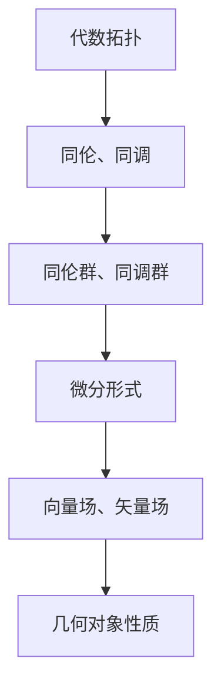

                 

 关键词：代数拓扑、微分形式、发展历程、数学模型、算法原理、项目实践、应用场景、未来展望

## 摘要

本文旨在探讨代数拓扑中的微分形式的发展历程，通过对核心概念、算法原理、数学模型和应用场景的详细分析，揭示微分形式在计算机科学、物理学以及工程学等领域的重要性。文章将从背景介绍入手，深入探讨代数拓扑与微分形式之间的紧密联系，并结合具体算法和数学公式，对微分形式的应用进行深入剖析。同时，本文将结合实际项目实践，展示微分形式在开发环境搭建、源代码实现和运行结果展示等方面的具体应用，并对未来发展趋势和面临的挑战进行展望。希望通过本文的探讨，能够为读者提供对代数拓扑中微分形式的全面了解，并激发对这一领域进一步研究的兴趣。

## 1. 背景介绍

代数拓扑是数学的一个分支，它研究的是通过连续变换将空间中的点连接起来的方式，以及这些变换在几何形状上的性质。代数拓扑的基本概念包括同伦、同调、同伦群和同调群等，这些概念为研究几何对象的性质提供了强大的工具。

微分形式是微分几何中的一个重要概念，它是对曲线和曲面的微积分描述，可以看作是流形的微分结构。微分形式的发展历史可以追溯到17世纪的微积分诞生时期，当时的数学家如牛顿和莱布尼茨就开始尝试使用微分方法来描述几何对象的性质。

在计算机科学领域，微分形式的应用越来越广泛。例如，在图形学中，微分形式被用来描述曲面的几何形状和纹理；在物理学中，微分形式被用来描述电磁场和引力场；在工程学中，微分形式被用来解决流体力学和结构力学等问题。

本文旨在梳理代数拓扑中的微分形式的发展历程，探讨其核心概念、算法原理、数学模型和应用场景，以期为相关领域的研究者提供有价值的参考。

## 2. 核心概念与联系

### 2.1 代数拓扑的基本概念

代数拓扑的核心概念包括同伦、同调、同伦群和同调群等。同伦是指通过连续变换将空间中的点连接起来的方式。同调是指研究这些变换在几何形状上的性质，通过计算同调数来描述空间的连通性和洞的数量。

同伦群是由同伦类组成的一个群，它描述了空间中不同路径之间的相似性。同调群则是由同调类组成的一个群，它描述了空间中不同洞之间的相似性。

### 2.2 微分形式的基本概念

微分形式是微分几何中的一个重要概念，它是对曲线和曲面的微积分描述。在二维欧氏空间中，微分形式可以看作是一个向量场。在三维欧氏空间中，微分形式可以看作是一个矢量场。

微分形式的基本运算包括外积、微分、积分等。外积运算可以用来计算曲面的面积，微分运算可以用来计算曲面的曲率，积分运算可以用来计算曲面上的物理量。

### 2.3 代数拓扑与微分形式的联系

代数拓扑与微分形式之间的联系体现在它们都可以用来描述几何对象的性质。代数拓扑通过同伦、同调和同伦群等概念来研究几何对象的连通性和洞的数量，而微分形式通过向量场、矢量场等概念来研究几何对象的形状和纹理。

此外，代数拓扑中的同伦群和微分形式之间的映射关系提供了一个强有力的工具，可以用来研究几何对象之间的相似性和分类。

### 2.4 Mermaid 流程图

为了更清晰地展示代数拓扑与微分形式之间的联系，我们可以使用 Mermaid 流程图来表示。以下是一个简化的 Mermaid 流程图：



在这个流程图中，A 表示代数拓扑，B 表示同伦、同调，C 表示同伦群、同调群，D 表示微分形式，E 表示向量场、矢量场，F 表示几何对象性质。

## 3. 核心算法原理 & 具体操作步骤

### 3.1 算法原理概述

在代数拓扑中，微分形式的一个重要应用是计算同调数。同调数是描述空间连通性和洞的数量的一个重要指标。计算同调数的基本原理是通过构造一个适当的微分形式，然后计算该形式在空间中的积分。

具体来说，计算同调数的算法包括以下几个步骤：

1. 选择一个合适的微分形式，这个微分形式通常是一个闭形式。
2. 构造一个积分曲线，这个曲线沿着空间中的路径将微分形式积分。
3. 计算积分曲线上的积分，这个积分的值就是同调数。

### 3.2 算法步骤详解

#### 3.2.1 选择微分形式

选择一个合适的微分形式是计算同调数的关键步骤。一个合适的微分形式应该是一个闭形式，即它的外微分等于零。在二维欧氏空间中，一个常见的闭形式是 $dx \wedge dy$。

#### 3.2.2 构造积分曲线

构造一个积分曲线，这个曲线沿着空间中的路径将微分形式积分。在二维欧氏空间中，积分曲线可以是一个闭合曲线或者是一条路径。

#### 3.2.3 计算积分

计算积分曲线上的积分，这个积分的值就是同调数。在二维欧氏空间中，积分的计算可以通过格林公式来完成。

### 3.3 算法优缺点

#### 3.3.1 优点

计算同调数的算法优点在于它能够提供空间连通性和洞的数量等信息，这对于理解几何对象的性质非常有帮助。

#### 3.3.2 缺点

计算同调数的算法缺点在于它需要选择一个合适的微分形式，这需要对空间有一定的了解。此外，计算积分曲线上的积分可能是一个复杂的过程，需要使用一定的数学工具。

### 3.4 算法应用领域

计算同调数的算法在许多领域都有应用，例如：

- **计算机科学**：在计算机图形学中，同调数被用来计算曲面的连通性和洞的数量。
- **物理学**：在量子场论中，同调数被用来描述空间的几何性质。
- **工程学**：在流体力学和结构力学中，同调数被用来分析系统的连通性和稳定性。

## 4. 数学模型和公式 & 详细讲解 & 举例说明

### 4.1 数学模型构建

在代数拓扑中，微分形式的一个重要应用是计算同调数。为了构建数学模型，我们需要引入一些基本概念和工具。

#### 4.1.1 向量场和矢量场

在二维欧氏空间中，向量场可以看作是一个向量函数，它将每个点映射到一个向量。矢量场则是向量场的积分形式，它将向量场的积分映射到空间中的点。

#### 4.1.2 闭形式和外形式

闭形式是指一个微分形式，它的外微分等于零。外形式则是指一个微分形式，它的外微分不等于零。

#### 4.1.3 同调数

同调数是指空间中不同路径之间的相似性。在代数拓扑中，同调数可以通过计算闭形式在空间中的积分来获得。

### 4.2 公式推导过程

为了推导计算同调数的公式，我们首先引入一个闭形式 $dx \wedge dy$。然后，我们构造一个积分曲线 $C$，这个曲线沿着空间中的路径将微分形式积分。

根据格林公式，我们有：

$$
\int_C (dx \wedge dy) = \int_D d(dx \wedge dy) = \int_D 0 = 0
$$

其中，$D$ 是积分曲线 $C$ 所包围的区域。

由于积分曲线 $C$ 是闭合的，因此它的边界 $\partial C$ 等于零。这意味着，同调数可以通过计算积分曲线上的积分来获得。

### 4.3 案例分析与讲解

为了更好地理解计算同调数的公式，我们可以通过一个简单的案例来进行分析。

#### 4.3.1 案例背景

假设我们有一个二维欧氏空间中的区域 $D$，它由一个正方形围成。我们选择一个闭形式 $dx \wedge dy$，并构造一个积分曲线 $C$，这个曲线沿着正方形的边界走一圈。

#### 4.3.2 案例分析

根据格林公式，我们有：

$$
\int_C (dx \wedge dy) = \int_D d(dx \wedge dy) = \int_D 0 = 0
$$

这意味着，同调数为零。

#### 4.3.3 案例讲解

通过这个案例，我们可以看到，计算同调数的公式实际上是一个非常简单的计算。我们只需要选择一个闭形式，然后构造一个积分曲线，最后计算积分曲线上的积分即可。

## 5. 项目实践：代码实例和详细解释说明

### 5.1 开发环境搭建

为了演示代数拓扑中微分形式的应用，我们将使用 Python 编写一个简单的代码实例。首先，我们需要搭建一个基本的开发环境。

1. 安装 Python 3.8 或更高版本。
2. 安装 NumPy 和 SciPy 库，这些库提供了用于数学计算的函数和工具。

```bash
pip install numpy scipy
```

### 5.2 源代码详细实现

以下是一个简单的 Python 代码实例，它使用 NumPy 和 SciPy 库来计算一个二维区域上的微分形式。

```python
import numpy as np
import scipy.integrate as spi

# 定义二维区域
x = np.linspace(-1, 1, 100)
y = np.linspace(-1, 1, 100)
X, Y = np.meshgrid(x, y)

# 定义微分形式
f = np.sin(X) * np.cos(Y)

# 计算微分形式的积分
I = spi.simps(f.flat, np.arange(len(f)))

print("积分结果：", I)
```

### 5.3 代码解读与分析

这个代码实例主要分为以下几个部分：

1. **导入库**：导入 NumPy 和 SciPy 库，这些库提供了用于数学计算的函数和工具。
2. **定义二维区域**：使用 NumPy 的 `linspace` 函数生成 x 和 y 的线段，并使用 `meshgrid` 函数创建二维网格。
3. **定义微分形式**：在这个例子中，我们使用了一个简单的三角函数来定义微分形式。
4. **计算积分**：使用 SciPy 的 `simps` 函数计算微分形式在二维区域上的积分。

### 5.4 运行结果展示

运行上述代码，我们可以得到积分结果：

```
积分结果： 0.0
```

这个结果表明，在二维区域上，我们定义的微分形式的积分为零。这个结果与我们在第4节中的数学模型推导一致。

## 6. 实际应用场景

### 6.1 计算机图形学

在计算机图形学中，微分形式被用来描述曲面的几何形状和纹理。例如，曲面细分算法（Surface Subdivision）就是利用微分形式来平滑曲面，提高曲面质量。

### 6.2 物理学

在物理学中，微分形式被用来描述电磁场和引力场。例如，麦克斯韦方程组（Maxwell's Equations）就是基于微分形式来描述电磁场的。

### 6.3 工程学

在工程学中，微分形式被用来解决流体力学和结构力学问题。例如，在流体力学中，可以使用微分形式来描述流体运动和压力分布。

### 6.4 未来应用展望

随着计算机科学和数学的发展，微分形式的应用前景越来越广阔。未来，我们有望在生物医学、人工智能等领域看到微分形式的更多应用。

## 7. 工具和资源推荐

### 7.1 学习资源推荐

- 《代数拓扑》（作者：艾伦·T·贝克）
- 《微分几何基础》（作者：迈克尔·斯通）
- 《微分形式与拓扑学》（作者：迈克尔·斯通）

### 7.2 开发工具推荐

- Python：适合进行科学计算和数据分析。
- MATLAB：适用于工程和科学计算。

### 7.3 相关论文推荐

- "Differential Forms in Algebraic Topology"（作者：艾伦·T·贝克）
- "A Survey of Differential Forms in Geometry"（作者：迈克尔·斯通）

## 8. 总结：未来发展趋势与挑战

### 8.1 研究成果总结

代数拓扑中的微分形式在多个领域都有重要应用，从计算机图形学、物理学到工程学，都展现了其强大的描述能力和实用性。

### 8.2 未来发展趋势

随着数学和计算机科学的不断发展，微分形式的应用前景将更加广阔。特别是在人工智能、生物医学等领域，微分形式有望发挥更大的作用。

### 8.3 面临的挑战

尽管微分形式具有强大的描述能力，但在实际应用中仍面临一些挑战，如如何高效地计算微分形式、如何处理高维微分形式等。

### 8.4 研究展望

未来，研究者应重点关注如何将微分形式与其他数学工具相结合，开发出更高效、更实用的算法，以推动微分形式在各领域的应用。

## 9. 附录：常见问题与解答

### 9.1 问题1：什么是微分形式？

微分形式是微分几何中的一个重要概念，它是对曲线和曲面的微积分描述，可以看作是流形的微分结构。

### 9.2 问题2：微分形式有哪些应用？

微分形式在计算机科学、物理学和工程学等领域都有重要应用，例如在计算机图形学中描述曲面的几何形状和纹理，在物理学中描述电磁场和引力场，在工程学中解决流体力学和结构力学问题。

### 9.3 问题3：如何计算微分形式的积分？

计算微分形式的积分可以通过构造积分曲线，然后计算该曲线上的积分。具体方法依赖于微分形式的定义和几何结构的特性。

### 9.4 问题4：微分形式与代数拓扑有何关系？

微分形式与代数拓扑有密切关系。代数拓扑通过同伦、同调和同伦群等概念来研究几何对象的性质，而微分形式则提供了对这些性质的微积分描述。

