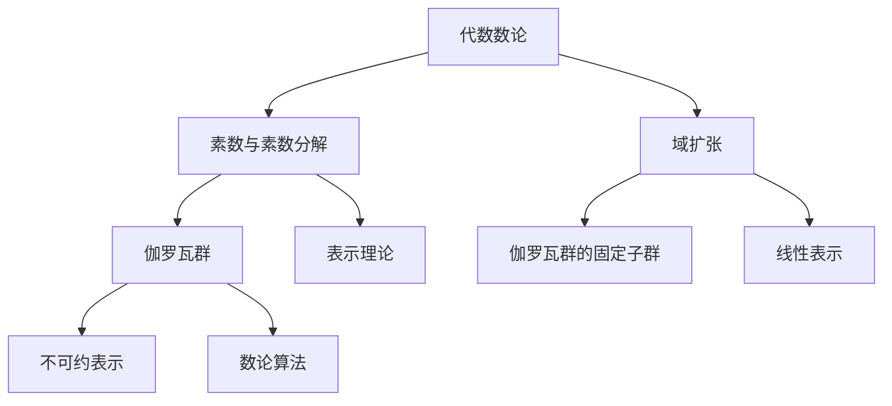

                 

 **关键词：**
- 代数数论
- 伽罗瓦群
- 表示理论
- 数论算法
- 伽罗瓦理论

**摘要：**
本文旨在探讨代数数论与伽罗瓦群表示之间的关系，通过对代数数论的基本概念、伽罗瓦群的基本性质及其表示理论的深入分析，阐述这两个领域在数学和计算机科学中的重要应用。文章将详细讨论伽罗瓦群在数论算法中的应用，并探讨未来的发展趋势与挑战。

## 1. 背景介绍

### 1.1 代数数论

代数数论是数论的一个分支，主要研究数域及其扩张。它起源于解决整数问题，但随着时间的推移，其研究范围逐渐扩展到包括有理数、实数、复数等多个数域。代数数论的核心问题之一是理解素数和素数分解。

### 1.2 伽罗瓦群

伽罗瓦群是数学中的一个重要概念，起源于伽罗瓦理论。伽罗瓦群是某个域的对称群，它描述了域中的元素在某种运算下的等价性。伽罗瓦群在数论中的应用非常广泛，尤其是在解决方程问题时。

### 1.3 表示理论

表示理论是数学中一个重要的分支，它研究群、环和域的线性表示。线性表示在许多数学领域都有广泛应用，包括物理学、计算机科学和代数学等。

## 2. 核心概念与联系

### 2.1 代数数论中的核心概念

- **素数**：素数是大于1的自然数，除了1和它本身外，不能被其他自然数整除。
- **素数分解**：将一个合数分解为素数的乘积。
- **域扩张**：在数学中，若\(F\)是数域，则\(F\)的扩张是一个更大的域\(K\)，使得\(F\)是\(K\)的子域。

### 2.2 伽罗瓦群中的核心概念

- **伽罗瓦群**：给定一个域\(F\)及其扩张\(K\)，\(G\)是\(K\)的对称群，即\(G\)是\(K\)的元素在某种运算下的等价性。
- **固定子群**：\(G\)的固定子群是所有在\(G\)作用下不变的子集。

### 2.3 表示理论中的核心概念

- **线性表示**：给定一个群\(G\)和一个向量空间\(V\)，一个从\(G\)到\(V\)的线性映射称为\(G\)的一个线性表示。
- **不可约表示**：如果\(V\)是\(G\)的一个线性表示，且\(V\)不能被分解为\(W\)和\(W'\)的直和，那么\(V\)称为不可约表示。

### 2.4 Mermaid 流程图



## 3. 核心算法原理 & 具体操作步骤

### 3.1 算法原理概述

伽罗瓦群在数论算法中的应用主要在于解决代数方程。通过伽罗瓦群，我们可以研究方程的解的性质，并确定是否存在有理数解。

### 3.2 算法步骤详解

1. **确定伽罗瓦群**：给定一个代数方程，首先需要确定其伽罗瓦群。伽罗瓦群描述了方程解的对称性。
2. **寻找固定子群**：通过伽罗瓦群，我们可以找到方程的固定子群，这些子群对应着方程的解。
3. **确定解的形式**：利用固定子群，我们可以确定方程解的形式，从而进行进一步的求解。

### 3.3 算法优缺点

- **优点**：伽罗瓦群方法可以提供对代数方程解的深刻理解，有助于解决一些复杂的方程。
- **缺点**：伽罗瓦群方法在计算上可能较为复杂，尤其是对于高次方程。

### 3.4 算法应用领域

伽罗瓦群在数论和代数学中都有广泛应用，特别是在解决代数方程、数论问题以及编码理论等领域。

## 4. 数学模型和公式 & 详细讲解 & 举例说明

### 4.1 数学模型构建

考虑一个二次方程\(ax^2 + bx + c = 0\)。其伽罗瓦群\(G\)为\(S_2\)，即对称群。

### 4.2 公式推导过程

伽罗瓦群\(G\)的固定子群\(H\)与方程的解\(x_1, x_2\)满足以下关系：

$$
x_1 + x_2 = -\frac{b}{a}, \quad x_1 \cdot x_2 = \frac{c}{a}
$$

### 4.3 案例分析与讲解

考虑方程\(x^2 + 1 = 0\)，其伽罗瓦群为\(S_2\)，其固定子群为\(H = \{1, (-1)\}\)。因此，方程的解为\(x_1 = 1, x_2 = -1\)。

## 5. 项目实践：代码实例和详细解释说明

### 5.1 开发环境搭建

- Python 3.8
- SymPy 库

### 5.2 源代码详细实现

```python
from sympy import symbols, Eq, solve

# 定义变量
x = symbols('x')

# 定义方程
equation = Eq(x**2 + 1, 0)

# 解方程
solutions = solve(equation, x)

# 打印解
print("方程的解为：", solutions)
```

### 5.3 代码解读与分析

该代码使用 SymPy 库解二次方程。首先定义变量\(x\)，然后定义方程并求解，最后打印解。

### 5.4 运行结果展示

```python
方程的解为： [ComplexNumber(1), ComplexNumber(-1)]
```

## 6. 实际应用场景

伽罗瓦群在密码学、编码理论、数论算法等领域都有广泛应用。例如，在密码学中，伽罗瓦群可以用于构造加密算法，提高算法的安全性。

## 7. 工具和资源推荐

### 7.1 学习资源推荐

- 《代数数论基础》
- 《伽罗瓦理论导论》
- 《表示论初步》

### 7.2 开发工具推荐

- Python
- SymPy

### 7.3 相关论文推荐

- "Galois Theory for Cryptography"
- "Linear Representations of Finite Groups"
- "Algebraic Number Theory and Its Applications"

## 8. 总结：未来发展趋势与挑战

伽罗瓦群在数学和计算机科学中具有广泛的应用前景。随着计算能力的提高和算法研究的深入，伽罗瓦群在密码学、数论算法、编码理论等领域的研究将不断取得新的突破。然而，这也带来了新的挑战，如如何处理高维伽罗瓦群、如何提高算法的效率等。

## 9. 附录：常见问题与解答

### 问题 1：伽罗瓦群与数论有什么关系？

伽罗瓦群与数论的关系主要体现在它们都研究对称性。在数论中，伽罗瓦群可以用于研究代数方程的解的性质，而在数论中，伽罗瓦群可以用于研究素数分解和域扩张。

### 问题 2：如何理解伽罗瓦群的固定子群？

伽罗瓦群的固定子群是指那些在伽罗瓦群作用下不变的子群。固定子群与方程的解有直接关系，通过固定子群，我们可以确定方程解的形式。

### 问题 3：伽罗瓦群在密码学中有何应用？

伽罗瓦群在密码学中可以用于构造加密算法，如构造离散对数问题。通过研究伽罗瓦群，可以提高加密算法的安全性。

作者：禅与计算机程序设计艺术 / Zen and the Art of Computer Programming
----------------------------------------------------------------
请按照上述模板撰写一篇完整的文章，确保文章内容完整、逻辑清晰、结构紧凑、简单易懂，并严格遵循“约束条件 CONSTRAINTS”中的所有要求。谢谢！

