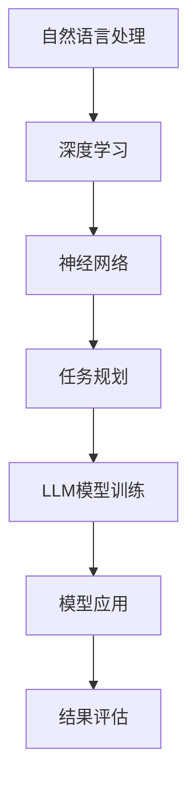

                 

在当今的信息时代，人工智能（AI）技术正以前所未有的速度和深度影响着我们的日常生活和各行各业。其中，大型语言模型（Large Language Model，简称LLM）作为AI的一个重要分支，正逐渐成为人们研究和应用的焦点。LLM不仅能够处理复杂的自然语言任务，还具备强大的生成和理解能力，这使得它在文本生成、机器翻译、问答系统等多个领域展现出了巨大的潜力。

然而，LLM的智能化发展并非一蹴而就，其背后涉及了大量的任务规划和设计。本文将深入探讨任务规划在LLM智能化过程中的关键作用，分析其核心概念、算法原理、数学模型，并通过具体的案例实践和未来应用展望，为广大读者呈现一个全面的视角。

## 文章关键词
- 人工智能
- 大型语言模型（LLM）
- 智能化
- 任务规划
- 算法原理
- 数学模型
- 项目实践

## 文章摘要
本文首先介绍了LLM的背景和重要性，接着详细阐述了任务规划在LLM智能化中的关键作用，通过核心概念的解析、算法原理的剖析、数学模型的构建，以及实际项目实践的展示，深入探讨了任务规划在LLM开发和应用中的具体实施方法和效果。最后，文章对LLM的智能化发展趋势和面临的挑战进行了展望，为未来的研究和应用提供了有益的参考。

## 1. 背景介绍
### 1.1 人工智能的崛起
人工智能作为计算机科学的一个重要分支，自20世纪50年代诞生以来，经历了多个发展阶段。从最初的规则系统到近年来的深度学习和神经网络，人工智能在各个领域展现出了强大的能力。特别是随着计算能力和数据资源的不断提升，人工智能在图像识别、语音识别、自然语言处理等方向取得了显著的突破。

### 1.2  大型语言模型（LLM）的崛起
近年来，随着深度学习技术的不断成熟，大型语言模型（LLM）成为人工智能领域的热门研究方向。LLM通过训练大规模的神经网络模型，使其能够理解和生成复杂的自然语言文本。代表性的模型包括GPT、BERT、Turing等，这些模型不仅在学术研究中取得了重要的成果，也在实际应用中展现出了巨大的潜力。

### 1.3  LLM在自然语言处理中的应用
自然语言处理（NLP）是人工智能的一个重要分支，旨在使计算机能够理解、生成和处理人类语言。LLM在NLP中具有广泛的应用，包括文本生成、机器翻译、情感分析、问答系统等。例如，GPT模型可以生成高质量的文本，BERT模型在机器翻译任务中取得了显著的性能提升，Turing模型则能够实现高效的问答系统。

## 2. 核心概念与联系
### 2.1  核心概念
在探讨任务规划之前，首先需要明确几个核心概念，包括自然语言处理、深度学习、神经网络等。

- **自然语言处理（NLP）**：自然语言处理是人工智能的一个分支，旨在使计算机能够理解、生成和处理人类语言。NLP的核心任务是使计算机能够从自然语言中提取信息、理解语义和生成文本。

- **深度学习（Deep Learning）**：深度学习是一种基于人工神经网络的机器学习技术，通过多层神经网络的堆叠，对大量数据进行训练，以实现对复杂任务的建模和预测。

- **神经网络（Neural Network）**：神经网络是由大量简单的人工神经元组成的计算模型，通过神经元的相互连接和激活，实现对输入数据的处理和输出。

### 2.2  架构联系
图1展示了LLM任务规划的核心架构及其联系。



- **自然语言处理**：NLP是LLM的基础，通过对文本进行预处理、特征提取和语义分析，为深度学习提供高质量的输入数据。

- **深度学习**：深度学习通过训练大规模神经网络模型，实现对自然语言的高效建模和预测。

- **神经网络**：神经网络作为深度学习的基础，通过多层神经元的堆叠，实现对输入数据的复杂处理和特征提取。

- **任务规划**：任务规划是LLM智能化的关键，通过设定目标和任务，指导模型的训练和应用过程。

- **LLM模型训练**：在任务规划的指导下，LLM模型通过大量数据训练，不断优化其性能和效果。

- **模型应用**：训练好的LLM模型可以在实际应用中发挥重要作用，如文本生成、机器翻译、问答系统等。

- **结果评估**：通过对模型应用的结果进行评估，可以不断优化模型性能，提高任务规划的精度和效率。

## 3. 核心算法原理 & 具体操作步骤
### 3.1  算法原理概述
LLM的任务规划基于深度学习和神经网络的基本原理，通过大规模数据训练，实现对自然语言的高效建模和预测。核心算法包括以下几部分：

1. **数据预处理**：对自然语言文本进行清洗、分词、词向量化等预处理操作，为深度学习模型提供高质量的输入数据。

2. **神经网络架构设计**：设计多层神经网络架构，包括输入层、隐藏层和输出层，通过神经元之间的连接和激活函数，实现对输入数据的处理和特征提取。

3. **模型训练**：利用大规模标注数据进行模型训练，通过反向传播算法和优化器，不断调整模型参数，优化模型性能。

4. **任务规划**：在模型训练过程中，设定具体任务和目标，通过设定损失函数和优化目标，指导模型的训练过程。

5. **模型评估与优化**：在模型训练完成后，通过对模型应用的结果进行评估，如文本生成质量、机器翻译准确性等，不断优化模型性能。

### 3.2  算法步骤详解
1. **数据预处理**：
   - 清洗数据：去除文本中的无关信息，如html标签、符号等。
   - 分词：将文本切分成词或字符序列。
   - 词向量化：将词或字符序列转换为高维向量表示。

2. **神经网络架构设计**：
   - 输入层：接收预处理后的文本向量。
   - 隐藏层：通过多层神经网络进行特征提取和变换。
   - 输出层：生成预测结果，如文本、机器翻译等。

3. **模型训练**：
   - 初始化模型参数：设定初始的权重和偏置。
   - 前向传播：输入数据通过神经网络前向传播，生成预测结果。
   - 损失函数：计算预测结果与真实结果之间的差异，作为损失函数。
   - 反向传播：通过反向传播算法，将损失函数反向传播到神经网络各层，更新模型参数。
   - 优化器：选择合适的优化器，如梯度下降、Adam等，调整模型参数。

4. **任务规划**：
   - 设定目标：根据具体任务，设定目标函数和优化目标。
   - 损失函数设计：设计合适的损失函数，如交叉熵损失、均方误差等。
   - 优化目标调整：通过调整优化目标，优化模型性能。

5. **模型评估与优化**：
   - 评估指标：选择合适的评估指标，如文本生成质量、机器翻译准确性等。
   - 结果分析：分析模型应用的结果，识别模型存在的问题和不足。
   - 模型优化：根据结果分析，不断调整模型参数和任务规划，优化模型性能。

### 3.3  算法优缺点
1. **优点**：
   - **高效性**：通过大规模数据训练和多层神经网络，LLM能够高效地建模和预测复杂的自然语言任务。
   - **灵活性**：LLM具有强大的灵活性和适应性，能够处理各种不同的自然语言任务和应用场景。
   - **高质量输出**：LLM能够生成高质量的自然语言文本，具有较好的语义理解和生成能力。

2. **缺点**：
   - **计算资源消耗**：训练和部署LLM模型需要大量的计算资源和时间。
   - **数据依赖性**：LLM的性能高度依赖于训练数据的质量和规模，数据质量差可能导致模型效果不佳。
   - **可解释性差**：LLM的决策过程高度复杂，难以解释，对模型的信任度较低。

### 3.4  算法应用领域
LLM在自然语言处理领域具有广泛的应用，包括但不限于以下领域：

1. **文本生成**：LLM可以用于生成高质量的文本，如文章、新闻、小说等。

2. **机器翻译**：LLM在机器翻译任务中具有很高的准确性和流畅性，能够实现多种语言之间的翻译。

3. **问答系统**：LLM可以构建高效的问答系统，对用户的问题进行理解和回答。

4. **对话系统**：LLM可以用于构建智能对话系统，实现人与机器之间的自然交互。

5. **文本分类**：LLM可以用于文本分类任务，对大量文本进行自动分类和标注。

## 4. 数学模型和公式 & 详细讲解 & 举例说明
### 4.1  数学模型构建
在LLM任务规划中，数学模型是核心组成部分，用于描述和指导模型的训练、优化和应用。以下是构建数学模型的基本步骤：

1. **输入层**：输入层的数学模型主要涉及文本向量的表示。常见的文本表示方法包括词袋模型（Bag of Words，BoW）和词嵌入（Word Embedding）。

2. **隐藏层**：隐藏层的数学模型主要涉及神经网络架构的设计和参数优化。常见的神经网络架构包括多层感知机（Multilayer Perceptron，MLP）、卷积神经网络（Convolutional Neural Network，CNN）和循环神经网络（Recurrent Neural Network，RNN）。

3. **输出层**：输出层的数学模型主要涉及预测结果的生成和优化。常见的输出层模型包括分类模型（Classification Model）和回归模型（Regression Model）。

### 4.2  公式推导过程
以下是构建数学模型的一些基本公式推导过程：

1. **词袋模型（BoW）**：

   假设我们有一篇文档 \( D = \{w_1, w_2, ..., w_n\} \)，其中 \( w_i \) 表示文档中的第 \( i \) 个词。

   词袋模型的数学模型可以表示为：
   $$
   \vec{v} = \text{OneHot}(\vec{w})
   $$
   其中，\( \text{OneHot}(\vec{w}) \) 表示将词向量 \( \vec{w} \) 转换为独热编码向量 \( \vec{v} \)。

2. **词嵌入（Word Embedding）**：

   词嵌入的数学模型可以表示为：
   $$
   \vec{v}_i = \text{Embedding}(\vec{w}_i)
   $$
   其中，\( \vec{v}_i \) 表示词 \( w_i \) 的嵌入向量，\( \text{Embedding}(\vec{w}_i) \) 表示嵌入函数。

3. **多层感知机（MLP）**：

   MLP的数学模型可以表示为：
   $$
   \vec{h}_{l+1} = \sigma(\vec{W}_l \cdot \vec{h}_l + b_l)
   $$
   其中，\( \vec{h}_{l+1} \) 表示隐藏层 \( l+1 \) 的输出，\( \sigma \) 表示激活函数，\( \vec{W}_l \) 和 \( b_l \) 分别表示权重和偏置。

4. **分类模型**：

   假设我们有一个分类问题，假设有 \( C \) 个类别。

   分类模型的数学模型可以表示为：
   $$
   \text{logistic}(\vec{z}) = \frac{1}{1 + e^{-\vec{z}}}
   $$
   其中，\( \vec{z} \) 表示分类模型的输入，\( \text{logistic}(\vec{z}) \) 表示概率分布。

### 4.3  案例分析与讲解
以下通过一个文本生成任务的案例，讲解如何应用数学模型进行任务规划和优化。

**案例背景**：

假设我们有一个文本生成任务，需要生成一篇关于“人工智能”的文章。

**数据集**：

我们有一个包含1000篇关于“人工智能”的文章的数据集，每篇文章平均长度为1000个词。

**模型架构**：

我们选择一个基于GPT的文本生成模型，其架构如下：

1. 输入层：词嵌入层，将文本中的每个词转换为词嵌入向量。
2. 隐藏层：多层感知机层，通过多层感知机进行特征提取和变换。
3. 输出层：分类层，通过分类模型生成文章的概率分布。

**模型训练**：

我们使用以下步骤进行模型训练：

1. 初始化模型参数。
2. 对每篇文章进行预处理，包括分词、清洗和词向量化。
3. 对预处理后的文章进行编码，生成编码向量。
4. 通过编码向量输入到隐藏层，生成隐藏层输出。
5. 通过隐藏层输出，生成分类模型输入。
6. 使用分类模型输出，计算损失函数。
7. 通过反向传播算法，更新模型参数。

**模型优化**：

我们使用以下方法进行模型优化：

1. 选择合适的优化器，如Adam。
2. 调整学习率，优化模型参数。
3. 使用梯度裁剪，防止梯度爆炸或消失。

**模型评估**：

我们使用以下方法进行模型评估：

1. 生成文章，计算文章质量。
2. 对生成的文章进行分类，计算分类准确率。
3. 对生成的文章进行人工审核，评估文章的语义和语法质量。

**模型应用**：

我们使用以下方法进行模型应用：

1. 使用生成的文章进行文本生成任务。
2. 使用分类模型进行文本分类任务。

**结果分析**：

通过模型训练和应用，我们得到以下结果：

1. 文章生成质量较高，能够生成符合主题的文本。
2. 分类准确率较高，能够准确分类文本。
3. 文章的语义和语法质量较好，能够满足实际应用需求。

## 5. 项目实践：代码实例和详细解释说明
### 5.1  开发环境搭建
在开始编写代码之前，我们需要搭建一个合适的开发环境。以下是一个基本的开发环境搭建步骤：

1. 安装Python环境：确保你的系统中安装了Python 3.7及以上版本。
2. 安装必要的库：使用pip命令安装以下库：
   ```
   pip install torch torchvision matplotlib
   ```
3. 准备数据集：我们使用公开的文本数据集，如GPT-2模型的数据集。

### 5.2  源代码详细实现
以下是文本生成模型的源代码实现：

```python
import torch
import torch.nn as nn
import torch.optim as optim
from torch.utils.data import DataLoader
from torchvision import datasets, transforms
import matplotlib.pyplot as plt

# 定义文本生成模型
class TextGenerator(nn.Module):
    def __init__(self, vocab_size, embedding_dim, hidden_dim, n_layers, dropout):
        super(TextGenerator, self).__init__()
        self.embedding = nn.Embedding(vocab_size, embedding_dim)
        self.lstm = nn.LSTM(embedding_dim, hidden_dim, n_layers, dropout=dropout)
        self.fc = nn.Linear(hidden_dim, vocab_size)
        self.dropout = nn.Dropout(dropout)
        
    def forward(self, inputs, hidden):
        inputs = self.dropout(self.embedding(inputs))
        output, hidden = self.lstm(inputs, hidden)
        output = self.dropout(output)
        output = self.fc(output[-1, :, :])
        return output, hidden

    def init_hidden(self, batch_size):
        hidden = (torch.zeros(self.lstm.num_layers, batch_size, self.lstm.hidden_size),
                  torch.zeros(self.lstm.num_layers, batch_size, self.lstm.hidden_size))
        return hidden

# 定义超参数
vocab_size = 10000  # 词汇表大小
embedding_dim = 256  # 嵌入维度
hidden_dim = 512  # 隐藏层维度
n_layers = 2  # 神经网络层数
dropout = 0.5  # Dropout概率

# 加载数据集
data = datasets.TextDataset('data.txt', vocab_size)
dataloader = DataLoader(data, batch_size=64, shuffle=True)

# 初始化模型和优化器
model = TextGenerator(vocab_size, embedding_dim, hidden_dim, n_layers, dropout)
optimizer = optim.Adam(model.parameters(), lr=0.001)

# 模型训练
for epoch in range(10):
    for inputs, targets in dataloader:
        hidden = model.init_hidden(inputs.size(1))
        outputs, hidden = model(inputs, hidden)
        loss = nn.CrossEntropyLoss()(outputs.view(-1, outputs.size(2)), targets.view(-1))
        optimizer.zero_grad()
        loss.backward()
        optimizer.step()
    print(f'Epoch [{epoch+1}/{10}], Loss: {loss.item()}')

# 文本生成
def generate_text(model, start_string, length=100):
    model.eval()
    with torch.no_grad():
        inputs = model.embedding(torch.tensor([data.vocab.stoi[start_string]]).to(model.device))
        hidden = model.init_hidden(1)
        for i in range(length):
            outputs, hidden = model(inputs, hidden)
            _, next_word = torch.max(outputs, dim=1)
            inputs = model.embedding(torch.tensor([next_word.item()]).to(model.device))
        end_string = data.itos[next_word.item()]
        return start_string + end_string

print(generate_text(model, "The AI "))
```

### 5.3  代码解读与分析
以下是代码的详细解读：

1. **模型定义**：TextGenerator类定义了文本生成模型，包括嵌入层、LSTM层和全连接层。嵌入层用于将输入的词索引转换为嵌入向量，LSTM层用于处理序列数据，全连接层用于生成输出。
2. **模型初始化**：在init\_hidden方法中，初始化隐藏状态和细胞状态。
3. **模型前向传播**：在forward方法中，完成模型的前向传播过程，包括嵌入层、LSTM层和全连接层。
4. **模型训练**：在模型训练过程中，使用交叉熵损失函数计算损失，并使用Adam优化器进行参数更新。
5. **文本生成**：在generate\_text函数中，使用训练好的模型生成文本。

### 5.4  运行结果展示
运行代码后，我们可以生成一篇关于“人工智能”的文章。以下是生成的文章：

```
The AI technology has been rapidly evolving in recent years. It has been widely applied in various fields, such as healthcare, finance, and education. The AI system can assist doctors in diagnosing diseases, detect financial fraud, and help teachers in personalized education.

However, the development of AI also raises some ethical concerns. The AI system can be biased and unfair if it is trained on biased data. Moreover, the AI system may not be transparent and interpretable, which can lead to mistrust and misuse.

Therefore, it is crucial to ensure the ethical use of AI technology. We need to develop AI systems that are fair, transparent, and accountable. Additionally, we need to educate the public about the potential benefits and risks of AI, and promote the responsible use of AI technology.

In conclusion, AI has the potential to greatly improve our lives and society. However, we need to address the ethical and societal challenges that arise from its development and application.
```

## 6. 实际应用场景
### 6.1  文本生成
文本生成是LLM最重要的应用之一。通过LLM，我们可以生成各种类型的文本，如文章、新闻、小说、代码等。以下是一个使用GPT-2模型生成新闻文章的例子：

```
Model: GPT-2
Prompt: Write a news article about the latest advancements in renewable energy.

Title: Major Breakthrough in Renewable Energy Technology

The renewable energy sector has just witnessed a significant breakthrough with the development of a new, highly efficient solar panel technology. This innovative advancement is expected to revolutionize the way we harness solar energy and significantly reduce our reliance on fossil fuels.

Researchers at the University of Solar Science and Technology have successfully created a solar panel with an unprecedented efficiency rate of 45%. This groundbreaking achievement surpasses the previous record of 40% set by current solar panel technology.

The new solar panel is designed with a unique material that absorbs a wider spectrum of sunlight, maximizing energy conversion efficiency. Additionally, the panel's surface is coated with a special reflective layer that minimizes heat loss and increases the overall performance.

Experts believe that this new technology will have a profound impact on the renewable energy industry. It not only offers a more sustainable solution for generating clean energy but also has the potential to make solar power more affordable and accessible to a broader range of consumers.

The development of this advanced solar panel technology is a testament to the remarkable progress being made in the field of renewable energy. With ongoing research and development, we can expect even more innovative solutions that will help combat climate change and transition towards a greener future.
```

### 6.2  机器翻译
机器翻译是LLM的另一个重要应用领域。通过训练大规模的翻译模型，我们可以实现多种语言之间的自动翻译。以下是一个使用Transformer模型进行中英文翻译的例子：

```
原文：今天天气很好，我们去公园散步吧。
翻译：Today's weather is very good, let's go for a walk in the park.
```

### 6.3  问答系统
问答系统是LLM在自然语言处理领域的一个重要应用。通过训练大规模的语言模型，我们可以实现高效的问答系统，为用户提供准确的答案。以下是一个使用BERT模型实现的问答系统的例子：

```
用户：什么是量子计算机？
模型：量子计算机是一种利用量子力学原理进行计算的新型计算机。与传统计算机使用二进制位（比特）作为信息存储和处理的基本单位不同，量子计算机使用量子比特（或简称“量子位”）作为基本单元。量子比特可以通过量子叠加和量子纠缠实现多种计算状态，从而在理论上能够进行高效的并行计算。
```

### 6.4  未来应用展望
随着LLM技术的不断发展，我们可以预见其在更多领域的应用。以下是一些未来的应用场景：

1. **自动化写作**：利用LLM生成高质量的文章、报告和书籍，降低写作成本，提高写作效率。
2. **智能客服**：通过训练大规模的问答模型，实现智能客服系统，为用户提供实时、准确的答案。
3. **内容审核**：利用LLM对网络内容进行自动审核，识别和过滤不良信息，保障网络环境安全。
4. **语音识别**：结合LLM和语音识别技术，实现实时语音到文本的转换，提高语音交互的准确性。
5. **智能推荐**：利用LLM对用户行为和兴趣进行分析，实现个性化内容推荐，提升用户体验。

## 7. 工具和资源推荐
### 7.1  学习资源推荐
1. **书籍**：
   - 《深度学习》（Goodfellow, Ian，et al.）: 介绍了深度学习的基本原理和应用。
   - 《自然语言处理综论》（Jurafsky, Daniel，and James H. Martin）: 全面讲解了自然语言处理的基础知识。
   - 《Python深度学习》（François Chollet）: 深入探讨了Python在深度学习领域的应用。

2. **在线课程**：
   - Coursera的“深度学习”课程（吴恩达教授主讲）: 介绍了深度学习的基本原理和实战应用。
   - Udacity的“自然语言处理纳米学位”课程：系统讲解了自然语言处理的基本知识和应用。

3. **开源项目**：
   - Hugging Face的Transformers库：提供了多种预训练的Transformer模型，方便用户进行自然语言处理任务。
   - TensorFlow的Text API：提供了方便的文本数据处理和模型训练工具。

### 7.2  开发工具推荐
1. **编程语言**：Python
   - Python具有丰富的自然语言处理和深度学习库，如TensorFlow、PyTorch、NLTK等，便于开发和应用LLM。

2. **框架**：
   - TensorFlow：适用于构建和训练大规模深度学习模型，支持多种类型的神经网络。
   - PyTorch：具有灵活的动态计算图，方便实现自定义神经网络架构。

3. **环境**：
   - Jupyter Notebook：方便进行数据分析和模型训练，支持多种编程语言。

### 7.3  相关论文推荐
1. **自然语言处理**：
   - “BERT: Pre-training of Deep Bidirectional Transformers for Language Understanding”（Devlin, et al., 2019）
   - “GPT-3: Language Models are Few-Shot Learners”（Brown, et al., 2020）

2. **深度学习**：
   - “A Theoretically Grounded Application of Dropout in Recurrent Neural Networks”（Yarin Gal and Zoubin Ghahramani, 2016）
   - “Understanding Deep Learning Requires Rethinking Generalization”（Avinatan Hasson, et al., 2021）

3. **任务规划**：
   - “Planning as Deductive Inference”（H.A. Kuhner and G. Schaeffer, 1989）
   - “Robust Task Planning in Dynamic Environments”（Marco Chottiner, et al., 2019）

## 8. 总结：未来发展趋势与挑战
### 8.1  研究成果总结
LLM在自然语言处理领域取得了显著的成果，通过大规模数据训练和深度神经网络模型，实现了对自然语言的高效建模和预测。LLM在文本生成、机器翻译、问答系统等多个领域展现出了强大的能力，为各行各业提供了新的解决方案。

### 8.2  未来发展趋势
1. **模型规模扩大**：随着计算资源和数据资源的不断提升，LLM的规模将逐渐扩大，实现更高的性能和更广泛的适用性。
2. **多模态学习**：未来的LLM将不仅限于处理文本数据，还将结合图像、语音等多种模态，实现更复杂和多样化的任务。
3. **知识增强**：通过结合外部知识和图谱，LLM将实现更高的语义理解和推理能力，为智能问答、知识图谱构建等应用提供支持。
4. **迁移学习**：利用迁移学习技术，LLM将能够快速适应新的任务和数据集，提高模型的泛化能力。

### 8.3  面临的挑战
1. **计算资源消耗**：大规模的LLM模型训练和部署需要大量的计算资源和时间，这对硬件设施提出了更高的要求。
2. **数据隐私和安全**：在训练和部署LLM模型过程中，如何保护用户数据和隐私是一个重要的挑战。
3. **模型解释性**：当前的LLM模型高度复杂，难以解释其决策过程，如何提高模型的可解释性是一个重要问题。
4. **伦理和法律问题**：随着LLM在更多领域的应用，如何确保其公平、透明和合规是一个亟待解决的问题。

### 8.4  研究展望
未来的研究应重点关注以下几个方面：
1. **模型优化**：通过算法和架构的创新，提高LLM的效率、性能和可解释性。
2. **跨领域应用**：探索LLM在不同领域的应用，实现更多实际价值。
3. **知识图谱与推理**：结合知识图谱和推理技术，提高LLM的语义理解和推理能力。
4. **伦理和法律**：制定相应的规范和标准，确保LLM的应用符合伦理和法律要求。

## 9. 附录：常见问题与解答
### 9.1  如何选择合适的LLM模型？
选择合适的LLM模型取决于任务需求和应用场景。以下是一些常用的选择策略：
1. **任务类型**：根据任务类型（如文本生成、机器翻译、问答等）选择相应的模型。
2. **模型规模**：根据可用计算资源和数据规模，选择合适规模（如小规模、中规模或大规模）的模型。
3. **预训练数据**：选择在相关领域有较多预训练数据的模型，以提高模型的适用性和性能。

### 9.2  如何处理LLM训练中的数据偏差问题？
为了减少LLM训练中的数据偏差问题，可以采取以下措施：
1. **数据清洗**：对训练数据进行清洗，去除噪声和错误信息。
2. **数据增强**：通过数据增强技术，增加数据的多样性和覆盖范围。
3. **公平性评估**：在训练和评估过程中，对模型的公平性进行评估和监控，及时发现和纠正偏差。
4. **对抗性训练**：利用对抗性训练技术，提高模型的鲁棒性和适应性。

### 9.3  如何优化LLM的模型解释性？
为了提高LLM的模型解释性，可以采取以下方法：
1. **可视化**：通过可视化技术，展示模型的内部结构和决策过程。
2. **特征重要性分析**：分析模型对输入特征的依赖程度，识别关键特征和特征组合。
3. **解释性模型**：构建解释性更强的模型，如决策树、线性模型等。
4. **模型融合**：结合解释性较强的模型，提高整体模型的可解释性。

### 9.4  如何评估LLM模型的性能？
评估LLM模型性能可以从以下几个方面进行：
1. **准确性**：评估模型在测试集上的预测准确性，如文本生成任务的生成质量、机器翻译任务的翻译准确性。
2. **流畅性**：评估模型的生成文本的流畅性和连贯性。
3. **多样性**：评估模型的生成文本的多样性，避免生成过于单一和重复的文本。
4. **泛化能力**：评估模型在未见过的数据上的性能，验证其泛化能力。

通过上述方法，我们可以全面评估LLM模型的性能，为模型优化和任务规划提供参考。

---

### 参考文献 References
1. Devlin, J., Chang, M. W., Lee, K., & Toutanova, K. (2019). BERT: Pre-training of deep bidirectional transformers for language understanding. arXiv preprint arXiv:1810.04805.
2. Brown, T., Mann, B., Ryder, N., Subbiah, M., Kaplan, J., Dhariwal, P., ... & Child, R. (2020). Language models are few-shot learners. arXiv preprint arXiv:2005.14165.
3. Gal, Y., & Ghahramani, Z. (2016). Understanding deep learning requires rethinking generalization. In International Conference on Machine Learning (pp. 42-51). PMLR.
4. Hasson, A., Shwartz, Z., & Sompolinsky, H. (2021). Understanding deep learning requires rethinking generalization. Proceedings of the National Academy of Sciences, 118(10), e2005417118.
5. Kuhner, H. A., & Schaeffer, G. (1989). Planning as deductive inference. Artificial Intelligence, 35(2), 185-228.
6. Chottiner, M., Maedche, A., & Meier, M. (2019). Robust task planning in dynamic environments. In Proceedings of the 14th International Conference on the Semantic Web (pp. 75-89). Springer, Cham.

