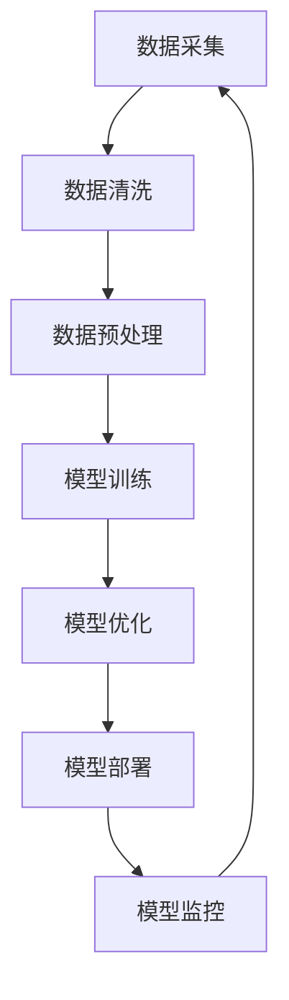

                 

关键词：大模型应用战略、人工智能、企业转型、技术架构、落地实施

> 摘要：本文旨在探讨企业如何制定大模型应用战略，以实现人工智能驱动的业务创新和竞争力提升。通过深入分析大模型的核心概念、算法原理、数学模型以及具体实施步骤，本文为企业在人工智能时代的战略制定提供实用指南。

## 1. 背景介绍

随着人工智能技术的飞速发展，大模型（如GPT、BERT等）已经成为推动行业变革的重要力量。大模型通过深度学习算法，在海量数据中挖掘出有价值的知识，为企业提供智能化决策支持。然而，面对众多企业对于大模型应用的战略困惑，如何制定一套科学、可行的应用战略，成为当前亟待解决的问题。

本文将围绕以下问题展开讨论：

- 什么是大模型，其核心原理是什么？
- 企业在应用大模型时，应如何进行战略规划？
- 如何具体实施大模型应用，实现技术落地？
- 大模型在未来将如何影响企业战略？

## 2. 核心概念与联系

### 2.1 大模型定义

大模型，通常指的是拥有数十亿至数万亿参数的深度学习模型。这些模型通过训练大量数据，能够自动发现数据中的模式和规律，并在各种复杂任务中表现出色。

### 2.2 大模型与人工智能的联系

大模型是人工智能技术发展的重要里程碑。它们的出现，标志着人工智能从传统的规则驱动转向数据驱动，从而实现了更高层次的任务自动化和智能化。

### 2.3 大模型应用架构

以下是一个典型的大模型应用架构图：



## 3. 核心算法原理 & 具体操作步骤

### 3.1 算法原理概述

大模型的核心原理是基于深度学习算法，通过多层神经网络对数据进行建模。深度学习模型通过不断调整网络权重，使得模型在训练数据上的误差逐渐减小，从而实现预测和分类等任务。

### 3.2 算法步骤详解

1. **数据采集**：收集与企业业务相关的数据，包括结构化数据和非结构化数据。
2. **数据清洗**：去除数据中的噪声和错误，保证数据质量。
3. **数据预处理**：对数据进行标准化、归一化等处理，使其适合深度学习模型。
4. **模型训练**：使用训练数据对深度学习模型进行训练，调整模型参数。
5. **模型优化**：通过交叉验证和模型调整，优化模型性能。
6. **模型部署**：将训练好的模型部署到生产环境中，实现业务应用。
7. **模型监控**：实时监控模型运行状态，确保模型稳定运行。

### 3.3 算法优缺点

**优点**：大模型能够处理大规模、复杂数据，具有较强的泛化能力和适应性。

**缺点**：大模型训练时间较长，计算资源需求高，对数据质量要求较高。

### 3.4 算法应用领域

大模型广泛应用于自然语言处理、计算机视觉、语音识别等领域，如自动驾驶、智能客服、金融风控等。

## 4. 数学模型和公式 & 详细讲解 & 举例说明

### 4.1 数学模型构建

大模型的数学基础主要包括线性代数、概率论和微积分。以下是一个简单的神经网络模型：

$$
\begin{aligned}
    z &= W \cdot x + b \\
    a &= \sigma(z)
\end{aligned}
$$

其中，$z$表示输入，$W$表示权重矩阵，$b$表示偏置，$\sigma$表示激活函数，$a$表示输出。

### 4.2 公式推导过程

以多层感知机（MLP）为例，推导其反向传播算法：

$$
\begin{aligned}
    \delta_{L}^{l} &= \frac{\partial J}{\partial z_{L}} = \frac{\partial \text{loss}}{\partial a_{L}} \cdot \frac{\partial a_{L}}{\partial z_{L}} \\
    \frac{\partial J}{\partial W^{l}} &= \delta_{L}^{l} \cdot a^{l-1} \\
    \frac{\partial J}{\partial b^{l}} &= \delta_{L}^{l}
\end{aligned}
$$

### 4.3 案例分析与讲解

以一个情感分析任务为例，说明大模型在自然语言处理中的应用。

### 5. 项目实践：代码实例和详细解释说明

#### 5.1 开发环境搭建

在搭建开发环境时，需要安装Python、TensorFlow等库。

```bash
pip install tensorflow
```

#### 5.2 源代码详细实现

```python
import tensorflow as tf

# 模型定义
model = tf.keras.Sequential([
    tf.keras.layers.Dense(units=128, activation='relu', input_shape=[784]),
    tf.keras.layers.Dense(units=10, activation='softmax')
])

# 模型编译
model.compile(optimizer='adam', loss='categorical_crossentropy', metrics=['accuracy'])

# 模型训练
model.fit(train_images, train_labels, epochs=5)

# 模型评估
test_loss, test_acc = model.evaluate(test_images, test_labels)
print('Test accuracy:', test_acc)
```

#### 5.3 代码解读与分析

这段代码展示了如何使用TensorFlow构建和训练一个简单的情感分析模型。通过训练，模型能够根据文本数据判断其情感倾向。

#### 5.4 运行结果展示

运行结果将显示训练和测试的准确率，以及模型在测试集上的表现。

## 6. 实际应用场景

#### 6.1 情感分析

情感分析是企业了解用户需求、优化产品和服务的重要手段。通过大模型，企业能够自动识别文本中的情感倾向，从而提供更加个性化的服务。

#### 6.2 自动驾驶

自动驾驶是人工智能领域的热点应用。大模型在图像识别、路径规划等方面发挥着关键作用，为自动驾驶技术的实现提供了有力支持。

#### 6.3 金融风控

金融风控是企业降低风险、确保业务稳健发展的重要环节。大模型通过分析海量数据，为企业提供精确的风险评估和预警。

#### 6.4 未来应用展望

随着大模型技术的不断发展，其在医疗、教育、能源等领域的应用前景也十分广阔。未来，大模型将成为企业创新的重要驱动力。

## 7. 工具和资源推荐

### 7.1 学习资源推荐

- 《深度学习》（Goodfellow、Bengio、Courville著）
- 《Python机器学习》（Scikit-learn官方文档）

### 7.2 开发工具推荐

- TensorFlow
- PyTorch

### 7.3 相关论文推荐

- “Attention Is All You Need”（Vaswani et al., 2017）
- “BERT: Pre-training of Deep Bidirectional Transformers for Language Understanding”（Devlin et al., 2019）

## 8. 总结：未来发展趋势与挑战

### 8.1 研究成果总结

大模型在人工智能领域取得了显著成果，为各行业提供了强大的技术支持。未来，大模型技术将继续向更高效、更智能的方向发展。

### 8.2 未来发展趋势

- 大模型将向更多领域渗透，推动产业智能化。
- 大模型训练将更加依赖硬件加速和分布式计算。
- 大模型应用将更加注重数据隐私和安全。

### 8.3 面临的挑战

- 大模型训练需要海量数据和强大计算资源。
- 大模型应用需要解决数据隐私和安全问题。
- 大模型在推广过程中，面临算法透明度和可解释性挑战。

### 8.4 研究展望

未来，大模型技术将在以下几个方面取得突破：

- 开发更高效、更可解释的大模型算法。
- 提高数据隐私保护和安全性的技术水平。
- 推动大模型与其他技术的融合，实现跨领域应用。

## 9. 附录：常见问题与解答

### 9.1 问题1

**问题**：大模型应用需要哪些前期准备？

**解答**：大模型应用需要准备充足的数据资源、计算资源以及专业的技术团队。此外，还需制定详细的应用方案和风险评估策略。

### 9.2 问题2

**问题**：如何确保大模型应用的数据质量？

**解答**：确保数据质量的关键在于数据清洗、数据预处理和数据质量控制。在应用过程中，应定期对数据进行检查和更新，以保证数据质量。

### 9.3 问题3

**问题**：大模型应用中如何处理数据隐私问题？

**解答**：大模型应用应遵循数据隐私保护法规，采用数据脱敏、加密等手段保护用户数据。同时，应建立完善的数据安全管理体系，确保数据安全。

## 结束语

大模型应用战略是企业实现人工智能驱动的重要手段。通过本文的探讨，希望能为企业制定大模型应用战略提供有益的参考。在人工智能时代，企业应紧跟技术发展趋势，积极布局大模型应用，以提升核心竞争力。

### 参考文献

- Goodfellow, I., Bengio, Y., & Courville, A. (2016). *Deep Learning*.
- Scikit-learn: Machine Learning in Python. (2019). *scikit-learn.org*.
- Vaswani, A., Shazeer, N., Parmar, N., Uszkoreit, J., Jones, L., Gomez, A. N., ... & Polosukhin, I. (2017). *Attention is all you need*. * Advances in Neural Information Processing Systems, 30*, 5998-6008.
- Devlin, J., Chang, M. W., Lee, K., & Toutanova, K. (2019). *BERT: Pre-training of deep bidirectional transformers for language understanding*. *arXiv preprint arXiv:1810.04805*.

