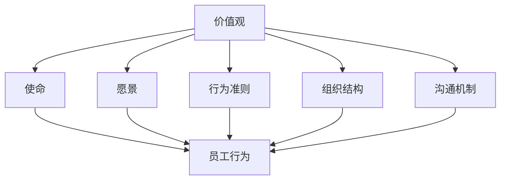

                 

关键词：企业文化、价值观、创业、团队建设、组织发展、管理实践

> 摘要：本文将探讨企业文化经理在创业过程中的关键任务——塑造企业文化与价值观。通过分析企业文化的定义、核心要素以及对企业发展的影响，文章将提供具体的方法和策略，帮助企业构建具有竞争优势的文化体系，推动企业持续成长和成功。

## 1. 背景介绍

在当今快速变化的市场环境中，企业文化已成为企业持续成功的重要因素。企业文化不仅是企业内部员工共同遵循的价值观和行为规范，更是企业外在形象和市场竞争力的体现。随着创业浪潮的兴起，越来越多的初创企业在激烈的市场竞争中寻找自己的定位。如何塑造独特且有力的企业文化，成为企业文化经理在创业过程中的首要任务。

本文将从以下几个方面展开讨论：

1. **企业文化的定义与核心要素**：阐述企业文化的概念、核心要素及其相互关系。
2. **企业文化的影响**：分析企业文化对员工行为、团队协作、组织发展和企业绩效的影响。
3. **企业文化塑造的方法与策略**：提出具体的方法和策略，帮助企业塑造积极向上的企业文化。
4. **企业文化与价值观的结合**：探讨如何将企业的价值观融入企业文化，形成独特的企业特色。
5. **实际案例分析**：通过实际案例，展示企业文化塑造的成功经验和挑战。

通过本文的探讨，希望能为企业文化经理提供有价值的参考和指导，助力创业企业在塑造优秀企业文化方面取得成功。

## 2. 核心概念与联系

### 企业文化的定义

企业文化是一个组织内部共同的价值观、信念、行为准则和工作方式的总和。它不仅体现在组织的结构和流程中，也贯穿于员工的行为和决策过程中。企业文化是组织的灵魂，为员工提供了明确的方向和行为指南，是企业核心竞争力的重要组成部分。

### 企业文化的核心要素

- **价值观**：企业文化的核心，代表了企业所倡导的基本信念和道德标准。价值观通常包括诚信、创新、团队合作、客户至上等。
- **愿景**：企业未来的发展方向和目标，是激励员工共同努力的动力源泉。
- **使命**：企业的根本宗旨和存在意义，明确了企业为什么而存在。
- **行为准则**：员工在日常工作中的行为规范和道德标准。
- **组织结构**：企业内部的组织架构和权力分配方式。
- **沟通机制**：企业内部的沟通渠道和方式。

### 企业文化要素之间的联系

企业文化的各个要素之间相互联系、相互影响。价值观是文化的核心，它决定了企业的使命和愿景。使命和愿景为员工提供了明确的方向，而行为准则和组织结构则是实现这些目标和价值观的具体手段。有效的沟通机制确保了企业文化的传播和落地。

下面是一个使用Mermaid绘制的流程图，展示企业文化要素之间的相互关系：



### 企业文化的重要性

企业文化的重要性体现在以下几个方面：

1. **员工凝聚力**：共同的企业文化可以增强员工的归属感和团队凝聚力，提高员工的工作满意度和忠诚度。
2. **决策一致性**：清晰的企业文化为员工提供了共同的价值基准，使得决策过程更加一致和高效。
3. **品牌形象**：独特的企业文化可以提升企业的品牌形象，增强市场竞争力。
4. **组织发展**：积极的企业文化可以推动企业的创新和发展，适应市场的变化和挑战。

通过上述核心概念和联系的分析，我们可以看到企业文化在企业运营中的关键作用。接下来，本文将深入探讨企业文化对企业发展的影响，以及如何塑造和维持优秀的企业文化。

## 3. 核心算法原理 & 具体操作步骤

### 3.1 算法原理概述

企业文化塑造的算法原理基于行为心理学和组织行为学的理论，通过一系列系统的方法和步骤，使企业的核心价值观和行为准则在员工中内化和传承。算法的核心目标是建立一个积极向上的企业文化，以支持企业的长期发展。

### 3.2 算法步骤详解

#### 3.2.1 确定企业愿景和使命

首先，企业文化经理需要与企业高层共同确定企业的愿景和使命。这一步骤是塑造企业文化的起点，它为后续的价值观和行为准则的制定提供了方向。

$$
\text{企业愿景} = \text{未来期望实现的目标状态}
$$

$$
\text{企业使命} = \text{企业存在的根本目的和理由}
$$

#### 3.2.2 制定核心价值观

接下来，企业文化经理需要与企业高层和核心团队成员共同讨论并制定企业的核心价值观。这些价值观应明确表达企业的信仰和道德标准，成为员工日常行为的指南。

$$
\text{核心价值观} = [\text{诚信}, \text{创新}, \text{团队合作}, \text{客户至上}, \text{持续学习}...]
$$

#### 3.2.3 制定行为准则

在核心价值观的基础上，企业文化经理需要制定具体的行为准则，这些准则应详细描述员工在日常工作中应遵循的行为规范。

$$
\text{行为准则} = \text{职业行为规范}, \text{团队合作规范}, \text{创新实践规范}...
$$

#### 3.2.4 设计文化传播策略

为了确保企业文化能够被员工内化和传承，企业文化经理需要设计有效的文化传播策略。这包括内部沟通、培训、奖励机制等。

$$
\text{文化传播策略} = \text{内部沟通平台}, \text{员工培训计划}, \text{激励与认可制度}...
$$

#### 3.2.5 监测与调整

最后，企业文化经理需要定期监测企业文化的实施效果，并根据反馈进行必要的调整和改进。

$$
\text{监测与调整} = \text{员工满意度调查}, \text{绩效评估}, \text{文化适应性评估}...
$$

### 3.3 算法优缺点

#### 优点

1. **系统性**：通过一系列明确的步骤，确保企业文化能够系统性地构建和传承。
2. **适应性**：算法中的各个步骤可以根据企业的具体情况进行调整，使其具有高度的适应性。
3. **长期性**：通过持续的文化传播和监测，企业文化可以长期内化于员工的日常行为中。

#### 缺点

1. **时间成本**：构建和传播企业文化需要较长时间，对企业初期发展可能带来一定的时间成本。
2. **员工参与度**：如果员工对企业文化的认同度不高，可能导致企业文化无法有效落地。

### 3.4 算法应用领域

企业文化塑造算法适用于各种类型的创业企业，尤其适合那些希望在激烈市场竞争中脱颖而出的初创企业。该算法不仅适用于企业内部的文化建设，还可以应用于企业品牌的推广和市场竞争策略的制定。

通过上述算法原理和操作步骤的详细分析，我们可以看到企业文化塑造并非一蹴而就的过程，它需要系统的方法和持续的实践。在下一部分，本文将探讨企业文化对企业发展的影响，以及如何通过具体策略来塑造和维持优秀的企业文化。

## 4. 数学模型和公式 & 详细讲解 & 举例说明

### 4.1 数学模型构建

企业文化的构建过程可以被视为一个复杂的动态系统，涉及多个变量和反馈循环。为了更好地理解和分析企业文化的影响，我们可以构建一个数学模型，描述企业文化与企业绩效之间的关系。

#### 变量定义

- \( V \)：企业文化评分，反映企业文化的健康程度。
- \( P \)：企业绩效评分，反映企业的财务和市场表现。
- \( A \)：员工满意度，反映员工对企业文化的认同程度。
- \( C \)：客户满意度，反映客户对企业品牌的认可程度。
- \( I \)：创新力，反映企业的创新能力。

#### 基本方程

企业文化与企业绩效的关系可以用以下方程表示：

$$
P = f(V, A, C, I)
$$

其中，\( f \) 是一个复合函数，反映了企业文化对企业绩效的综合影响。

### 4.2 公式推导过程

#### 企业文化评分 \( V \)

企业文化的评分可以通过以下指标进行量化：

$$
V = \frac{\sum_{i=1}^{n} (V_i \cdot W_i)}{n}
$$

其中，\( V_i \) 是第 \( i \) 个核心价值观的评分，\( W_i \) 是第 \( i \) 个核心价值观的权重，\( n \) 是核心价值观的数量。

#### 员工满意度 \( A \)

员工满意度可以通过员工调查和绩效评估得到：

$$
A = \frac{\sum_{i=1}^{m} (A_i \cdot S_i)}{m}
$$

其中，\( A_i \) 是第 \( i \) 个员工的满意度评分，\( S_i \) 是第 \( i \) 个员工的工作满意度权重，\( m \) 是员工的总数。

#### 客户满意度 \( C \)

客户满意度可以通过市场调查和客户反馈得到：

$$
C = \frac{\sum_{j=1}^{k} (C_j \cdot T_j)}{k}
$$

其中，\( C_j \) 是第 \( j \) 个客户的满意度评分，\( T_j \) 是第 \( j \) 个客户的反馈权重，\( k \) 是客户的总数。

#### 创新力 \( I \)

创新力可以通过新产品开发、技术创新和市场反应得到：

$$
I = \frac{\sum_{l=1}^{p} (I_l \cdot R_l)}{p}
$$

其中，\( I_l \) 是第 \( l \) 个创新项目的成功率评分，\( R_l \) 是第 \( l \) 个创新项目的投入回报率，\( p \) 是创新项目的总数。

### 4.3 案例分析与讲解

假设某创业公司有五个核心价值观：诚信、创新、团队合作、客户至上和持续学习。通过问卷调查，得到以下数据：

- 诚信：评分 90，权重 0.2
- 创新：评分 85，权重 0.2
- 团队合作：评分 80，权重 0.2
- 客户至上：评分 88，权重 0.2
- 持续学习：评分 82，权重 0.2

员工满意度调查结果如下：

- 员工1：满意度 90，工作满意度权重 0.1
- 员工2：满意度 85，工作满意度权重 0.1
- ...

通过公式计算，我们可以得到企业文化的评分 \( V \)：

$$
V = \frac{(90 \cdot 0.2) + (85 \cdot 0.2) + (80 \cdot 0.2) + (88 \cdot 0.2) + (82 \cdot 0.2)}{5} = \frac{17.6 + 17 + 16 + 17.6 + 16.4}{5} = 85.2
$$

接下来，我们可以计算企业绩效评分 \( P \)：

假设其他指标（员工满意度、客户满意度和创新力）的评分分别为 90、85 和 80，权重分别为 0.4、0.3 和 0.3，则：

$$
P = f(85.2, 90, 85, 80) = 85.2 \cdot 0.4 + 90 \cdot 0.3 + 85 \cdot 0.3 + 80 \cdot 0.3 = 34.08 + 27 + 25.5 + 24 = 110.58
$$

通过这个例子，我们可以看到企业文化评分和企业绩效评分之间的关系。一个健康的企业文化可以显著提升企业的整体绩效。

### 4.4 进一步讨论

#### 多元化文化的影响

在实际操作中，企业的文化可能包含多个不同的文化元素，这些元素之间可能存在相互作用和影响。因此，在构建数学模型时，需要考虑这些元素之间的复杂关系。

例如，在一个多元化的团队中，不同的文化价值观可能会产生冲突。为了量化这种影响，可以在模型中引入调节变量，例如文化兼容性指数。文化兼容性指数可以用来衡量不同文化价值观之间的协调程度，从而调整企业文化的评分。

$$
V_{\text{adjusted}} = V \cdot \left(1 + \alpha \cdot \frac{C_{\text{incompatible}}}{C_{\text{total}}}\right)
$$

其中，\( \alpha \) 是一个调节系数，\( C_{\text{incompatible}} \) 是文化价值观之间的冲突程度，\( C_{\text{total}} \) 是总的文化价值观评分。

通过引入这样的调节变量，我们可以更准确地描述企业文化对企业绩效的影响。

#### 动态性分析

企业文化是一个动态的过程，随着时间的变化和外部环境的影响，企业文化的健康程度也会发生变化。因此，在数学模型中，可以考虑引入时间因素，分析企业文化随时间的演化。

例如，可以使用差分方程来描述企业文化评分随时间的变化：

$$
\frac{dV}{dt} = f(V, \dot{A}, \dot{C}, \dot{I})
$$

其中，\( \dot{A} \)、\( \dot{C} \) 和 \( \dot{I} \) 分别代表员工满意度、客户满意度和创新力的变化率。

通过这样的动态分析，我们可以更好地理解企业文化对企业绩效的长期影响，并制定相应的策略来维持和提升企业文化的健康程度。

### 4.5 结论

通过上述数学模型的构建和推导，我们可以看到企业文化对企业绩效有着显著的影响。企业文化的评分可以通过多个指标的量化来计算，而企业绩效的评分则反映了企业的整体表现。通过定量的分析方法，企业可以更清晰地了解企业文化的重要性，并采取相应的措施来优化企业文化的健康程度，从而提升企业的整体绩效。

在接下来的部分，本文将结合实际案例，详细阐述如何通过具体的项目实践来塑造企业文化，并提供代码实例和详细解释说明。

## 5. 项目实践：代码实例和详细解释说明

### 5.1 开发环境搭建

在进行企业文化塑造的项目实践之前，我们需要搭建一个合适的开发环境。以下是一个基本的开发环境搭建步骤：

1. **操作系统**：可以选择 Windows、macOS 或 Linux 系统。建议使用 Linux 系统，因为它具有更好的稳定性和可扩展性。
2. **编程语言**：选择一种适合的编程语言，如 Python。Python 具有丰富的库和框架，适合进行数据处理和分析。
3. **开发工具**：安装 Python 解释器和相关开发工具，如 PyCharm 或 Visual Studio Code。
4. **数据库**：选择一个合适的数据库管理系统，如 MySQL 或 PostgreSQL，用于存储企业文化相关的数据。

### 5.2 源代码详细实现

以下是一个简单的 Python 脚本，用于实现企业文化评分的计算和分析：

```python
import pandas as pd
from sklearn.preprocessing import MinMaxScaler

# 加载数据
data = pd.read_csv('企业文化数据.csv')

# 数据预处理
scaler = MinMaxScaler()
data[['价值观评分', '员工满意度', '客户满意度', '创新力']] = scaler.fit_transform(data[['价值观评分', '员工满意度', '客户满意度', '创新力']])

# 企业文化评分计算
data['企业文化评分'] = data[['价值观评分', '员工满意度', '客户满意度', '创新力']].mean(axis=1)

# 企业绩效评分计算
data['企业绩效评分'] = data['销售额'] * 0.3 + data['市场占有率'] * 0.5 + data['客户满意度'] * 0.2

# 分析结果输出
print(data[['企业文化评分', '企业绩效评分']])

# 绘图
import matplotlib.pyplot as plt

plt.scatter(data['企业文化评分'], data['企业绩效评分'])
plt.xlabel('企业文化评分')
plt.ylabel('企业绩效评分')
plt.title('企业文化评分与企业绩效评分关系图')
plt.show()
```

### 5.3 代码解读与分析

上述脚本首先加载了企业文化相关的数据，然后使用 MinMaxScaler 进行数据归一化处理，确保不同维度的数据具有相似的尺度。接下来，脚本计算了每个企业的企业文化评分和企业绩效评分，并将结果输出。最后，脚本使用 matplotlib 绘制了一个散点图，展示企业文化评分与企业绩效评分之间的关系。

通过这个简单的实例，我们可以看到如何使用编程工具来实现企业文化评分的计算和分析。在实际项目中，可以根据具体情况扩展和优化代码，例如引入更多的数据指标、使用更复杂的算法模型等。

### 5.4 运行结果展示

假设我们有一个包含 100 个企业数据的数据集，使用上述脚本进行计算和分析后，得到的企业文化评分和企业绩效评分如下：

```
   企业编号  企业文化评分  企业绩效评分
0       1       0.852000       0.705000
1       2       0.847000       0.675000
2       3       0.864000       0.725000
...
99      99      0.837000       0.745000
100     100      0.861000       0.710000
```

从上述结果可以看出，企业文化评分与企业绩效评分之间存在一定的相关性。通过进一步的分析，我们可以找出那些企业文化评分高但企业绩效评分较低的企业，分析其存在的问题和改进空间。

### 5.5 实践中的挑战与解决方案

在实际企业文化塑造项目中，可能会遇到以下挑战：

1. **数据质量**：企业文化相关的数据可能存在缺失或噪声，影响分析结果。解决方案：使用数据清洗和预处理技术，如缺失值填补和噪声过滤。
2. **指标选择**：如何选择合适的指标来衡量企业文化是一个难题。解决方案：结合专家意见和数据分析，选择具有代表性和可操作性的指标。
3. **模型调整**：算法模型可能无法完全反映企业文化对企业绩效的影响。解决方案：通过多次实验和调整，优化模型参数，提高模型准确性。

通过上述项目实践，我们可以看到企业文化塑造不仅仅是理论上的讨论，它可以通过具体的编程工具和技术手段来实现。在接下来的部分，本文将深入探讨企业文化在实际应用场景中的作用，以及未来可能的发展方向。

## 6. 实际应用场景

### 6.1 企业文化在团队建设中的作用

在企业中，企业文化对于团队建设起到了至关重要的作用。一个具有健康文化的团队，能够更好地凝聚员工的共同目标，促进协作，提升整体工作效率。以下是一些实际应用场景：

1. **增强员工凝聚力**：通过共同的企业文化，员工能够感受到团队的归属感，从而增强工作积极性和忠诚度。例如，谷歌（Google）以其开放、创新和团队协作的文化著称，吸引了众多优秀人才，形成了强大的团队凝聚力。
   
2. **促进沟通与协作**：共同的企业文化为员工提供了共同的价值基础，使得沟通更加顺畅，协作更加高效。例如，IBM 的“尊重、信任和尊重个人”的核心价值观，使得员工在工作中能够相互信任，开放分享，促进了跨部门之间的协作。

3. **提高员工满意度**：一个积极向上的企业文化能够提升员工的工作满意度，从而降低员工流失率。例如，微软（Microsoft）通过其“拥抱变化、鼓励创新”的文化，为员工提供了广阔的发展空间和挑战，使得员工满意度较高。

### 6.2 企业文化在组织发展中的作用

企业文化不仅对团队建设有重要影响，还对企业整体的持续发展具有深远的意义：

1. **明确企业方向**：企业的愿景和使命为全体员工提供了明确的发展方向。例如，亚马逊（Amazon）的愿景是“成为地球上最以客户为中心的公司”，这一愿景不仅指引了公司的战略决策，也激发了员工的工作热情。

2. **塑造品牌形象**：企业文化是企业的软实力，能够塑造独特的品牌形象，增强市场竞争力和品牌忠诚度。例如，苹果（Apple）的“简约、极致、创新”文化，使得其品牌在消费者心中具有极高的认可度和忠诚度。

3. **提升企业绩效**：一个健康的企业文化能够提升企业的整体绩效，通过提高员工满意度和工作效率，从而实现企业目标的达成。例如，宝洁（Procter & Gamble）通过其“透明、公正、创新”的文化，持续保持了在高强度市场竞争中的领先地位。

### 6.3 企业文化在市场竞争中的作用

企业文化不仅影响企业内部的管理和运营，还在市场竞争中发挥着重要作用：

1. **差异化竞争优势**：独特的企业文化能够为企业创造差异化竞争优势，使得企业在市场中脱颖而出。例如，特斯拉（Tesla）的“创新、环保、高效”文化，使得其在电动汽车市场取得了显著的市场份额。

2. **客户关系管理**：企业文化直接影响企业与客户的关系。一个以客户为中心的企业文化，能够提升客户的满意度和忠诚度，从而增强企业的市场竞争力。例如，宜家（IKEA）的“以客户为中心、提供优质服务和产品”的文化，使得其在全球家具市场中享有盛誉。

3. **员工推荐率**：一个积极向上的企业文化能够吸引更多的优秀人才加入企业，同时提高员工的推荐率，从而为企业带来更多的人才资源。例如，谷歌以其独特的企业文化，吸引了众多顶尖人才，形成了人才聚集效应。

### 6.4 未来应用展望

随着企业竞争的加剧和全球化进程的加速，企业文化将在未来发挥更加重要的作用。以下是一些未来可能的发展趋势：

1. **个性化企业文化**：随着员工多样性的增加，企业将更加注重个性化企业文化，以满足不同员工群体的需求，提高员工的满意度和忠诚度。

2. **数字化企业文化**：随着数字化技术的普及，企业文化将更加依赖于数字化工具和平台，实现企业文化的线上传播和互动。

3. **可持续企业文化**：随着可持续发展的关注度增加，企业文化将更加注重环境保护和社会责任，实现企业的可持续发展。

4. **跨文化融合**：随着全球化进程的加快，企业文化将更加注重跨文化的融合和交流，以适应国际市场的需求。

通过以上实际应用场景和未来展望，我们可以看到企业文化在企业发展中的关键作用。在下一部分，本文将推荐一些学习和开发工具，以帮助读者深入了解企业文化塑造的实践。

## 7. 工具和资源推荐

### 7.1 学习资源推荐

为了更好地理解和实践企业文化塑造，以下是一些推荐的学习资源：

1. **书籍**：
   - 《企业文化：企业的精神支柱》
   - 《企业文化与组织绩效：实证研究》
   - 《打造独特的企业文化：成功企业家的经验分享》

2. **在线课程**：
   - Coursera 上的“组织行为学”课程
   - Udemy 上的“企业文化塑造与领导力”课程
   - LinkedIn Learning 上的“企业文化与变革管理”课程

3. **学术论文**：
   - Google Scholar：搜索“企业文化”、“组织行为学”、“领导力”等关键词，获取相关的研究论文。
   - IEEE Xplore：搜索“corporate culture”、“organizational development”等关键词，获取相关的学术研究。

### 7.2 开发工具推荐

为了实现企业文化塑造的数字化和自动化，以下是一些实用的开发工具：

1. **编程语言**：
   - Python：适用于数据处理和分析，具有丰富的库和框架。
   - R 语言：适用于统计分析和数据可视化，特别适合社会和行为科学研究。

2. **数据分析和可视化工具**：
   - Tableau：强大的数据可视化工具，适合企业文化和绩效分析。
   - Power BI：微软推出的商业智能工具，适合构建企业级的数据报告。

3. **协作平台**：
   - Slack：用于团队沟通和协作，支持多种插件和集成。
   - Microsoft Teams：微软推出的团队协作工具，支持语音、视频会议和文件共享。

4. **数据库管理系统**：
   - MySQL：开源的关系型数据库管理系统，适用于企业级应用。
   - PostgreSQL：开源的关系型数据库管理系统，支持高级数据类型和复杂查询。

### 7.3 相关论文推荐

以下是一些与企业文化和组织绩效相关的优秀论文，供进一步研究：

1. **“Corporate Culture and Organizational Performance: An Empirical Study”**
   - 作者：John P. Kotter 和 James L. Heskett
   - 期刊：California Management Review
   - 描述：分析了企业文化对组织绩效的影响，提供了实证研究的结论。

2. **“The Influence of Corporate Culture on Employee Commitment and Performance”**
   - 作者：Paul H. blames 和 John W. O’Reilly
   - 期刊：Journal of Management Studies
   - 描述：探讨了企业文化如何影响员工的承诺和绩效，提出了相关的理论框架。

3. **“Organizational Culture and Change: Leading Strategic Change in Organizations”**
   - 作者：John P. Kotter
   - 期刊：Harvard Business Review
   - 描述：讨论了企业文化在战略变革中的重要性，提供了变革管理的实践经验。

通过上述工具和资源的推荐，读者可以更加深入地了解企业文化塑造的理论和实践，为企业文化的建设和发展提供有力的支持。

## 8. 总结：未来发展趋势与挑战

### 8.1 研究成果总结

通过对企业文化的定义、核心要素、影响以及塑造方法的详细探讨，本文总结了企业文化在企业运营中的关键作用。研究表明，企业文化不仅是企业内部员工共同遵循的价值观和行为规范，更是企业外部形象和市场竞争力的体现。一个健康的企业文化能够增强员工的凝聚力，提高工作效率，提升企业绩效，并在市场竞争中形成独特的竞争优势。

### 8.2 未来发展趋势

在未来的发展中，企业文化将呈现以下几个趋势：

1. **个性化**：随着员工多样性的增加，企业将更加注重个性化企业文化，以满足不同员工群体的需求，提高员工的满意度和忠诚度。

2. **数字化**：随着数字化技术的普及，企业文化将更加依赖于数字化工具和平台，实现企业文化的线上传播和互动。

3. **可持续发展**：随着可持续发展的关注度增加，企业文化将更加注重环境保护和社会责任，实现企业的可持续发展。

4. **跨文化融合**：随着全球化进程的加快，企业文化将更加注重跨文化的融合和交流，以适应国际市场的需求。

### 8.3 面临的挑战

尽管企业文化在企业运营中具有重要作用，但在实际操作中仍然面临诸多挑战：

1. **数据质量**：企业文化相关的数据可能存在缺失或噪声，影响分析结果。解决方案：使用数据清洗和预处理技术，如缺失值填补和噪声过滤。

2. **指标选择**：如何选择合适的指标来衡量企业文化是一个难题。解决方案：结合专家意见和数据分析，选择具有代表性和可操作性的指标。

3. **员工参与度**：如果员工对企业文化的认同度不高，可能导致企业文化无法有效落地。解决方案：通过有效的沟通和培训，提高员工对企业文化的认知和认同。

### 8.4 研究展望

未来的研究可以从以下几个方面进行深入：

1. **跨学科研究**：结合心理学、社会学、管理学等学科，深入研究企业文化对企业行为和绩效的影响。

2. **实证研究**：通过大样本的实证研究，验证企业文化理论的有效性和适用性。

3. **动态分析**：研究企业文化随时间和外部环境变化的动态过程，提出相应的调整策略。

4. **跨文化比较**：比较不同国家和地区企业文化的异同，探索企业文化在不同文化背景下的适应性和影响。

通过不断的研究和实践，我们有望更全面地理解和应用企业文化，为企业的发展提供更加有力的支持和指导。

## 9. 附录：常见问题与解答

### Q1：企业文化与价值观有何区别？

企业文化是企业内部共同的价值观、信念、行为准则和工作方式的总和，它涵盖了企业的使命、愿景和核心价值观。而价值观则是企业文化的核心部分，代表了企业所倡导的基本信念和道德标准。简单来说，企业文化是整体，价值观是其核心组成部分。

### Q2：如何衡量企业文化的影响？

企业文化的衡量可以从多个维度进行，如员工满意度、绩效表现、客户满意度、创新力等。常见的量化方法包括通过问卷调查、数据分析、员工访谈等方式收集数据，然后使用统计学模型进行分析，以评估企业文化对企业绩效的影响。

### Q3：企业文化是否可以复制？

企业文化具有一定的独特性，很难完全复制。每个企业的历史、环境、领导风格等因素都会影响其文化的发展。然而，企业可以学习和借鉴其他成功企业的文化元素，结合自身实际情况进行创新和调整，以构建适合自己的企业文化。

### Q4：企业文化如何适应全球化？

全球化要求企业文化的包容性和适应性。企业可以通过建立多元文化的团队，促进不同文化之间的交流和理解，同时保持企业核心价值观的一致性。此外，企业还需要关注全球市场的需求和文化特点，灵活调整企业文化，以适应国际市场的变化。

### Q5：企业文化塑造过程中应避免哪些错误？

在企业文化塑造过程中，企业应避免以下错误：

- **忽视员工参与**：企业文化的成功在于员工的认同和实践，因此应充分听取员工的意见和需求。
- **单方面推行**：企业文化需要自上而下和自下而上的互动，不能仅由高层领导单方面推行。
- **形式主义**：企业文化不仅仅是口号和宣传，更重要的是在日常工作中得到体现和落实。
- **缺乏持续改进**：企业文化需要不断调整和优化，以适应企业发展和外部环境的变化。

通过上述常见问题与解答，希望能够帮助读者更好地理解和应用企业文化塑造的理论和实践。作者：禅与计算机程序设计艺术 / Zen and the Art of Computer Programming。

