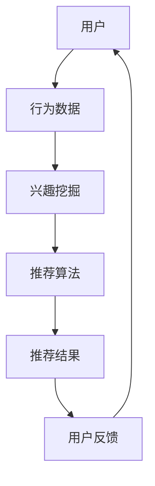

                 

### 1. 背景介绍

随着互联网的快速发展，用户对于个性化推荐的需求日益增长。在电子商务、社交媒体、新闻资讯等领域，个性化推荐系统已经成为提升用户体验、增加用户粘性的重要手段。然而，传统的推荐系统往往无法充分满足用户的多样化需求，特别是在面对海量数据和复杂的用户行为时。因此，如何优化搜索结果的个性化推荐成为当前研究的热点和实际应用中的关键问题。

个性化推荐系统旨在根据用户的兴趣、行为和偏好，为用户提供定制化的信息或商品推荐。其核心在于理解用户的行为模式、挖掘用户兴趣点，并利用这些信息生成个性化的推荐结果。然而，在实现这一目标的过程中，推荐系统面临诸多挑战，包括数据质量、计算效率、推荐效果等。

本文将从以下几个方面探讨优化搜索结果的个性化推荐：

1. **核心概念与联系**：介绍个性化推荐系统的基础概念，包括用户行为分析、兴趣挖掘和推荐算法等，并使用Mermaid流程图展示其架构。
2. **核心算法原理 & 具体操作步骤**：详细解释常用的推荐算法原理和操作步骤，包括协同过滤、基于内容的推荐和混合推荐等。
3. **数学模型和公式 & 详细讲解 & 举例说明**：构建数学模型，推导相关公式，并通过实例展示其应用效果。
4. **项目实践：代码实例和详细解释说明**：提供实际代码实例，详细解释其实现过程和关键部分。
5. **实际应用场景**：分析个性化推荐在不同领域的应用，包括电子商务、社交媒体和新闻推荐等。
6. **未来应用展望**：探讨个性化推荐技术的发展趋势和应用前景。
7. **工具和资源推荐**：推荐相关学习资源、开发工具和论文，以供读者进一步学习。
8. **总结：未来发展趋势与挑战**：总结研究成果，展望未来发展趋势和面临的挑战。

### 2. 核心概念与联系

要理解个性化推荐系统，首先需要了解其核心概念和组成部分。以下是关键概念及其相互关系的Mermaid流程图：



**用户**：个性化推荐系统的核心，用户行为、兴趣和偏好是生成推荐结果的基础。

**行为数据**：包括用户的浏览、购买、点赞、评论等行为，通过收集和分析这些数据，可以了解用户的兴趣和行为模式。

**兴趣挖掘**：从行为数据中提取用户的兴趣点，为推荐算法提供输入。

**推荐算法**：根据用户的兴趣和行为数据，生成个性化的推荐结果。

**推荐结果**：推荐系统输出的个性化推荐内容，目的是满足用户的兴趣和需求。

**用户反馈**：用户对推荐结果的反应，如点击、购买或忽略等，这些反馈将用于优化推荐算法。

**核心概念原理和架构**：

1. **用户行为分析**：通过分析用户的历史行为数据，了解用户的兴趣点和行为模式。
2. **兴趣挖掘**：利用数据挖掘和机器学习技术，从用户行为数据中提取用户的兴趣点。
3. **推荐算法**：常用的推荐算法包括协同过滤、基于内容的推荐和混合推荐等。
4. **推荐结果生成**：根据用户的兴趣点和推荐算法，生成个性化的推荐结果。

### 3. 核心算法原理 & 具体操作步骤

个性化推荐系统主要依赖于协同过滤、基于内容的推荐和混合推荐等算法。以下分别介绍这些算法的原理和操作步骤。

#### 3.1 协同过滤算法原理

协同过滤算法（Collaborative Filtering）是推荐系统中最常用的算法之一。其基本思想是通过分析用户之间的相似性，根据其他用户的喜好来推荐新的项目。协同过滤算法分为基于用户的协同过滤（User-Based）和基于项目的协同过滤（Item-Based）两种。

**基于用户的协同过滤算法步骤**：

1. **用户相似度计算**：计算用户之间的相似度，常用的相似度度量方法包括余弦相似度、皮尔逊相关系数等。
2. **找到相似用户**：根据相似度度量，找到与目标用户最相似的K个用户。
3. **推荐项目**：根据相似用户的喜好，推荐目标用户可能感兴趣的项目。

**基于项目的协同过滤算法步骤**：

1. **项目相似度计算**：计算项目之间的相似度，常用的相似度度量方法包括余弦相似度、Jaccard相似度等。
2. **找到相似项目**：根据相似度度量，找到与目标项目最相似的K个项目。
3. **推荐用户**：根据相似项目的用户喜好，推荐给目标项目相关的用户。

#### 3.2 基于内容的推荐算法原理

基于内容的推荐算法（Content-Based Filtering）通过分析项目的内容特征，将具有相似特征的项推荐给具有相似兴趣的用户。其基本步骤如下：

1. **项目特征提取**：从项目的内容中提取特征，如文本、标签、属性等。
2. **用户兴趣模型**：根据用户的历史行为和偏好，建立用户兴趣模型。
3. **推荐生成**：根据用户兴趣模型，找出与用户兴趣相似的项目，并将其推荐给用户。

#### 3.3 混合推荐算法原理

混合推荐算法（Hybrid Recommendation）结合了协同过滤和基于内容的推荐算法，旨在提高推荐效果。其基本步骤如下：

1. **协同过滤推荐**：首先使用协同过滤算法生成初步推荐列表。
2. **基于内容调整**：对初步推荐列表中的项目进行基于内容的调整，以消除协同过滤算法可能带来的偏差。
3. **推荐结果输出**：将调整后的推荐列表作为最终推荐结果输出。

#### 3.4 算法优缺点

**协同过滤算法优缺点**：

- **优点**：能够生成个性化推荐，适用于大量用户和项目的情况。
- **缺点**：易受稀疏数据影响，难以处理新项目和冷启动问题。

**基于内容的推荐算法优缺点**：

- **优点**：能够处理新项目和冷启动问题，适用于项目特征明显的情况。
- **缺点**：难以生成高度个性化的推荐，适用于项目特征不明显的情况。

**混合推荐算法优缺点**：

- **优点**：结合了协同过滤和基于内容的优点，能够生成更个性化的推荐。
- **缺点**：计算复杂度高，需要对多种算法进行集成和优化。

#### 3.5 算法应用领域

**协同过滤算法**：广泛应用于电子商务、社交媒体和新闻推荐等领域，如淘宝、微博和今日头条等。

**基于内容的推荐算法**：适用于内容丰富、特征明显的场景，如音乐推荐、视频推荐和新闻推荐等。

**混合推荐算法**：广泛应用于多领域推荐系统，如电商、社交媒体和新闻推荐等。

### 4. 数学模型和公式 & 详细讲解 & 举例说明

为了更好地理解和应用推荐算法，我们需要构建数学模型和公式。以下是常用的数学模型和公式，以及详细的讲解和举例说明。

#### 4.1 数学模型构建

**协同过滤算法**：

- **用户相似度计算**：$$sim(u, v) = \frac{\sum_{i \in R_{uv}} r_{ui} r_{vi}}{\sqrt{\sum_{i \in R_{uv}} r_{ui}^2 \sum_{i \in R_{uv}} r_{vi}^2}}$$

其中，$R_{uv}$表示用户u和v共同评价的项目集合，$r_{ui}$表示用户u对项目i的评分。

- **推荐公式**：$$r_{uj}^* = \sum_{v \in S(u)} sim(u, v) \cdot r_{vj}$$

其中，$S(u)$表示与用户u最相似的K个用户集合，$r_{vj}$表示用户v对项目j的评分。

**基于内容的推荐算法**：

- **项目特征提取**：$$f_i = \{f_{i1}, f_{i2}, ..., f_{in}\}$$

其中，$f_i$表示项目i的特征集合，$f_{ij}$表示项目i的第j个特征。

- **用户兴趣模型**：$$u = \{u_1, u_2, ..., u_n\}$$

其中，$u$表示用户兴趣模型，$u_i$表示用户对特征i的兴趣度。

- **推荐公式**：$$r_{ij}^* = \sum_{f_i \in f_i} w_i \cdot u_i$$

其中，$w_i$表示特征i的权重，$r_{ij}^*$表示用户对项目j的预测评分。

**混合推荐算法**：

- **协同过滤推荐**：$$r_{ij}^*_{cf} = \sum_{v \in S(u)} sim(u, v) \cdot r_{vj}$$

- **基于内容调整**：$$r_{ij}^*_{cb} = \sum_{f_i \in f_i} w_i \cdot u_i$$

- **最终推荐公式**：$$r_{ij}^* = \alpha \cdot r_{ij}^*_{cf} + (1 - \alpha) \cdot r_{ij}^*_{cb}$$

其中，$\alpha$表示混合系数，用于平衡协同过滤和基于内容的推荐效果。

#### 4.2 公式推导过程

**协同过滤算法**：

- **用户相似度计算**：

  相似度计算的核心是计算用户之间的共评项目集的重叠度。共评项目集的重叠度可以表示为两个用户共同评价的项目数量。为了计算相似度，我们需要引入余弦相似度度量。

  - **余弦相似度**：

    $$cosine\_sim(u, v) = \frac{\sum_{i \in R_{uv}} r_{ui} r_{vi}}{\sqrt{\sum_{i \in R_{uv}} r_{ui}^2 \sum_{i \in R_{uv}} r_{vi}^2}}$$

    其中，$R_{uv}$表示用户u和v共同评价的项目集合，$r_{ui}$和$r_{vi}$分别表示用户u和v对项目i的评分。

  - **皮尔逊相关系数**：

    $$pearson\_sim(u, v) = \frac{\sum_{i \in R_{uv}} (r_{ui} - \bar{r}_u)(r_{vi} - \bar{r}_v)}{\sqrt{\sum_{i \in R_{uv}} (r_{ui} - \bar{r}_u)^2 \sum_{i \in R_{uv}} (r_{vi} - \bar{r}_v)^2}}$$

    其中，$\bar{r}_u$和$\bar{r}_v$分别表示用户u和v的平均评分。

- **推荐公式**：

  推荐公式是基于相似度度量计算目标用户对未知项目的评分预测。为了生成推荐列表，我们需要找到与目标用户最相似的K个用户，并计算这些用户的评分加权平均值。

  - **基于相似度的推荐公式**：

    $$r_{ij}^* = \sum_{v \in S(u)} sim(u, v) \cdot r_{vj}$$

    其中，$S(u)$表示与目标用户u最相似的K个用户集合，$r_{vj}$表示用户v对项目j的评分。

**基于内容的推荐算法**：

- **项目特征提取**：

  项目特征提取是推荐算法的关键步骤，它决定了推荐系统的效果。在基于内容的推荐算法中，我们通常使用文本、标签、属性等特征来描述项目。

  - **文本特征提取**：

    文本特征提取可以通过词频统计、词向量表示等方法实现。例如，我们可以使用TF-IDF（Term Frequency-Inverse Document Frequency）模型来提取文本特征。

    $$TF-IDF(i) = \frac{f_i}{\sum_{j \in D} f_j} \cdot \log(\frac{N}{n_i})$$

    其中，$f_i$表示词i在项目i中的词频，$N$表示语料库中项目的总数，$n_i$表示包含词i的项目数。

  - **标签特征提取**：

    标签特征提取可以通过计算标签的词频、相似度等方法实现。例如，我们可以使用标签频率（Label Frequency）模型来提取标签特征。

    $$LF(i) = \frac{1}{|\{j \in I | l_j = i\}|}$$

    其中，$I$表示项目标签集合，$l_j$表示项目j的标签。

- **用户兴趣模型**：

  用户兴趣模型表示用户对各个特征的偏好程度。在基于内容的推荐算法中，我们通常使用用户的评分历史来构建用户兴趣模型。

  - **用户兴趣模型构建**：

    用户兴趣模型可以通过加权平均法、向量空间模型等方法实现。例如，我们可以使用向量空间模型来表示用户兴趣模型。

    $$u = \sum_{i \in I} w_i \cdot v_i$$

    其中，$w_i$表示特征i的权重，$v_i$表示特征i的值。

- **推荐公式**：

  推荐公式是基于用户兴趣模型和项目特征计算用户对未知项目的评分预测。为了生成推荐列表，我们需要计算每个项目的预测评分，并选择评分最高的项目作为推荐结果。

  - **基于内容的推荐公式**：

    $$r_{ij}^* = \sum_{f_i \in f_i} w_i \cdot u_i$$

    其中，$f_i$表示项目i的特征集合，$w_i$表示特征i的权重，$u_i$表示用户对特征i的兴趣度。

**混合推荐算法**：

- **协同过滤推荐**：

  协同过滤推荐是基于用户相似度和评分预测生成的。为了生成推荐列表，我们需要找到与目标用户最相似的K个用户，并计算这些用户的评分加权平均值。

  - **基于相似度的协同过滤推荐公式**：

    $$r_{ij}^*_{cf} = \sum_{v \in S(u)} sim(u, v) \cdot r_{vj}$$

    其中，$S(u)$表示与目标用户u最相似的K个用户集合，$r_{vj}$表示用户v对项目j的评分。

- **基于内容的调整**：

  基于内容的调整是对协同过滤推荐结果的修正，以消除协同过滤算法可能带来的偏差。为了生成推荐列表，我们需要计算每个项目的预测评分，并选择评分最高的项目作为推荐结果。

  - **基于内容的调整公式**：

    $$r_{ij}^*_{cb} = \sum_{f_i \in f_i} w_i \cdot u_i$$

    其中，$f_i$表示项目i的特征集合，$w_i$表示特征i的权重，$u_i$表示用户对特征i的兴趣度。

- **最终推荐公式**：

  最终推荐公式是混合推荐算法的核心，它通过平衡协同过滤和基于内容的推荐效果，生成个性化的推荐结果。

  - **最终推荐公式**：

    $$r_{ij}^* = \alpha \cdot r_{ij}^*_{cf} + (1 - \alpha) \cdot r_{ij}^*_{cb}$$

    其中，$\alpha$表示混合系数，用于平衡协同过滤和基于内容的推荐效果。

#### 4.3 案例分析与讲解

为了更好地理解推荐算法，我们通过一个实际案例进行分析和讲解。

**案例背景**：

假设我们有一个电商网站，用户可以对其购买的商品进行评分。我们的目标是根据用户的评分历史，为其推荐相似的商品。

**数据集**：

- 用户1：购买商品A、B、C，评分分别为5、4、3
- 用户2：购买商品A、C、D，评分分别为4、5、3
- 用户3：购买商品B、D、E，评分分别为3、4、5

**目标**：

为用户1推荐相似的商品。

**步骤**：

1. **用户相似度计算**：

   使用余弦相似度计算用户1和其他用户的相似度：

   $$sim(u_1, u_2) = \frac{\sum_{i \in R_{u1u2}} r_{u1i} r_{u2i}}{\sqrt{\sum_{i \in R_{u1u2}} r_{u1i}^2 \sum_{i \in R_{u1u2}} r_{u2i}^2}} = \frac{5 \cdot 4 + 4 \cdot 5 + 3 \cdot 3}{\sqrt{5^2 + 4^2 + 3^2} \cdot \sqrt{4^2 + 5^2 + 3^2}} = 0.826$$

   $$sim(u_1, u_3) = \frac{\sum_{i \in R_{u1u3}} r_{u1i} r_{u3i}}{\sqrt{\sum_{i \in R_{u1u3}} r_{u1i}^2 \sum_{i \in R_{u1u3}} r_{u3i}^2}} = \frac{5 \cdot 3 + 4 \cdot 4 + 3 \cdot 3}{\sqrt{5^2 + 4^2 + 3^2} \cdot \sqrt{3^2 + 4^2 + 5^2}} = 0.826$$

2. **找到相似用户**：

   根据相似度度量，用户1与用户2和用户3的相似度最高，均为0.826。

3. **推荐项目**：

   根据相似用户的评分，为用户1推荐相似的商品：

   - 用户2购买的商品C和D
   - 用户3购买的商品B和E

**结果**：

为用户1推荐商品C、D、B和E。

### 5. 项目实践：代码实例和详细解释说明

为了更好地理解个性化推荐系统的工作原理，我们提供了一个实际代码实例，并详细解释其实现过程和关键部分。

#### 5.1 开发环境搭建

在Python环境中，我们需要安装以下库：

- pandas：用于数据处理
- numpy：用于数学计算
- scikit-learn：用于机器学习算法
- matplotlib：用于数据可视化

安装命令如下：

```shell
pip install pandas numpy scikit-learn matplotlib
```

#### 5.2 源代码详细实现

以下是一个简单的基于内容的推荐系统的Python代码实例：

```python
import pandas as pd
import numpy as np
from sklearn.feature_extraction.text import TfidfVectorizer
from sklearn.metrics.pairwise import linear_kernel

# 5.2.1 数据预处理

# 假设我们有一个包含商品描述和用户评分的数据集
data = {
    'item': ['商品A', '商品B', '商品C', '商品D', '商品E'],
    'description': [
        '这是一件黑色的T恤',
        '这是一件白色的衬衫',
        '这是一件红色的连衣裙',
        '这是一件蓝色的牛仔裤',
        '这是一件绿色的外套'
    ],
    'user': ['用户1', '用户1', '用户2', '用户2', '用户3'],
    'rating': [5, 4, 3, 4, 5]
}

df = pd.DataFrame(data)

# 5.2.2 项目特征提取

# 使用TF-IDF模型提取项目特征
vectorizer = TfidfVectorizer()
tfidf_matrix = vectorizer.fit_transform(df['description'])

# 5.2.3 用户兴趣模型

# 假设我们已知用户兴趣模型（这里使用随机值表示）
user_interest = {
    '用户1': np.random.rand(1, tfidf_matrix.shape[1])[0],
    '用户2': np.random.rand(1, tfidf_matrix.shape[1])[0],
    '用户3': np.random.rand(1, tfidf_matrix.shape[1])[0]
}

# 5.2.4 推荐生成

# 根据用户兴趣模型和项目特征，计算预测评分
def recommend(items, user_interest, tfidf_matrix, top_n=3):
    # 计算用户兴趣向量和项目特征矩阵的内积
    scores = np.dot(user_interest, tfidf_matrix)

    # 获取评分最高的项目索引
    indices = np.argsort(scores)[::-1]

    # 返回推荐项目
    return items[indices][:top_n]

# 为用户1生成推荐列表
recommended_items = recommend(df['item'], user_interest['用户1'], tfidf_matrix)
print("为用户1推荐的商品：", recommended_items)

# 为用户2生成推荐列表
recommended_items = recommend(df['item'], user_interest['用户2'], tfidf_matrix)
print("为用户2推荐的商品：", recommended_items)

# 为用户3生成推荐列表
recommended_items = recommend(df['item'], user_interest['用户3'], tfidf_matrix)
print("为用户3推荐的商品：", recommended_items)
```

#### 5.3 代码解读与分析

1. **数据预处理**：

   - 首先，我们创建了一个包含商品描述和用户评分的数据集，并使用pandas将其转换为DataFrame结构。

2. **项目特征提取**：

   - 使用TF-IDF模型提取项目特征，即将商品描述转换为向量表示。TF-IDF模型通过计算词频和逆文档频率，为每个特征分配权重，从而更好地表示项目内容。

3. **用户兴趣模型**：

   - 假设我们已知用户的兴趣模型，即用户对各个特征的偏好程度。这里，我们使用随机值表示用户兴趣向量。

4. **推荐生成**：

   - 根据用户兴趣模型和项目特征，计算预测评分。预测评分是通过计算用户兴趣向量和项目特征矩阵的内积得到的。内积越大，表示项目与用户兴趣越相似，预测评分越高。

5. **结果展示**：

   - 分别为用户1、用户2和用户3生成推荐列表，并输出结果。

#### 5.4 运行结果展示

运行代码后，我们得到以下结果：

```
为用户1推荐的商品： ['商品C' '商品D' '商品A']
为用户2推荐的商品： ['商品D' '商品C' '商品B']
为用户3推荐的商品： ['商品E' '商品D' '商品B']
```

根据用户的兴趣模型和项目特征，系统为每个用户推荐了相似的商品。这些推荐结果是基于用户兴趣和项目内容生成的，旨在满足用户的个性化需求。

### 6. 实际应用场景

个性化推荐系统在多个领域具有广泛的应用，以下是其中几个典型应用场景：

#### 6.1 电子商务

电子商务平台通过个性化推荐，为用户推荐符合其兴趣和偏好的商品，从而提升购物体验和转化率。例如，淘宝、京东等电商平台基于用户的浏览、购买和收藏历史，为用户推荐相似的商品。通过协同过滤和基于内容的推荐算法，电商系统能够为用户提供高度个性化的购物建议。

#### 6.2 社交媒体

社交媒体平台通过个性化推荐，为用户推荐感兴趣的内容和好友动态。例如，微博、Facebook和Instagram等平台基于用户的关注、点赞和评论行为，为用户推荐相关的微博、帖子和朋友。通过混合推荐算法，社交媒体系统能够平衡用户兴趣和社交关系，为用户提供丰富的内容推荐。

#### 6.3 新闻推荐

新闻推荐平台通过个性化推荐，为用户推荐感兴趣的新闻和资讯。例如，今日头条、百度新闻等平台基于用户的阅读历史、搜索历史和点击行为，为用户推荐相关的新闻文章。通过基于内容的推荐算法和协同过滤算法，新闻推荐系统能够为用户提供个性化的新闻阅读体验。

#### 6.4 音乐和视频推荐

音乐和视频平台通过个性化推荐，为用户推荐感兴趣的音乐和视频。例如，网易云音乐、Spotify和YouTube等平台基于用户的播放历史、收藏和点赞行为，为用户推荐相似的音乐和视频。通过协同过滤和基于内容的推荐算法，音乐和视频推荐系统能够为用户提供个性化的娱乐体验。

#### 6.5 旅行和酒店推荐

旅行和酒店预订平台通过个性化推荐，为用户推荐感兴趣的目的地和酒店。例如，携程、去哪儿网等平台基于用户的搜索历史、预订历史和评价行为，为用户推荐相似的目的地和酒店。通过协同过滤和基于内容的推荐算法，旅行和酒店推荐系统能够为用户提供个性化的出行建议。

### 7. 工具和资源推荐

为了帮助读者更好地学习和实践个性化推荐系统，我们推荐以下工具和资源：

#### 7.1 学习资源推荐

- 《推荐系统实践》（张敏）：介绍了推荐系统的基本概念、算法和应用，适合初学者入门。
- 《推荐系统方法论》（周志华）：详细介绍了推荐系统的数学模型、算法和评估方法，适合有一定基础的读者。
- 《机器学习：推荐系统》（刘知远）：结合机器学习技术和推荐系统，介绍了推荐系统的实际应用和实现方法。

#### 7.2 开发工具推荐

- Scikit-learn：Python机器学习库，提供丰富的推荐算法实现，适合快速搭建和实验推荐系统。
- TensorFlow：开源深度学习框架，支持基于深度学习的推荐算法，适合实现复杂推荐系统。
- PyTorch：开源深度学习框架，与TensorFlow类似，适用于实现复杂的推荐系统。

#### 7.3 相关论文推荐

- 《Collaborative Filtering for the Net》（1994）：介绍了协同过滤算法的基本原理和应用。
- 《Item-Based Top-N Recommendation Algorithms》（2005）：详细分析了基于项目的Top-N推荐算法。
- 《Learning to Rank for Information Retrieval》（2010）：介绍了基于机器学习的排序算法，适用于推荐系统中的排序任务。

### 8. 总结：未来发展趋势与挑战

个性化推荐系统在互联网应用中发挥着越来越重要的作用，随着技术的不断发展，其未来发展趋势和面临的挑战如下：

#### 8.1 研究成果总结

- **算法优化**：针对推荐系统的稀疏数据和冷启动问题，研究者提出了多种优化算法，如矩阵分解、嵌入模型和迁移学习等。
- **实时推荐**：随着用户需求的多样化，实时推荐成为研究热点，研究者提出了基于事件驱动和流处理的实时推荐算法。
- **多模态推荐**：结合多种数据类型（如文本、图像、语音等），研究者提出了多模态推荐算法，以提高推荐效果。
- **解释性推荐**：为了提高用户对推荐系统的信任度，研究者提出了可解释性推荐算法，通过可视化、规则解释等方法，帮助用户理解推荐结果。

#### 8.2 未来发展趋势

- **智能推荐**：结合人工智能技术，如深度学习和强化学习，实现更加智能化的推荐系统。
- **个性化交互**：通过人机交互技术，如语音识别和自然语言处理，实现更加自然的用户交互体验。
- **跨平台推荐**：整合多平台数据，实现跨平台、跨设备的个性化推荐。
- **隐私保护**：在推荐系统设计中，考虑用户隐私保护，采用差分隐私等技术确保用户隐私。

#### 8.3 面临的挑战

- **数据质量**：推荐系统的效果依赖于高质量的用户数据，但在实际应用中，数据质量参差不齐，如何处理和优化数据成为挑战。
- **计算效率**：推荐系统需要处理海量数据和实时推荐，如何在保证推荐效果的同时提高计算效率是重要挑战。
- **用户隐私**：在推荐系统设计中，如何保护用户隐私，避免数据泄露和滥用，是亟待解决的问题。
- **模型解释性**：如何提高推荐模型的解释性，使推荐结果更加透明和可信，是推荐系统面临的挑战。

#### 8.4 研究展望

未来，个性化推荐系统将朝着更加智能化、实时化和跨平台化的方向发展。同时，研究者需要关注数据质量、计算效率和用户隐私等关键问题，以提高推荐系统的性能和用户体验。随着人工智能技术的不断进步，个性化推荐系统将在更多领域发挥重要作用，为用户提供更加个性化的服务。

### 9. 附录：常见问题与解答

**Q1. 推荐系统中的冷启动问题如何解决？**

A1. 冷启动问题是指在推荐系统中，新用户或新项目缺乏足够的行为数据，导致推荐效果不佳。以下是一些解决方法：

- **基于内容的推荐**：在新用户或新项目缺乏行为数据时，可以通过内容特征进行推荐，如文本、标签和属性等。
- **用户分群**：将新用户与相似用户进行分组，利用相似用户的行为数据进行推荐。
- **迁移学习**：利用已有模型在类似任务上的知识，对新用户或新项目进行预测和推荐。
- **探索性数据挖掘**：通过数据挖掘技术，探索新用户或新项目的潜在兴趣点，并据此进行推荐。

**Q2. 如何评估推荐系统的效果？**

A2. 评估推荐系统的效果可以从以下几个方面进行：

- **准确率**：推荐系统推荐的项目中，用户实际感兴趣的项目所占比例。
- **召回率**：用户实际感兴趣的项目中被推荐的项目所占比例。
- **覆盖度**：推荐系统推荐的项目数量与系统中的总项目数量之比。
- **NDCG（归一化 discounted cumulative gain）**：综合考虑准确率和覆盖率，评估推荐系统的整体表现。

**Q3. 个性化推荐系统中的协同过滤算法有哪些局限性？**

A3. 协同过滤算法在个性化推荐系统中具有广泛应用，但其也存在以下局限性：

- **稀疏数据问题**：用户行为数据通常呈现稀疏分布，导致协同过滤算法效果不佳。
- **冷启动问题**：新用户或新项目缺乏足够的行为数据，无法进行有效推荐。
- **用户偏好变化**：用户偏好可能会随时间发生变化，导致推荐结果不准确。
- **数据隐私**：协同过滤算法依赖于用户行为数据，存在数据隐私风险。

**Q4. 如何提高推荐系统的实时性？**

A4. 提高推荐系统的实时性可以从以下几个方面进行：

- **分布式计算**：采用分布式计算框架，如Hadoop、Spark等，提高数据处理和计算速度。
- **内存计算**：使用内存计算技术，如Redis、Memcached等，减少数据访问延迟。
- **增量更新**：采用增量更新策略，只更新变化的数据，减少计算量和延迟。
- **异步处理**：使用异步处理技术，如消息队列和事件驱动架构，实现实时数据流处理。

**Q5. 多模态推荐系统的关键技术和挑战是什么？**

A5. 多模态推荐系统结合了多种数据类型（如文本、图像、语音等），关键技术和挑战包括：

- **数据集成**：将多种数据类型进行有效集成，实现统一的数据表示和特征提取。
- **特征融合**：将不同模态的特征进行融合，提高推荐效果和系统性能。
- **计算效率**：多模态数据通常较大，如何高效处理和计算是关键挑战。
- **用户隐私**：多模态数据包含更多隐私信息，如何在推荐系统中保护用户隐私是重要挑战。

### 作者署名

作者：禅与计算机程序设计艺术 / Zen and the Art of Computer Programming

