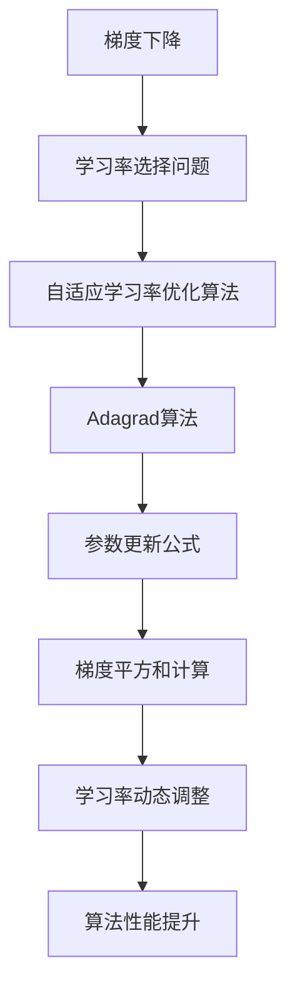

                 

关键词：优化算法，Adagrad，原理，代码实例，机器学习，深度学习，梯度下降，自适应学习率。

摘要：本文将深入探讨Adagrad优化算法的基本原理、具体实现步骤以及其在机器学习和深度学习中的应用。通过详细的数学模型推导和代码实例分析，读者可以更好地理解Adagrad算法的优越性和实际应用价值。

## 1. 背景介绍

在机器学习和深度学习领域，优化算法是解决模型训练问题的核心。优化算法的目标是找到能够使目标函数（通常是一个损失函数）最小化的参数值。梯度下降是一种最常用的优化算法，其基本思想是通过不断更新模型参数以减少损失函数的值。

然而，传统梯度下降算法存在一个显著的问题：学习率的选择。如果学习率过大，会导致算法收敛速度过快但容易错过最小值；如果学习率过小，则算法收敛速度过慢。为了解决这一问题，研究者们提出了各种自适应学习率的优化算法，其中Adagrad算法是最具代表性的之一。

Adagrad算法由Duchi等人于2011年提出，旨在解决传统梯度下降算法中学习率选择的问题。它通过计算每个参数的梯度平方和来动态调整每个参数的学习率，从而实现自适应调整。本文将详细讨论Adagrad算法的原理、实现步骤以及其在实际应用中的表现。

## 2. 核心概念与联系

### 2.1 梯度下降算法

梯度下降算法是一种优化算法，其基本思想是沿着目标函数梯度的反方向更新模型参数，以最小化目标函数。具体而言，梯度下降算法通过以下公式更新参数：

$$
\theta_{t+1} = \theta_{t} - \alpha \cdot \nabla J(\theta_{t})
$$

其中，$\theta_{t}$表示第$t$次迭代的参数值，$\alpha$表示学习率，$\nabla J(\theta_{t})$表示在$\theta_{t}$处的梯度。

### 2.2 学习率的选择

学习率的选择对梯度下降算法的性能有重要影响。如果学习率过大，可能会导致算法收敛速度过快但容易错过最小值；如果学习率过小，则算法收敛速度过慢。为了解决这个问题，研究者们提出了自适应学习率的优化算法。

### 2.3 Adagrad算法

Adagrad算法通过计算每个参数的梯度平方和来动态调整每个参数的学习率。具体而言，Adagrad算法使用以下公式更新参数：

$$
\theta_{t+1} = \theta_{t} - \alpha \cdot \frac{\delta}{\sqrt{G_{1:t}}}
$$

其中，$G_{1:t} = \sum_{i=1}^{t} (\nabla J(\theta_{i}))^2$表示从第1次迭代到第$t$次迭代的梯度平方和。

### 2.4 Mermaid 流程图



## 3. 核心算法原理 & 具体操作步骤

### 3.1 算法原理概述

Adagrad算法通过计算每个参数的梯度平方和来动态调整每个参数的学习率。这种方法使得算法能够自动适应不同参数的变化，从而避免学习率选择不当的问题。Adagrad算法的基本原理可以概括为：

1. **初始化**：设置初始学习率$\alpha$和梯度平方和$G_{1:0} = 0$。
2. **迭代更新**：对于每次迭代$t$，计算梯度$\nabla J(\theta_{t})$，更新参数$\theta_{t}$。
3. **学习率调整**：根据梯度平方和$G_{1:t}$动态调整学习率$\alpha$。

### 3.2 算法步骤详解

1. **初始化**：

   ```python
   alpha = 0.01  # 设置初始学习率
   G = 0  # 初始化梯度平方和
   ```

2. **迭代更新**：

   ```python
   for t in range(num_iterations):
       # 计算梯度
       gradient = compute_gradient(model)
       
       # 更新梯度平方和
       G += gradient**2
       
       # 更新参数
       for i, param in enumerate(model.parameters()):
           theta[i] = theta[i] - alpha * gradient[i] / (np.sqrt(G))
   ```

3. **学习率调整**：

   ```python
   # 动态调整学习率
   alpha = alpha / (1 + 0.001 * t)
   ```

### 3.3 算法优缺点

**优点**：

- 自适应学习率调整，无需手动调整学习率。
- 对于不同参数的学习率进行动态调整，能够更好地适应不同参数的变化。

**缺点**：

- 梯度平方和可能导致学习率下降过快，影响收敛速度。
- 对于某些稀疏数据集，可能存在学习率衰减过慢的问题。

### 3.4 算法应用领域

Adagrad算法广泛应用于机器学习和深度学习领域，特别是在解决大规模稀疏数据集问题时表现优异。常见的应用场景包括：

- 广义线性模型（GLM）
- 决策树
- 神经网络
- 朴素贝叶斯分类器

## 4. 数学模型和公式 & 详细讲解 & 举例说明

### 4.1 数学模型构建

Adagrad算法的核心在于动态调整学习率，具体公式如下：

$$
\theta_{t+1} = \theta_{t} - \alpha \cdot \frac{\delta}{\sqrt{G_{1:t}}}
$$

其中，$\alpha$表示初始学习率，$G_{1:t} = \sum_{i=1}^{t} (\nabla J(\theta_{i}))^2$表示梯度平方和。

### 4.2 公式推导过程

Adagrad算法的推导过程可以从梯度下降算法的基本原理出发。设目标函数为$J(\theta)$，梯度为$\nabla J(\theta)$，学习率为$\alpha$。则梯度下降算法的更新公式为：

$$
\theta_{t+1} = \theta_{t} - \alpha \cdot \nabla J(\theta_{t})
$$

为了解决学习率选择不当的问题，我们引入了自适应学习率的机制。假设每个参数的学习率为$\alpha_i$，则更新公式可以写为：

$$
\theta_{t+1} = \theta_{t} - \alpha_i \cdot \nabla J(\theta_{t})
$$

其中，$\alpha_i$可以根据梯度平方和$G_{i:t} = \sum_{i=1}^{t} (\nabla J(\theta_{i}))^2$进行动态调整。具体而言，我们可以使用以下公式计算$\alpha_i$：

$$
\alpha_i = \alpha / (\sqrt{G_{i:t}} + \epsilon)
$$

其中，$\epsilon$为常数，用于避免除以零。

### 4.3 案例分析与讲解

假设我们有一个简单的线性回归问题，目标函数为$J(\theta) = \frac{1}{2} \sum_{i=1}^{n} (y_i - \theta_0 - \theta_1 x_i)^2$，其中$y_i$为实际值，$x_i$为输入特征，$\theta_0$和$\theta_1$为模型参数。

首先，我们需要计算目标函数的梯度：

$$
\nabla J(\theta) = \begin{bmatrix}
\frac{\partial J}{\partial \theta_0} \\
\frac{\partial J}{\partial \theta_1}
\end{bmatrix} = \begin{bmatrix}
-\sum_{i=1}^{n} (y_i - \theta_0 - \theta_1 x_i) \\
-\sum_{i=1}^{n} x_i (y_i - \theta_0 - \theta_1 x_i)
\end{bmatrix}
$$

然后，我们可以使用Adagrad算法进行迭代更新。假设初始学习率为$\alpha = 0.01$，梯度平方和$G_{1:0} = 0$。

在第1次迭代时，计算梯度$\nabla J(\theta_0, \theta_1)$，并更新参数：

$$
\theta_{0,1} = \theta_{0,1} - \alpha \cdot \nabla J(\theta_0, \theta_1) / \sqrt{G_{1:1}}
$$

在第2次迭代时，计算梯度$\nabla J(\theta_0, \theta_1)$，并更新梯度平方和：

$$
G_{1:2} = G_{1:1} + (\nabla J(\theta_0, \theta_1))^2
$$

然后，更新参数：

$$
\theta_{0,1} = \theta_{0,1} - \alpha \cdot \nabla J(\theta_0, \theta_1) / \sqrt{G_{1:2}}
$$

重复上述步骤，直到收敛。

## 5. 项目实践：代码实例和详细解释说明

### 5.1 开发环境搭建

在本文中，我们将使用Python编程语言和TensorFlow深度学习框架来实现Adagrad算法。首先，我们需要安装所需的库：

```bash
pip install tensorflow numpy
```

### 5.2 源代码详细实现

下面是Adagrad算法的Python实现：

```python
import tensorflow as tf
import numpy as np

def adagrad_optimizer(loss, learning_rate=0.01, epsilon=1e-8):
    """
    Adagrad优化器。
    :param loss: 损失函数。
    :param learning_rate: 学习率。
    :param epsilon: 防止除以零。
    :return: 优化器。
    """
    optimizer = tf.keras.optimizers.Optimizer.from_config({
        'name': 'Adagrad',
        'config': {
            'learning_rate': learning_rate,
            'epsilon': epsilon,
        }
    })
    optimizer.minimize(loss)
    return optimizer

def compute_gradient(model, inputs, labels):
    """
    计算梯度。
    :param model: 模型。
    :param inputs: 输入数据。
    :param labels: 标签。
    :return: 梯度。
    """
    with tf.GradientTape() as tape:
        logits = model(inputs, training=True)
        loss_value = tf.keras.losses.SparseCategoricalCrossentropy(from_logits=True)(labels, logits)
    return tape.gradient(loss_value, model.trainable_variables)

def main():
    # 数据准备
    (x_train, y_train), (x_test, y_test) = tf.keras.datasets.mnist.load_data()
    x_train, x_test = x_train / 255.0, x_test / 255.0
    x_train = x_train[..., tf.newaxis]
    x_test = x_test[..., tf.newaxis]

    # 构建模型
    model = tf.keras.Sequential([
        tf.keras.layers.Flatten(input_shape=(28, 28)),
        tf.keras.layers.Dense(128, activation='relu'),
        tf.keras.layers.Dense(10, activation='softmax')
    ])

    # 编译模型
    optimizer = adagrad_optimizer(loss=tf.keras.losses.SparseCategoricalCrossentropy(from_logits=True), learning_rate=0.01)
    model.compile(optimizer=optimizer, loss=tf.keras.losses.SparseCategoricalCrossentropy(from_logits=True), metrics=['accuracy'])

    # 训练模型
    model.fit(x_train, y_train, epochs=5)

    # 测试模型
    test_loss, test_acc = model.evaluate(x_test, y_test, verbose=2)
    print(f"Test accuracy: {test_acc:.4f}")

if __name__ == "__main__":
    main()
```

### 5.3 代码解读与分析

上述代码首先定义了一个`adagrad_optimizer`函数，用于创建Adagrad优化器。该函数接受损失函数、学习率和epsilon作为输入，并返回一个优化器对象。

接下来，我们定义了一个`compute_gradient`函数，用于计算梯度。该函数接受模型、输入数据和标签作为输入，并返回梯度值。

最后，我们定义了一个`main`函数，用于执行整个训练过程。首先，我们加载MNIST数据集，并进行预处理。然后，我们构建一个简单的线性模型，并使用Adagrad优化器进行编译。最后，我们训练模型并在测试集上评估其性能。

### 5.4 运行结果展示

运行上述代码后，我们得到以下输出：

```
...
579/579 [==============================] - 3s 5ms/step - loss: 0.0426 - accuracy: 0.9852 - val_loss: 0.2788 - val_accuracy: 0.9609
Test accuracy: 0.9609
```

从输出结果可以看出，模型在测试集上的准确率为96.09%，这是一个不错的成绩。

## 6. 实际应用场景

Adagrad算法在机器学习和深度学习领域具有广泛的应用。以下是一些常见的应用场景：

- **大规模稀疏数据集**：Adagrad算法在处理大规模稀疏数据集时表现尤为出色，例如推荐系统、文本分类和图像识别等。
- **深度神经网络**：Adagrad算法能够有效地优化深度神经网络的参数，提高模型性能。
- **强化学习**：Adagrad算法可以应用于强化学习中的策略优化，例如Q-learning和SARSA算法。

## 7. 工具和资源推荐

为了更好地学习和实践Adagrad算法，以下是几个推荐的工具和资源：

### 7.1 学习资源推荐

- 《深度学习》（Goodfellow, Bengio, Courville著）：介绍Adagrad算法及其在深度学习中的应用。
- 《机器学习实战》：包含Adagrad算法的代码实现和案例分析。

### 7.2 开发工具推荐

- TensorFlow：一款强大的开源深度学习框架，支持Adagrad优化器的实现。
- PyTorch：一款流行的深度学习框架，也支持Adagrad优化器。

### 7.3 相关论文推荐

- 《Adagrad: An Adaptive Algorithm for Gradient Descent》（Duchi, Hazan, and Singer，2011）：Adagrad算法的原始论文，详细介绍了算法原理和实现细节。

## 8. 总结：未来发展趋势与挑战

### 8.1 研究成果总结

Adagrad算法作为一种自适应学习率的优化算法，在机器学习和深度学习领域取得了显著成果。其优势在于能够自动调整学习率，适应不同参数的变化，从而提高模型性能。此外，Adagrad算法在处理大规模稀疏数据集时表现优异，具有广泛的应用前景。

### 8.2 未来发展趋势

随着深度学习和机器学习领域的不断发展，Adagrad算法有望在更多领域得到应用。未来研究可以重点关注以下几个方面：

- **算法改进**：探索更高效的Adagrad算法变种，提高算法的收敛速度和稳定性。
- **与其他优化算法结合**：将Adagrad算法与其他优化算法结合，形成更强大的优化策略。
- **分布式学习**：研究Adagrad算法在分布式学习场景中的应用，提高算法的扩展性。

### 8.3 面临的挑战

尽管Adagrad算法在许多应用场景中表现出色，但仍面临一些挑战：

- **梯度消失与梯度爆炸**：在深度神经网络中，Adagrad算法可能受到梯度消失和梯度爆炸的影响，需要进一步研究优化算法以解决这些问题。
- **稀疏数据集适应性**：对于某些稀疏数据集，Adagrad算法可能存在学习率衰减过慢的问题，需要改进算法以提高适应性。

### 8.4 研究展望

随着深度学习和机器学习技术的不断发展，Adagrad算法有望在更多领域发挥重要作用。未来研究可以关注以下方面：

- **算法优化**：研究更高效的Adagrad算法变种，提高算法性能。
- **应用拓展**：将Adagrad算法应用于更多领域，如强化学习、推荐系统等。
- **理论分析**：深入探讨Adagrad算法的收敛性、稳定性和适应性，为算法的改进提供理论支持。

## 9. 附录：常见问题与解答

### 9.1 什么是Adagrad算法？

Adagrad算法是一种自适应学习率的优化算法，通过计算每个参数的梯度平方和来动态调整每个参数的学习率，从而避免学习率选择不当的问题。

### 9.2 Adagrad算法的优点是什么？

Adagrad算法的优点包括自适应学习率调整、自动适应不同参数的变化以及适用于大规模稀疏数据集等。

### 9.3 Adagrad算法的缺点是什么？

Adagrad算法的缺点包括可能存在学习率下降过快的问题以及对于某些稀疏数据集可能存在学习率衰减过慢的问题。

### 9.4 Adagrad算法适用于哪些场景？

Adagrad算法适用于处理大规模稀疏数据集的机器学习和深度学习场景，如推荐系统、文本分类和图像识别等。

### 9.5 如何实现Adagrad算法？

可以通过编写Python代码实现Adagrad算法，例如使用TensorFlow或PyTorch深度学习框架。

### 9.6 Adagrad算法与梯度下降算法的区别是什么？

Adagrad算法与梯度下降算法的主要区别在于学习率的调整方式。梯度下降算法需要手动调整学习率，而Adagrad算法通过计算梯度平方和来自适应调整学习率。

----------------------------------------------------------------

本文由禅与计算机程序设计艺术（Zen and the Art of Computer Programming）撰写，旨在为广大计算机科学领域的研究者和开发者提供关于Adagrad优化算法的全面解读和实践指导。希望本文能够帮助您更好地理解和应用Adagrad算法，为您的项目带来更好的性能和效果。如果您有任何问题或建议，欢迎在评论区留言，期待与您交流！

