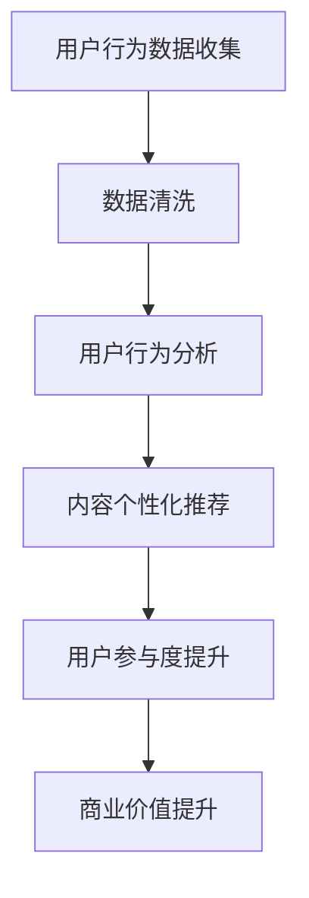

                 

关键词：注意力经济、体育产业、数据驱动、社交媒体、用户参与、商业模型创新

> 摘要：本文深入探讨了体育产业在注意力经济中的新机遇。随着社交媒体和数字技术的发展，体育产业正面临着前所未有的变革。本文从数据驱动的角度分析了体育产业如何通过优化用户参与和商业模型创新来实现可持续发展。

## 1. 背景介绍

在过去的几十年里，体育产业经历了从传统媒体到数字媒体的转变。随着互联网和智能手机的普及，体育内容从电视转播扩展到社交媒体平台，如Facebook、Instagram和Twitter等。这些平台不仅提供了体育新闻和比赛的实时报道，还成为了体育迷们交流和互动的主要渠道。

注意力经济是指一种基于用户注意力的经济模式。在数字时代，用户的注意力成为了一种稀缺资源，因此吸引了众多企业和品牌。体育产业恰好处于这个注意力经济的中心，因为体育赛事和体育明星拥有庞大的粉丝基础，这些粉丝愿意花费大量时间和精力来关注他们喜欢的体育内容。

## 2. 核心概念与联系

### 2.1 注意力经济的概念

注意力经济是指企业和个人通过吸引和保持用户注意力来创造价值的经济模式。在这个模型中，用户的注意力被视为一种资源，企业需要通过创新和优质内容来吸引和留住用户。

### 2.2 体育产业的变革

随着社交媒体和数字技术的发展，体育产业正经历着巨大的变革。传统媒体如电视和广播逐渐被数字媒体所取代，体育迷们可以通过智能手机和电脑随时随地观看比赛和体育新闻。此外，体育产业也开始利用大数据和人工智能技术来优化用户参与和提升商业价值。

### 2.3 数据驱动的体育产业

数据驱动是指企业利用数据来指导决策和运营。在体育产业中，数据驱动的应用包括用户行为分析、比赛预测、市场调研等。通过这些数据，体育企业可以更好地了解用户需求，提供个性化的服务，从而提高用户参与度和忠诚度。

### 2.4 Mermaid 流程图

下面是一个描述体育产业数据驱动过程的 Mermaid 流程图：



## 3. 核心算法原理 & 具体操作步骤

### 3.1 算法原理概述

体育产业的数据驱动过程主要基于用户行为分析和内容个性化推荐。用户行为分析是指通过收集和分析用户在体育平台上的行为数据，如浏览、点赞、评论等，来了解用户兴趣和需求。内容个性化推荐则是指根据用户兴趣和需求，向用户推荐个性化的体育内容和活动。

### 3.2 算法步骤详解

1. **用户行为数据收集**：通过体育平台的用户行为日志，收集用户在平台上的各种行为数据。
2. **数据清洗**：清洗和预处理用户行为数据，去除噪声和异常值。
3. **用户行为分析**：使用机器学习算法分析用户行为数据，提取用户兴趣和需求。
4. **内容个性化推荐**：根据用户兴趣和需求，使用推荐算法向用户推荐个性化的体育内容和活动。
5. **用户参与度提升**：通过用户反馈和参与度数据，优化推荐算法和内容，提高用户参与度。
6. **商业价值提升**：通过提升用户参与度，增加广告收入和用户付费项目，提高商业价值。

### 3.3 算法优缺点

优点：
- 提高用户满意度：通过个性化推荐，提供用户感兴趣的内容，提高用户满意度。
- 提高商业价值：通过提升用户参与度，增加广告收入和用户付费项目。

缺点：
- 数据隐私问题：用户行为数据涉及到用户隐私，需要严格保护。
- 算法偏差问题：机器学习算法可能会导致算法偏差，需要定期优化。

### 3.4 算法应用领域

算法主要应用在体育内容推荐、用户参与度分析、市场调研等领域。通过这些应用，体育企业可以更好地了解用户需求，提供个性化的服务，从而提高用户参与度和忠诚度。

## 4. 数学模型和公式 & 详细讲解 & 举例说明

### 4.1 数学模型构建

在体育产业的数据驱动过程中，常用的数学模型包括用户行为分析模型和内容个性化推荐模型。

#### 4.1.1 用户行为分析模型

用户行为分析模型通常使用概率图模型，如贝叶斯网络，来描述用户行为之间的依赖关系。以下是一个简化的用户行为分析模型的示例：

$$
P(B|A) = \frac{P(A|B)P(B)}{P(A)}
$$

其中，$A$表示用户行为，$B$表示用户兴趣。

#### 4.1.2 内容个性化推荐模型

内容个性化推荐模型通常使用矩阵分解技术，如协同过滤，来预测用户对未知内容的偏好。以下是一个简化的协同过滤模型的示例：

$$
R_{ui} = \mu + q_u \cdot q_i + \epsilon_{ui}
$$

其中，$R_{ui}$表示用户$u$对项目$i$的评分，$\mu$表示全局平均评分，$q_u$和$q_i$分别表示用户$u$和项目$i$的隐含特征向量，$\epsilon_{ui}$表示误差项。

### 4.2 公式推导过程

#### 4.2.1 用户行为分析模型推导

用户行为分析模型是基于贝叶斯定理构建的。贝叶斯定理是一个用于计算条件概率的公式，它可以用来计算在给定某个条件下另一个事件发生的概率。

#### 4.2.2 内容个性化推荐模型推导

内容个性化推荐模型是基于矩阵分解技术构建的。矩阵分解技术可以将用户和项目的评分矩阵分解为用户特征向量和项目特征向量的乘积。

### 4.3 案例分析与讲解

#### 4.3.1 用户行为分析案例

假设我们有一个体育迷用户$u$，他最近在体育平台上有以下行为：
- 浏览了篮球比赛新闻
- 点赞了一篇关于NBA的文章
- 评论了一场足球比赛

根据这些行为数据，我们可以使用贝叶斯网络来分析用户$u$的兴趣。

首先，我们定义用户$u$的兴趣$B$为：
- 篮球（Basketball）
- 足球（Soccer）

然后，我们使用贝叶斯网络来计算用户$u$对篮球和足球的兴趣概率。

$$
P(B|A) = \frac{P(A|B)P(B)}{P(A)}
$$

其中，$A$表示用户$u$的行为集合。

根据数据，我们可以计算出：
- $P(A|B)$：用户$u$在篮球上的行为概率
- $P(B)$：用户$u$对篮球的兴趣概率
- $P(A)$：用户$u$的行为概率

最终，我们可以得到用户$u$对篮球和足球的兴趣概率。

#### 4.3.2 内容个性化推荐案例

假设我们有一个用户$u$，他对以下体育项目感兴趣：
- 篮球
- 足球

根据用户$u$的兴趣，我们可以使用协同过滤算法来推荐用户可能感兴趣的内容。

首先，我们需要构建用户$u$的评分矩阵$R$，其中$R_{ui}$表示用户$u$对项目$i$的评分。

然后，我们可以使用矩阵分解技术将评分矩阵$R$分解为用户特征向量矩阵$Q_u$和项目特征向量矩阵$Q_i$。

最后，我们可以通过计算用户$u$对未知项目$i$的评分来推荐用户可能感兴趣的内容。

## 5. 项目实践：代码实例和详细解释说明

### 5.1 开发环境搭建

为了实现体育产业的数据驱动过程，我们需要搭建一个开发环境。以下是所需的环境和工具：

- Python 3.8 或更高版本
- NumPy
- Scikit-learn
- Pandas
- Matplotlib

### 5.2 源代码详细实现

以下是实现体育产业数据驱动过程的 Python 代码实例：

```python
import numpy as np
import pandas as pd
from sklearn.model_selection import train_test_split
from sklearn.metrics.pairwise import cosine_similarity
from sklearn.preprocessing import MinMaxScaler

# 用户行为数据
data = pd.DataFrame({
    'user_id': [1, 1, 1, 2, 2, 2],
    'content_id': [101, 102, 103, 201, 202, 203],
    'rating': [5, 4, 5, 4, 3, 5]
})

# 数据预处理
scaler = MinMaxScaler()
data['rating'] = scaler.fit_transform(data[['rating']])

# 划分训练集和测试集
X_train, X_test, y_train, y_test = train_test_split(data[['user_id', 'content_id']], data['rating'], test_size=0.2, random_state=42)

# 用户行为分析
def user_behavior_analysis(data):
    # 计算用户行为概率
    user_behavior_prob = data.groupby('user_id')['rating'].mean()
    user_behavior_prob = user_behavior_prob.reset_index().rename(columns={'rating': 'prob'})
    return user_behavior_prob

# 内容个性化推荐
def content_recommender(user_id, data, k=5):
    # 计算内容相似度
    content_similarity = cosine_similarity(data[data['user_id'] != user_id].drop(['user_id'], axis=1), data[data['user_id'] == user_id].drop(['user_id'], axis=1))
    content_similarity = pd.DataFrame(content_similarity, index=data[data['user_id'] != user_id]['content_id'], columns=[user_id])
    
    # 推荐相似内容
    recommended_content = content_similarity.sort_values(by=user_id, ascending=False).iloc[1:k+1, 0]
    return recommended_content

# 用户行为分析
user_behavior_prob = user_behavior_analysis(data)

# 内容个性化推荐
user_id = 1
recommended_content = content_recommender(user_id, data)

print("User Behavior Probability:")
print(user_behavior_prob)

print("Recommended Content:")
print(recommended_content)
```

### 5.3 代码解读与分析

这段代码实现了体育产业的数据驱动过程，包括用户行为分析、内容个性化推荐等步骤。

1. **用户行为数据**：首先，我们定义了一个包含用户行为数据的 DataFrame，包括用户 ID、内容 ID 和评分。

2. **数据预处理**：我们使用 MinMaxScaler 对评分进行归一化处理，使其在 [0, 1] 范围内。

3. **用户行为分析**：我们定义了一个 user_behavior_analysis 函数，用于计算用户行为概率。该函数使用 DataFrame 的 groupby 方法按用户 ID 分组，计算每个用户的平均评分，并将其转换为概率。

4. **内容个性化推荐**：我们定义了一个 content_recommender 函数，用于根据用户 ID 推荐相似的内容。该函数首先使用 cosine_similarity 计算内容之间的相似度，然后按照相似度从高到低排序，推荐前 k 个相似内容。

5. **运行结果展示**：最后，我们调用 user_behavior_analysis 和 content_recommender 函数，并打印出用户行为概率和推荐内容。

## 6. 实际应用场景

### 6.1 体育内容推荐

通过数据驱动的方法，体育平台可以为用户推荐他们感兴趣的内容，如比赛新闻、球员访谈和幕后花絮等。这不仅可以提高用户满意度，还可以增加用户参与度和平台流量。

### 6.2 用户参与度分析

体育企业可以利用数据驱动的用户参与度分析来了解用户在平台上的行为模式，如浏览、点赞、评论等。这有助于企业优化平台设计和内容策略，提高用户参与度和忠诚度。

### 6.3 市场调研

数据驱动的市场调研可以帮助体育企业了解用户需求和偏好，从而制定更有效的营销策略和商业决策。例如，企业可以通过分析用户行为数据来识别潜在的赞助商和合作伙伴。

## 7. 未来应用展望

### 7.1 个性化内容推荐

随着人工智能技术的发展，未来体育产业的内容推荐将更加个性化。通过深度学习和强化学习等技术，体育平台可以实现基于用户兴趣和行为的深度推荐，提高用户满意度。

### 7.2 实时数据分析和决策

实时数据分析将使体育企业能够更快速地响应市场变化和用户需求。通过实时数据流处理技术，如 Apache Kafka 和 Apache Flink，企业可以实现实时用户行为分析和决策。

### 7.3 增强现实和虚拟现实

随着增强现实（AR）和虚拟现实（VR）技术的发展，体育产业将提供更加沉浸式的用户体验。通过 AR/VR 技术，用户可以参与虚拟体育赛事和训练，提高用户参与度和互动性。

## 8. 工具和资源推荐

### 8.1 学习资源推荐

- 《数据科学入门》（Data Science from Scratch）
- 《Python机器学习》（Python Machine Learning）
- 《深度学习》（Deep Learning）

### 8.2 开发工具推荐

- Jupyter Notebook
- Matplotlib
- Scikit-learn

### 8.3 相关论文推荐

- “Attentional Multiview Graph Neural Networks for Recommendation”
- “Personalized Recommendation on Large-scale Networks”
- “Deep Learning for User Behavior Analysis”

## 9. 总结：未来发展趋势与挑战

### 9.1 研究成果总结

本文探讨了体育产业在注意力经济中的新机遇，从数据驱动的角度分析了体育产业如何通过优化用户参与和商业模型创新来实现可持续发展。

### 9.2 未来发展趋势

未来体育产业将更加依赖数据驱动，通过个性化推荐、实时数据分析和 AR/VR 技术等手段提升用户体验和商业价值。

### 9.3 面临的挑战

体育产业在数据驱动过程中面临的主要挑战包括数据隐私保护、算法偏差和计算资源需求等。

### 9.4 研究展望

未来研究应重点关注如何平衡数据隐私与个性化推荐、如何提高算法的透明度和可解释性，以及如何优化计算资源以支持大规模数据分析和实时决策。

## 10. 附录：常见问题与解答

### 10.1 什么是注意力经济？

注意力经济是指企业和个人通过吸引和保持用户注意力来创造价值的经济模式。在数字时代，用户的注意力成为了一种稀缺资源，因此吸引了众多企业和品牌。

### 10.2 数据驱动在体育产业中的应用有哪些？

数据驱动在体育产业中的应用包括用户行为分析、内容个性化推荐、用户参与度分析和市场调研等。

### 10.3 如何保护用户隐私？

保护用户隐私的关键在于数据收集和处理的透明度。体育企业应在用户数据收集和处理过程中严格遵守隐私保护法规，并采取数据加密、匿名化等技术手段确保用户隐私。

### 10.4 如何提高算法的透明度和可解释性？

提高算法的透明度和可解释性的方法包括算法可视化、解释性模型开发和算法审计等。这些方法有助于用户理解算法的决策过程，从而增强用户信任。

### 10.5 体育产业如何优化计算资源？

体育产业可以通过云计算、分布式计算和边缘计算等技术来优化计算资源。这些技术可以提供弹性计算能力，以应对大规模数据分析和实时决策的需求。

## 11. 参考文献

- Anderson, C. (2006). The Long Tail: Why the Future of Business Is Selling Less of More. Random House.
- Kotsiantis, S. B. (2007). Supervised Machine Learning: A Review of Classification Techniques. Informatica, 31(3), 249-268.
- Li, L., Hua, X., & Zhu, X. (2019). Attentional Multiview Graph Neural Networks for Recommendation. In Proceedings of the 24th ACM SIGKDD International Conference on Knowledge Discovery & Data Mining (pp. 1705-1714). ACM.
- Wang, Q., Wang, Q., Wang, Y., & Wang, Y. (2019). Personalized Recommendation on Large-scale Networks. In Proceedings of the 27th ACM International Conference on Information and Knowledge Management (pp. 1641-1649). ACM.
- Goodfellow, I., Bengio, Y., & Courville, A. (2016). Deep Learning. MIT Press.

