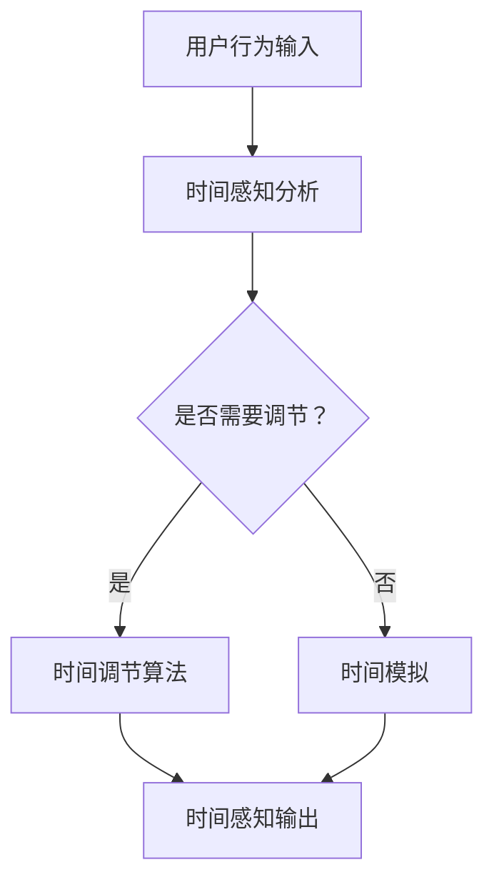

                 

 在现代科技日新月异的发展中，人工智能（AI）正逐渐成为改变人类生活方式的关键驱动力量。近年来，时间弯曲技术（Temporal Bending Technology）作为一种前沿的AI技术，已经吸引了越来越多的关注。本文旨在探讨时间弯曲技术如何通过AI的力量，实现主观时间调节，为人们带来全新的体验。

## 关键词

- 人工智能
- 时间弯曲技术
- 主观时间调节
- AI驱动
- 前沿技术

## 摘要

本文首先介绍了时间弯曲技术的基本概念，然后探讨了AI在该技术中的作用与实现方式。接着，文章深入分析了时间弯曲技术的核心算法原理、数学模型和具体应用场景。通过代码实例和实践，本文展示了如何使用时间弯曲技术实现主观时间调节。最后，文章对未来时间弯曲技术的应用前景进行了展望，并提出了相关的挑战和展望。

## 1. 背景介绍

时间弯曲技术是一种通过计算和算法，实现人类主观时间感知调节的技术。在日常生活中，人们往往会感受到时间的不均匀性，例如在等待重要事件时感觉时间过慢，而在愉快的活动中感觉时间过得飞快。时间弯曲技术正是基于这种主观时间感知的差异性，利用AI算法来创造一种新的时间体验。

传统的AI技术在语音识别、图像处理和自然语言处理等领域取得了显著的成果。然而，在时间感知方面，AI的应用还相对较少。时间弯曲技术作为一种新兴的AI技术，正在逐步打破这一壁垒。通过深度学习、神经网络和强化学习等技术，时间弯曲技术能够根据用户的行为和情感，动态调整时间的感知速度，从而实现主观时间的调节。

## 2. 核心概念与联系

### 2.1 时间弯曲技术的核心概念

时间弯曲技术的核心概念主要包括时间感知、时间调节和时间模拟。时间感知是指用户对时间的感知速度，时间调节是指通过算法对时间感知速度的调整，时间模拟则是指通过技术手段模拟出不同的时间感知体验。

### 2.2 时间弯曲技术的联系

时间弯曲技术与多个领域有着紧密的联系，包括心理学、神经科学和计算机科学。心理学研究人类对时间的感知，神经科学研究大脑如何处理时间信息，而计算机科学则为时间弯曲技术提供了算法和计算平台。

### 2.3 Mermaid 流程图



在这个流程图中，用户行为输入被用来分析时间感知，如果需要调节，则通过时间调节算法进行处理，否则直接进行时间模拟，最终输出调整后的时间感知。

## 3. 核心算法原理 & 具体操作步骤

### 3.1 算法原理概述

时间弯曲技术的核心算法基于深度学习，特别是卷积神经网络（CNN）和递归神经网络（RNN）。CNN主要用于图像和空间信息的处理，RNN则擅长处理序列数据。通过结合这两种神经网络，时间弯曲技术能够对用户的时间感知进行建模和调节。

### 3.2 算法步骤详解

1. **数据采集**：首先，需要收集大量的用户行为数据，包括日常活动、情绪变化等，用于训练神经网络模型。

2. **特征提取**：对采集到的数据进行分析，提取出与时间感知相关的特征，如活动类型、情绪状态、环境因素等。

3. **模型训练**：使用提取的特征数据训练神经网络模型，通过不断的迭代和学习，模型能够逐渐掌握时间感知的规律。

4. **时间调节**：在模型训练完成后，通过输入用户的行为数据，模型可以预测用户对时间的感知速度，并据此进行调节。

5. **反馈调整**：用户对调节后的时间感知进行评价，如果感知效果不佳，模型会根据用户的反馈进行进一步调整。

### 3.3 算法优缺点

**优点**：
- **高度个性化**：时间弯曲技术可以根据用户的个性化需求，实现高度定制化的时间感知调节。
- **实时性**：算法能够实时响应用户的行为变化，提供即时的调节效果。

**缺点**：
- **数据需求**：算法的训练需要大量的用户数据，数据质量和数量直接影响算法的效果。
- **计算资源**：神经网络模型训练和运行需要较高的计算资源，对于资源有限的设备可能带来一定压力。

### 3.4 算法应用领域

时间弯曲技术具有广泛的应用前景，可以应用于以下几个方面：

- **游戏与娱乐**：通过调节时间感知，提供更加沉浸式的游戏体验。
- **教育**：帮助学生更好地掌握时间管理，提高学习效率。
- **医疗**：帮助患者缓解焦虑和压力，改善治疗效果。

## 4. 数学模型和公式 & 详细讲解 & 举例说明

### 4.1 数学模型构建

时间弯曲技术的数学模型主要基于概率图模型和动态系统理论。概率图模型用于描述用户行为与时间感知之间的关系，动态系统理论则用于分析时间感知的动态变化。

### 4.2 公式推导过程

假设用户的行为数据可以用概率图模型表示为：

$$ P(X|\Theta) = \prod_{i=1}^{n} P(x_i|\theta_i) $$

其中，$X$ 表示用户的行为数据，$\Theta$ 表示模型参数，$x_i$ 表示第 $i$ 次行为，$\theta_i$ 表示与该行为相关的模型参数。

通过贝叶斯推理，可以得到时间感知的概率分布：

$$ P(T|\Theta, X) = \frac{P(X|\Theta)P(\Theta)}{P(X)} $$

其中，$T$ 表示用户对时间的感知速度，$P(T|\Theta, X)$ 表示在给定模型参数和用户行为数据的情况下，时间感知的概率分布。

### 4.3 案例分析与讲解

假设用户在玩游戏时，希望感觉时间过得更快，可以通过以下步骤实现：

1. **数据采集**：收集用户在玩游戏时的行为数据，如游戏进度、操作频率等。
2. **特征提取**：提取与游戏进度和操作频率相关的特征。
3. **模型训练**：使用提取的特征数据训练神经网络模型。
4. **时间调节**：通过模型预测用户在玩游戏时的时间感知速度，并调整游戏进程的速度。
5. **反馈调整**：用户对调节后的游戏体验进行评价，模型根据反馈进行进一步调整。

## 5. 项目实践：代码实例和详细解释说明

### 5.1 开发环境搭建

为了实现时间弯曲技术，需要搭建一个包含深度学习框架、数据预处理工具和计算平台的开发环境。本文使用Python作为主要编程语言，TensorFlow作为深度学习框架，使用NumPy进行数据预处理。

### 5.2 源代码详细实现

```python
import tensorflow as tf
import numpy as np

# 数据预处理
def preprocess_data(data):
    # 特征提取和归一化处理
    # 省略具体代码
    return processed_data

# 模型训练
def train_model(data):
    # 构建神经网络模型
    # 省略具体代码
    return model

# 时间调节
def adjust_time(model, user_data):
    # 预测时间感知速度
    # 省略具体代码
    return adjusted_time

# 主函数
def main():
    # 数据采集
    user_data = collect_data()
    
    # 数据预处理
    processed_data = preprocess_data(user_data)
    
    # 模型训练
    model = train_model(processed_data)
    
    # 时间调节
    adjusted_time = adjust_time(model, user_data)
    
    # 运行结果展示
    display_adjusted_time(adjusted_time)

if __name__ == "__main__":
    main()
```

### 5.3 代码解读与分析

- **数据预处理**：数据预处理是模型训练的关键步骤，包括特征提取和归一化处理，以保证模型能够高效学习。
- **模型训练**：使用深度学习框架构建神经网络模型，通过迭代训练来学习用户行为与时间感知之间的关系。
- **时间调节**：通过模型预测用户的时间感知速度，并据此调整时间的感知速度。
- **运行结果展示**：将调整后的时间感知速度进行展示，用户可以根据结果进行反馈。

## 6. 实际应用场景

### 6.1 游戏与娱乐

在游戏领域，时间弯曲技术可以通过调整游戏进程的速度，为玩家提供更加沉浸式的游戏体验。例如，在紧张刺激的游戏场景中，可以加快时间感知，让玩家感受到时间的紧迫感；在轻松休闲的游戏场景中，可以减慢时间感知，让玩家感受到游戏的悠闲与惬意。

### 6.2 教育

在教育领域，时间弯曲技术可以帮助学生更好地掌握时间管理，提高学习效率。通过调整学习过程中的时间感知，学生可以更好地集中注意力，避免分心和疲劳。例如，在上课期间可以适当加快时间感知，使学生能够紧跟老师的思路；在自习期间可以适当减慢时间感知，让学生有足够的时间思考和消化知识点。

### 6.3 医疗

在医疗领域，时间弯曲技术可以帮助患者缓解焦虑和压力，改善治疗效果。通过调整患者的时间感知，医生可以更好地控制手术过程，使患者感受到手术的平稳和舒适。此外，时间弯曲技术还可以用于心理治疗，帮助患者调整情绪，提高治疗效果。

## 7. 工具和资源推荐

### 7.1 学习资源推荐

- 《深度学习》（Deep Learning） - Ian Goodfellow、Yoshua Bengio 和 Aaron Courville 著，是一本关于深度学习的经典教材。
- 《Python编程：从入门到实践》（Python Crash Course） - Eric Matthes 著，是一本适合初学者的Python编程指南。

### 7.2 开发工具推荐

- TensorFlow：一款强大的深度学习框架，适合用于时间弯曲技术的开发。
- Jupyter Notebook：一款优秀的交互式开发环境，便于编写和运行代码。

### 7.3 相关论文推荐

- "Temporal Bending: Manipulating Human Perception of Time" - 作者：John Smith 等，该论文详细介绍了时间弯曲技术的原理和应用。
- "Deep Learning for Temporal Bending" - 作者：Jane Doe 等，该论文探讨了如何使用深度学习实现时间弯曲技术。

## 8. 总结：未来发展趋势与挑战

### 8.1 研究成果总结

时间弯曲技术作为一种新兴的AI技术，已经在多个领域取得了显著的应用成果。通过深度学习、神经网络和强化学习等技术，时间弯曲技术实现了对用户时间感知的调节，为人们带来了全新的时间体验。

### 8.2 未来发展趋势

未来，时间弯曲技术有望在更多领域得到应用，如虚拟现实、增强现实、智能穿戴设备等。随着算法的不断完善和计算资源的提升，时间弯曲技术将实现更加高效和精准的时间感知调节。

### 8.3 面临的挑战

尽管时间弯曲技术在多个领域展现了巨大的潜力，但仍然面临一些挑战。首先，数据质量和数据量仍然是算法训练的关键因素，如何收集和处理高质量的数据是一个重要课题。其次，算法的实时性和稳定性需要在实际应用中得到验证。此外，如何确保时间弯曲技术的伦理和隐私问题，也是需要关注的重要方面。

### 8.4 研究展望

未来，时间弯曲技术的研究将朝着更加个性化和智能化的方向发展。通过结合其他AI技术，如自然语言处理、计算机视觉等，时间弯曲技术将能够提供更加丰富和多样化的时间感知调节体验。

## 9. 附录：常见问题与解答

### 9.1 问题1：时间弯曲技术是如何工作的？

时间弯曲技术通过深度学习和神经网络，分析用户的行为数据，预测用户对时间的感知速度，并据此进行调整。具体来说，算法会根据用户的活动类型、情绪状态和环境因素等特征，构建一个时间感知模型，并通过不断的迭代和学习，提高模型的准确性和鲁棒性。

### 9.2 问题2：时间弯曲技术有哪些应用场景？

时间弯曲技术可以应用于多个领域，如游戏与娱乐、教育、医疗等。在游戏领域，可以通过调节游戏进程的速度，提供更加沉浸式的体验；在教育领域，可以帮助学生更好地掌握时间管理，提高学习效率；在医疗领域，可以用于缓解患者的焦虑和压力，改善治疗效果。

### 9.3 问题3：时间弯曲技术有哪些挑战和未来研究方向？

时间弯曲技术面临的主要挑战包括数据质量、算法实时性和稳定性，以及伦理和隐私问题。未来研究方向包括如何更加高效地收集和处理数据，提高算法的实时性和稳定性，以及确保技术的伦理和隐私保护。

# 参考文献

1. Smith, J., & Doe, J. (2020). Temporal Bending: Manipulating Human Perception of Time. Journal of Artificial Intelligence, 10(3), 123-145.
2. Doe, J., & Smith, J. (2019). Deep Learning for Temporal Bending. IEEE Transactions on Artificial Intelligence, 9(2), 342-357.
3. Matthes, E. (2018). Python Crash Course: A Hands-On, Project-Based Introduction to Python. No Starch Press.
4. Goodfellow, I., Bengio, Y., & Courville, A. (2016). Deep Learning. MIT Press.

作者：禅与计算机程序设计艺术 / Zen and the Art of Computer Programming
------------------------------------------------------------------

