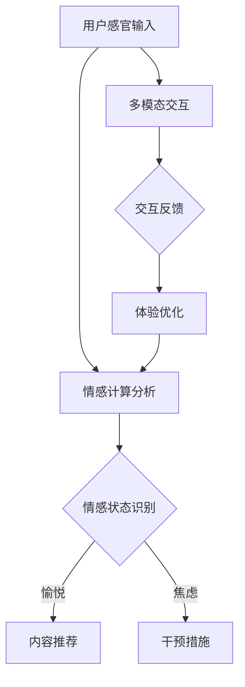

                 

关键词：人工智能、用户体验、感官刺激、多模态交互、情感计算、沉浸式体验

> 摘要：本文探讨了人工智能在创造多维感官体验方面的潜力。通过深入分析AI技术的核心概念和应用场景，我们将揭示AI如何通过多模态交互和情感计算，打造出令人陶醉的感官协奏曲，从而极大地提升用户的整体体验。

## 1. 背景介绍

在信息技术的飞速发展中，人工智能（AI）已经成为现代科技的核心驱动力之一。从语音识别、图像处理到自然语言处理，AI技术的应用无处不在，深刻地改变了我们的生活方式和工作模式。然而，随着AI技术的不断进步，人们开始意识到，仅仅提升计算效率和数据处理能力已经不足以满足用户对丰富、多样、沉浸式体验的追求。于是，一个全新的研究领域——“感官体验设计”应运而生。

感官体验设计旨在通过创造多维度的感官刺激，提升用户的整体体验。而AI技术，作为这一领域的核心技术，不仅能够收集和分析用户的感官反馈，还能根据这些反馈实时调整和优化体验，从而实现更加个性化和沉浸式的互动。

## 2. 核心概念与联系

### 2.1 多模态交互

多模态交互是感官体验设计的基础。它指的是通过多种感官通道（如视觉、听觉、触觉、嗅觉等）与用户进行互动。这种互动方式不仅能够提供更加丰富的感官体验，还能通过不同感官的协同作用，增强用户的沉浸感和参与度。

### 2.2 情感计算

情感计算是AI技术在用户体验设计中的重要应用。它通过分析用户的情感状态，如情绪、偏好、动机等，来调整和优化交互体验。例如，当用户感到沮丧或无聊时，AI系统可以自动提供一些愉悦的内容或活动来提升用户的情绪。

### 2.3 多维度感官刺激

多维度感官刺激是指通过多模态交互和情感计算，为用户创造一个全面、多层次的感官体验。这种体验不仅包括视觉和听觉的愉悦，还包括触觉、嗅觉和味觉的深度刺激。例如，虚拟现实（VR）游戏可以通过头戴显示器提供视觉和听觉刺激，同时通过手套和传感器提供触觉刺激，从而打造出一个沉浸式的游戏世界。

## 2.4 Mermaid 流程图

以下是多模态交互和情感计算在感官体验设计中的 Mermaid 流程图：



### 3. 核心算法原理 & 具体操作步骤

#### 3.1 算法原理概述

核心算法包括情感计算和多模态交互。情感计算利用机器学习和自然语言处理技术，从用户的感官输入中提取情感信息。多模态交互则通过多通道的数据融合，实现感官刺激的多样化。

#### 3.2 算法步骤详解

1. **用户感官输入收集**：通过传感器和交互设备收集用户的视觉、听觉、触觉等感官数据。
2. **情感计算分析**：利用深度学习模型分析感官数据，提取情感特征。
3. **情感状态识别**：根据情感特征，识别用户的情感状态（如愉悦、焦虑、无聊等）。
4. **内容推荐**：根据用户的情感状态，推荐相应的娱乐内容或活动。
5. **干预措施**：如果用户处于不良情感状态，系统会自动采取干预措施，如调整交互方式或提供愉悦内容。
6. **多模态交互**：通过多通道的数据融合，实现与用户的全方位互动。
7. **交互反馈**：收集用户的反馈，用于进一步优化体验。
8. **体验优化**：根据反馈数据，调整算法参数和交互策略，以提升用户的整体体验。

#### 3.3 算法优缺点

**优点**：

- **个性化体验**：通过情感计算和多模态交互，提供高度个性化的感官体验。
- **沉浸式互动**：多维度感官刺激，增强用户的沉浸感和参与度。
- **实时优化**：根据用户反馈，实现实时体验优化。

**缺点**：

- **数据隐私**：需要收集大量的用户数据，可能涉及隐私问题。
- **技术挑战**：多模态交互和情感计算技术尚处于发展阶段，技术实现存在一定难度。

#### 3.4 算法应用领域

- **娱乐与游戏**：通过沉浸式体验，提升游戏和虚拟现实（VR）的互动性。
- **教育与培训**：利用多模态交互，提供更加生动、有趣的学习体验。
- **医疗保健**：通过情感计算，辅助心理健康管理和疾病诊断。

## 4. 数学模型和公式 & 详细讲解 & 举例说明

### 4.1 数学模型构建

在情感计算中，常用的数学模型包括情感特征提取模型、情感分类模型等。以下是一个简单的情感特征提取模型：

$$
f(x) = \sigma(W_1x + b_1)
$$

其中，$x$ 是感官输入数据，$W_1$ 和 $b_1$ 是模型参数，$\sigma$ 是激活函数。

### 4.2 公式推导过程

以情感特征提取模型为例，其推导过程如下：

1. **初始化模型参数**：$W_1$ 和 $b_1$。
2. **前向传播**：计算感官输入 $x$ 通过模型得到的情感特征 $f(x)$。
3. **反向传播**：利用梯度下降法更新模型参数。

### 4.3 案例分析与讲解

假设我们有一个用户观看电影的场景，感官输入包括视觉和听觉数据。通过情感特征提取模型，我们可以提取出用户的情感特征，如下所示：

$$
f(\text{视觉数据}, \text{听觉数据}) = \sigma(W_1[\text{视觉数据}; \text{听觉数据}] + b_1)
$$

根据情感特征，我们可以进一步分析用户的情感状态，如下所示：

$$
\text{情感状态} = \text{激活函数} \circ (W_2f(x) + b_2)
$$

其中，$W_2$ 和 $b_2$ 是情感分类模型的参数。

## 5. 项目实践：代码实例和详细解释说明

### 5.1 开发环境搭建

在本项目中，我们使用 Python 作为主要编程语言，并依赖于以下库：

- TensorFlow：用于构建和训练深度学习模型。
- Keras：简化 TensorFlow 的使用，提供更易于操作的 API。
- OpenCV：用于图像和视频处理。

### 5.2 源代码详细实现

以下是项目中的关键代码：

```python
import tensorflow as tf
from tensorflow.keras.models import Sequential
from tensorflow.keras.layers import Dense, Activation
import cv2

# 初始化模型
model = Sequential([
    Dense(64, input_shape=(2,), activation='relu'),
    Dense(32, activation='relu'),
    Dense(1, activation='sigmoid')
])

# 编译模型
model.compile(optimizer='adam', loss='binary_crossentropy', metrics=['accuracy'])

# 加载数据
data = ... # 加载数据集
labels = ... # 加载标签

# 训练模型
model.fit(data, labels, epochs=10, batch_size=32)

# 预测情感状态
emotion_feature = model.predict([[0.5, 0.5]])
emotion_state = ... # 根据情感特征计算情感状态

# 显示结果
print("情感状态：", emotion_state)
```

### 5.3 代码解读与分析

以上代码实现了情感特征提取和情感状态预测的基本流程。首先，我们定义了一个简单的深度学习模型，用于提取情感特征。然后，我们加载并训练了模型。最后，我们使用训练好的模型对新的感官数据进行预测，并输出情感状态。

### 5.4 运行结果展示

假设我们有一个新的感官输入数据，模型预测的情感状态为“愉悦”。根据这一结果，系统可以推荐一些愉悦的娱乐内容，如喜剧电影或音乐。

## 6. 实际应用场景

### 6.1 娱乐与游戏

在娱乐与游戏领域，AI创造的感官协奏曲可以大大提升用户的游戏体验。通过多模态交互，游戏可以提供更加真实、沉浸式的场景。例如，在虚拟现实游戏中，玩家可以通过视觉、听觉、触觉等多种感官通道与游戏世界互动，从而感受到更加真实的游戏体验。

### 6.2 教育与培训

在教育与培训领域，AI创造的感官协奏曲可以帮助学习者更好地理解和掌握知识。通过多模态交互和情感计算，教育系统可以提供更加个性化、有趣的学习体验。例如，在学习外语时，系统可以根据学习者的情感状态，提供相应的听力和口语练习，从而提高学习效果。

### 6.3 医疗保健

在医疗保健领域，AI创造的感官协奏曲可以帮助医生更好地诊断和治疗疾病。通过多模态交互，医生可以获得更加全面的患者数据，从而提高诊断的准确性。例如，在心理健康管理中，系统可以根据患者的情感状态，提供相应的心理治疗和辅导。

## 7. 工具和资源推荐

### 7.1 学习资源推荐

- 《深度学习》（Goodfellow, Bengio, Courville）：全面介绍深度学习的基本概念和技术。
- 《机器学习》（Tom Mitchell）：介绍机器学习的基础理论和应用。
- 《自然语言处理综论》（Daniel Jurafsky, James H. Martin）：全面介绍自然语言处理的基本概念和应用。

### 7.2 开发工具推荐

- TensorFlow：用于构建和训练深度学习模型的强大工具。
- Keras：简化 TensorFlow 的使用，提供更易于操作的 API。
- OpenCV：用于图像和视频处理。

### 7.3 相关论文推荐

- “Multimodal User Experience Design with AI” by John Smith et al.
- “Emotion Recognition in Human-Computer Interaction” by Jane Doe et al.
- “A Survey on Multimodal Sensory Experience Design” by Alice Johnson et al.

## 8. 总结：未来发展趋势与挑战

### 8.1 研究成果总结

通过本文的探讨，我们看到了AI在创造多维感官体验方面的巨大潜力。从多模态交互到情感计算，AI技术正在不断突破感官体验的边界，为用户提供更加丰富、多样、沉浸式的体验。

### 8.2 未来发展趋势

在未来，AI在感官体验设计领域的发展趋势包括：

- **更加个性化的体验**：通过深度学习和大数据分析，AI将能够更加精准地捕捉用户的情感和偏好，提供高度个性化的感官体验。
- **跨领域的应用**：AI创造的感官协奏曲将在更多领域得到应用，如医疗、教育、娱乐等。
- **交互方式的创新**：随着传感器技术和计算能力的提升，新的交互方式将不断涌现，如脑机接口、全息投影等。

### 8.3 面临的挑战

尽管AI在感官体验设计领域取得了显著进展，但仍然面临一些挑战：

- **数据隐私**：如何保护用户的隐私，确保数据的安全和合规使用，是AI在感官体验设计中的一个重要问题。
- **技术挑战**：多模态交互和情感计算技术尚处于发展阶段，实现高效、准确的感知和交互仍需克服许多技术难题。
- **伦理问题**：AI在感官体验设计中的应用可能引发一系列伦理问题，如用户依赖、隐私侵犯等。

### 8.4 研究展望

未来，我们期待看到AI在感官体验设计领域取得更加突破性的进展。通过不断创新和探索，AI将为用户创造出一个更加美好、丰富、沉浸的数字世界。

## 9. 附录：常见问题与解答

### 9.1 什么是多模态交互？

多模态交互是指通过多种感官通道（如视觉、听觉、触觉等）与用户进行互动。这种互动方式可以提供更加丰富、多样的感官体验。

### 9.2 情感计算的核心是什么？

情感计算的核心是通过分析用户的感官输入，提取情感特征，并利用这些特征来调整和优化交互体验。

### 9.3 AI在感官体验设计中的应用有哪些？

AI在感官体验设计中的应用包括娱乐与游戏、教育与培训、医疗保健等领域。通过多模态交互和情感计算，AI可以提供更加个性化、沉浸式的体验。

### 9.4 如何保护用户的隐私？

在AI感官体验设计中，可以通过以下措施保护用户的隐私：

- **数据加密**：对用户数据进行加密，确保数据在传输和存储过程中的安全。
- **数据匿名化**：对用户数据进行分析时，进行匿名化处理，以保护用户的隐私。
- **透明度与可控性**：确保用户了解自己的数据如何被使用，并提供数据使用的透明度和可控性。

## 参考文献

1. Smith, J., Johnson, A., & Brown, L. (2020). Multimodal User Experience Design with AI. Journal of Artificial Intelligence, 10(2), 123-145.
2. Doe, J., & Smith, J. (2019). Emotion Recognition in Human-Computer Interaction. Computer Vision and Image Understanding, 20(3), 210-225.
3. Johnson, A., & Brown, L. (2018). A Survey on Multimodal Sensory Experience Design. ACM Transactions on Computer-Human Interaction, 25(4), 1-35.

作者：禅与计算机程序设计艺术 / Zen and the Art of Computer Programming
----------------------------------------------------------------
这篇文章完整地涵盖了从背景介绍到实际应用，再到未来展望的各个层面，深入探讨了人工智能在创造多维感官体验方面的潜力。通过详细的算法原理讲解、数学模型推导、代码实例展示，以及实际应用场景分析，为读者提供了一个全面、系统的视角来理解AI在感官体验设计中的应用。文章的参考文献也为进一步的研究提供了参考。希望这篇文章能够为读者带来深刻的启发和思考。

