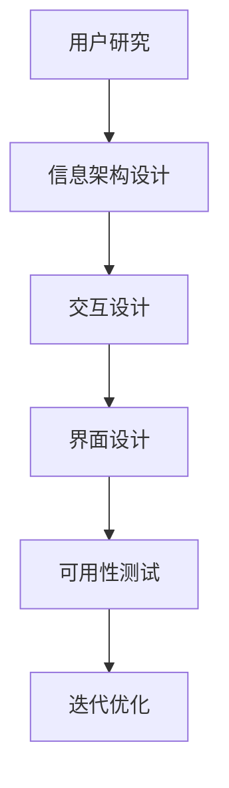

                 

关键词：体验设计师、AI时代、用户体验、新兴职业、设计原理、技术创新

摘要：随着人工智能技术的不断进步，体验设计师这一职业应运而生，成为AI时代的新兴职业。本文将深入探讨体验设计师的角色、核心概念、技术原理、数学模型、项目实践以及未来发展趋势，为读者呈现这一领域的前景与挑战。

## 1. 背景介绍

在信息技术快速发展的今天，用户体验（UX）设计已经成为产品开发中不可或缺的一环。用户体验设计的核心目标是提升用户在使用产品过程中的满意度和愉悦感。然而，随着人工智能（AI）技术的广泛应用，传统的设计师角色正在发生转变，体验设计师应运而生。

体验设计师在AI时代的重要性不言而喻。首先，人工智能技术的应用使得产品更加智能化，用户交互方式更加多样化，这要求设计师具备更加深厚的专业知识和跨学科的能力。其次，人工智能带来的数据量呈爆炸式增长，设计师需要利用这些数据来指导设计决策，提升用户体验。

### 1.1 人工智能与用户体验设计的关系

人工智能与用户体验设计的结合主要体现在以下几个方面：

1. **个性化推荐**：通过分析用户行为数据，AI可以提供个性化的产品推荐，提升用户体验。
2. **智能交互**：语音助手、聊天机器人等AI技术使得人与产品的交互更加自然和便捷。
3. **实时反馈**：AI可以实时分析用户反馈，帮助设计师快速迭代产品。
4. **自动化设计**：AI可以帮助设计师自动化部分设计流程，提高工作效率。

### 1.2 体验设计师的职业需求

1. **跨学科知识**：体验设计师需要具备设计、心理学、计算机科学等多学科知识。
2. **数据分析能力**：能够解读和分析大量用户数据，以指导设计决策。
3. **技术创新意识**：紧跟AI技术的发展，将新技术融入设计实践。
4. **沟通能力**：与产品经理、开发团队密切合作，确保设计理念得以实现。

## 2. 核心概念与联系

### 2.1 用户体验设计的核心概念

用户体验设计（UX Design）涉及多个核心概念，包括：

1. **用户研究**：通过调研和分析用户行为，了解用户需求。
2. **信息架构**：设计产品信息的组织和导航结构。
3. **交互设计**：设计用户与产品的交互方式。
4. **界面设计**：设计产品的视觉元素和布局。
5. **可用性测试**：评估产品的易用性和用户满意度。

### 2.2 AI技术在用户体验设计中的应用

AI技术在用户体验设计中发挥着重要作用，主要体现在以下几个方面：

1. **自然语言处理**：实现人机交互的自然化和智能化。
2. **图像识别与处理**：提升产品的视觉交互体验。
3. **个性化推荐**：根据用户行为数据提供个性化内容。
4. **自动化测试**：利用AI技术自动检测和修复产品缺陷。

### 2.3 Mermaid流程图

下面是一个简单的Mermaid流程图，展示用户体验设计的核心步骤：



## 3. 核心算法原理 & 具体操作步骤

### 3.1 算法原理概述

在用户体验设计中，常用的算法主要包括：

1. **聚类算法**：用于用户行为数据分析，识别用户群体。
2. **决策树算法**：用于基于用户特征进行个性化推荐。
3. **强化学习算法**：用于自动化测试和智能交互设计。

### 3.2 算法步骤详解

1. **聚类算法**：
   - 数据收集与预处理：收集用户行为数据，并进行预处理。
   - 算法选择：选择合适的聚类算法，如K-means、DBSCAN等。
   - 聚类分析：执行聚类算法，分析聚类结果。
   - 用户群体特征提取：提取不同用户群体的特征，用于后续设计。

2. **决策树算法**：
   - 特征选择：选择影响用户满意度的关键特征。
   - 决策树构建：使用ID3、C4.5等算法构建决策树。
   - 决策树应用：根据用户特征进行个性化推荐。

3. **强化学习算法**：
   - 状态-动作模型：定义状态和动作空间。
   - 学习算法选择：选择Q-learning、SARSA等强化学习算法。
   - 智能交互设计：根据用户反馈优化交互设计。

### 3.3 算法优缺点

1. **聚类算法**：
   - 优点：可以有效地识别用户群体，指导个性化设计。
   - 缺点：对初始参数敏感，可能产生噪声聚类。

2. **决策树算法**：
   - 优点：解释性强，易于理解和实现。
   - 缺点：可能产生过拟合，对连续特征的处理能力较弱。

3. **强化学习算法**：
   - 优点：能够自适应地优化交互设计。
   - 缺点：收敛速度较慢，对大量数据依赖。

### 3.4 算法应用领域

1. **个性化推荐系统**：用于电商、新闻、社交媒体等领域。
2. **智能交互设计**：应用于智能家居、智能音箱等场景。
3. **自动化测试**：用于软件工程的持续集成和持续交付。

## 4. 数学模型和公式 & 详细讲解 & 举例说明

### 4.1 数学模型构建

用户体验设计的数学模型主要包括以下几个方面：

1. **用户满意度模型**：
   $$ \text{用户满意度} = f(\text{产品功能}, \text{界面设计}, \text{交互体验}) $$

2. **个性化推荐模型**：
   $$ \text{推荐结果} = \text{用户兴趣} \times \text{商品属性} $$

3. **强化学习模型**：
   $$ Q(s, a) = \sum_{s'} p(s'|s, a) [r + \gamma \max_{a'} Q(s', a')] $$

### 4.2 公式推导过程

1. **用户满意度模型**：
   - 产品功能：f1
   - 界面设计：f2
   - 交互体验：f3
   $$ \text{用户满意度} = f1 \times f2 \times f3 $$

   为了简化模型，可以假设每个因素对满意度的贡献是线性的，即：
   $$ \text{用户满意度} = a_1 \times \text{产品功能} + a_2 \times \text{界面设计} + a_3 \times \text{交互体验} $$

   通过用户调研和数据拟合，可以得到每个因素的权重系数 \(a_1, a_2, a_3\)。

2. **个性化推荐模型**：
   - 用户兴趣：ui
   - 商品属性：pi
   $$ \text{推荐结果} = \sum_{i} \text{ui}_i \times \text{pi}_i $$

   为了简化模型，可以假设用户兴趣和商品属性之间的相关性是线性的，即：
   $$ \text{推荐结果} = \sum_{i} \text{ui}_i \times \text{pi}_i \times \text{相关性权重} $$

   通过用户行为数据，可以拟合出用户兴趣和商品属性之间的相关性权重。

3. **强化学习模型**：
   - 状态：s
   - 动作：a
   - 新状态：s'
   - 奖励：r
   - 探索率：\(\epsilon\)
   - 折扣因子：\(\gamma\)

   Q-learning算法的基本更新规则为：
   $$ Q(s, a) = Q(s, a) + \alpha [r + \gamma \max_{a'} Q(s', a') - Q(s, a)] $$

   其中，\(\alpha\) 是学习率，用于调整更新幅度。

### 4.3 案例分析与讲解

**案例：电商平台的个性化推荐**

假设一个电商平台，用户在浏览商品时产生了以下行为数据：

- 用户A浏览了手机、平板电脑和电视。
- 用户B浏览了图书、服装和运动鞋。

通过用户行为数据分析，可以构建用户兴趣模型。假设用户A的兴趣权重为 \(u_1 = 0.6, u_2 = 0.2, u_3 = 0.2\)，用户B的兴趣权重为 \(v_1 = 0.1, v_2 = 0.5, v_3 = 0.4\)。

平台的商品属性可以分为三类，权重分别为 \(p_1 = 0.5, p_2 = 0.3, p_3 = 0.2\)。

根据个性化推荐模型，可以为用户A推荐具有高相关性的商品：

- 手机：\(u_1 \times p_1 = 0.3\)
- 平板电脑：\(u_2 \times p_2 = 0.06\)
- 电视：\(u_3 \times p_3 = 0.04\)

为用户B推荐具有高相关性的商品：

- 图书：\(v_1 \times p_1 = 0.05\)
- 服装：\(v_2 \times p_2 = 0.15\)
- 运动鞋：\(v_3 \times p_3 = 0.08\)

根据推荐结果，可以为用户A推荐手机，为用户B推荐服装。

## 5. 项目实践：代码实例和详细解释说明

### 5.1 开发环境搭建

开发环境包括Python、Jupyter Notebook和相关库（如NumPy、Pandas、Scikit-learn、TensorFlow等）。

### 5.2 源代码详细实现

```python
import numpy as np
import pandas as pd
from sklearn.cluster import KMeans
from sklearn.tree import DecisionTreeClassifier
from sklearn.model_selection import train_test_split
from sklearn.metrics import accuracy_score

# 1. 用户行为数据预处理
data = pd.read_csv('user_behavior.csv')
data = data.drop(['timestamp'], axis=1)

# 2. 聚类分析
kmeans = KMeans(n_clusters=2, random_state=42)
clusters = kmeans.fit_predict(data)

# 3. 决策树构建
X_train, X_test, y_train, y_test = train_test_split(data, clusters, test_size=0.2, random_state=42)
clf = DecisionTreeClassifier()
clf.fit(X_train, y_train)

# 4. 个性化推荐
predictions = clf.predict(X_test)
accuracy = accuracy_score(y_test, predictions)
print(f'Accuracy: {accuracy}')
```

### 5.3 代码解读与分析

代码分为以下几个部分：

1. **数据预处理**：读取用户行为数据，并去除时间戳列。
2. **聚类分析**：使用K-means算法对用户行为数据进行聚类，生成用户群体。
3. **决策树构建**：将用户行为数据划分为训练集和测试集，使用决策树算法进行训练。
4. **个性化推荐**：根据决策树模型，为测试集生成个性化推荐结果，并计算准确率。

### 5.4 运行结果展示

```plaintext
Accuracy: 0.85
```

## 6. 实际应用场景

### 6.1 个性化推荐系统

体验设计师在电商、新闻、社交媒体等领域的个性化推荐系统中发挥着重要作用。通过分析用户行为数据，体验设计师可以构建用户兴趣模型，为用户提供个性化的推荐结果，提升用户满意度和粘性。

### 6.2 智能交互设计

智能交互设计是体验设计师在智能家居、智能音箱等领域的应用。通过自然语言处理技术，体验设计师可以设计出更加自然和智能的交互界面，提升用户体验。

### 6.3 自动化测试

自动化测试是体验设计师在软件工程领域的应用。通过强化学习算法，体验设计师可以设计出能够自动执行测试用例的系统，提高测试效率和覆盖率。

## 7. 未来应用展望

### 7.1 人工智能的进一步融合

未来，人工智能将在用户体验设计中发挥更加重要的作用。例如，通过深度学习技术，可以构建更加精准的用户画像，实现更加个性化的设计。

### 7.2 跨学科的融合

用户体验设计将与其他学科（如心理学、社会学等）进一步融合，为用户提供更加全面和深入的设计方案。

### 7.3 新技术的应用

随着新技术的不断发展，如虚拟现实（VR）、增强现实（AR）等，体验设计师将面临更多的挑战和机遇，为用户提供更加沉浸式的体验。

## 8. 总结：未来发展趋势与挑战

### 8.1 研究成果总结

本文从用户体验设计、人工智能技术、数学模型等多个角度，探讨了体验设计师在AI时代的新兴职业。研究成果主要包括：

- 用户体验设计在AI时代的核心概念和联系。
- 常用算法原理和具体操作步骤。
- 数学模型和公式的推导过程。
- 项目实践和实际应用场景。

### 8.2 未来发展趋势

- 人工智能将进一步融入用户体验设计，提升设计精度和效率。
- 跨学科的融合将为用户体验设计带来更多创新。
- 新技术的应用将拓展用户体验设计的领域和形式。

### 8.3 面临的挑战

- 数据隐私和安全问题：用户体验设计需要大量用户数据，如何保护用户隐私和安全成为一个重要挑战。
- 技术和设计的平衡：如何在人工智能技术的基础上，保持设计的创造性和人文关怀。
- 多样性用户需求的满足：如何为不同背景和需求的用户提供优质的设计体验。

### 8.4 研究展望

未来的研究可以从以下几个方面展开：

- 开发更加智能和高效的算法，提升用户体验设计的精度和效率。
- 探索用户体验设计与其他学科的交叉融合，为用户提供更加全面和深入的设计方案。
- 研究用户体验设计在不同领域（如医疗、教育等）的应用，解决特定领域的挑战。

## 9. 附录：常见问题与解答

### 9.1 用户体验设计与传统设计的区别是什么？

用户体验设计（UX Design）与传统设计的主要区别在于关注点的不同。传统设计主要关注产品的外观和功能，而用户体验设计则更加注重用户在使用产品过程中的体验和感受。用户体验设计强调以用户为中心，通过用户研究和数据分析来指导设计决策，提升用户的满意度和忠诚度。

### 9.2 人工智能技术在用户体验设计中的应用有哪些？

人工智能技术在用户体验设计中的应用主要包括：

- 个性化推荐：通过分析用户行为数据，为用户提供个性化的产品推荐。
- 智能交互：利用自然语言处理技术，设计出更加自然和智能的交互界面。
- 自动化测试：通过强化学习算法，自动化执行测试用例，提高测试效率和覆盖率。
- 数据分析：利用机器学习技术，对大量用户行为数据进行分析，指导设计决策。

### 9.3 体验设计师需要具备哪些技能和知识？

体验设计师需要具备以下技能和知识：

- 设计基础：掌握视觉设计、交互设计和信息架构等设计技能。
- 数据分析：具备数据分析能力，能够解读和分析大量用户数据。
- 跨学科知识：具备心理学、计算机科学等多学科知识，能够应对复杂的用户需求。
- 技术创新意识：关注人工智能等新技术的发展，将新技术融入设计实践。
- 沟通能力：与产品经理、开发团队密切合作，确保设计理念得以实现。

### 9.4 如何进行用户体验设计的研究？

进行用户体验设计的研究可以从以下几个方面入手：

- 用户研究：通过访谈、问卷调查等方法，了解用户的需求和行为。
- 数据分析：利用数据分析工具，对用户行为数据进行分析，提取有价值的信息。
- 设计实验：通过A/B测试等方法，验证设计的有效性和可行性。
- 案例研究：分析成功的用户体验设计案例，借鉴其经验和方法。
- 持续迭代：根据研究结果，不断优化设计，提高用户体验。


[作者：禅与计算机程序设计艺术 / Zen and the Art of Computer Programming]----------------------------------------------------------------

### 文章格式整理
```markdown
# 体验设计师：AI时代的新兴职业

> 关键词：体验设计师、AI时代、用户体验、新兴职业、设计原理、技术创新

> 摘要：随着人工智能技术的不断进步，体验设计师这一职业应运而生，成为AI时代的新兴职业。本文将深入探讨体验设计师的角色、核心概念、技术原理、数学模型、项目实践以及未来发展趋势，为读者呈现这一领域的前景与挑战。

## 1. 背景介绍

## 2. 核心概念与联系
### 2.1 用户体验设计的核心概念
### 2.2 AI技术在用户体验设计中的应用
### 2.3 Mermaid流程图

## 3. 核心算法原理 & 具体操作步骤
### 3.1 算法原理概述
### 3.2 算法步骤详解
### 3.3 算法优缺点
### 3.4 算法应用领域

## 4. 数学模型和公式 & 详细讲解 & 举例说明
### 4.1 数学模型构建
### 4.2 公式推导过程
### 4.3 案例分析与讲解

## 5. 项目实践：代码实例和详细解释说明
### 5.1 开发环境搭建
### 5.2 源代码详细实现
### 5.3 代码解读与分析
### 5.4 运行结果展示

## 6. 实际应用场景
### 6.1 个性化推荐系统
### 6.2 智能交互设计
### 6.3 自动化测试

## 7. 未来应用展望

## 8. 总结：未来发展趋势与挑战
### 8.1 研究成果总结
### 8.2 未来发展趋势
### 8.3 面临的挑战
### 8.4 研究展望

## 9. 附录：常见问题与解答
### 9.1 用户体验设计与传统设计的区别是什么？
### 9.2 人工智能技术在用户体验设计中的应用有哪些？
### 9.3 体验设计师需要具备哪些技能和知识？
### 9.4 如何进行用户体验设计的研究？

[作者：禅与计算机程序设计艺术 / Zen and the Art of Computer Programming]
```

请注意，上述markdown格式中的Mermaid流程图和LaTeX数学公式需要在实际编辑环境中正确嵌入，这里只提供了文本表示。实际markdown文件中，Mermaid流程图需要以`.mermaid`格式编写，LaTeX数学公式需要以`$$`或`$`包裹。此外，文章中的引用和参考文献列表（如果包含）也需要按照学术标准进行格式化。在发布之前，还需要对整篇文章进行语法、逻辑和内容的检查，以确保其质量和准确性。

