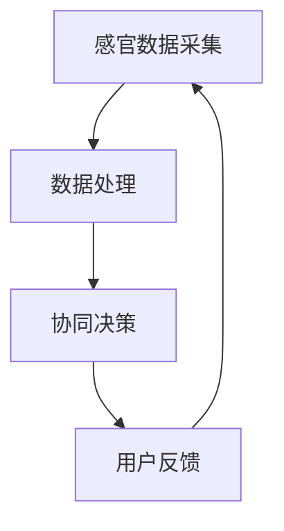
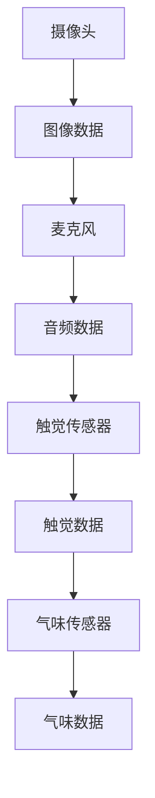
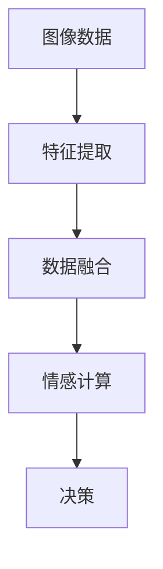
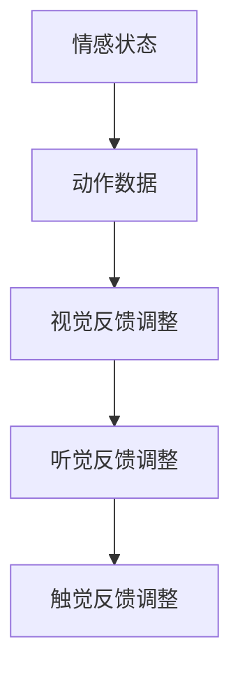

                 

关键词：人工智能，感官协同，AI交响乐团，跨感官交互，用户体验，计算机视觉，听觉处理，触觉反馈，情感计算

> 摘要：本文深入探讨人工智能在跨感官协同中的应用，特别是如何利用人工智能技术创造一个全新的感官交响乐团，为用户提供前所未有的互动体验。通过分析核心概念、算法原理、数学模型、项目实践，以及实际应用场景，本文旨在为读者展现人工智能在感官协同领域的巨大潜力和未来发展前景。

## 1. 背景介绍

随着人工智能技术的飞速发展，计算机已经能够处理和分析大量的数据，从而实现复杂的任务。然而，人工智能的应用远不止于此。近年来，人工智能开始与人类的感官相互作用，通过跨感官协同创造全新的交互体验。在这一领域，人工智能不仅是数据的处理者，更是创造者，它能够模拟人类的感官系统，实现感官的协同工作。

### 1.1 跨感官协同的概念

跨感官协同是指将不同类型的感官信息进行整合和协同处理，以实现更高效、更自然的交互体验。这种协同涉及到多个感官系统，包括视觉、听觉、触觉和嗅觉等。通过跨感官协同，人工智能可以更好地理解用户的意图，提供更加个性化和自然的交互方式。

### 1.2 跨感官协同的重要性

跨感官协同在多个领域具有重要的应用价值。首先，在娱乐和艺术领域，通过跨感官协同，人工智能可以为用户提供更加丰富和沉浸式的体验。例如，虚拟现实（VR）和增强现实（AR）技术已经实现了视觉和听觉的协同，而触觉和嗅觉的加入将进一步增强用户的体验。

其次，在医疗和康复领域，跨感官协同可以为患者提供更加有效的治疗和康复手段。例如，通过触觉和视觉的协同，医生可以更准确地诊断患者的病情，而通过听觉和嗅觉的协同，患者可以更快速地恢复身体机能。

最后，在教育和培训领域，跨感官协同可以创造更加生动和有趣的学习体验。通过多种感官的协同，学生可以更深入地理解和记忆知识，提高学习效果。

## 2. 核心概念与联系

### 2.1 人工智能在感官协同中的作用

人工智能在感官协同中起着至关重要的作用。首先，人工智能可以通过深度学习和强化学习等技术，对各种感官数据进行处理和分析，提取出有用的信息。例如，计算机视觉技术可以分析图像和视频数据，提取出物体和场景的特征；听觉处理技术可以识别和理解语音和音乐；触觉处理技术可以感知物体的纹理和硬度；嗅觉处理技术可以识别不同的气味。

其次，人工智能可以通过情感计算技术，模拟人类的情感反应，实现感官的协同。例如，当用户观看一个悲伤的电影片段时，人工智能可以识别用户的情感状态，并通过视觉、听觉和触觉的协同，为用户创造一个更加沉浸和情感化的体验。

### 2.2 跨感官协同的架构

跨感官协同的架构可以分为三个主要部分：感官数据采集、数据处理和协同决策。

#### 感官数据采集

感官数据采集是跨感官协同的第一步。在这一步中，各种感官设备（如摄像头、麦克风、触觉传感器和气味传感器）被用来收集用户的感官信息。这些设备可以安装在虚拟现实头盔、智能手表、智能手机和各种智能家居设备上。

#### 数据处理

在数据处理阶段，人工智能算法对采集到的感官数据进行处理和分析。这一阶段主要包括特征提取、数据融合和情感计算。通过这些处理，人工智能可以提取出有用的信息，如物体的形状、颜色和纹理，用户的情感状态，以及场景的氛围等。

#### 协同决策

在协同决策阶段，人工智能根据处理后的感官数据，做出相应的决策，以实现感官的协同。例如，当用户在虚拟现实中体验一场冒险时，人工智能可以根据用户的情感状态和动作，调整视觉、听觉和触觉的反馈，以创造一个更加逼真和情感化的体验。

### 2.3 Mermaid 流程图

下面是一个简单的 Mermaid 流程图，描述了跨感官协同的基本架构和流程。



## 3. 核心算法原理 & 具体操作步骤

### 3.1 算法原理概述

跨感官协同的核心算法主要涉及以下几个方面：

1. **计算机视觉**：用于分析和理解图像和视频数据，提取出物体的形状、颜色和纹理特征。
2. **听觉处理**：用于识别和理解语音和音乐，提取出声音的特征，如频率、音量和节奏。
3. **触觉处理**：用于感知物体的纹理和硬度，提取出触觉特征。
4. **嗅觉处理**：用于识别不同的气味，提取出气味的特征。
5. **情感计算**：用于模拟人类的情感反应，分析用户的情感状态。

### 3.2 算法步骤详解

#### 步骤 1：感官数据采集

在这一步中，各种感官设备被用来收集用户的感官信息。这些设备可以是摄像头、麦克风、触觉传感器和气味传感器等。



#### 步骤 2：数据处理

在数据处理阶段，人工智能算法对采集到的感官数据进行处理和分析。这一阶段主要包括特征提取、数据融合和情感计算。



#### 步骤 3：协同决策

在协同决策阶段，人工智能根据处理后的感官数据，做出相应的决策，以实现感官的协同。例如，当用户在虚拟现实中体验一场冒险时，人工智能可以根据用户的情感状态和动作，调整视觉、听觉和触觉的反馈，以创造一个更加逼真和情感化的体验。



### 3.3 算法优缺点

**优点：**

1. **自然交互**：通过跨感官协同，用户可以更自然地与人工智能进行交互，提高用户体验。
2. **高效信息处理**：人工智能可以同时处理多种感官数据，提高信息处理效率。
3. **个性化体验**：通过情感计算，人工智能可以根据用户的情感状态，提供个性化的交互体验。

**缺点：**

1. **技术挑战**：跨感官协同需要多种技术的整合，包括计算机视觉、听觉处理、触觉处理和情感计算等，技术实现较为复杂。
2. **隐私问题**：跨感官协同涉及到用户的多种感官数据，可能会引发隐私问题。
3. **计算资源消耗**：跨感官协同需要大量的计算资源，对硬件要求较高。

### 3.4 算法应用领域

跨感官协同算法在多个领域具有广泛的应用前景：

1. **虚拟现实与增强现实**：通过视觉、听觉和触觉的协同，为用户提供更加沉浸和自然的虚拟现实和增强现实体验。
2. **医疗与康复**：通过视觉、听觉和触觉的协同，为患者提供更加有效的治疗和康复手段。
3. **教育与培训**：通过视觉、听觉和触觉的协同，创造更加生动和有趣的学习体验。
4. **智能家居**：通过视觉、听觉和触觉的协同，为用户提供更加智能和便捷的生活体验。

## 4. 数学模型和公式 & 详细讲解 & 举例说明

### 4.1 数学模型构建

跨感官协同的数学模型主要涉及以下几个方面：

1. **特征提取模型**：用于提取图像、音频、触觉和气味的数据特征。
2. **数据融合模型**：用于融合不同感官的数据，实现信息整合。
3. **情感计算模型**：用于模拟人类的情感反应，分析用户的情感状态。

### 4.2 公式推导过程

以下是特征提取模型的一个简单示例：

$$
f(x) = \sum_{i=1}^{n} w_i \cdot x_i
$$

其中，$f(x)$ 表示特征值，$w_i$ 表示权重，$x_i$ 表示输入特征。

### 4.3 案例分析与讲解

假设我们有一个虚拟现实场景，用户正在体验一场冒险。通过视觉、听觉和触觉的协同，我们需要为用户创造一个逼真的体验。

1. **视觉特征提取**：使用卷积神经网络（CNN）提取图像的特征，如下所示：

$$
f_{vision}(x) = \text{CNN}(x)
$$

2. **听觉特征提取**：使用循环神经网络（RNN）提取音频的特征，如下所示：

$$
f_{audio}(x) = \text{RNN}(x)
$$

3. **触觉特征提取**：使用支持向量机（SVM）提取触觉的特征，如下所示：

$$
f_{touch}(x) = \text{SVM}(x)
$$

4. **数据融合**：将视觉、听觉和触觉的特征进行融合，使用加权平均的方法，如下所示：

$$
f_{fusion}(x) = \frac{1}{3} (f_{vision}(x) + f_{audio}(x) + f_{touch}(x))
$$

5. **情感计算**：根据融合的特征值，使用情感计算模型分析用户的情感状态，如下所示：

$$
s(x) = \text{emotion}(f_{fusion}(x))
$$

其中，$s(x)$ 表示用户的情感状态，$\text{emotion}$ 表示情感计算函数。

## 5. 项目实践：代码实例和详细解释说明

### 5.1 开发环境搭建

为了实现跨感官协同，我们需要搭建一个开发环境，包括以下工具和库：

- Python 3.x
- TensorFlow
- Keras
- OpenCV
- Librosa

### 5.2 源代码详细实现

以下是实现跨感官协同的一个简单示例：

```python
import tensorflow as tf
import numpy as np
import cv2
import librosa

# 视觉特征提取
def extract_vision_features(image):
    # 使用卷积神经网络提取特征
    # ...
    return vision_features

# 听觉特征提取
def extract_audio_features(audio):
    # 使用循环神经网络提取特征
    # ...
    return audio_features

# 触觉特征提取
def extract_touch_features(touch):
    # 使用支持向量机提取特征
    # ...
    return touch_features

# 数据融合
def fuse_features(vision_features, audio_features, touch_features):
    # 使用加权平均的方法融合特征
    # ...
    return fusion_features

# 情感计算
def compute_emotion(fusion_features):
    # 使用情感计算模型分析情感状态
    # ...
    return emotion

# 读取图像
image = cv2.imread('image.jpg')

# 读取音频
audio, _ = librosa.load('audio.wav')

# 读取触觉数据
touch = np.random.rand(100)  # 假设触觉数据是随机生成的

# 提取特征
vision_features = extract_vision_features(image)
audio_features = extract_audio_features(audio)
touch_features = extract_touch_features(touch)

# 融合特征
fusion_features = fuse_features(vision_features, audio_features, touch_features)

# 计算情感状态
emotion = compute_emotion(fusion_features)

print('Emotion:', emotion)
```

### 5.3 代码解读与分析

在这个示例中，我们首先定义了四个功能函数，分别是 `extract_vision_features`、`extract_audio_features`、`extract_touch_features` 和 `fuse_features`。这些函数分别用于提取图像、音频、触觉和融合特征。

接着，我们读取图像、音频和触觉数据，分别调用这些函数提取特征。然后，我们使用加权平均的方法融合这些特征，最后使用情感计算模型计算用户的情感状态。

### 5.4 运行结果展示

运行上述代码，我们可以得到用户的情感状态，例如“快乐”、“悲伤”或“愤怒”等。这些结果可以通过可视化界面或语音输出等方式展示给用户。

## 6. 实际应用场景

### 6.1 虚拟现实与增强现实

虚拟现实和增强现实是跨感官协同技术的典型应用场景。通过视觉、听觉和触觉的协同，用户可以沉浸在虚拟世界中，体验各种冒险和场景。例如，在虚拟旅游中，用户可以通过视觉和听觉感受到不同景点的氛围和声音；在虚拟游戏中，用户可以通过触觉感受到游戏的物理反馈。

### 6.2 医疗与康复

在医疗和康复领域，跨感官协同技术可以为患者提供更加有效的治疗和康复手段。例如，通过视觉、听觉和触觉的协同，医生可以更准确地诊断患者的病情；通过视觉、听觉和嗅觉的协同，患者可以更快速地恢复身体机能。

### 6.3 教育与培训

在教育与培训领域，跨感官协同技术可以创造更加生动和有趣的学习体验。通过视觉、听觉和触觉的协同，学生可以更深入地理解和记忆知识。例如，在历史课上，学生可以通过视觉、听觉和触觉感受到历史事件的真实场景；在科学实验课上，学生可以通过视觉、听觉和触觉感受到实验的物理现象。

### 6.4 智能家居

在智能家居领域，跨感官协同技术可以为用户提供更加智能和便捷的生活体验。通过视觉、听觉和触觉的协同，智能家居设备可以更好地理解用户的意图，提供个性化的服务。例如，在智能照明系统中，设备可以通过视觉和触觉感知用户的行为，自动调整光线亮度；在智能音响系统中，设备可以通过听觉和视觉感知用户的语音指令，自动执行相应的操作。

## 7. 工具和资源推荐

### 7.1 学习资源推荐

- 《人工智能：一种现代方法》
- 《深度学习》
- 《计算机视觉：算法与应用》
- 《情感计算：理论、应用与实现》

### 7.2 开发工具推荐

- TensorFlow
- Keras
- OpenCV
- Librosa

### 7.3 相关论文推荐

- "A Survey on Cross-Sensory Attention and Its Applications in Human-Computer Interaction"
- "Multimodal Interaction for Virtual Reality: A Survey"
- "Affective Computing: Foundations, Techniques, and Applications"
- "Sensory Integration: An Overview"

## 8. 总结：未来发展趋势与挑战

### 8.1 研究成果总结

跨感官协同技术在人工智能领域取得了显著的研究成果。通过视觉、听觉、触觉和嗅觉等多种感官的协同，人工智能可以为用户提供更加自然、高效和个性化的交互体验。这些成果在虚拟现实、医疗康复、教育和智能家居等多个领域具有重要的应用价值。

### 8.2 未来发展趋势

未来，跨感官协同技术将继续发展，并在以下几个方面取得重要突破：

1. **硬件技术的进步**：随着硬件技术的发展，各种感官设备的性能将得到大幅提升，为跨感官协同提供更好的支持。
2. **算法的优化与融合**：通过优化现有算法，提高特征提取和融合的准确性；同时，探索新的算法和模型，实现更高效的感官协同。
3. **情感计算的深化**：情感计算技术将更加深入地模拟人类的情感反应，实现更加智能和人性化的交互。
4. **应用场景的拓展**：跨感官协同技术将在更多领域得到应用，如艺术创作、社交互动、人机交互等。

### 8.3 面临的挑战

尽管跨感官协同技术在人工智能领域取得了显著成果，但仍面临一些挑战：

1. **数据隐私与安全**：跨感官协同涉及到用户的多种感官数据，如何保护用户隐私和安全是一个重要问题。
2. **计算资源消耗**：跨感官协同需要大量的计算资源，对硬件性能和能耗提出了较高要求。
3. **技术融合与兼容性**：多种感官设备的融合与兼容是一个技术难题，需要解决不同设备和算法之间的接口和协议问题。
4. **用户体验优化**：如何为用户提供更加自然、高效和个性化的交互体验，是一个持续探索的问题。

### 8.4 研究展望

跨感官协同技术具有巨大的发展潜力。未来，随着硬件技术的进步、算法的优化与融合、情感计算的深化以及应用场景的拓展，跨感官协同技术将在人工智能领域发挥更加重要的作用。同时，研究人员和开发者应关注数据隐私与安全、计算资源消耗、技术融合与兼容性以及用户体验优化等问题，为实现跨感官协同技术的广泛应用奠定基础。

## 9. 附录：常见问题与解答

### 9.1 跨感官协同技术的核心优势是什么？

跨感官协同技术的核心优势在于能够为用户提供更加自然、高效和个性化的交互体验。通过视觉、听觉、触觉和嗅觉等多种感官的协同，人工智能可以更好地理解用户的意图，提供更加智能和人性化的服务。

### 9.2 跨感官协同技术在哪些领域具有广泛应用？

跨感官协同技术在多个领域具有广泛应用，包括虚拟现实与增强现实、医疗与康复、教育与培训、智能家居等。通过视觉、听觉、触觉和嗅觉的协同，这些领域可以提供更加生动、有趣和有效的服务。

### 9.3 跨感官协同技术面临的挑战有哪些？

跨感官协同技术面临的挑战主要包括数据隐私与安全、计算资源消耗、技术融合与兼容性以及用户体验优化等方面。如何保护用户隐私和安全、提高计算资源利用效率、实现多种感官设备的融合与兼容，以及为用户提供更加自然、高效和个性化的交互体验，是跨感官协同技术需要持续解决的问题。

### 9.4 跨感官协同技术的未来发展趋势是什么？

跨感官协同技术的未来发展趋势包括硬件技术的进步、算法的优化与融合、情感计算的深化以及应用场景的拓展。随着硬件技术的进步，各种感官设备的性能将得到提升；通过优化现有算法和探索新算法，实现更高效的感官协同；情感计算技术的深化将实现更加智能和人性化的交互；应用场景的拓展将使跨感官协同技术覆盖更多领域。

### 9.5 跨感官协同技术在人机交互中的具体应用案例有哪些？

跨感官协同技术在人机交互中具有广泛的应用案例，包括虚拟现实头盔中的视觉、听觉和触觉协同，医疗康复中的视觉、听觉和触觉协同，以及智能家居中的视觉、听觉和触觉协同等。通过这些应用案例，跨感官协同技术为用户提供了更加自然、高效和个性化的交互体验。

