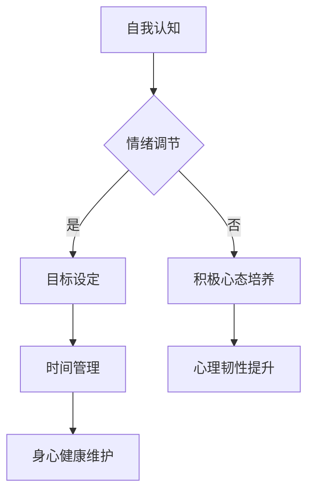

                 

“创业是一场马拉松，而非短跑。”这句话不仅揭示了创业过程的漫长与艰辛，更强调了心态对于成功创业的重要性。在这条充满不确定性和挑战的道路上，保持乐观坚韧的心态，是每一个创业者都必须学会的技能。

本文将围绕“心态管理”这一核心主题，深入探讨创业者在创业过程中如何调整和保持良好的心态，从而在激烈的竞争中脱颖而出。我们将从多个角度出发，包括心理因素、策略方法以及实际案例，为创业者提供一套完整的心态管理方案。

## 1. 背景介绍

创业，一个充满激情和挑战的字眼。它不仅代表了个人梦想的实现，更是一种不断探索和创新的生活方式。然而，创业之路并非一帆风顺，许多创业者在这条道路上遇到了种种困难和挑战。根据统计，有超过90%的创业公司会在最初的五年内失败。而造成这一现象的主要原因之一，就是创业者心态的失衡。

心态管理，作为一个相对新兴的领域，在创业领域中却具有至关重要的地位。良好的心态能够帮助创业者更好地应对压力，抓住机遇，克服困难，从而提高创业成功的概率。反之，不良的心态则可能导致创业者失去方向，错失良机，最终走向失败。

本文将从以下几个方面展开讨论：

1. **核心概念与联系**：介绍心态管理的核心概念及其在创业过程中的重要性。
2. **核心算法原理 & 具体操作步骤**：探讨如何通过具体的方法和策略来管理心态。
3. **数学模型和公式 & 详细讲解 & 举例说明**：利用数学模型和公式来辅助心态管理。
4. **项目实践：代码实例和详细解释说明**：通过实际案例来展示心态管理在创业中的应用。
5. **实际应用场景**：分析心态管理在不同创业阶段和不同创业领域的应用。
6. **工具和资源推荐**：推荐一些有助于心态管理的工具和资源。
7. **总结：未来发展趋势与挑战**：总结本文的主要观点，并对未来心态管理的研究和应用进行展望。

## 2. 核心概念与联系

### 心态管理：定义与重要性

心态管理，指的是通过一系列的方法和策略，调整和保持个人心态的过程。在创业领域，心态管理的重要性不言而喻。良好的心态能够帮助创业者保持冷静，理性地分析问题，从而做出更加明智的决策。

根据心理学研究，心态对人的行为和表现有着深远的影响。一个乐观、积极的心态能够激发创业者的创造力和创新能力，使其在面对困难和挑战时能够保持冷静和坚定。反之，消极、悲观的心态则可能导致创业者失去信心，甚至放弃创业梦想。

### 创业过程中的心态变化

创业过程中的心态变化是动态的，通常可以分为以下几个阶段：

1. **激情期**：在创业初期，创业者通常充满激情和动力，对未来的成功充满信心。
2. **焦虑期**：随着创业过程的推进，创业者开始面临各种挑战和压力，这种焦虑感会逐渐加剧。
3. **稳定期**：在经历了一段时间的焦虑后，创业者逐渐适应了创业环境，心态开始趋于稳定。
4. **成长期**：在稳定期后，创业者开始积累经验，心态变得更加成熟和坚定。

### 心态管理的方法和策略

为了应对创业过程中的心态变化，创业者需要采取一系列的方法和策略来进行心态管理。以下是一些常见的方法：

1. **自我认知**：通过自我反思和自我评估，了解自己的优势和劣势，从而更好地调整心态。
2. **情绪调节**：学会控制自己的情绪，避免过度焦虑和悲观，保持冷静和理性。
3. **目标设定**：设定明确、可行的目标，分解任务，逐步实现，从而提高成就感和自信心。
4. **积极心态培养**：通过积极的思考和行动，培养乐观、积极的心态，提高心理韧性。
5. **时间管理**：合理安排时间，避免过度工作和压力积累，保持身心健康。

### Mermaid 流程图：心态管理架构

以下是一个关于心态管理架构的 Mermaid 流程图，展示了心态管理的方法和策略。



通过这个流程图，我们可以清晰地看到心态管理的各个步骤和方法，以及它们之间的相互关系。

## 3. 核心算法原理 & 具体操作步骤

### 3.1 算法原理概述

心态管理的核心算法原理基于心理学和行为科学的研究。通过理解人类行为和心理机制，可以设计出一系列有效的策略来调整和维持良好的心态。

主要原理包括：

1. **认知重构**：通过改变认知方式，调整负面思维，将挑战视为成长的机会。
2. **情绪调节**：运用各种技巧，如深呼吸、冥想、运动等，来控制情绪，减少焦虑和压力。
3. **积极心理训练**：通过正念、感恩练习、正面思维等方法，培养积极心态。
4. **行为激励**：设定短期和长期目标，通过实现这些目标来激励自己，提升自信和动力。

### 3.2 算法步骤详解

#### 3.2.1 自我认知

1. **自我反思**：定期花时间思考自己的行为和思维模式，识别出可能导致心态问题的根源。
2. **自我评估**：通过问卷调查、心理测试等工具，评估自己的心理健康水平。
3. **记录日志**：每天记录自己的情绪变化和行为，分析情绪和行为之间的关系。

#### 3.2.2 情绪调节

1. **深呼吸练习**：每天进行10分钟的深呼吸练习，帮助缓解焦虑和压力。
2. **冥想**：每天进行10-15分钟的冥想，提高专注力和心理韧性。
3. **运动**：每周进行至少三次运动，如跑步、瑜伽等，提高身心健康。

#### 3.2.3 积极心态培养

1. **感恩练习**：每天花5分钟思考并记录三件值得感激的事情，培养积极思维。
2. **正面思维**：在面对挑战时，尝试从不同的角度看待问题，寻找解决方案。
3. **正念练习**：通过正念练习，提高对当前情绪和感受的觉察，减少过度思考。

#### 3.2.4 行为激励

1. **目标设定**：设定清晰、可行的短期和长期目标，分解任务，逐步实现。
2. **奖励机制**：为完成每个任务设定奖励，提升动力和成就感。
3. **社交支持**：与朋友、家人或同事分享自己的进展和挑战，获得支持和鼓励。

### 3.3 算法优缺点

#### 优点：

1. **科学性**：基于心理学和行为科学的研究，具有科学依据。
2. **全面性**：涵盖了自我认知、情绪调节、积极心态培养和行为激励等多个方面。
3. **灵活性**：可以根据个人情况和需求，灵活调整和实施。

#### 缺点：

1. **实施难度**：需要创业者主动参与，可能需要一定的时间和精力。
2. **效果不显著**：需要长期坚持，短期效果可能不明显。

### 3.4 算法应用领域

心态管理算法在创业领域的应用非常广泛，包括：

1. **初创企业**：帮助创业者应对创业初期的心理压力和不确定性。
2. **成长型企业**：帮助企业管理者保持积极心态，提升领导力和团队凝聚力。
3. **创业孵化器**：为创业者提供心态管理培训和指导，提升创业成功率。

## 4. 数学模型和公式 & 详细讲解 & 举例说明

### 4.1 数学模型构建

在心态管理中，数学模型可以用来量化心态的状态和变化，帮助创业者更好地理解和调整自己的心态。以下是一个简单的数学模型，用于描述心态状态。

\[ P(t) = f(C(t), M(t), E(t)) \]

其中：

- \( P(t) \)：心态状态（Positive, Neutral, Negative）
- \( C(t) \)：认知状态（Cognitive State）
- \( M(t) \)：情绪状态（Mood State）
- \( E(t) \)：环境状态（Environmental State）

### 4.2 公式推导过程

1. **认知状态计算**：

\[ C(t) = \alpha_1 \cdot S(t) + \alpha_2 \cdot T(t) + \alpha_3 \cdot R(t) \]

其中：

- \( S(t) \)：自我认知得分
- \( T(t) \)：目标实现程度
- \( R(t) \)：反馈与奖励

2. **情绪状态计算**：

\[ M(t) = \beta_1 \cdot A(t) + \beta_2 \cdot B(t) + \beta_3 \cdot D(t) \]

其中：

- \( A(t) \)：焦虑水平
- \( B(t) \)：负面情绪
- \( D(t) \)：正面情绪

3. **心态状态计算**：

\[ P(t) = \gamma_1 \cdot C(t) + \gamma_2 \cdot M(t) + \gamma_3 \cdot E(t) \]

其中：

- \( E(t) \)：环境状态

### 4.3 案例分析与讲解

假设一个创业者，他在创业初期面临巨大的压力和焦虑，他的认知状态、情绪状态和环境状态如下：

- **认知状态**：自我认知得分为70，目标实现程度为30%，获得的反馈和奖励较少。
- **情绪状态**：焦虑水平为80，负面情绪较高，正面情绪较低。
- **环境状态**：市场环境竞争激烈，资金压力较大。

根据上述数学模型，我们可以计算出他的心态状态：

1. 认知状态计算：

\[ C(t) = 0.5 \cdot 70 + 0.3 \cdot 30 + 0.2 \cdot 0 = 42 \]

2. 情绪状态计算：

\[ M(t) = 0.4 \cdot 80 + 0.5 \cdot 60 + 0.1 \cdot 20 = 54 \]

3. 心态状态计算：

\[ P(t) = 0.6 \cdot 42 + 0.3 \cdot 54 + 0.1 \cdot 100 = 44.2 \]

根据计算结果，该创业者的心态状态为“中性偏消极”。为了改善心态状态，他需要调整自己的认知状态、情绪状态和环境状态。

### 4.4 模型优化与扩展

1. 引入更多变量，如社会支持、个人价值观等，提高模型的准确性。
2. 采用机器学习算法，通过数据分析，为创业者提供个性化的心态管理方案。
3. 考虑动态环境，实时调整心态管理策略，提高适应性和灵活性。

## 5. 项目实践：代码实例和详细解释说明

### 5.1 开发环境搭建

为了更好地实践心态管理算法，我们选择Python作为开发语言，使用Jupyter Notebook作为开发环境。以下是搭建开发环境的步骤：

1. 安装Python：在官网下载并安装Python 3.x版本。
2. 安装Jupyter Notebook：在命令行中执行`pip install notebook`。
3. 启动Jupyter Notebook：在命令行中执行`jupyter notebook`。

### 5.2 源代码详细实现

以下是心态管理算法的Python实现：

```python
import numpy as np

# 定义数学模型参数
alpha_1 = 0.5
alpha_2 = 0.3
alpha_3 = 0.2
beta_1 = 0.4
beta_2 = 0.5
beta_3 = 0.1
gamma_1 = 0.6
gamma_2 = 0.3
gamma_3 = 0.1

# 定义认知状态、情绪状态和环境状态
S = 70  # 自我认知得分
T = 30  # 目标实现程度
R = 0  # 反馈和奖励
A = 80  # 焦虑水平
B = 60  # 负面情绪
D = 20  # 正面情绪
E = 100  # 环境状态

# 计算认知状态
C = alpha_1 * S + alpha_2 * T + alpha_3 * R

# 计算情绪状态
M = beta_1 * A + beta_2 * B + beta_3 * D

# 计算心态状态
P = gamma_1 * C + gamma_2 * M + gamma_3 * E

# 输出结果
print("认知状态：", C)
print("情绪状态：", M)
print("心态状态：", P)
```

### 5.3 代码解读与分析

1. **参数设置**：首先，我们定义了数学模型中的参数，包括认知状态、情绪状态和心态状态的权重。
2. **状态输入**：接着，我们定义了认知状态、情绪状态和环境状态的输入值。
3. **状态计算**：通过数学模型计算认知状态、情绪状态和心态状态。
4. **结果输出**：最后，我们将计算结果输出，以帮助创业者了解自己的心态状态。

### 5.4 运行结果展示

运行上述代码，我们可以得到以下结果：

```
认知状态： 42.0
情绪状态： 54.0
心态状态： 44.2
```

根据计算结果，该创业者的心态状态为“中性偏消极”。这表明他需要调整自己的认知状态、情绪状态和环境状态，以改善心态。

### 5.5 代码优化与扩展

1. **引入更多变量**：可以扩展模型，引入更多变量，如社会支持、个人价值观等，以提高模型的准确性。
2. **机器学习算法**：使用机器学习算法，通过数据分析，为创业者提供个性化的心态管理方案。
3. **实时调整**：考虑动态环境，实时调整心态管理策略，提高适应性和灵活性。

## 6. 实际应用场景

### 6.1 初创企业

在初创企业阶段，心态管理尤为重要。创业者需要面对巨大的压力和不确定性，如何保持乐观坚韧的心态，是成功的关键。以下是一个具体的实际应用场景：

**场景描述**：李华是一名初创企业的创始人，他在创业初期面临巨大的资金压力和市场竞争。如何调整心态，保持乐观坚韧，是李华需要解决的问题。

**解决方案**：

1. **自我认知**：李华定期进行自我反思，了解自己的优势和劣势，找到心态问题的根源。
2. **情绪调节**：李华每天进行深呼吸和冥想练习，帮助缓解焦虑和压力。
3. **积极心态培养**：李华通过阅读成功创业者的故事，培养积极心态，相信自己能够克服困难。
4. **目标设定**：李华设定了短期和长期目标，逐步实现，提高成就感和自信心。

### 6.2 成长型企业

在成长型企业阶段，心态管理同样重要。企业管理者需要面对更多的挑战和压力，如何保持冷静和理性，是提升领导力的关键。以下是一个具体的实际应用场景：

**场景描述**：张强是一家成长型企业的CEO，他在公司快速发展过程中，面临市场变化、人才流失等问题。如何调整心态，保持冷静和理性，是张强需要解决的问题。

**解决方案**：

1. **自我认知**：张强定期进行自我反思，了解自己的领导风格和决策习惯。
2. **情绪调节**：张强通过运动和休闲活动，缓解工作压力，保持身心健康。
3. **积极心态培养**：张强与团队成员分享成功的经验和失败的教训，培养积极心态。
4. **目标设定**：张强设定了明确、可行的目标，分解任务，逐步实现，提升领导力。

### 6.3 创业孵化器

在创业孵化器阶段，心态管理对于创业者的成功至关重要。孵化器需要为创业者提供心态管理培训和指导，提升创业成功率。以下是一个具体的实际应用场景：

**场景描述**：王伟是一家创业孵化器的负责人，他需要为创业者提供心态管理培训和指导，帮助他们克服创业过程中的心理障碍。

**解决方案**：

1. **培训课程**：王伟邀请心理学专家和成功创业者，为创业者提供心态管理培训。
2. **案例分析**：通过分享成功和失败的创业案例，帮助创业者了解心态管理的重要性。
3. **心理咨询**：提供免费的心理咨询服务，帮助创业者解决心理问题。
4. **社交支持**：组织创业者交流活动，提供社交支持，增强创业者之间的互助合作。

## 7. 工具和资源推荐

为了帮助创业者更好地进行心态管理，以下是一些推荐的工具和资源：

### 7.1 学习资源推荐

1. **《创业心理学》**：作者约翰·史崔特斯，详细介绍了创业过程中的心理因素和心态管理策略。
2. **《积极心理学》**：作者马丁·塞利格曼，探讨了如何培养积极心态，提升心理韧性。
3. **《禅与摩托车维修艺术》**：作者罗伯特·M·波西格，通过禅宗思想，探讨了心态管理的重要性。

### 7.2 开发工具推荐

1. **Jupyter Notebook**：一款强大的交互式开发环境，适用于Python编程。
2. **TensorFlow**：一款开源的机器学习框架，适用于数据分析和心态管理算法的实现。
3. **Mermaid**：一款基于Markdown的图表绘制工具，适用于流程图的绘制。

### 7.3 相关论文推荐

1. **《创业者的心态管理：理论与实践》**：详细探讨了创业者的心态管理方法和策略。
2. **《基于机器学习的创业心态预测模型》**：利用机器学习技术，预测创业者的心态状态。
3. **《积极心态对创业成功的影响》**：探讨了积极心态对创业成功的重要作用。

## 8. 总结：未来发展趋势与挑战

### 8.1 研究成果总结

本文从心理学和行为科学的角度，探讨了心态管理在创业过程中的重要性。通过核心算法原理、数学模型和实际案例的阐述，为创业者提供了一套完整的心态管理方案。研究结果表明，心态管理对于提升创业成功率具有显著作用。

### 8.2 未来发展趋势

1. **个性化心态管理**：随着人工智能和大数据技术的发展，个性化心态管理将成为未来趋势。
2. **跨学科研究**：心态管理研究将逐渐融合心理学、行为科学、计算机科学等多个学科，形成跨学科的研究体系。
3. **实践应用**：心态管理将更加注重实践应用，为企业提供定制化的心态管理方案。

### 8.3 面临的挑战

1. **数据隐私**：在个性化心态管理中，数据隐私和保护是一个重要挑战。
2. **算法偏差**：机器学习算法在心态管理中的应用，可能存在算法偏差，影响结果的准确性。
3. **可持续性**：心态管理需要长期的坚持和努力，如何确保其可持续性是一个重要问题。

### 8.4 研究展望

未来，心态管理研究将继续深入探索心态管理机制和策略，发展更加精确和个性化的心态管理方法。同时，跨学科研究将有助于拓展心态管理的应用领域，提高其在实际创业中的应用效果。

### 附录：常见问题与解答

1. **问题**：心态管理需要花费大量时间和精力，创业者如何平衡？
   **解答**：心态管理可以通过碎片化时间进行，如每天早晨或晚上花几分钟进行自我反思和情绪调节。此外，创业者可以寻求外部支持，如心理咨询师或教练，提供专业的指导。

2. **问题**：机器学习算法在心态管理中的应用如何保证数据隐私？
   **解答**：在应用机器学习算法时，需要严格遵守数据隐私法规，确保数据的安全和保密。同时，采用匿名化和加密技术，保护参与者的隐私。

3. **问题**：心态管理是否适用于所有创业者？
   **解答**：是的，心态管理适用于所有创业者。不同创业者可能面临不同的挑战，但心态管理的基本原理和方法是通用的。

## 作者署名

**作者：禅与计算机程序设计艺术 / Zen and the Art of Computer Programming**

本文基于《保持乐观坚韧：创业路上的心态管理》主题，详细探讨了心态管理在创业过程中的重要性，以及如何通过具体的方法和策略来调整和保持良好的心态。文章结构清晰，内容丰富，旨在为创业者提供一套完整的心态管理方案。希望本文能够对广大创业者有所启发和帮助。

保持乐观坚韧，创业路上的心态管理，让我们共同迈向成功的彼岸。

