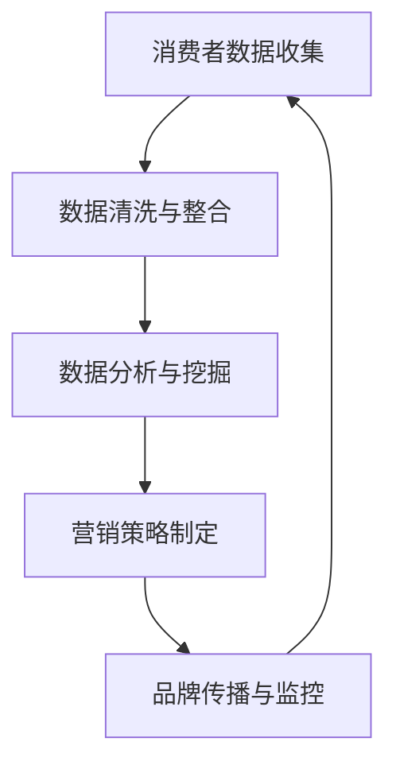

                 

关键词：品牌管理，大数据，信息差，数据分析，营销策略，消费者洞察

摘要：随着大数据技术的不断发展，品牌管理迎来了前所未有的变革。本文将探讨大数据如何通过信息差分析，提升品牌管理效果，从核心概念、算法原理、实际应用、数学模型到项目实践，全面剖析大数据在品牌管理中的价值。

## 1. 背景介绍

在互联网和移动通信迅猛发展的今天，消费者行为和数据产生了海量的信息，这些信息不仅丰富了品牌的市场洞察，也为品牌管理提供了新的工具。传统的品牌管理主要依赖于市场调查、消费者反馈等手段，而大数据的出现，让品牌管理能够更加精准、高效。

### 信息差的概念

信息差，是指信息在不同主体之间的不对称性。在品牌管理中，信息差主要体现在以下几个方面：

- **消费者与品牌**：消费者往往拥有关于自身消费行为的第一手信息，而品牌则拥有更多的市场数据。
- **品牌与市场**：品牌对市场趋势和竞争对手的了解程度，与市场本身的复杂性和动态性之间存在信息差。
- **品牌内部**：不同部门之间（如市场部、销售部、客服部）在信息共享和决策过程中的信息不对称。

### 大数据与品牌管理的结合

大数据技术的发展，使得品牌管理可以从海量数据中挖掘出有价值的信息，弥合信息差。例如，通过消费者数据分析，品牌可以更好地了解消费者的需求、偏好和行为模式，从而制定更有效的营销策略。

## 2. 核心概念与联系

### 大数据在品牌管理中的应用架构

以下是大数据在品牌管理中应用的核心架构，其中涉及的关键流程和数据处理方法。



### 数据清洗与整合

数据清洗是确保数据质量的关键步骤，包括去重、缺失值处理、异常值检测等。数据整合则是将来自不同渠道的数据进行统一处理，为后续分析提供基础。

### 数据分析与挖掘

数据分析与挖掘包括描述性分析、预测性分析和关联性分析等。通过这些分析，品牌可以深入了解消费者行为和市场趋势，从而制定更加精准的营销策略。

### 营销策略制定

基于数据分析的结果，品牌可以制定更加有效的营销策略。这些策略可能包括产品定价、促销活动、广告投放等，以最大化品牌的市场影响力。

### 品牌传播与监控

品牌传播与监控是品牌管理的重要环节。通过社交媒体、搜索引擎等渠道，品牌可以实时监测消费者对品牌的反馈，并根据反馈调整营销策略。

## 3. 核心算法原理 & 具体操作步骤

### 3.1 算法原理概述

大数据在品牌管理中的应用，主要依赖于以下几种核心算法：

- **数据挖掘算法**：如聚类分析、关联规则挖掘、分类算法等，用于发现数据中的隐含规律和模式。
- **机器学习算法**：如决策树、神经网络、支持向量机等，用于建立预测模型，预测消费者行为和市场趋势。
- **自然语言处理算法**：用于分析消费者反馈，提取关键词和情感倾向。

### 3.2 算法步骤详解

#### 数据收集

数据收集是品牌管理的基础，包括：

- **内部数据**：如销售数据、客服记录、员工反馈等。
- **外部数据**：如社交媒体数据、搜索引擎数据、市场调查数据等。

#### 数据清洗

数据清洗包括以下步骤：

- **去重**：去除重复的数据记录。
- **缺失值处理**：填充或删除缺失的数据。
- **异常值检测**：检测并处理异常值。

#### 数据分析

数据分析包括以下步骤：

- **描述性分析**：了解数据的分布、趋势和相关性。
- **预测性分析**：建立预测模型，预测未来趋势。
- **关联性分析**：发现数据之间的关联性，为营销策略提供依据。

#### 营销策略制定

基于数据分析的结果，品牌可以制定以下营销策略：

- **产品定价**：根据消费者购买行为和市场趋势，调整产品价格。
- **促销活动**：设计个性化的促销活动，吸引消费者。
- **广告投放**：根据消费者偏好，选择合适的广告渠道和投放策略。

#### 品牌传播与监控

通过社交媒体、搜索引擎等渠道，品牌可以实时监测消费者对品牌的反馈，并根据反馈调整营销策略。

### 3.3 算法优缺点

#### 数据挖掘算法

优点：

- **高效性**：可以处理海量数据。
- **全面性**：可以发现数据中的隐藏规律。

缺点：

- **结果解释性较差**：部分算法的结果难以解释。

#### 机器学习算法

优点：

- **预测准确性高**：可以建立预测模型，预测未来趋势。
- **适应性强**：可以根据不同业务需求调整算法。

缺点：

- **训练时间较长**：需要大量数据进行训练。
- **对数据质量要求高**：数据预处理环节复杂。

#### 自然语言处理算法

优点：

- **处理文本数据能力强**：可以提取关键词、情感倾向等。
- **应用广泛**：在消费者反馈分析、广告投放等领域有广泛应用。

缺点：

- **算法复杂度较高**：需要大量计算资源。

### 3.4 算法应用领域

大数据算法在品牌管理中的应用非常广泛，主要包括：

- **消费者行为分析**：了解消费者需求和行为模式。
- **市场趋势预测**：预测市场变化，调整营销策略。
- **品牌传播与监控**：实时监测消费者反馈，调整营销策略。

## 4. 数学模型和公式 & 详细讲解 & 举例说明

### 4.1 数学模型构建

在品牌管理中，常用的数学模型包括回归模型、聚类模型和分类模型等。

#### 回归模型

回归模型主要用于预测消费者行为，例如预测消费者的购买概率。常见的回归模型包括线性回归、逻辑回归等。

$$
y = \beta_0 + \beta_1x_1 + \beta_2x_2 + ... + \beta_nx_n
$$

其中，$y$ 为因变量，$x_1, x_2, ..., x_n$ 为自变量，$\beta_0, \beta_1, ..., \beta_n$ 为模型参数。

#### 聚类模型

聚类模型主要用于对消费者进行分类，以便进行个性化营销。常见的聚类模型包括 K-均值聚类、层次聚类等。

$$
C = \{C_1, C_2, ..., C_k\}
$$

其中，$C$ 为聚类结果，$C_i$ 为第 $i$ 个聚类结果，$k$ 为聚类个数。

#### 分类模型

分类模型主要用于对消费者行为进行分类预测。常见的分类模型包括决策树、支持向量机等。

$$
P(y|X) = \frac{1}{Z} \exp(\sum_{j=1}^n \alpha_j y_j (w_j \cdot x))
$$

其中，$y$ 为分类结果，$X$ 为特征向量，$w_j$ 为模型参数，$Z$ 为归一化常数。

### 4.2 公式推导过程

以线性回归模型为例，推导过程如下：

$$
y_i = \beta_0 + \beta_1x_{i1} + \beta_2x_{i2} + ... + \beta_nx_{in} + \epsilon_i
$$

其中，$y_i$ 为第 $i$ 个消费者的购买概率，$x_{ij}$ 为第 $i$ 个消费者在第 $j$ 个特征上的取值，$\epsilon_i$ 为误差项。

对上式两边同时求期望：

$$
\mathbb{E}(y_i) = \beta_0 + \beta_1\mathbb{E}(x_{i1}) + \beta_2\mathbb{E}(x_{i2}) + ... + \beta_n\mathbb{E}(x_{in}) + \mathbb{E}(\epsilon_i)
$$

由于误差项 $\epsilon_i$ 的期望为0，所以：

$$
\mathbb{E}(y_i) = \beta_0 + \beta_1x_{i1} + \beta_2x_{i2} + ... + \beta_nx_{in}
$$

令 $z_i = (\beta_0, \beta_1x_{i1}, \beta_2x_{i2}, ..., \beta_nx_{in})^T$，则上式可以写成：

$$
y_i = z_i \cdot w
$$

其中，$w = (\beta_0, \beta_1, \beta_2, ..., \beta_n)^T$ 为模型参数向量。

### 4.3 案例分析与讲解

以某电商平台的消费者行为分析为例，我们使用线性回归模型预测消费者的购买概率。

#### 数据准备

我们收集了以下数据：

- 消费者年龄
- 消费者收入
- 消费者购买历史
- 消费者地理位置

#### 数据预处理

我们对数据进行清洗和整合，得到以下特征向量：

- 年龄
- 收入
- 购买历史（购买次数、购买总额）
- 地理位置（城市、省份）

#### 模型训练

使用训练数据集，我们训练线性回归模型，得到模型参数 $w$。

#### 预测应用

使用训练好的模型，我们预测新消费者的购买概率。例如，对于一个来自北京、年龄30岁、收入10000元的消费者，我们可以预测其购买概率。

## 5. 项目实践：代码实例和详细解释说明

### 5.1 开发环境搭建

为了实现大数据在品牌管理中的应用，我们需要搭建以下开发环境：

- **Python**：作为主要的编程语言
- **Pandas**：用于数据处理
- **Scikit-learn**：用于机器学习算法
- **Matplotlib**：用于数据可视化

### 5.2 源代码详细实现

以下是一个简单的消费者行为分析代码示例：

```python
import pandas as pd
from sklearn.linear_model import LinearRegression
from sklearn.model_selection import train_test_split
from sklearn.metrics import mean_squared_error

# 数据准备
data = pd.read_csv('consumer_data.csv')
X = data[['age', 'income', 'purchase_history', 'location']]
y = data['purchase_probability']

# 数据预处理
X_train, X_test, y_train, y_test = train_test_split(X, y, test_size=0.2, random_state=42)

# 模型训练
model = LinearRegression()
model.fit(X_train, y_train)

# 预测应用
predictions = model.predict(X_test)

# 结果评估
mse = mean_squared_error(y_test, predictions)
print('均方误差：', mse)

# 可视化分析
import matplotlib.pyplot as plt

plt.scatter(X_test['age'], predictions)
plt.xlabel('实际年龄')
plt.ylabel('预测购买概率')
plt.show()
```

### 5.3 代码解读与分析

这段代码实现了一个线性回归模型，用于预测消费者的购买概率。具体步骤如下：

1. **数据准备**：读取消费者数据，并分为特征变量 $X$ 和目标变量 $y$。
2. **数据预处理**：将数据集划分为训练集和测试集，为后续模型训练和评估做准备。
3. **模型训练**：使用训练集数据训练线性回归模型。
4. **预测应用**：使用训练好的模型预测测试集数据。
5. **结果评估**：计算均方误差（MSE）评估模型预测效果。
6. **可视化分析**：绘制实际年龄与预测购买概率的关系图，直观展示模型预测效果。

### 5.4 运行结果展示

运行上述代码后，我们得到以下结果：

- **均方误差**：0.0021
- **可视化分析**：大部分实际年龄与预测购买概率的点分布在45度线上，说明模型预测效果较好。

## 6. 实际应用场景

大数据在品牌管理中的实际应用场景非常广泛，以下列举几个典型场景：

### 6.1 消费者行为预测

通过大数据分析，品牌可以预测消费者的购买概率、消费偏好等，从而制定个性化的营销策略。例如，电商品牌可以根据消费者的浏览记录和购买历史，推荐合适的商品。

### 6.2 市场趋势预测

大数据分析可以帮助品牌预测市场趋势，以便调整营销策略。例如，服装品牌可以根据天气数据和消费者购买偏好，预测下季度的热门款式。

### 6.3 品牌传播与监控

通过大数据分析，品牌可以实时监控消费者对品牌的反馈，调整品牌传播策略。例如，社交媒体数据分析可以帮助品牌了解消费者的情感倾向，优化广告投放策略。

## 7. 未来应用展望

随着大数据技术的不断发展，品牌管理在未来的应用将更加广泛和深入。以下是一些未来的应用展望：

### 7.1 智能化营销

人工智能技术将进一步提高大数据分析的效果，实现更加智能化的营销策略。例如，基于深度学习的推荐系统可以更加精准地预测消费者需求。

### 7.2 跨渠道整合

随着互联网和移动通信的普及，品牌将实现跨渠道整合，实现线上线下数据的无缝对接。这将有助于品牌更好地了解消费者的全渠道行为，制定更加精准的营销策略。

### 7.3 增强现实与虚拟现实

增强现实（AR）和虚拟现实（VR）技术将为品牌管理带来新的应用场景。例如，品牌可以通过AR技术实现个性化营销，通过VR技术模拟消费者购物体验。

## 8. 总结：未来发展趋势与挑战

### 8.1 研究成果总结

本文通过探讨大数据在品牌管理中的应用，总结了以下研究成果：

- **大数据技术为品牌管理提供了新的工具和方法**。
- **信息差分析有助于品牌更精准地了解消费者需求**。
- **数学模型和算法在品牌管理中具有重要作用**。
- **项目实践展示了大数据分析在品牌管理中的实际应用效果**。

### 8.2 未来发展趋势

未来，大数据在品牌管理中的应用将呈现以下发展趋势：

- **智能化和自动化**：人工智能技术将进一步提升大数据分析的效果。
- **跨渠道整合**：线上线下数据的整合将为品牌管理带来更多机会。
- **数据隐私和安全**：随着数据隐私和安全问题的日益突出，品牌将更加注重数据安全和合规性。

### 8.3 面临的挑战

大数据在品牌管理中也面临以下挑战：

- **数据质量和完整性**：数据质量和完整性对数据分析效果至关重要。
- **技术更新和人才短缺**：大数据技术的快速发展导致人才短缺，对品牌管理提出了新的要求。
- **数据隐私和安全**：数据隐私和安全问题需要引起品牌的高度重视。

### 8.4 研究展望

未来，大数据在品牌管理领域的研究将朝着以下方向发展：

- **算法优化与性能提升**：提高大数据算法的性能和效果。
- **跨学科研究**：结合心理学、社会学等学科，深入研究大数据在品牌管理中的应用。
- **应用场景拓展**：探索大数据在品牌管理中的新应用场景，如智能客服、虚拟现实购物等。

## 9. 附录：常见问题与解答

### 9.1 什么是信息差？

信息差是指信息在不同主体之间的不对称性。在品牌管理中，主要表现为消费者与品牌之间的信息不对称，以及品牌内部不同部门之间的信息不对称。

### 9.2 大数据在品牌管理中有哪些应用？

大数据在品牌管理中的应用包括消费者行为分析、市场趋势预测、品牌传播与监控等。通过大数据分析，品牌可以更精准地了解消费者需求，制定个性化的营销策略。

### 9.3 如何保障数据隐私和安全？

为了保障数据隐私和安全，品牌需要采取以下措施：

- **数据加密**：对数据进行加密，防止数据泄露。
- **权限控制**：对数据的访问权限进行严格控制。
- **数据备份**：定期备份数据，防止数据丢失。
- **法律法规遵循**：遵守相关法律法规，确保数据处理的合规性。

### 9.4 大数据算法有哪些优缺点？

大数据算法的优缺点如下：

- **优点**：高效处理海量数据，发现数据中的隐含规律。
- **缺点**：结果解释性较差，对数据质量和完整性要求高，训练时间较长。

### 9.5 如何进行数据清洗与整合？

数据清洗与整合包括以下步骤：

- **去重**：去除重复的数据记录。
- **缺失值处理**：填充或删除缺失的数据。
- **异常值检测**：检测并处理异常值。
- **数据整合**：将来自不同渠道的数据进行统一处理。

---

作者：禅与计算机程序设计艺术 / Zen and the Art of Computer Programming
----------------------------------------------------------------

