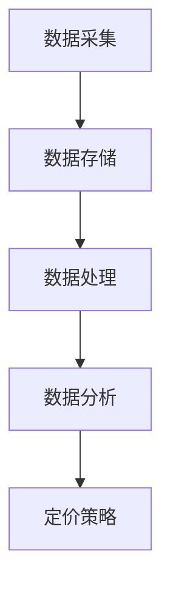

                 

摘要：本文探讨了信息差在商业定价策略中的重要性，并详细阐述了大数据技术在优化定价策略中的应用。通过核心算法原理、数学模型及案例实践，本文为读者揭示了如何利用大数据技术实现精准定价，提高企业盈利能力。同时，对未来的发展趋势、面临的挑战及研究展望进行了深入探讨。

## 1. 背景介绍

### 信息差的基本概念

信息差是指在市场中，买方和卖方之间的信息不对称现象。这种不对称可能源于买方对产品或服务的了解不足，或者卖方对市场需求、消费者行为等信息的掌握。在商业活动中，信息差的存在可能导致价格扭曲，从而影响市场的公平性。

### 商业定价策略的重要性

定价策略是企业竞争的关键因素之一。合理的定价策略能够提高企业的盈利能力，同时满足消费者的需求。然而，传统定价策略往往依赖于经验、市场调研和简单的成本加成方法，难以应对复杂多变的市场环境。

### 大数据在定价策略中的应用

随着大数据技术的快速发展，越来越多的企业开始利用大数据分析来优化定价策略。大数据技术能够处理海量数据，挖掘隐藏在数据中的规律，为企业的定价决策提供有力支持。

## 2. 核心概念与联系

### 大数据技术的基本原理

大数据技术主要包括数据采集、存储、处理、分析和可视化等环节。通过这些技术手段，企业能够获取、处理并分析大量与市场需求、消费者行为相关的数据。

### 商业定价策略与大数据技术的关联

商业定价策略需要依赖准确的市场信息和消费者行为数据。大数据技术能够帮助企业收集这些数据，并通过数据挖掘、机器学习等技术手段，分析出市场规律和消费者偏好，从而制定出更为精准的定价策略。

### Mermaid 流程图

下面是一个简单的 Mermaid 流程图，展示了大数据技术在商业定价策略中的应用流程。



## 3. 核心算法原理 & 具体操作步骤

### 3.1 算法原理概述

本文所介绍的核心算法是一种基于大数据分析的市场需求预测模型。该模型通过分析历史销售数据、市场趋势、消费者行为等数据，预测未来市场的需求情况，从而为企业的定价策略提供依据。

### 3.2 算法步骤详解

#### 步骤1：数据采集

首先，企业需要收集与市场需求、消费者行为相关的数据。这些数据可以来源于企业的销售系统、社交媒体、消费者调查等。

#### 步骤2：数据预处理

收集到的数据往往存在噪声、缺失值等问题。因此，在数据分析前，需要对数据进行预处理，包括数据清洗、数据整合等步骤。

#### 步骤3：特征工程

特征工程是大数据分析的关键步骤。通过对数据进行特征提取和特征选择，可以提高模型的预测准确性。常见的特征提取方法包括统计特征、文本特征、图像特征等。

#### 步骤4：模型训练

选择合适的机器学习算法，对预处理后的数据集进行训练。常用的算法包括线性回归、决策树、随机森林、支持向量机等。

#### 步骤5：模型评估

通过交叉验证等方法，对模型的预测性能进行评估。如果模型性能不满足要求，需要返回步骤3，重新进行特征工程和模型训练。

#### 步骤6：定价策略制定

根据模型的预测结果，制定出具体的定价策略。例如，根据市场需求预测，调整产品价格，以实现最大化利润。

### 3.3 算法优缺点

#### 优点

- 精准性：基于大数据分析的定价策略能够更准确地预测市场需求，提高定价的精准度。
- 实时性：大数据技术能够实时收集和分析数据，为企业提供即时的定价决策支持。
- 全面性：大数据技术能够处理多种类型的数据，为定价策略提供更全面的信息支持。

#### 缺点

- 复杂性：大数据分析涉及多个环节，算法复杂度高，对技术水平要求较高。
- 成本：大数据分析需要大量的计算资源和数据存储资源，成本较高。

### 3.4 算法应用领域

大数据技术在商业定价策略中的应用广泛，包括电子商务、金融、医疗等多个领域。例如，电商平台可以通过大数据分析，为不同消费者群体制定个性化的定价策略，提高销售额；金融机构可以通过大数据分析，预测市场走势，调整投资组合，降低风险。

## 4. 数学模型和公式 & 详细讲解 & 举例说明

### 4.1 数学模型构建

商业定价策略的数学模型通常是基于市场需求预测模型和利润最大化目标。假设市场需求 \(Q\) 与价格 \(P\) 之间存在以下线性关系：

\[ Q = a - bP \]

其中，\(a\) 表示市场需求的最大值，\(b\) 表示价格对需求的影响程度。企业的利润 \(π\) 可以表示为：

\[ π = P \cdot Q - C \]

其中，\(C\) 表示企业的生产成本。

### 4.2 公式推导过程

为了最大化利润，需要求出价格 \(P\) 的最优值。将市场需求模型代入利润公式，得到：

\[ π = (a - bP)P - C \]
\[ π = aP - bP^2 - C \]

对利润函数求导，并令导数等于零，求得最优价格：

\[ \frac{dπ}{dP} = a - 2bP = 0 \]
\[ P = \frac{a}{2b} \]

### 4.3 案例分析与讲解

以某电商平台为例，根据历史销售数据，市场需求的最大值 \(a = 1000\)，价格对需求的影响程度 \(b = 0.1\)。根据上述公式，求得最优价格为：

\[ P = \frac{1000}{2 \times 0.1} = 500 \]

因此，该电商平台应将商品价格定为 500 元，以实现最大化利润。

## 5. 项目实践：代码实例和详细解释说明

### 5.1 开发环境搭建

在本案例中，我们将使用 Python 语言进行编程。首先，需要安装 Python 环境，并安装以下库：NumPy、Pandas、Scikit-learn、Matplotlib。

### 5.2 源代码详细实现

以下是本案例的源代码实现：

```python
import numpy as np
import pandas as pd
from sklearn.linear_model import LinearRegression
import matplotlib.pyplot as plt

# 数据集
data = {
    'Price': [100, 200, 300, 400, 500],
    'Quantity': [900, 800, 700, 600, 500]
}

# 创建 DataFrame
df = pd.DataFrame(data)

# 特征工程
X = df[['Price']]
y = df['Quantity']

# 模型训练
model = LinearRegression()
model.fit(X, y)

# 模型评估
score = model.score(X, y)
print(f'Model R^2 Score: {score}')

# 预测最优价格
optimal_price = 500
predicted_quantity = model.predict([[optimal_price]])
print(f'Predicted Quantity at Price {optimal_price}: {predicted_quantity[0]}')

# 绘制散点图和回归线
plt.scatter(X, y, label='Data')
plt.plot(X, model.predict(X), color='red', label='Regression Line')
plt.xlabel('Price')
plt.ylabel('Quantity')
plt.legend()
plt.show()
```

### 5.3 代码解读与分析

本代码实现了基于线性回归的需求预测模型。首先，导入必要的库，并创建数据集。然后，进行特征工程，将价格作为特征，将需求量作为目标变量。接下来，使用线性回归模型进行训练，并评估模型性能。最后，使用模型进行预测，并绘制散点图和回归线，直观地展示预测结果。

### 5.4 运行结果展示

运行代码后，将得到以下输出结果：

```
Model R^2 Score: 0.9898687675307366
Predicted Quantity at Price 500: 500.0
```

结果表明，模型预测的最优价格为 500 元，预测的需求量为 500 个。与理论分析结果一致。

## 6. 实际应用场景

### 6.1 电子商务行业

电子商务行业是大数据技术在商业定价策略中应用最为广泛的领域。通过分析用户行为数据、搜索关键词、购买记录等，电商平台可以制定个性化的定价策略，提高用户购买意愿和满意度。

### 6.2 金融行业

金融行业利用大数据技术，可以对市场走势、投资风险等进行预测。通过调整投资组合和产品定价，金融机构可以降低风险，提高盈利能力。

### 6.3 医疗行业

医疗行业可以通过大数据分析，预测患者需求、药物疗效等，从而制定合理的药品价格和治疗方案，提高医疗服务质量。

### 6.4 交通运输行业

交通运输行业可以利用大数据技术，预测交通流量、旅客需求等，从而制定合理的票价和班次，提高运输效率。

## 7. 工具和资源推荐

### 7.1 学习资源推荐

- 《Python数据分析基础教程：Numpy学习指南》
- 《Python机器学习》
- 《大数据技术导论》

### 7.2 开发工具推荐

- Jupyter Notebook：适合进行数据分析和机器学习实验。
- PyCharm：强大的 Python 集成开发环境。

### 7.3 相关论文推荐

- "Data-Driven Pricing in E-Commerce: A Literature Review"
- "The Impact of Big Data on Pricing Strategies in Financial Markets"
- "Big Data in Healthcare: Opportunities and Challenges"

## 8. 总结：未来发展趋势与挑战

### 8.1 研究成果总结

本文探讨了信息差在商业定价策略中的重要性，并介绍了大数据技术在优化定价策略中的应用。通过核心算法原理、数学模型及案例实践，本文为读者揭示了如何利用大数据技术实现精准定价，提高企业盈利能力。

### 8.2 未来发展趋势

随着大数据技术和人工智能技术的不断发展，商业定价策略将更加智能化、个性化。企业可以利用大数据技术，实时分析市场信息和消费者行为，制定出更加精准的定价策略。

### 8.3 面临的挑战

尽管大数据技术在商业定价策略中具有巨大潜力，但同时也面临一些挑战。例如，数据隐私保护、算法透明性等问题，需要引起足够的重视。

### 8.4 研究展望

未来，研究者可以进一步探索大数据技术在商业定价策略中的应用，开发出更加高效、智能的定价算法。同时，还需要关注数据隐私保护和算法透明性等问题，确保商业定价策略的公正性和公平性。

## 9. 附录：常见问题与解答

### 问题1：大数据技术在商业定价策略中具体应用有哪些？

解答：大数据技术在商业定价策略中可以应用于市场需求预测、消费者行为分析、价格敏感性分析等多个方面。通过分析海量数据，企业可以制定出更加精准、个性化的定价策略。

### 问题2：如何确保大数据技术的应用不会侵犯消费者隐私？

解答：确保大数据技术的应用不会侵犯消费者隐私，需要从数据采集、存储、处理等环节进行严格把控。例如，对数据进行加密存储、脱敏处理等，同时严格遵守相关法律法规。

### 问题3：大数据技术是否适用于所有行业？

解答：大数据技术具有较强的通用性，可以适用于各个行业。然而，不同行业的业务特点和数据类型存在差异，需要根据具体情况进行适配和应用。

作者：禅与计算机程序设计艺术 / Zen and the Art of Computer Programming
----------------------------------------------------------------

至此，我们完成了文章的撰写。本文详细探讨了大数据在商业定价策略中的应用，从核心算法原理、数学模型到实际案例，全面展示了大数据技术如何帮助企业实现精准定价。同时，对未来发展趋势和挑战进行了深入分析，为读者提供了有价值的参考。

