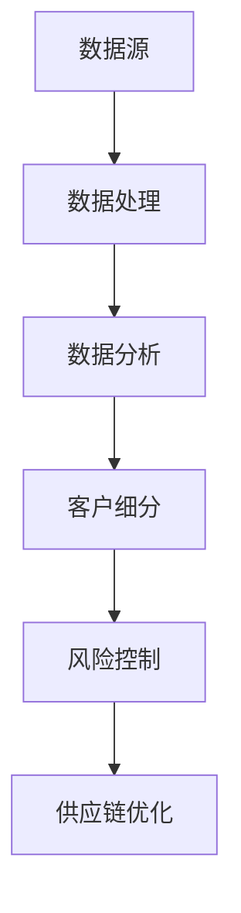

                 

关键词：大数据、客户价值、信息差、数据挖掘、算法优化、商业应用、技术趋势

摘要：本文旨在探讨大数据技术在客户价值最大化方面的应用。通过深入分析信息差的本质、大数据的核心概念及其在商业中的应用，我们将探讨如何利用大数据技术挖掘信息差，从而为企业创造巨大的商业价值。

## 1. 背景介绍

随着互联网的普及和数字化转型的加速，数据已成为新时代的重要资源。大数据技术的出现，使得企业能够从海量数据中提取有价值的信息，从而实现客户价值最大化。然而，如何在数据海洋中找到真正的价值，仍然是一个挑战。

### 1.1 信息差的定义

信息差，指的是在信息的传递过程中，不同个体或组织之间的信息不对称。在商业环境中，信息差往往意味着竞争优势。例如，一家零售商如果能提前获知消费者需求，就能在库存管理、产品推广等方面占据主动。

### 1.2 大数据的崛起

大数据，指的是无法通过传统数据处理工具进行分析的数据集。这些数据集具有数据量大、类型多、价值高、处理速度快等特点。大数据技术的出现，使得企业能够从海量数据中提取有价值的信息，从而实现业务优化、客户价值最大化等目标。

## 2. 核心概念与联系

### 2.1 大数据的核心概念

#### 数据源

数据源是大数据处理的基础，主要包括结构化数据（如数据库）、半结构化数据（如日志文件）和非结构化数据（如文本、图片、音频、视频等）。

#### 数据处理

数据处理是大数据技术的核心，包括数据的采集、存储、清洗、转换、分析和可视化等环节。

#### 数据分析

数据分析是大数据技术的关键，通过数据挖掘、机器学习、统计分析等方法，从海量数据中提取有价值的信息。

### 2.2 大数据在商业中的应用

#### 客户细分

通过大数据分析，企业可以深入了解客户需求，实现精准营销。例如，电商平台可以根据客户的购买行为、浏览记录等数据，为不同客户群体提供个性化的推荐。

#### 风险控制

大数据技术可以帮助企业识别潜在风险，提高业务安全性。例如，金融行业可以通过大数据分析，识别欺诈行为，降低风险。

#### 供应链优化

通过大数据分析，企业可以优化供应链管理，降低成本，提高效率。例如，制造业可以根据实时数据，调整生产计划，减少库存压力。

### 2.3 Mermaid 流程图



## 3. 核心算法原理 & 具体操作步骤

### 3.1 算法原理概述

大数据技术的核心在于算法。常用的算法包括：

- 数据挖掘算法：如聚类、分类、关联规则挖掘等。
- 机器学习算法：如线性回归、决策树、支持向量机等。
- 统计分析算法：如假设检验、回归分析、因子分析等。

### 3.2 算法步骤详解

#### 数据采集

首先，从不同的数据源采集数据，包括内部数据（如销售记录、客户数据）和外部数据（如社交媒体、竞争情报等）。

#### 数据预处理

对采集到的数据进行清洗、去重、填充等操作，确保数据质量。

#### 数据建模

根据业务需求，选择合适的算法，建立数据模型。例如，针对客户细分，可以使用聚类算法。

#### 数据分析

对建模后的数据进行分析，提取有价值的信息。例如，通过聚类分析，可以将客户划分为不同的群体。

#### 模型评估

评估模型的准确性和稳定性，根据评估结果调整模型参数。

### 3.3 算法优缺点

#### 优点

- 提高业务效率：通过数据挖掘和分析，企业可以更高效地完成业务任务。
- 增强决策能力：基于数据驱动的决策，更加客观和科学。
- 提升客户满意度：通过精准营销，提高客户体验。

#### 缺点

- 数据质量：数据质量直接影响算法效果，需要大量时间和人力投入。
- 隐私和安全：大数据技术涉及到用户隐私，需要确保数据安全。
- 技术门槛：大数据技术复杂，需要具备一定的专业知识和技能。

### 3.4 算法应用领域

大数据技术广泛应用于各个行业，包括但不限于：

- 零售业：通过大数据分析，实现个性化推荐、精准营销等。
- 金融业：通过大数据分析，进行风险控制、欺诈检测等。
- 制造业：通过大数据分析，优化供应链、提高生产效率等。

## 4. 数学模型和公式 & 详细讲解 & 举例说明

### 4.1 数学模型构建

#### 聚类分析

聚类分析是一种无监督学习方法，用于将数据集划分为多个类别。常用的聚类算法包括K-means、层次聚类等。

$$
C = \{C_1, C_2, ..., C_k\}
$$

其中，$C$表示聚类结果，$C_i$表示第$i$个聚类类别。

#### 决策树

决策树是一种有监督学习方法，用于分类和回归任务。决策树的构建过程包括：

- 特征选择：选择最优特征进行分割。
- 分裂规则：根据特征值进行节点分裂。
- 终端节点：对终端节点进行预测。

$$
T = \{N_1, N_2, ..., N_n\}
$$

其中，$T$表示决策树，$N_i$表示第$i$个节点。

### 4.2 公式推导过程

#### K-means算法

K-means算法的目标是找到最优的聚类中心，使得每个聚类类别内的数据点距离聚类中心最近。

$$
J = \sum_{i=1}^k \sum_{x \in C_i} \|x - \mu_i\|^2
$$

其中，$J$表示聚类准则函数，$\mu_i$表示聚类中心。

#### 决策树算法

决策树算法的目标是找到最优的分割规则，使得每个节点下的数据点尽可能纯。

$$
Gini(\text{impurity}) = 1 - \sum_{v \in V} p_v^2
$$

其中，$Gini(\text{impurity})$表示节点的不纯度，$p_v$表示节点中类别$v$的概率。

### 4.3 案例分析与讲解

#### 案例背景

某电商平台希望通过大数据分析，对客户进行精准营销。

#### 案例分析

1. 数据采集：采集客户的购买记录、浏览记录、评价等数据。
2. 数据预处理：对数据进行清洗、去重、填充等操作，确保数据质量。
3. 数据建模：选择K-means算法对客户进行聚类，划分不同客户群体。
4. 数据分析：根据聚类结果，为不同客户群体提供个性化的推荐。
5. 模型评估：评估聚类算法的准确性，根据评估结果调整模型参数。

#### 案例讲解

通过K-means算法，将客户划分为5个群体：

- 群体1：高价值客户，具有较高的购买频率和消费金额。
- 群体2：潜力客户，具有较高的购买潜力，但购买频率较低。
- 群体3：普通客户，购买行为较为稳定，但消费金额较低。
- 群体4：低价值客户，购买频率和消费金额均较低。
- 群体5：流失客户，近期没有购买行为。

根据不同客户群体的特征，为每个群体提供个性化的推荐策略：

- 群体1：提供高价值的商品推荐，增加购买频率和消费金额。
- 群体2：提供优惠促销活动，提高购买潜力。
- 群体3：提供多样化的商品推荐，增加购买频率。
- 群体4：提供性价比高的商品推荐，增加消费金额。
- 群体5：进行客户挽回活动，提高客户忠诚度。

## 5. 项目实践：代码实例和详细解释说明

### 5.1 开发环境搭建

- 语言：Python
- 数据库：MySQL
- 数据分析库：Pandas、NumPy、Scikit-learn
- 可视化库：Matplotlib、Seaborn

### 5.2 源代码详细实现

```python
import pandas as pd
from sklearn.cluster import KMeans
from sklearn.preprocessing import StandardScaler
import matplotlib.pyplot as plt

# 数据采集
data = pd.read_csv('customer_data.csv')

# 数据预处理
data.dropna(inplace=True)
data['total_spend'] = data['order_count'] * data['avg_order_value']
X = data[['order_count', 'avg_order_value', 'total_spend']]

# 数据标准化
scaler = StandardScaler()
X_scaled = scaler.fit_transform(X)

# 数据建模
kmeans = KMeans(n_clusters=5, random_state=42)
clusters = kmeans.fit_predict(X_scaled)

# 数据分析
data['cluster'] = clusters
data.groupby('cluster').describe()

# 数据可视化
plt.figure(figsize=(10, 6))
plt.scatter(X_scaled[:, 0], X_scaled[:, 1], c=clusters, cmap='viridis')
plt.xlabel('Order Count')
plt.ylabel('Avg Order Value')
plt.title('Customer Clustering')
plt.show()
```

### 5.3 代码解读与分析

1. 数据采集：使用Pandas读取客户数据，包括购买记录、浏览记录、评价等。
2. 数据预处理：对数据进行去重、填充等操作，确保数据质量。
3. 数据标准化：使用StandardScaler对数据进行标准化处理，消除不同特征之间的量纲影响。
4. 数据建模：使用KMeans算法对客户数据进行聚类，划分5个客户群体。
5. 数据分析：根据聚类结果，为每个客户群体提供个性化的推荐策略。
6. 数据可视化：使用Matplotlib绘制散点图，展示聚类结果。

## 6. 实际应用场景

### 6.1 零售业

通过大数据分析，零售业可以实现精准营销、库存优化等。例如，某电商平台通过大数据分析，将客户划分为5个群体，为每个群体提供个性化的推荐策略，提高了客户满意度和转化率。

### 6.2 金融业

金融业可以通过大数据分析，进行风险控制、欺诈检测等。例如，某银行通过大数据分析，识别潜在风险客户，降低了坏账率。

### 6.3 制造业

制造业可以通过大数据分析，优化供应链、提高生产效率。例如，某汽车制造商通过大数据分析，优化生产计划，减少了库存压力。

## 6.4 未来应用展望

随着大数据技术的发展，未来应用场景将更加广泛。例如：

- 健康医疗：通过大数据分析，实现个性化医疗、疾病预测等。
- 教育行业：通过大数据分析，实现个性化学习、教育评价等。
- 智能制造：通过大数据分析，实现智能制造、预测性维护等。

## 7. 工具和资源推荐

### 7.1 学习资源推荐

- 《大数据时代：生活、工作与思维的大变革》
- 《Python数据分析》
- 《机器学习实战》

### 7.2 开发工具推荐

- Jupyter Notebook：适用于数据分析和机器学习的集成开发环境。
- MySQL：适用于大数据存储和查询的数据库系统。
- Matplotlib、Seaborn：适用于数据可视化的Python库。

### 7.3 相关论文推荐

- 《K-means算法：一种基于距离的聚类方法》
- 《决策树算法：一种分类和回归方法》
- 《深度学习：一个新的角度》

## 8. 总结：未来发展趋势与挑战

### 8.1 研究成果总结

大数据技术在客户价值最大化方面取得了显著成果。通过数据挖掘、机器学习等技术，企业能够实现精准营销、风险控制、供应链优化等目标，从而提高业务效率和竞争力。

### 8.2 未来发展趋势

- 数据隐私保护：随着数据隐私问题的日益突出，未来大数据技术的发展将更加注重数据隐私保护。
- 深度学习：深度学习技术在图像识别、语音识别等领域取得了巨大成功，未来有望在更多领域得到应用。
- 跨学科研究：大数据技术的应用将涉及多个学科领域，跨学科研究将推动大数据技术的创新和发展。

### 8.3 面临的挑战

- 数据质量：数据质量直接影响算法效果，需要大量时间和人力投入进行数据清洗和预处理。
- 技术门槛：大数据技术复杂，需要具备一定的专业知识和技能。
- 隐私和安全：大数据技术涉及到用户隐私，需要确保数据安全。

### 8.4 研究展望

未来，大数据技术将在更多领域得到应用，为企业和个人创造更大的价值。同时，随着技术的发展，大数据技术将面临更多的挑战，需要持续创新和探索。

## 9. 附录：常见问题与解答

### 9.1 大数据技术的核心概念是什么？

大数据技术的核心概念包括数据源、数据处理、数据分析和数据可视化等。

### 9.2 如何保证数据质量？

保证数据质量的关键在于数据采集、数据预处理和数据建模等环节。需要对数据进行清洗、去重、填充等操作，确保数据完整、准确和一致。

### 9.3 大数据技术有哪些应用领域？

大数据技术广泛应用于零售业、金融业、制造业、健康医疗、教育行业等。每个领域都有其独特的应用场景和挑战。

### 9.4 如何进行数据挖掘？

数据挖掘是大数据技术的重要应用之一。常见的数据挖掘方法包括聚类分析、分类、关联规则挖掘等。选择合适的方法和算法，根据业务需求进行数据挖掘。

### 9.5 大数据技术有哪些挑战？

大数据技术面临的主要挑战包括数据质量、技术门槛、隐私和安全等。需要持续创新和探索，以解决这些挑战。

### 9.6 未来大数据技术有哪些发展趋势？

未来大数据技术将更加注重数据隐私保护、深度学习、跨学科研究等。同时，随着技术的进步，大数据技术在更多领域的应用将得到进一步拓展。

### 9.7 大数据技术在客户价值最大化方面的应用有哪些？

大数据技术在客户价值最大化方面的应用包括精准营销、风险控制、供应链优化等。通过数据挖掘和分析，企业可以更好地了解客户需求，提高业务效率和竞争力。

## 作者署名

本文作者：禅与计算机程序设计艺术 / Zen and the Art of Computer Programming
----------------------------------------------------------------

请注意，本文仅供参考和学习使用，实际应用中需结合具体业务场景进行调整和优化。希望本文能为您在大数据领域的探索提供一些有益的启示。再次感谢您的阅读！

