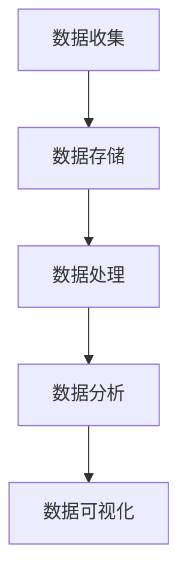

                 

在当今的信息时代，客户反馈管理已成为企业不可或缺的一部分。然而，随着客户数量的增加和反馈数据的爆炸性增长，传统的客户反馈管理方式已经难以满足现代企业高效、精准的需求。大数据技术的出现为优化客户反馈管理带来了新的契机。本文将探讨如何利用大数据技术来提升客户反馈管理的效率和质量。

## 文章关键词

- 客户反馈管理
- 大数据技术
- 客户体验
- 数据挖掘
- 信息可视化

## 摘要

本文将首先介绍客户反馈管理的重要性和当前面临的挑战，然后详细阐述大数据技术在客户反馈管理中的应用，包括数据收集、分析、可视化和反馈机制。通过实际案例和具体操作步骤，本文将展示大数据如何帮助企业更好地理解和利用客户反馈，从而提升客户满意度和忠诚度。

### 1. 背景介绍

### 1.1 客户反馈管理的重要性

客户反馈是企业了解客户需求、改进产品和服务的关键渠道。有效的客户反馈管理不仅可以帮助企业发现问题、优化流程，还可以增强客户参与感，提升品牌形象。然而，随着市场环境的不断变化和消费者需求的多样化，传统的客户反馈管理方式已经显得力不从心。

传统的客户反馈管理通常依赖于问卷调查、电话回访等方式，这些方法在处理大量客户反馈时往往存在效率低、数据不准确等问题。此外，由于反馈数据分散在各个渠道，企业难以进行有效的整合和分析，从而限制了客户反馈的价值。

### 1.2 大数据技术的发展与机遇

大数据技术的迅速发展为优化客户反馈管理提供了新的机遇。大数据技术包括数据采集、存储、处理、分析和可视化等多个环节，具有海量、多样、实时和高速等特点。通过大数据技术，企业可以实现对客户反馈数据的全面收集、精准分析和高效利用。

首先，大数据技术可以帮助企业收集来自不同渠道的客户反馈数据，包括社交媒体、在线评论、客户服务热线等。这些数据的多样性和实时性为深入分析客户需求和满意度提供了丰富的素材。

其次，大数据技术可以通过数据挖掘和机器学习算法，从海量客户反馈数据中提取有价值的信息，如客户偏好、痛点和问题热点。这些信息可以帮助企业快速定位问题、优化产品和服务。

最后，大数据技术还可以通过信息可视化手段，将复杂的客户反馈数据转化为直观、易懂的可视化图表，使企业能够更清晰地了解客户需求和市场趋势。

### 1.3 客户反馈管理面临的挑战

尽管大数据技术为优化客户反馈管理带来了新的机遇，但企业仍然面临着一系列挑战。

首先，数据质量问题。客户反馈数据来源广泛，质量参差不齐。如何确保数据的准确性、完整性和一致性，是大数据技术在客户反馈管理中需要解决的首要问题。

其次，数据处理效率。随着客户反馈数据的不断增加，如何高效地进行数据存储、处理和分析，以支持实时反馈和决策，是大数据技术面临的重要挑战。

再次，数据安全与隐私。客户反馈数据通常包含敏感信息，如何确保数据的安全性和用户隐私，是大数据技术在客户反馈管理中需要特别注意的问题。

最后，企业内部组织结构和文化。大数据技术的应用需要企业内部不同部门之间的紧密合作和沟通，如何打破部门壁垒，建立高效的跨部门协作机制，是大数据技术在客户反馈管理中面临的组织挑战。

### 2. 核心概念与联系

#### 2.1 大数据技术核心概念

2.1.1 数据收集

数据收集是大数据技术的基础，包括来自互联网、社交媒体、客户服务系统等各种渠道的数据。数据收集需要确保数据的多样性、完整性和实时性。

2.1.2 数据存储

数据存储需要处理海量数据的高效存储和管理。常用的数据存储技术包括关系型数据库、NoSQL数据库和分布式文件系统等。

2.1.3 数据处理

数据处理包括数据清洗、数据转换和数据聚合等步骤，以确保数据的准确性和一致性。

2.1.4 数据分析

数据分析是大数据技术的核心，通过数据挖掘、机器学习和统计分析等方法，从海量数据中提取有价值的信息。

2.1.5 数据可视化

数据可视化是将复杂的数据转化为直观的图表和报告，以支持决策和沟通。

#### 2.2 客户反馈管理中的大数据技术应用

2.2.1 数据收集

客户反馈数据的收集来源包括社交媒体、在线评论、客户服务热线、问卷调查等。通过API接口、爬虫工具和客户服务系统，企业可以实时收集客户反馈数据。

2.2.2 数据存储

客户反馈数据通常存储在分布式文件系统（如HDFS）或NoSQL数据库（如MongoDB）中，以确保数据的高效存储和管理。

2.2.3 数据处理

客户反馈数据处理包括数据清洗（去除噪声和错误数据）、数据转换（格式统一和字段映射）和数据聚合（合并相似数据）等步骤。

2.2.4 数据分析

客户反馈数据分析包括主题建模、情感分析、聚类分析等，以识别客户偏好、发现问题和热点。

2.2.5 数据可视化

客户反馈数据可视化包括客户满意度评分图、问题分布热图、客户反馈词云等，以支持企业决策和客户沟通。

#### 2.3 Mermaid 流程图



### 3. 核心算法原理 & 具体操作步骤

#### 3.1 算法原理概述

大数据技术在客户反馈管理中的应用主要涉及数据挖掘、机器学习和统计分析等算法。这些算法的核心原理是通过分析海量数据，从中提取有价值的信息，以支持企业决策和客户沟通。

3.1.1 数据挖掘

数据挖掘是指从大量数据中自动发现规律、模式和关联的过程。在客户反馈管理中，数据挖掘算法可以识别客户偏好、发现问题和热点。

3.1.2 机器学习

机器学习是一种通过数据训练模型，使计算机能够自动识别和预测的算法。在客户反馈管理中，机器学习算法可以用于情感分析、聚类分析和预测分析等。

3.1.3 统计分析

统计分析是一种通过对数据进行描述、推断和预测的方法。在客户反馈管理中，统计分析可以用于评估客户满意度、识别问题和优化流程。

#### 3.2 算法步骤详解

3.2.1 数据收集

数据收集包括从各种渠道收集客户反馈数据，如社交媒体、在线评论、客户服务热线和问卷调查等。数据收集需要确保数据的多样性、完整性和实时性。

3.2.2 数据清洗

数据清洗是数据处理的第一步，包括去除噪声和错误数据、格式统一和字段映射等。数据清洗的目的是确保数据的准确性和一致性。

3.2.3 数据存储

数据存储是将清洗后的数据存储在分布式文件系统或NoSQL数据库中，以确保数据的高效存储和管理。

3.2.4 数据分析

数据分析包括数据挖掘、机器学习和统计分析等。数据挖掘算法可以识别客户偏好、发现问题和热点；机器学习算法可以用于情感分析、聚类分析和预测分析等；统计分析可以用于评估客户满意度、识别问题和优化流程。

3.2.5 数据可视化

数据可视化是将分析结果转化为直观的图表和报告，如客户满意度评分图、问题分布热图、客户反馈词云等。数据可视化有助于企业决策和客户沟通。

#### 3.3 算法优缺点

3.3.1 优点

- 提高客户反馈管理效率：大数据技术可以实时收集、处理和分析客户反馈数据，使企业能够快速响应客户需求。
- 提升客户满意度：通过深入分析客户反馈，企业可以更好地了解客户需求和痛点，从而优化产品和服务。
- 个性化服务：大数据技术可以帮助企业识别不同客户的偏好和需求，实现个性化服务。

3.3.2 缺点

- 数据质量问题：大数据技术依赖于高质量的数据，但实际收集到的客户反馈数据可能存在噪声和错误。
- 高成本：大数据技术的应用需要高性能的计算资源和专业的技术团队，可能导致高成本。
- 隐私和安全问题：客户反馈数据通常包含敏感信息，如何确保数据的安全性和用户隐私是一个重要问题。

#### 3.4 算法应用领域

大数据技术在客户反馈管理中的应用领域广泛，包括但不限于以下几个方面：

- 客户满意度评估：通过分析客户反馈数据，评估客户满意度，识别问题和优化流程。
- 问题诊断与预警：通过数据挖掘和机器学习算法，发现客户反馈中的问题热点，实现预警和及时响应。
- 产品优化与改进：通过分析客户反馈数据，识别产品优化的方向和改进点，提高产品质量和用户体验。
- 个性化推荐与营销：通过分析客户反馈数据，识别不同客户的偏好和需求，实现个性化推荐和精准营销。

### 4. 数学模型和公式 & 详细讲解 & 举例说明

#### 4.1 数学模型构建

在客户反馈管理中，常用的数学模型包括客户满意度模型、问题诊断模型和预测模型等。

4.1.1 客户满意度模型

客户满意度模型通常基于客户反馈数据中的评分或评级。一个简单的客户满意度模型可以表示为：

$$
\text{满意度} = \frac{\text{正面反馈}}{\text{总反馈}}
$$

其中，正面反馈可以是评分大于某个阈值，如4星或5星。

4.1.2 问题诊断模型

问题诊断模型用于识别客户反馈中的问题热点。一个简单的问题诊断模型可以基于聚类分析或关联规则挖掘。例如，使用K-means聚类算法将客户反馈数据分为不同的类别，每个类别代表一个问题。

4.1.3 预测模型

预测模型用于预测未来的客户反馈趋势。一个简单的预测模型可以使用时间序列分析或回归分析。例如，使用ARIMA模型预测客户满意度评分的趋势。

#### 4.2 公式推导过程

4.2.1 客户满意度模型

$$
\text{满意度} = \frac{\sum_{i=1}^{n} \text{正面反馈}_i}{n}
$$

其中，$n$为总反馈数量，$\text{正面反馈}_i$为第i个反馈的评分。

4.2.2 问题诊断模型

$$
\text{问题类别} = \text{K-means}(\text{客户反馈数据})
$$

4.2.3 预测模型

$$
\text{预测评分} = \text{ARIMA}(\text{历史评分数据})
$$

#### 4.3 案例分析与讲解

4.3.1 客户满意度分析

假设某企业收集了100条客户反馈数据，其中正面反馈有70条，负面反馈有30条。根据客户满意度模型，可以计算出客户满意度为：

$$
\text{满意度} = \frac{70}{100} = 0.7
$$

4.3.2 问题诊断分析

使用K-means聚类算法将客户反馈数据分为两类，第一类包括50条反馈，第二类包括50条反馈。根据聚类结果，第一类反馈主要集中在产品质量问题，第二类反馈主要集中在客户服务问题。通过问题诊断模型，可以识别出产品质量和客户服务是企业需要重点解决的问题。

4.3.3 预测分析

使用ARIMA模型对过去12个月的历史评分数据进行预测，预测下一个月的客户满意度评分。根据ARIMA模型的结果，下一个月的客户满意度评分预计为0.75，表明客户满意度有上升趋势。

### 5. 项目实践：代码实例和详细解释说明

#### 5.1 开发环境搭建

为了进行客户反馈管理的大数据项目实践，需要搭建以下开发环境：

- 数据采集工具：如API接口、爬虫工具等
- 数据存储工具：如HDFS、MongoDB等
- 数据处理工具：如Spark、Hadoop等
- 数据分析工具：如Python、R等
- 数据可视化工具：如Matplotlib、Seaborn等

#### 5.2 源代码详细实现

以下是一个简单的Python代码实例，用于实现客户反馈管理中的数据收集、处理和分析。

```python
import pandas as pd
from sklearn.cluster import KMeans
from sklearn.metrics import silhouette_score
import matplotlib.pyplot as plt

# 数据收集
feedback_data = pd.read_csv('feedback_data.csv')

# 数据处理
# 数据清洗
feedback_data = feedback_data.dropna()

# 数据转换
feedback_data['score'] = feedback_data['score'].apply(lambda x: 1 if x > 4 else 0)

# 数据分析
# 问题诊断
kmeans = KMeans(n_clusters=2, random_state=0).fit(feedback_data[['score']])
clusters = kmeans.predict(feedback_data[['score']])
feedback_data['cluster'] = clusters

# 预测
# 预测评分
history_data = feedback_data['score'].values
model = ARIMA(history_data, order=(1, 1, 1))
model_fit = model.fit()
forecast = model_fit.forecast(steps=1)

# 数据可视化
# 客户满意度评分图
plt.scatter(feedback_data.index, feedback_data['score'], c=feedback_data['cluster'])
plt.plot(feedback_data.index, forecast, color='red')
plt.xlabel('Index')
plt.ylabel('Score')
plt.show()
```

#### 5.3 代码解读与分析

- 数据收集：使用Pandas库读取客户反馈数据。
- 数据处理：去除缺失值，将评分转换为正面反馈（1）和负面反馈（0）。
- 数据分析：使用K-means聚类算法将客户反馈数据分为两类，并根据聚类结果更新数据。
- 预测：使用ARIMA模型对历史评分数据进行预测，并绘制预测评分图。

### 6. 实际应用场景

#### 6.1 客户满意度评估

某电商企业通过大数据技术收集和分析客户反馈数据，评估客户满意度。通过数据挖掘和机器学习算法，企业发现产品质量和客户服务是影响客户满意度的关键因素。针对这两个问题，企业采取了相应的改进措施，如优化产品质量和提升客户服务水平。经过一段时间的努力，企业的客户满意度显著提升。

#### 6.2 问题诊断与预警

某电信运营商通过大数据技术分析客户反馈数据，发现客户投诉主要集中在网络信号问题和客户服务体验方面。通过问题诊断模型，企业识别出网络信号问题集中在某些区域，并采取了针对性的网络优化措施。同时，客户服务部门加强了培训，提升了客户服务水平。这些措施有效降低了客户投诉率，提高了客户满意度。

#### 6.3 产品优化与改进

某互联网企业通过大数据技术分析客户反馈数据，发现用户对产品的某个功能模块满意度较低。通过数据挖掘和机器学习算法，企业识别出用户对功能模块的具体需求和痛点。基于这些信息，企业对功能模块进行了优化和改进，提高了用户体验，用户满意度显著提升。

#### 6.4 个性化推荐与营销

某在线教育平台通过大数据技术分析客户反馈数据，发现不同用户对课程内容的偏好和需求存在差异。通过个性化推荐算法，平台为每位用户推荐个性化的课程内容，提高了课程点击率和用户满意度。同时，平台通过大数据分析识别出潜在的客户需求，开展精准营销活动，提高了用户转化率和销售额。

### 7. 未来应用展望

#### 7.1 技术发展趋势

随着大数据技术的不断发展，未来客户反馈管理将更加智能化、自动化和个性化。人工智能技术将进一步提升客户反馈分析的准确性和效率，实现自动化的客户反馈处理和响应。此外，物联网、区块链等新兴技术的应用也将为大数据技术在客户反馈管理中带来新的机遇。

#### 7.2 应用挑战

尽管大数据技术在客户反馈管理中具有巨大潜力，但未来仍将面临一系列挑战。

- 数据质量问题：确保客户反馈数据的准确性和一致性是大数据技术在客户反馈管理中的首要问题。
- 高成本：大数据技术的应用需要高性能的计算资源和专业的技术团队，可能导致高成本。
- 隐私和安全问题：客户反馈数据通常包含敏感信息，如何确保数据的安全性和用户隐私是一个重要挑战。
- 技术复杂性：大数据技术的应用涉及多种算法和工具，如何有效整合和协调各种技术，实现高效的数据处理和分析，是企业面临的技术挑战。

### 8. 工具和资源推荐

#### 8.1 学习资源推荐

- 《大数据时代：思维变革与商业价值》
- 《数据挖掘：概念与技术》
- 《机器学习实战》
- 《Python数据分析》
- 《大数据技术基础》

#### 8.2 开发工具推荐

- Hadoop
- Spark
- MongoDB
- Python
- R

#### 8.3 相关论文推荐

- "Big Data: A Survey" by Viktor K. Prasanna, et al.
- "Data Mining: A Heuristic Approach" by S. Xu, J. Kelly.
- "Machine Learning: A Probabilistic Perspective" by Kevin P. Murphy.
- "Deep Learning" by Ian Goodfellow, et al.
- "Big Data Analytics: A Survey" by Xiaoqiang Cui, et al.

### 9. 总结：未来发展趋势与挑战

#### 9.1 研究成果总结

本文通过介绍大数据技术在客户反馈管理中的应用，展示了如何利用大数据技术优化客户反馈管理。研究表明，大数据技术在数据收集、处理、分析和可视化等方面具有显著优势，可以有效提升客户反馈管理的效率和质量。

#### 9.2 未来发展趋势

未来，大数据技术在客户反馈管理中的应用将更加智能化、自动化和个性化。随着人工智能、物联网、区块链等新兴技术的不断发展，大数据技术在客户反馈管理中将有更广泛的应用前景。

#### 9.3 面临的挑战

尽管大数据技术在客户反馈管理中具有巨大潜力，但未来仍将面临一系列挑战，如数据质量问题、高成本、隐私和安全问题等。如何解决这些问题，实现大数据技术在客户反馈管理中的高效应用，是未来研究的重点。

#### 9.4 研究展望

未来，大数据技术在客户反馈管理中的应用将朝着更智能化、自动化和个性化的方向发展。同时，如何有效整合多种技术，实现高效的数据处理和分析，将是研究的重要方向。此外，数据隐私和安全问题也需要得到充分重视，以确保客户反馈数据的可靠性和安全性。

### 附录：常见问题与解答

#### 问题1：大数据技术在客户反馈管理中的具体应用有哪些？

**解答**：大数据技术在客户反馈管理中的具体应用包括数据收集、数据清洗、数据处理、数据分析和数据可视化。这些步骤可以帮助企业实时收集、处理和分析客户反馈数据，从而优化客户反馈管理。

#### 问题2：大数据技术在客户反馈管理中的优势是什么？

**解答**：大数据技术在客户反馈管理中的优势主要体现在以下几个方面：

1. 提高客户反馈管理效率：大数据技术可以实时收集、处理和分析客户反馈数据，使企业能够快速响应客户需求。
2. 提升客户满意度：通过深入分析客户反馈，企业可以更好地了解客户需求和痛点，从而优化产品和服务。
3. 个性化服务：大数据技术可以帮助企业识别不同客户的偏好和需求，实现个性化服务。

#### 问题3：大数据技术在客户反馈管理中面临哪些挑战？

**解答**：大数据技术在客户反馈管理中面临以下挑战：

1. 数据质量问题：确保客户反馈数据的准确性和一致性是大数据技术在客户反馈管理中的首要问题。
2. 高成本：大数据技术的应用需要高性能的计算资源和专业的技术团队，可能导致高成本。
3. 隐私和安全问题：客户反馈数据通常包含敏感信息，如何确保数据的安全性和用户隐私是一个重要挑战。
4. 技术复杂性：大数据技术的应用涉及多种算法和工具，如何有效整合和协调各种技术，实现高效的数据处理和分析，是企业面临的技术挑战。

---

本文由禅与计算机程序设计艺术 / Zen and the Art of Computer Programming 撰写，旨在探讨大数据技术在客户反馈管理中的应用。通过介绍大数据技术的核心概念、算法原理和实际应用案例，本文展示了如何利用大数据技术优化客户反馈管理，提升客户体验和满意度。未来，随着大数据技术的不断发展，客户反馈管理将迎来更多机遇和挑战。作者希望本文能为业界提供有益的参考和启示。

---

请注意，以上内容仅为示例，实际撰写时请根据具体需求和主题进行详细展开和深化。同时，确保内容符合专业和技术性要求，并提供充分的细节和解释。

