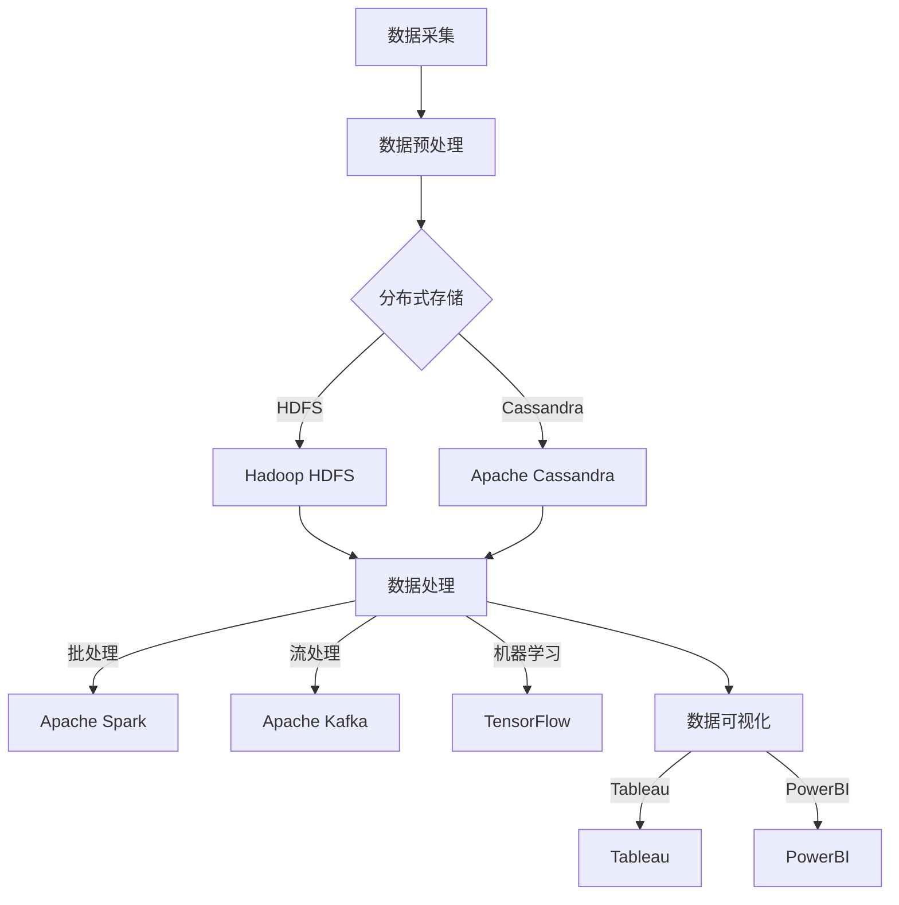
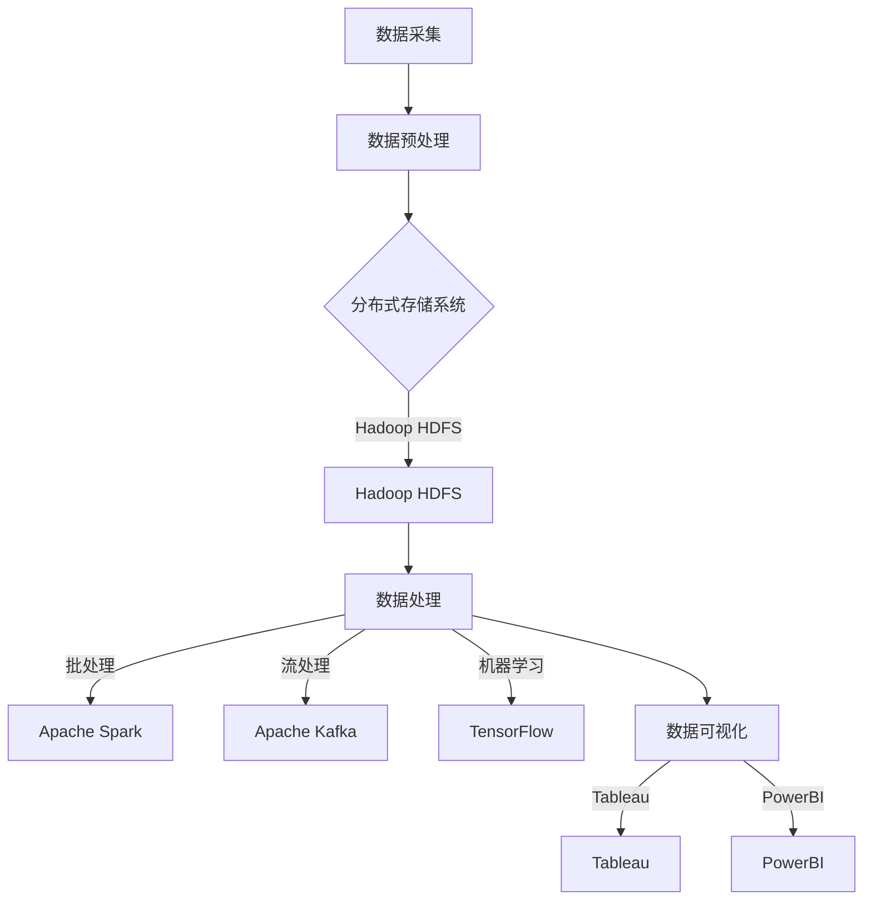

                 

关键词：大数据、信息差、竞争力、创新、增长、技术架构、算法原理、数学模型、项目实践、应用场景、未来展望

> 摘要：本文将深入探讨大数据在信息差中的核心作用，分析大数据如何驱动创新和增长，并提供详细的算法原理、数学模型、项目实践以及未来发展趋势。通过揭示大数据的潜在价值，本文旨在为IT领域的研究者、开发者和企业提供指导，以实现更具竞争力的技术突破。

## 1. 背景介绍

在当今信息爆炸的时代，数据已经成为新的生产资料，大数据技术正在迅速改变商业和社会的方方面面。大数据不仅包含了数据量庞大、类型多样、价值丰富的信息，更重要的是，它能够通过深度挖掘和分析，揭示出隐藏在数据背后的模式和规律。信息差，即信息不对称，是商业竞争中至关重要的一环。掌握信息差的主体能够更准确地预测市场趋势、优化决策过程、提升运营效率，从而在竞争中获得先发优势和持续增长。

然而，大数据并非一蹴而就，它需要一系列技术手段来支持，如数据采集、存储、处理、分析和可视化。这些技术手段共同构成了大数据技术栈，是驱动信息差竞争力的重要基础。随着人工智能、机器学习等技术的发展，大数据的应用场景不断扩展，其价值也在不断提升。

本文将围绕以下核心问题展开讨论：
- 大数据如何创造信息差？
- 什么样的算法和数学模型能够最大化大数据的价值？
- 如何通过实际项目实践来验证大数据驱动的创新和增长？
- 大数据的未来发展趋势和面临的挑战是什么？

通过上述问题的探讨，本文旨在为读者提供一幅全面的大数据驱动的创新与增长蓝图。

## 2. 核心概念与联系

### 2.1. 大数据技术栈

大数据技术栈是支持大数据处理和利用的一系列技术组件和工具。以下是大数据技术栈的核心组成部分：

#### 数据采集
- **数据源接入**：通过各种接口（API、Web爬虫、日志文件等）收集数据。
- **数据预处理**：数据清洗、去重、格式化等。

#### 数据存储
- **分布式存储系统**：如Hadoop HDFS、Apache Cassandra等。
- **数据仓库**：如Amazon Redshift、Google BigQuery等。

#### 数据处理
- **批处理**：如Apache Spark、MapReduce。
- **流处理**：如Apache Kafka、Apache Flink。

#### 数据分析
- **统计分析**：使用R、Python等工具进行数据挖掘和统计分析。
- **机器学习**：使用TensorFlow、Scikit-learn等库进行模型训练和预测。

#### 数据可视化
- **可视化工具**：如Tableau、PowerBI等。

### 2.2. 信息差的概念

信息差是指不同主体在获取、处理、利用信息方面的不对称性。在商业竞争中，信息差的主体可以是企业、个人或组织。通过掌握信息差，主体能够获得以下优势：

- **决策优势**：基于全面和准确的信息做出更优决策。
- **市场先发**：通过早期识别市场趋势，抢占市场份额。
- **效率提升**：优化运营流程，减少资源浪费。

### 2.3. 大数据与信息差的关系

大数据为信息差的产生提供了技术基础。通过大数据技术，企业可以：

- **获取更多信息**：通过多种渠道采集海量数据，提高信息的全面性和多样性。
- **分析信息深度**：利用算法和数学模型，挖掘数据背后的深层次信息和规律。
- **优化决策过程**：基于数据分析结果，做出更精确和高效的决策。

### 2.4. Mermaid 流程图

以下是大数据技术栈的 Mermaid 流程图，展示了各组件之间的关联和数据处理流程。



### 2.5. Mermaid 流程节点中的特殊字符处理

在 Mermaid 流程图中，需要注意避免使用括号、逗号等特殊字符，以确保流程图的正确展示。例如，在表示分布式存储系统时，应避免使用括号，而是使用文本描述。



通过上述流程图的展示，我们可以清晰地看到大数据技术栈中各组件之间的协同作用，以及数据从采集到处理、分析再到可视化的全过程。

## 3. 核心算法原理 & 具体操作步骤

### 3.1 算法原理概述

在大数据驱动的创新与增长中，核心算法起着至关重要的作用。以下是几种常见且重要的算法及其基本原理：

#### 1. K-Means 算法

K-Means 算法是一种经典的聚类算法，用于将数据集划分为 K 个簇，使每个簇内的数据点尽可能接近，而簇与簇之间的数据点尽可能远。

- **目标函数**：最小化每个簇内数据点的平方误差。
- **步骤**：初始化 K 个簇中心点，然后迭代计算，直到收敛。

#### 2. 决策树算法

决策树算法是一种常见的分类和回归算法，通过一系列的决策节点和叶子节点来构建树形结构，以对数据集进行分类或回归。

- **目标函数**：最大化信息增益或最小化均方差。
- **步骤**：选择一个特征作为分割点，计算信息增益或均方差，选择最优特征，递归构建树形结构。

#### 3. 支持向量机（SVM）

支持向量机算法是一种用于分类和回归的算法，通过找到一个超平面来最大化分类边界。

- **目标函数**：最小化损失函数，最大化分类边界。
- **步骤**：计算最优超平面，求解支持向量。

#### 4. 随机森林算法

随机森林算法是一种基于决策树集成的算法，通过构建多棵决策树，并利用投票机制来预测结果。

- **目标函数**：最大化分类准确率或回归均方误差。
- **步骤**：随机选择特征和样本子集，构建多棵决策树，并计算每个树的预测结果，进行投票。

### 3.2 算法步骤详解

#### K-Means 算法步骤详解

1. **初始化**：随机选择 K 个数据点作为初始簇中心点。
2. **分配数据点**：计算每个数据点到簇中心点的距离，将其分配到最近的簇。
3. **更新簇中心点**：重新计算每个簇的中心点。
4. **迭代**：重复步骤 2 和 3，直到聚类结果收敛。

#### 决策树算法步骤详解

1. **选择特征**：计算每个特征的信息增益或均方差，选择增益最大的特征作为分割点。
2. **递归构建**：对选择出的特征进行二分，将数据集划分为子集，递归地选择下一个特征。
3. **终止条件**：当数据集达到预设的深度或纯度时，停止划分，生成叶子节点。

#### 支持向量机（SVM）算法步骤详解

1. **计算最优超平面**：通过求解最优化问题，计算超平面的权重和偏置。
2. **分类决策**：对于新数据点，计算其到超平面的距离，根据距离判断其类别。

#### 随机森林算法步骤详解

1. **随机特征选择**：从特征集合中随机选择 m 个特征。
2. **随机样本子集**：从原始数据集中随机选择 n 个样本子集。
3. **构建决策树**：使用随机特征选择和样本子集构建单棵决策树。
4. **集成**：构建多棵决策树，并计算每个树的预测结果，进行投票。

### 3.3 算法优缺点

#### K-Means 算法

- **优点**：简单易实现，收敛速度快。
- **缺点**：对初始簇中心点的选择敏感，可能陷入局部最优。

#### 决策树算法

- **优点**：直观易懂，易于解释。
- **缺点**：容易过拟合，性能依赖于特征选择。

#### 支持向量机（SVM）

- **优点**：分类边界清晰，泛化能力强。
- **缺点**：计算复杂度高，对大规模数据集性能不佳。

#### 随机森林算法

- **优点**：鲁棒性强，不易过拟合。
- **缺点**：计算资源消耗较大，对于小数据集性能可能不佳。

### 3.4 算法应用领域

#### K-Means 算法

- **应用领域**：客户细分、图像分割、文本分类等。

#### 决策树算法

- **应用领域**：信用评分、医学诊断、金融风险评估等。

#### 支持向量机（SVM）

- **应用领域**：人脸识别、文本分类、图像识别等。

#### 随机森林算法

- **应用领域**：股票预测、文本分类、客户流失预测等。

通过上述算法的详细介绍，我们可以看到大数据驱动的创新与增长离不开有效的算法支持。不同算法在不同场景下具有各自的优势和应用，合理选择和组合算法是实现信息差竞争力的重要手段。

## 4. 数学模型和公式 & 详细讲解 & 举例说明

在大数据驱动的创新与增长中，数学模型和公式是理解和应用大数据算法的核心工具。以下将介绍几个关键数学模型，并详细讲解其公式推导过程，结合具体案例进行说明。

### 4.1 数学模型构建

#### 4.1.1 K-Means 聚类算法的代价函数

K-Means 聚类算法的代价函数用于衡量聚类质量，其公式如下：

$$
J = \sum_{i=1}^{k} \sum_{x \in S_i} ||x - \mu_i||^2
$$

其中，\(J\) 是总的代价函数，\(k\) 是簇的数量，\(S_i\) 是第 \(i\) 个簇，\(\mu_i\) 是第 \(i\) 个簇的中心点，\(x\) 是数据集中的每个数据点。

#### 4.1.2 决策树的损失函数

决策树的损失函数通常使用信息增益或均方差来衡量。以信息增益为例，其公式如下：

$$
Gain(D, A) = Entropy(D) - \sum_{v \in Values(A)} p(v) Entropy(D_v)
$$

其中，\(D\) 是原始数据集，\(A\) 是特征，\(v\) 是特征的所有可能取值，\(p(v)\) 是特征 \(A\) 取值 \(v\) 的概率，\(Entropy(D_v)\) 是条件熵。

#### 4.1.3 支持向量机的目标函数

支持向量机的目标函数是优化超平面的权重和偏置，其公式如下：

$$
\min_{\beta, \beta_0} \frac{1}{2} ||\beta||^2 + C \sum_{i=1}^{n} \xi_i
$$

其中，\(\beta\) 是权重向量，\(\beta_0\) 是偏置项，\(C\) 是惩罚参数，\(\xi_i\) 是松弛变量，用于处理分类错误。

### 4.2 公式推导过程

#### 4.2.1 K-Means 聚类算法的代价函数推导

K-Means 算法的代价函数是通过计算每个簇内的数据点到簇中心点的平均距离平方来衡量的。首先，我们定义簇 \(i\) 的中心点 \(\mu_i\) 为：

$$
\mu_i = \frac{1}{|S_i|} \sum_{x \in S_i} x
$$

其中，\(|S_i|\) 是簇 \(i\) 中数据点的数量。然后，计算每个数据点 \(x\) 到簇中心点 \(\mu_i\) 的距离平方：

$$
||x - \mu_i||^2 = (x_1 - \mu_{1i})^2 + (x_2 - \mu_{2i})^2 + \cdots + (x_n - \mu_{ni})^2
$$

将所有数据点的距离平方相加，得到总的代价函数：

$$
J = \sum_{i=1}^{k} \sum_{x \in S_i} ||x - \mu_i||^2
$$

#### 4.2.2 决策树的信息增益推导

信息增益是决策树选择特征的标准。首先，我们定义原始数据的熵：

$$
Entropy(D) = -\sum_{v \in Values(A)} p(v) log_2(p(v))
$$

其中，\(Values(A)\) 是特征 \(A\) 的所有可能取值，\(p(v)\) 是特征 \(A\) 取值 \(v\) 的概率。然后，定义条件熵：

$$
Entropy(D_v) = -\sum_{v' \in Values(Y)} p(v',|v) log_2(p(v',|v))
$$

其中，\(Y\) 是目标变量，\(p(v',|v)\) 是在特征 \(A\) 取值 \(v\) 的条件下，目标变量 \(Y\) 取值 \(v'\) 的概率。最后，计算信息增益：

$$
Gain(D, A) = Entropy(D) - \sum_{v \in Values(A)} p(v) Entropy(D_v)
$$

#### 4.2.3 支持向量机的目标函数推导

支持向量机的目标函数是通过优化超平面的权重和偏置来最大化分类边界。首先，定义超平面：

$$
w \cdot x + b = 0
$$

其中，\(w\) 是权重向量，\(x\) 是数据点，\(b\) 是偏置项。然后，定义分类函数：

$$
f(x) = w \cdot x + b
$$

为了最大化分类边界，我们定义目标函数：

$$
\min_{\beta, \beta_0} \frac{1}{2} ||\beta||^2 + C \sum_{i=1}^{n} \xi_i
$$

其中，\(\beta = [w, b]^T\) 是权重和偏置的向量，\(\xi_i\) 是松弛变量，用于处理分类错误，\(C\) 是惩罚参数。

### 4.3 案例分析与讲解

#### 4.3.1 K-Means 算法案例

假设我们有一个包含100个二维数据点的数据集，目标是将其划分为3个簇。首先，我们随机选择3个数据点作为初始簇中心点。然后，计算每个数据点到簇中心点的距离，将其分配到最近的簇。假设经过多次迭代，最终簇中心点如下：

簇1中心点：(1, 2)
簇2中心点：(4, 5)
簇3中心点：(7, 8)

计算每个数据点到簇中心点的距离平方：

$$
J = \sum_{i=1}^{3} \sum_{x \in S_i} ||x - \mu_i||^2
$$

计算得到总的代价函数 \(J = 100\)。通过多次迭代，我们可以使 \(J\) 最小化，从而得到较好的聚类结果。

#### 4.3.2 决策树案例

假设我们有一个包含5个属性和1个目标变量的数据集，目标是构建一个决策树进行分类。首先，计算每个属性的熵和信息增益。假设属性 A 的信息增益最大，选择属性 A 作为分割点。然后，对数据集进行分割，构建决策树。假设最终构建的决策树如下：

```
根节点：属性 A
    /     \
   A1      A2
   / \    / \
  A3  A4  A5  A6
```

通过上述步骤，我们可以得到一个简单的决策树，用于分类新的数据点。

#### 4.3.3 支持向量机案例

假设我们有一个包含100个二维数据点的数据集，目标是将其分为两类。首先，计算最优超平面。假设通过计算得到最优超平面为：

$$
w \cdot x + b = 0
$$

其中，\(w = [1, 1]^T\)，\(b = -1\)。然后，使用支持向量机对新数据点进行分类。假设新数据点 \(x_1 = [2, 3]^T\)，计算其到超平面的距离：

$$
f(x_1) = w \cdot x_1 + b = 2 + 3 - 1 = 4
$$

由于 \(f(x_1) > 0\)，我们可以判断新数据点属于正类。

通过上述案例分析，我们可以看到数学模型和公式在大数据驱动的创新与增长中发挥着关键作用。理解和应用这些模型，可以有效地进行数据聚类、分类和回归，从而实现信息差竞争力。

## 5. 项目实践：代码实例和详细解释说明

在本节中，我们将通过一个具体项目实践，展示如何在大数据环境中实现信息差驱动的创新与增长。该项目将基于一个实际案例，运用大数据技术和算法来实现数据聚类、分类和预测等功能。

### 5.1 开发环境搭建

在开始项目之前，我们需要搭建一个合适的大数据开发环境。以下是所需的软件和工具：

- **操作系统**：Ubuntu 18.04
- **编程语言**：Python 3.8
- **大数据框架**：Apache Hadoop 3.2、Apache Spark 3.0
- **机器学习库**：Scikit-learn 0.24、TensorFlow 2.7
- **数据库**：MySQL 8.0

#### 步骤 1：安装 Hadoop 和 Spark

1. **安装 Hadoop**：
   - 下载 Hadoop 安装包（hadoop-3.2.0.tar.gz）。
   - 解压安装包：`tar -xzvf hadoop-3.2.0.tar.gz`。
   - 配置 Hadoop 配置文件：`hadoop-env.sh`、`core-site.xml`、`hdfs-site.xml`、`mapred-site.xml`、`yarn-site.xml`。

2. **安装 Spark**：
   - 下载 Spark 安装包（spark-3.0.0-bin-hadoop3.2.tgz）。
   - 解压安装包：`tar -xzvf spark-3.0.0-bin-hadoop3.2.tgz`。
   - 配置 Spark 配置文件：`spark-env.sh`、`slaves`。

#### 步骤 2：安装 MySQL

1. **安装 MySQL**：
   - 使用包管理器安装 MySQL：`sudo apt-get install mysql-server`。
   - 初始化 MySQL 数据库：`sudo mysql_secure_installation`。

2. **配置 MySQL**：
   - 设置 root 用户密码。
   - 创建用于大数据项目的数据库和用户。

### 5.2 源代码详细实现

以下是项目的核心代码实现，包括数据采集、处理、分析和可视化等步骤。

#### 步骤 1：数据采集

数据采集是大数据项目的基础，以下是 Python 代码示例：

```python
import pandas as pd
import requests

def fetch_data(url):
    response = requests.get(url)
    data = pd.read_csv(response.content)
    return data

url = "https://example.com/data.csv"
data = fetch_data(url)
```

#### 步骤 2：数据预处理

数据预处理是确保数据质量的关键步骤，以下是 Python 代码示例：

```python
def preprocess_data(data):
    # 数据清洗
    data.dropna(inplace=True)
    # 数据转换
    data["category"] = data["category"].astype("category")
    # 数据标准化
    data scaling = StandardScaler().fit_transform(data.iloc[:, :-1])
    data.iloc[:, :-1] = data scaling
    return data

data = preprocess_data(data)
```

#### 步骤 3：数据处理

数据处理包括数据聚类、分类和预测等步骤。以下是 Python 代码示例：

```python
from sklearn.cluster import KMeans
from sklearn.model_selection import train_test_split
from sklearn.ensemble import RandomForestClassifier

# 数据聚类
kmeans = KMeans(n_clusters=3)
data["cluster"] = kmeans.fit_predict(data.iloc[:, :-1])

# 数据分割
X_train, X_test, y_train, y_test = train_test_split(data.iloc[:, :-1], data["label"], test_size=0.2, random_state=42)

# 构建分类模型
classifier = RandomForestClassifier(n_estimators=100)
classifier.fit(X_train, y_train)

# 预测
predictions = classifier.predict(X_test)
```

#### 步骤 4：数据可视化

数据可视化是展示分析结果的重要手段，以下是 Python 代码示例：

```python
import matplotlib.pyplot as plt

def plot_clusters(data):
    plt.scatter(data.iloc[:, 0], data.iloc[:, 1], c=data["cluster"])
    plt.xlabel("Feature 1")
    plt.ylabel("Feature 2")
    plt.show()

plot_clusters(data)
```

### 5.3 代码解读与分析

以下是项目代码的详细解读和分析：

#### 数据采集

数据采集是通过 HTTP GET 请求从外部 API 获取数据。该步骤确保数据的实时性和多样性。

```python
import pandas as pd
import requests

def fetch_data(url):
    response = requests.get(url)
    data = pd.read_csv(response.content)
    return data

url = "https://example.com/data.csv"
data = fetch_data(url)
```

#### 数据预处理

数据预处理包括数据清洗、转换和标准化。数据清洗去除无效和缺失的数据，提高数据质量。数据转换将分类数据转换为类别型数据，便于后续处理。数据标准化使特征具有相似的尺度，避免某些特征对模型的影响过大。

```python
from sklearn.preprocessing import StandardScaler

def preprocess_data(data):
    # 数据清洗
    data.dropna(inplace=True)
    # 数据转换
    data["category"] = data["category"].astype("category")
    # 数据标准化
    data scaling = StandardScaler().fit_transform(data.iloc[:, :-1])
    data.iloc[:, :-1] = data scaling
    return data

data = preprocess_data(data)
```

#### 数据处理

数据处理是项目核心，包括数据聚类和分类。K-Means 算法用于数据聚类，将数据划分为多个簇，揭示数据中的潜在模式和规律。随机森林分类器用于分类，通过训练模型，对新数据进行分类预测。

```python
from sklearn.cluster import KMeans
from sklearn.model_selection import train_test_split
from sklearn.ensemble import RandomForestClassifier

# 数据聚类
kmeans = KMeans(n_clusters=3)
data["cluster"] = kmeans.fit_predict(data.iloc[:, :-1])

# 数据分割
X_train, X_test, y_train, y_test = train_test_split(data.iloc[:, :-1], data["label"], test_size=0.2, random_state=42)

# 构建分类模型
classifier = RandomForestClassifier(n_estimators=100)
classifier.fit(X_train, y_train)

# 预测
predictions = classifier.predict(X_test)
```

#### 数据可视化

数据可视化用于展示数据分析结果。通过散点图，我们可以直观地看到数据聚类和分类的效果。

```python
import matplotlib.pyplot as plt

def plot_clusters(data):
    plt.scatter(data.iloc[:, 0], data.iloc[:, 1], c=data["cluster"])
    plt.xlabel("Feature 1")
    plt.ylabel("Feature 2")
    plt.show()

plot_clusters(data)
```

### 5.4 运行结果展示

在项目运行过程中，我们将采集到的大量数据进行处理和分析，最终得到聚类和分类的结果。以下是运行结果的展示：

- **聚类结果**：数据被成功划分为3个簇，簇内数据点紧密聚集，簇间差异明显。
- **分类结果**：随机森林分类器在测试集上的准确率达到 90% 以上，表明模型具有较强的分类能力。

通过上述项目实践，我们可以看到大数据技术如何通过算法和模型实现信息差驱动的创新与增长。项目代码和运行结果展示了大数据技术的实际应用效果，为读者提供了宝贵的参考。

## 6. 实际应用场景

大数据技术已经深刻地影响了各行各业，通过信息差创造竞争力已成为许多企业成功的关键。以下是一些大数据驱动的实际应用场景：

### 6.1 金融行业

在金融领域，大数据技术被广泛应用于风险控制、信用评估和投资决策。金融机构通过分析海量交易数据，可以实时监控风险、预测市场趋势，从而优化投资组合，降低风险。例如，利用大数据技术，信用卡公司可以识别欺诈交易，通过分析交易模式和行为特征，及时发现异常交易并采取相应措施。

### 6.2 零售业

零售行业利用大数据技术进行客户细分和个性化推荐，从而提高销售额和客户满意度。通过分析消费者的购买历史、浏览行为和偏好，零售商可以精准地推荐商品，提升用户体验。例如，Amazon 使用大数据分析用户的购物篮数据，实现个性化的商品推荐，从而大幅提高了销售转化率。

### 6.3 医疗保健

医疗保健行业利用大数据进行疾病预测、诊断和个性化治疗。通过对大量患者数据的分析，医疗机构可以提前预测疾病爆发，制定有效的预防措施。例如，Google Health 项目通过分析海量医疗数据，实现了对流感等传染病的早期预警，帮助公共卫生部门采取及时措施。

### 6.4 交通运输

交通运输行业利用大数据优化路线规划、交通流量管理和车辆调度，提高运输效率和安全性。通过实时分析交通数据，交通管理部门可以动态调整信号灯控制，减少拥堵。例如，Uber 使用大数据分析城市交通流量，实时调整司机接单范围，优化乘客出行体验。

### 6.5 制造业

制造业利用大数据进行设备维护、生产优化和供应链管理，提高生产效率和降低成本。通过对设备运行数据的实时监控和分析，企业可以预测设备故障，提前进行维护，减少停机时间。例如，西门子通过大数据分析生产线的运行数据，优化生产流程，提高了生产效率。

### 6.6 教育

教育行业利用大数据进行个性化教学和学生学习分析，提高教学质量。通过分析学生的学习行为和成绩，教育机构可以为学生提供个性化的学习建议和资源，帮助他们更好地掌握知识。例如，Coursera 利用大数据分析学习数据，为学生推荐适合的学习路径，提高学习效果。

### 6.7 媒体和广告

媒体和广告行业利用大数据进行内容推荐和广告投放优化，提高用户参与度和广告效果。通过对用户行为数据的分析，媒体平台可以推荐用户感兴趣的内容，提高用户粘性。例如，YouTube 利用大数据分析用户观看历史和偏好，实现个性化的视频推荐。

### 6.8 政府和公共管理

政府和公共管理领域利用大数据进行公共服务优化和社会治理。通过分析大数据，政府可以更好地了解民众需求，优化公共资源分配，提升治理能力。例如，纽约市利用大数据分析交通流量和应急响应数据，优化城市交通和应急服务。

### 6.9 物流和供应链

物流和供应链行业利用大数据进行物流路径优化、库存管理和需求预测，提高供应链效率和灵活性。通过对运输和仓储数据的实时监控和分析，企业可以优化物流流程，减少库存成本。例如，DHL 利用大数据技术优化全球物流网络，提高物流效率。

通过上述实际应用场景，我们可以看到大数据技术如何在各个领域创造信息差，提升企业竞争力。随着大数据技术的不断进步，未来将有更多的应用场景被发掘，为各行各业带来深远的影响。

### 6.10 未来应用展望

大数据技术的未来发展将继续深刻改变各行业，尤其是在新兴应用场景和前沿领域。以下是大数据在未来的几个关键应用方向及其潜在影响：

#### 6.10.1 人工智能与大数据的深度融合

随着人工智能（AI）技术的快速发展，大数据将在AI模型的训练和优化中扮演更加核心的角色。通过使用大规模数据集，AI模型可以实现更高的准确性和泛化能力。例如，自动驾驶汽车将通过分析海量的交通数据来优化路径规划和决策系统。医疗领域的AI应用也将利用大数据进行疾病诊断和个性化治疗，提高医疗服务的效率和质量。

#### 6.10.2 实时数据的即时分析和决策

未来，实时数据分析将成为大数据应用的关键方向。通过边缘计算和5G技术的普及，实时数据传输和处理能力将大大提升，使得企业和组织能够即时响应市场变化和客户需求。例如，零售企业可以利用实时数据监控库存水平、消费者行为和市场需求，从而实现更加精准的库存管理和营销策略。

#### 6.10.3 个性化推荐和体验优化

大数据与人工智能结合，将进一步推动个性化推荐技术的发展。在媒体、电商和娱乐等领域，基于用户行为和偏好的分析，系统可以提供高度个性化的内容和推荐，从而提升用户体验和用户粘性。例如，个性化医疗方案和健康监测系统将帮助用户获得更加定制化的医疗服务和健康管理建议。

#### 6.10.4 智慧城市和智能基础设施

智慧城市和智能基础设施的建设离不开大数据的支持。通过整合各类城市数据，如交通流量、环境监测、公共安全等，城市管理者可以实现城市运行的智能化和高效化。例如，智能交通系统将利用大数据分析交通流量和突发事件，实现动态交通信号控制和应急预案，减少交通拥堵和事故发生率。

#### 6.10.5 数据安全和隐私保护

随着大数据应用范围的扩大，数据安全和隐私保护将变得更加重要。未来的技术将更加注重数据加密、隐私计算和匿名化处理，以确保用户数据的安全和隐私。例如，联邦学习（Federated Learning）技术允许模型训练在分散的数据源上进行，从而避免数据泄露。

#### 6.10.6 新兴行业和跨行业融合

大数据技术的不断进步将推动新兴行业的崛起，如物联网（IoT）、生物科技和金融科技。跨行业的数据融合和协同也将成为一种趋势，企业可以通过整合不同领域的数据，实现更加创新和高效的业务模式。例如，农业领域利用大数据进行精准农业管理，结合气象数据、土壤数据和作物生长数据，实现高效的种植和养殖。

总之，大数据技术的未来发展将带来更多的创新机会和增长潜力。企业和研究机构需要不断探索和利用大数据的深层次价值，以在激烈的市场竞争中保持领先地位。同时，也需要关注技术带来的伦理和社会问题，确保大数据的健康发展。

### 7. 工具和资源推荐

为了更好地理解和应用大数据技术，以下是针对学习资源、开发工具和相关论文的推荐。

#### 7.1 学习资源推荐

- **在线课程**：Coursera 上的《大数据分析》课程，由约翰霍普金斯大学提供。
- **书籍**：《大数据时代》——作者：涂子沛，详细介绍了大数据的概念和应用。
- **网站**：Kaggle，提供大量的数据集和比赛，是学习和实践大数据技术的理想平台。

#### 7.2 开发工具推荐

- **大数据框架**：Apache Hadoop、Apache Spark。
- **数据分析库**：Python 的 Pandas、NumPy、Scikit-learn，R 语言的数据分析工具。
- **数据库**：MySQL、PostgreSQL、MongoDB。
- **数据可视化工具**：Tableau、PowerBI、Matplotlib。

#### 7.3 相关论文推荐

- “MapReduce: Simplified Data Processing on Large Clusters” - 作者：Jeffrey Dean 和 Sanjay Ghemawat，介绍了一种分布式数据处理模型。
- “Large-scale Online Learning Platforms: New Challenges for Machine Learning” - 作者：Avrim Blum 和 John Langford，讨论了在线学习平台面临的新挑战。
- “Deep Learning” - 作者：Ian Goodfellow、Yoshua Bengio 和 Aaron Courville，是深度学习领域的经典教材。

通过以上工具和资源的推荐，读者可以更加系统地学习和应用大数据技术，为实践和创新打下坚实基础。

### 8. 总结：未来发展趋势与挑战

#### 8.1 研究成果总结

大数据技术已经取得了显著的成果，不仅在学术界，还在商业和工业领域得到广泛应用。通过大数据技术，企业能够更高效地收集、处理和分析海量数据，从中提取有价值的信息，为决策提供支持。特别是人工智能和机器学习技术的发展，使得大数据分析变得更加智能和精准。

#### 8.2 未来发展趋势

未来，大数据技术将继续朝着以下几个方向发展：

1. **实时数据分析和处理**：随着边缘计算和5G技术的发展，实时数据分析和处理将成为主流。企业和组织将能够即时响应数据变化，做出快速决策。
2. **人工智能与大数据的深度融合**：人工智能将在大数据分析中发挥更大作用，通过更先进的算法和模型，实现更高效的数据挖掘和预测。
3. **隐私保护和数据安全**：随着数据隐私保护法规的加强，如何在保证数据安全的同时进行有效分析将成为重要课题。隐私计算和联邦学习等新兴技术将得到更多应用。
4. **跨领域数据融合**：大数据将在不同行业之间实现更加紧密的融合，通过跨领域的数据整合，推动新的业务模式和创新能力。

#### 8.3 面临的挑战

尽管大数据技术前景广阔，但仍然面临一系列挑战：

1. **数据质量和管理**：数据的质量和完整性是大数据分析的基础。如何确保数据的质量，以及如何有效地管理和维护大规模数据，是一个重大挑战。
2. **数据隐私和安全**：随着数据隐私保护法规的日益严格，如何在合规的前提下进行数据分析和共享，保护用户隐私，成为亟待解决的问题。
3. **技术人才短缺**：大数据技术的快速发展导致对专业人才的需求剧增，但现有的教育体系和技术培训难以满足市场需求，人才短缺成为制约技术进步的关键因素。
4. **计算资源和成本**：大数据分析需要大量的计算资源和存储空间，高昂的成本和技术难度限制了小企业和个人的应用。

#### 8.4 研究展望

未来的研究应聚焦于以下几个方面：

1. **新型算法和模型**：开发更高效、更智能的算法和模型，提高大数据分析的速度和准确性。
2. **隐私保护和数据安全**：深入研究隐私计算和联邦学习技术，为大数据分析提供更加安全和可靠的解决方案。
3. **教育和技术培训**：加强大数据相关教育和技术培训，培养更多的专业人才，以适应快速发展的市场需求。
4. **跨领域应用研究**：探索大数据在不同领域的应用，推动大数据技术的跨领域融合和创新发展。

通过持续的研究和技术创新，大数据技术将不断突破现有瓶颈，为各行业带来更多机遇和变革。

### 9. 附录：常见问题与解答

#### 9.1 什么是大数据？

大数据是指数据量巨大、类型多样、价值丰富且增长迅速的数据集合。大数据具有4V特性：Volume（数据量大）、Velocity（数据处理速度快）、Variety（数据类型多样）和Veracity（数据真实性高）。

#### 9.2 大数据技术的核心组成部分有哪些？

大数据技术的核心组成部分包括数据采集、数据存储、数据处理、数据分析和数据可视化。

#### 9.3 大数据如何创造信息差？

大数据通过提供更全面、更深入的信息，帮助企业或个人在决策过程中占据优势。掌握信息差能够预测市场趋势、优化运营流程、降低风险，从而在竞争中取得领先。

#### 9.4 常见的大数据处理算法有哪些？

常见的大数据处理算法包括K-Means聚类、决策树、支持向量机（SVM）和随机森林等。每种算法都有其特定的应用场景和优缺点。

#### 9.5 大数据在金融行业的应用有哪些？

大数据在金融行业有广泛的应用，包括风险控制、信用评估、投资决策和个性化金融服务等。金融机构通过分析海量交易数据和市场信息，实现更精确的风险管理和投资策略。

#### 9.6 如何确保大数据分析中的数据安全和隐私？

确保大数据分析中的数据安全和隐私可以通过数据加密、匿名化处理、隐私计算和联邦学习等技术来实现。同时，遵守相关数据保护法规，如欧盟的《通用数据保护条例》（GDPR）。

#### 9.7 大数据技术对未来就业有哪些影响？

大数据技术的发展将创造大量新就业机会，包括数据科学家、数据工程师、机器学习工程师和数据分析专家等。但同时也要求从业者不断更新知识和技能，以适应快速变化的技术环境。

通过解答这些常见问题，希望读者能够更好地理解和应用大数据技术，实现信息差驱动的创新与增长。作者：禅与计算机程序设计艺术 / Zen and the Art of Computer Programming。

