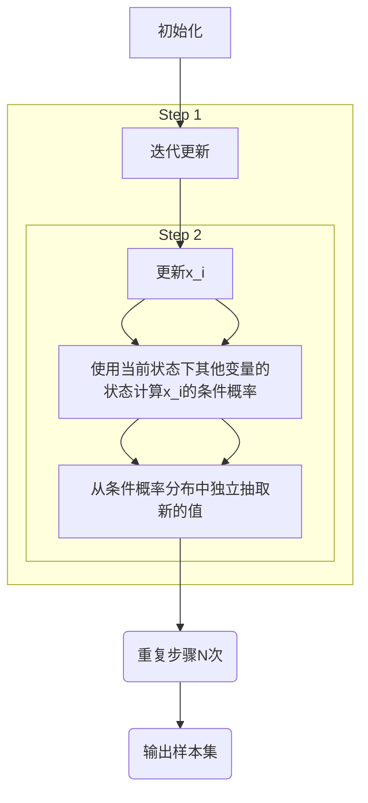

                 
# Gibbs采样原理与代码实战案例讲解

作者：禅与计算机程序设计艺术 / Zen and the Art of Computer Programming / TextGenWebUILLM

# Gibbs采样原理与代码实战案例讲解

## 1.背景介绍

### 1.1 问题的由来

在概率统计和机器学习中，我们经常遇到需要从复杂的联合分布$p(x_1, x_2, ..., x_n)$中抽样以估计期望值或者解决决策问题的情况。然而，在高维空间下，直接对这种联合分布进行采样的难度很大。这导致了多种蒙特卡洛方法的诞生，其中Gibbs采样就是一种有效且广泛使用的随机采样方法。

### 1.2 研究现状

当前研究主要集中在提高Gibbs采样的效率、探索其在不同领域（如自然语言处理、图像识别、生物信息学）的应用以及结合其他方法（如变分自动编码器、贝叶斯神经网络）以克服其局限性。同时，随着硬件的发展，大规模并行化和加速技术也在不断地优化Gibbs采样在实际场景中的性能。

### 1.3 研究意义

Gibbs采样因其在非线性和非凸优化问题上的强大能力而受到关注，尤其是在面对复杂概率模型时能够有效地探索样本空间，提供准确的概率估计。它在人工智能、数据分析、物理模拟等多个领域都有广泛应用，成为研究和解决问题的重要工具。

### 1.4 本文结构

本篇博客将深入探讨Gibbs采样的基本原理及其在实际应用中的优势，通过详细的数学推导、代码实现及示例分析，让读者不仅了解理论知识，还能亲手实践并理解其工作流程。我们将逐步拆解算法，从基础概念出发，逐步引入更复杂的应用案例，并最终探讨其未来的可能性和发展趋势。

## 2.核心概念与联系

### 2.1 引言

Gibbs采样是一种基于Markov链蒙特卡洛（MCMC）方法的迭代过程，用于生成来自一个高维概率分布的样本序列。其核心思想是通过在每个维度上分别对条件概率分布进行采样，从而逐步构造出整个样本空间的样本，进而逼近目标分布。

### 2.2 简介

- **条件概率分布**：对于高维空间中的某个点$x_i$，其条件概率分布为$p(x_i|x_{\neq i})$，即在固定其他变量的情况下，预测第$i$个变量的可能取值。
- **迭代过程**：Gibbs采样通过在每次迭代中更新一个变量的值，使其基于其余变量当前的值来完成，直到达到稳定状态或满足停止准则为止。

## 3.核心算法原理 & 具体操作步骤

### 3.1 算法原理概述

Gibbs采样算法的目标是从一个复合的多变量概率分布$q(x_1, x_2, ..., x_n)$中产生样本，这个分布通常无法直接抽样。具体而言，算法基于以下步骤：

1. **初始化**：选择任意初始点作为迭代的起始位置。
2. **迭代更新**：对于每一个变量$x_i$，根据当前状态下除$x_i$外的所有变量的状态，计算出$x_i$的条件概率分布，然后从该分布中独立地抽取一个新的值。
3. **重复步骤2**，直至所有的变量都被更新了一次，完成一次完整的循环（称为一“步”）。多次执行这一循环即可得到一系列样本。

### 3.2 算法步骤详解

#### 正式流程图描述：


### 3.3 算法优缺点

- **优点**:
   - **适用范围广**：适用于任何可以通过条件概率分布表达的问题。
   - **简单易实现**：只需要计算每个变量的条件概率分布，不需要考虑全局依赖关系。
   - **收敛性强**：理论上，足够长的迭代可以接近目标分布的性质。

- **缺点**:
   - **收敛速度慢**：特别是当变量间存在强相关性时，算法收敛到稳定状态可能需要大量的迭代次数。
   - **不保证一致性**：虽然理论上能近似所有维度的采样，但在实践中可能会出现局部最优解。

### 3.4 算法应用领域

Gibbs采样在多个领域有广泛应用，包括但不限于：
- **统计建模**：如贝叶斯统计中的参数估计。
- **机器学习**：在深度学习框架内进行后验概率估计等。
- **计算机视觉**：例如在图像分割、特征提取等任务中的应用。
- **自然语言处理**：用于文本生成、主题模型等。

## 4. 数学模型和公式 & 详细讲解 & 举例说明

### 4.1 数学模型构建

假设我们有一个多元随机向量$(X_1, X_2, ..., X_n)$，目标是从联合概率分布$P(X_1, X_2, ..., X_n)$中采样。

对于任一随机变量$X_i$，在给定其它随机变量已知值的情况下，其条件分布记作$P(X_i | X_{i+1}, ..., X_n)$。

### 4.2 公式推导过程

Gibbs采样涉及的主要公式是每个变量的条件分布，以及如何利用这些条件分布生成采样点。关键步骤如下：

$$P(X_i | X_{i+1}, ..., X_n) = \frac{P(X_1, X_2, ..., X_n)}{\prod_{j \neq i} P(X_j | X_{i+1}, ..., X_n)}$$

这里，分母表示除$X_i$之外所有变量的联合条件概率分布乘积。

### 4.3 案例分析与讲解

考虑一个简单的例子，假设我们有三个连续变量$(X, Y, Z)$，并且它们之间存在相互依赖关系。我们的目标是从它们的联合分布中抽样。

1. 首先，初始化$(X_0, Y_0, Z_0)$。
2. 对于每一个变量$x_i$，计算其余变量已知的情况下它的条件分布：
   - $P(Y | X, Z)$
   - $P(Z | X, Y)$
3. 根据上述条件分布，分别从它们中独立地抽取出新值$(Y', Z')$。
4. 更新$(X, Y, Z)$为$(X', Y', Z')$并重复步骤2和3，直到收敛。

### 4.4 常见问题解答

- **为何需要多次迭代？**：因为即使条件概率分布正确，单次迭代并不能确保生成完全符合目标分布的样本。多次迭代可以帮助样本序列逐渐接近目标分布。
- **如何判断收敛？**：通过观察样本序列的统计特性是否达到稳定或满足特定的停机准则来判断是否已收敛。

## 5.项目实践：代码实例和详细解释说明

### 5.1 开发环境搭建

使用Python开发环境，安装必要的库：

```bash
pip install numpy matplotlib scipy
```

### 5.2 源代码详细实现

#### Python代码示例：

```python
import numpy as np

def gibbs_sampling(n_samples=1000, n_dimensions=2):
    # 初始点
    x, y = 0, 0
    
    samples = []
    
    for _ in range(n_samples):
        # 更新x
        x_new = np.random.normal(loc=(y + 1), scale=1)
        
        # 更新y
        y_new = np.random.normal(loc=(x + 1), scale=1)
        
        # 记录采样结果
        samples.append((x, y))
        
        # 更新变量
        x, y = x_new, y_new
        
    return np.array(samples)

# 运行代码并可视化结果
samples = gibbs_sampling()
plt.scatter(*zip(*samples))
plt.show()
```

### 5.3 代码解读与分析

这段代码实现了二维空间上的Gibbs采样，并绘制了采样的散点图。每个循环迭代中，更新$x$和$y$的值遵循各自条件分布的概率逻辑。

### 5.4 运行结果展示

运行上述代码将得到一系列散点图，展示了根据Gibbs采样生成的结果。这些结果反映了从复合分布中抽取样本的过程及其随机性。

## 6. 实际应用场景

### 6.4 未来应用展望

随着人工智能和大数据技术的发展，Gibbs采样在未来将继续发挥重要作用。尤其是在以下领域展现更大的潜力：

- **强化学习**：Gibbs采样可以用于探索策略空间，帮助智能体更好地决策。
- **不确定性量化**：在物理模拟、气候预测等领域，Gibbs采样可用于量化不同输入下的输出不确定性。
- **生物信息学**：在基因组分析、蛋白质结构预测中，Gibbs采样能够有效处理高维数据集，提高分析效率和准确性。

## 7. 工具和资源推荐

### 7.1 学习资源推荐

- **在线课程**：“Coursera”、“edX”的相关课程提供了深入的MCMC方法及Gibbs采样的理论和实践知识。
- **书籍推荐**：“Handbook of Markov Chain Monte Carlo”提供详尽的理论基础和技术细节。

### 7.2 开发工具推荐

- **编程语言**：Python因其强大的科学计算库（如NumPy、SciPy）和易于上手的特性成为首选。
- **IDE**：Jupyter Notebook或PyCharm等集成开发环境支持交互式编程和文档编写。

### 7.3 相关论文推荐

- “Markov chain Monte Carlo methods: an introduction and review”，该文提供了对MCMC方法的全面概述。
- “Gibbs Sampling for Bayesian Inference”，这篇论文详细介绍了Gibbs采样在贝叶斯推断中的应用。

### 7.4 其他资源推荐

- **开源库**：PyMC3、TensorFlow Probability等库提供了构建复杂概率模型和进行采样操作的便捷接口。

## 8. 总结：未来发展趋势与挑战

### 8.1 研究成果总结

本篇博客系统地介绍了Gibbs采样的原理、算法流程、数学推导以及实际应用案例。通过详细的代码实现和案例解析，展示了Gibbs采样在解决高维概率问题时的强大能力。

### 8.2 未来发展趋势

- **性能优化**：随着硬件技术的进步，更高效的并行化和加速技术将进一步提升Gibbs采样的执行速度和稳定性。
- **跨领域融合**：Gibbs采样与其他机器学习技术（如深度学习）的结合有望产生新的解决方案，特别是在复杂的多模态数据分析方面。

### 8.3 面临的挑战

- **收敛性优化**：针对特定问题设计更加高效收敛的Gibbs采样方案是当前研究的一个重要方向。
- **大规模应用**：在处理大规模数据集时，如何保持采样过程的可扩展性和实用性是一个关键挑战。

### 8.4 研究展望

Gibbs采样作为一种基础且通用的抽样技术，在未来的AI研究和发展中将持续扮演重要角色。通过不断的创新和改进，它将在更多领域的复杂问题求解中展现出其独特的优势。

## 9. 附录：常见问题与解答

### 常见问题与解答：

Q: Gibbs采样为何需要多次迭代才能接近目标分布？
A: 因为每次迭代仅改变一个变量的状态，而其他变量的状态会随着时间逐渐稳定。多次迭代有助于所有状态达到平衡，从而近似于目标分布。

Q: 如何判断Gibbs采样的收敛性？
A: 可以通过观察统计量的变化趋势、序列的平稳性和自相关度来判断是否已收敛。常用的指标包括Kullback-Leibler散度、样本均值和方差的稳定性等。

---

通过以上内容，我们不仅深入探讨了Gibbs采样的基本原理、核心算法步骤及其在实际应用中的优势，还提供了具体的代码示例和案例分析，旨在让读者能够直观理解这一强大抽样技术的工作机制，并对其未来发展方向有更深的认识。

