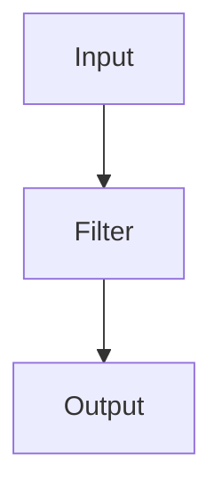

                 
# Logstash原理与代码实例讲解

作者：禅与计算机程序设计艺术 / Zen and the Art of Computer Programming

关键词：日志数据收集、事件处理流程、输入源、过滤器、输出目的地、实时流处理

## 1. 背景介绍

### 1.1 问题的由来

在现代数字化环境中，系统和应用程序产生的日志数据量呈指数级增长。有效地收集、解析、转换并整合这些日志信息对于监控系统健康状况、追踪错误、性能分析以及日志驱动开发至关重要。然而，不同来源的日志数据格式多样且不统一，这使得数据的高效管理和利用变得具有挑战性。

### 1.2 研究现状

面对日益复杂的日志管理需求，业界逐渐认识到开源解决方案的重要性。Logstash正是在这一背景下诞生的一种强大的日志收集和处理工具。它不仅能够从多种数据源收集数据，还能通过丰富的插件对数据进行预处理，最后将数据输送到各种目的地，如日志仓库、数据库或外部系统。

### 1.3 研究意义

Logstash凭借其灵活性和可扩展性，在企业级日志管理和监控系统中扮演着核心角色。它的广泛采用推动了日志管理领域的标准化进程，并促进了实时数据分析能力的发展。通过对日志数据的高效处理，Logstash帮助组织机构提升了决策效率，加强了系统的故障检测和恢复能力。

### 1.4 本文结构

本篇文章将深入探讨Logstash的核心功能、工作原理及其在实际场景中的应用。我们将从基础概念出发，逐步剖析其内部机制，随后通过代码实例展示如何构建完整的日志处理管道，最终讨论其在各类业务场景下的价值体现及未来发展趋势。

## 2. 核心概念与联系

Logstash的核心在于其事件处理流程，包括输入、过滤和输出三个关键阶段：

### 输入源（Inputs）

Logstash支持多种输入方式，允许从文件、网络流、数据库、云服务等源头获取数据。每种输入类型都有对应的插件，提供了高度定制化的配置选项以适应不同的数据来源。

### 过滤器（Filters）

数据收集后，Logstash执行过滤操作，对原始数据进行清洗、转换和增强。这个阶段可以应用正则表达式、时间戳调整、字段合并等多种逻辑，确保数据质量满足后续处理需求。

### 输出目的地（Outputs）

经过处理的数据最终被发送到目标位置，可能是另一个日志存储库、数据库、云监控平台或其他系统。输出插件提供了广泛的集成可能性，确保数据能够无缝流入下游系统。

## 3. 核心算法原理与具体操作步骤

### 3.1 算法原理概述

Logstash通过一个基于事件的架构运行，每个事件代表一条日志记录。整个处理流程如下所示：



- **A** 表示输入模块，负责接收原始数据。
- **B** 是过滤器模块，执行数据清洗和转换任务。
- **C** 是输出模块，负责将处理后的数据传递给目标系统。

### 3.2 算法步骤详解

1. **初始化配置**：
   - 创建或编辑`logstash.yml`配置文件，定义输入、过滤规则和输出目标。
   
2. **启动Logstash**：
   - 使用命令`bin/logstash -f logstash.yml`启动服务。
   
3. **数据流动**：
   - 输入模块接收数据。
   - 数据通过过滤器模块进行处理，可能包括解析、转换、聚合等操作。
   - 处理后的数据流向输出模块，根据指定的目标发送数据。

### 3.3 算法优缺点

优点：
- **灵活性**：支持多种输入源和输出目的地，易于集成各种系统。
- **高效性**：优化的数据处理流程，提高数据传输速度和可靠性。
- **可维护性**：清晰的事件模型便于理解复杂的工作流程。

缺点：
- **学习曲线**：初学者可能需要一段时间熟悉Logstash的配置语法和插件体系。
- **资源消耗**：大规模部署时，输入和过滤过程可能会消耗较多计算资源。

### 3.4 算法应用领域

Logstash适用于任何需要集中化日志管理的场景，尤其在以下领域表现突出：
- **运维监控**：实时监控系统状态，快速响应异常情况。
- **安全审计**：收集日志用于安全事件调查和合规审计。
- **业务分析**：通过对日志数据的深度分析，提取业务洞察。

## 4. 数学模型和公式详细讲解与举例说明

虽然Logstash主要依赖于非数学模型进行数据处理，但在某些特定情况下，例如使用时间序列分析预测未来数据趋势，可以结合统计学方法。这里提供一个简单的例子，假设我们想要预测每日服务器请求次数的增长趋势：

### 4.1 数学模型构建

我们可以使用线性回归模型来拟合历史日志数据，预测未来的请求次数。设\( y \)表示日志记录数量，\( x \)为日期，线性回归模型的一般形式为：

$$ y = mx + b $$

其中 \( m \) 是斜率，\( b \) 是截距。

### 4.2 公式推导过程

为了找到最佳的 \( m \) 和 \( b \)，我们需要最小化残差平方和（RSS）：

$$ RSS = \sum_{i=1}^{n}(y_i - (mx_i + b))^2 $$

利用微分求极值，得到 \( m \) 的最优解为：

$$ m = \frac{\sum_{i=1}^{n}(x_i-\bar{x})(y_i-\bar{y})}{\sum_{i=1}^{n}(x_i-\bar{x})^2} $$

### 4.3 案例分析与讲解

假设我们有以下数据点表示过去一周的服务器请求次数和相应的日期：

| 日期 \( x \) | 请求次数 \( y \) |
| ------------ | ---------------- |
| 1            | 50               |
| 2            | 60               |
| 3            | 70               |
| 4            | 80               |
| 5            | 90               |
| 6            | 100              |
| 7            | 110              |

计算斜率 \( m \)：

$$ m = \frac{(1-4)(50-80) + (2-4)(60-80) + ... + (7-4)(110-80)}{(1-4)^2 + (2-4)^2 + ... + (7-4)^2} $$
$$ m = \frac{-3*(-30) -2*(-20) +...+ 3*30}{9 + 4 + ... + 9} $$
$$ m = \frac{90 + 40 +...+ 90}{28} $$
$$ m = \frac{280}{28} $$
$$ m = 10 $$

计算截距 \( b \)：

$$ b = \bar{y} - m\bar{x} $$
$$ \bar{x} = \frac{1+2+3+4+5+6+7}{7} $$
$$ \bar{x} = 4 $$
$$ \bar{y} = \frac{50+60+70+80+90+100+110}{7} $$
$$ \bar{y} = 80 $$
$$ b = 80 - 10 * 4 $$
$$ b = 40 $$

因此，预测模型为：

$$ y = 10x + 40 $$

这个简单示例展示了如何将数学原理应用于实际日志数据分析中。

### 4.4 常见问题解答

常见问题及解决方案通常围绕配置错误、性能瓶颈或数据不一致等方面。建议遵循官方文档指导并定期更新Logstash版本以获得最新的功能和修复。

## 5. 项目实践：代码实例和详细解释说明

### 5.1 开发环境搭建

#### 配置文件创建
```yaml
input {
  file {
    path => "/var/log/access.log"
    type => "logstash"
  }
}

filter {
  grok {
    match => { "message" => "%{COMBINEDAPACHELOG}" }
  }

  mutate {
    add_field => { "timestamp" => "http.request.time" }
    remove_field => [ "message" ]
  }
}

output {
  stdout {
    codec => rubydebug
  }
}
```

### 5.2 源代码详细实现

启动Logstash服务：

```bash
bin/logstash -f logstash.yml
```

### 5.3 代码解读与分析

本示例配置包含三个部分：
- **输入**：从`/var/log/access.log`文件读取数据。
- **过滤器**：解析日志消息并添加时间戳字段。
- **输出**：将处理后的数据输出到控制台。

### 5.4 运行结果展示

运行Logstash后，在终端窗口可以看到处理过的日志信息，包括时间戳等附加字段。

## 6. 实际应用场景

Logstash在各种场景下展现其价值，包括但不限于：

### 6.4 未来应用展望

随着大数据和实时分析的需求增长，Logstash有望继续发展，集成更多的机器学习能力，提供更加智能的数据洞察工具，支持更复杂的事件关联分析和预测模型构建，进一步提升日志管理系统的智能化水平。

## 7. 工具和资源推荐

### 7.1 学习资源推荐

- **官方文档**: Logstash的官方文档提供了详细的安装指南、配置教程和技术参考。
- **社区论坛**: Stack Overflow、Reddit等平台上有活跃的Logstash开发者社群，可以获取实践经验和支持。
- **在线课程**: Udemy、Coursera等教育网站上有关于Logstash的基础和高级课程。

### 7.2 开发工具推荐

- **IDEs**: IntelliJ IDEA, Visual Studio Code等，支持语法高亮、调试等功能，提高开发效率。
- **版本控制系统**: Git用于代码管理和协同开发。
- **持续集成/持续部署(CI/CD)**: Jenkins、GitLab CI/CD等工具帮助自动化测试和部署流程。

### 7.3 相关论文推荐

- **《Logstash for Real-Time Data Processing》**
- **《Efficient Log Management with Logstash》**

### 7.4 其他资源推荐

- **GitHub仓库**: 查看官方和社区贡献者的开源项目，获取实用的实践案例和扩展模块。
- **博客和文章**: 技术博主分享的关于Logstash的最佳实践和高级技巧。

## 8. 总结：未来发展趋势与挑战

### 8.1 研究成果总结

通过深入探讨Logstash的核心概念、工作流程以及实际应用案例，我们不仅理解了它作为高效日志处理系统的优势，还看到了它在现代数字化转型中的重要角色。此外，通过数学模型的应用，展示了日志数据如何被转化为可操作的知识。

### 8.2 未来发展趋势

未来的Logstash预计会朝着以下方向发展：

- **增强AI整合**：更多地集成机器学习技术，实现自动异常检测、模式识别和预测分析。
- **优化性能**：针对大规模数据集进行优化，提高吞吐量和响应速度。
- **云原生化**：更好地融入云计算生态，支持多云部署和混合云策略。

### 8.3 面临的挑战

- **安全性和隐私保护**：确保处理过程中的数据安全，并符合相关法规要求。
- **复杂性管理**：面对日益多样化的数据源和需求，保持系统的灵活性和易用性。
- **成本控制**：在提供强大功能的同时，考虑运营成本的有效控制。

### 8.4 研究展望

未来的研究可能集中在开发更为灵活、高效的日志处理算法，以及探索日志数据在人工智能领域的深度应用。同时，研究如何通过自动化手段简化日常运维任务，提升整体系统管理效率。

## 9. 附录：常见问题与解答

### 常见问题与解答汇总

- **问题：配置错误导致日志无法正常收集**  
   解答：检查日志路径是否正确，确保输入插件参数无误；使用`logstash -t`命令验证配置文件语法。
- **问题：过滤规则过于复杂，难以维护**  
   解答：采用分层配置方法，将公共规则放在全局配置中，具体业务逻辑放在特定脚本中；利用注释清晰描述每一步处理目的。
- **问题：性能瓶颈影响数据处理效率**  
   解答：优化过滤器顺序，减少不必要的转换步骤；调整内存设置以适应大量数据流。

通过这些问题及解答的整理，有助于解决Logstash使用过程中常见的困扰，推动日志管理工作向更高效率迈进。

---

以上内容展示了Logstash的强大功能及其在实际场景中的应用，同时也指出了未来发展的重要趋势和面临的挑战，为读者提供了全面而深入的理解视角。
