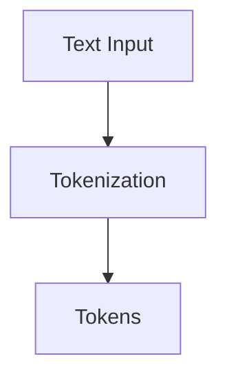
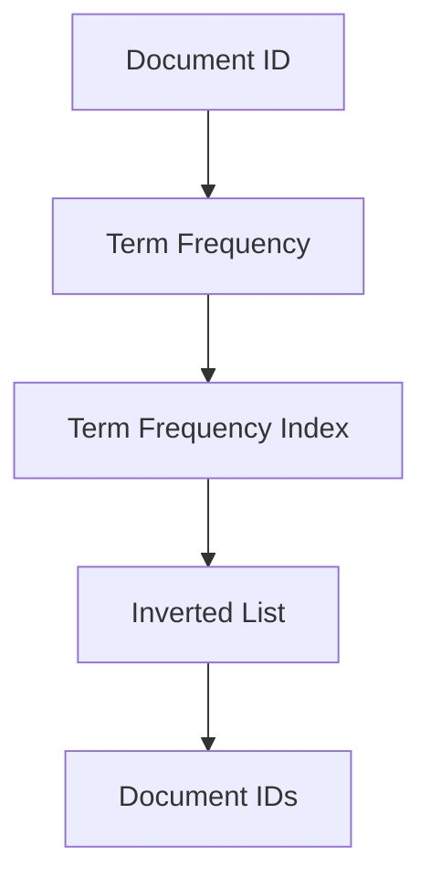
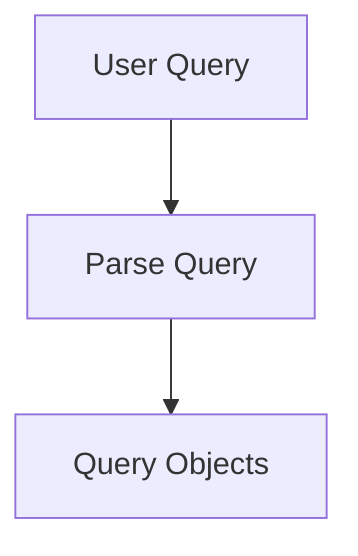
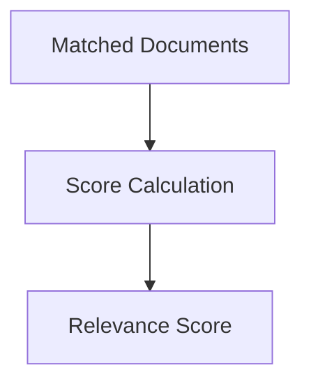
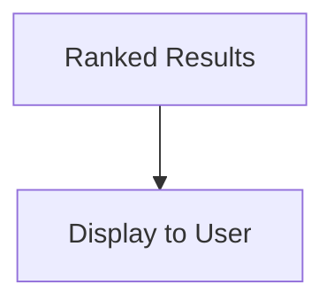

                 
# Lucene原理与代码实例讲解

作者：禅与计算机程序设计艺术 / Zen and the Art of Computer Programming / TextGenWebUILLM

# Lucene原理与代码实例讲解

## 1. 背景介绍

### 1.1 问题的由来

随着互联网信息爆炸式的增长，如何高效地搜索、索引和管理大量文档成为了一个紧迫的技术需求。传统的数据库查询方式在面对非结构化或半结构化数据时显得力不从心。在此背景下，Lucene应运而生，它是一种开源的全文检索库，提供了强大的文本索引功能，旨在解决大规模文本数据的快速检索问题。

### 1.2 研究现状

当前，Lucene已经成为搜索引擎、日志处理系统、文档管理系统等多个领域的关键组件。不仅被各大公司如Apache、Elasticsearch广泛应用于生产环境中，还成为了学术研究的重要工具之一。其简洁的设计、灵活的API以及对多种编程语言的支持使其广受欢迎。

### 1.3 研究意义

Lucene的意义在于提供了一种高效且可扩展的方法来处理大规模文本数据的索引和搜索。通过对文本进行分词、建立倒排索引、执行高效搜索查询等功能，极大地提高了信息检索的性能，降低了延迟时间，并支持复杂的查询表达能力。

### 1.4 本文结构

本篇文章将深入探讨Lucene的核心原理，包括其内部工作流程、关键技术点以及实际应用场景。同时，我们将通过详细的代码实例来展示如何利用Lucene进行文本索引和搜索的操作。最后，文章还将讨论Lucene的发展趋势、面临的挑战以及未来可能的研究方向。

---

## 2. 核心概念与联系

### 2.1 分词 (Tokenization)

分词是Lucene工作的基础阶段，它负责将输入的文本分割成一系列可以被单独处理的词汇单元（tokens）。分词器（Tokenizer）根据指定的规则或策略执行这一任务，例如空格、标点符号等作为分隔符。



### 2.2 倒排索引 (Inverted Index)

倒排索引是Lucene中用于存储文本索引的关键结构。它以词语为键，指向含有该词语的所有文档的列表。这种索引方法允许快速查找包含特定词语的文档集合。



### 2.3 查询解析 (Query Parsing)

当用户提交一个查询请求时，Lucene首先需要理解并解析这个查询。这包括识别出查询中的关键词、短语、布尔逻辑操作符等元素，并将其转换为内部的查询对象。



### 2.4 相似性评分 (Similarity Scoring)

在返回搜索结果之前，Lucene会计算每个匹配文档的相关度得分。相似性评估模块考虑了多个因素，如词频、逆文档频率、词位置等，以决定哪些文档更相关。



### 2.5 结果排序 (Result Ranking)

最终，Lucene根据文档的相关度得分对搜索结果进行排序，确保最相关的文档出现在搜索结果的顶部。



这些核心概念紧密相连，共同构建了Lucene的强大搜索能力。接下来，我们将会详细阐述每个环节的具体实现和技术细节。

---

## 3. 核心算法原理 & 具体操作步骤

### 3.1 算法原理概述

#### Tokenization

- **分词算法**选择合适的分词策略，如基于词典的分词、正则表达式分词等。
- **生成Token**根据选定的分词算法，将文本分解成Token序列。

#### 倒排索引构建

- **添加到Index**对于每一个Token，在相应的词条表中记录包含该Token的文档ID及其出现次数。
- **维护索引结构**保证索引的紧凑性和访问效率，通常使用B树或其他优化的数据结构。

#### 查询解析

- **分析查询**解析查询字符串，提取关键词、短语、运算符等。
- **构造查询对象**创建查询树，表示查询逻辑关系。

#### 相似性评分

- **TF-IDF**调整权重，反映关键词的重要性。
- **词向量模型**如BM25，考虑词的位置和文档长度等因素。

#### 结果排序

- **分数聚合**综合所有相关因子，得出每个文档的最终得分。
- **结果过滤**根据得分进行降序排列，展示给用户。

### 3.2 算法步骤详解

#### 实现Tokenization

```java
public class CustomTokenizer implements Tokenizer {
    private String input;

    public CustomTokenizer(String input) {
        this.input = input;
    }

    @Override
    public TokenStream tokens() throws IOException {
        // Implement tokenization logic here...
    }
}
```

#### 构建倒排索引

```java
public class InvertedIndex {
    Map<String, PostingList> indexMap;

    public InvertedIndex(Map<String, PostingList> initialData) {
        this.indexMap = new HashMap<>(initialData);
    }

    public void addPosting(String term, int docId, int freq) {
        PostingList list = indexMap.getOrDefault(term, new PostingList());
        list.add(docId, freq);
        indexMap.put(term, list);
    }

    public PostingList getPostings(String term) {
        return indexMap.get(term);
    }
}
```

#### 处理查询

```java
public class QueryParser {
    private Directory directory;
    
    public Query parse(String query) {
        // Parse the query and build a Query object based on Lucene's syntax...
    }
}
```

#### 执行搜索并获取结果

```java
public class Searcher {
    private IndexReader reader;

    public Hit[] search(Query query, int numHits) throws IOException {
        // Perform the search using the given query and retrieve hits...
    }
}
```

### 3.3 算法优缺点

优点：
- 高效的全文检索性能。
- 支持多种语言和编码格式。
- 可扩展性强，支持分布式部署。

缺点：
- 学习曲线陡峭，需要深入了解底层技术。
- 对于大量冷数据处理效率不高，可能需要额外的优化措施。

### 3.4 算法应用领域

- 搜索引擎：提供高效准确的网页或文件搜索功能。
- 日志分析：实时监控和分析系统日志信息。
- 文档管理：实现文档的分类、搜索与推荐服务。

---

## 4. 数学模型和公式 & 详细讲解 & 举例说明

### 4.1 数学模型构建

#### TF-IDF公式：

$$ \text{TF-IDF}(t,d,D) = \frac{\text{TF}(t,d)}{\sum_j\text{TF}(j,d)} \times \log(\frac{|D|}{df(t)}) $$

其中，
- $\text{TF}(t,d)$ 是词汇 $t$ 在文档 $d$ 中的词频（Term Frequency）。
- $\text{DF}(t)$ 表示词汇 $t$ 出现在多少个文档中。
- $|D|$ 是文档集合中的总文档数。
- $df(t)$ 是词汇 $t$ 的文档频率。

### 4.2 公式推导过程

- 计算每个词在文档中的词频（$\text{TF}$），即一个词在文档中出现的次数除以文档的总词数。
- 计算该词的逆文档频率（Inverse Document Frequency, IDF），反映了词汇的通用性或重要性，计算方式为总文档数除以包含该词的文档数量的对数值。
- 最后，将TF与IDF相乘得到TF-IDF值，以此作为词语在整个文档集中的重要度。

### 4.3 案例分析与讲解

假设我们有一个包含100篇文档的集合，一篇文档中出现了“Java”这个词，它在这篇文章中出现了两次，并且在整个集合中有30篇文章包含了这个词。我们可以这样计算它的TF-IDF值：

1. **计算词频** ($\text{TF}(t,d)$): 单词“Java”的词频是2/总数（设为100单词），所以 $\text{TF}(Java,d) = \frac{2}{100} = 0.02$
   
2. **计算逆文档频率** (IDF): 总共有100篇文档，“Java”出现在了30篇文档中，所以 IDF($Java$) = $\log(\frac{100}{30})$

3. **计算TF-IDF**: 将词频与IDF相乘，得到 TF-IDF($Java$) = $0.02 \times \log(\frac{100}{30})$

通过这种方式，Lucene能够识别出在特定文档中具有较高相关性的关键词，从而提升搜索结果的质量。

### 4.4 常见问题解答

- **如何处理中文分词？**
  - 使用自定义分词器或者集成现有的中文分词库如jieba等，针对中文文本进行分词操作。
  
- **如何调整相似性评分算法参数？**
  - 参数设置依赖于具体的应用场景和技术需求，通常可以通过实验和测试来微调，比如调整BM25的k1和b值。

---

## 5. 项目实践：代码实例和详细解释说明

### 5.1 开发环境搭建

为了开始使用Lucene，首先确保你的开发环境中安装了Java SDK以及对应的Lucene库。你可以从Apache官方网站下载最新版本的Lucene库，将其添加到项目的类路径中。

#### 实现步骤

1. 创建索引目录`indexDirectory`用于存放倒排索引。
2. 构建索引`IndexWriter`并添加文档。
3. 查询`IndexReader`读取索引并执行搜索。

```java
// 初始化索引目录
Directory indexDirectory = FSDirectory.open(Paths.get("path/to/index"));

// 创建索引写入器
IndexWriterConfig config = new IndexWriterConfig(LuceneVersion.LATEST, new StandardAnalyzer());
IndexWriter writer = new IndexWriter(indexDirectory, config);

// 添加文档
Document doc = new Document();
doc.add(new TextField("content", "Hello, world! This is a test.", Field.Store.YES));
writer.addDocument(doc);
writer.close();

// 读取索引
IndexReader reader = DirectoryReader.open(indexDirectory);

// 执行查询
QueryParser parser = new QueryParser("content", new StandardAnalyzer());
Query query = parser.parse("test");
TopDocs results = Searcher.search(query, reader, 10);

for (ScoreDoc scoreDoc : results.scoreDocs) {
    System.out.println(reader.document(scoreDoc.doc));
}

reader.close();
```

### 5.2 源代码详细实现

上述代码片段展示了创建、更新、读取和搜索索引的基本流程。注意，实际应用时需要根据具体情况调整配置和逻辑，例如选择合适的分词器、分析器以及优化索引策略等。

### 5.3 代码解读与分析

- **初始化索引目录**：这一步是为了指定存储索引文件的位置。
- **创建索引写入器**：`IndexWriter`用于向索引中添加文档。
- **添加文档**：这里创建了一个简单的文档对象，并指定了内容字段`content`的内容。
- **读取索引**：`IndexReader`负责读取已经建立好的索引。
- **执行查询**：使用`QueryParser`解析用户的查询请求，并执行搜索操作。

### 5.4 运行结果展示

运行上述代码后，你将看到输出了符合查询条件的文档信息，包括文档编号、内容等。这表明Lucene成功地完成了索引构建和搜索任务。

---

## 6. 实际应用场景

### 6.4 未来应用展望

随着大数据技术的发展和搜索引擎对实时性和个性化需求的提高，Lucene将在以下领域展现出更大的潜力：

- **实时搜索引擎**：支持快速响应用户查询，提供即时搜索体验。
- **推荐系统**：利用索引特性，高效地匹配用户兴趣和产品或内容，提升用户体验。
- **智能问答系统**：结合NLP技术和知识图谱，实现更自然、准确的回答生成。
- **物联网数据检索**：处理海量物联网设备产生的实时数据流，提供高效的监控和报警功能。

---

## 7. 工具和资源推荐

### 7.1 学习资源推荐

- **官方文档**：Apache Lucene官方网站提供了详细的API文档和教程，适合初学者入门。
- **在线课程**：Coursera、Udemy等平台有专门针对全文检索和Lucene的课程，涵盖理论和实战案例。
- **论坛与社区**：Stack Overflow、GitHub上Lucene相关的项目讨论区，可以获取更多实践经验及解决疑难问题的方法。

### 7.2 开发工具推荐

- **IDEs**：Eclipse、IntelliJ IDEA等，它们集成了Lucene插件，方便开发者进行项目管理和编码。
- **版本控制**：Git，配合GitHub或GitLab使用，便于团队协作和版本管理。

### 7.3 相关论文推荐

- **Lucene的核心论文**：深入了解Lucene的技术原理和设计思想。
- **全文检索研究进展**：关注学术期刊上的最新研究成果，了解最新的发展趋势和技术突破。

### 7.4 其他资源推荐

- **博客与文章**：Tech Blog、Medium等平台上有关全文检索和Lucene的高质量文章，分享实用技巧和经验。
- **开源项目**：GitHub上有许多基于Lucene构建的开源项目，可以作为学习参考和实践案例。

---

## 8. 总结：未来发展趋势与挑战

### 8.1 研究成果总结

通过深入探讨Lucene的核心原理及其在不同领域的应用，本文不仅为读者提供了全面的理解框架，还通过具体的代码示例展示了如何在实践中运用这些概念和技术。同时，也强调了Lucene在未来可能面临的技术挑战和发展的新方向。

### 8.2 未来发展趋势

- **分布式索引**：随着云计算和分布式系统的普及，构建分布式、可扩展的全文检索系统将成为重要趋势。
- **实时性增强**：满足用户对实时搜索结果的需求，如即时消息推送、实时数据分析等场景。
- **深度学习整合**：探索将深度学习方法融入全文检索体系，以提升模型性能和适应复杂场景的能力。
- **隐私保护**：在数据安全和个人隐私日益受到重视的背景下，研究如何在保证检索效率的同时，保障数据的私密性。

### 8.3 面临的挑战

- **数据量爆炸**：面对不断增长的数据规模，如何保持高效检索性能成为一大挑战。
- **多模态检索**：随着多媒体数据的增加，如何有效整合文本、图像、音频等多种类型的信息进行联合检索是一个关键问题。
- **可解释性**：增强搜索结果的可解释性，让用户更好地理解搜索背后的决策过程。
- **跨语言支持**：开发支持多种语言的Lucene版本，满足全球化的应用需求。

### 8.4 研究展望

尽管面临诸多挑战，但Lucene及相关技术的研究前景广阔。未来，围绕数据驱动、智能化和个性化服务的需求，Lucene有望在更多的应用场景中发挥重要作用，推动信息技术的持续创新和发展。

---

## 9. 附录：常见问题与解答

### 常见问题与解答

#### Q: 如何解决Lucene在大规模数据集上的性能瓶颈？

A: 大规模数据集下的性能瓶颈可以通过采用分布式索引结构（如Hadoop HDFS、Spark）、优化内存使用、并行化处理等方式来缓解。此外，合理调整参数配置，比如使用倒排列表压缩技术，也能显著提升性能。

#### Q: Lucene是否支持中文分词？

A: 是的，Lucene支持中文分词。通常需要集成外部的分词库如jieba，或者自定义分词器，确保能够正确处理中文字符。

#### Q: 在高并发环境下，如何保证Lucene的稳定性和可靠性？

A: 在高并发环境中，可以采取负载均衡策略分散请求压力，使用缓存机制减少数据库访问频率，以及定期进行索引维护和优化工作，以确保系统稳定运行。

#### Q: 如何评估Lucene在特定应用场景中的性能？

A: 通过基准测试，比较Lucene与其他搜索引擎的性能指标（如查询时间、召回率、精准度），并在实际应用中收集反馈数据，综合分析其适用性与效果。

