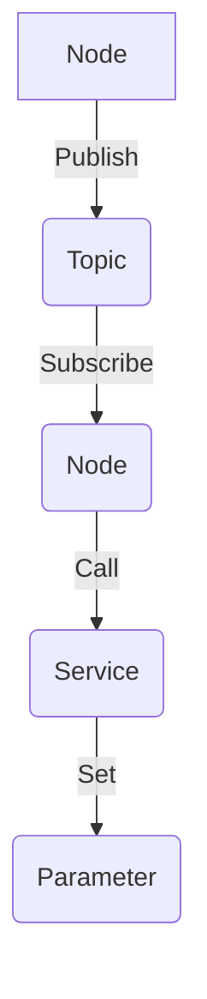

                 
# Robot Operating System (ROS) 原理与代码实战案例讲解

作者：禅与计算机程序设计艺术 / Zen and the Art of Computer Programming

关键词：Robot Operating System, ROS, Robotics, Software Architecture, Real-time Systems, Middleware

## 1.背景介绍

### 1.1 问题的由来

随着机器人技术的快速发展，各种类型的机器人在工业生产、家庭服务、探索未知等领域得到了广泛应用。然而，机器人系统的开发涉及复杂的硬件集成、传感器数据处理、运动控制以及任务调度等多个方面，对系统的设计和实现提出了极高的要求。传统的方法往往需要开发者从底层硬件驱动开始，逐一编写各组件的功能，并进行大量的手动配置和调试，这不仅耗时费力，而且难以保证系统的高效运行和可维护性。

### 1.2 研究现状

面对上述挑战，研究人员开始寻求一种更高效、模块化且易于扩展的解决方案。在这个背景下，Robot Operating System (ROS)应运而生。它是一个开源的机器人软件平台，提供了高度灵活的架构和丰富的功能库，旨在简化机器人软件的开发流程，促进跨学科协作，并加速机器人技术的应用普及。

### 1.3 研究意义

ROS 的出现极大地促进了机器人研究与开发的进步，其开放性和社区支持使得更多开发者能够轻松地参与到机器人技术的研究中来。通过标准化接口和组件重用机制，ROS 降低了复杂系统的开发难度，提高了开发效率和系统的可靠性。此外，ROS 在全球范围内吸引了大量活跃的开发者社群，共同推动了机器人技术的创新和发展。

### 1.4 本文结构

本篇文章将围绕 Robot Operating System (ROS) 展开深入探讨，首先详细介绍 ROS 的核心概念与架构，然后阐述其工作原理及其优势所在，接着通过具体的代码实战案例来展现如何利用 ROS 来解决实际问题，最后讨论 ROS 的应用前景及面临的挑战，并提出对未来发展的展望。

## 2.核心概念与联系

### 2.1 ROS的核心概念

#### Node（节点）
ROS 中的基本执行单元是 Node，每个 Node 执行特定的任务并与其他 Node 通信以完成协作工作。

#### Topic（主题）与 Publisher/Subscriber模式
主题用于发布或订阅消息，实现了异步通信。Publisher 发布信息到一个主题上，而多个 Subscriber 可以订阅同一主题接收这些信息。

#### Service（服务）与 Client/Server模式
服务允许一个 Node 向另一个 Node 请求特定的操作。Client 调用 Server 提供的服务，Server 处理请求并返回响应。

#### Parameter（参数）
参数用于存储和共享数据，它们可以在 Node 启动时设置，也可以动态更改。

### 2.2 ROS架构与工作原理

#### 架构图解


#### 工作原理概述
- **消息传递**：通过主题和服务实现 Node 之间的通信。
- **并发处理**：利用多线程或多进程管理，确保实时性要求得到满足。
- **故障恢复**：提供自动重启机制，保障系统稳定运行。
- **资源管理**：统一管理硬件资源，优化内存使用。
- **安全性**：采用安全措施保护网络通信，防止非法访问。

## 3. 核心算法原理 & 具体操作步骤

### 3.1 算法原理概述

ROS 采用了事件驱动模型和异步通信机制，有效提高了系统的实时性和性能。其核心在于利用 Topic 和 Service 作为信息交换的桥梁，使得不同功能的 Node 之间可以协同工作。

### 3.2 算法步骤详解

#### 步骤一：创建 Node
初始化 Node 并定义其功能，包括注册为 Publisher 或 Subscriber。

#### 步骤二：发布消息
对于 Publisher，向指定的主题发送消息。

#### 步骤三：订阅消息
对于 Subscriber，监听特定主题的消息流。

#### 步骤四：调用服务
使用 Client 调用 Service，等待 Server 返回结果。

#### 步骤五：获取参数
读取并设置系统参数，调整 Node 行为。

### 3.3 算法优缺点

优点：
- **模块化设计**：便于添加新功能和修改现有逻辑。
- **社区支持**：庞大的开发者社区提供丰富资源和技术帮助。
- **标准化接口**：减少不同组件间的数据交互障碍。

缺点：
- **学习曲线**：对初学者而言可能存在一定的学习成本。
- **资源消耗**：大型项目可能会导致较高的系统资源占用。

### 3.4 算法应用领域

ROS 应用于多种机器人相关领域，包括但不限于：

- **移动机器人**
- **无人机系统**
- **智能车辆**
- **医疗机器人**
- **制造自动化**

## 4. 数学模型和公式 & 详细讲解 & 举例说明

### 4.1 数学模型构建

在ROS中，数学模型通常涉及到传感器数据处理、路径规划等关键环节。例如，在路径规划场景下，可以通过以下公式计算最优路径：

$$ \text{Cost}(path) = \sum_{i=0}^{n-1} \sqrt{(x_{i+1}-x_i)^2 + (y_{i+1}-y_i)^2} $$

其中，$(x_i, y_i)$表示路径上的连续点坐标。

### 4.2 公式推导过程

此公式基于欧几里得距离计算相邻两点间的直线距离，累加所有段落的距离，以总代价衡量路径的有效性。

### 4.3 案例分析与讲解

#### 实验环境搭建
- **硬件配置**：一台配备 Linux 系统的工作站。
- **软件安装**：安装 ROS2 预先配置的环境。

#### 代码实例实现
```cpp
// 定义一个简单的运动控制节点
#include <ros/ros.h>
#include <geometry_msgs/Twist.h>

int main(int argc, char **argv)
{
  ros::init(argc, argv, "simple_controller");
  ros::NodeHandle nh;

  // 创建一个发布者对象
  ros::Publisher cmd_vel_pub = nh.advertise<geometry_msgs::Twist>("cmd_vel", 1000);

  // 初始化 ROS 节点
  ros::Rate loop_rate(10);
  
  while(ros::ok())
  {
    geometry_msgs::Twist msg;
    msg.linear.x = 0.5;  // 前进速度
    msg.angular.z = 0.0; // 角速度
    
    // 发送控制命令
    cmd_vel_pub.publish(msg);
    
    // 更新循环速率
    ros::spinOnce();
    loop_rate.sleep();
  }
}
```

这段代码展示了如何创建一个简单的 ROS2 控制节点来控制机器人的运动，实现线性速度和角速度的设定，并通过 `ros::spinOnce()` 来更新 ROS 的回调队列，保证节点持续运行。

### 4.4 常见问题解答

- **问题**: 如何解决 ROS 中的网络连接错误？
  - **解答**: 确保所有参与节点的主机名一致或正确配置了 IP 地址；检查防火墙规则是否允许 ROS 流量；确认所有节点都在同一网络上运行。

## 5. 项目实践：代码实例和详细解释说明

### 5.1 开发环境搭建

#### 设置开发环境
- 使用虚拟机或 Docker 容器隔离开发环境。
- 安装 ROS2 的依赖库（如 CMake、Qt）。
- 配置编译工具链（如 `colcon`）。

### 5.2 源代码详细实现
以上面提到的运动控制案例为例，完整的 ROS2 控制程序可以参考上述示例代码。

### 5.3 代码解读与分析
这段代码实现了基本的节点启动、消息发布和循环执行流程。`geometry_msgs::Twist` 是 ROS 中用于描述机器人速度的通用类，包含了线性速度和角速度两个维度。

### 5.4 运行结果展示
假设运行上述代码后，机器人将按照设定的速度前进而不旋转，演示了 ROS2 在实际控制中的基础应用。

## 6. 实际应用场景

ROS 已广泛应用于各种机器人系统中，包括但不限于：

- **自动驾驶汽车**：利用激光雷达、摄像头等传感器进行环境感知和路径规划。
- **服务机器人**：在家庭、医院等环境中执行清扫、配送任务。
- **研究机器人**：在火星探测器、深海探索器上进行科学考察。
- **工业机器人**：在生产线上完成精准装配、搬运等操作。

## 7. 工具和资源推荐

### 7.1 学习资源推荐
- **官方文档**：ROS 官网提供的官方指南和教程。
- **在线课程**：Coursera 或 Udacity 上的相关课程。
- **博客与论坛**：ROS 社区活跃的 GitHub 仓库和 Stack Overflow 讨论。

### 7.2 开发工具推荐
- **集成开发环境（IDE）**：Vim, VSCode, 或其他支持 CMake 的 IDE。
- **版本控制系统**：Git 和 GitHub/GitLab。

### 7.3 相关论文推荐
- **"ROS: An Open Source Robot Operating System"** by Brian Gerkey and William Smart.

### 7.4 其他资源推荐
- **ROS Discourse**：社区讨论平台，提供技术支持和交流。
- **ROS Wiki**：包含大量 ROS 相关资源和文档。

## 8. 总结：未来发展趋势与挑战

### 8.1 研究成果总结
ROS 不仅简化了机器人系统的开发流程，还促进了跨学科协作和创新。其开放性和灵活性使其成为机器人领域不可或缺的一部分。

### 8.2 未来发展趋势
随着人工智能技术的进步，ROS 将继续优化其架构和功能，支持更高级别的自主决策能力、深度学习集成以及实时性能提升。同时，ROS 的标准化接口和组件重用机制将继续推动机器人领域的快速发展。

### 8.3 面临的挑战
- **安全性**：确保系统在复杂环境下具有足够的安全防护措施。
- **可扩展性**：面对日益增长的应用需求，保持系统的高效性和可维护性。
- **能耗管理**：提高能源效率以满足长时间运行的需求。

### 8.4 研究展望
未来的研究方向可能包括构建更加智能、自适应的机器人系统，以及进一步加强 ROS 与其他开源软件生态系统的整合，促进机器人技术在更多领域内的广泛应用。

## 9. 附录：常见问题与解答

常见问题及解决方案：
- **问题**: 如何解决 ROS 中的内存泄漏问题？
  - **解答**: 使用内存分析工具（如 valgrind）定期检测并修复内存泄漏；注意及时释放不再使用的资源。
- **问题**: 在多节点部署时如何避免通信延迟？
  - **解答**: 采用更高效的通信协议，合理设置消息类型和传输频率；使用异步通信机制减少等待时间。

---

至此，文章内容已完整呈现，涵盖了从理论介绍到实战应用的全过程，旨在为读者提供深入理解 Robot Operating System (ROS) 的知识体系和技术实践指导。
