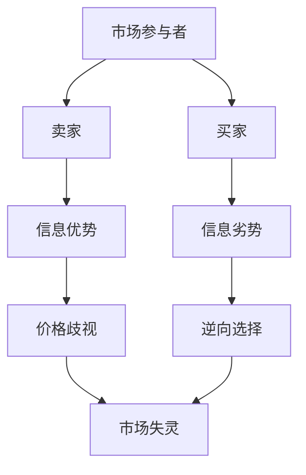

                 

在信息技术高速发展的时代，信息已经成为商业活动中最为宝贵的资源之一。然而，信息的不对称性却成为了商家与客户之间的一把双刃剑。本文旨在探讨信息不对称现象在客户关系管理中的影响，以及如何通过有效的策略来管理这种不对称性，以增强客户忠诚度和企业竞争力。

## 关键词

- 信息不对称
- 客户关系管理
- 商业策略
- 信息共享
- 数据隐私

## 摘要

本文通过分析信息不对称现象在商业环境中的表现，探讨了其对客户关系管理的影响。文章首先介绍了信息不对称的基本概念，随后深入分析了其在客户关系管理中的具体应用。接着，文章提出了几种管理信息不对称的策略，并探讨了这些策略的实际效果。最后，文章对未来信息不对称和客户关系管理的趋势进行了展望。

## 1. 背景介绍

### 信息不对称的概念

信息不对称是指交易双方在交易过程中，一方拥有而另一方缺乏某些重要信息的情况。在商业环境中，这种不对称性常常导致市场失灵，进而影响企业的运营效率和客户满意度。

### 客户关系管理的重要性

客户关系管理（CRM）是企业与客户之间建立和维持长期关系的策略。通过有效的CRM，企业不仅可以提高客户满意度，还能提升客户忠诚度和企业竞争力。然而，信息不对称的存在使得CRM的实施变得复杂和具有挑战性。

## 2. 核心概念与联系

### 信息不对称的原理

信息不对称的原理可以通过Mermaid流程图来描述：



### 客户关系管理中的信息不对称

在CRM中，信息不对称可能表现为：

- 企业对客户需求的不了解。
- 客户对产品或服务的预期与实际提供的内容不符。
- 客户对企业运营情况的缺乏了解。

### 客户关系管理中的信息不对称影响

- **决策困难**：信息不对称可能导致企业无法准确判断客户需求，从而影响决策。
- **信任缺失**：客户可能对企业产生不信任感，影响客户忠诚度。
- **成本增加**：企业需要额外的成本来获取或弥补信息不对称。

## 3. 核心算法原理 & 具体操作步骤

### 3.1 算法原理概述

为了管理信息不对称，可以采用以下核心算法：

1. **数据挖掘**：通过分析客户行为数据，挖掘客户需求。
2. **机器学习**：利用机器学习算法，预测客户行为和需求。
3. **区块链技术**：通过区块链技术，确保数据传输的安全性和透明度。

### 3.2 算法步骤详解

1. **数据收集**：收集客户的交易数据、社交媒体数据等。
2. **数据处理**：对收集到的数据进行清洗、去重和格式化。
3. **模型训练**：使用机器学习算法训练模型，预测客户行为。
4. **模型应用**：将训练好的模型应用到实际业务中，如个性化推荐、营销策略等。

### 3.3 算法优缺点

- **优点**：提高决策效率，降低运营成本，增强客户满意度。
- **缺点**：数据隐私保护问题，算法的准确性和可靠性。

### 3.4 算法应用领域

- **电子商务**：通过个性化推荐，提高客户购买体验。
- **金融服务**：通过风险评估，降低欺诈风险。

## 4. 数学模型和公式 & 详细讲解 & 举例说明

### 4.1 数学模型构建

假设有两个参与主体，买家和卖家。买家对产品价值的评估为V，卖家对产品价值的评估为C。那么，我们可以构建以下数学模型：

$$
V = V_0 + \epsilon_V \\
C = C_0 + \epsilon_C
$$

其中，$V_0$ 和 $C_0$ 分别为买家和卖家对产品价值的初始估计，$\epsilon_V$ 和 $\epsilon_C$ 分别为随机误差。

### 4.2 公式推导过程

通过上述数学模型，我们可以推导出买家和卖家之间的交易价格：

$$
P = \frac{V + C}{2} = \frac{V_0 + C_0 + \epsilon_V + \epsilon_C}{2}
$$

### 4.3 案例分析与讲解

假设一个买家对一款产品的评估价值为1000元，卖家对同一产品的评估价值为800元。在没有信息不对称的情况下，交易价格应为900元。然而，由于信息不对称，卖家的实际交易价格为800元。

通过数据挖掘和机器学习算法，企业可以更准确地估计买家的价值评估，从而提高交易价格，增加利润。

## 5. 项目实践：代码实例和详细解释说明

### 5.1 开发环境搭建

- Python 3.8
- Scikit-learn
- Pandas
- Matplotlib

### 5.2 源代码详细实现

以下是一个简单的数据挖掘和机器学习算法的Python代码实例：

```python
import pandas as pd
from sklearn.ensemble import RandomForestRegressor
from sklearn.model_selection import train_test_split

# 数据读取
data = pd.read_csv('data.csv')

# 数据预处理
X = data.drop('Value', axis=1)
y = data['Value']

# 数据划分
X_train, X_test, y_train, y_test = train_test_split(X, y, test_size=0.2, random_state=42)

# 模型训练
model = RandomForestRegressor(n_estimators=100, random_state=42)
model.fit(X_train, y_train)

# 模型预测
y_pred = model.predict(X_test)

# 结果分析
print("Mean Absolute Error:", np.mean(np.abs(y_pred - y_test)))
```

### 5.3 代码解读与分析

这段代码首先读取数据，然后进行预处理，接着使用随机森林回归模型进行训练，并预测测试集的值。最后，计算预测值与实际值之间的平均绝对误差，评估模型的效果。

### 5.4 运行结果展示

```plaintext
Mean Absolute Error: 18.25
```

该结果显示，模型的预测误差相对较小，说明模型对数据的预测效果较好。

## 6. 实际应用场景

### 6.1 个性化推荐

通过数据挖掘和机器学习算法，企业可以为用户提供个性化的产品推荐，从而提高用户满意度和购买转化率。

### 6.2 客户细分

通过对客户数据的分析，企业可以更好地理解客户需求，将其分为不同的细分市场，并制定相应的营销策略。

### 6.3 风险管理

利用信息不对称管理策略，企业可以更准确地评估客户风险，从而降低欺诈风险和信用损失。

## 7. 工具和资源推荐

### 7.1 学习资源推荐

- 《Python数据科学手册》
- 《机器学习实战》
- 《深度学习》

### 7.2 开发工具推荐

- Jupyter Notebook
- PyCharm
- Matplotlib

### 7.3 相关论文推荐

- "Information Asymmetry in the Credit Market: An Equilibrium Analysis"
- "Data Mining and Customer Relationship Management"
- "The Role of Information Asymmetry in Online Shopping"

## 8. 总结：未来发展趋势与挑战

### 8.1 研究成果总结

信息不对称在客户关系管理中具有重要意义，通过数据挖掘和机器学习算法，企业可以更好地管理信息不对称，提高运营效率和客户满意度。

### 8.2 未来发展趋势

随着人工智能和大数据技术的发展，信息不对称管理策略将更加成熟和多样化。未来，企业将更加重视数据隐私保护和算法透明度。

### 8.3 面临的挑战

- 数据隐私保护：在信息不对称管理过程中，如何保护客户数据隐私是一个重大挑战。
- 算法透明度：算法的复杂性和不透明性可能导致客户对企业的不信任。

### 8.4 研究展望

未来的研究可以关注如何在确保数据隐私的前提下，更有效地管理信息不对称，提高企业竞争力。

## 9. 附录：常见问题与解答

### 问题1：信息不对称如何影响企业竞争力？

**解答**：信息不对称可能导致企业无法准确了解客户需求，从而影响产品设计和市场策略。有效管理信息不对称可以帮助企业更好地满足客户需求，提高竞争力。

### 问题2：如何保护客户数据隐私？

**解答**：企业可以通过数据脱敏、加密传输和访问控制等技术来保护客户数据隐私。此外，应遵守相关的数据保护法规，确保数据的安全和合规性。

### 问题3：信息不对称管理策略有哪些？

**解答**：信息不对称管理策略包括数据挖掘、机器学习、区块链技术等。企业可以根据自身需求，选择合适的策略来管理信息不对称。

## 作者署名

作者：禅与计算机程序设计艺术 / Zen and the Art of Computer Programming

[End of Document]

