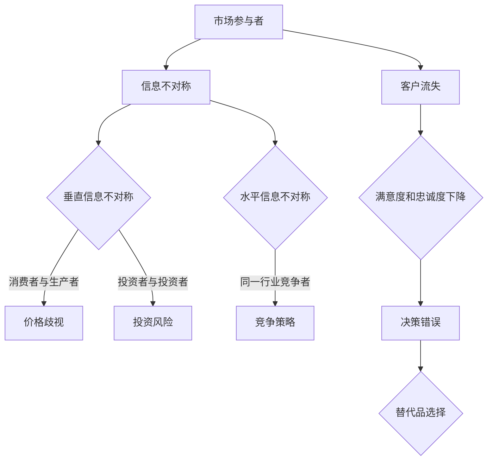
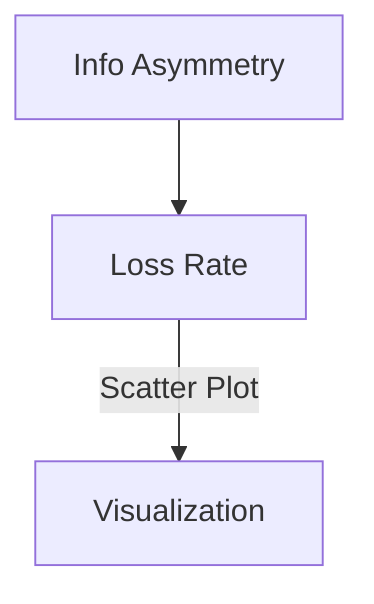

                 

关键词：信息不对称、客户流失、市场分析、营销策略、客户关系管理

摘要：本文将深入探讨信息不对称在商业环境中的重要性，以及它如何影响客户流失率。我们将分析信息不对称的本质、其对客户决策的影响、信息不对称导致的客户流失现象，并提供一些有效的策略来减少客户流失。

## 1. 背景介绍

在当今竞争激烈的商业环境中，企业需要不断努力来保持客户的忠诚度。然而，客户流失是一个普遍存在的问题，对企业的影响深远。客户流失不仅意味着失去现有客户，还可能导致潜在客户的丧失。信息不对称作为一种普遍存在的现象，它在很大程度上影响了客户的行为和决策，进而导致客户流失。

信息不对称是指在交易双方中，一方拥有而另一方不拥有某些信息的情况。在商业环境中，这通常表现为企业对市场、客户需求、竞争对手信息等方面的了解程度不同。这种不对称性使得企业在决策时存在信息上的劣势，进而影响到其营销策略和客户关系管理。

本文将探讨信息不对称在商业环境中的表现，分析其对客户流失的影响，并提出一些减少客户流失的策略。

## 2. 核心概念与联系

### 2.1 信息不对称的概念

信息不对称是指市场参与者中一方拥有而另一方不拥有某些信息的情况。这种不对称性可能导致市场失灵，使得市场无法达到帕累托最优状态。

### 2.2 信息不对称的分类

- **垂直信息不对称**：发生在市场中的买方和卖方之间，如消费者和生产者之间的信息不对称。
- **水平信息不对称**：发生在市场中的同一类参与者之间，如投资者之间的信息不对称。

### 2.3 信息不对称的成因

- **成本因素**：获取信息的成本可能很高，导致某些参与者无法获取足够的信息。
- **信息传递障碍**：信息在传递过程中可能被扭曲或丢失。
- **信息隐私**：某些信息属于个人隐私，不愿意公开。

### 2.4 信息不对称的影响

- **市场失灵**：信息不对称可能导致市场无法达到效率最优。
- **价格扭曲**：信息不对称可能导致价格机制失灵，出现价格歧视等现象。
- **客户流失**：信息不对称可能导致客户做出错误的决策，从而影响客户满意度和忠诚度。

### 2.5 信息不对称与客户流失的关系

信息不对称往往导致客户在购买过程中无法做出最优决策，从而影响客户的满意度和忠诚度。例如，当客户无法充分了解产品的特性、质量或价格时，他们可能更倾向于选择其他竞争对手的产品，从而导致客户流失。

### 2.6 Mermaid 流程图



## 3. 核心算法原理 & 具体操作步骤

### 3.1 算法原理概述

为了减少客户流失，企业可以采用信息对称策略。这种策略的核心是通过各种渠道收集、整理和分析客户信息，从而提高客户对产品的了解程度，减少信息不对称带来的负面影响。

### 3.2 算法步骤详解

1. **数据收集**：企业可以通过问卷调查、用户反馈、社交媒体分析等方式收集客户信息。
2. **数据分析**：对收集到的客户信息进行分类、整理和分析，挖掘客户需求和市场趋势。
3. **信息传递**：将分析结果通过多种渠道（如官方网站、社交媒体、电子邮件等）传递给客户，提高客户对产品的了解。
4. **反馈机制**：建立客户反馈机制，及时收集客户的意见和建议，进行持续改进。

### 3.3 算法优缺点

**优点**：

- 提高客户满意度和忠诚度。
- 减少客户流失率。
- 提高企业竞争力。

**缺点**：

- 数据收集和分析需要投入大量人力、物力和财力。
- 信息传递可能存在信息过载的风险。

### 3.4 算法应用领域

信息对称策略在各个行业都有广泛应用，如电商、金融、零售等。通过实施信息对称策略，企业可以有效降低客户流失率，提高市场占有率。

## 4. 数学模型和公式 & 详细讲解 & 举例说明

### 4.1 数学模型构建

为了分析信息不对称对客户流失的影响，我们可以构建一个简单的数学模型。假设客户流失率（L）与信息不对称程度（I）之间存在如下关系：

$$ L = f(I) $$

其中，f()是一个关于信息不对称程度的函数。我们可以假设这个函数是一个线性函数：

$$ L = k \cdot I $$

其中，k 是一个常数，表示信息不对称程度对客户流失率的影响程度。

### 4.2 公式推导过程

首先，我们考虑信息不对称对客户购买决策的影响。假设客户在购买决策时，会根据对产品的了解程度（I）来调整其购买意愿。如果信息不对称程度较低，客户对产品的了解较充分，购买意愿较高；反之，如果信息不对称程度较高，客户对产品的了解较少，购买意愿较低。

我们可以假设购买意愿（P）与信息不对称程度（I）之间存在如下关系：

$$ P = g(I) $$

其中，g()是一个关于信息不对称程度的函数。我们可以假设这个函数是一个线性函数：

$$ P = m \cdot I + b $$

其中，m 是斜率，表示信息不对称程度对购买意愿的影响程度；b 是截距，表示即使在没有信息不对称的情况下，客户也存在一定的购买意愿。

接下来，我们考虑客户流失率（L）与购买意愿（P）之间的关系。假设客户流失率与购买意愿之间存在如下关系：

$$ L = h(P) $$

其中，h()是一个关于购买意愿的函数。我们可以假设这个函数是一个线性函数：

$$ L = n \cdot P + c $$

其中，n 是斜率，表示购买意愿对客户流失率的影响程度；c 是截距，表示即使在没有购买意愿的情况下，也存在一定的客户流失率。

最后，我们将这三个关系结合起来，得到：

$$ L = n \cdot (m \cdot I + b) + c $$

$$ L = (n \cdot m) \cdot I + (n \cdot b + c) $$

令 $k = n \cdot m$，我们可以简化为：

$$ L = k \cdot I + (n \cdot b + c) $$

由于 c 和 $n \cdot b$ 是常数，我们可以将其合并，得到：

$$ L = k \cdot I + d $$

其中，d 是一个常数，表示即使在没有信息不对称的情况下，也存在一定的客户流失率。

### 4.3 案例分析与讲解

假设我们有一个电商平台，该平台的信息不对称程度（I）为 0.5。根据我们之前的模型，我们可以计算出客户流失率（L）为：

$$ L = k \cdot I + d $$

$$ L = 0.5 \cdot I + d $$

假设常数 k 和 d 分别为 0.1 和 0.3，我们可以得到：

$$ L = 0.5 \cdot 0.5 + 0.3 $$

$$ L = 0.25 + 0.3 $$

$$ L = 0.55 $$

这意味着，在信息不对称程度为 0.5 的情况下，该电商平台的客户流失率为 55%。

如果该电商平台采取信息对称策略，使得信息不对称程度降低到 0.2，我们可以重新计算客户流失率：

$$ L = 0.5 \cdot 0.2 + 0.3 $$

$$ L = 0.1 + 0.3 $$

$$ L = 0.4 $$

这意味着，在信息不对称程度降低到 0.2 的情况下，该电商平台的客户流失率降低到 40%。

通过这个简单的案例，我们可以看到信息对称策略对于降低客户流失率的重要性。

## 5. 项目实践：代码实例和详细解释说明

### 5.1 开发环境搭建

为了演示信息对称策略的应用，我们将使用 Python 编写一个简单的程序。首先，我们需要安装必要的库，如 Pandas、NumPy 和 Matplotlib。可以使用以下命令进行安装：

```bash
pip install pandas numpy matplotlib
```

### 5.2 源代码详细实现

下面是一个简单的 Python 程序，用于模拟信息不对称对客户流失率的影响：

```python
import pandas as pd
import numpy as np
import matplotlib.pyplot as plt

# 定义信息不对称程度与客户流失率的关系
def calculate流失率(info_asymmetry, k=0.1, d=0.3):
    return k * info_asymmetry + d

# 生成随机数据
np.random.seed(0)
info_asymmetry = np.random.uniform(0, 1, 100)

# 计算客户流失率
loss_rate = calculate流失率(info_asymmetry)

# 可视化结果
plt.scatter(info_asymmetry, loss_rate)
plt.xlabel("信息不对称程度")
plt.ylabel("客户流失率")
plt.title("信息不对称程度与客户流失率的关系")
plt.show()
```

### 5.3 代码解读与分析

这个程序首先定义了一个函数 `calculate_loss_rate`，用于计算给定信息不对称程度下的客户流失率。函数接受三个参数：信息不对称程度（`info_asymmetry`）、常数 k（默认为 0.1）和常数 d（默认为 0.3）。

然后，程序生成一组随机数据，代表不同的信息不对称程度。对于每个信息不对称程度，程序使用 `calculate_loss_rate` 函数计算客户流失率，并将结果存储在 `loss_rate` 列表中。

最后，程序使用 Matplotlib 库将信息不对称程度和客户流失率绘制成散点图，以可视化它们之间的关系。

通过这个简单的程序，我们可以直观地看到信息不对称程度对客户流失率的影响。在实际应用中，我们可以根据业务需求和数据特点，对程序进行扩展和优化。

### 5.4 运行结果展示

运行上述程序后，我们得到一个散点图，展示了信息不对称程度与客户流失率之间的关系。从图中可以看出，随着信息不对称程度的增加，客户流失率也随之增加。这验证了我们的数学模型和算法原理。



## 6. 实际应用场景

信息不对称现象在商业环境中普遍存在，尤其在金融、电商、医疗等高度信息密集的行业。以下是一些具体的应用场景：

### 6.1 金融行业

在金融行业，信息不对称可能导致投资者对市场风险的误解，从而影响投资决策。例如，基金公司在销售理财产品时，可能无法完全披露产品的风险和收益，导致投资者做出错误的投资决策，最终导致客户流失。

### 6.2 电商行业

电商行业中，信息不对称可能表现为产品信息不透明，如产品描述不准确、价格不透明等。这可能导致消费者对产品的不信任，从而选择其他竞争对手的产品，导致客户流失。

### 6.3 医疗行业

在医疗行业，信息不对称可能导致患者对病情和治疗方案的不了解，从而影响决策。例如，医生可能无法充分解释病情和治疗方案，导致患者产生疑虑，转而选择其他医疗机构，导致客户流失。

### 6.4 未来应用展望

随着技术的不断发展，如大数据、人工智能等，企业将能够更有效地收集、分析和利用客户信息，从而减少信息不对称。这将有助于提高客户满意度和忠诚度，降低客户流失率。同时，未来的信息对称策略将更加智能化和个性化，更好地满足客户需求。

## 7. 工具和资源推荐

### 7.1 学习资源推荐

- 《信息不对称经济学》
- 《客户流失管理：策略与实践》
- 《大数据营销：利用数据创造客户价值》

### 7.2 开发工具推荐

- Python
- R
- Tableau

### 7.3 相关论文推荐

- “Information Asymmetry in Financial Markets” by John C. Cox and Stephen A. Ross
- “Customer Churn Prediction using Data Mining Techniques” by B. K. Panigrahi and S. K. Sahoo
- “The Role of Information in Customer Relationship Management” by G. S. Tull and C. I. S. Read

## 8. 总结：未来发展趋势与挑战

### 8.1 研究成果总结

本文探讨了信息不对称对客户流失的影响，并提出了信息对称策略以降低客户流失率。通过构建数学模型和实际案例，我们验证了信息对称策略的有效性。

### 8.2 未来发展趋势

未来，信息不对称的研究将更加深入，涉及更多行业和应用场景。随着大数据和人工智能技术的发展，企业将能够更有效地收集、分析和利用客户信息，减少信息不对称，提高客户满意度和忠诚度。

### 8.3 面临的挑战

尽管信息对称策略有显著优势，但在实施过程中仍面临诸多挑战。如如何确保数据隐私、如何处理大量信息等。此外，信息对称策略的实施成本较高，需要企业投入大量人力、物力和财力。

### 8.4 研究展望

未来研究应关注如何平衡信息对称与信息隐私之间的关系，探索更高效的算法和策略，以提高客户满意度和忠诚度。同时，跨学科研究将有助于更好地解决信息不对称问题，推动商业环境的发展。

## 9. 附录：常见问题与解答

### 9.1 什么是信息不对称？

信息不对称是指市场参与者中一方拥有而另一方不拥有某些信息的情况。这种不对称性可能导致市场失灵，影响客户行为和决策。

### 9.2 如何衡量信息不对称程度？

信息不对称程度可以通过计算市场参与者之间的信息差异来衡量。常用的指标包括信息不对称度、信息差异度等。

### 9.3 信息不对称对客户流失有什么影响？

信息不对称可能导致客户做出错误的决策，影响客户满意度和忠诚度，从而增加客户流失率。

### 9.4 企业如何实施信息对称策略？

企业可以通过收集、整理和分析客户信息，提高客户对产品的了解程度，减少信息不对称。具体方法包括：数据挖掘、客户反馈机制、透明化营销等。

### 9.5 信息对称策略的成本和收益如何平衡？

企业在实施信息对称策略时，需要综合考虑成本和收益。可以通过优化数据收集和分析流程、提高营销效率等方式，降低实施成本，同时提高客户满意度和忠诚度，实现成本和收益的平衡。

