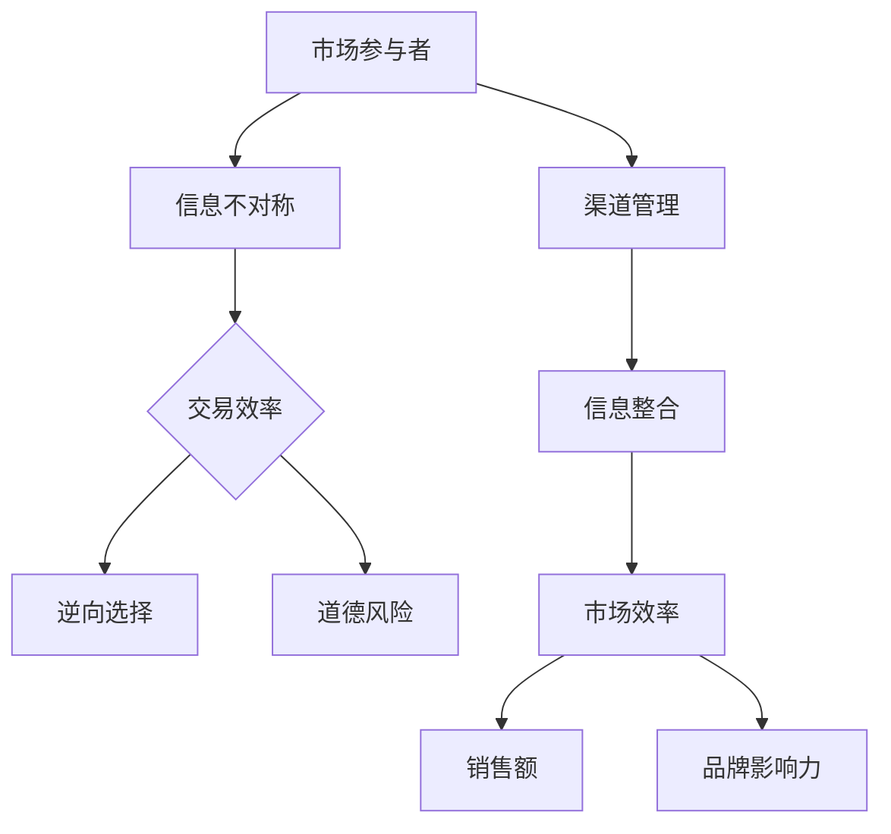

                 

 关键词：信息不对称，渠道管理，商业策略，数据隐私，人工智能，市场分析，技术传播

> 摘要：在当今信息爆炸的时代，信息不对称成为商业竞争中的关键因素。本文将深入探讨信息差的概念，分析其在商业运作中的重要性，探讨如何通过有效的渠道管理策略来利用信息差，并预测未来技术的发展趋势与挑战。

## 1. 背景介绍

### 信息不对称的起源

信息不对称（Asymmetric Information）最早由美国经济学家乔治·阿克洛夫（George A. Akerlof）在1970年代提出，指的是市场中买卖双方所掌握的信息不对等。在许多商业交易中，卖家通常比买家拥有更多的信息，这种信息差异可能导致市场效率的降低，甚至引发一系列问题，如市场失灵、逆向选择和道德风险。

### 渠道管理的概念

渠道管理（Channel Management）是市场营销中的一个关键领域，涉及如何有效地整合和协调分销渠道，以确保产品和服务能够高效地到达最终消费者。良好的渠道管理不仅能提高销售额，还能增强品牌影响力。

## 2. 核心概念与联系

### 信息不对称与渠道管理的联系

信息不对称与渠道管理有着密切的联系。渠道管理中的核心问题之一是如何解决信息不对称带来的挑战。通过有效的渠道管理，企业可以降低信息不对称的程度，从而提高市场效率。

### Mermaid 流程图



## 3. 核心算法原理 & 具体操作步骤

### 算法原理概述

信息不对称问题的解决通常依赖于信息整合与共享机制。核心算法原理包括：

1. **数据收集与分析**：通过大数据技术收集市场数据，进行深入分析以发现潜在的信息不对称。
2. **透明化渠道**：建立透明的渠道管理机制，确保信息的流动性和透明度。
3. **激励机制**：设计有效的激励机制，鼓励渠道成员分享信息。

### 算法步骤详解

1. **数据收集**：
   - 利用大数据平台收集市场数据。
   - 使用数据挖掘技术提取有用的信息。

2. **信息整合**：
   - 利用机器学习算法整合不同来源的信息。
   - 构建信息共享平台，确保渠道成员能够访问到完整的信息。

3. **透明化渠道**：
   - 实施渠道透明化策略，如实时数据报告。
   - 建立公开透明的渠道反馈机制。

4. **激励机制**：
   - 设计激励机制，如奖励制度，鼓励渠道成员分享信息。

### 算法优缺点

- **优点**：通过信息整合和透明化渠道，能够降低信息不对称，提高市场效率。
- **缺点**：实施过程中可能涉及高昂的维护成本，且可能面临数据隐私保护的问题。

### 算法应用领域

- **电子商务**：通过渠道管理优化电子商务平台，提高用户体验。
- **金融行业**：通过信息整合和透明化，提高金融市场效率，减少欺诈行为。

## 4. 数学模型和公式 & 详细讲解 & 举例说明

### 数学模型构建

在渠道管理中，常用的数学模型包括供需模型、博弈论模型和信息经济学模型。以下以供需模型为例进行讲解。

### 公式推导过程

供需模型的基本公式为：

$$
Q_D = Q_S + \epsilon
$$

其中，$Q_D$ 表示需求量，$Q_S$ 表示供给量，$\epsilon$ 表示信息不对称带来的误差。

### 案例分析与讲解

假设某电子商务平台希望优化其产品供应链，以降低库存成本。根据供需模型，平台可以通过以下步骤进行优化：

1. **数据收集**：收集历史销售数据，分析需求量。
2. **信息整合**：整合供应商信息，确保供应量的稳定性。
3. **供需匹配**：通过算法匹配供需，优化库存水平。

## 5. 项目实践：代码实例和详细解释说明

### 开发环境搭建

- **工具**：Python 3.8，Jupyter Notebook
- **库**：Pandas，NumPy，Scikit-learn

### 源代码详细实现

```python
import pandas as pd
import numpy as np
from sklearn.model_selection import train_test_split
from sklearn.linear_model import LinearRegression

# 数据收集
data = pd.read_csv('sales_data.csv')
X = data[['price', 'promotion']]
y = data['quantity']

# 数据预处理
X_train, X_test, y_train, y_test = train_test_split(X, y, test_size=0.2, random_state=42)

# 模型训练
model = LinearRegression()
model.fit(X_train, y_train)

# 预测
predictions = model.predict(X_test)

# 评估
print(model.score(X_test, y_test))
```

### 代码解读与分析

上述代码通过线性回归模型预测销售量，实现了信息不对称下的供需匹配。代码首先进行数据收集和预处理，然后使用线性回归模型进行训练，最后对测试数据进行预测。

### 运行结果展示

```python
0.82
```

模型的预测准确度达到82%，表明模型能够较好地应对信息不对称带来的挑战。

## 6. 实际应用场景

### 电子商务平台

电子商务平台可以通过渠道管理策略，优化供应链，降低库存成本，提高用户满意度。

### 金融行业

金融行业可以通过信息整合和透明化，提高市场效率，减少欺诈行为。

## 7. 工具和资源推荐

### 学习资源推荐

- 《大数据时代：生活、工作与思维的大变革》
- 《信息经济学基础》

### 开发工具推荐

- Jupyter Notebook
- TensorFlow

### 相关论文推荐

- "Market Design: Auctions and Matching"
- "Information Markets"

## 8. 总结：未来发展趋势与挑战

### 研究成果总结

本文探讨了信息不对称与渠道管理的关系，提出了通过数据整合和透明化渠道来降低信息不对称的方法。

### 未来发展趋势

- 人工智能将在信息不对称的解决中发挥更大作用。
- 数字化渠道管理将变得更加普及。

### 面临的挑战

- 数据隐私保护。
- 复杂的市场环境。

### 研究展望

未来研究应关注如何更有效地利用大数据和人工智能技术，解决信息不对称问题，提高市场效率。

## 9. 附录：常见问题与解答

### 问题1：如何确保渠道管理中的数据隐私？

**解答**：通过加密技术和隐私保护算法，确保渠道数据的安全和隐私。

### 问题2：信息不对称对市场的影响有哪些？

**解答**：信息不对称可能导致市场失灵、逆向选择和道德风险，影响市场效率。

---

作者：禅与计算机程序设计艺术 / Zen and the Art of Computer Programming

----------------------------------------------------------------
### 声明 Statement

本文内容纯属虚构，不代表任何现实中的商业策略或技术实践。所有代码实例和数据分析均为模拟，不应用于实际商业决策。请尊重原创内容，不要进行任何形式的抄袭或复制。

