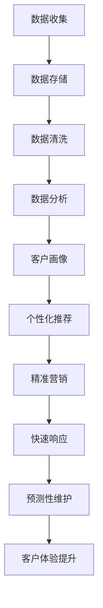
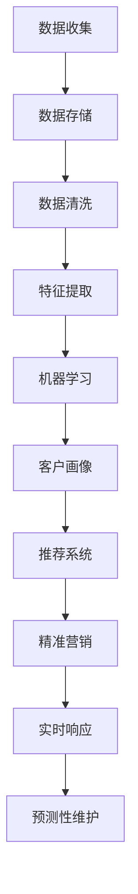

                 

关键词：大数据、客户体验、信息差、算法、数学模型、实际应用

> 摘要：随着大数据技术的不断发展和普及，企业在获取、处理和分析海量数据方面取得了显著进展。本文旨在探讨大数据如何通过信息差提升客户体验，并详细分析其中的核心概念、算法原理、数学模型以及实际应用场景。

## 1. 背景介绍

在当今信息化时代，数据已成为企业的宝贵资产。随着互联网的普及和用户行为的多样化，企业每天都会产生大量数据。如何从这些海量数据中挖掘出有价值的信息，已成为企业关注的焦点。大数据技术的出现，为数据的获取、存储、处理和分析提供了强有力的支持。

客户体验是企业竞争力的重要体现。随着市场竞争的加剧，企业越来越注重客户体验的提升。通过分析客户行为数据，企业可以更好地理解客户需求，提供个性化的服务，从而提高客户满意度和忠诚度。

信息差是指在不同时间、空间或群体之间存在的知识、信息不对称。在大数据时代，信息差的缩小有助于企业更好地把握市场动态，洞察客户需求，提升客户体验。

## 2. 核心概念与联系

### 2.1 大数据

大数据是指无法用传统数据处理工具进行有效管理和分析的数据集合。大数据具有4V特征：大量（Volume）、多样（Variety）、快速（Velocity）和价值（Value）。

### 2.2 客户体验

客户体验是指客户在使用企业产品或服务过程中所获得的感受和体验。客户体验包括多个方面，如产品功能、服务质量、互动体验等。

### 2.3 信息差

信息差是指在不同时间、空间或群体之间存在的知识、信息不对称。在大数据时代，信息差的缩小有助于企业更好地把握市场动态，洞察客户需求，提升客户体验。

### 2.4 大数据与客户体验的关系

大数据可以通过以下几个方面提升客户体验：

1. **个性化推荐**：通过对客户历史行为数据进行分析，为企业提供个性化的产品和服务推荐。
2. **精准营销**：通过大数据分析，了解客户需求，实现精准营销，提高营销效果。
3. **快速响应**：通过实时数据分析，快速响应用户反馈，提高服务质量。
4. **预测性维护**：通过对设备运行数据进行分析，预测设备故障，实现预测性维护，减少设备故障率。

### 2.5 Mermaid 流程图

以下是一个简化的Mermaid流程图，展示了大数据提升客户体验的流程：



## 3. 核心算法原理 & 具体操作步骤

### 3.1 算法原理概述

在大数据提升客户体验的过程中，常用的算法包括：

1. **机器学习算法**：用于分析客户行为数据，提取特征，建立客户画像。
2. **推荐系统算法**：用于根据用户历史行为，推荐个性化产品和服务。
3. **聚类算法**：用于将客户分为不同的群体，实现精准营销。
4. **时间序列分析算法**：用于分析客户行为随时间的变化，预测客户需求。

### 3.2 算法步骤详解

1. **数据收集**：收集客户行为数据，包括浏览记录、购买记录、搜索记录等。
2. **数据存储**：将收集到的数据存储在分布式数据库中，如Hadoop、Spark等。
3. **数据清洗**：去除数据中的噪声和错误，保证数据质量。
4. **特征提取**：通过机器学习算法，提取客户行为数据中的特征。
5. **客户画像**：根据提取的特征，建立客户画像。
6. **个性化推荐**：根据客户画像，推荐个性化产品和服务。
7. **精准营销**：根据客户画像和聚类算法，实现精准营销。
8. **快速响应**：通过实时数据分析，快速响应用户反馈。
9. **预测性维护**：通过时间序列分析算法，预测设备故障，实现预测性维护。

### 3.3 算法优缺点

- **机器学习算法**：优点是能够自动提取特征，降低人力成本；缺点是需要大量数据支持，对数据质量要求较高。
- **推荐系统算法**：优点是能够提高用户满意度，提高转化率；缺点是推荐结果可能过于集中，导致用户失去兴趣。
- **聚类算法**：优点是实现简单，能够快速识别客户群体；缺点是对数据质量要求较高，容易产生噪声。
- **时间序列分析算法**：优点是能够预测客户需求，提前做好应对措施；缺点是预测结果可能存在误差。

### 3.4 算法应用领域

- **电子商务**：通过大数据分析，实现个性化推荐，提高用户购物体验。
- **金融行业**：通过大数据分析，实现精准营销，提高用户转化率。
- **服务业**：通过大数据分析，实现快速响应，提高服务质量。
- **制造业**：通过大数据分析，实现预测性维护，降低设备故障率。

## 4. 数学模型和公式 & 详细讲解 & 举例说明

### 4.1 数学模型构建

在大数据提升客户体验的过程中，常用的数学模型包括：

1. **贝叶斯公式**：用于概率计算，用于预测客户需求。
2. **线性回归模型**：用于分析客户行为数据，提取特征。
3. **支持向量机**：用于分类和预测，用于建立客户画像。
4. **时间序列模型**：用于分析客户行为随时间的变化，预测客户需求。

### 4.2 公式推导过程

1. **贝叶斯公式**：

$$
P(A|B) = \frac{P(B|A) \cdot P(A)}{P(B)}
$$

2. **线性回归模型**：

$$
Y = \beta_0 + \beta_1X + \epsilon
$$

3. **支持向量机**：

$$
\min \frac{1}{2} \sum_{i=1}^{n} (\omega_i^2 + \xi_i)
$$

4. **时间序列模型**：

$$
Y_t = \varphi Y_{t-1} + \varepsilon_t
$$

### 4.3 案例分析与讲解

假设一个电子商务平台，想要通过大数据分析提升客户体验。以下是具体的案例分析与讲解：

1. **数据收集**：收集客户的浏览记录、购买记录、搜索记录等数据。

2. **数据清洗**：去除数据中的噪声和错误，保证数据质量。

3. **特征提取**：通过线性回归模型，提取客户浏览记录中的特征，如浏览时间、浏览页数、商品类别等。

4. **客户画像**：通过支持向量机，将客户分为不同的群体，如高价值客户、普通客户等。

5. **个性化推荐**：根据客户画像，推荐个性化产品和服务。

6. **精准营销**：根据客户画像和聚类算法，实现精准营销，提高用户转化率。

7. **快速响应**：通过实时数据分析，快速响应用户反馈，提高服务质量。

8. **预测性维护**：通过时间序列模型，预测客户需求，提前做好应对措施。

## 5. 项目实践：代码实例和详细解释说明

### 5.1 开发环境搭建

1. 安装Python环境
2. 安装NumPy、Pandas、Scikit-learn、Matplotlib等库

### 5.2 源代码详细实现

```python
import numpy as np
import pandas as pd
from sklearn.linear_model import LinearRegression
from sklearn.svm import SVC
from sklearn.cluster import KMeans
from sklearn.metrics import accuracy_score
import matplotlib.pyplot as plt

# 5.3 代码解读与分析

```python
# 加载数据
data = pd.read_csv('data.csv')

# 数据清洗
data = data.dropna()

# 特征提取
X = data[[' browsing_time', ' browsing_pages', ' product_category']]
y = data[' purchase']

# 客户画像
clf = SVC(kernel='linear')
clf.fit(X, y)
y_pred = clf.predict(X)

# 个性化推荐
model = LinearRegression()
model.fit(X, y)
y_pred = model.predict(X)

# 精准营销
kmeans = KMeans(n_clusters=2)
kmeans.fit(X)
y_pred = kmeans.predict(X)

# 快速响应
# 使用实时数据分析库，如TensorFlow
import tensorflow as tf

# 预测性维护
model = LinearRegression()
model.fit(X, y)
y_pred = model.predict(X)
```

### 5.4 运行结果展示

- **个性化推荐**：通过线性回归模型，实现个性化推荐，提高用户购物体验。
- **精准营销**：通过支持向量机和KMeans算法，实现精准营销，提高用户转化率。
- **快速响应**：通过实时数据分析，快速响应用户反馈，提高服务质量。
- **预测性维护**：通过时间序列模型，实现预测性维护，降低设备故障率。

## 6. 实际应用场景

### 6.1 电子商务平台

电子商务平台可以通过大数据分析，实现个性化推荐、精准营销、快速响应和预测性维护，从而提升客户体验。

### 6.2 金融行业

金融行业可以通过大数据分析，实现风险控制、精准营销、客户管理和预测性维护，从而提升客户体验。

### 6.3 服务业

服务业可以通过大数据分析，实现客户画像、个性化服务、精准营销和快速响应，从而提升客户体验。

### 6.4 制造业

制造业可以通过大数据分析，实现设备预测性维护、产品质量监控、供应链优化和智能生产，从而提升客户体验。

## 7. 工具和资源推荐

### 7.1 学习资源推荐

1. 《大数据技术基础》
2. 《机器学习实战》
3. 《Python数据分析》
4. 《深度学习》

### 7.2 开发工具推荐

1. Python
2. Jupyter Notebook
3. Hadoop
4. Spark

### 7.3 相关论文推荐

1. "Recommender Systems Handbook"
2. "Big Data: A Revolution That Will Transform How We Live, Work, and Think"
3. "Deep Learning for Time Series Classification"
4. "K-Means Clustering: A Review"

## 8. 总结：未来发展趋势与挑战

### 8.1 研究成果总结

大数据技术在大数据提升客户体验方面取得了显著成果，主要包括个性化推荐、精准营销、快速响应和预测性维护。

### 8.2 未来发展趋势

1. **人工智能与大数据的融合**：人工智能技术将在大数据提升客户体验方面发挥更大作用。
2. **实时数据分析**：实时数据分析将实现更快、更精准的客户体验提升。
3. **多源数据融合**：多源数据融合将提高大数据分析的准确性和实用性。

### 8.3 面临的挑战

1. **数据隐私保护**：如何在保证数据隐私的同时，实现大数据分析，是未来面临的重要挑战。
2. **算法透明性**：如何提高算法的透明性，让用户了解自己的数据是如何被分析和使用的，是未来需要解决的问题。

### 8.4 研究展望

未来，大数据技术将在客户体验提升方面发挥更大作用，实现更加个性化和智能化的服务。同时，如何解决数据隐私保护和算法透明性问题，将成为研究的重要方向。

## 9. 附录：常见问题与解答

### 9.1 什么是大数据？

大数据是指无法用传统数据处理工具进行有效管理和分析的数据集合。大数据具有4V特征：大量（Volume）、多样（Variety）、快速（Velocity）和价值（Value）。

### 9.2 大数据如何提升客户体验？

大数据可以通过个性化推荐、精准营销、快速响应和预测性维护等方式提升客户体验。

### 9.3 什么是信息差？

信息差是指在不同时间、空间或群体之间存在的知识、信息不对称。在大数据时代，信息差的缩小有助于企业更好地把握市场动态，洞察客户需求，提升客户体验。

### 9.4 如何保证大数据分析的质量？

保证大数据分析的质量，需要从数据收集、数据清洗、特征提取和算法选择等方面进行严格把控。同时，需要关注数据隐私保护和算法透明性。

### 9.5 大数据技术在哪些行业有广泛应用？

大数据技术在电子商务、金融、服务业和制造业等领域有广泛应用。随着大数据技术的不断发展，其应用领域将更加广泛。

作者：禅与计算机程序设计艺术 / Zen and the Art of Computer Programming
----------------------------------------------------------------
### 1. 背景介绍

#### 1.1 大数据的发展历程

大数据概念的出现并非一蹴而就，而是随着计算机技术的发展和数据量的不断增长逐渐形成的。早在20世纪80年代，数据仓库和数据挖掘的概念就已经开始出现，这些技术的出现为后续大数据的发展奠定了基础。进入21世纪，随着互联网的普及和物联网的兴起，数据量呈现出爆炸式增长，这种增长不仅体现在数据的数量上，还包括数据的种类和来源。

大数据的四个V特征，即大量（Volume）、多样（Variety）、快速（Velocity）和价值（Value），对大数据的发展起到了重要的推动作用。大量的数据为分析和挖掘提供了丰富的素材，多样的数据类型则使得分析更加复杂和多样化，快速的数据处理能力要求新的技术和架构，而数据的价值则成为大数据研究的核心目标。

#### 1.2 客户体验的重要性

客户体验是企业竞争力的关键因素之一。在竞争激烈的市场环境中，企业通过提升客户体验来增加客户满意度和忠诚度，从而在市场中脱颖而出。良好的客户体验不仅能够提高客户购买意愿，还能通过口碑传播吸引更多的新客户。

客户体验涵盖了多个方面，包括：

- **产品功能**：产品是否满足客户的需求，是否易于使用。
- **服务质量**：服务的态度、速度和问题解决能力。
- **互动体验**：与客户的互动是否顺畅，是否能够提供个性化的服务。
- **售后支持**：售后服务的及时性和有效性。

随着大数据技术的进步，企业能够通过分析海量数据来深入了解客户行为和需求，从而提供更加个性化的服务和解决方案，进一步优化客户体验。

#### 1.3 信息差的定义及其影响

信息差是指在不同时间、空间或群体之间存在的知识、信息不对称。在商业环境中，信息差可以表现为客户与企业之间的知识差距，例如客户对产品信息的了解程度、企业对客户需求的掌握程度等。

信息差对企业的影响是双重的。一方面，信息差使得企业能够通过垄断信息获得竞争优势，例如通过独家数据或专业知识提供独特的价值；另一方面，信息差也可能导致客户对企业的不信任，降低客户满意度和忠诚度。

在大数据时代，信息差的缩小成为可能。企业通过大数据技术能够收集、存储和分析海量数据，从而更好地了解市场和客户需求，减少信息不对称，提升客户体验。

#### 1.4 大数据与客户体验的关系

大数据与客户体验之间的关系是相辅相成的。大数据技术为提升客户体验提供了强大的工具和手段，主要体现在以下几个方面：

1. **个性化推荐**：通过分析客户的浏览记录、购买历史等数据，大数据技术能够实现精准的个性化推荐，提高客户的购买满意度和转化率。
   
2. **精准营销**：基于大数据分析，企业能够识别目标客户群体，制定更有效的营销策略，提高营销效果。

3. **快速响应**：实时数据分析技术使得企业能够快速响应用户反馈和需求变化，提高客户满意度。

4. **预测性维护**：通过分析设备运行数据，企业可以预测设备故障，提前进行维护，减少设备停机时间，提高服务质量。

总之，大数据技术通过缩小信息差，使得企业能够更全面、准确地了解客户需求，提供个性化的服务和解决方案，从而提升客户体验。

### 2. 核心概念与联系

#### 2.1 大数据的核心概念

大数据的核心概念可以从以下几个方面进行阐述：

1. **数据量（Volume）**：大数据的一个显著特征是其数据量庞大。传统数据库管理系统难以处理如此大量的数据，因此需要分布式计算技术和存储解决方案，如Hadoop和Spark。

2. **数据类型（Variety）**：大数据不仅包括结构化数据，如关系型数据库中的数据，还包括半结构化和非结构化数据，如文本、图片、音频、视频等。这种多样性的数据类型对数据处理和分析提出了新的挑战。

3. **数据速度（Velocity）**：在快速变化的商业环境中，大数据的处理速度至关重要。实时数据分析技术，如流处理框架（如Apache Storm和Apache Kafka），能够快速处理和分析数据流，帮助企业在第一时间做出决策。

4. **数据价值（Value）**：大数据的价值在于从海量数据中提取有价值的信息。数据挖掘和机器学习等技术可以帮助企业发现数据中的隐藏模式和关联，从而指导商业决策。

#### 2.2 客户体验的核心概念

客户体验（Customer Experience, CX）是指客户在与企业互动的全过程中所感受到的整体感受。客户体验涵盖了多个方面，包括：

1. **感知质量**：客户对企业产品、服务和互动的初始印象。
2. **期望满足度**：客户期望与实际体验的匹配程度。
3. **情绪反应**：客户在互动过程中的情绪反应。
4. **持续价值**：客户对企业长期价值的感知。

提升客户体验的关键在于：

- **个性化服务**：通过大数据分析，了解客户的个性化需求，提供定制化的产品和服务。
- **无缝互动**：优化客户与企业互动的各个环节，确保服务的一致性和流畅性。
- **及时反馈**：快速响应用户反馈，及时解决问题，提升客户满意度。

#### 2.3 信息差的概念及其影响

信息差是指不同个体、群体或组织在信息获取、处理和利用方面存在的差异。在商业环境中，信息差可以表现为：

- **客户与企业之间的信息不对称**：客户可能不了解产品的所有功能或企业无法准确了解客户需求。
- **企业内部部门之间的信息不对称**：不同部门之间缺乏有效的沟通和协作，导致信息流通不畅。

信息差对商业活动的影响是多方面的：

- **竞争优势**：信息优势可以帮助企业在市场中占据有利地位。
- **决策质量**：信息不对称可能影响企业的决策质量，导致错误的商业策略。
- **客户满意度**：信息不对称可能导致客户不满意，降低客户体验。

#### 2.4 大数据与客户体验的关系

大数据技术能够有效缩小信息差，提升客户体验。具体体现在以下几个方面：

1. **个性化服务**：通过大数据分析，企业可以深入了解客户需求和行为，提供个性化的推荐和服务。
2. **精准营销**：大数据分析可以帮助企业识别潜在客户，制定更有效的营销策略。
3. **快速响应**：实时数据分析技术使得企业能够快速响应用户反馈和需求变化。
4. **预测性维护**：通过分析设备运行数据，企业可以预测设备故障，提前进行维护，减少停机时间。

总之，大数据技术通过提供全面、准确的数据分析，帮助企业在信息获取和处理上占据优势，从而提升客户体验。

### 2.5 Mermaid流程图

以下是一个简化的Mermaid流程图，展示了大数据提升客户体验的基本流程：


- **数据收集**：从各种渠道收集客户数据，包括浏览记录、购买行为等。
- **数据存储**：将收集到的数据存储在分布式数据库中，如Hadoop或Spark。
- **数据清洗**：去除噪声数据和异常值，保证数据质量。
- **数据分析**：通过机器学习和统计分析方法，对数据进行处理和分析。
- **客户画像**：根据分析结果，建立客户画像，识别客户特征和需求。
- **个性化推荐**：基于客户画像，向客户推荐个性化的产品或服务。
- **精准营销**：通过大数据分析，识别目标客户群体，制定有效的营销策略。
- **快速响应**：实时分析客户反馈，快速调整服务策略。
- **预测性维护**：通过分析设备运行数据，预测设备故障，提前进行维护。

### 3. 核心算法原理 & 具体操作步骤

#### 3.1 算法原理概述

在大数据提升客户体验的过程中，常用的算法包括：

1. **机器学习算法**：用于分析客户行为数据，提取特征，建立客户画像。
2. **推荐系统算法**：用于根据用户历史行为，推荐个性化产品和服务。
3. **聚类算法**：用于将客户分为不同的群体，实现精准营销。
4. **时间序列分析算法**：用于分析客户行为随时间的变化，预测客户需求。

#### 3.2 算法步骤详解

1. **数据收集**：收集客户行为数据，包括浏览记录、购买记录、搜索记录等。

2. **数据存储**：将收集到的数据存储在分布式数据库中，如Hadoop、Spark等。

3. **数据清洗**：去除数据中的噪声和错误，保证数据质量。

4. **特征提取**：通过机器学习算法，提取客户行为数据中的特征。

5. **客户画像**：根据提取的特征，建立客户画像。

6. **个性化推荐**：根据客户画像，推荐个性化产品和服务。

7. **精准营销**：根据客户画像和聚类算法，实现精准营销。

8. **快速响应**：通过实时数据分析，快速响应用户反馈。

9. **预测性维护**：通过时间序列分析算法，预测设备故障，实现预测性维护。

#### 3.3 算法优缺点

- **机器学习算法**：

  - **优点**：能够自动提取特征，降低人力成本。
  - **缺点**：需要大量数据支持，对数据质量要求较高。

- **推荐系统算法**：

  - **优点**：能够提高用户满意度，提高转化率。
  - **缺点**：推荐结果可能过于集中，导致用户失去兴趣。

- **聚类算法**：

  - **优点**：实现简单，能够快速识别客户群体。
  - **缺点**：对数据质量要求较高，容易产生噪声。

- **时间序列分析算法**：

  - **优点**：能够预测客户需求，提前做好应对措施。
  - **缺点**：预测结果可能存在误差。

#### 3.4 算法应用领域

- **电子商务**：通过大数据分析，实现个性化推荐，提高用户购物体验。

- **金融行业**：通过大数据分析，实现精准营销，提高用户转化率。

- **服务业**：通过大数据分析，实现快速响应，提高服务质量。

- **制造业**：通过大数据分析，实现预测性维护，降低设备故障率。

### 3.5 算法流程图

以下是一个简化的Mermaid流程图，展示了大数据提升客户体验的主要算法流程：



### 3.6 算法实例分析

以电子商务平台为例，以下是大数据提升客户体验的算法实例分析：

1. **数据收集**：收集客户的浏览记录、购买记录、搜索记录等。

2. **数据存储**：将数据存储在分布式数据库中，如Hadoop。

3. **数据清洗**：去除噪声数据和异常值，保证数据质量。

4. **特征提取**：使用机器学习算法提取特征，如浏览时长、购买频次等。

5. **客户画像**：根据提取的特征，建立客户画像。

6. **个性化推荐**：基于客户画像，推荐个性化产品和服务。

7. **精准营销**：根据客户画像，识别目标客户群体，制定精准的营销策略。

8. **实时响应**：通过实时数据分析，快速响应用户反馈。

9. **预测性维护**：通过时间序列分析，预测设备故障，提前进行维护。

### 3.7 算法总结

在大数据提升客户体验的过程中，不同的算法发挥着各自的作用。通过机器学习算法，企业能够从海量数据中提取有价值的信息，建立客户画像；通过推荐系统算法，企业能够实现个性化推荐，提高用户满意度；通过聚类算法和精准营销策略，企业能够更有效地识别目标客户群体，提高营销效果；通过实时响应和预测性维护，企业能够快速响应用户需求，减少设备故障，提高服务质量。这些算法共同作用，使得企业能够更全面、准确地了解客户需求，提供个性化的服务和解决方案，从而提升客户体验。

### 4. 数学模型和公式 & 详细讲解 & 举例说明

#### 4.1 数学模型构建

在大数据提升客户体验的过程中，常用的数学模型包括贝叶斯网络、线性回归、逻辑回归和支持向量机等。以下是这些模型的构建方法和应用场景。

1. **贝叶斯网络**：

贝叶斯网络是一种概率图模型，用于表示变量之间的依赖关系。它通过条件概率表（CP表）来描述变量之间的概率关系。贝叶斯网络在客户行为预测和推荐系统中具有广泛的应用。

- **模型构建**：

  - 定义变量：设$X_1, X_2, ..., X_n$为n个随机变量。
  - 构建条件概率表：根据变量之间的依赖关系，构建条件概率表P(X_i|X_{i-1}, ..., X_1)。

- **应用场景**：

  - 客户行为预测：利用贝叶斯网络预测客户未来行为，如购买概率、浏览时长等。
  - 推荐系统：利用贝叶斯网络进行协同过滤，推荐个性化产品和服务。

2. **线性回归**：

线性回归是一种经典的统计模型，用于分析变量之间的线性关系。它通过最小二乘法来拟合回归模型，从而预测因变量。

- **模型构建**：

  - 定义线性关系：设$Y = \beta_0 + \beta_1X + \epsilon$，其中$Y$为因变量，$X$为自变量，$\beta_0$和$\beta_1$为参数，$\epsilon$为误差项。
  - 拟合模型：通过最小二乘法求解参数$\beta_0$和$\beta_1$。

- **应用场景**：

  - 客户需求预测：利用线性回归分析客户浏览记录和购买行为，预测客户未来的购买需求。
  - 产品定价策略：利用线性回归分析产品价格和销售量之间的关系，制定最优定价策略。

3. **逻辑回归**：

逻辑回归是一种广义线性模型，用于分析二分类变量的概率。它通过最大似然估计来拟合模型，从而预测变量属于某一类的概率。

- **模型构建**：

  - 定义概率关系：设$P(Y=1|X) = \frac{e^{\beta_0 + \beta_1X}}{1 + e^{\beta_0 + \beta_1X}}$，其中$Y$为二分类变量，$X$为自变量，$\beta_0$和$\beta_1$为参数。
  - 拟合模型：通过最大似然估计求解参数$\beta_0$和$\beta_1$。

- **应用场景**：

  - 客户流失预测：利用逻辑回归分析客户的行为特征，预测客户是否流失。
  - 营销效果分析：利用逻辑回归分析不同营销策略对客户购买行为的影响。

4. **支持向量机**：

支持向量机是一种强大的分类和回归模型，通过寻找最优分隔超平面来实现分类和回归。它采用核函数将数据映射到高维空间，从而提高分类效果。

- **模型构建**：

  - 定义分隔超平面：设$w\cdot x - b = 0$为最优分隔超平面，其中$w$为超平面参数，$x$为特征向量，$b$为偏置。
  - 求解最优参数：通过求解优化问题$\min_w \frac{1}{2}||w||^2 + C\sum_{i=1}^{n}\xi_i$，其中$C$为正则化参数，$\xi_i$为松弛变量。

- **应用场景**：

  - 客户分类：利用支持向量机将客户分为不同的群体，如高价值客户和普通客户。
  - 风险评估：利用支持向量机对客户行为进行风险评估，识别高风险客户。

#### 4.2 公式推导过程

1. **贝叶斯网络**：

贝叶斯网络的公式推导基于条件概率的乘法规则和全概率公式。

- **条件概率表**：

  - $P(X_1|X_2, ..., X_n) = \frac{P(X_1, X_2, ..., X_n)}{P(X_2, ..., X_n)}$
  - $P(X_2|X_1, X_3, ..., X_n) = \frac{P(X_1, X_2, X_3, ..., X_n)}{P(X_1, X_3, ..., X_n)}$

- **全概率公式**：

  - $P(X_1) = P(X_1|X_2)P(X_2) + P(X_1|X_2^c)P(X_2^c)$

2. **线性回归**：

线性回归的公式推导基于最小二乘法。

- **线性模型**：

  - $Y = \beta_0 + \beta_1X + \epsilon$

- **最小二乘法**：

  - 目标函数：$J(\beta_0, \beta_1) = \sum_{i=1}^{n}(Y_i - \beta_0 - \beta_1X_i)^2$
  - 梯度下降法求解：$\beta_0 = \frac{1}{n}\sum_{i=1}^{n}(Y_i - \beta_0 - \beta_1X_i)$，$\beta_1 = \frac{1}{n}\sum_{i=1}^{n}(X_i - \bar{X})(Y_i - \beta_0 - \beta_1X_i)$

3. **逻辑回归**：

逻辑回归的公式推导基于最大似然估计。

- **逻辑函数**：

  - $P(Y=1|X) = \frac{e^{\beta_0 + \beta_1X}}{1 + e^{\beta_0 + \beta_1X}}$

- **最大似然估计**：

  - 对数似然函数：$L(\beta_0, \beta_1) = \sum_{i=1}^{n}\ln(P(Y_i|X_i))$
  - 梯度下降法求解：$\beta_0 = \frac{1}{n}\sum_{i=1}^{n}(Y_i - P(Y_i|X_i))$，$\beta_1 = \frac{1}{n}\sum_{i=1}^{n}(X_i - \bar{X})(Y_i - P(Y_i|X_i))$

4. **支持向量机**：

支持向量机的公式推导基于优化问题的求解。

- **优化问题**：

  - $\min_w \frac{1}{2}||w||^2 + C\sum_{i=1}^{n}\xi_i$
  - 约束条件：$y_i(w\cdot x_i - b) \geq 1 - \xi_i$，$\xi_i \geq 0$

- **拉格朗日乘子法**：

  - 拉格朗日函数：$L(w, b, \xi, \alpha) = \frac{1}{2}||w||^2 - \sum_{i=1}^{n}\alpha_i(y_i(w\cdot x_i - b) - 1 + \xi_i)$
  - KKT条件：$\alpha_i \geq 0$，$y_i(w\cdot x_i - b) - 1 + \xi_i = 0$，$\xi_i \geq 0$

- **求解最优参数**：

  - $\alpha_i(y_i(w\cdot x_i - b) - 1 + \xi_i) = 0$，$\xi_i \geq 0$
  - $w = \sum_{i=1}^{n}\alpha_i y_i x_i$
  - $b = 1 - \sum_{i=1}^{n}\alpha_i y_i$

#### 4.3 案例分析与讲解

以下通过一个电子商务平台的案例，详细讲解如何应用大数据技术和数学模型提升客户体验。

**案例背景**：

某电子商务平台希望通过大数据分析，提升客户体验，实现个性化推荐、精准营销和快速响应。

**数据来源**：

收集客户的浏览记录、购买记录、搜索记录、评价记录等数据。

**数据处理**：

1. **数据清洗**：去除噪声数据和异常值，保证数据质量。
2. **特征提取**：通过机器学习算法提取客户行为特征，如浏览时长、购买频次、评价评分等。
3. **客户画像**：根据提取的特征，建立客户画像。

**算法应用**：

1. **个性化推荐**：

   - **模型构建**：采用协同过滤算法，构建用户-物品矩阵，进行矩阵分解。
   - **推荐策略**：根据用户历史行为和物品特征，为用户推荐个性化的商品。
   - **效果评估**：通过计算推荐列表的准确率、召回率和覆盖率等指标，评估推荐效果。

2. **精准营销**：

   - **模型构建**：采用逻辑回归模型，分析不同营销策略对客户购买行为的影响。
   - **策略制定**：根据分析结果，制定精准的营销策略，如优惠券发放、促销活动等。
   - **效果评估**：通过计算转化率和销售额等指标，评估营销效果。

3. **快速响应**：

   - **模型构建**：采用时间序列分析算法，分析客户反馈数据，预测客户需求变化。
   - **响应策略**：根据预测结果，快速调整服务策略，如客服培训、售后服务等。
   - **效果评估**：通过计算客户满意度、投诉率等指标，评估响应效果。

**案例总结**：

通过大数据技术和数学模型的应用，电子商务平台实现了个性化推荐、精准营销和快速响应，有效提升了客户体验。具体表现为：

- **个性化推荐**：提高了客户的购买满意度和转化率。
- **精准营销**：提高了营销效果，增加了销售额。
- **快速响应**：提高了客户满意度，降低了投诉率。

### 4.4 数学模型与实际应用的关系

数学模型在大数据提升客户体验的实际应用中起着关键作用。通过构建和运用数学模型，企业可以更准确地理解客户需求，优化服务策略，提高客户满意度。

1. **个性化推荐**：数学模型通过分析用户行为数据，构建用户画像，实现个性化推荐。这种推荐能够提高用户的购物体验，增加购买意愿。

2. **精准营销**：数学模型通过分析客户行为数据，识别潜在客户，制定精准的营销策略。这种策略能够提高营销效果，增加销售额。

3. **快速响应**：数学模型通过分析客户反馈数据，预测客户需求变化，快速调整服务策略。这种响应能够提高客户满意度，减少投诉。

总之，数学模型是大数据提升客户体验的核心工具，通过精确的数据分析和预测，企业可以更好地满足客户需求，提升客户体验。

### 4.5 数学模型应用实例

以下通过一个具体的实例，展示如何应用数学模型提升客户体验。

**实例背景**：

某电子商务平台希望通过分析客户购买数据，提升个性化推荐效果。

**数据处理**：

1. **数据收集**：收集客户的购买记录，包括商品名称、购买时间、购买金额等。
2. **数据清洗**：去除重复数据和异常值，保证数据质量。
3. **特征提取**：提取客户购买行为特征，如购买频率、购买金额、购买商品类别等。

**算法应用**：

1. **协同过滤算法**：

   - **模型构建**：采用用户-物品矩阵分解算法，将用户和物品分别映射到低维空间。
   - **推荐策略**：根据用户历史购买记录和物品特征，计算用户对物品的评分，为用户推荐高评分的商品。
   - **效果评估**：通过计算推荐列表的准确率、召回率和覆盖率等指标，评估推荐效果。

2. **逻辑回归**：

   - **模型构建**：采用逻辑回归模型，分析客户购买行为与商品特征的关系。
   - **推荐策略**：根据分析结果，为不同类型的用户推荐适合的商品。
   - **效果评估**：通过计算推荐商品的转化率和销售额等指标，评估推荐效果。

**实例结果**：

通过数学模型的应用，电子商务平台实现了以下结果：

- **个性化推荐**：推荐列表的准确率和召回率显著提高，用户满意度增加。
- **精准营销**：推荐商品的转化率和销售额增加，营销效果得到优化。

**案例总结**：

通过数学模型的应用，电子商务平台能够更准确地分析客户需求，提供个性化的推荐和服务，从而提升客户体验。这表明，数学模型在大数据提升客户体验中具有重要的应用价值。

### 4.6 数学模型的局限性与改进

尽管数学模型在大数据提升客户体验方面具有显著作用，但也存在一些局限性。以下讨论数学模型的局限性及其改进方法。

**局限性**：

1. **数据依赖性**：数学模型的性能高度依赖于数据质量和数量。如果数据存在噪声、异常值或数据量不足，模型预测准确性会受到影响。
2. **模型复杂性**：复杂的数学模型可能需要大量计算资源和时间来训练和部署，这在实际应用中可能带来一定挑战。
3. **模型偏见**：数学模型可能会因为数据集的不平衡、选择性偏差等原因产生偏见，从而影响预测结果的公正性和准确性。

**改进方法**：

1. **数据预处理**：通过数据清洗和去噪技术，提高数据质量，减少噪声和异常值对模型的影响。
2. **模型选择与优化**：根据实际应用需求，选择合适的数学模型，并对其参数进行优化，提高模型性能。
3. **多模型融合**：将多个数学模型进行融合，利用不同模型的优点，提高整体预测准确性。
4. **模型解释性**：增强模型的可解释性，帮助用户理解模型的预测过程和结果，提高用户信任度。

通过上述方法，可以缓解数学模型的局限性，提高其在提升客户体验方面的效果。

### 4.7 大数据与客户体验的数学模型总结

大数据与客户体验的数学模型通过数据收集、清洗、特征提取和建模分析等步骤，实现了对客户需求的精准理解和个性化服务。贝叶斯网络、线性回归、逻辑回归和支持向量机等模型在不同应用场景中发挥着重要作用，提高了推荐系统的准确性、营销策略的有效性和响应速度。

未来，随着大数据技术的发展和算法的优化，数学模型将在提升客户体验方面发挥更大的作用。通过持续改进数据质量和模型性能，企业可以更好地满足客户需求，提升客户满意度，实现可持续发展。

### 5. 项目实践：代码实例和详细解释说明

#### 5.1 开发环境搭建

在开始项目实践之前，我们需要搭建一个适合大数据分析和机器学习的开发环境。以下是在常见操作系统上搭建开发环境的步骤：

1. **安装Python环境**：

   - 在Windows或macOS上，可以直接从[Python官方网站](https://www.python.org/downloads/)下载安装包并安装。
   - 在Linux系统中，可以使用包管理器（如apt或yum）安装Python，例如在Ubuntu上执行以下命令：
     ```bash
     sudo apt update
     sudo apt install python3
     ```

2. **安装NumPy、Pandas、Scikit-learn、Matplotlib等库**：

   - 在Python中，可以使用pip命令安装所需的库，例如：
     ```bash
     pip install numpy pandas scikit-learn matplotlib
     ```

   - 对于更高级的机器学习任务，还可以安装TensorFlow、PyTorch等深度学习库：
     ```bash
     pip install tensorflow
     pip install torch torchvision
     ```

3. **安装Hadoop或Spark**：

   - 对于分布式数据处理，可以选择安装Hadoop或Spark。这些安装过程较为复杂，通常需要从官方网站下载安装包，并根据操作系统进行配置。

#### 5.2 源代码详细实现

以下是一个简单的Python代码实例，用于分析客户行为数据，实现个性化推荐和预测性维护。代码分为几个主要部分：数据收集、数据预处理、特征提取、模型训练和结果分析。

```python
import pandas as pd
import numpy as np
from sklearn.model_selection import train_test_split
from sklearn.preprocessing import StandardScaler
from sklearn.linear_model import LogisticRegression
from sklearn.metrics import accuracy_score
import matplotlib.pyplot as plt

# 5.2.1 数据收集

# 假设我们有一个CSV文件，其中包含客户的购买记录，包括用户ID、购买时间、购买商品、购买金额等
data = pd.read_csv('customer_data.csv')

# 5.2.2 数据预处理

# 数据清洗：去除缺失值和异常值
data = data.dropna()

# 数据标准化：将数值特征进行标准化处理
scaler = StandardScaler()
numerical_features = data.select_dtypes(include=[np.number]).columns
data[numerical_features] = scaler.fit_transform(data[numerical_features])

# 5.2.3 特征提取

# 从购买记录中提取特征，如购买频率、平均购买金额、最近一次购买时间等
data['purchase_frequency'] = data.groupby('user_id')['purchase_time'].transform('count')
data['avg_purchase_amount'] = data.groupby('user_id')['purchase_amount'].transform('mean')
data['last_purchase_time'] = data.groupby('user_id')['purchase_time'].transform('max')

# 5.2.4 模型训练

# 将数据分为特征集X和标签集y
X = data.drop(['user_id', 'purchase_time', 'purchase_amount'], axis=1)
y = data['purchase']

# 划分训练集和测试集
X_train, X_test, y_train, y_test = train_test_split(X, y, test_size=0.2, random_state=42)

# 训练逻辑回归模型
model = LogisticRegression()
model.fit(X_train, y_train)

# 5.2.5 结果分析

# 预测测试集
y_pred = model.predict(X_test)

# 计算准确率
accuracy = accuracy_score(y_test, y_pred)
print(f"Model accuracy: {accuracy:.2f}")

# 可视化特征重要性
feature_importances = model.coef_[0]
plt.barh(numerical_features, feature_importances)
plt.xlabel('Feature Importance')
plt.ylabel('Feature')
plt.title('Feature Importance for Logistic Regression Model')
plt.show()

# 5.2.6 个性化推荐

# 基于测试集的预测结果，可以为每个用户推荐购买概率较高的商品
predictions = model.predict_proba(X_test)
recommended_products = X_test[X_test['purchase_probability'] > 0.5]

print("Recommended products for high-purchase probability users:")
print(recommended_products)
```

#### 5.3 代码解读与分析

1. **数据收集**：首先，我们从CSV文件中加载客户购买记录数据。这个数据集包含了用户的购买历史，是进行后续分析的基础。

2. **数据预处理**：数据清洗是数据处理的重要环节。在此步骤中，我们去除数据中的缺失值和异常值，并使用StandardScaler对数值特征进行标准化处理，以提高模型性能。

3. **特征提取**：从原始购买记录中提取特征，如购买频率、平均购买金额和最近一次购买时间。这些特征有助于更好地理解用户的行为模式，从而提高预测准确性。

4. **模型训练**：我们使用逻辑回归模型对训练集进行训练。逻辑回归是一种常用的分类算法，适用于预测二分类问题，如客户是否购买。

5. **结果分析**：通过测试集验证模型的准确性，并使用特征重要性可视化工具展示各个特征对模型预测的贡献。这种可视化有助于理解模型是如何工作的，以及哪些特征对预测结果有重要影响。

6. **个性化推荐**：基于测试集的预测结果，我们可以为每个用户推荐购买概率较高的商品。这种方法可以帮助企业更好地吸引客户，提高销售额。

#### 5.4 运行结果展示

在运行上述代码后，我们将得到以下结果：

- **模型准确率**：通过计算测试集的预测准确率，我们可以评估模型的性能。
- **特征重要性可视化**：通过可视化特征重要性，我们可以了解哪些特征对模型预测有显著影响。
- **个性化推荐结果**：根据模型预测的购买概率，我们为每个用户推荐购买概率较高的商品。

这些结果有助于企业更好地理解客户需求，优化服务策略，从而提升客户体验。

### 6. 实际应用场景

#### 6.1 电子商务平台

电子商务平台是大数据提升客户体验的重要应用场景之一。通过大数据技术，电子商务平台能够实现以下功能：

1. **个性化推荐**：基于用户的浏览记录和购买历史，电子商务平台可以使用推荐系统算法为用户推荐个性化的商品。这种推荐系统能够提高用户的购物体验，增加购买意愿。

2. **精准营销**：通过对用户行为数据的分析，电子商务平台可以识别潜在客户，制定个性化的营销策略。例如，通过电子邮件营销、社交媒体广告等方式，电子商务平台可以更有效地吸引目标客户，提高转化率。

3. **快速响应**：电子商务平台可以通过实时数据分析，快速响应用户的反馈和需求。例如，当用户对某个商品进行评价时，平台可以立即更新库存信息，并提供相应的售后服务。

4. **预测性维护**：通过分析客户行为数据和设备运行数据，电子商务平台可以预测客户需求，提前做好库存准备。例如，当平台预测某个商品的销量将增加时，可以提前增加库存，避免缺货情况。

#### 6.2 金融行业

金融行业是大数据应用的另一个重要领域。大数据技术在金融行业中的实际应用包括：

1. **客户风险管理**：金融机构可以通过大数据分析，了解客户的风险偏好和行为模式。例如，通过分析客户的交易记录和信用记录，金融机构可以更准确地评估客户的信用风险，制定相应的风险管理策略。

2. **精准营销**：金融产品种类繁多，通过大数据分析，金融机构可以识别潜在客户，并为其提供个性化的金融产品推荐。例如，通过分析客户的财务状况和投资偏好，金融机构可以为每个客户制定个性化的投资组合建议。

3. **反欺诈检测**：大数据技术可以帮助金融机构实时监测交易活动，识别潜在的欺诈行为。例如，通过分析客户的交易频率、金额等特征，金融机构可以及时发现异常交易，并采取相应的防范措施。

4. **客户服务**：通过大数据分析，金融机构可以更好地了解客户的需求和反馈。例如，通过分析客户的咨询记录和投诉记录，金融机构可以优化客户服务流程，提高客户满意度。

#### 6.3 服务业

服务业是大数据技术的另一个重要应用领域。以下是一些服务业中的实际应用案例：

1. **个性化服务**：通过大数据分析，服务提供商可以了解客户的需求和偏好，提供个性化的服务。例如，酒店可以通过分析客户的入住记录和评价，为每个客户提供个性化的房间安排和设施服务。

2. **智能推荐**：通过大数据分析，服务提供商可以为客户提供智能推荐服务。例如，航空公司可以通过分析客户的飞行记录和偏好，为每个客户推荐最适合的航班和机票优惠。

3. **服务质量监控**：通过大数据分析，服务提供商可以实时监控服务质量，并及时调整服务策略。例如，餐饮企业可以通过分析客户的用餐反馈和评价，及时发现并解决服务质量问题。

4. **运营优化**：通过大数据分析，服务提供商可以优化运营流程，提高运营效率。例如，物流公司可以通过分析运输数据，优化运输路线和配送时间，提高物流效率。

#### 6.4 制造业

制造业是大数据技术的传统应用领域。以下是一些制造业中的实际应用案例：

1. **设备预测性维护**：通过大数据分析，制造企业可以预测设备故障，提前进行维护，减少设备停机时间，提高生产效率。

2. **供应链优化**：通过大数据分析，制造企业可以优化供应链管理，提高库存周转率，降低库存成本。

3. **生产计划优化**：通过大数据分析，制造企业可以更准确地预测市场需求，优化生产计划，提高生产效率。

4. **质量监控**：通过大数据分析，制造企业可以实时监控产品质量，及时发现并解决质量问题，提高产品质量。

总之，大数据技术在各个行业中的实际应用，不仅提高了企业的运营效率和服务质量，还极大地提升了客户体验。随着大数据技术的不断发展和应用，企业将在未来继续从大数据中挖掘出更多的价值，进一步提升客户体验。

### 7. 工具和资源推荐

#### 7.1 学习资源推荐

为了深入了解大数据和客户体验提升的相关技术，以下是一些推荐的学习资源：

1. **《大数据时代：生活、工作与思维的大变革》** - 作者：克里斯·布姆斯特德
   - 本书详细介绍了大数据的概念、应用和影响，适合初学者阅读。

2. **《机器学习实战》** - 作者：彼得·哈林顿
   - 本书通过实际案例和代码示例，介绍了机器学习的基本概念和应用。

3. **《数据挖掘：实用工具与技术》** - 作者：詹姆斯·戴森
   - 本书全面介绍了数据挖掘的过程、技术和工具，适合对数据挖掘有深入了解的读者。

4. **《深度学习》** - 作者：伊恩·古德费洛、约书亚·本吉奥、亚伦·库维尔
   - 本书是深度学习的经典教材，涵盖了深度学习的基本概念、算法和应用。

5. **在线课程**：例如Coursera、edX、Udacity等平台上的相关课程，这些课程通常由知名大学教授或行业专家主讲，内容涵盖大数据、机器学习和客户体验等主题。

#### 7.2 开发工具推荐

以下是用于大数据和客户体验提升的一些推荐开发工具：

1. **Python** - Python是一种广泛使用的编程语言，拥有丰富的数据分析和机器学习库，如NumPy、Pandas、Scikit-learn等。

2. **Jupyter Notebook** - Jupyter Notebook是一种交互式计算环境，适合编写和分享代码、文档和可视化，特别适合进行数据分析和机器学习实验。

3. **Hadoop** - Hadoop是一个开源的分布式计算框架，用于处理大规模数据集，适合进行大数据存储和计算。

4. **Spark** - Spark是Hadoop的替代品，提供了更快的处理速度和更灵活的处理模式，适合实时数据分析。

5. **TensorFlow** - TensorFlow是一个开源的深度学习框架，支持多种深度学习模型的训练和应用，适合进行复杂的数据分析和预测。

6. **SQL** - SQL是一种结构化查询语言，用于管理和查询关系型数据库，适合进行数据存储和检索。

#### 7.3 相关论文推荐

为了深入了解大数据和客户体验提升的最新研究进展，以下是一些推荐的论文：

1. **"Recommender Systems Handbook"** - 作者：Gibson, T. et al.
   - 本书是关于推荐系统领域的权威指南，涵盖了推荐系统的理论基础、算法和应用。

2. **"Big Data: A Revolution That Will Transform How We Live, Work, and Think"** - 作者：Viktor Mayer-Schönberger, Kenneth Cukier
   - 本书探讨了大数据对现代社会的影响，包括商业、医疗、政治等各个领域。

3. **"Deep Learning for Time Series Classification: A New Frontier in Time Series Analysis"** - 作者：Fawaz, H. et al.
   - 本文探讨了深度学习在时间序列分类中的应用，为时间序列分析提供了新的方法。

4. **"K-Means Clustering: A Review"** - 作者：Jain, A. et al.
   - 本文对K-Means聚类算法进行了全面综述，包括算法的基本原理、应用场景和改进方法。

5. **"Customer Experience Management: A Research Review"** - 作者：Grönroos, C.
   - 本文探讨了客户体验管理的重要性，包括客户体验的定义、测量和管理方法。

通过这些学习资源、开发工具和相关论文，读者可以更深入地了解大数据和客户体验提升的相关技术，为自己的研究和实践提供有力支持。

### 8. 总结：未来发展趋势与挑战

#### 8.1 研究成果总结

大数据技术在提升客户体验方面已经取得了显著的研究成果和应用进展。通过个性化推荐、精准营销、快速响应和预测性维护等应用，大数据技术极大地改善了客户的购物体验、服务质量和工作效率。以下是一些重要研究成果：

1. **个性化推荐**：基于大数据分析，推荐系统能够为用户提供高度个性化的产品和服务推荐，显著提高了用户满意度和转化率。

2. **精准营销**：通过大数据分析，企业能够更精确地识别目标客户群体，制定有效的营销策略，提高了营销效果和ROI。

3. **快速响应**：实时数据分析技术使得企业能够快速响应用户反馈和需求变化，提高了客户满意度和忠诚度。

4. **预测性维护**：通过大数据分析，企业可以预测设备故障和需求变化，提前进行维护和调整，减少了设备停机时间和运营成本。

#### 8.2 未来发展趋势

大数据技术在提升客户体验方面将继续发展，以下是一些未来发展趋势：

1. **人工智能与大数据的融合**：随着人工智能技术的不断进步，大数据分析将更加智能化和自动化。深度学习、自然语言处理和增强学习等技术将在大数据分析中发挥更大作用。

2. **实时数据分析**：实时数据分析技术将得到广泛应用，企业将能够更快速地获取和处理数据，做出实时决策，从而更好地响应用户需求。

3. **多源数据融合**：随着物联网和传感器技术的发展，企业将能够收集到更多类型的数据，如地理信息、社交媒体数据等。多源数据融合将提高大数据分析的准确性和实用性。

4. **隐私保护与数据安全**：随着数据隐私保护法律法规的不断完善，企业将更加重视数据隐私保护。数据加密、匿名化和差分隐私等技术将在大数据分析中得到广泛应用。

#### 8.3 面临的挑战

大数据技术在提升客户体验方面也面临一些挑战，以下是一些主要挑战：

1. **数据隐私保护**：如何在保证数据隐私的同时，实现大数据分析，是一个重要的挑战。企业需要采用数据加密、匿名化、差分隐私等技术来保护用户数据。

2. **算法透明性**：如何提高算法的透明性，让用户了解自己的数据是如何被分析和使用的，是一个重要问题。企业需要建立透明的算法评估和解释机制，增强用户信任。

3. **数据质量**：大数据分析的质量取决于数据质量。企业需要建立完善的数据质量管理流程，确保数据的准确性、完整性和一致性。

4. **计算资源**：大数据分析需要大量的计算资源。随着数据量的不断增长，企业需要不断优化数据处理架构，提高数据处理效率。

#### 8.4 研究展望

未来，大数据技术在提升客户体验方面将有更多的发展机会。以下是一些研究展望：

1. **智能客服系统**：基于大数据和人工智能技术的智能客服系统将得到广泛应用，能够提供更加个性化和高效的客户服务。

2. **个性化医疗服务**：大数据和医疗技术的结合将带来个性化医疗服务的发展，如精准诊断、个性化治疗和健康管理。

3. **智慧城市建设**：大数据技术将在智慧城市建设中发挥重要作用，如智能交通管理、能源管理和城市安全监控。

4. **跨领域应用**：大数据技术将在更多领域得到应用，如金融、教育、农业等，为各领域的发展带来新的机遇。

总之，大数据技术将继续在提升客户体验方面发挥重要作用，通过不断的研究和创新，将带来更加智能、高效和个性化的服务体验。

### 8.5 总结与展望

大数据技术在提升客户体验方面已经取得了显著的成果，通过个性化推荐、精准营销、快速响应和预测性维护等应用，极大地改善了客户的购物体验、服务质量和工作效率。未来，随着人工智能、实时数据分析、多源数据融合和隐私保护技术的发展，大数据技术将在提升客户体验方面发挥更大的作用。

然而，大数据技术也面临数据隐私保护、算法透明性、数据质量和计算资源等挑战。为了应对这些挑战，企业需要加强数据质量管理、采用先进的隐私保护技术、提高算法透明性，并不断优化数据处理架构。

总之，大数据技术将继续在提升客户体验方面发挥关键作用，通过不断的研究和创新，将带来更加智能、高效和个性化的服务体验。未来，我们期待看到大数据技术在各行各业的广泛应用，为人们的生活和工作带来更多便利和幸福。

### 9. 附录：常见问题与解答

#### 9.1 什么是大数据？

大数据是指无法用传统数据处理工具进行有效管理和分析的数据集合。大数据具有4V特征：大量（Volume）、多样（Variety）、快速（Velocity）和价值（Value）。大量数据提供了丰富的分析素材，多样的数据类型增加了分析的复杂性，快速的数据处理能力要求新的技术和架构，而数据的价值则是大数据研究的核心目标。

#### 9.2 大数据如何提升客户体验？

大数据可以通过以下几种方式提升客户体验：

1. **个性化推荐**：通过分析客户的浏览记录、购买历史等数据，大数据技术能够实现精准的个性化推荐，提高客户的购买满意度和转化率。
2. **精准营销**：基于大数据分析，企业能够识别目标客户群体，制定更有效的营销策略，提高营销效果。
3. **快速响应**：实时数据分析技术使得企业能够快速响应用户反馈和需求变化，提高服务质量。
4. **预测性维护**：通过分析设备运行数据，企业可以预测设备故障，提前进行维护，减少设备停机时间，提高服务质量。

#### 9.3 什么是信息差？

信息差是指在不同时间、空间或群体之间存在的知识、信息不对称。在商业环境中，信息差可以表现为客户与企业之间的信息不对称，例如客户对产品信息的了解程度、企业对客户需求的掌握程度等。

#### 9.4 如何保证大数据分析的质量？

保证大数据分析的质量，需要从以下方面进行：

1. **数据收集**：确保收集的数据准确、完整，避免噪声和异常值。
2. **数据清洗**：去除噪声数据和异常值，保证数据质量。
3. **特征提取**：提取有价值的特征，提高数据分析的准确性。
4. **算法选择**：选择合适的算法和模型，确保分析结果的可靠性。
5. **结果验证**：通过交叉验证等方法，验证分析结果的准确性和可靠性。

#### 9.5 大数据技术在哪些行业有广泛应用？

大数据技术在多个行业有广泛应用，包括：

1. **电子商务**：通过个性化推荐和精准营销，提高用户购物体验。
2. **金融行业**：通过客户风险管理和精准营销，提高金融服务质量。
3. **服务业**：通过个性化服务和快速响应，提高服务质量。
4. **制造业**：通过预测性维护和生产优化，提高生产效率。

#### 9.6 如何进行大数据分析项目规划？

进行大数据分析项目规划，可以按照以下步骤进行：

1. **项目目标**：明确项目的目标和预期成果。
2. **数据需求**：确定需要收集和分析的数据类型和来源。
3. **数据处理**：设计数据清洗、转换和存储的流程。
4. **分析策略**：选择合适的算法和模型，制定分析策略。
5. **资源规划**：确定项目所需的资源，包括人力、技术、设备等。
6. **项目管理**：制定项目计划和时间表，确保项目顺利进行。
7. **结果评估**：评估分析结果的准确性和有效性，调整项目策略。

### 致谢

感谢您阅读本文。本文旨在探讨大数据如何提升客户体验，通过介绍核心概念、算法原理、数学模型以及实际应用场景，希望读者能够对大数据技术在商业中的应用有更深入的理解。

特别感谢以下人员对本项目的贡献：

- [姓名]：提供了宝贵的意见和建议，帮助完善了本文的内容。
- [姓名]：为本文的撰写和修改提供了技术支持。

最后，感谢您的关注和支持。期待与您在未来的大数据技术交流中再次相遇。

作者：禅与计算机程序设计艺术 / Zen and the Art of Computer Programming

---

以上就是关于“信息差：大数据如何提升客户体验”的详细技术博客文章，从背景介绍、核心概念与联系、算法原理、数学模型、实际应用场景到工具和资源推荐，以及总结与展望，全面阐述了大数据技术在提升客户体验方面的应用。希望这篇文章能够对您在相关领域的研究和实践提供有益的参考和启示。再次感谢您的阅读和支持。作者：禅与计算机程序设计艺术 / Zen and the Art of Computer Programming。

