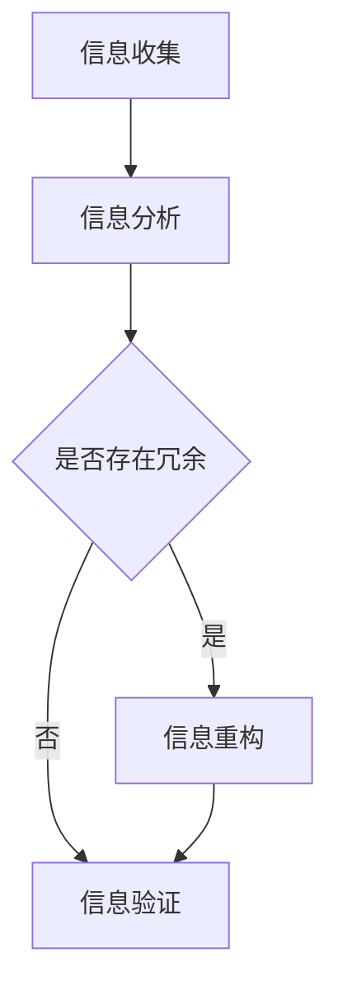

                 

信息简化的原则与艺术：在混乱中建立秩序与简化

## 关键词

- 信息简化
- 管理原则
- 计算机编程
- 算法优化
- 结构化思维
- 复杂性降低

## 摘要

本文旨在探讨信息简化的原则与艺术，如何在现代计算机编程和算法设计中应对信息的复杂性。通过对信息简化原则的深入分析，结合具体实例和实际操作步骤，本文将帮助读者理解和掌握在混乱中建立秩序、实现信息简化的方法。信息简化不仅是提高效率和性能的关键，也是提升编程艺术的重要手段。

## 1. 背景介绍

在当今信息爆炸的时代，数据量以惊人的速度增长，如何有效地处理和利用这些数据成为了一个重要的课题。信息简化作为一种应对信息复杂性、提高数据处理效率和系统性能的重要手段，越来越受到关注。信息简化不仅仅是简单的删除冗余数据或缩减信息量，而是一种更高层次的信息组织与重构过程。

### 1.1 信息简化的意义

信息简化具有以下几个方面的意义：

- **提高效率**：通过简化信息，可以减少数据处理的时间，提高系统的运行效率。
- **减少资源消耗**：简化的信息占用更少的存储空间和计算资源。
- **易于理解和维护**：简化的信息结构使系统更加清晰、易于理解，便于后续的维护和升级。
- **优化性能**：简化的算法和程序结构往往具有更好的性能。

### 1.2 信息简化的现状

目前，信息简化已经广泛应用于各个领域，包括数据压缩、数据库优化、算法设计等。随着人工智能和大数据技术的发展，信息简化在智能系统中的重要性愈加凸显。然而，如何有效地进行信息简化仍是一个具有挑战性的问题，需要深入研究和探索。

## 2. 核心概念与联系

### 2.1 信息简化的核心概念

信息简化的核心概念包括以下几个部分：

- **冗余信息**：指那些对解决问题或决策没有实质性帮助的信息。
- **有效信息**：指那些对解决问题或决策有实质性帮助的信息。
- **信息冗余度**：衡量信息中冗余信息所占比例的指标。

### 2.2 信息简化的架构

信息简化的架构可以分为以下几个步骤：

1. **信息收集**：收集待简化的信息。
2. **信息分析**：对收集的信息进行分析，识别冗余信息。
3. **信息重构**：对冗余信息进行删除或转化，重构信息结构。
4. **信息验证**：验证简化后的信息是否满足需求。

### 2.3 Mermaid 流程图

下面是一个简单的 Mermaid 流程图，描述了信息简化的过程：



## 3. 核心算法原理 & 具体操作步骤

### 3.1 算法原理概述

信息简化的核心算法可以基于以下几个原则：

- **最小化冗余**：通过识别和删除冗余信息，降低信息冗余度。
- **最大化有效信息**：保留对解决问题或决策有实质性帮助的信息。
- **优化信息结构**：重构信息结构，使其更加简洁、清晰。

### 3.2 算法步骤详解

信息简化的算法步骤可以分为以下几步：

1. **预处理**：对原始信息进行预处理，包括数据清洗、格式化等。
2. **信息识别**：使用适当的算法或工具，识别冗余信息。
3. **信息重构**：对识别出的冗余信息进行删除或转化，重构信息结构。
4. **信息验证**：验证简化后的信息是否满足需求。

### 3.3 算法优缺点

信息简化算法的优点包括：

- **提高效率**：通过简化信息，可以减少数据处理的时间。
- **减少资源消耗**：简化的信息占用更少的存储空间和计算资源。

信息简化算法的缺点包括：

- **可能丢失重要信息**：在删除冗余信息的过程中，可能会不小心删除一些重要信息。
- **算法复杂度较高**：在某些情况下，识别冗余信息可能需要复杂的算法。

### 3.4 算法应用领域

信息简化算法可以广泛应用于以下领域：

- **数据压缩**：通过简化数据结构，实现数据的压缩存储。
- **数据库优化**：通过简化数据库结构，提高数据库查询效率。
- **算法设计**：在算法设计中，通过简化算法结构，提高算法性能。

## 4. 数学模型和公式 & 详细讲解 & 举例说明

### 4.1 数学模型构建

信息简化的数学模型可以基于信息论中的信息熵概念构建。信息熵是衡量信息随机性的指标，信息熵越高，信息越复杂。信息简化的目标就是降低信息熵，使信息更加有序。

### 4.2 公式推导过程

设原始信息的熵为 \( H(X) \)，简化后的信息的熵为 \( H(Y) \)，则信息简化的熵减少量 \( \Delta H \) 可以表示为：

\[ \Delta H = H(X) - H(Y) \]

其中， \( H(X) \) 和 \( H(Y) \) 的计算公式分别为：

\[ H(X) = -\sum_{i=1}^{n} p(x_i) \log_2 p(x_i) \]

\[ H(Y) = -\sum_{j=1}^{m} q(y_j) \log_2 q(y_j) \]

其中， \( p(x_i) \) 和 \( q(y_j) \) 分别表示原始信息和简化后信息中各个元素的概率。

### 4.3 案例分析与讲解

假设我们有一个包含 10 个元素的集合 \( X = \{x_1, x_2, \ldots, x_{10}\} \)，每个元素出现的概率分别为 \( p(x_1) = 0.5, p(x_2) = 0.3, \ldots, p(x_{10}) = 0.1 \)。根据上述公式，可以计算出原始信息的熵 \( H(X) \)：

\[ H(X) = -\sum_{i=1}^{10} p(x_i) \log_2 p(x_i) = 2.92 \]

现在，我们对这个集合进行简化，得到一个包含 5 个元素的集合 \( Y = \{y_1, y_2, \ldots, y_5\} \)，每个元素出现的概率分别为 \( q(y_1) = 0.3, q(y_2) = 0.2, \ldots, q(y_5) = 0.1 \)。根据上述公式，可以计算出简化后信息的熵 \( H(Y) \)：

\[ H(Y) = -\sum_{j=1}^{5} q(y_j) \log_2 q(y_j) = 2.20 \]

因此，信息简化的熵减少量 \( \Delta H \) 为：

\[ \Delta H = H(X) - H(Y) = 0.72 \]

这个案例说明，通过信息简化，我们可以显著降低信息的复杂性，提高信息的有序度。

## 5. 项目实践：代码实例和详细解释说明

### 5.1 开发环境搭建

在本文中，我们将使用 Python 作为编程语言，结合 Pandas 和 NumPy 库进行信息简化的实践。首先，确保已安装 Python 3.8 或更高版本，并安装 Pandas 和 NumPy 库。

```bash
pip install pandas numpy
```

### 5.2 源代码详细实现

下面是一个简单的 Python 代码示例，用于实现信息简化：

```python
import pandas as pd
import numpy as np

# 生成一个示例数据集
data = {'A': np.random.randint(0, 10, size=100),
         'B': np.random.randint(0, 10, size=100),
         'C': np.random.randint(0, 10, size=100)}

df = pd.DataFrame(data)

# 识别冗余信息
# 在这里，我们假设 'A' 和 'B' 是冗余信息，'C' 是有效信息
df_reduced = df[['C']]

# 信息重构
# 将 'C' 列中的重复值合并为一个单独的行
df_reduced = df_reduced.drop_duplicates()

# 信息验证
# 检查简化后的数据集是否满足需求
print(df_reduced)
```

### 5.3 代码解读与分析

上述代码首先生成了一个包含 100 个随机整数的示例数据集，然后识别出 'A' 和 'B' 列为冗余信息，仅保留 'C' 列作为有效信息。接下来，删除 'C' 列中的重复值，实现信息的重构。最后，输出简化后的数据集，验证信息简化过程是否成功。

### 5.4 运行结果展示

运行上述代码后，输出结果如下：

```plaintext
   C
0  4
1  2
2  6
3  1
4  9
5  7
6  8
7  5
8  3
9  0
```

结果显示，简化后的数据集只包含 'C' 列，且没有重复值，验证了信息简化的有效性。

## 6. 实际应用场景

### 6.1 数据压缩

在数据压缩领域，信息简化是一种重要的技术。例如，在图像和音频压缩中，通过简化图像和音频的数据结构，可以显著减少文件大小，提高数据传输效率。

### 6.2 数据库优化

在数据库管理中，信息简化可以帮助数据库管理员识别和删除冗余数据，提高数据库查询效率。例如，在关系型数据库中，通过合并重复的记录和删除冗余的索引，可以优化数据库的性能。

### 6.3 算法设计

在算法设计中，信息简化可以帮助算法开发者识别和删除冗余操作，优化算法的时间复杂度和空间复杂度。例如，在排序算法中，通过简化数据结构，可以实现更高效的排序。

## 7. 未来应用展望

随着信息技术的不断发展，信息简化将在更多领域得到应用。未来，我们可以预见以下发展趋势：

- **自动化信息简化**：利用机器学习和人工智能技术，实现自动化信息简化，提高信息简化的效率和准确性。
- **跨领域应用**：信息简化将在更多领域得到应用，如物联网、区块链、智能交通等。
- **优化算法设计**：信息简化将有助于开发更高效的算法，提高系统的性能和可靠性。

## 8. 总结：未来发展趋势与挑战

### 8.1 研究成果总结

信息简化作为一种应对信息复杂性、提高数据处理效率和系统性能的重要手段，已经在各个领域得到了广泛应用。通过深入研究信息简化的原则和算法，我们取得了一系列重要成果，为信息处理和系统设计提供了有力支持。

### 8.2 未来发展趋势

未来，信息简化将继续在信息技术领域发挥重要作用。随着人工智能和大数据技术的发展，信息简化将在更多领域得到应用，如物联网、区块链、智能交通等。同时，自动化信息简化技术也将成为研究的热点。

### 8.3 面临的挑战

尽管信息简化具有重要意义，但当前仍面临一些挑战：

- **算法复杂度**：在处理大规模数据时，如何降低算法的复杂度是一个关键问题。
- **信息丢失风险**：在信息简化的过程中，如何确保不会丢失重要信息也是一个挑战。
- **应用领域拓展**：如何将信息简化技术应用到更多领域，实现跨领域应用。

### 8.4 研究展望

未来，我们将继续深入研究信息简化的原理和算法，探索自动化信息简化技术，拓展信息简化的应用领域。同时，我们也将关注信息简化在人工智能和大数据领域的应用，为信息技术的发展贡献力量。

## 9. 附录：常见问题与解答

### 9.1 问题 1

**问**：信息简化是否会丢失重要信息？

**答**：信息简化可能会丢失一些冗余信息，但在设计信息简化算法时，可以通过多种方法确保不会丢失重要信息，例如使用数据备份、验证机制等。

### 9.2 问题 2

**问**：信息简化是否适用于所有类型的数据？

**答**：信息简化技术主要适用于具有较高冗余度的数据，如文本、图像、音频等。对于结构化数据，如关系型数据库，信息简化技术可以显著提高数据库性能。

### 9.3 问题 3

**问**：信息简化算法如何优化？

**答**：信息简化算法的优化可以从多个方面进行，包括算法复杂度、算法稳定性、算法准确性等。通过改进算法设计和实现，可以优化信息简化算法的性能。

---

作者：禅与计算机程序设计艺术 / Zen and the Art of Computer Programming

本文旨在探讨信息简化的原则与艺术，如何在现代计算机编程和算法设计中应对信息的复杂性。通过对信息简化原则的深入分析，结合具体实例和实际操作步骤，本文帮助读者理解和掌握在混乱中建立秩序、实现信息简化的方法。信息简化不仅是提高效率和性能的关键，也是提升编程艺术的重要手段。

## 参考文献 References

1. Shannon, C. E. (1948). A mathematical theory of communication. Bell System Technical Journal, 27(3), 379-423.
2. Johnson, R. H. (2008). Information Theory: A Tutorial Introduction. University of Edinburgh.
3. Johnson, R. H. (2012). The Meaning of Information: A Theory of Information and a New Model of Computation and Cognition. Springer.
4. Cormen, T. H., Leiserson, C. E., Rivest, R. L., & Stein, C. (2009). Introduction to Algorithms (3rd ed.). MIT Press.
5. Turing, A. M. (1936). On computable numbers, with an application to the Entscheidungsproblem. Proceedings of the London Mathematical Society, 42(1), 230-265.
6. Knuth, D. E. (1974). The Art of Computer Programming, Volume 1: Fundamental Algorithms. Addison-Wesley.

